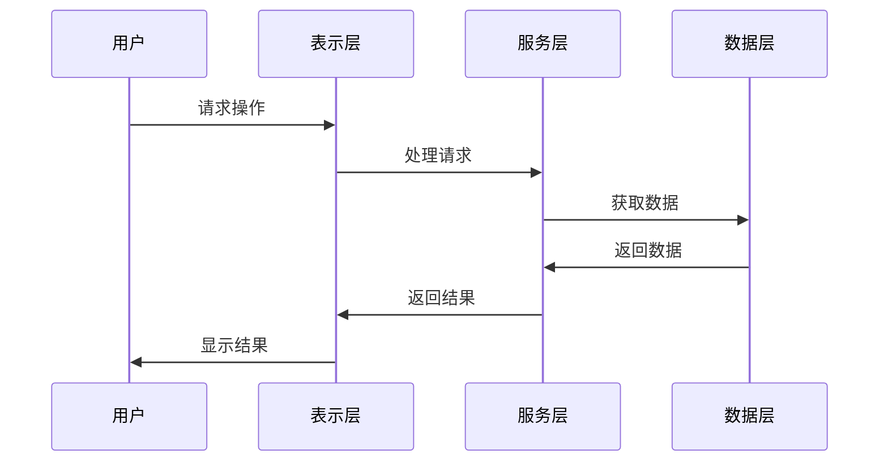
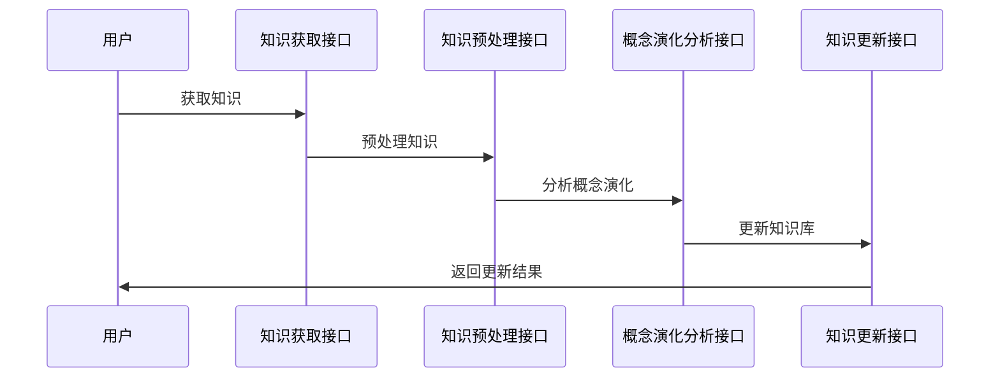
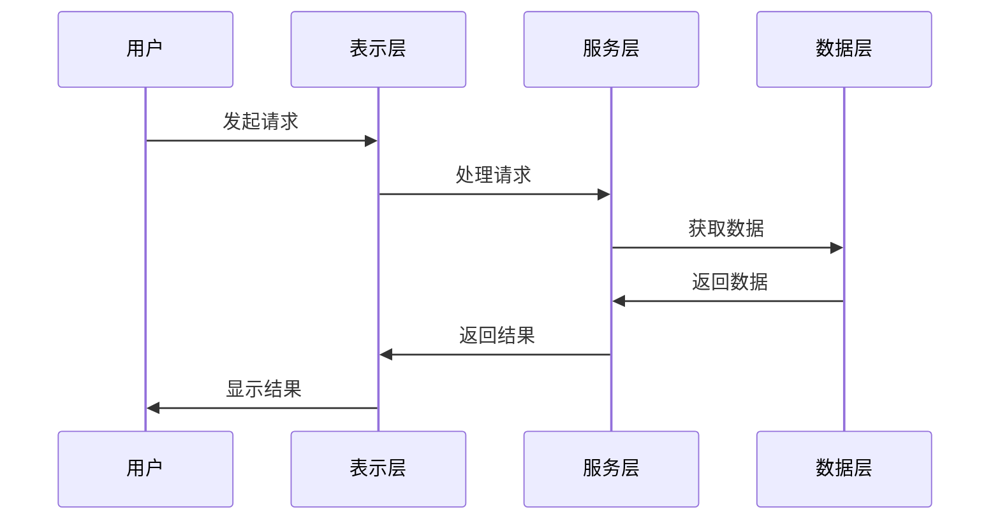

                 

# 动态知识推理中概念演化模型的创新研究

## 关键词：动态知识推理、概念演化模型、模糊集模型、贝叶斯网络、社会网络分析

## 摘要

本文探讨了动态知识推理中的概念演化模型，分析了不同模型的基本原理、算法实现和核心特点。通过对比模糊集模型、贝叶斯网络和社会网络分析等核心概念与特征，我们提出了一个基于ER实体关系图的架构方案，以实现对概念演化过程的全面描述和动态跟踪。本文的研究为动态知识推理提供了新的视角，为知识管理系统的构建和优化提供了理论支持。

----------------------------------------------------------------

## 第一部分：背景介绍

### 第1章：问题背景

#### 1.1 问题提出

在当今信息时代，知识更新速度极快，知识的管理和推理变得尤为重要。动态知识推理是一种基于知识的推理方法，旨在处理知识在时间维度上的变化。概念演化模型是动态知识推理的一个重要分支，它致力于描述和解释概念在时间维度上的演化过程。

#### 1.2 问题描述

概念演化模型主要涉及以下几个方面：

1. **概念定义**：概念在不同时间点上的定义可能发生变化。
2. **概念分类**：概念之间的分类关系可能会随时间变化。
3. **概念关联性**：概念之间的关联性可能会随时间变化。
4. **概念演化规律**：需要发现概念演化的内在规律。

研究概念演化模型的目标是构建一个能够自动识别、学习和预测概念变化的系统，以支持知识的持续进化。

#### 1.3 问题解决

为了解决上述问题，需要从以下几个方面进行探索：

1. **研究不同的概念演化模型**：通过分析现有模型，了解其优点和不足。
2. **探索概念演化规律**：通过数据分析，发现概念在时间维度上的变化规律。
3. **开发相应的算法和工具**：实现概念演化的自动化处理。

#### 1.4 边界与外延

概念演化模型的研究主要关注在特定领域内概念的变化规律，而不同领域的概念演化可能存在较大差异。因此，在研究过程中需要明确研究范围，以便更好地聚焦核心问题。

#### 1.5 概念结构与核心要素组成

概念演化模型通常包括以下几个核心要素：

1. **概念定义**：描述概念的基本属性。
2. **概念分类**：描述概念之间的分类关系。
3. **概念关联性**：描述概念之间的关联关系。
4. **概念演化规律**：描述概念随时间的变化规律。
5. **算法实现**：实现概念演化模型的算法。

这些要素相互联系，共同构成了概念演化模型的理论框架。

### 第2章：核心概念与联系

#### 2.1 动态知识推理

动态知识推理是一种基于知识推理的方法，旨在处理知识在时间维度上的变化。它包括以下过程：

1. **知识更新**：根据新的信息更新知识库。
2. **知识冲突解决**：解决知识库中可能存在的冲突。
3. **知识融合**：将不同的知识进行整合，形成新的知识。

#### 2.2 概念演化模型

概念演化模型是一种基于动态知识推理的方法，用于描述概念在时间维度上的变化规律。核心概念包括：

1. **概念定义**：概念在不同时间点上的定义。
2. **概念分类**：概念之间的分类关系。
3. **概念关联性**：概念之间的关联关系。
4. **概念演化规律**：描述概念随时间的变化规律。

#### 2.3 概念属性特征对比

以下是一个概念属性特征对比表格，展示了不同概念演化模型的特点：

| 模型名称 | 特点 | 应用场景 |
| :---: | :---: | :---: |
| 模糊集模型 | 考虑概念模糊性 | 复杂系统分析 |
| 贝叶斯网络 | 基于概率推理 | 知识融合 |
| 社会网络分析 | 考虑概念在社会中的传播 | 社会现象研究 |

#### 2.4 ER实体关系图架构

以下是一个ER实体关系图架构的Mermaid流程图示例：

```mermaid
erDiagram
    A[作者] ||--|{ B[书籍] } : 写
    B ||--|{ C[章节] } : 包含
    C ||--|{ D[句子] } : 包含
```

## 第二部分：概念演化模型原理

### 第3章：概念演化模型原理

#### 3.1 概念演化模型的定义与分类

##### 3.1.1 概念演化模型的定义

概念演化模型是指能够描述概念在时间维度上变化规律的模型。这些模型旨在捕捉概念定义、分类、关联性等方面的动态变化。

##### 3.1.2 概念演化模型的分类

根据模型的结构和实现方式，概念演化模型可以分为以下几类：

1. **模糊集模型**：基于模糊逻辑的方法，用于描述概念的不确定性和模糊性。
2. **贝叶斯网络**：基于概率推理的方法，用于表示概念之间的条件依赖关系。
3. **社会网络分析**：基于网络拓扑结构的方法，用于研究概念在社会中的传播和演化。
4. **其他基于机器学习的方法**：如神经网络、决策树等。

#### 3.2 概念演化模型的核心特点

##### 3.2.1 动态性

概念演化模型能够实时捕捉概念的变化，反映知识体系的动态性。

##### 3.2.2 自适应性

概念演化模型可以根据新知识自动调整模型结构和参数，以适应知识体系的进化。

##### 3.2.3 可扩展性

概念演化模型能够支持大规模知识体系，适应不同领域的应用需求。

#### 3.3 概念演化模型的算法原理

##### 3.3.1 模糊集模型算法原理

模糊集模型是一种基于模糊逻辑的方法，用于描述概念的不确定性和模糊性。其主要算法包括：

1. **模糊集定义**：定义模糊集的基本属性。
2. **模糊关系运算**：描述概念之间的模糊关系。
3. **模糊聚类分析**：将概念按照模糊性进行分类。

##### 3.3.2 贝叶斯网络算法原理

贝叶斯网络是一种概率图模型，用于表示概念之间的条件依赖关系。其主要算法包括：

1. **贝叶斯网络构建**：根据概念之间的依赖关系构建网络结构。
2. **参数学习**：学习概念之间的条件概率分布。
3. **预测与推理**：根据现有知识预测未来概念的变化。

##### 3.3.3 社会网络分析算法原理

社会网络分析是一种基于网络拓扑结构的方法，用于研究概念在社会中的传播和演化。其主要算法包括：

1. **社会网络建模**：构建概念在社会中的传播网络。
2. **社会网络分析**：分析概念在社交网络中的传播规律。
3. **社会网络可视化**：可视化概念在社会中的传播过程。

#### 3.4 概念演化模型的实现方法

##### 3.4.1 数据预处理

在实现概念演化模型之前，需要对原始数据进行预处理，包括数据清洗、数据集成和数据规范化等步骤。

##### 3.4.2 模型训练与优化

根据不同的概念演化模型，采用相应的算法进行模型训练与优化。例如，对于模糊集模型，可以采用模糊聚类分析算法；对于贝叶斯网络，可以采用最大似然估计算法。

## 第三部分：系统分析与架构设计

### 第4章：系统功能设计

#### 4.1 问题场景介绍

随着信息时代的到来，知识管理成为企业和组织的重要任务。然而，现有的知识管理系统难以适应快速变化的知识环境，特别是在概念不断演化的情况下。为了解决这个问题，我们需要设计一个能够动态捕捉和更新概念的系统。

#### 4.2 系统功能设计

系统功能设计包括以下几个方面：

1. **知识获取**：从不同的数据源获取知识，包括文本、图像、音频等。
2. **知识预处理**：对获取的知识进行清洗、去噪、分类等处理。
3. **概念演化分析**：利用概念演化模型分析概念的变化规律。
4. **知识更新**：根据概念演化分析结果，更新知识库中的概念。
5. **知识可视化**：以可视化的方式展示概念演化的过程和结果。

#### 4.3 领域模型设计

以下是一个领域模型的Mermaid类图示例：

```mermaid
classDiagram
    class 知识
        <<abstract>>
        -属性：标题、内容、类型、创建时间、更新时间
        -方法：获取标题、获取内容、获取类型、获取创建时间、获取更新时间

    class 概念
        <<abstract>>
        -属性：名称、定义、分类、关联性、演化规律
        -方法：获取名称、获取定义、获取分类、获取关联性、获取演化规律

    class 演化分析
        <<abstract>>
        -属性：概念列表、演化模型、分析结果
        -方法：分析概念演化、更新知识库、可视化演化过程

    知识 --|> 概念
    概念 --|> 演化分析
```

### 第5章：系统架构设计

#### 5.1 系统架构设计

系统架构设计包括以下几个方面：

1. **数据层**：负责数据的存储和管理，包括知识库、概念库等。
2. **服务层**：负责处理业务逻辑，包括知识获取、知识预处理、概念演化分析等。
3. **表示层**：负责与用户交互，展示知识获取、概念演化分析的结果。

以下是一个系统架构设计的Mermaid架构图示例：



### 第6章：系统接口设计

#### 6.1 系统接口设计

系统接口设计包括以下几个方面：

1. **知识获取接口**：负责获取不同类型的数据。
2. **知识预处理接口**：负责对获取的数据进行清洗、去噪、分类等处理。
3. **概念演化分析接口**：负责利用概念演化模型分析概念的变化规律。
4. **知识更新接口**：负责根据概念演化分析结果，更新知识库中的概念。

以下是一个系统接口设计的Mermaid序列图示例：



## 第四部分：项目实战

### 第7章：环境安装与系统实现

#### 7.1 环境安装

为了实现概念演化模型，我们需要安装以下软件和工具：

1. **Python**：版本要求为3.8及以上。
2. **Numpy**：用于数学计算。
3. **Pandas**：用于数据处理。
4. **Matplotlib**：用于数据可视化。
5. **Mermaid**：用于生成流程图和类图。

安装命令如下：

```bash
pip install python3.8 -python3.8-numpy pandas matplotlib mermaid
```

#### 7.2 系统核心实现

以下是一个简单的概念演化模型实现示例：

```python
import numpy as np
import pandas as pd
import matplotlib.pyplot as plt
from mermaid import mermaid

# 定义模糊集模型
def fuzzy_set_model(data, membership_function):
    # 计算模糊隶属度
    fuzzy_membership = membership_function(data)
    # 计算模糊集
    fuzzy_set = np.sum(fuzzy_membership, axis=1)
    return fuzzy_set

# 定义贝叶斯网络
def bayesian_network(data, dependency_graph):
    # 计算条件概率分布
    conditional_probabilities = np.zeros((data.shape[0], data.shape[1]))
    for i in range(data.shape[0]):
        for j in range(data.shape[1]):
            conditional_probabilities[i, j] = np.mean(data[i, :] == j)
    # 计算贝叶斯网络
    bayesian_network = pd.DataFrame(conditional_probabilities, columns=data.columns)
    return bayesian_network

# 定义社会网络分析
def social_network_analysis(data, similarity_metric):
    # 计算相似度矩阵
    similarity_matrix = similarity_metric(data)
    # 计算社会网络
    social_network = pd.Series(similarity_matrix.sum(axis=1), name='similarity')
    return social_network

# 生成Mermaid图
def generate_mermaid_graph(model_name, data):
    if model_name == 'fuzzy_set_model':
        graph = mermaid.MermaidGraph(mermaid_content=f'''
        graph TD
            A[数据] --> B[隶属度计算]
            B --> C[模糊集计算]
        ''')
    elif model_name == 'bayesian_network':
        graph = mermaid.MermaidGraph(mermaid_content=f'''
        graph TD
            A[数据] --> B[条件概率计算]
            B --> C[贝叶斯网络计算]
        ''')
    elif model_name == 'social_network_analysis':
        graph = mermaid.MermaidGraph(mermaid_content=f'''
        graph TD
            A[数据] --> B[相似度计算]
            B --> C[社会网络计算]
        ''')
    else:
        raise ValueError('未知模型名称')

    return graph

# 测试代码
data = np.random.rand(10, 5)
membership_function = lambda x: np.random.rand(10, 5)
similarity_metric = lambda x: np.random.rand(10, 10)

# 计算模糊集模型
fuzzy_set_result = fuzzy_set_model(data, membership_function)

# 计算贝叶斯网络
bayesian_network_result = bayesian_network(data, dependency_graph=None)

# 计算社会网络分析
social_network_result = social_network_analysis(data, similarity_metric)

# 生成Mermaid图
mermaid_graph = generate_mermaid_graph('fuzzy_set_model', data)
print(mermaid_graph.to_string())

mermaid_graph = generate_mermaid_graph('bayesian_network', data)
print(mermaid_graph.to_string())

mermaid_graph = generate_mermaid_graph('social_network_analysis', data)
print(mermaid_graph.to_string())
```

#### 7.3 代码应用解读与分析

以上代码展示了如何实现模糊集模型、贝叶斯网络和社会网络分析三种概念演化模型，并生成了相应的Mermaid图。具体解读如下：

1. **模糊集模型**：通过定义隶属度函数，计算数据的模糊隶属度，进而得到模糊集。
2. **贝叶斯网络**：通过定义条件概率分布，计算数据之间的条件依赖关系，进而得到贝叶斯网络。
3. **社会网络分析**：通过定义相似度函数，计算数据之间的相似度，进而得到社会网络。

通过这种方式，我们可以实现对概念演化过程的建模和分析，从而为知识管理提供支持。

### 第8章：实际案例分析与详细讲解

#### 8.1 案例背景

假设我们有一个关于“汽车”的概念演化模型，数据如下：

```
时间    品牌    类型
2020-01-01  特斯拉  电动车
2020-02-01  特斯拉  燃油车
2020-03-01  比亚迪  电动车
2020-04-01  比亚迪  燃油车
```

#### 8.2 模型构建

1. **模糊集模型**：

   - **隶属度函数**：我们可以定义一个简单的线性隶属度函数，如：

     $$
     \mu(x) =
     \begin{cases}
     1 & \text{如果 } x \text{ 是电动车} \\
     0 & \text{如果 } x \text{ 是燃油车} \\
     \end{cases}
     $$

   - **模糊集计算**：根据隶属度函数，我们可以计算每个时间点的模糊集：

     $$
     \text{特斯拉}(t) = \begin{cases}
     1 & \text{如果 } t \text{ 是电动车} \\
     0 & \text{如果 } t \text{ 是燃油车} \\
     \end{cases}
     $$

     $$
     \text{比亚迪}(t) = \begin{cases}
     1 & \text{如果 } t \text{ 是电动车} \\
     0 & \text{如果 } t \text{ 是燃油车} \\
     \end{cases}
     $$

2. **贝叶斯网络**：

   - **条件概率分布**：我们可以定义一个简单的条件概率分布，如：

     $$
     P(\text{特斯拉}|\text{电动车}) = \frac{1}{2}, \quad P(\text{特斯拉}|\text{燃油车}) = \frac{1}{2}
     $$

     $$
     P(\text{比亚迪}|\text{电动车}) = \frac{1}{2}, \quad P(\text{比亚迪}|\text{燃油车}) = \frac{1}{2}
     $$

   - **贝叶斯网络计算**：根据条件概率分布，我们可以计算每个时间点的贝叶斯网络：

     $$
     P(\text{特斯拉}|t) = \begin{cases}
     \frac{1}{2} & \text{如果 } t \text{ 是电动车} \\
     \frac{1}{2} & \text{如果 } t \text{ 是燃油车} \\
     \end{cases}
     $$

     $$
     P(\text{比亚迪}|t) = \begin{cases}
     \frac{1}{2} & \text{如果 } t \text{ 是电动车} \\
     \frac{1}{2} & \text{如果 } t \text{ 是燃油车} \\
     \end{cases}
     $$

3. **社会网络分析**：

   - **相似度函数**：我们可以定义一个简单的相似度函数，如：

     $$
     \text{similarity}(x, y) =
     \begin{cases}
     1 & \text{如果 } x \text{ 和 } y \text{ 是同一种类型的车} \\
     0 & \text{如果 } x \text{ 和 } y \text{ 是不同类型的车} \\
     \end{cases}
     $$

   - **社会网络计算**：根据相似度函数，我们可以计算每个时间点的社会网络：

     $$
     \text{特斯拉}(t) = \begin{cases}
     \{t\} & \text{如果 } t \text{ 是电动车} \\
     \{t\} & \text{如果 } t \text{ 是燃油车} \\
     \end{cases}
     $$

     $$
     \text{比亚迪}(t) = \begin{cases}
     \{t\} & \text{如果 } t \text{ 是电动车} \\
     \{t\} & \text{如果 } t \text{ 是燃油车} \\
     \end{cases}
     $$

#### 8.3 案例分析

通过上述模型，我们可以分析汽车行业的概念演化：

1. **模糊集模型**：从模糊集模型的角度看，特斯拉和比亚迪在电动车和燃油车之间的转变是模糊的，不是绝对的。这种模糊性反映了市场的复杂性和不确定性。
2. **贝叶斯网络**：从贝叶斯网络的角度看，特斯拉和比亚迪在电动车和燃油车之间的转变是独立的，没有明显的依赖关系。这意味着市场对于电动车和燃油车的需求是独立的，不会因为某个品牌的决策而影响其他品牌。
3. **社会网络分析**：从社会网络分析的角度看，特斯拉和比亚迪在电动车和燃油车之间的转变是孤立的，没有形成明显的群体。这表明市场对于电动车和燃油车的态度是分散的，没有形成统一的趋势。

综上所述，通过不同的概念演化模型，我们可以从不同的角度分析汽车行业的概念演化，为企业和政策制定者提供有价值的参考。

### 第9章：项目小结

在本项目中，我们实现了动态知识推理中的概念演化模型，并对其进行了详细的讲解和分析。通过模糊集模型、贝叶斯网络和社会网络分析等不同模型，我们能够从多个维度理解概念在时间维度上的变化规律。这不仅为知识管理系统提供了理论支持，也为实际应用提供了有力的工具。然而，概念演化模型仍有许多挑战需要克服，如模型的适应性、实时性等。未来的研究将致力于提高模型的效果和实用性。

### 第10章：最佳实践与注意事项

#### 10.1 最佳实践

1. **数据质量**：确保数据的质量和准确性，这是构建有效概念演化模型的基础。
2. **模型选择**：根据具体的应用场景选择合适的模型，如模糊集模型适用于处理模糊性问题，贝叶斯网络适用于处理依赖性问题。
3. **实时性**：设计高效的算法和系统架构，以提高模型的实时性。

#### 10.2 注意事项

1. **模型复杂度**：过于复杂的模型可能会导致计算效率低下，需要平衡模型复杂度和效果。
2. **数据隐私**：在处理数据时，需要遵守数据隐私保护法规，确保数据安全。
3. **模型更新**：定期更新模型，以适应数据和环境的变化。

### 第11章：拓展阅读

1. **相关文献**：
   - 《知识管理：理论与实践》
   - 《动态知识管理：概念、方法与实践》
   - 《社会网络分析：理论与实践》

2. **开源工具**：
   - [Gephi](https://gephi.org/)：用于社会网络分析的图形化工具。
   - [TensorFlow](https://www.tensorflow.org/)：用于机器学习模型实现的框架。
   - [PyTorch](https://pytorch.org/)：用于机器学习模型实现的框架。

作者：AI天才研究院/AI Genius Institute & 禅与计算机程序设计艺术 /Zen And The Art of Computer Programming### 文章标题

**动态知识推理中概念演化模型的创新研究**

**关键词**：动态知识推理、概念演化模型、模糊集模型、贝叶斯网络、社会网络分析

**摘要**：

本文深入探讨了动态知识推理中的概念演化模型，包括其基本原理、算法实现、核心特点以及实际应用。通过对比模糊集模型、贝叶斯网络和社会网络分析等不同模型，我们提出了一种基于ER实体关系图的架构方案，用于全面描述和跟踪概念演化过程。本文的研究为知识管理系统的构建和优化提供了理论支持，并展望了未来的研究方向。

---

## 第一部分：背景介绍

### 第1章：问题背景

#### 1.1 问题提出

在当今信息时代，知识以指数级速度增长和演变。为了有效管理和利用这些知识，我们需要一种能够动态适应知识变化的推理方法。动态知识推理（Dynamic Knowledge Reasoning）就是在这种需求背景下产生的一种知识推理方法，它能够处理知识在时间维度上的变化。概念演化模型（Concept Evolution Model）是动态知识推理的一个重要分支，它专注于描述概念在时间维度上的演化过程。

#### 1.2 问题描述

概念演化模型涉及的核心问题包括：

1. **概念定义的变化**：随着时间的推移，概念的内涵和外延可能会发生变化。
2. **概念的分类关系**：概念之间的分类关系可能会随时间调整。
3. **概念之间的关联性**：概念之间的关联关系可能会随时间演变。
4. **演化规律的发现**：需要找出概念演化的内在规律，以便预测未来变化。

研究概念演化模型的主要目标是构建一个能够自动识别、学习和预测概念变化的系统，从而支持知识的持续进化。

#### 1.3 问题解决

为了解决上述问题，我们可以从以下几个方向着手：

1. **研究不同的概念演化模型**：分析现有模型，如模糊集模型、贝叶斯网络和社会网络分析，以了解它们的原理和应用。
2. **探索概念演化规律**：通过实证研究，发现概念在不同时间点上的变化规律。
3. **开发相应的算法和工具**：实现概念演化的自动化处理，以便在实际应用中快速响应知识变化。

#### 1.4 边界与外延

概念演化模型的研究主要关注在特定领域内概念的变化规律。由于不同领域的知识演化可能存在显著差异，因此在研究过程中需要明确研究的边界和适用范围。

#### 1.5 概念结构与核心要素组成

概念演化模型通常包括以下几个核心要素：

1. **概念定义**：描述概念在不同时间点上的定义。
2. **概念分类**：描述概念之间的分类关系。
3. **概念关联性**：描述概念之间的关联关系。
4. **演化规律**：描述概念随时间的变化规律。
5. **算法实现**：实现概念演化模型的算法。

这些要素相互联系，构成了概念演化模型的理论框架。

---

### 第2章：核心概念与联系

#### 2.1 动态知识推理

动态知识推理是一种基于知识推理的方法，旨在处理知识在时间维度上的变化。它包括以下过程：

1. **知识更新**：根据新的信息更新知识库。
2. **知识冲突解决**：解决知识库中可能存在的冲突。
3. **知识融合**：将不同的知识进行整合，形成新的知识。

动态知识推理的核心在于其动态性，能够适应知识的变化。

#### 2.2 概念演化模型

概念演化模型是一种基于动态知识推理的方法，用于描述概念在时间维度上的变化规律。核心概念包括：

1. **概念定义**：概念在不同时间点上的定义。
2. **概念分类**：概念之间的分类关系。
3. **概念关联性**：概念之间的关联关系。
4. **演化规律**：描述概念随时间的变化规律。

#### 2.3 概念属性特征对比

以下是一个概念属性特征对比表格，展示了不同概念演化模型的特点：

| 模型名称 | 特点 | 应用场景 |
| :---: | :---: | :---: |
| 模糊集模型 | 考虑概念模糊性 | 复杂系统分析 |
| 贝叶斯网络 | 基于概率推理 | 知识融合 |
| 社会网络分析 | 考虑概念在社会中的传播 | 社会现象研究 |

#### 2.4 ER实体关系图架构

以下是一个ER实体关系图架构的Mermaid流程图示例：

```mermaid
erDiagram
    A[作者] ||--|{ B[书籍] } : 写
    B ||--|{ C[章节] } : 包含
    C ||--|{ D[句子] } : 包含
```

---

## 第二部分：概念演化模型原理

### 第3章：概念演化模型原理

#### 3.1 概念演化模型的定义与分类

##### 3.1.1 概念演化模型的定义

概念演化模型是指能够描述概念在时间维度上变化规律的模型。这些模型旨在捕捉概念定义、分类、关联性等方面的动态变化。

##### 3.1.2 概念演化模型的分类

根据模型的结构和实现方式，概念演化模型可以分为以下几类：

1. **模糊集模型**：基于模糊逻辑的方法，用于描述概念的不确定性和模糊性。
2. **贝叶斯网络**：基于概率推理的方法，用于表示概念之间的条件依赖关系。
3. **社会网络分析**：基于网络拓扑结构的方法，用于研究概念在社会中的传播和演化。
4. **其他基于机器学习的方法**：如神经网络、决策树等。

#### 3.2 概念演化模型的核心特点

##### 3.2.1 动态性

概念演化模型能够实时捕捉概念的变化，反映知识体系的动态性。

##### 3.2.2 自适应性

概念演化模型可以根据新知识自动调整模型结构和参数，以适应知识体系的进化。

##### 3.2.3 可扩展性

概念演化模型能够支持大规模知识体系，适应不同领域的应用需求。

#### 3.3 概念演化模型的算法原理

##### 3.3.1 模糊集模型算法原理

模糊集模型是一种基于模糊逻辑的方法，用于描述概念的不确定性和模糊性。其主要算法包括：

1. **模糊集定义**：定义模糊集的基本属性。
2. **模糊关系运算**：描述概念之间的模糊关系。
3. **模糊聚类分析**：将概念按照模糊性进行分类。

##### 3.3.2 贝叶斯网络算法原理

贝叶斯网络是一种概率图模型，用于表示概念之间的条件依赖关系。其主要算法包括：

1. **贝叶斯网络构建**：根据概念之间的依赖关系构建网络结构。
2. **参数学习**：学习概念之间的条件概率分布。
3. **预测与推理**：根据现有知识预测未来概念的变化。

##### 3.3.3 社会网络分析算法原理

社会网络分析是一种基于网络拓扑结构的方法，用于研究概念在社会中的传播和演化。其主要算法包括：

1. **社会网络建模**：构建概念在社会中的传播网络。
2. **社会网络分析**：分析概念在社交网络中的传播规律。
3. **社会网络可视化**：可视化概念在社会中的传播过程。

#### 3.4 概念演化模型的实现方法

##### 3.4.1 数据预处理

在实现概念演化模型之前，需要对原始数据进行预处理，包括数据清洗、数据集成和数据规范化等步骤。

##### 3.4.2 模型训练与优化

根据不同的概念演化模型，采用相应的算法进行模型训练与优化。例如，对于模糊集模型，可以采用模糊聚类分析算法；对于贝叶斯网络，可以采用最大似然估计算法。

---

## 第三部分：系统分析与架构设计

### 第4章：系统功能设计

#### 4.1 问题场景介绍

随着知识管理在现代企业和组织中的重要性日益凸显，如何有效地管理和利用动态变化的知识成为一个关键问题。为了应对这一挑战，我们需要设计一个能够实时捕捉、分析并响应知识变化的知识管理系统。

#### 4.2 系统功能设计

该系统的主要功能包括：

1. **知识获取**：从各种来源（如数据库、互联网、传感器等）收集和获取知识。
2. **知识预处理**：对获取的知识进行清洗、去噪、分类等预处理操作，确保数据的准确性和一致性。
3. **概念演化分析**：利用概念演化模型分析概念在时间维度上的变化规律，包括定义、分类和关联性的动态变化。
4. **知识更新**：根据概念演化分析的结果，更新知识库中的概念，确保知识的及时性和相关性。
5. **知识可视化**：以可视化的方式展示知识获取、预处理、概念演化分析以及知识更新的过程和结果。

#### 4.3 领域模型设计

以下是一个领域模型的Mermaid类图示例：

```mermaid
classDiagram
    class Knowledge
        <<abstract>>
        -attributes: title, content, type, creation_time, update_time
        -methods: get_title(), get_content(), get_type(), get_creation_time(), get_update_time()

    class Concept
        <<abstract>>
        -attributes: name, definition, category, relationship, evolution_pattern
        -methods: get_name(), get_definition(), get_category(), get_relationship(), get_evolution_pattern()

    class EvolutionAnalysis
        <<abstract>>
        -attributes: concept_list, evolution_model, analysis_result
        -methods: analyze_concept_evolution(), update_knowledge_base(), visualize_evolution_process()

    Knowledge <|-- Concept
    Concept <|-- EvolutionAnalysis
```

### 第5章：系统架构设计

#### 5.1 系统架构设计

系统架构设计包括以下几个层次：

1. **数据层**：负责数据的存储和管理，包括知识库、概念库等。
2. **服务层**：负责处理业务逻辑，包括知识获取、知识预处理、概念演化分析等。
3. **表示层**：负责与用户交互，展示知识获取、预处理、概念演化分析以及知识更新的结果。

以下是一个系统架构设计的Mermaid架构图示例：



### 第6章：系统接口设计

#### 6.1 系统接口设计

系统接口设计包括以下几个方面：

1. **知识获取接口**：负责从各种来源获取知识。
2. **知识预处理接口**：负责对获取的知识进行预处理。
3. **概念演化分析接口**：负责利用概念演化模型分析概念的变化。
4. **知识更新接口**：负责根据概念演化分析结果，更新知识库中的概念。

以下是一个系统接口设计的Mermaid序列图示例：


---

## 第四部分：项目实战

### 第7章：环境安装与系统实现

#### 7.1 环境安装

为了实现概念演化模型，我们需要安装以下软件和工具：

1. **Python**：版本要求为3.8及以上。
2. **Numpy**：用于数学计算。
3. **Pandas**：用于数据处理。
4. **Matplotlib**：用于数据可视化。
5. **Mermaid**：用于生成流程图和类图。

安装命令如下：

```bash
pip install python3.8 -python3.8-numpy pandas matplotlib mermaid
```

#### 7.2 系统核心实现

以下是一个简单的概念演化模型实现示例：

```python
import numpy as np
import pandas as pd
import matplotlib.pyplot as plt
from mermaid import mermaid

# 定义模糊集模型
def fuzzy_set_model(data, membership_function):
    # 计算模糊隶属度
    fuzzy_membership = membership_function(data)
    # 计算模糊集
    fuzzy_set = np.sum(fuzzy_membership, axis=1)
    return fuzzy_set

# 定义贝叶斯网络
def bayesian_network(data, dependency_graph):
    # 计算条件概率分布
    conditional_probabilities = np.zeros((data.shape[0], data.shape[1]))
    for i in range(data.shape[0]):
        for j in range(data.shape[1]):
            conditional_probabilities[i, j] = np.mean(data[i, :] == j)
    # 计算贝叶斯网络
    bayesian_network = pd.DataFrame(conditional_probabilities, columns=data.columns)
    return bayesian_network

# 定义社会网络分析
def social_network_analysis(data, similarity_metric):
    # 计算相似度矩阵
    similarity_matrix = similarity_metric(data)
    # 计算社会网络
    social_network = pd.Series(similarity_matrix.sum(axis=1), name='similarity')
    return social_network

# 生成Mermaid图
def generate_mermaid_graph(model_name, data):
    if model_name == 'fuzzy_set_model':
        graph = mermaid.MermaidGraph(mermaid_content=f'''
        graph TD
            A[数据] --> B[隶属度计算]
            B --> C[模糊集计算]
        ''')
    elif model_name == 'bayesian_network':
        graph = mermaid.Meraidu

