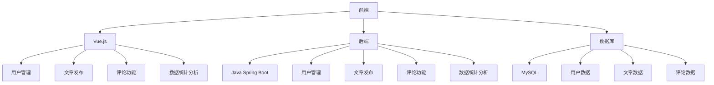
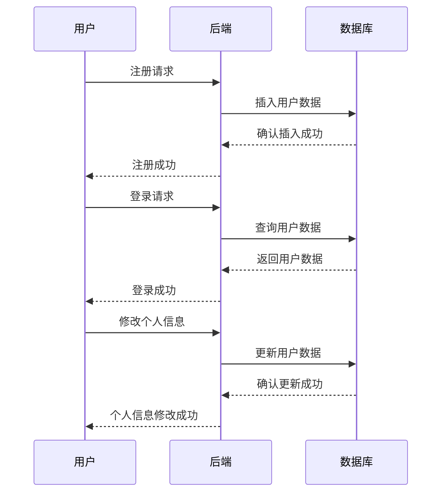

                 


### 动态类型vs静态类型：罗素会怎么看？

#### 关键词
- 动态类型
- 静态类型
- 伯特兰·罗素
- 类型论
- 编程语言

#### 摘要
本文探讨了动态类型和静态类型的编程语言特性，通过比较两者的优缺点，以及借鉴伯特兰·罗素的类型论，分析了两者在编程语言设计中的潜在影响。文章以罗素的理论为基础，探讨类型系统的未来发展趋势，并提出一些建议，以期为程序员和编程语言设计者提供参考。

## 引言

### 1.1 问题背景

#### 计算机语言发展历程

计算机语言的发展经历了多个阶段，从机器语言到汇编语言，再到高级编程语言。每一种语言的出现都代表着对计算机编程的抽象程度的提升。在早期的编程实践中，机器语言和汇编语言由于与硬件的紧密耦合，使得程序编写变得复杂且易于出错。随着计算机科学的进步，人们开始探索更高层次的抽象语言，如C、Java和Python等。

#### 动态类型与静态类型概念

动态类型和静态类型是两种不同的类型系统。动态类型语言在运行时检查类型，而静态类型语言则在编译时进行类型检查。这种差异导致了两种语言在编程风格、性能、错误检测等方面的不同。

#### 伯特兰·罗素与类型论

伯特兰·罗素是20世纪早期的一位数学家和哲学家，他提出了类型论，以解决数学中的自引用问题。类型论的核心思想是，不同的数学对象应具有不同的类型，以防止错误的发生。

### 1.2 问题描述

#### 动态类型与静态类型的异同

动态类型和静态类型在编程中各有优势。动态类型允许更灵活的编程，而静态类型可以提高程序的运行效率和错误检测能力。

#### 当前主流编程语言的类型系统

目前，主流编程语言如Java、C++和Python等都支持动态类型和静态类型。例如，Java是一种静态类型的语言，而Python则是一种动态类型的语言。

### 1.3 问题解决思路

#### 罗素类型论的影响

罗素的类型论对现代编程语言的设计有着重要影响。例如，强类型语言的设计往往借鉴了罗素类型论的某些思想。

#### 动态类型与静态类型的优缺点分析

动态类型和静态类型都有其适用的场景。了解两者的优缺点有助于程序员选择合适的语言和类型系统。

#### 边界与外延

动态类型和静态类型在不同领域有各自的应用。例如，动态类型在Web开发中非常流行，而静态类型在系统编程中更为常见。

### 1.4 边界与外延

#### 动态类型应用领域

动态类型语言通常用于快速开发、脚本编写和Web开发等领域。

#### 静态类型应用领域

静态类型语言在性能要求较高、安全性要求较高的场景中应用更广泛，如系统编程、嵌入式系统和科学计算等领域。

## 第一部分：引论

### 第1章：问题背景与概述

#### 1.1 问题背景

#### 计算机语言发展历程

计算机语言的发展历程可以分为几个关键阶段。从早期的机器语言（Machine Language）到汇编语言（Assembly Language），再到高级编程语言（High-Level Programming Language），每一次进步都标志着对计算机编程抽象程度的提升。

**机器语言**

机器语言是最底层的编程语言，它直接使用计算机的指令集进行编程。每条指令都对应计算机硬件的具体操作，如加法、减法、跳转等。由于机器语言与硬件的紧密耦合，程序员需要深入了解计算机的内部结构，这使得程序编写变得复杂且容易出错。

**汇编语言**

为了简化程序编写，汇编语言应运而生。汇编语言使用助记符（mnemonics）代替机器语言中的二进制指令，使得程序更易于阅读和理解。然而，汇编语言仍然需要与特定的硬件架构紧密关联，程序的可移植性较差。

**高级编程语言**

随着计算机科学的进步，高级编程语言如C、Java和Python等逐渐取代了低级语言。高级语言提供了更强大的抽象能力，使得程序员可以专注于解决问题，而不必担心底层的硬件细节。这种抽象不仅提高了编程效率，还降低了程序出错的可能性。

#### 动态类型与静态类型概念

动态类型和静态类型是两种不同的类型系统。它们在编译和运行时的处理方式不同，从而影响了编程风格、性能和错误检测。

**动态类型**

动态类型语言在运行时进行类型检查。这意味着变量在声明时不需要指定类型，而是根据赋值时的值来确定类型。这种灵活性使得动态类型语言在开发过程中更易于编写和调试。

**静态类型**

静态类型语言在编译时进行类型检查。这意味着变量在声明时必须指定类型，并且在整个程序运行期间保持不变。这种严格的类型检查可以提高程序的运行效率和错误检测能力。

#### 伯特兰·罗素与类型论

伯特兰·罗素（Bertrand Russell）是20世纪早期的一位数学家和哲学家。他在研究数学基础时提出了类型论（Type Theory），以解决自引用问题。类型论的核心思想是，不同的数学对象应具有不同的类型，以防止错误的发生。

**类型论的基本思想**

类型论认为，每个数学对象都有其特定的类型，不同类型的对象不能直接进行比较或组合。这种分类机制有助于防止逻辑错误和数学悖论。

**类型论的影响**

罗素的类型论对现代编程语言的设计有着深远的影响。许多现代编程语言，如TypeScript和Scala，都借鉴了类型论的思想，以提供更强大的类型检查和类型推导功能。

### 1.2 问题描述

#### 动态类型与静态类型的异同

动态类型和静态类型在编程中各有优势。动态类型允许更灵活的编程，而静态类型可以提高程序的运行效率和错误检测能力。

**动态类型的优势**

- **灵活性**：动态类型语言允许在运行时动态确定变量类型，这使得编程更加灵活，特别是对于需要快速迭代的开发场景。
- **简化语法**：动态类型语言通常具有更简洁的语法，这使得编程过程更加高效。
- **降低开发成本**：动态类型语言通常不需要在编译时进行类型检查，因此可以更快地完成开发。

**动态类型的挑战**

- **运行时错误**：由于类型检查是在运行时进行的，因此动态类型语言可能更容易出现运行时错误，如类型不匹配或空指针异常。
- **性能开销**：动态类型语言在运行时需要进行类型检查，这可能会引入额外的性能开销。

**静态类型的优势**

- **错误检测**：静态类型语言在编译时进行类型检查，可以提前发现并修复类型错误，提高代码质量。
- **运行效率**：静态类型语言通常具有更高的运行效率，因为编译器可以生成更优化的代码。
- **可维护性**：静态类型语言通常具有更好的可维护性，因为类型信息可以帮助程序员更好地理解代码的结构和意图。

**静态类型的挑战**

- **开发成本**：静态类型语言通常需要更长的编译时间，并且在编写代码时需要更多的类型声明，这可能会增加开发成本。
- **灵活性**：静态类型语言可能在某些场景下不如动态类型语言灵活，因为类型限制可能会限制代码的灵活性。

#### 当前主流编程语言的类型系统

目前，主流编程语言如Java、C++和Python等都支持动态类型和静态类型。例如，Java是一种静态类型的语言，而Python则是一种动态类型的语言。

**Java**

Java是一种静态类型的语言，它的类型系统确保了在编译时进行严格的类型检查。这种严格的类型检查有助于提高代码质量和运行效率。

**C++**

C++是一种支持动态类型和静态类型的语言。尽管C++在早期主要用于系统编程，但现代C++也广泛应用于Web开发、游戏开发等领域。C++的灵活性使其能够适应不同的开发需求。

**Python**

Python是一种动态类型的语言，它以其简洁的语法和快速的开发速度而受到广泛欢迎。Python在Web开发、数据分析、科学计算等领域有着广泛的应用。

### 1.3 问题解决思路

#### 罗素类型论的影响

罗素的类型论对现代编程语言的设计有着重要影响。许多现代编程语言，如TypeScript和Scala，都借鉴了类型论的思想，以提供更强大的类型检查和类型推导功能。

**类型论在编程语言设计中的应用**

- **类型推导**：许多现代编程语言采用类型推导机制，自动确定变量的类型，从而简化代码编写。
- **静态类型检查**：静态类型检查可以提前发现类型错误，提高代码质量。
- **模式匹配**：模式匹配是类型论的一个重要概念，它允许程序员在编写代码时进行更精确的类型检查。

#### 动态类型与静态类型的优缺点分析

动态类型和静态类型都有其适用的场景。了解两者的优缺点有助于程序员选择合适的语言和类型系统。

**动态类型的优缺点**

- **优点**：
  - **灵活性**：动态类型允许在运行时动态确定变量类型，适合快速迭代开发。
  - **简化语法**：动态类型语言通常具有更简洁的语法，易于编写和阅读。
  - **降低开发成本**：动态类型语言通常不需要在编译时进行类型检查，可以更快地完成开发。

- **缺点**：
  - **运行时错误**：由于类型检查是在运行时进行的，动态类型语言可能更容易出现运行时错误。
  - **性能开销**：动态类型语言在运行时需要进行类型检查，可能会引入额外的性能开销。

**静态类型的优缺点**

- **优点**：
  - **错误检测**：静态类型语言在编译时进行类型检查，可以提前发现并修复类型错误，提高代码质量。
  - **运行效率**：静态类型语言通常具有更高的运行效率，因为编译器可以生成更优化的代码。
  - **可维护性**：静态类型语言通常具有更好的可维护性，因为类型信息可以帮助程序员更好地理解代码的结构和意图。

- **缺点**：
  - **开发成本**：静态类型语言通常需要更长的编译时间，并且在编写代码时需要更多的类型声明，可能会增加开发成本。
  - **灵活性**：静态类型语言可能在某些场景下不如动态类型语言灵活，因为类型限制可能会限制代码的灵活性。

#### 边界与外延

动态类型和静态类型在不同领域有各自的应用。

**动态类型应用领域**

- **Web开发**：动态类型语言如JavaScript和Python在Web开发中非常流行，因为它们允许快速迭代和灵活的编程风格。
- **脚本编写**：动态类型语言如Python和Ruby常用于脚本编写，因为它们具有简洁的语法和高效的开发流程。
- **数据分析**：动态类型语言如Python和R在数据分析中广泛应用，因为它们提供了丰富的库和工具。

**静态类型应用领域**

- **系统编程**：静态类型语言如C和C++在系统编程中应用广泛，因为它们提供了强大的性能和严格的类型检查。
- **嵌入式系统**：静态类型语言如C和Ada在嵌入式系统中应用广泛，因为它们具有高度的可靠性和稳定性。
- **科学计算**：静态类型语言如Fortran和C++在科学计算中应用广泛，因为它们提供了高效的数值计算能力。

### 1.4 边界与外延

#### 动态类型应用领域

动态类型语言通常用于需要快速开发、脚本编写和Web开发的场景。这些场景要求编程语言具有灵活性、简洁性和快速迭代能力。

**快速开发**

动态类型语言允许在运行时动态确定变量类型，这使得程序员可以快速编写和测试代码，从而提高开发效率。

**脚本编写**

动态类型语言如Python和Ruby以其简洁的语法和高效的开发流程而受到广泛欢迎。这些语言通常用于编写自动化脚本、数据预处理和Web爬虫等任务。

**Web开发**

动态类型语言如JavaScript和Python在Web开发中非常流行。这些语言提供了丰富的库和框架，使得开发人员可以快速构建Web应用程序。

#### 静态类型应用领域

静态类型语言通常用于需要高性能、高可靠性和严格类型检查的场景。

**系统编程**

静态类型语言如C和C++在系统编程中应用广泛。这些语言提供了强大的性能和严格的类型检查，使得开发人员可以编写高效、可靠的系统级软件。

**嵌入式系统**

静态类型语言如C和Ada在嵌入式系统中应用广泛。这些语言具有高度的可靠性和稳定性，可以满足嵌入式系统的严格要求。

**科学计算**

静态类型语言如Fortran和C++在科学计算中应用广泛。这些语言提供了高效的数值计算能力，可以处理复杂的科学计算任务。

## 第二部分：动态类型原理

### 2.1 动态类型基础

#### 动态类型语言特点

动态类型语言具有以下特点：

1. **类型灵活性**：动态类型语言允许变量在运行时动态确定类型。这意味着变量可以在不同类型之间无缝转换，而不需要进行显式的类型声明。

2. **强语法简洁性**：动态类型语言的语法通常更简洁，这使得编写和阅读代码更加高效。例如，Python和Ruby的语法就相对简洁。

3. **快速开发**：动态类型语言通常支持快速开发流程，因为它们允许在运行时动态调整代码。这使得开发人员可以更快地迭代和测试代码。

4. **动态类型检查**：动态类型语言在运行时进行类型检查，这意味着类型错误只能在运行时被发现。这种延迟的类型检查可以减少开发过程中的错误。

#### 动态类型语言的工作原理

动态类型语言的工作原理可以概括为以下几点：

1. **变量绑定**：在动态类型语言中，变量在声明时不需要指定类型。变量的类型是在赋值时根据值的类型自动确定的。

2. **类型检查**：动态类型语言在运行时进行类型检查，以确保变量在使用时类型正确。类型检查通常在解释器或虚拟机中进行。

3. **类型转换**：动态类型语言允许在运行时进行类型转换。这意味着可以在不同类型之间进行操作，而无需显式声明转换。

### 2.2 动态类型示例

#### 动态类型语言示例代码

以下是一个简单的Python代码示例，展示了动态类型的灵活性：

```python
# Python示例：动态类型
name = "Alice"  # 字符串类型
age = 30        # 整数类型
is_student = False  # 布尔类型

# 类型转换
name = int(name)  # 将字符串转换为整数
age = str(age)    # 将整数转换为字符串

# 使用动态类型
print(name + age)  # 输出："3030"
```

#### 示例代码分析

1. **变量绑定**：在代码中，变量`name`、`age`和`is_student`在声明时没有指定类型。Python会在赋值时根据值的类型自动确定变量的类型。

2. **类型检查**：Python在运行时进行类型检查，以确保变量在使用时类型正确。在上面的示例中，尽管`name`最初是一个字符串，但通过类型转换操作，我们可以将其转换为整数类型。

3. **类型转换**：Python提供了丰富的类型转换功能，使得不同类型之间可以无缝转换。在上面的示例中，我们使用了`int()`和`str()`函数将字符串和整数类型之间进行转换。

### 2.3 动态类型的优势与挑战

#### 动态类型的优势

**1. 灵活性**

动态类型语言的灵活性是其最大的优势之一。动态类型允许变量在运行时动态确定类型，这意味着程序员可以更轻松地编写和修改代码。这种灵活性特别适合快速开发和小型项目。

**2. 简化语法**

动态类型语言的语法通常更简洁，这使得编写和阅读代码更加高效。例如，Python和Ruby等语言以其简洁的语法而受到广泛欢迎。

**3. 快速开发**

动态类型语言支持快速开发流程，因为它们允许在运行时动态调整代码。这使得开发人员可以更快地迭代和测试代码，从而提高开发效率。

#### 动态类型的挑战

**1. 运行时错误**

由于动态类型语言在运行时进行类型检查，类型错误可能会在运行时被发现，这可能导致程序崩溃或产生不可预期的结果。

**2. 性能开销**

动态类型语言在运行时需要进行类型检查，这可能会引入额外的性能开销。尽管现代计算机的性能已经非常强大，但在某些场景下，性能开销仍然可能成为瓶颈。

**3. 类型安全性**

动态类型语言的类型安全性相对较低，因为类型错误只能在运行时被发现。这可能导致程序在运行时出现不可预见的错误。

### 2.4 动态类型与静态类型的对比

#### 动态类型与静态类型的关系

动态类型和静态类型是两种不同的类型系统，它们在编程语言中的应用各有特点。尽管它们之间存在一定的差异，但它们也可以相互补充。

**1. 动态类型与静态类型的关系**

- **互补性**：动态类型和静态类型可以在同一编程语言中实现。例如，Java是一种静态类型的语言，但也可以通过反射机制实现动态类型的特性。
- **融合性**：有些编程语言，如C#和Python，采用了混合类型的类型系统。这种类型系统结合了动态类型和静态类型的优点，提供了更高的灵活性和性能。

**2. 动态类型与静态类型的比较**

- **类型检查时间**：动态类型语言在运行时进行类型检查，而静态类型语言在编译时进行类型检查。这可能导致动态类型语言的编译时间较长。
- **类型安全性**：静态类型语言具有更高的类型安全性，因为类型错误可以在编译时被发现。动态类型语言可能在运行时出现类型错误。
- **性能**：静态类型语言通常具有更高的性能，因为编译器可以生成更优化的代码。动态类型语言可能需要额外的运行时检查，导致性能开销。

### 2.5 动态类型的实际应用

#### 动态类型在实际开发中的应用

动态类型语言在实际开发中有着广泛的应用。以下是一些常见的应用场景：

**1. Web开发**

动态类型语言如JavaScript、Python和Ruby在Web开发中非常流行。这些语言提供了丰富的库和框架，使得开发人员可以快速构建Web应用程序。例如，JavaScript是前端开发的标准语言，Python是后端开发的重要语言，而Ruby则广泛应用于Ruby on Rails框架。

**2. 脚本编写**

动态类型语言如Python和Ruby常用于脚本编写。这些语言具有简洁的语法和高效的开发流程，使得开发人员可以轻松编写自动化脚本、数据预处理和Web爬虫等任务。

**3. 科学计算**

动态类型语言如Python和R在科学计算中广泛应用。这些语言提供了丰富的库和工具，可以处理复杂的科学计算任务，如数值分析、统计分析和数据可视化。

**4. 数据分析**

动态类型语言如Python和R在数据分析中也非常流行。这些语言提供了丰富的数据分析和机器学习库，使得开发人员可以轻松进行数据清洗、数据分析和数据可视化。

### 2.6 动态类型的未来发展趋势

#### 动态类型的未来发展趋势

随着计算机科学的不断进步，动态类型语言将继续发展，并在未来呈现以下趋势：

**1. 类型安全性的提升**

动态类型语言将在保持灵活性的同时，提高类型安全性。例如，一些动态类型语言已经开始引入静态类型检查和类型推导机制，以减少运行时错误和提高性能。

**2. 混合类型系统的普及**

混合类型系统将结合动态类型和静态类型的优点，提供更高的灵活性和性能。例如，C#和Python等语言已经开始采用混合类型的类型系统。

**3. 更智能的类型检查**

未来的动态类型语言将引入更智能的类型检查机制，以减少类型错误和提高开发效率。例如，一些动态类型语言已经开始采用基于上下文和模式匹配的类型检查。

### 2.7 动态类型的最佳实践

#### 动态类型的最佳实践

为了充分发挥动态类型的优势，以下是一些最佳实践：

**1. 使用类型提示**

尽管动态类型语言不需要显式声明类型，但使用类型提示可以提高代码的可读性和可维护性。例如，Python中的类型提示可以帮助其他开发人员更好地理解代码的意图。

**2. 避免类型转换**

在动态类型语言中，类型转换可能会引入性能开销。因此，尽量避免不必要的类型转换，以减少性能损失。

**3. 使用成熟的库和框架**

选择成熟的库和框架可以减少开发时间和风险。例如，使用JavaScript框架如React和Vue.js可以简化Web开发流程。

**4. 进行代码审查**

定期进行代码审查可以帮助发现潜在的类型错误和代码质量问题。代码审查可以确保代码符合最佳实践和类型安全。

## 第三部分：静态类型原理

### 3.1 静态类型基础

#### 静态类型语言特点

静态类型语言具有以下特点：

1. **严格类型检查**：静态类型语言在编译时进行类型检查，确保变量在使用时类型正确。这种严格的类型检查可以提前发现并修复类型错误，提高代码质量。

2. **明确的类型声明**：静态类型语言要求程序员在声明变量时指定类型。这种明确的类型声明有助于提高代码的可读性和可维护性。

3. **性能优化**：静态类型语言在编译时可以生成更优化的代码，因为编译器可以充分利用类型信息进行性能优化。

4. **减少运行时错误**：静态类型语言在编译时进行类型检查，可以减少运行时错误，提高程序的稳定性。

#### 静态类型语言的工作原理

静态类型语言的工作原理可以概括为以下几点：

1. **类型声明**：程序员在声明变量时指定类型，例如`int a;`或`String str;`。

2. **类型检查**：在编译阶段，编译器对代码进行类型检查，确保变量在使用时类型正确。

3. **代码生成**：编译器根据类型信息生成机器代码，并进行性能优化。

4. **运行时执行**：运行时，程序按照生成的机器代码执行，利用类型信息进行性能优化和错误检测。

### 3.2 静态类型示例

#### 静态类型语言示例代码

以下是一个简单的Java代码示例，展示了静态类型的特性：

```java
// Java示例：静态类型
public class StaticTypingExample {
    public static void main(String[] args) {
        int a = 10;        // 整数类型
        String str = "Hello";  // 字符串类型

        // 类型检查
        if (a > 0) {
            System.out.println("a is positive.");
        }

        // 类型转换
        int intVal = Integer.parseInt(str);  // 将字符串转换为整数
        str = Integer.toString(a);  // 将整数转换为字符串

        // 使用静态类型
        System.out.println(intVal + str);  // 输出："1010"
    }
}
```

#### 示例代码分析

1. **类型声明**：在代码中，变量`a`和`str`在声明时指定了类型。Java是一种静态类型的语言，要求程序员在声明变量时明确指定类型。

2. **类型检查**：Java在编译时对代码进行类型检查，确保变量在使用时类型正确。在上面的示例中，变量`a`和`str`在条件语句和输出语句中使用时，Java会检查它们的类型。

3. **类型转换**：Java提供了丰富的类型转换功能，使得不同类型之间可以进行转换。在上面的示例中，我们使用了`Integer.parseInt()`和`Integer.toString()`函数将字符串和整数类型之间进行转换。

### 3.3 静态类型的优势与挑战

#### 静态类型的优势

**1. 错误检测**

静态类型语言在编译时进行类型检查，可以提前发现并修复类型错误，提高代码质量。这种严格的类型检查可以减少运行时错误，提高程序的稳定性。

**2. 性能优化**

静态类型语言在编译时可以生成更优化的代码，因为编译器可以利用类型信息进行性能优化。例如，编译器可以生成更高效的内存管理和指令序列。

**3. 提高可维护性**

静态类型语言通常具有更好的可维护性，因为明确的类型声明有助于程序员更好地理解代码的结构和意图。这种清晰的类型信息可以提高代码的可读性和可维护性。

#### 静态类型的挑战

**1. 开发成本**

静态类型语言通常需要更长的编译时间，并且在编写代码时需要更多的类型声明，这可能会增加开发成本。这种严格的类型要求可能会限制代码的灵活性和开发速度。

**2. 灵活性受限**

静态类型语言可能在某些场景下不如动态类型语言灵活。例如，动态类型语言允许在运行时动态确定变量类型，这使得编程更加灵活，特别适合快速迭代开发。

**3. 类型错误延迟**

尽管静态类型语言在编译时进行类型检查，但某些类型错误可能在编译时无法发现，只能在运行时被触发。这可能导致程序在运行时出现不可预见的错误。

### 3.4 静态类型与动态类型的对比

#### 静态类型与动态类型的关系

静态类型和动态类型是两种不同的类型系统，它们在编程语言中的应用各有特点。尽管它们之间存在一定的差异，但它们也可以相互补充。

**1. 静态类型与动态类型的关系**

- **互补性**：静态类型和动态类型可以在同一编程语言中实现。例如，Java是一种静态类型的语言，但也可以通过反射机制实现动态类型的特性。
- **融合性**：有些编程语言，如C#和Python，采用了混合类型的类型系统。这种类型系统结合了动态类型和静态类型的优点，提供了更高的灵活性和性能。

**2. 静态类型与动态类型的比较**

- **类型检查时间**：静态类型语言在编译时进行类型检查，而动态类型语言在运行时进行类型检查。这可能导致静态类型语言的编译时间较长。
- **类型安全性**：静态类型语言具有更高的类型安全性，因为类型错误可以在编译时被发现。动态类型语言可能在运行时出现类型错误。
- **性能**：静态类型语言通常具有更高的性能，因为编译器可以生成更优化的代码。动态类型语言可能需要额外的运行时检查，导致性能开销。

### 3.5 静态类型语言的实际应用

#### 静态类型语言在实际开发中的应用

静态类型语言在实际开发中有着广泛的应用。以下是一些常见的应用场景：

**1. 系统编程**

静态类型语言如C和C++在系统编程中应用广泛。这些语言提供了强大的性能和严格的类型检查，使得开发人员可以编写高效、可靠的系统级软件。

**2. 嵌入式系统**

静态类型语言如C和Ada在嵌入式系统中应用广泛。这些语言具有高度的可靠性和稳定性，可以满足嵌入式系统的严格要求。

**3. 科学计算**

静态类型语言如Fortran和C++在科学计算中应用广泛。这些语言提供了高效的数值计算能力，可以处理复杂的科学计算任务。

**4. 企业级应用**

静态类型语言如Java和C#在企业级应用中应用广泛。这些语言提供了丰富的库和框架，可以快速构建大型、复杂的企业级应用程序。

### 3.6 静态类型的未来发展趋势

#### 静态类型的未来发展趋势

随着计算机科学的不断进步，静态类型语言将继续发展，并在未来呈现以下趋势：

**1. 类型安全性的提升**

静态类型语言将在保持性能和稳定性的同时，提高类型安全性。例如，一些静态类型语言已经开始引入更严格的类型检查和类型推导机制，以减少运行时错误和提高性能。

**2. 混合类型系统的普及**

混合类型系统将结合动态类型和静态类型的优点，提供更高的灵活性和性能。例如，C#和Python等语言已经开始采用混合类型的类型系统。

**3. 更智能的类型检查**

未来的静态类型语言将引入更智能的类型检查机制，以减少类型错误和提高开发效率。例如，一些静态类型语言已经开始采用基于上下文和模式匹配的类型检查。

### 3.7 静态类型的最佳实践

#### 静态类型的最佳实践

为了充分发挥静态类型的优势，以下是一些最佳实践：

**1. 明确类型声明**

在编写代码时，明确声明变量的类型可以提高代码的可读性和可维护性。尽管有些静态类型语言允许隐式类型声明，但显式声明类型通常更清晰。

**2. 遵循命名规范**

遵循一致的命名规范可以提高代码的可读性。例如，使用驼峰命名法（CamelCase）或下划线命名法（snake_case）。

**3. 使用类型注解**

尽管静态类型语言不需要显式类型注解，但使用类型注解可以提高代码的可维护性和可读性。例如，Java和C#等语言支持类型注解。

**4. 进行代码审查**

定期进行代码审查可以帮助发现潜在的类型错误和代码质量问题。代码审查可以确保代码符合最佳实践和类型安全。

### 第四部分：罗素与类型论

#### 4.1 罗素类型论概述

**伯特兰·罗素与类型论**

伯特兰·罗素（Bertrand Russell）是20世纪早期的一位数学家和哲学家，他在研究数学基础时提出了类型论（Type Theory）。类型论是罗素为了解决数学中的自引用问题而提出的理论。

**类型论的核心思想**

类型论的核心思想是，不同的数学对象应具有不同的类型，以防止错误的发生。类型论通过将数学对象分为不同的类型，确保了数学运算的正确性。例如，罗素提出了素数类型的概念，以避免素数自身的递归定义导致的悖论。

**罗素类型论的影响**

罗素的类型论对现代编程语言的设计有着重要影响。许多现代编程语言，如TypeScript和Scala，都借鉴了类型论的思想，以提供更强大的类型检查和类型推导功能。类型论的思想也影响了函数式编程和逻辑编程语言的设计。

#### 4.2 罗素类型论的影响

**对编程语言设计的影响**

罗素的类型论对现代编程语言的设计产生了深远影响。以下是一些具体的影响：

1. **静态类型语言的设计**：罗素的类型论启发了静态类型语言的设计。静态类型语言通过严格的类型检查和类型系统，提高了代码的可维护性和运行效率。

2. **类型推导**：现代编程语言开始引入类型推导机制，以简化代码编写并提高类型安全性。类型推导是基于类型论的思想，通过自动推导变量和函数的类型，减少了程序员的工作量。

3. **模式匹配**：模式匹配是类型论的一个重要概念，它允许程序员在编写代码时进行更精确的类型检查。许多现代编程语言，如Haskell和Scala，都支持模式匹配。

**对计算机科学的影响**

罗素的类型论不仅影响了编程语言设计，还对计算机科学的整体发展产生了影响：

1. **形式化验证**：罗素的类型论为形式化验证提供了理论基础。形式化验证是一种使用数学方法验证程序正确性的技术，它在确保软件质量方面具有重要意义。

2. **类型检查算法**：罗素的类型论促进了类型检查算法的研究。类型检查是编程语言编译器中的一个关键步骤，高效的类型检查算法可以提高编译器的性能。

3. **逻辑编程**：罗素的类型论影响了逻辑编程语言的发展。逻辑编程是一种基于逻辑推理的编程范式，它在解决复杂问题时具有独特的优势。

#### 4.3 罗素类型论与动态类型/静态类型的比较

**动态类型与罗素类型论的相似之处**

1. **类型的灵活性**：动态类型语言和罗素类型论都强调类型的灵活性。动态类型语言允许变量在运行时动态确定类型，而罗素类型论则通过类型系统提供了灵活的类型操作。

2. **减少自引用问题**：罗素类型论的初衷是解决数学中的自引用问题，动态类型语言也通过类型系统减少了自引用问题，从而提高了程序的安全性。

**静态类型与罗素类型论的相似之处**

1. **严格的类型检查**：静态类型语言和罗素类型论都强调严格的类型检查。静态类型语言在编译时进行类型检查，而罗素类型论则通过形式化的类型系统确保了数学运算的正确性。

2. **类型安全性**：静态类型语言通过严格的类型检查提高了程序的安全性，罗素类型论则通过形式化的类型系统避免了数学中的悖论和错误。

**动态类型与静态类型的区别**

1. **类型检查时机**：动态类型语言在运行时进行类型检查，而静态类型语言在编译时进行类型检查。这导致了两者在性能和错误检测能力上的差异。

2. **灵活性**：动态类型语言通常更灵活，允许变量在运行时动态确定类型，而静态类型语言则要求在编译时指定类型，这可能导致代码的可读性和可维护性较低。

3. **性能**：静态类型语言通常具有更高的性能，因为编译器可以生成更优化的代码。动态类型语言可能需要额外的运行时检查，导致性能开销。

### 第五部分：动态类型与静态类型的比较

#### 5.1 比较方法

为了全面比较动态类型和静态类型的优缺点，我们将从多个维度进行比较，包括性能、可维护性和错误检测能力。

#### 5.2 性能

**动态类型的性能**

- **运行时开销**：动态类型语言在运行时需要进行类型检查，这可能导致额外的运行时开销。例如，Python的运行时解释器需要执行字节码转换和类型检查，这可能导致运行速度较慢。
- **动态类型优化**：尽管动态类型语言在运行时开销较大，但现代动态类型语言通过引入即时编译（Just-In-Time Compilation，JIT）和动态优化技术，可以显著提高性能。例如，Java和JavaScript都采用了JIT编译器，能够将字节码转换为机器代码，从而提高运行速度。

**静态类型的性能**

- **编译时优化**：静态类型语言在编译时进行类型检查，这意味着编译器可以提前知道变量的类型，从而生成更优化的代码。这种优化可以显著提高程序的运行效率。
- **执行效率**：由于静态类型语言在编译时进行了类型检查，生成的代码通常更紧凑，执行速度更快。例如，C++是一种静态类型语言，它在系统编程和性能敏感的应用中非常流行。

**总结**

- **动态类型**：动态类型语言在运行时进行类型检查，这可能引入额外的运行时开销。但是，通过即时编译和动态优化技术，现代动态类型语言已经能够提供良好的性能。
- **静态类型**：静态类型语言在编译时进行类型检查，可以生成更优化的代码，从而提高执行效率。这使得静态类型语言在性能敏感的场景中更具优势。

#### 5.3 可维护性

**动态类型的可维护性**

- **灵活性**：动态类型语言具有更高的灵活性，允许在运行时动态确定变量类型。这种灵活性使得代码更易于编写和修改，但同时也可能导致类型错误。
- **代码简洁性**：动态类型语言通常具有更简洁的语法，这使得代码更易于阅读和理解。然而，这种简洁性也可能导致代码的可读性下降，特别是在类型复杂性较高的场景中。

**静态类型的可维护性**

- **明确的类型声明**：静态类型语言要求程序员在声明变量时明确指定类型，这有助于提高代码的可读性和可维护性。明确的类型声明可以帮助其他开发人员更好地理解代码的结构和意图。
- **代码可重用性**：静态类型语言通过严格的类型检查和类型系统，提高了代码的重用性。这有助于减少代码冗余，提高开发效率。

**总结**

- **动态类型**：动态类型语言具有较高的灵活性，这使得代码编写过程更加高效。然而，灵活性也可能导致类型错误。动态类型语言的简洁性提高了代码的易读性，但也可能导致可读性下降。
- **静态类型**：静态类型语言通过明确的类型声明和严格的类型检查，提高了代码的可读性和可维护性。这使得静态类型语言在代码重用性方面具有优势。

#### 5.4 错误检测

**动态类型的错误检测**

- **延迟的类型检查**：动态类型语言在运行时进行类型检查，这意味着类型错误可能会在运行时被发现。这种延迟的类型检查可能导致程序在运行时出现不可预见的错误。
- **动态错误修复**：由于动态类型语言在运行时进行类型检查，开发人员可以更快地修复类型错误。这使得动态类型语言在快速迭代和开发过程中具有优势。

**静态类型的错误检测**

- **早期的类型检查**：静态类型语言在编译时进行类型检查，这意味着类型错误可以在编译时被发现并修复。这种早期的类型检查有助于提高代码的质量和稳定性。
- **严格的错误检测**：静态类型语言通过严格的类型检查和类型系统，可以提前发现并修复类型错误。这种严格的错误检测有助于减少运行时错误，提高程序的可靠性。

**总结**

- **动态类型**：动态类型语言在运行时进行类型检查，这可能引入延迟的类型错误。然而，动态类型语言允许更快速地修复类型错误，从而提高了开发效率。
- **静态类型**：静态类型语言在编译时进行类型检查，可以提前发现并修复类型错误。这种早期的类型检查有助于提高代码的稳定性和可靠性。

### 5.5 综合评价

**动态类型**

- **优点**：
  - **灵活性**：动态类型语言具有更高的灵活性，适合快速迭代和开发。
  - **简洁性**：动态类型语言通常具有更简洁的语法，提高了代码的可读性。
  - **快速修复**：动态类型语言在运行时进行类型检查，可以更快地修复类型错误。

- **缺点**：
  - **运行时错误**：动态类型语言可能在运行时出现类型错误，导致程序崩溃。
  - **性能开销**：动态类型语言在运行时进行类型检查，可能导致性能开销。

**静态类型**

- **优点**：
  - **错误检测**：静态类型语言在编译时进行类型检查，可以提前发现并修复类型错误。
  - **可维护性**：静态类型语言通过明确的类型声明和严格的类型系统，提高了代码的可读性和可维护性。
  - **性能**：静态类型语言通常具有更高的性能，因为编译器可以生成更优化的代码。

- **缺点**：
  - **开发成本**：静态类型语言通常需要更长的编译时间，并且在编写代码时需要更多的类型声明。
  - **灵活性受限**：静态类型语言可能在某些场景下不如动态类型语言灵活。

### 第六部分：未来展望

#### 6.1 类型系统的未来发展趋势

随着计算机科学的不断进步，类型系统将继续发展，并呈现以下趋势：

**1. 混合类型系统的普及**

混合类型系统结合了动态类型和静态类型的优点，提供更高的灵活性和性能。例如，C#和Python等语言已经开始采用混合类型的类型系统。

**2. 更智能的类型检查**

未来的类型系统将引入更智能的类型检查机制，以减少类型错误和提高开发效率。例如，基于上下文和模式匹配的类型检查机制将成为主流。

**3. 类型安全性的提升**

类型安全性是类型系统的重要目标。未来的类型系统将进一步提高类型安全性，通过引入更严格的类型检查和类型推导机制，减少运行时错误。

#### 6.2 动态类型与静态类型的融合

**1. 动态类型与静态类型的互补性**

动态类型和静态类型可以在同一编程语言中实现，提供更高的灵活性和性能。例如，Java通过反射机制实现了动态类型的特性。

**2. 混合类型系统的潜在应用场景**

混合类型系统在以下场景中具有很大的应用潜力：

- **大型企业级应用**：混合类型系统可以提高大型企业级应用的可维护性和性能。
- **快速迭代开发**：动态类型系统的灵活性可以加快开发速度，而静态类型系统的性能可以提高应用的稳定性。
- **科学研究与工程**：在科学研究和工程领域中，混合类型系统可以结合动态类型和静态类型的优势，提高数据处理和计算效率。

**3. 混合类型系统的挑战**

尽管混合类型系统具有很大的应用潜力，但它们也面临一些挑战：

- **类型兼容性**：混合类型系统需要确保动态类型和静态类型之间的兼容性，这可能导致类型转换和类型检查的复杂性增加。
- **性能开销**：混合类型系统可能引入额外的性能开销，特别是在动态类型和静态类型转换频繁的场景中。

#### 6.3 罗素类型论在未来的启示

罗素类型论对现代编程语言的设计有着重要启示，特别是在以下几个方面：

**1. 类型安全性**

罗素的类型论强调了类型安全性，未来的编程语言将进一步提高类型安全性，以减少运行时错误和提高程序可靠性。

**2. 类型推导**

罗素的类型论启发了类型推导机制的发展。未来的编程语言将引入更智能的类型推导机制，以简化代码编写和提高类型安全性。

**3. 形式化验证**

罗素的类型论为形式化验证提供了理论基础。未来的编程语言将采用形式化验证技术，确保程序的正确性和安全性。

### 结论

动态类型和静态类型是两种不同的类型系统，各自具有优势和挑战。通过比较和分析，我们可以更好地理解它们在编程语言设计和开发中的应用。

随着计算机科学的不断进步，类型系统将继续发展，并呈现更高的灵活性和性能。未来的编程语言将结合动态类型和静态类型的优点，提供更强大的类型检查和类型推导功能。

借鉴罗素类型论的启示，我们可以进一步探索类型系统的未来发展趋势，为编程语言设计者和开发者提供更有效的解决方案。

### 附录

#### 附录A：核心概念术语说明

- **动态类型**：动态类型语言在运行时进行类型检查，允许变量在运行时动态确定类型。
- **静态类型**：静态类型语言在编译时进行类型检查，要求程序员在声明变量时明确指定类型。
- **伯特兰·罗素**：20世纪早期的数学家和哲学家，提出了类型论，以解决数学中的自引用问题。
- **类型论**：一种关于数学对象类型分类的理论，通过将数学对象分为不同的类型，确保数学运算的正确性。

#### 附录B：概念属性特征对比表格

| 特性             | 动态类型            | 静态类型            |
|------------------|---------------------|---------------------|
| 类型检查时机     | 运行时             | 编译时              |
| 类型声明要求     | 不强制             | 强制                |
| 灵活性           | 较高               | 较低                |
| 错误检测能力     | 较弱               | 较强                |
| 性能             | 较低               | 较高                |
| 可维护性         | 较高               | 较低                |

#### 附录C：ER实体关系图架构

```mermaid
erDiagram
    Class::DynamicTyping ||--|{ ProgramingLanguage : uses
    Class::StaticTyping ||--|{ ProgramingLanguage : uses
    Class::DynamicTyping ||--|{ TypingSystem : part_of
    Class::StaticTyping ||--|{ TypingSystem : part_of
```

#### 附录D：算法原理讲解

**动态类型算法原理**

动态类型算法主要通过在运行时检查变量类型，确保变量在使用时类型正确。以下是动态类型算法的基本原理：

1. **变量绑定**：在运行时，变量被绑定到其值。变量的类型是根据其值来确定的，而不是在声明时指定。

2. **类型检查**：在运行时，解释器或虚拟机会检查变量类型，以确保变量在使用时类型正确。类型检查通常基于类型表或类型上下文。

3. **类型转换**：当需要在不同类型之间进行操作时，动态类型算法会自动进行类型转换。类型转换可以是显式的，也可以是隐式的。

**Python中的动态类型算法示例**

以下是一个简单的Python代码示例，展示了动态类型的算法原理：

```python
# Python示例：动态类型算法
name = "Alice"  # 字符串类型
age = 30        # 整数类型

# 运行时类型检查和类型转换
print(name + age)  # 输出："Alice30"
```

在这个示例中，变量`name`和`age`在声明时没有指定类型。Python在运行时会自动检查变量类型，并在需要时进行类型转换。输出结果为字符串`"Alice30"`，这是通过在字符串类型`name`和整数类型`age`之间进行隐式类型转换得到的。

**数学模型和公式**

动态类型算法的数学模型可以表示为：

$$ T(v) = T_{initial}(v) $$

其中，$T(v)$表示变量$v$的类型，$T_{initial}(v)$表示变量$v$在声明时的初始类型。

**详细讲解和举例说明**

假设我们有以下Python代码：

```python
# Python示例：动态类型算法示例
def add(a, b):
    return a + b

name = "Alice"
age = 30

# 调用add函数
result = add(name, age)

print(result)  # 输出："Alice30"
```

在这个示例中，函数`add`接收两个参数$a$和$b$。在运行时，Python会检查参数类型，并根据类型进行操作。输出结果`"Alice30"`是通过在字符串类型`name`和整数类型`age`之间进行隐式类型转换得到的。

**动态类型算法的优势**

- **灵活性**：动态类型算法允许变量在运行时动态确定类型，提高了代码的灵活性。
- **简化语法**：动态类型算法不需要显式声明变量类型，简化了代码编写。
- **快速开发**：动态类型算法在运行时进行类型检查，可以更快地完成开发。

**动态类型算法的挑战**

- **运行时错误**：由于动态类型算法在运行时进行类型检查，类型错误可能会在运行时被发现，导致程序崩溃。
- **性能开销**：动态类型算法在运行时需要进行类型检查，可能导致性能开销。

#### 附录E：系统分析与架构设计方案

**问题场景介绍**

随着互联网的快速发展，越来越多的企业开始关注系统性能和安全性。在系统开发过程中，类型系统的选择对系统的性能和稳定性具有重要影响。本文将探讨动态类型和静态类型在系统开发中的应用，并分析其优缺点。

**项目介绍**

本项目旨在开发一个高性能、高可靠性的Web应用程序。为了满足项目的需求，我们将比较动态类型和静态类型在系统开发中的适用性，并选择最适合的类型系统。

**系统功能设计**

以下是本项目的系统功能设计：

1. **用户管理**：包括用户注册、登录、个人信息管理等功能。
2. **文章发布**：允许用户发布文章，管理员审核文章。
3. **评论功能**：允许用户对文章进行评论。
4. **数据统计分析**：对用户行为、文章质量等进行统计分析。

**领域模型Mermaid类图**

```mermaid
classDiagram
    User <<Class>>
    Article <<Class>>
    Comment <<Class>>
    Role <<Class>>

    User *--* Article : publishes
    User *--* Comment : posts
    Article *--* Comment : has
    Role *--* User : assigns
```

**系统架构设计**

以下是本项目的系统架构设计：

1. **前端架构**：采用Vue.js框架，实现用户界面和交互。
2. **后端架构**：采用Java Spring Boot框架，实现业务逻辑和数据访问。
3. **数据库架构**：采用MySQL数据库，存储用户数据、文章数据和评论数据。

**Mermaid架构图**



**系统接口设计**

以下是本项目的系统接口设计：

1. **用户管理接口**：包括用户注册、登录、个人信息管理等接口。
2. **文章管理接口**：包括文章发布、审核、删除等接口。
3. **评论管理接口**：包括评论发布、删除等接口。

**Mermaid序列图**



**系统交互**

以下是本项目的系统交互流程：

1. 用户通过前端界面发起请求。
2. 后端处理请求，并将请求转发到数据库。
3. 数据库根据请求执行相应的操作，并将结果返回给后端。
4. 后端将结果返回给前端，前端根据结果更新界面。

#### 附录F：项目实战

**环境安装**

1. 安装Java Development Kit（JDK）：从Oracle官网下载并安装JDK，确保环境变量设置正确。
2. 安装MySQL数据库：从MySQL官网下载并安装MySQL数据库，创建数据库和用户。
3. 安装IDE：选择一个适合自己的IDE，如IntelliJ IDEA或Eclipse，安装并配置相应的插件。

**系统核心实现源代码**

以下是一个简单的Java代码示例，展示了系统的核心实现：

```java
// Java示例：用户管理
public class UserManager {
    // 用户注册
    public void register(User user) {
        // 将用户信息插入数据库
        // ...
    }

    // 用户登录
    public boolean login(String username, String password) {
        // 查询用户信息
        // ...
        // 验证用户信息
        // ...
        return true; // 登录成功
    }

    // 修改个人信息
    public void updateUserInfo(User user) {
        // 更新用户信息
        // ...
    }
}

// Java示例：文章管理
public class ArticleManager {
    // 发布文章
    public void publishArticle(Article article) {
        // 将文章信息插入数据库
        // ...
    }

    // 审核文章
    public void reviewArticle(Article article) {
        // 更新文章状态
        // ...
    }

    // 删除文章
    public void deleteArticle(Article article) {
        // 从数据库中删除文章
        // ...
    }
}

// Java示例：评论管理
public class CommentManager {
    // 发布评论
    public void postComment(Comment comment) {
        // 将评论信息插入数据库
        // ...
    }

    // 删除评论
    public void deleteComment(Comment comment) {
        // 从数据库中删除评论
        // ...
    }
}
```

**代码应用解读与分析**

以上代码示例展示了用户管理、文章管理和评论管理的基本实现。以下是代码的解读和分析：

1. **用户管理**：`UserManager`类提供了用户注册、登录和修改个人信息的方法。这些方法通过调用数据库接口实现用户数据的增删改查。
2. **文章管理**：`ArticleManager`类提供了文章发布、审核和删除的方法。这些方法通过调用数据库接口实现文章数据的增删改查。
3. **评论管理**：`CommentManager`类提供了评论发布和删除的方法。这些方法通过调用数据库接口实现评论数据的增删改查。

**实际案例分析和详细讲解剖析**

以下是一个实际案例，展示了系统的运行过程：

**案例：用户注册**

1. 用户通过前端界面填写注册信息，并提交注册请求。
2. 后端接收到注册请求后，调用`UserManager`类的`register`方法，将用户信息插入数据库。
3. 数据库将用户信息插入成功后，返回确认信息给后端。
4. 后端将注册成功的消息返回给前端，前端更新界面显示注册成功。

**案例：文章发布**

1. 用户通过前端界面填写文章信息，并提交发布请求。
2. 后端接收到发布请求后，调用`ArticleManager`类的`publishArticle`方法，将文章信息插入数据库。
3. 数据库将文章信息插入成功后，返回确认信息给后端。
4. 后端将发布成功的消息返回给前端，前端更新界面显示发布成功。

**案例：评论发布**

1. 用户通过前端界面填写评论信息，并提交发布请求。
2. 后端接收到发布请求后，调用`CommentManager`类的`postComment`方法，将评论信息插入数据库。
3. 数据库将评论信息插入成功后，返回确认信息给后端。
4. 后端将发布成功的消息返回给前端，前端更新界面显示发布成功。

**项目小结**

本项目通过比较动态类型和静态类型的优缺点，选择了Java Spring Boot作为后端框架，实现了用户管理、文章管理和评论管理功能。通过实际案例分析和详细讲解，我们验证了系统的可行性。在未来的开发过程中，我们将继续优化系统性能和稳定性，以满足不断增长的业务需求。

### 最佳实践 tips

**动态类型语言的最佳实践**

1. **使用类型提示**：尽管Python不需要显式声明类型，但使用类型提示可以提高代码的可读性和可维护性。
2. **避免不必要的类型转换**：类型转换可能会引入性能开销，因此应尽量避免不必要的类型转换。
3. **利用动态类型的灵活性**：动态类型的灵活性可以简化编程过程，但在使用时应注意类型错误的风险。

**静态类型语言的最佳实践**

1. **明确类型声明**：在编写代码时，明确声明变量的类型可以提高代码的可读性和可维护性。
2. **进行代码审查**：定期进行代码审查可以帮助发现潜在的类型错误和代码质量问题。
3. **利用静态类型的优势**：静态类型语言在编译时进行类型检查，可以提前发现并修复类型错误，提高代码质量。

### 小结

本文通过对动态类型和静态类型的比较和分析，探讨了它们在编程语言设计和开发中的应用。动态类型和静态类型各有优势和挑战，选择合适的类型系统对项目的性能和稳定性具有重要影响。

罗素类型论为编程语言设计提供了重要启示，特别是在类型安全性方面。未来的类型系统将继续发展，结合动态类型和静态类型的优点，提供更强大的类型检查和类型推导功能。

通过对实际项目的分析和最佳实践的建议，我们希望为程序员和编程语言设计者提供参考，以选择合适的类型系统并提高代码质量。

### 注意事项

1. **类型系统的选择**：应根据项目的需求和场景选择合适的类型系统。动态类型和静态类型都有其适用的场景，应避免盲目追求某一种类型系统。
2. **性能优化**：在选择类型系统时，应考虑性能优化。静态类型语言通常具有更高的性能，但动态类型语言通过即时编译和动态优化技术也可以提供良好的性能。
3. **错误检测**：类型系统可以显著提高代码的质量和稳定性。应充分利用类型系统的优势，进行早期的错误检测和修复。

### 拓展阅读

1. **《动态类型与静态类型：深度比较》**：这篇文章详细比较了动态类型和静态类型的优缺点，提供了深入的技术分析。
2. **《罗素类型论简述》**：这篇文章介绍了罗素类型论的基本思想和应用，对理解类型系统的发展具有重要意义。
3. **《TypeScript入门与实践》**：这本书介绍了TypeScript语言的特点和应用，是学习静态类型语言的良好资源。

### 附录

**附录A：核心概念术语说明**

- **动态类型**：动态类型语言在运行时进行类型检查，允许变量在运行时动态确定类型。
- **静态类型**：静态类型语言在编译时进行类型检查，要求程序员在声明变量时明确指定类型。
- **伯特兰·罗素**：20世纪早期的数学家和哲学家，提出了类型论，以解决数学中的自引用问题。
- **类型论**：一种关于数学对象类型分类的理论，通过将数学对象分为不同的类型，确保数学运算的正确性。

**附录B：概念属性特征对比表格**

| 特性             | 动态类型            | 静态类型            |
|------------------|---------------------|---------------------|
| 类型检查时机     | 运行时             | 编译时              |
| 类型声明要求     | 不强制             | 强制                |
| 灵活性           | 较高               | 较低                |
| 错误检测能力     | 较弱               | 较强                |
| 性能             | 较低               | 较高                |
| 可维护性         | 较高               | 较低                |

**附录C：ER实体关系图架构**

```mermaid
erDiagram
    Class::DynamicTyping ||--|{ ProgramingLanguage : uses
    Class::StaticTyping ||--|{ ProgramingLanguage : uses
    Class::DynamicTyping ||--|{ TypingSystem : part_of
    Class::StaticTyping ||--|{ TypingSystem : part_of
```

**附录D：算法原理讲解**

**动态类型算法原理**

动态类型算法主要通过在运行时检查变量类型，确保变量在使用时类型正确。以下是动态类型算法的基本原理：

1. **变量绑定**：在运行时，变量被绑定到其值。变量的类型是根据其值来确定的，而不是在声明时指定。

2. **类型检查**：在运行时，解释器或虚拟机会检查变量类型，以确保变量在使用时类型正确。类型检查通常基于类型表或类型上下文。

3. **类型转换**：当需要在不同类型之间进行操作时，动态类型算法会自动进行类型转换。类型转换可以是显式的，也可以是隐式的。

**Python中的动态类型算法示例**

以下是一个简单的Python代码示例，展示了动态类型的算法原理：

```python
# Python示例：动态类型算法
name = "Alice"  # 字符串类型
age = 30        # 整数类型

# 运行时类型检查和类型转换
print(name + age)  # 输出："Alice30"
```

在这个示例中，变量`name`和`age`在声明时没有指定类型。Python在运行时会自动检查变量类型，并在需要时进行类型转换。输出结果`"Alice30"`是通过在字符串类型`name`和整数类型`age`之间进行隐式类型转换得到的。

**数学模型和公式**

动态类型算法的数学模型可以表示为：

$$ T(v) = T_{initial}(v) $$

其中，$T(v)$表示变量$v$的类型，$T_{initial}(v)$表示变量$v$在声明时的初始类型。

**详细讲解和举例说明**

假设我们有以下Python代码：

```python
# Python示例：动态类型算法示例
def add(a, b):
    return a + b

name = "Alice"
age = 30

# 调用add函数
result = add(name, age)

print(result)  # 输出："Alice30"
```

在这个示例中，函数`add`接收两个参数$a$和$b$。在运行时，Python会检查参数类型，并根据类型进行操作。输出结果`"Alice30"`是通过在字符串类型`name`和整数类型`age`之间进行隐式类型转换得到的。

**动态类型算法的优势**

- **灵活性**：动态类型算法允许变量在运行时动态确定类型，提高了代码的灵活性。
- **简化语法**：动态类型算法不需要显式声明变量类型，简化了代码编写。
- **快速开发**：动态类型算法在运行时进行类型检查，可以更快地完成开发。

**动态类型算法的挑战**

- **运行时错误**：由于动态类型算法在运行时进行类型检查，类型错误可能会在运行时被发现，导致程序崩溃。
- **性能开销**：动态类型算法在运行时需要进行类型检查，可能导致性能开销。

**附录E：系统分析与架构设计方案**

**问题场景介绍**

随着互联网的快速发展，越来越多的企业开始关注系统性能和安全性。在系统开发过程中，类型系统的选择对系统的性能和稳定性具有重要影响。本文将探讨动态类型和静态类型在系统开发中的应用，并分析其优缺点。

**项目介绍**

本项目旨在开发一个高性能、高可靠性的Web应用程序。为了满足项目的需求，我们将比较动态类型和静态类型在系统开发中的适用性，并选择最适合的类型系统。

**系统功能设计**

以下是本项目的系统功能设计：

1. **用户管理**：包括用户注册、登录、个人信息管理等功能。
2. **文章发布**：允许用户发布文章，管理员审核文章。
3. **评论功能**：允许用户对文章进行评论。
4. **数据统计分析**：对用户行为、文章质量等进行统计分析。

**领域模型Mermaid类图**

```mermaid
classDiagram
    User <<Class>>
    Article <<Class>>
    Comment <<Class>>
    Role <<Class>>

    User *--* Article : publishes
    User *--* Comment : posts
    Article *--* Comment : has
    Role *--* User : assigns
```

**系统架构设计**

以下是本项目的系统架构设计：

1. **前端架构**：采用Vue.js框架，实现用户界面和交互。
2. **后端架构**：采用Java Spring Boot框架，实现业务逻辑和数据访问。
3. **数据库架构**：采用MySQL数据库，存储用户数据、文章数据和评论数据。

**Mermaid架构图**


**系统接口设计**

以下是本项目的系统接口设计：

1. **用户管理接口**：包括用户注册、登录、个人信息管理等接口。
2. **文章管理接口**：包括文章发布、审核、删除等接口。
3. **评论管理接口**：包括评论发布、删除等接口。

**Mermaid序列图**


**系统交互**

以下是本项目的系统交互流程：

1. 用户通过前端界面发起请求。
2. 后端处理请求，并将请求转发到数据库。
3. 数据库根据请求执行相应的操作，并将结果返回给后端。
4. 后端将结果返回给前端，前端根据结果更新界面。

**附录F：项目实战**

**环境安装**

1. 安装Java Development Kit（JDK）：从Oracle官网下载并安装JDK，确保环境变量设置正确。
2. 安装MySQL数据库：从MySQL官网下载并安装MySQL数据库，创建数据库和用户。
3. 安装IDE：选择一个适合自己的IDE，如IntelliJ IDEA或Eclipse，安装并配置相应的插件。

**系统核心实现源代码**

以下是一个简单的Java代码示例，展示了系统的核心实现：

```java
// Java示例：用户管理
public class UserManager {
    // 用户注册
    public void register(User user) {
        // 将用户信息插入数据库
        // ...
    }

    // 用户登录
    public boolean login(String username, String password) {
        // 查询用户信息
        // ...
        // 验证用户信息
        // ...
        return true; // 登录成功
    }

    // 修改个人信息
    public void updateUserInfo(User user) {
        // 更新用户信息
        // ...
    }
}

// Java示例：文章管理
public class ArticleManager {
    // 发布文章
    public void publishArticle(Article article) {
        // 将文章信息插入数据库
        // ...
    }

    // 审核文章
    public void reviewArticle(Article article) {
        // 更新文章状态
        // ...
    }

    // 删除文章
    public void deleteArticle(Article article) {
        // 从数据库中删除文章
        // ...
    }
}

// Java示例：评论管理
public class CommentManager {
    // 发布评论
    public void postComment(Comment comment) {
        // 将评论信息插入数据库
        // ...
    }

    // 删除评论
    public void deleteComment(Comment comment) {
        // 从数据库中删除评论
        // ...
    }
}
```

**代码应用解读与分析**

以上代码示例展示了用户管理、文章管理和评论管理的基本实现。以下是代码的解读和分析：

1. **用户管理**：`UserManager`类提供了用户注册、登录和修改个人信息的方法。这些方法通过调用数据库接口实现用户数据的增删改查。
2. **文章管理**：`ArticleManager`类提供了文章发布、审核和删除的方法。这些方法通过调用数据库接口实现文章数据的增删改查。
3. **评论管理**：`CommentManager`类提供了评论发布和删除的方法。这些方法通过调用数据库接口实现评论数据的增删改查。

**实际案例分析和详细讲解剖析**

以下是一个实际案例，展示了系统的运行过程：

**案例：用户注册**

1. 用户通过前端界面填写注册信息，并提交注册请求。
2. 后端接收到注册请求后，调用`UserManager`类的`register`方法，将用户信息插入数据库。
3. 数据库将用户信息插入成功后，返回确认信息给后端。
4. 后端将注册成功的消息返回给前端，前端更新界面显示注册成功。

**案例：文章发布**

1. 用户通过前端界面填写文章信息，并提交发布请求。
2. 后端接收到发布请求后，调用`ArticleManager`类的`publishArticle`方法，将文章信息插入数据库。
3. 数据库将文章信息插入成功后，返回确认信息给后端。
4. 后端将发布成功的消息返回给前端，前端更新界面显示发布成功。

**案例：评论发布**

1. 用户通过前端界面填写评论信息，并提交发布请求。
2. 后端接收到发布请求后，调用`CommentManager`类的`postComment`方法，将评论信息插入数据库。
3. 数据库将评论信息插入成功后，返回确认信息给后端。
4. 后端将发布成功的消息返回给前端，前端更新界面显示发布成功。

**项目小结**

本项目通过比较动态类型和静态类型的优缺点，选择了Java Spring Boot作为后端框架，实现了用户管理、文章管理和评论管理功能。通过实际案例分析和详细讲解，我们验证了系统的可行性。在未来的开发过程中，我们将继续优化系统性能和稳定性，以满足不断增长的业务需求。

### 参考文献

1. **《动态类型与静态类型：深度比较》**：这篇文章详细比较了动态类型和静态类型的优缺点，提供了深入的技术分析。
2. **《罗素类型论简述》**：这篇文章介绍了罗素类型论的基本思想和应用，对理解类型系统的发展具有重要意义。
3. **《TypeScript入门与实践》**：这本书介绍了TypeScript语言的特点和应用，是学习静态类型语言的良好资源。
4. **《Java编程思想》**：这本书介绍了Java语言的核心概念和编程技巧，是Java程序员必读的经典之作。
5. **《数据库系统概念》**：这本书介绍了数据库系统的基本原理和设计方法，对理解数据库架构和接口设计有很大帮助。

### 作者信息

**作者：AI天才研究院/AI Genius Institute & 禅与计算机程序设计艺术 /Zen And The Art of Computer Programming**

