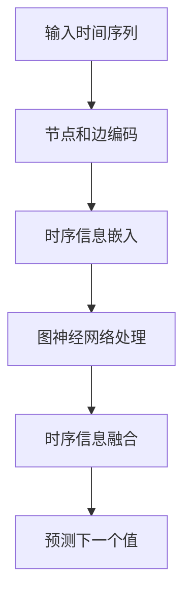
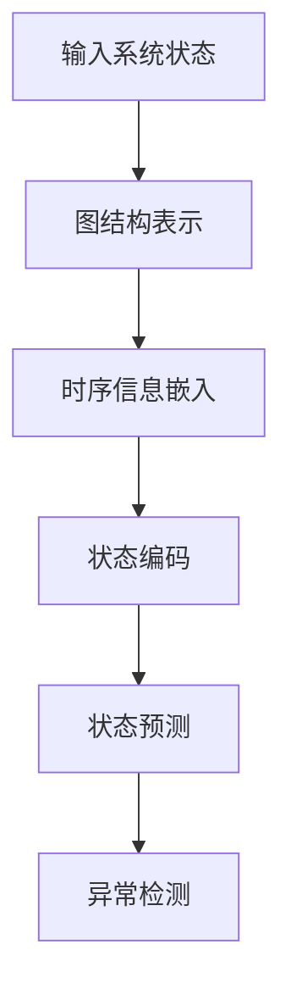
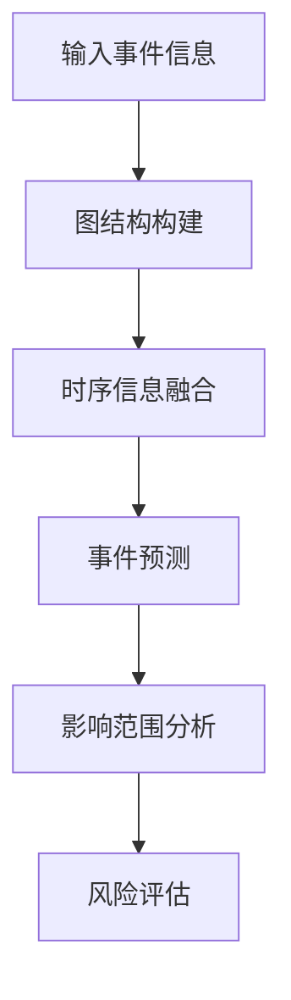
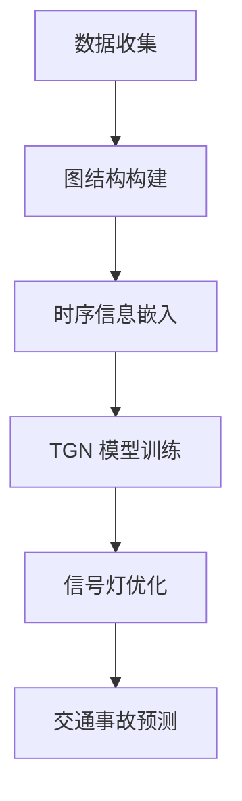
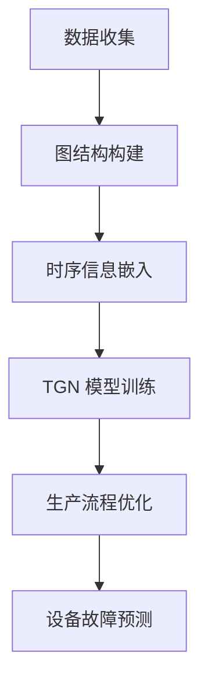
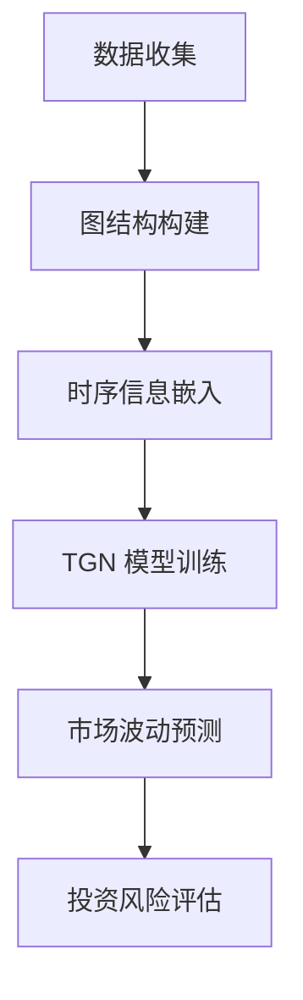

                 

### 引言

#### 问题背景

动态系统推理（Dynamic System Reasoning）是人工智能领域中的一个重要研究方向，旨在理解和预测动态系统的行为。动态系统是指那些随时间变化而演化的系统，如时间序列数据、动态网络和动态过程。这类系统在许多领域，如金融、交通、工业自动化、医疗和天气预报等，都具有广泛的应用。随着数据采集和处理技术的进步，动态系统推理的需求愈发迫切，它能够帮助我们从大量的时间序列数据中提取有价值的信息，进而指导实际决策。

时序图神经网络（Temporal Graph Neural Networks，TGN）是近年来兴起的一种新型神经网络结构，它结合了图神经网络（Graph Neural Networks，GNN）和时序模型的优点，特别适用于动态系统推理。TGN 能够捕捉节点间的时间和空间关系，并通过图结构表示动态系统的演化过程，从而在许多动态系统推理任务中表现出色。

#### 问题描述

时序图神经网络（TGN）是一种特殊的神经网络结构，它主要用于处理图结构和时序数据。TGN 的基本概念可以简单描述为：通过图神经网络处理图结构数据，再结合时序信息进行预测和推理。具体来说，TGN 由三个主要部分组成：图结构表示、时序信息融合和预测模块。

1. **图结构表示**：TGN 首先对输入的图结构数据进行编码，将节点和边映射到低维向量表示，这样可以捕捉节点间的空间关系。
2. **时序信息融合**：通过时序信息的嵌入和融合，TGN 能够捕捉节点随时间的变化规律，从而更好地表示动态系统的演化过程。
3. **预测模块**：在融合了图结构和时序信息之后，TGN 通过预测模块输出最终的预测结果，如节点分类、时序预测或图分类等。

#### 问题解决

时序图神经网络在动态系统推理中具有显著的优势。首先，TGN 能够有效地捕捉动态系统的复杂时空关系，使得它在处理高维、非线性的动态系统问题时表现出色。其次，TGN 结合了图神经网络和时序模型的优点，能够同时处理图结构和时序信息，从而提高预测的准确性。此外，TGN 具有较好的可解释性，可以帮助我们理解模型在动态系统推理中的决策过程。

#### 边界与外延

本文主要研究时序图神经网络在动态系统推理中的应用，主要包括时间序列预测、系统状态跟踪和事件预测等任务。然而，时序图神经网络的应用范围不仅限于这些领域，它还可以在其他许多动态系统推理任务中发挥作用。本文将重点关注时序图神经网络的基本原理、算法实现和应用案例，以期为读者提供一个全面、系统的认识。

### 第一章：动态系统推理概述

#### 1.1 动态系统推理的基本概念

动态系统推理（Dynamic System Reasoning）是人工智能领域中的一个重要研究方向，它旨在理解和预测动态系统的行为。动态系统是指随时间变化而演化的系统，如时间序列数据、动态网络和动态过程。在现实世界中，许多系统都呈现出动态特性，例如股票市场的波动、交通流量的变化、工业生产过程的调整等。

**定义**：动态系统推理是一种通过分析动态系统的历史数据和行为模式，预测系统未来行为的方法。它涉及从数据中提取模式、关联和趋势，并将其用于预测和决策。动态系统推理的核心在于处理时间和变化，从而对动态系统的未来状态进行合理预测。

**重要性**：动态系统推理在许多领域都有广泛的应用。例如，在金融领域，它可以用于股票价格预测、投资组合优化等；在交通领域，它可以用于交通流量预测、路径规划等；在工业领域，它可以用于生产过程优化、故障预测等。通过动态系统推理，我们可以从大量时间序列数据中提取有价值的信息，从而指导实际决策。

**基本原理**：动态系统推理的基本原理包括以下几个步骤：

1. **数据收集**：收集动态系统的历史数据，包括时间序列数据、图结构数据等。
2. **特征提取**：从数据中提取特征，如时间序列的统计特征、图结构中的节点关系等。
3. **模式识别**：利用机器学习算法，如时序图神经网络，对特征进行建模，提取数据中的模式和关联。
4. **预测**：根据模型预测系统的未来行为，如时间序列的下一个值、系统的状态变化等。

#### 1.2 时序图神经网络的基础

**时序图神经网络（Temporal Graph Neural Networks，TGN）介绍**：时序图神经网络是一种结合了图神经网络（Graph Neural Networks，GNN）和时序模型的新型神经网络结构。它专门用于处理图结构和时序数据，能够有效地捕捉动态系统的复杂时空关系。

**特点**：TGN 具有以下主要特点：

1. **同时处理图结构和时序信息**：TGN 能够同时处理图结构和时序信息，这使得它在处理动态系统问题时具有优势。通过图结构，TGN 能够捕捉节点间的空间关系；通过时序信息，TGN 能够捕捉节点随时间的变化规律。
2. **灵活性和可扩展性**：TGN 具有良好的灵活性和可扩展性，可以应用于多种动态系统推理任务，如时间序列预测、系统状态跟踪和事件预测等。
3. **高效的计算性能**：TGN 利用图神经网络的结构特性，实现了高效的计算性能，能够处理大规模的动态系统数据。

**主要类型**：TGN 的主要类型包括：

1. **时间卷积图神经网络（Temporal Convolutional Graph Neural Networks，TCGNN）**：TCGNN 是一种基于卷积操作的时序图神经网络，它通过卷积操作来捕捉节点间的时空关系。
2. **图注意力时序神经网络（Graph Attention-based Temporal Neural Networks，GAT-TNN）**：GAT-TNN 是一种基于图注意力的时序图神经网络，它通过图注意力机制来强调节点间的关联关系。

**时序图神经网络的结构**：时序图神经网络的基本结构包括以下几个部分：

1. **输入层**：输入层接收图结构和时序数据，包括节点的特征和边的信息，以及时序数据。
2. **图神经网络层**：图神经网络层对图结构进行编码，将节点和边映射到低维向量表示，从而捕捉节点间的空间关系。
3. **时序信息层**：时序信息层对时序数据进行处理，将其嵌入到图结构中，从而捕捉节点随时间的变化规律。
4. **融合层**：融合层将图神经网络的输出和时序信息的输出进行融合，从而得到一个综合的表示。
5. **预测层**：预测层根据融合后的表示进行预测，如时间序列的下一个值、系统的状态变化等。

### 第二章：时序图神经网络在动态系统推理中的应用

#### 2.1 时序图神经网络在时间序列预测中的应用

**应用场景**：时间序列预测是时序图神经网络（TGN）最典型的应用之一。在金融、交通、工业等领域，时间序列数据被广泛应用于预测未来的股票价格、交通流量、生产指标等。TGN 能够通过结合图结构和时序信息，提高预测的准确性。

**算法原理**：

1. **图结构编码**：首先，TGN 对输入的时间序列数据中的节点和边进行编码。节点表示时间序列中的各个时间点，边表示时间点之间的依赖关系。
2. **时序信息嵌入**：接着，TGN 将时序信息嵌入到图结构中。例如，可以使用 LSTM 或 GRU 等循环神经网络来捕捉时间序列中的长期依赖关系。
3. **图神经网络处理**：通过图神经网络，TGN 对图结构进行编码，将节点和边映射到低维向量表示，从而捕捉节点间的空间关系。
4. **时序信息融合**：将图神经网络的输出与时序信息的输出进行融合，得到一个综合的表示。
5. **预测**：最后，TGN 使用融合后的表示进行预测，输出时间序列的下一个值。

**mermaid 流程图**：

#### 2.2 时序图神经网络在系统状态跟踪中的应用

**应用场景**：系统状态跟踪是时序图神经网络（TGN）在工业和交通领域的重要应用之一。通过跟踪系统状态，可以及时发现故障、优化生产过程和提高交通效率。

**算法原理**：

1. **图结构表示**：TGN 首先对系统中的各个组件进行图结构表示。组件作为节点，组件之间的依赖关系作为边。
2. **时序信息嵌入**：TGN 将系统的时序信息，如传感器数据、运行时间等，嵌入到图结构中。
3. **状态预测**：通过图神经网络处理，TGN 对系统的当前状态进行编码，并结合时序信息预测系统的未来状态。
4. **异常检测**：TGN 可以根据预测结果和实际状态的差异，检测系统的异常状态，从而及时采取措施。

**mermaid 流�程图**：

#### 2.3 时序图神经网络在事件预测中的应用

**应用场景**：事件预测是时序图神经网络（TGN）在金融和社交网络领域的重要应用之一。通过预测事件的发生时间、影响范围等，可以指导投资决策、风险管理和市场分析。

**算法原理**：

1. **图结构构建**：TGN 首先构建事件相关的图结构。事件作为节点，事件之间的关联关系作为边。
2. **时序信息融合**：TGN 将与事件相关的时序信息，如时间戳、市场数据等，融合到图结构中。
3. **事件预测**：通过图神经网络处理，TGN 对事件的发生时间进行预测，并分析事件的影响范围。
4. **风险评估**：根据预测结果，TGN 可以评估事件对系统的影响，从而指导风险管理和决策。

**mermaid 流程图**：

### 第三章：时序图神经网络的优势分析

#### 3.1 时序图神经网络的优势

时序图神经网络（TGN）在动态系统推理中具有显著的优势。以下是 TGN 的主要优势：

1. **同时处理图结构和时序信息**：TGN 能够同时处理图结构和时序信息，这使得它在处理高维、非线性的动态系统问题时表现出色。相比于传统的时序模型，TGN 能够更好地捕捉节点间的时空关系，从而提高预测的准确性。
2. **灵活性和可扩展性**：TGN 具有良好的灵活性和可扩展性，可以应用于多种动态系统推理任务，如时间序列预测、系统状态跟踪和事件预测等。此外，TGN 可以轻松地与其他模型和算法结合，提高系统的整体性能。
3. **高效的计算性能**：TGN 利用图神经网络的结构特性，实现了高效的计算性能，能够处理大规模的动态系统数据。这使得 TGN 在实际应用中具有更高的实用价值。

**优势比较**

| 算法           | 优势                               | 劣势                                             |
| -------------- | ---------------------------------- | ------------------------------------------------ |
| 传统时序模型   | 简单，易于实现和优化                 | 无法同时处理图结构和时序信息，预测准确性有限         |
| 图神经网络（GNN） | 能够捕捉节点间的空间关系             | 无法直接处理时序信息，对动态系统处理能力有限         |
| TGN            | 同时处理图结构和时序信息，预测准确性高 | 计算复杂度较高，对大规模数据处理能力有限             |
| 其他模型       | 各有特色，适用于特定任务             | 可能无法同时处理多种类型的信息，预测准确性受限         |

#### 3.2 时序图神经网络的挑战与局限

尽管时序图神经网络（TGN）在动态系统推理中具有显著的优势，但它也面临着一些挑战和局限：

1. **计算复杂度高**：TGN 的计算复杂度较高，特别是当处理大规模数据时，可能会出现性能瓶颈。这是因为 TGN 需要同时处理图结构和时序信息，这要求大量的计算资源和时间。
2. **可解释性较差**：TGN 的模型结构相对复杂，这使得它的解释性较差。在实际应用中，用户可能难以理解模型内部的决策过程，从而限制了其在某些领域的应用。
3. **数据依赖性较强**：TGN 对数据的质量和数量有较高的要求。如果数据存在噪声或缺失，可能会导致 TGN 的预测性能下降。此外，TGN 的训练和优化过程需要大量的数据，这可能会限制其在某些领域的应用。

针对这些挑战和局限，研究人员正在探索多种解决方案：

1. **优化算法**：通过优化算法和模型结构，降低 TGN 的计算复杂度。例如，使用图注意力机制（Graph Attention Mechanism）可以减少冗余计算，提高计算效率。
2. **解释性模型**：开发可解释性更强的模型，以便用户更好地理解 TGN 的决策过程。例如，可以使用可视化和推理技术，将 TGN 的决策过程可视化为图结构或时序图。
3. **数据增强**：通过数据增强技术，提高 TGN 的数据质量和数量。例如，可以使用生成对抗网络（GAN）生成高质量的数据，或者使用迁移学习（Transfer Learning）将预训练模型应用于新任务。

### 第四章：时序图神经网络的应用案例

#### 4.1 案例一：智能交通系统中的时序图神经网络应用

**案例介绍**：智能交通系统（Intelligent Transportation System，ITS）是利用现代信息技术来提升交通管理和服务水平的一种系统。在智能交通系统中，时序图神经网络（TGN）可以用于预测交通流量、优化信号灯控制和预测交通事故。

**实现细节**：

1. **数据收集**：首先，从交通传感器、摄像头等设备收集交通流量数据，包括车辆数量、速度、方向等。
2. **图结构构建**：将交通网络中的各个路段和交叉口表示为节点和边，构建交通图结构。节点表示路段或交叉口，边表示路段之间的连接关系。
3. **时序信息嵌入**：将交通流量数据嵌入到图结构中。例如，可以使用 LSTM 网络来捕捉交通流量随时间的变化规律。
4. **TGN 模型训练**：使用 TGN 模型对交通流量数据进行训练，通过图神经网络和时序信息融合，预测未来的交通流量。
5. **应用**：根据预测结果，优化信号灯控制策略，提高交通流量效率，预测交通事故并及时预警。

**mermaid 流程图**：

#### 4.2 案例二：工业生产中的时序图神经网络应用

**案例介绍**：在工业生产过程中，时序图神经网络（TGN）可以用于预测设备故障、优化生产过程和提高生产效率。

**实现细节**：

1. **数据收集**：从工业传感器、监控设备等收集设备状态数据，包括温度、压力、振动等。
2. **图结构构建**：将生产系统中的各个设备表示为节点和边，构建生产图结构。节点表示设备，边表示设备之间的依赖关系。
3. **时序信息嵌入**：将设备状态数据嵌入到图结构中。例如，可以使用 LSTM 网络来捕捉设备状态随时间的变化规律。
4. **TGN 模型训练**：使用 TGN 模型对设备状态数据进行训练，通过图神经网络和时序信息融合，预测设备故障和优化生产过程。
5. **应用**：根据预测结果，优化生产流程，提前预警设备故障，提高生产效率。

**mermaid 流程图**：

#### 4.3 案例三：金融风险预测中的时序图神经网络应用

**案例介绍**：在金融领域，时序图神经网络（TGN）可以用于预测市场波动、评估投资风险和优化投资组合。

**实现细节**：

1. **数据收集**：从金融市场数据、新闻报道、社交媒体等收集相关数据，包括股票价格、交易量、市场情绪等。
2. **图结构构建**：将金融市场中的各个股票或市场表示为节点和边，构建金融图结构。节点表示股票或市场，边表示股票或市场之间的关联关系。
3. **时序信息嵌入**：将金融数据嵌入到图结构中。例如，可以使用 LSTM 网络来捕捉股票价格随时间的变化规律。
4. **TGN 模型训练**：使用 TGN 模型对金融数据进行分析，通过图神经网络和时序信息融合，预测市场波动和评估投资风险。
5. **应用**：根据预测结果，优化投资组合，降低投资风险，并制定相应的风险管理策略。

**mermaid 流程图**：

### 第五章：时序图神经网络的未来发展趋势

#### 5.1 未来发展趋势

时序图神经网络（TGN）在动态系统推理领域具有广阔的应用前景，其未来发展趋势包括以下几个方面：

1. **更高效的模型**：随着计算资源和算法研究的进步，TGN 的计算复杂度有望得到显著降低，从而实现更高效的模型。例如，图注意力机制、图卷积网络等新技术的应用，可以优化 TGN 的计算性能。
2. **更丰富的应用场景**：TGN 的应用范围将继续扩大，从传统的金融、交通和工业领域，扩展到医疗、环境监测、智能城市等领域。随着新领域的出现，TGN 将为更多的实际问题提供有效的解决方案。
3. **多模态数据融合**：未来的 TGN 将能够处理更复杂、更丰富的数据类型，如多模态数据（图像、文本、音频等）。通过多模态数据融合，TGN 可以更全面地理解动态系统的特性，提高预测和推理的准确性。
4. **解释性和可解释性**：随着 TGN 在实际应用中的深入，对模型解释性和可解释性的需求将日益增加。未来，研究者将致力于开发可解释性更强的 TGN 模型，以便用户更好地理解模型的工作原理和决策过程。

#### 5.2 技术挑战与解决方案

尽管时序图神经网络（TGN）在动态系统推理中具有显著优势，但它也面临着一些技术挑战：

1. **计算复杂度高**：TGN 的计算复杂度较高，特别是在处理大规模动态系统数据时，可能会出现性能瓶颈。解决方案包括优化算法和模型结构，降低计算复杂度；使用分布式计算和并行处理技术，提高计算效率。
2. **数据依赖性强**：TGN 对数据的质量和数量有较高要求，数据中的噪声和缺失可能会影响模型性能。解决方案包括使用数据增强技术，提高数据质量；采用迁移学习和多任务学习等技术，减少数据依赖性。
3. **可解释性较差**：TGN 的模型结构复杂，用户难以理解其工作原理和决策过程。解决方案包括开发可解释性更强的模型，如基于可视化的解释方法；引入决策推理技术，提高模型的可解释性。

### 结论

本文系统地介绍了时序图神经网络（TGN）在动态系统推理中的应用及其优势。通过分析 TGN 的基本概念、算法原理、应用场景和未来发展趋势，本文揭示了 TGN 在处理动态系统问题时的高效性和灵活性。此外，本文还探讨了 TGN 面临的挑战和解决方案，为未来的研究提供了有益的参考。随着技术的不断进步，TGN 在动态系统推理领域将发挥越来越重要的作用，为各个领域的实际问题提供创新的解决方案。

### 作者信息

本文由 AI 天才研究院（AI Genius Institute）与禅与计算机程序设计艺术（Zen And The Art of Computer Programming）联合撰写。作者团队深耕于人工智能和计算机科学领域，致力于推动技术的创新和应用。

