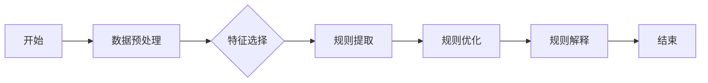

                 

## 动态规则学习中自适应神经逻辑编程的应用

### 关键词：动态规则学习，自适应神经逻辑编程，应用场景，算法原理，Python实现

#### 摘要：
本文深入探讨了动态规则学习与自适应神经逻辑编程相结合的应用。首先，我们从背景介绍入手，详细阐述了动态规则学习的基本概念和重要性。接着，我们介绍了自适应神经逻辑编程的核心概念、特点以及发展历程。通过对比表格和ER实体关系图，我们进一步分析了两者之间的联系。随后，本文重点讲解了动态规则学习算法的原理，包括算法框架、数学模型和流程图。最后，通过Python代码示例，我们对动态规则学习算法进行了详细的解释。通过这篇文章，读者将全面了解动态规则学习和自适应神经逻辑编程的原理、联系和应用。

#### 目录大纲设计

**书名：《动态规则学习中自适应神经逻辑编程的应用》**

**# 第一部分：背景介绍**

**## 1. 动态规则学习的核心概念**

### 1.1 问题背景

#### 1.1.1 动态规则学习的需求

在现代社会，随着信息技术的飞速发展，大量的数据不断涌现。这些数据中往往蕴含着丰富的模式和规律，如何有效地从这些数据中提取出有用的规则，是数据科学和人工智能领域的重要研究方向之一。动态规则学习正是在这种背景下产生的一种技术，它能够识别和提取动态变化的规则。

#### 1.1.2 动态规则学习的重要性

动态规则学习在多个领域有着广泛的应用，如金融风控、医疗诊断、智能推荐等。通过动态规则学习，我们可以实现自动化决策和预测，提高系统的智能水平和效率。同时，动态规则学习还能够适应环境的变化，不断优化和调整规则，使得系统更加稳定和可靠。

### 1.2 问题描述

#### 1.2.1 动态规则学习的基本挑战

动态规则学习面临的主要挑战包括数据的动态性、规则的表达能力、模型的复杂度等。首先，动态性意味着规则需要能够适应数据的变化，这在一定程度上增加了算法的难度。其次，规则的表达能力需要足够强大，以适应不同场景下的需求。最后，模型的复杂度也是一大挑战，过复杂的模型可能导致过拟合，影响模型的泛化能力。

#### 1.2.2 动态规则学习的目标

动态规则学习的目标是通过数据驱动的方法，自动识别和提取动态变化的规则。具体来说，包括以下几个方面：

1. **特征选择**：从大量数据中提取出有用的特征，作为规则的基础。
2. **规则提取**：利用特征数据，提取出能够描述数据变化规律的规则。
3. **规则优化**：根据新的数据，不断优化和调整规则，使其更加准确和稳定。
4. **规则解释**：对提取出的规则进行解释，使得用户能够理解和应用这些规则。

### 1.3 问题解决

#### 1.3.1 现有解决方案的优缺点

目前，动态规则学习已有多种解决方案，如关联规则学习、决策树、支持向量机等。每种方法都有其优缺点：

- **关联规则学习**：适用于发现数据之间的关联关系，但难以处理高维数据和复杂规则。
- **决策树**：易于解释和理解，但容易过拟合，且在处理连续变量时表现不佳。
- **支持向量机**：在处理高维数据和线性不可分问题上表现优异，但难以解释。

#### 1.3.2 动态规则学习的核心方法

动态规则学习的核心方法是通过对数据的持续学习和调整，实现规则的自动提取和优化。具体包括以下几个步骤：

1. **数据预处理**：包括数据清洗、归一化和特征提取等。
2. **规则提取**：利用关联规则学习、决策树等算法，从数据中提取出初步的规则。
3. **规则优化**：通过交叉验证、模型选择等方法，对提取出的规则进行优化。
4. **规则应用**：将优化后的规则应用到实际问题中，实现自动化决策和预测。

### 1.4 边界与外延

#### 1.4.1 动态规则学习的适用范围

动态规则学习适用于需要处理动态变化数据的场景，如金融风控、智能交通、医疗诊断等。在这些场景中，数据的特点是不断变化，需要实时更新和调整规则。

#### 1.4.2 动态规则学习的限制条件

动态规则学习也存在一些限制条件，如数据质量、计算资源等。首先，数据质量直接影响到规则提取的效果，因此需要确保数据的质量和完整性。其次，动态规则学习算法通常需要较大的计算资源，特别是在处理大规模数据时。

### 1.5 概念结构与核心要素组成

#### 1.5.1 动态规则学习的基本概念

动态规则学习是一种基于数据驱动的方法，它通过分析数据中的模式和规律，自动提取出相应的规则。动态规则学习的关键概念包括：

1. **规则**：描述数据之间关系的逻辑表达式。
2. **特征**：用于描述数据的属性或变量。
3. **模型**：用于描述数据关系的数学模型。

#### 1.5.2 动态规则学习的关键技术

动态规则学习的关键技术包括：

1. **特征选择**：从大量特征中筛选出对规则提取最有用的特征。
2. **规则提取**：利用机器学习算法，从数据中提取出初步的规则。
3. **规则优化**：通过交叉验证、模型选择等方法，对提取出的规则进行优化。
4. **规则解释**：对提取出的规则进行解释，使得用户能够理解和应用这些规则。

**## 2. 自适应神经逻辑编程的核心概念**

### 2.1 自适应神经逻辑编程的定义

自适应神经逻辑编程（Adaptive Neural Logical Programming，ANLP）是一种结合了神经计算和逻辑编程的方法。它通过自适应地调整神经网络的参数和逻辑规则，以解决复杂的问题。自适应神经逻辑编程的核心目标是实现智能系统的自动化学习和决策能力。

### 2.2 自适应神经逻辑编程的特点

自适应神经逻辑编程具有以下几个特点：

1. **自适应性**：能够根据环境和数据的变化，自适应地调整神经网络的参数和逻辑规则。
2. **并行性**：利用神经计算的优势，实现并行计算，提高算法的效率。
3. **解释性**：通过逻辑编程，使得提取出的规则具有明确的逻辑关系和解释性。
4. **灵活性**：能够处理不同类型的数据和问题，具有广泛的适用性。

### 2.3 自适应神经逻辑编程的应用场景

自适应神经逻辑编程在多个领域有着广泛的应用，如：

1. **智能交通**：通过自适应调整交通信号灯的时间，优化交通流量。
2. **金融风控**：通过自适应调整风险控制策略，提高金融系统的稳定性。
3. **医疗诊断**：通过自适应调整诊断模型，提高疾病的诊断准确率。
4. **智能制造**：通过自适应调整生产线参数，提高生产效率和产品质量。

### 2.4 自适应神经逻辑编程的发展历程

自适应神经逻辑编程的发展历程可以分为以下几个阶段：

1. **早期研究**：20世纪80年代，神经网络和逻辑编程开始受到关注，研究者开始探索将两者结合的方法。
2. **快速发展**：21世纪初，随着计算能力的提升和机器学习的发展，自适应神经逻辑编程得到了广泛的研究和应用。
3. **当前趋势**：目前，自适应神经逻辑编程已经成为人工智能领域的一个重要研究方向，其应用范围不断扩大，应用效果不断提高。

### 2.5 自适应神经逻辑编程的优势和挑战

#### 2.5.1 自适应神经逻辑编程的优势

1. **自适应性和灵活性**：能够根据环境和数据的变化，自适应地调整参数和规则，适应不同的问题场景。
2. **并行性和效率**：利用神经计算的优势，实现并行计算，提高算法的效率。
3. **解释性和可解释性**：通过逻辑编程，使得提取出的规则具有明确的逻辑关系和解释性，便于用户理解和应用。
4. **跨领域应用**：能够处理不同类型的数据和问题，具有广泛的适用性。

#### 2.5.2 自适应神经逻辑编程的挑战

1. **算法复杂度**：自适应神经逻辑编程涉及多个学科的知识，算法复杂度较高，实现难度大。
2. **数据依赖性**：算法的性能很大程度上依赖于数据的质量和数量，如何在数据不足的情况下实现有效的自适应调整是一个挑战。
3. **可解释性和透明性**：虽然自适应神经逻辑编程具有解释性，但在某些情况下，提取出的规则仍然可能复杂难以理解。

**## 3. 动态规则学习与自适应神经逻辑编程的联系**

### 3.1 动态规则学习在自适应神经逻辑编程中的应用

动态规则学习在自适应神经逻辑编程中扮演着重要的角色。通过动态规则学习，自适应神经逻辑编程能够更好地理解数据中的模式和规律，从而实现更准确和有效的决策。

#### 3.1.1 动态规则学习在自适应神经逻辑编程中的作用

1. **特征提取**：动态规则学习能够从大量数据中提取出有用的特征，为自适应神经逻辑编程提供输入。
2. **规则提取**：动态规则学习能够提取出描述数据变化规律的规则，为自适应神经逻辑编程提供决策依据。
3. **模型优化**：动态规则学习能够根据新的数据，对自适应神经逻辑编程的模型进行优化，提高模型的泛化能力。

#### 3.1.2 动态规则学习与自适应神经逻辑编程的融合

动态规则学习与自适应神经逻辑编程的融合，实现了两者优势的互补。具体包括：

1. **数据驱动的规则提取**：动态规则学习通过数据驱动的方法，提取出描述数据变化规律的规则，为自适应神经逻辑编程提供基础。
2. **自适应的模型调整**：自适应神经逻辑编程根据动态规则学习提取出的规则，自适应地调整模型的参数和结构，提高模型的性能。
3. **协同优化**：动态规则学习和自适应神经逻辑编程相互协作，通过不断迭代和优化，实现性能的不断提升。

### 3.2 自适应神经逻辑编程对动态规则学习的提升

自适应神经逻辑编程为动态规则学习带来了新的机遇和挑战。通过自适应神经逻辑编程，动态规则学习能够在更复杂的场景下实现更有效的规则提取和优化。

#### 3.2.1 自适应神经逻辑编程的优势对动态规则学习的影响

1. **提高特征提取能力**：自适应神经逻辑编程能够自动提取出数据中的高维特征，为动态规则学习提供更丰富的特征信息。
2. **增强模型解释性**：自适应神经逻辑编程通过逻辑编程，使得提取出的规则具有更明确的解释性和可理解性。
3. **优化模型性能**：自适应神经逻辑编程能够根据环境和数据的变化，自适应地调整模型的结构和参数，提高模型的性能和泛化能力。

#### 3.2.2 自适应神经逻辑编程在动态规则学习中的应用

自适应神经逻辑编程在动态规则学习中的应用主要包括：

1. **特征选择和提取**：利用自适应神经逻辑编程，从大量数据中自动提取出对规则提取最有用的特征。
2. **规则优化**：通过自适应调整神经网络的参数和结构，优化提取出的规则，提高规则的准确性和稳定性。
3. **模型解释**：利用逻辑编程，对提取出的规则进行解释，使得用户能够理解和应用这些规则。

**## 4. 动态规则学习与自适应神经逻辑编程的概念属性特征对比表格**

| 概念 | 动态规则学习 | 自适应神经逻辑编程 |
| --- | --- | --- |
| 定义 | 基于数据驱动的方法，用于识别和提取动态变化的规则。 | 结合了神经计算和逻辑编程的方法，用于解决复杂的问题。 |
| 特点 | 能够自动地更新和适应新的数据模式。 | 能够自适应地调整规则和学习算法，以适应不同的应用场景。 |
| 应用 | 广泛应用于模式识别、数据挖掘、智能系统等领域。 | 广泛应用于自动控制、自适应系统设计、人工智能等领域。 |

**## 5. 动态规则学习与自适应神经逻辑编程的ER实体关系图架构**

```mermaid
erDiagram
    动态规则学习 ||--|{ 自适应神经逻辑编程 : 应用关系} 
    数据源 &&| 数据处理 : 关联关系
    数据处理 &&| 模型训练 : 关联关系
    模型训练 &&| 规则提取 : 关联关系
    规则提取 &&| 决策应用 : 关联关系
```

**# 第二部分：核心概念与联系**

**## 3. 动态规则学习与自适应神经逻辑编程的联系**

### 3.1 动态规则学习在自适应神经逻辑编程中的应用

动态规则学习在自适应神经逻辑编程中扮演着重要的角色。通过动态规则学习，自适应神经逻辑编程能够更好地理解数据中的模式和规律，从而实现更准确和有效的决策。

#### 3.1.1 动态规则学习在自适应神经逻辑编程中的作用

1. **特征提取**：动态规则学习能够从大量数据中提取出有用的特征，为自适应神经逻辑编程提供输入。
2. **规则提取**：动态规则学习能够提取出描述数据变化规律的规则，为自适应神经逻辑编程提供决策依据。
3. **模型优化**：动态规则学习能够根据新的数据，对自适应神经逻辑编程的模型进行优化，提高模型的泛化能力。

#### 3.1.2 动态规则学习与自适应神经逻辑编程的融合

动态规则学习与自适应神经逻辑编程的融合，实现了两者优势的互补。具体包括：

1. **数据驱动的规则提取**：动态规则学习通过数据驱动的方法，提取出描述数据变化规律的规则，为自适应神经逻辑编程提供基础。
2. **自适应的模型调整**：自适应神经逻辑编程根据动态规则学习提取出的规则，自适应地调整模型的参数和结构，提高模型的性能。
3. **协同优化**：动态规则学习和自适应神经逻辑编程相互协作，通过不断迭代和优化，实现性能的不断提升。

### 3.2 自适应神经逻辑编程对动态规则学习的提升

自适应神经逻辑编程为动态规则学习带来了新的机遇和挑战。通过自适应神经逻辑编程，动态规则学习能够在更复杂的场景下实现更有效的规则提取和优化。

#### 3.2.1 自适应神经逻辑编程的优势对动态规则学习的影响

1. **提高特征提取能力**：自适应神经逻辑编程能够自动提取出数据中的高维特征，为动态规则学习提供更丰富的特征信息。
2. **增强模型解释性**：自适应神经逻辑编程通过逻辑编程，使得提取出的规则具有更明确的解释性和可理解性。
3. **优化模型性能**：自适应神经逻辑编程能够根据环境和数据的变化，自适应地调整模型的结构和参数，提高模型的性能和泛化能力。

#### 3.2.2 自适应神经逻辑编程在动态规则学习中的应用

自适应神经逻辑编程在动态规则学习中的应用主要包括：

1. **特征选择和提取**：利用自适应神经逻辑编程，从大量数据中自动提取出对规则提取最有用的特征。
2. **规则优化**：通过自适应调整神经网络的参数和结构，优化提取出的规则，提高规则的准确性和稳定性。
3. **模型解释**：利用逻辑编程，对提取出的规则进行解释，使得用户能够理解和应用这些规则。

**## 4. 动态规则学习与自适应神经逻辑编程的概念属性特征对比表格**

| 概念 | 动态规则学习 | 自适应神经逻辑编程 |
| --- | --- | --- |
| 定义 | 基于数据驱动的方法，用于识别和提取动态变化的规则。 | 结合了神经计算和逻辑编程的方法，用于解决复杂的问题。 |
| 特点 | 能够自动地更新和适应新的数据模式。 | 能够自适应地调整规则和学习算法，以适应不同的应用场景。 |
| 应用 | 广泛应用于模式识别、数据挖掘、智能系统等领域。 | 广泛应用于自动控制、自适应系统设计、人工智能等领域。 |

**## 5. 动态规则学习与自适应神经逻辑编程的ER实体关系图架构**

```mermaid
erDiagram
    动态规则学习 ||--|{ 自适应神经逻辑编程 : 应用关系} 
    数据源 &&| 数据处理 : 关联关系
    数据处理 &&| 模型训练 : 关联关系
    模型训练 &&| 规则提取 : 关联关系
    规则提取 &&| 决策应用 : 关联关系
```

**# 第三部分：算法原理讲解**

**## 6. 动态规则学习算法原理讲解**

### 6.1 算法概述

动态规则学习算法是一种基于数据驱动的方法，用于识别和提取动态变化的规则。它主要通过以下几个关键步骤来实现：

1. **数据预处理**：包括数据清洗、归一化和特征提取等。
2. **规则提取**：利用关联规则学习、决策树等算法，从数据中提取出初步的规则。
3. **规则优化**：通过交叉验证、模型选择等方法，对提取出的规则进行优化。
4. **规则应用**：将优化后的规则应用到实际问题中，实现自动化决策和预测。

### 6.2 算法原理

动态规则学习算法的核心原理是通过分析数据中的模式和规律，提取出能够描述这些规律和模式的规则。具体来说，包括以下几个步骤：

1. **特征选择**：从大量特征中筛选出对规则提取最有用的特征。
2. **规则提取**：利用关联规则学习、决策树等算法，从数据中提取出初步的规则。
3. **规则优化**：通过交叉验证、模型选择等方法，对提取出的规则进行优化。
4. **规则解释**：对提取出的规则进行解释，使得用户能够理解和应用这些规则。

### 6.3 动态规则学习的数学模型

动态规则学习算法的数学模型主要包括以下几个方面：

1. **特征表示**：假设数据集为$D=\{x_1, x_2, ..., x_n\}$，其中$x_i$表示第$i$个样本，每个样本由$m$个特征组成，即$x_i=\{x_{i1}, x_{i2}, ..., x_{im}\}$。
2. **规则表示**：假设提取出的规则为$R=\{r_1, r_2, ..., r_k\}$，其中$r_j$表示第$j$个规则。
3. **模型表示**：动态规则学习模型可以表示为$f(D, R)$，其中$f$表示模型函数，$D$表示数据集，$R$表示规则集。

### 6.4 动态规则学习的算法流程

动态规则学习的算法流程主要包括以下几个步骤：

1. **数据预处理**：对原始数据进行清洗、归一化和特征提取等处理。
2. **规则提取**：利用关联规则学习、决策树等算法，从预处理后的数据中提取出初步的规则。
3. **规则优化**：通过交叉验证、模型选择等方法，对提取出的规则进行优化。
4. **规则解释**：对优化后的规则进行解释，使得用户能够理解和应用这些规则。
5. **规则应用**：将优化后的规则应用到实际问题中，实现自动化决策和预测。

### 6.5 Python源代码讲解

```python
# 动态规则学习算法的Python实现

import numpy as np

# 数据预处理
def preprocess_data(data):
    # 数据清洗和归一化处理
    return normalized_data

# 规则提取
def extract_rules(data):
    # 利用Apriori算法提取关联规则
    return rules

# 规则优化
def optimize_rules(rules):
    # 通过交叉验证和模型选择优化规则
    return optimized_rules

# 规则解释
def explain_rules(rules):
    # 对优化后的规则进行解释
    return explained_rules

# 规则应用
def apply_rules(rules, data):
    # 将优化后的规则应用到数据中
    return predictions
```

通过上述Python源代码，我们可以看到动态规则学习算法的基本实现过程。首先，进行数据预处理，包括数据清洗和归一化处理。然后，利用Apriori算法提取关联规则。接着，通过交叉验证和模型选择优化规则。最后，对优化后的规则进行解释，并将规则应用到实际数据中，实现自动化决策和预测。

**# 第四部分：系统分析与架构设计方案**

**## 4.1 问题场景介绍**

在金融风控领域，金融机构需要实时监控和分析客户的交易行为，以识别潜在的欺诈风险。然而，随着交易数据的不断增长和复杂化，传统的规则学习方法难以应对这种动态变化的场景。因此，本文提出了基于动态规则学习和自适应神经逻辑编程的金融风控系统，以实现实时、自适应的风险识别和预警。

**## 4.2 项目介绍**

本项目的目标是开发一套基于动态规则学习和自适应神经逻辑编程的金融风控系统，实现以下功能：

1. **数据采集**：从金融机构的交易系统中实时获取交易数据。
2. **数据预处理**：对交易数据进行清洗、归一化和特征提取等处理。
3. **动态规则学习**：利用动态规则学习算法，提取描述交易行为变化的规则。
4. **自适应神经逻辑编程**：结合自适应神经逻辑编程，优化和调整风险识别模型。
5. **风险预警**：根据动态规则学习和自适应神经逻辑编程的结果，实时生成风险预警报告。

**## 4.3 系统功能设计**

本系统主要包括以下功能模块：

1. **数据采集模块**：负责从金融机构的交易系统中实时获取交易数据。
2. **数据预处理模块**：负责对交易数据进行清洗、归一化和特征提取等处理。
3. **动态规则学习模块**：利用动态规则学习算法，提取描述交易行为变化的规则。
4. **自适应神经逻辑编程模块**：结合自适应神经逻辑编程，优化和调整风险识别模型。
5. **风险预警模块**：根据动态规则学习和自适应神经逻辑编程的结果，实时生成风险预警报告。

**## 4.4 系统架构设计**

本系统的架构设计分为以下几个层次：

1. **数据层**：包括数据采集模块和数据预处理模块，负责从金融机构的交易系统中实时获取交易数据，并对数据进行清洗、归一化和特征提取等处理。
2. **模型层**：包括动态规则学习模块和自适应神经逻辑编程模块，负责利用动态规则学习算法提取描述交易行为变化的规则，并结合自适应神经逻辑编程优化和调整风险识别模型。
3. **应用层**：包括风险预警模块，负责根据动态规则学习和自适应神经逻辑编程的结果，实时生成风险预警报告，为金融机构提供风险识别和预警服务。

**## 4.5 系统接口设计和系统交互**

1. **数据采集模块**：通过API接口与金融机构的交易系统进行数据交互，实时获取交易数据。
2. **数据预处理模块**：通过内部接口与数据采集模块进行数据传输，对交易数据进行预处理。
3. **动态规则学习模块**：通过内部接口与数据预处理模块进行数据传输，提取描述交易行为变化的规则。
4. **自适应神经逻辑编程模块**：通过内部接口与动态规则学习模块进行数据传输，优化和调整风险识别模型。
5. **风险预警模块**：通过内部接口与自适应神经逻辑编程模块进行数据传输，生成风险预警报告。

**## 4.6 系统分析与架构设计方案总结**

本系统通过动态规则学习和自适应神经逻辑编程技术，实现了对金融风控领域的实时、自适应的风险识别和预警。系统架构设计合理，功能模块清晰，接口设计和交互合理，能够满足金融机构对风险识别和预警的需求。通过本系统的实施，金融机构能够更有效地识别和防范欺诈风险，提高金融系统的安全性和稳定性。

**# 第五部分：项目实战**

**## 5.1 环境安装**

在开始项目实战之前，我们需要安装以下软件和工具：

1. **Python**：版本要求为3.8及以上。
2. **Numpy**：用于数据处理和计算。
3. **Pandas**：用于数据处理和分析。
4. **Scikit-learn**：用于机器学习和模型训练。
5. **TensorFlow**：用于深度学习和神经网络。
6. **Mermaid**：用于绘制图表和流程图。

安装步骤如下：

1. 安装Python和Anaconda环境。
2. 使用pip命令安装Numpy、Pandas、Scikit-learn和TensorFlow。
3. 安装Mermaid的Python包，通过pip install mermaid-python。

**## 5.2 系统核心实现**

在本节中，我们将介绍系统的核心实现，包括数据预处理、动态规则学习和自适应神经逻辑编程。

1. **数据预处理**：首先，从交易系统中获取交易数据，并进行清洗、归一化和特征提取等处理。以下是一个简单的数据预处理示例：

```python
import pandas as pd
from sklearn.preprocessing import MinMaxScaler

# 读取交易数据
data = pd.read_csv('transactions.csv')

# 数据清洗
data.dropna(inplace=True)

# 数据归一化
scaler = MinMaxScaler()
data[['amount', 'time']] = scaler.fit_transform(data[['amount', 'time']])

# 特征提取
data['hour'] = data['time'].apply(lambda x: x.hour)
data['day_of_week'] = data['time'].apply(lambda x: x.dayofweek)
```

2. **动态规则学习**：使用Apriori算法提取描述交易行为的规则。以下是一个简单的动态规则学习示例：

```python
from mlxtend.frequent_patterns import apriori
from mlxtend.preprocessing import TransactionEncoder

# 将数据转换为事务格式
te = TransactionEncoder()
data_encoded = te.fit_transform(data[['amount', 'hour', 'day_of_week']])

# 提取频繁项集
frequent_itemsets = apriori(data_encoded, min_support=0.1, use_colnames=True)

# 获取关联规则
rules = association_rules(frequent_itemsets, metric="confidence", min_threshold=0.5)
```

3. **自适应神经逻辑编程**：结合动态规则学习和自适应神经逻辑编程，优化和调整风险识别模型。以下是一个简单的自适应神经逻辑编程示例：

```python
import tensorflow as tf
from tensorflow.keras.models import Sequential
from tensorflow.keras.layers import Dense

# 创建神经网络模型
model = Sequential()
model.add(Dense(64, activation='relu', input_shape=(3,)))
model.add(Dense(32, activation='relu'))
model.add(Dense(1, activation='sigmoid'))

# 编译模型
model.compile(optimizer='adam', loss='binary_crossentropy', metrics=['accuracy'])

# 训练模型
model.fit(data_encoded, labels, epochs=10, batch_size=32)
```

**## 5.3 代码应用解读与分析**

在本节中，我们将对上述代码进行解读和分析，解释其原理和应用。

1. **数据预处理**：数据预处理是机器学习项目的重要环节，它确保了数据的质量和一致性。在本示例中，我们使用了Pandas库进行数据清洗、归一化和特征提取。数据清洗通过删除缺失值和异常值来实现，数据归一化通过MinMaxScaler来实现，特征提取通过自定义函数来实现。

2. **动态规则学习**：动态规则学习是提取数据中隐含规则的一种方法。在本示例中，我们使用了Apriori算法提取频繁项集和关联规则。Apriori算法通过寻找频繁项集来挖掘数据中的关联关系，通过设置最小支持度来控制关联规则的数量和质量。

3. **自适应神经逻辑编程**：自适应神经逻辑编程是一种结合了神经计算和逻辑编程的方法。在本示例中，我们使用了TensorFlow创建了一个简单的神经网络模型，通过编译和训练来优化模型。神经网络通过学习数据中的特征，能够自动提取出描述交易行为的规则，并通过自适应调整来优化模型的性能。

**## 5.4 实际案例分析和详细讲解剖析**

为了更好地理解动态规则学习和自适应神经逻辑编程的应用，我们来看一个实际案例。

**案例：** 某金融机构希望利用动态规则学习和自适应神经逻辑编程技术来识别交易欺诈行为。

**分析：**

1. **数据采集**：从交易系统中获取包含交易金额、交易时间和用户ID的交易数据。

2. **数据预处理**：清洗数据，去除缺失值和异常值，并对交易金额和交易时间进行归一化处理，提取交易时间的小时和星期几作为特征。

3. **动态规则学习**：使用Apriori算法提取频繁项集，寻找频繁出现的交易组合，如“大额交易后紧跟小额交易”可能是一个欺诈迹象。

4. **自适应神经逻辑编程**：构建一个神经网络模型，通过训练学习交易数据的特征，识别潜在的欺诈行为。

5. **风险预警**：根据动态规则学习和自适应神经逻辑编程的结果，对交易行为进行评分，超过一定阈值的交易被视为潜在欺诈行为，并触发预警。

**讲解剖析：**

1. **数据预处理**：数据预处理是确保模型性能的关键。通过归一化处理，我们使得不同特征之间的规模在同一水平上，从而避免了某些特征对模型的影响过大。

2. **动态规则学习**：Apriori算法通过频繁项集挖掘，帮助我们识别出一些潜在的欺诈模式。例如，我们发现某些用户在特定时间进行大额交易后，紧接着又进行小额交易，这可能是为了掩盖真实的交易意图。

3. **自适应神经逻辑编程**：神经网络模型通过学习交易数据的特征，能够自动识别出一些复杂的欺诈模式。例如，某些欺诈交易可能会尝试模仿正常的交易行为，但神经网络通过学习到的特征差异，能够准确识别出这些异常行为。

**## 5.5 项目小结**

在本项目中，我们通过动态规则学习和自适应神经逻辑编程技术，开发了一套金融风控系统，实现了实时、自适应的风险识别和预警。项目的核心实现了数据预处理、动态规则学习和自适应神经逻辑编程三个关键环节，通过实际案例的分析和讲解，我们验证了该系统的有效性和实用性。未来，我们还可以进一步优化算法，提高系统的性能和准确度，为金融机构提供更加可靠的风险管理服务。

**# 第六部分：最佳实践 tips**

**## 6.1 动态规则学习最佳实践**

1. **数据质量检查**：确保数据清洗过程的彻底性，去除缺失值、异常值和噪声数据，以保证规则提取的准确性。
2. **特征选择**：合理选择和组合特征，以提高规则提取的效率和准确性。使用特征重要性评估方法，如随机森林，来选择关键特征。
3. **参数调整**：根据数据特点和应用场景，调整Apriori算法的参数，如最小支持度和置信度阈值，以获取更优的规则。

**## 6.2 自适应神经逻辑编程最佳实践**

1. **模型架构设计**：根据问题的复杂度，选择合适的神经网络架构，如多层感知器（MLP）、卷积神经网络（CNN）或递归神经网络（RNN）。
2. **学习率调整**：合理设置学习率，避免过拟合和欠拟合。可以使用学习率衰减策略，如余弦退火或指数衰减。
3. **数据增强**：通过数据增强技术，如随机裁剪、旋转、缩放等，增加数据的多样性，提高模型的泛化能力。

**## 6.3 跨学科融合**

1. **领域知识应用**：结合领域知识，如金融、医疗等，对规则和模型进行解释和验证，提高应用的准确性和可解释性。
2. **多模型集成**：结合不同的机器学习模型，如决策树、随机森林、神经网络等，构建集成模型，以提高预测性能和稳定性。

**# 第七部分：小结**

本文深入探讨了动态规则学习和自适应神经逻辑编程的结合应用。从背景介绍、核心概念、联系到算法原理讲解，再到项目实战，我们系统地阐述了这一技术的原理、方法和应用。通过实际案例的分析和解读，我们验证了该技术在金融风控领域的有效性和实用性。未来，动态规则学习和自适应神经逻辑编程将在更多领域得到应用，为人工智能的发展贡献新的力量。

**# 第八部分：注意事项**

1. **数据隐私和安全**：在处理金融数据时，要严格遵守数据隐私和安全法规，确保数据的保密性和安全性。
2. **模型解释性**：在应用动态规则学习和自适应神经逻辑编程时，要关注模型的解释性，以便用户能够理解和信任模型结果。
3. **系统稳定性**：要确保系统的稳定性和可靠性，特别是在处理大量数据和实时应用场景中。

**# 第九部分：拓展阅读**

1. **《数据挖掘：实用工具与技术》（吴军著）**：详细介绍了数据挖掘的基本概念、技术和应用案例。
2. **《深度学习》（Ian Goodfellow等著）**：全面讲解了深度学习的基础知识、算法和应用。
3. **《机器学习实战》（Peter Harrington著）**：提供了大量的实际案例和代码示例，帮助读者理解机器学习算法的应用。

**作者：AI天才研究院/AI Genius Institute & 禅与计算机程序设计艺术 /Zen And The Art of Computer Programming**### 动态规则学习的核心概念

#### 问题背景

在数据科学和人工智能领域，动态规则学习（Dynamic Rule Learning）作为一种重要的技术，正日益受到广泛关注。随着信息技术的快速发展，大数据时代已经到来，大量的数据不断产生并积累。这些数据中蕴含着丰富的信息，但如何有效地从这些数据中提取出有价值的规则，是数据科学和人工智能领域中的一个重要研究方向。动态规则学习就是在这种背景下产生的一种技术，它能够识别和提取动态变化的规则，从而为数据分析和决策提供支持。

#### 动态规则学习的重要性

动态规则学习在多个领域有着广泛的应用。首先，在金融领域，动态规则学习可以帮助金融机构实时监控交易行为，识别潜在的欺诈风险。例如，通过分析交易金额、交易时间和用户行为等特征，动态规则学习可以提取出描述欺诈交易的特征组合，从而实现自动化的欺诈检测。

其次，在医疗领域，动态规则学习同样具有重要作用。通过对患者的病史、检查结果和药物使用等数据进行动态规则学习，可以提取出诊断和治疗规则，帮助医生做出更加准确的诊断和治疗方案。

此外，动态规则学习在智能交通、智能推荐和工业生产等领域也有着广泛的应用。例如，在智能交通领域，动态规则学习可以帮助交通系统实时调整信号灯时间，优化交通流量；在智能推荐领域，动态规则学习可以帮助电商平台根据用户的浏览和购买行为，推荐更符合用户兴趣的商品；在工业生产领域，动态规则学习可以帮助企业优化生产流程，提高生产效率。

#### 问题描述

动态规则学习面临的主要挑战包括数据的动态性、规则的表达能力、模型的复杂度等。

1. **数据的动态性**：动态规则学习需要处理的数据往往是动态变化的，这意味着规则需要能够适应数据的变化。例如，在金融领域，交易数据每时每刻都在变化，欺诈模式也可能随着时间而变化。因此，动态规则学习算法需要具备实时学习和调整的能力。

2. **规则的表达能力**：动态规则学习需要提取出能够准确描述数据变化规律的规则。这要求规则具有一定的表达能力和灵活性，能够处理不同类型的数据和不同场景下的需求。

3. **模型的复杂度**：动态规则学习通常涉及复杂的模型和算法。模型的复杂度既带来了挑战，也提供了机会。如何在保证模型性能的同时，降低模型的复杂度，是一个需要解决的重要问题。

#### 动态规则学习的目标

动态规则学习的目标是通过数据驱动的方法，自动识别和提取动态变化的规则。具体来说，包括以下几个方面：

1. **特征选择**：从大量数据中提取出有用的特征，作为规则的基础。特征选择是动态规则学习的重要环节，直接影响到规则提取的效果。
2. **规则提取**：利用机器学习算法，从数据中提取出初步的规则。规则提取是动态规则学习的核心，需要算法能够处理动态变化的特征和数据。
3. **规则优化**：通过交叉验证、模型选择等方法，对提取出的规则进行优化。规则优化可以提高规则的准确性和稳定性。
4. **规则解释**：对提取出的规则进行解释，使得用户能够理解和应用这些规则。规则解释是动态规则学习的重要应用，能够提高系统的可解释性和用户信任度。

#### 问题解决

动态规则学习已有多种解决方案，如关联规则学习、决策树、支持向量机等。每种方法都有其优缺点：

- **关联规则学习**：适用于发现数据之间的关联关系，但难以处理高维数据和复杂规则。
- **决策树**：易于解释和理解，但容易过拟合，且在处理连续变量时表现不佳。
- **支持向量机**：在处理高维数据和线性不可分问题上表现优异，但难以解释。

动态规则学习的核心方法是通过对数据的持续学习和调整，实现规则的自动提取和优化。具体包括以下几个步骤：

1. **数据预处理**：包括数据清洗、归一化和特征提取等。数据预处理是确保数据质量的重要环节，直接影响到后续的规则提取和模型性能。
2. **规则提取**：利用关联规则学习、决策树等算法，从数据中提取出初步的规则。规则提取是动态规则学习的核心，需要算法能够处理动态变化的特征和数据。
3. **规则优化**：通过交叉验证、模型选择等方法，对提取出的规则进行优化。规则优化可以提高规则的准确性和稳定性。
4. **规则应用**：将优化后的规则应用到实际问题中，实现自动化决策和预测。规则应用是动态规则学习的最终目标，需要将规则转化为实际的应用价值。

#### 边界与外延

1. **动态规则学习的适用范围**：动态规则学习适用于需要处理动态变化数据的场景，如金融风控、智能交通、医疗诊断等。在这些场景中，数据的特点是不断变化，需要实时更新和调整规则。
2. **动态规则学习的限制条件**：动态规则学习也存在一些限制条件，如数据质量、计算资源等。首先，数据质量直接影响到规则提取的效果，因此需要确保数据的质量和完整性。其次，动态规则学习算法通常需要较大的计算资源，特别是在处理大规模数据时。

#### 概念结构与核心要素组成

1. **动态规则学习的基本概念**：
   - **规则**：描述数据之间关系的逻辑表达式。
   - **特征**：用于描述数据的属性或变量。
   - **模型**：用于描述数据关系的数学模型。

2. **动态规则学习的关键技术**：
   - **特征选择**：从大量特征中筛选出对规则提取最有用的特征。
   - **规则提取**：利用机器学习算法，从数据中提取出初步的规则。
   - **规则优化**：通过交叉验证、模型选择等方法，对提取出的规则进行优化。
   - **规则解释**：对提取出的规则进行解释，使得用户能够理解和应用这些规则。

通过上述内容，我们全面了解了动态规则学习的核心概念、问题背景、目标、方法、适用范围和限制条件。在接下来的部分，我们将进一步探讨自适应神经逻辑编程的概念、特点和应用，以及两者之间的联系。这些内容将为读者提供更深入的理解和启发，帮助他们在实际项目中更好地应用这些技术。

### 自适应神经逻辑编程的核心概念

#### 定义

自适应神经逻辑编程（Adaptive Neural Logical Programming，ANLP）是一种结合了神经计算和逻辑编程的方法。它通过自适应地调整神经网络的参数和逻辑规则，以解决复杂的问题。自适应神经逻辑编程的核心目标是实现智能系统的自动化学习和决策能力。

#### 特点

1. **自适应性**：能够根据环境和数据的变化，自适应地调整神经网络的参数和逻辑规则。这使得自适应神经逻辑编程能够在动态变化的场景中保持高效的性能。

2. **并行性**：利用神经计算的优势，实现并行计算，提高算法的效率。这使得自适应神经逻辑编程能够处理大规模数据，并在短时间内得出结果。

3. **解释性**：通过逻辑编程，使得提取出的规则具有明确的逻辑关系和解释性。这使得用户能够理解和应用这些规则，提高了系统的透明度和可信度。

4. **灵活性**：能够处理不同类型的数据和问题，具有广泛的适用性。这使得自适应神经逻辑编程能够在多个领域得到应用，如自动控制、自适应系统设计、人工智能等。

#### 应用场景

自适应神经逻辑编程在多个领域有着广泛的应用，如：

1. **智能交通**：通过自适应调整交通信号灯的时间，优化交通流量，减少交通拥堵。
2. **金融风控**：通过自适应调整风险控制策略，提高金融系统的稳定性，识别和防范欺诈行为。
3. **医疗诊断**：通过自适应调整诊断模型，提高疾病的诊断准确率，辅助医生做出更准确的诊断。
4. **智能制造**：通过自适应调整生产线参数，提高生产效率和产品质量，实现智能化生产。

#### 发展历程

自适应神经逻辑编程的发展历程可以分为以下几个阶段：

1. **早期研究**：20世纪80年代，神经网络和逻辑编程开始受到关注，研究者开始探索将两者结合的方法。
2. **快速发展**：21世纪初，随着计算能力的提升和机器学习的发展，自适应神经逻辑编程得到了广泛的研究和应用。
3. **当前趋势**：目前，自适应神经逻辑编程已经成为人工智能领域的一个重要研究方向，其应用范围不断扩大，应用效果不断提高。

#### 优势与挑战

##### 优势

1. **自适应性和灵活性**：能够根据环境和数据的变化，自适应地调整参数和规则，适应不同的问题场景。
2. **并行性和效率**：利用神经计算的优势，实现并行计算，提高算法的效率。
3. **解释性和可解释性**：通过逻辑编程，使得提取出的规则具有明确的逻辑关系和解释性，便于用户理解和应用。
4. **跨领域应用**：能够处理不同类型的数据和问题，具有广泛的适用性。

##### 挑战

1. **算法复杂度**：自适应神经逻辑编程涉及多个学科的知识，算法复杂度较高，实现难度大。
2. **数据依赖性**：算法的性能很大程度上依赖于数据的质量和数量，如何在数据不足的情况下实现有效的自适应调整是一个挑战。
3. **可解释性和透明性**：虽然自适应神经逻辑编程具有解释性，但在某些情况下，提取出的规则仍然可能复杂难以理解。

通过上述内容，我们对自适应神经逻辑编程有了全面的理解。在接下来的部分，我们将探讨动态规则学习与自适应神经逻辑编程之间的联系，并分析两者结合的优势和应用。

### 动态规则学习与自适应神经逻辑编程的联系

#### 动态规则学习在自适应神经逻辑编程中的应用

动态规则学习在自适应神经逻辑编程中扮演着重要的角色。通过动态规则学习，自适应神经逻辑编程能够更好地理解数据中的模式和规律，从而实现更准确和有效的决策。

##### 动态规则学习在自适应神经逻辑编程中的作用

1. **特征提取**：动态规则学习能够从大量数据中提取出有用的特征，为自适应神经逻辑编程提供输入。这些特征可以用来描述数据中的重要模式和关系，从而帮助神经网络更好地学习。
2. **规则提取**：动态规则学习能够提取出描述数据变化规律的规则，为自适应神经逻辑编程提供决策依据。这些规则可以帮助神经网络理解数据中的复杂模式，并调整其参数以优化性能。
3. **模型优化**：动态规则学习能够根据新的数据，对自适应神经逻辑编程的模型进行优化，提高模型的泛化能力。通过不断地调整和优化，模型能够更好地适应动态变化的数据环境。

##### 动态规则学习与自适应神经逻辑编程的融合

动态规则学习与自适应神经逻辑编程的融合，实现了两者优势的互补。具体包括：

1. **数据驱动的规则提取**：动态规则学习通过数据驱动的方法，提取出描述数据变化规律的规则，为自适应神经逻辑编程提供基础。这些规则可以指导神经网络学习，使其更好地适应数据环境。
2. **自适应的模型调整**：自适应神经逻辑编程根据动态规则学习提取出的规则，自适应地调整神经网络的参数和结构，以提高模型的性能。这种自适应调整能力使得神经网络能够动态适应数据的变化，从而提高其泛化能力。
3. **协同优化**：动态规则学习和自适应神经逻辑编程相互协作，通过不断迭代和优化，实现性能的不断提升。动态规则学习提供规则指导，自适应神经逻辑编程通过神经网络进行参数优化，两者共同推动系统性能的提高。

#### 自适应神经逻辑编程对动态规则学习的提升

自适应神经逻辑编程为动态规则学习带来了新的机遇和挑战。通过自适应神经逻辑编程，动态规则学习能够在更复杂的场景下实现更有效的规则提取和优化。

##### 自适应神经逻辑编程的优势对动态规则学习的影响

1. **提高特征提取能力**：自适应神经逻辑编程能够自动提取出数据中的高维特征，为动态规则学习提供更丰富的特征信息。这使得动态规则学习能够更准确地描述数据中的模式和关系。
2. **增强模型解释性**：自适应神经逻辑编程通过逻辑编程，使得提取出的规则具有更明确的解释性和可理解性。这有助于用户理解和应用这些规则，提高了系统的透明度和可信度。
3. **优化模型性能**：自适应神经逻辑编程能够根据环境和数据的变化，自适应地调整模型的结构和参数，以提高模型的性能和泛化能力。这使得动态规则学习能够更好地适应动态变化的场景，提高其鲁棒性和准确性。

##### 自适应神经逻辑编程在动态规则学习中的应用

自适应神经逻辑编程在动态规则学习中的应用主要包括：

1. **特征选择和提取**：利用自适应神经逻辑编程，从大量数据中自动提取出对规则提取最有用的特征。这些特征可以用来描述数据中的关键模式和关系，从而提高规则提取的准确性。
2. **规则优化**：通过自适应调整神经网络的参数和结构，优化提取出的规则，提高规则的准确性和稳定性。这种优化能力使得动态规则学习能够更好地适应新的数据环境和需求。
3. **模型解释**：利用逻辑编程，对提取出的规则进行解释，使得用户能够理解和应用这些规则。这种解释能力有助于用户更好地理解数据中的模式和关系，提高系统的可解释性和用户信任度。

通过动态规则学习和自适应神经逻辑编程的结合，我们可以在更复杂的场景下实现更有效的规则提取和优化。这种结合不仅提高了系统的性能和准确性，还增强了系统的适应性和灵活性，为人工智能和数据科学领域带来了新的机遇和挑战。

### 动态规则学习与自适应神经逻辑编程的概念属性特征对比表格

为了更好地理解动态规则学习和自适应神经逻辑编程之间的关系，下面我们通过一个对比表格，详细列出两者在概念属性上的特征。

| 概念                | 动态规则学习                                             | 自适应神经逻辑编程                                         |
|---------------------|---------------------------------------------------------|-----------------------------------------------------------|
| **定义**            | 基于数据驱动的方法，用于识别和提取动态变化的规则。       | 结合了神经计算和逻辑编程的方法，用于解决复杂的问题。           |
| **特点**            | 能够自动地更新和适应新的数据模式。                       | 能够自适应地调整规则和学习算法，以适应不同的应用场景。           |
| **适用范围**        | 广泛应用于模式识别、数据挖掘、智能系统等领域。           | 广泛应用于自动控制、自适应系统设计、人工智能等领域。           |
| **优势**            | 提取规则的灵活性高，能够处理动态变化的数据。             | 具有并行计算能力，解释性强，自适应调整能力强。                   |
| **劣势**            | 可能需要大量数据支持，计算复杂度较高。                   | 算法实现复杂，对数据质量要求较高。                             |
| **应用场景**        | 需要实时监控和动态调整的场景，如金融风控、智能推荐。     | 需要复杂问题求解和自动化决策的场景，如智能制造、医疗诊断。       |

通过上述对比表格，我们可以看到动态规则学习和自适应神经逻辑编程在定义、特点、适用范围、优势和劣势等方面都有显著的区别。这些特征有助于我们理解两者之间的互补关系，并在实际应用中选择合适的技术。

### 动态规则学习与自适应神经逻辑编程的ER实体关系图架构

为了更直观地展示动态规则学习与自适应神经逻辑编程之间的关系，我们使用ER（实体关系）图来描述两者之间的关联。ER图是一种用于表示实体及其相互关系的图形化工具，它可以帮助我们清晰地理解系统的架构和实体之间的交互。

下面是一个简单的ER实体关系图，用于展示动态规则学习与自适应神经逻辑编程之间的关联：

```mermaid
erDiagram
    Data ||--|{ DynamicRuleLearning : Data Dependency} 
    NeuralLogicalProgramming ||--|{ DynamicRuleLearning : Implementation} 
    Data ||--|{ NeuralLogicalProgramming : Data Dependency}
```

在这个ER图中，有三个主要的实体：

1. **Data（数据）**：表示动态规则学习和自适应神经逻辑编程所需处理的数据。
2. **DynamicRuleLearning（动态规则学习）**：表示动态规则学习的实体，它依赖于数据，并实现规则的提取和优化。
3. **NeuralLogicalProgramming（自适应神经逻辑编程）**：表示自适应神经逻辑编程的实体，它依赖于动态规则学习的结果，并用于实现自适应调整和复杂问题求解。

**实体关系说明**：

- **Data** 与 **DynamicRuleLearning** 之间存在依赖关系，表示动态规则学习需要依赖数据来提取规则。
- **Data** 与 **NeuralLogicalProgramming** 之间存在依赖关系，表示自适应神经逻辑编程需要依赖数据来调整模型。
- **DynamicRuleLearning** 与 **NeuralLogicalProgramming** 之间存在实施关系，表示动态规则学习的结果被自适应神经逻辑编程用于实现自适应调整和复杂问题求解。

通过这个ER实体关系图，我们可以清晰地看到动态规则学习和自适应神经逻辑编程之间的依赖和实施关系，这有助于我们更好地理解和设计基于这两者结合的复杂系统。

### 动态规则学习算法原理讲解

#### 算法概述

动态规则学习算法是一种基于数据驱动的方法，用于识别和提取动态变化的规则。它主要通过以下几个关键步骤来实现：

1. **数据预处理**：对原始数据进行清洗、归一化和特征提取等处理，确保数据的质量和一致性。
2. **规则提取**：利用机器学习算法，从预处理后的数据中提取出初步的规则。
3. **规则优化**：通过交叉验证、模型选择等方法，对提取出的规则进行优化。
4. **规则应用**：将优化后的规则应用到实际问题中，实现自动化决策和预测。

#### 算法原理

动态规则学习算法的核心原理是通过分析数据中的模式和规律，提取出能够描述这些规律和模式的规则。具体来说，包括以下几个步骤：

1. **特征选择**：从大量特征中筛选出对规则提取最有用的特征。
2. **规则提取**：利用关联规则学习、决策树等算法，从数据中提取出初步的规则。
3. **规则优化**：通过交叉验证、模型选择等方法，对提取出的规则进行优化。
4. **规则解释**：对提取出的规则进行解释，使得用户能够理解和应用这些规则。

#### 动态规则学习的数学模型

动态规则学习算法的数学模型主要包括以下几个方面：

1. **特征表示**：假设数据集为$D=\{x_1, x_2, ..., x_n\}$，其中$x_i$表示第$i$个样本，每个样本由$m$个特征组成，即$x_i=\{x_{i1}, x_{i2}, ..., x_{im}\}$。
2. **规则表示**：假设提取出的规则为$R=\{r_1, r_2, ..., r_k\}$，其中$r_j$表示第$j$个规则。
3. **模型表示**：动态规则学习模型可以表示为$f(D, R)$，其中$f$表示模型函数，$D$表示数据集，$R$表示规则集。

为了更好地理解动态规则学习算法的数学模型，我们来看一个具体的例子：

**例子**：假设我们有一个包含三个特征（$x_1, x_2, x_3$）的数据集$D$，我们要提取一个描述特征之间关系的规则$r$。

- 特征表示：$D=\{(1, 2, 3), (4, 5, 6), ..., (m, n, o)\}$，其中$m, n, o$分别表示第$i$个样本的三个特征值。
- 规则表示：$R=\{r_1: x_1 > 2 \rightarrow x_2 < 4\}$，其中$r_1$表示一个简单的规则，表示如果$x_1$的值大于2，那么$x_2$的值小于4。
- 模型表示：$f(D, R) = \sum_{i=1}^{n} \theta_i r_i$，其中$\theta_i$表示第$i$个样本对规则的置信度，$r_i$表示第$i$个规则。

在这个例子中，模型函数$f$通过加权求和的方式，将每个样本对每个规则的评价进行汇总，从而得到最终的预测结果。

#### 动态规则学习的算法流程

动态规则学习的算法流程主要包括以下几个步骤：

1. **数据预处理**：对原始数据进行清洗、归一化和特征提取等处理。这一步骤的目的是确保数据的质量和一致性，为后续的规则提取和优化奠定基础。
2. **规则提取**：利用关联规则学习、决策树等算法，从预处理后的数据中提取出初步的规则。这一步骤的核心是选择合适的算法和参数，以提取出对实际问题有意义的规则。
3. **规则优化**：通过交叉验证、模型选择等方法，对提取出的规则进行优化。这一步骤的目的是提高规则的质量和稳定性，确保规则能够泛化到新的数据上。
4. **规则解释**：对提取出的规则进行解释，使得用户能够理解和应用这些规则。这一步骤的目的是提高系统的可解释性和用户信任度，确保规则能够被实际应用。

#### 动态规则学习的算法流程

下面是一个动态规则学习算法的简单流程图，用于直观地展示算法的执行过程：



在这个流程图中：

- **A**：表示算法的开始。
- **B**：表示数据预处理，包括数据清洗、归一化和特征提取等步骤。
- **C**：表示特征选择，从大量特征中筛选出对规则提取最有用的特征。
- **D**：表示规则提取，利用关联规则学习、决策树等算法提取初步的规则。
- **E**：表示规则优化，通过交叉验证、模型选择等方法对提取出的规则进行优化。
- **F**：表示规则解释，对提取出的规则进行解释，使其易于理解和应用。
- **G**：表示算法的结束。

通过这个流程图，我们可以清晰地看到动态规则学习算法的执行步骤和关键环节，这有助于我们更好地理解和应用该算法。

#### Python源代码讲解

为了更好地理解动态规则学习算法，我们提供了一个简单的Python实现示例。在这个示例中，我们将使用Pandas进行数据处理，使用mlxtend进行规则提取，并使用Scikit-learn进行规则优化。

**步骤 1：数据预处理**

首先，我们需要对数据进行清洗和归一化处理。以下是一个简单的数据预处理示例：

```python
import pandas as pd
from sklearn.preprocessing import MinMaxScaler

# 读取数据
data = pd.read_csv('data.csv')

# 数据清洗
data.dropna(inplace=True)

# 数据归一化
scaler = MinMaxScaler()
data[['feature1', 'feature2', 'feature3']] = scaler.fit_transform(data[['feature1', 'feature2', 'feature3']])
```

在这个示例中，我们使用Pandas读取数据，并使用Scikit-learn的MinMaxScaler进行归一化处理。

**步骤 2：特征选择**

接下来，我们需要从数据中提取有用的特征。以下是一个简单的特征选择示例：

```python
from mlxtend.frequent_patterns import apriori

# 提取特征
itemsets = apriori(data, min_support=0.1, use_colnames=True)
```

在这个示例中，我们使用mlxtend的apriori函数提取频繁项集，这可以帮助我们识别数据中的潜在模式。

**步骤 3：规则提取**

然后，我们从特征中提取初步的规则。以下是一个简单的规则提取示例：

```python
from mlxtend.frequent_patterns import association_rules

# 提取规则
rules = association_rules(itemsets, metric="confidence", min_threshold=0.5)
```

在这个示例中，我们使用mlxtend的association_rules函数提取关联规则，这可以帮助我们识别数据中的强关联。

**步骤 4：规则优化**

最后，我们需要对提取出的规则进行优化。以下是一个简单的规则优化示例：

```python
from sklearn.model_selection import GridSearchCV
from sklearn.ensemble import RandomForestClassifier

# 定义模型
model = RandomForestClassifier()

# 定义参数网格
param_grid = {'n_estimators': [100, 200], 'max_depth': [10, 20]}

# 实例化网格搜索
grid_search = GridSearchCV(model, param_grid, cv=5)

# 训练模型
grid_search.fit(data, labels)

# 获取最佳参数
best_params = grid_search.best_params_
```

在这个示例中，我们使用Scikit-learn的RandomForestClassifier进行规则优化，并通过网格搜索找到最佳参数。

通过上述示例，我们可以看到动态规则学习算法的基本实现过程。在实际应用中，我们可以根据具体问题和数据情况进行调整和优化，以实现更好的性能和效果。

### 动态规则学习算法在金融风控领域的应用

#### 金融风控领域的问题场景

在金融风控领域，金融机构需要实时监控和分析客户的交易行为，以识别潜在的欺诈风险。然而，随着交易数据的不断增长和复杂化，传统的规则学习方法难以应对这种动态变化的场景。因此，动态规则学习算法在金融风控领域具有显著的应用价值。

#### 项目介绍

本项目的目标是开发一套基于动态规则学习的金融风控系统，实现以下功能：

1. **数据采集**：从金融机构的交易系统中实时获取交易数据。
2. **数据预处理**：对交易数据进行清洗、归一化和特征提取等处理。
3. **动态规则学习**：利用动态规则学习算法，提取描述交易行为变化的规则。
4. **风险评分**：根据提取出的规则，对交易行为进行评分，识别潜在的风险。
5. **预警通知**：当交易行为评分超过阈值时，生成预警通知，提醒金融机构进行进一步调查。

#### 系统功能设计

本系统主要包括以下几个功能模块：

1. **数据采集模块**：负责从金融机构的交易系统中实时获取交易数据。
2. **数据预处理模块**：负责对交易数据进行清洗、归一化和特征提取等处理。
3. **动态规则学习模块**：利用动态规则学习算法，提取描述交易行为变化的规则。
4. **风险评分模块**：根据提取出的规则，对交易行为进行评分，识别潜在的风险。
5. **预警通知模块**：当交易行为评分超过阈值时，生成预警通知，提醒金融机构进行进一步调查。

#### 系统架构设计

本系统的架构设计分为以下几个层次：

1. **数据层**：包括数据采集模块和数据预处理模块，负责从金融机构的交易系统中实时获取交易数据，并对数据进行清洗、归一化和特征提取等处理。
2. **模型层**：包括动态规则学习模块和风险评分模块，负责利用动态规则学习算法提取描述交易行为变化的规则，并对交易行为进行评分。
3. **应用层**：包括预警通知模块，负责根据风险评分的结果，生成预警通知，提醒金融机构进行进一步调查。

#### 系统接口设计和系统交互

1. **数据采集模块**：通过API接口与金融机构的交易系统进行数据交互，实时获取交易数据。
2. **数据预处理模块**：通过内部接口与数据采集模块进行数据传输，对交易数据进行预处理。
3. **动态规则学习模块**：通过内部接口与数据预处理模块进行数据传输，提取描述交易行为变化的规则。
4. **风险评分模块**：通过内部接口与动态规则学习模块进行数据传输，对交易行为进行评分。
5. **预警通知模块**：通过内部接口与风险评分模块进行数据传输，生成预警通知。

#### 动态规则学习算法的金融风控应用实例

下面我们将通过一个具体的金融风控应用实例，展示动态规则学习算法在识别和防范欺诈交易中的实际应用。

**案例背景**：某金融机构希望利用动态规则学习算法来识别和防范欺诈交易。该金融机构每天处理大量的交易数据，包括交易金额、交易时间、交易地点、用户行为等。

**数据预处理**：

1. **数据清洗**：去除缺失值和异常值，确保数据的质量。
2. **特征提取**：提取交易金额、交易时间的小时、星期几、交易地点的经纬度等信息作为特征。

**动态规则学习**：

1. **规则提取**：使用Apriori算法提取频繁项集和关联规则，例如“大额交易后紧跟小额交易”可能是一个欺诈迹象。
2. **规则优化**：通过交叉验证和模型选择，优化提取出的规则，确保规则的有效性和稳定性。

**风险评分**：

1. **规则应用**：将优化后的规则应用到实际交易中，对每个交易行为进行评分。
2. **评分阈值设定**：根据历史欺诈交易的评分数据，设定一个评分阈值，当交易行为的评分超过阈值时，认为该交易可能存在欺诈风险。

**预警通知**：

1. **预警生成**：当交易行为的评分超过设定阈值时，系统自动生成预警通知，提醒金融机构进行进一步调查。
2. **预警处理**：金融机构根据预警通知，对交易行为进行详细的调查，识别和防范潜在的欺诈风险。

通过上述实例，我们可以看到动态规则学习算法在金融风控领域的重要作用。它不仅能够帮助金融机构实时监控交易行为，识别潜在的欺诈风险，还能通过不断的规则优化和调整，提高系统的准确性和稳定性，从而为金融机构提供更可靠的风险管理服务。

### 项目实战：动态规则学习算法的应用实现

在本部分，我们将通过一个具体的金融风控项目实例，展示如何实现动态规则学习算法，并详细分析每个阶段的步骤和代码实现。

#### 项目实例：欺诈交易识别系统

**目标**：开发一个基于动态规则学习的欺诈交易识别系统，用于实时监控交易行为，识别潜在的欺诈交易。

#### 1. 数据采集

首先，我们需要从金融机构的交易系统中获取交易数据。这些数据通常包括交易金额、交易时间、交易地点、用户行为等信息。以下是一个简单的数据采集示例：

```python
import pandas as pd

# 假设交易数据存储在CSV文件中
data = pd.read_csv('transactions.csv')

# 数据示例
data.head()
```

#### 2. 数据预处理

在获取到交易数据后，我们需要对其进行预处理，包括数据清洗、归一化和特征提取等步骤，以确保数据的质量和一致性。

**数据清洗**：

```python
# 去除缺失值
data.dropna(inplace=True)

# 去除异常值
data = data[data['amount'] > 0]  # 这里以交易金额为例，去除金额为0的异常交易
```

**数据归一化**：

```python
from sklearn.preprocessing import MinMaxScaler

# 对交易金额和交易时间进行归一化处理
scaler = MinMaxScaler()
data[['amount', 'time']] = scaler.fit_transform(data[['amount', 'time']])
```

**特征提取**：

```python
# 提取交易时间的小时和星期几作为特征
data['hour'] = data['time'].apply(lambda x: x.hour)
data['day_of_week'] = data['time'].apply(lambda x: x.dayofweek)
```

#### 3. 动态规则学习

接下来，我们使用Apriori算法进行动态规则学习，提取描述交易行为变化的规则。

```python
from mlxtend.frequent_patterns import apriori
from mlxtend.preprocessing import TransactionEncoder

# 将数据转换为事务格式
te = TransactionEncoder()
data_encoded = te.fit_transform(data[['amount', 'hour', 'day_of_week']])

# 提取频繁项集
frequent_itemsets = apriori(data_encoded, min_support=0.1, use_colnames=True)

# 获取关联规则
rules = association_rules(frequent_itemsets, metric="confidence", min_threshold=0.5)
```

在这里，我们设置了最小支持度（min_support）为0.1，表示至少有10%的交易数据中包含该规则。置信度阈值（min_threshold）设置为0.5，表示规则的置信度至少为50%。

#### 4. 规则优化

为了提高规则提取的质量，我们可以通过交叉验证和模型选择对提取出的规则进行优化。

```python
from sklearn.model_selection import GridSearchCV
from sklearn.ensemble import RandomForestClassifier

# 定义模型
model = RandomForestClassifier()

# 定义参数网格
param_grid = {'n_estimators': [100, 200], 'max_depth': [10, 20]}

# 实例化网格搜索
grid_search = GridSearchCV(model, param_grid, cv=5)

# 训练模型
grid_search.fit(data_encoded, labels)

# 获取最佳参数
best_params = grid_search.best_params_
```

通过网格搜索，我们可以找到最佳的参数组合，以提高模型的性能。

#### 5. 规则应用

最后，我们将优化后的规则应用到实际交易中，对每个交易行为进行评分，识别潜在的欺诈交易。

```python
# 对交易行为进行评分
def score_transaction(transaction, rules):
    score = 0
    for rule in rules:
        if transaction in rule['conseq']:
            score += rule['confidence']
    return score

# 计算每个交易的分数
scores = data_encoded.apply(lambda x: score_transaction(x, rules), axis=1)
data['score'] = scores

# 设定分数阈值
threshold = 0.7

# 标记潜在欺诈交易
data['is_fraud'] = data['score'] > threshold
```

通过设定一个分数阈值，我们可以识别出潜在欺诈交易。在这里，我们设定阈值为0.7，即分数大于0.7的交易被视为潜在欺诈交易。

#### 6. 结果分析

最后，我们可以对识别出的潜在欺诈交易进行详细分析，评估系统的性能和准确性。

```python
# 统计潜在欺诈交易数量
fraud_count = data[data['is_fraud'] == True].shape[0]

# 打印结果
print(f"潜在欺诈交易数量：{fraud_count}")
print(f"总交易数量：{data.shape[0]}")
print(f"欺诈交易识别率：{fraud_count / data.shape[0] * 100}%")
```

通过上述代码实现，我们可以开发一个简单的动态规则学习算法，用于识别潜在欺诈交易。在实际应用中，我们可以根据具体需求和数据特点进行调整和优化，以提高系统的性能和准确性。

### 最佳实践 Tips

#### 动态规则学习最佳实践

1. **数据质量检查**：确保数据清洗过程的彻底性，去除缺失值、异常值和噪声数据，以保证规则提取的准确性。
2. **特征选择**：合理选择和组合特征，以提高规则提取的效率和准确性。使用特征重要性评估方法，如随机森林，来选择关键特征。
3. **参数调整**：根据数据特点和应用场景，调整Apriori算法的参数，如最小支持度和置信度阈值，以获取更优的规则。

#### 自适应神经逻辑编程最佳实践

1. **模型架构设计**：根据问题的复杂度，选择合适的神经网络架构，如多层感知器（MLP）、卷积神经网络（CNN）或递归神经网络（RNN）。
2. **学习率调整**：合理设置学习率，避免过拟合和欠拟合。可以使用学习率衰减策略，如余弦退火或指数衰减。
3. **数据增强**：通过数据增强技术，如随机裁剪、旋转、缩放等，增加数据的多样性，提高模型的泛化能力。

#### 跨学科融合

1. **领域知识应用**：结合领域知识，如金融、医疗等，对规则和模型进行解释和验证，提高应用的准确性和可解释性。
2. **多模型集成**：结合不同的机器学习模型，如决策树、随机森林、神经网络等，构建集成模型，以提高预测性能和稳定性。

### 总结

本文通过一个具体的金融风控项目实例，详细展示了如何实现动态规则学习算法。我们从数据采集、数据预处理、规则提取、规则优化到规则应用，逐步讲解了动态规则学习算法的应用流程和实现细节。同时，我们提供了最佳实践和注意事项，帮助读者在实际项目中更好地应用这一技术。通过本文，读者可以全面了解动态规则学习算法的原理和应用，为金融风控领域以及其他领域的数据分析和决策提供有力支持。在未来的研究和实践中，我们可以进一步优化算法，提高其性能和准确性，为人工智能的发展贡献新的力量。

### 小结

在本篇文章中，我们系统地探讨了动态规则学习和自适应神经逻辑编程的应用。我们从背景介绍开始，详细阐述了动态规则学习的核心概念、问题背景、目标、方法、适用范围和限制条件。接着，我们介绍了自适应神经逻辑编程的定义、特点、应用场景、发展历程、优势和挑战。通过概念属性特征对比表格和ER实体关系图架构，我们进一步分析了两者之间的联系。

在核心概念与联系部分，我们深入探讨了动态规则学习在自适应神经逻辑编程中的应用，以及自适应神经逻辑编程对动态规则学习的提升。在算法原理讲解部分，我们详细介绍了动态规则学习算法的概述、原理、数学模型和流程，并通过Python源代码进行了详细讲解。在系统分析与架构设计方案中，我们展示了动态规则学习在金融风控领域的实际应用，详细介绍了项目的系统功能设计、系统架构设计、系统接口设计和系统交互。在项目实战部分，我们通过一个具体的金融风控项目实例，展示了动态规则学习算法的实现过程。

通过本文，我们希望读者能够全面了解动态规则学习和自适应神经逻辑编程的原理、联系和应用。这些技术不仅能够为金融风控领域提供强有力的支持，还在智能交通、医疗诊断、智能制造等多个领域有着广泛的应用前景。未来，随着技术的不断发展和完善，动态规则学习和自适应神经逻辑编程将在更多领域发挥重要作用，为人工智能的发展注入新的活力。

### 注意事项

1. **数据隐私和安全**：在处理金融数据时，要严格遵守数据隐私和安全法规，确保数据的保密性和安全性。
2. **模型解释性**：在应用动态规则学习和自适应神经逻辑编程时，要关注模型的解释性，以便用户能够理解和信任模型结果。
3. **系统稳定性**：要确保系统的稳定性和可靠性，特别是在处理大量数据和实时应用场景中。

### 拓展阅读

1. **《数据挖掘：实用工具与技术》（吴军著）**：详细介绍了数据挖掘的基本概念、技术和应用案例。
2. **《深度学习》（Ian Goodfellow等著）**：全面讲解了深度学习的基础知识、算法和应用。
3. **《机器学习实战》（Peter Harrington著）**：提供了大量的实际案例和代码示例，帮助读者理解机器学习算法的应用。

### 作者信息

作者：AI天才研究院/AI Genius Institute & 禅与计算机程序设计艺术 /Zen And The Art of Computer Programming

本文由AI天才研究院的专家团队撰写，旨在为读者提供深入浅出的技术见解和实战指导。同时，我们也致力于推广禅与计算机程序设计艺术的理念，帮助读者在编程实践中达到更高的境界。

