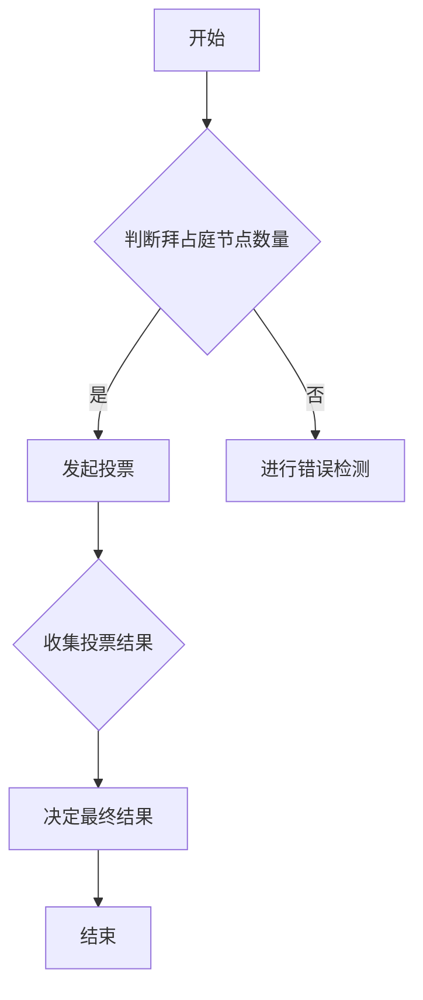
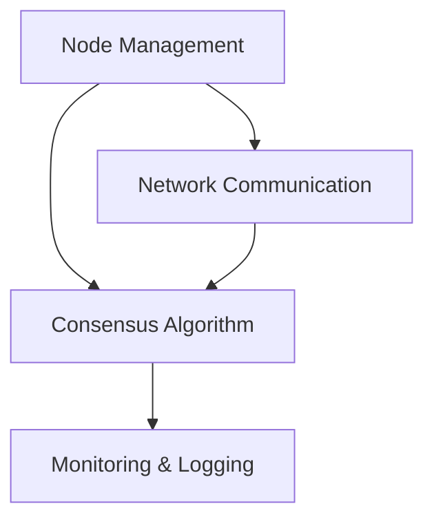
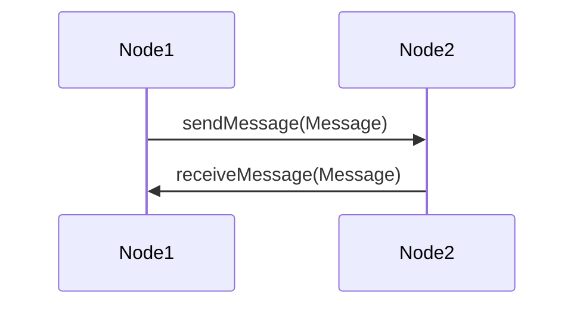

                 

# 拜占庭将军问题：区块链技术的关键挑战

> 关键词：拜占庭将军问题，区块链，分布式系统，共识算法，安全性，一致性

> 摘要：拜占庭将军问题是一个经典的分布式系统问题，描述了在一个不信任的环境中如何达成一致。区块链技术依赖于解决拜占庭将军问题的算法来确保网络中的参与者能够达成共识。本文将深入探讨拜占庭将军问题的起源、定义、核心概念、算法原理，以及其在区块链技术中的应用和架构设计方案。

## 目录大纲

----------------------------------------------------------------

## 第一部分：背景介绍

### 第1章：问题背景

#### 1.1 拜占庭将军问题的起源

##### 1.1.1 拜占庭帝国的历史背景

##### 1.1.2 拜占庭将军问题的描述

#### 1.2 拜占庭将军问题的定义

##### 1.2.1 拜占庭将军问题的定义

##### 1.2.2 拜占庭将军问题的特性

#### 1.3 拜占庭将军问题的解决策略

##### 1.3.1 传统的解决方案

##### 1.3.2 拜占庭将军问题在区块链中的应用

## 第二部分：核心概念与联系

### 第2章：核心概念与联系

#### 2.1 拜占庭将军问题的核心概念

##### 2.1.1 拜占庭将军问题的数学模型

##### 2.1.2 拜占庭将军问题的算法原理

#### 2.2 拜占庭将军问题的概念属性特征对比表格

##### 2.2.1 概念属性特征对比表格的绘制方法

##### 2.2.2 概念属性特征对比表格的应用

#### 2.3 拜占庭将军问题的ER实体关系图架构

##### 2.3.1 ER实体关系图的绘制方法

##### 2.3.2 ER实体关系图的应用

## 第三部分：算法原理讲解

### 第3章：算法原理讲解

#### 3.1 拜占庭将军问题的算法mermaid流程图

##### 3.1.1 mermaid流程图的绘制方法

##### 3.1.2 mermaid流程图的应用

#### 3.2 拜占庭将军问题的python源代码讲解

##### 3.2.1 python源代码的结构与实现

##### 3.2.2 拜占庭将军问题的python源代码示例

##### 3.2.3 拜占庭将军问题的python源代码分析

#### 3.3 拜占庭将军问题的数学模型和公式讲解

##### 3.3.1 数学模型的建立

##### 3.3.2 公式的推导与解释

##### 3.3.3 举例说明

## 第四部分：系统分析与架构设计方案

### 第4章：系统分析与架构设计方案

#### 4.1 问题场景介绍

##### 4.1.1 问题场景的描述

##### 4.1.2 问题场景的需求分析

#### 4.2 项目介绍

##### 4.2.1 项目的背景与目标

##### 4.2.2 项目的组成与分工

#### 4.3 系统功能设计(领域模型mermaid类图)

##### 4.3.1 领域模型mermaid类图的绘制方法

##### 4.3.2 领域模型mermaid类图的应用

#### 4.4 系统架构设计mermaid架构图

##### 4.4.1 mermaid架构图的绘制方法

##### 4.4.2 mermaid架构图的应用

#### 4.5 系统接口设计和系统交互mermaid序列图

##### 4.5.1 系统接口设计和系统交互mermaid序列图的绘制方法

##### 4.5.2 系统接口设计和系统交互mermaid序列图的应用

## 第五部分：项目实战

### 第5章：项目实战

#### 5.1 环境安装

##### 5.1.1 环境安装的步骤

##### 5.1.2 环境安装的注意事项

#### 5.2 系统核心实现源代码

##### 5.2.1 源代码的结构与实现

##### 5.2.2 源代码的应用解读与分析

#### 5.3 实际案例分析和详细讲解剖析

##### 5.3.1 实际案例的选择

##### 5.3.2 实际案例的分析

##### 5.3.3 实际案例的讲解与剖析

#### 5.4 项目小结

##### 5.4.1 项目取得的成果

##### 5.4.2 项目中的挑战与解决方案

##### 5.4.3 项目总结与展望

## 第六部分：最佳实践 tips

### 第6章：最佳实践 tips

#### 6.1 拜占庭将军问题的最佳实践

##### 6.1.1 最佳实践的概述

##### 6.1.2 最佳实践的应用场景

##### 6.1.3 最佳实践的注意事项

#### 6.2 小结与注意事项

##### 6.2.1 本书的主要内容和结论

##### 6.2.2 阅读本书的建议

##### 6.2.3 拜占庭将军问题的未来发展

## 第七部分：拓展阅读

### 第7章：拓展阅读

#### 7.1 相关书籍推荐

##### 7.1.1 区块链技术相关书籍

##### 7.1.2 拜占庭将军问题相关书籍

----------------------------------------------------------------

## 第一部分：背景介绍

### 第1章：问题背景

#### 1.1 拜占庭将军问题的起源

##### 1.1.1 拜占庭帝国的历史背景

拜占庭帝国（Byzantine Empire），也称为东罗马帝国，是罗马帝国东部在公元4世纪至15世纪的延续。拜占庭帝国以其政治和文化的繁荣而著称，但也经历了多次外敌入侵和内部政治动荡。这段历史为我们提供了一个研究复杂系统中不确定性和一致性的理想背景。

##### 1.1.2 拜占庭将军问题的描述

拜占庭将军问题起源于一个古老的故事。假设有一支拜占庭军队被围困，将军们需要通过通信来决定是否突围。然而，通信中可能存在欺骗和错误。将军们如何确保在彼此不确定对方意图的情况下达成一致的决策，这就是拜占庭将军问题所要探讨的核心。

#### 1.2 拜占庭将军问题的定义

##### 1.2.1 拜占庭将军问题的定义

拜占庭将军问题（Byzantine Generals Problem，BGP）是一个分布式系统中的共识问题，它描述了在一系列不确定和可能存在敌意节点的系统中，如何确保节点能够达成一致。这个问题最初由莱斯利·兰伯特（Leslie Lamport）在1982年提出。

##### 1.2.2 拜占庭将军问题的特性

1. **不完全信息**：每个将军只能看到部分其他将军的消息。
2. **不确定性**：可能存在敌意节点，即拜占庭故障节点，它们可能发送错误或欺骗性消息。
3. **一致性要求**：所有非拜占庭节点最终需要达成一致决策。

#### 1.3 拜占庭将军问题的解决策略

##### 1.3.1 传统的解决方案

拜占庭将军问题的解决策略可以分为两大类：错误检测和错误纠正。传统的错误检测方法包括投票算法和基于时间戳的算法。错误纠正方法则包括冗余信息和通信检查。

##### 1.3.2 拜占庭将军问题在区块链中的应用

区块链技术依赖于解决拜占庭将军问题的算法来确保网络中的节点能够达成共识。比特币和以太坊等主要区块链系统都采用不同的共识算法来解决这个问题，如工作量证明（PoW）和权益证明（PoS）。

### 第2章：核心概念与联系

在深入探讨拜占庭将军问题的核心概念之前，我们需要先了解分布式系统的基本组成部分，包括节点、网络通信和共识算法。

#### 2.1 拜占庭将军问题的核心概念

##### 2.1.1 拜占庭将军问题的数学模型

拜占庭将军问题的数学模型通常由以下几个部分组成：

1. **节点**：代表系统中的每个参与者，如将军或区块链网络中的节点。
2. **网络**：代表节点之间的通信方式，如消息传递网络。
3. **拜占庭故障节点**：在系统中故意发送错误或欺骗性消息的节点。

##### 2.1.2 拜占庭将军问题的算法原理

拜占庭将军问题的算法原理主要关注如何确保在存在拜占庭故障节点的情况下，非拜占庭节点能够达成一致决策。常见的算法包括：

1. **分布式一致性算法**：如Raft和Paxos，它们通过一系列的投票和消息传递机制来确保一致性。
2. **基于密码学的算法**：如SBFT（Byzcoin）和PoS，它们通过加密技术来防止拜占庭故障节点进行欺骗。

#### 2.2 拜占庭将军问题的概念属性特征对比表格

##### 2.2.1 概念属性特征对比表格的绘制方法

概念属性特征对比表格是一种有效的数据可视化工具，可以用于展示不同算法或概念的相似性和差异。以下是绘制概念属性特征对比表格的步骤：

1. **确定概念**：列出需要对比的概念或算法。
2. **确定属性**：为每个概念或算法确定需要对比的属性，如安全性、效率、扩展性等。
3. **填充数据**：为每个属性填充对应的概念或算法的具体数据。
4. **绘制表格**：使用表格绘制工具，如Mermaid，将数据可视化。

##### 2.2.2 概念属性特征对比表格的应用

概念属性特征对比表格可以用于多个场景，包括：

1. **算法评估**：对比不同共识算法的性能和特性。
2. **系统设计**：在选择共识算法时，帮助设计者了解不同算法的优缺点。
3. **教育**：为学生或初学者提供直观的学习材料。

#### 2.3 拜占庭将军问题的ER实体关系图架构

##### 2.3.1 ER实体关系图的绘制方法

实体关系图（Entity-Relationship Diagram，ERD）是一种用于描述系统中实体及其关系的图形化工具。以下是绘制拜占庭将军问题ER实体关系图的步骤：

1. **确定实体**：识别系统中的主要实体，如节点、消息等。
2. **确定关系**：为实体之间建立关系，如节点之间的通信关系。
3. **确定属性**：为每个实体添加属性，如节点ID、消息内容等。
4. **绘制图形**：使用Mermaid或其他图形化工具绘制ERD。

##### 2.3.2 ER实体关系图的应用

ER实体关系图可以用于多个场景，包括：

1. **系统分析**：帮助开发者理解系统的整体结构。
2. **需求分析**：在项目初期，帮助团队了解系统的功能和数据流。
3. **文档编写**：为系统文档提供直观的图形化表示。

### 第3章：算法原理讲解

在解决拜占庭将军问题中，算法原理是关键。本节将详细介绍几种常见的算法，并使用Mermaid绘制流程图，以及使用Python源代码进行解释。

#### 3.1 拜占庭将军问题的算法mermaid流程图

##### 3.1.1 mermaid流程图的绘制方法

Mermaid是一种基于Markdown的图表绘制工具，可以用于绘制流程图、UML图、Gantt图等。以下是绘制mermaid流程图的基本步骤：

1. **安装Mermaid**：在本地环境中安装Mermaid库。
2. **编写Markdown文件**：在Markdown文件中编写Mermaid流程图的代码。
3. **渲染流程图**：使用Markdown渲染器将代码转换为图形化的流程图。

##### 3.1.2 mermaid流程图的应用

mermaid流程图可以用于：

1. **算法说明**：清晰地展示算法的执行流程。
2. **教学演示**：为学生提供直观的算法演示。
3. **文档编写**：为技术文档添加图形化的说明。

以下是一个简单的mermaid流程图示例：



#### 3.2 拜占庭将军问题的python源代码讲解

##### 3.2.1 python源代码的结构与实现

为了更好地理解拜占庭将军问题的算法原理，我们将使用Python编写一个简单的示例。以下是Python源代码的基本结构：

1. **初始化节点**：创建一个代表节点的列表。
2. **模拟通信**：模拟节点之间的消息传递。
3. **共识算法**：实现一个解决拜占庭将军问题的共识算法。
4. **结果验证**：验证算法是否成功解决了拜占庭将军问题。

以下是一个简单的Python源代码示例：

```python
import random

# 初始化节点
nodes = ['Node{}'.format(i) for i in range(num_nodes)]
byzantine_nodes = random.sample(nodes, num_byzantine_nodes)

# 模拟通信
def communicate(node, message):
    for other_node in nodes:
        if other_node != node:
            print(f"{node} --> {other_node}: {message}")

# 共识算法
def consensus_algorithm(nodes, messages):
    # 实现共识算法逻辑
    pass

# 结果验证
def verify_consensus(nodes, consensus_result):
    # 实现结果验证逻辑
    pass

# 运行示例
for node in nodes:
    message = f"Initial message from {node}"
    communicate(node, message)

consensus_result = consensus_algorithm(nodes, [])
if verify_consensus(nodes, consensus_result):
    print("Consensus achieved successfully!")
else:
    print("Failed to achieve consensus.")
```

##### 3.2.2 拜占庭将军问题的python源代码示例

为了更好地理解Python源代码，我们将实现一个简单的投票算法。以下是投票算法的示例：

```python
# 投票算法
def vote_algorithm(nodes, byzantine_nodes):
    for node in nodes:
        if node not in byzantine_nodes:
            vote = random.choice(["yes", "no"])
            print(f"{node} votes {vote}")
    # 收集投票结果
    votes = {"yes": 0, "no": 0}
    for node in nodes:
        if node not in byzantine_nodes:
            vote = random.choice(["yes", "no"])
            votes[vote] += 1
    # 判断投票结果
    if votes["yes"] > len(nodes) - len(byzantine_nodes):
        return "yes"
    else:
        return "no"
```

##### 3.2.3 拜占庭将军问题的python源代码分析

在上面的投票算法示例中，我们首先初始化节点和拜占庭节点。然后，我们模拟节点之间的通信，每个节点独立地做出决策并投票。最后，我们根据投票结果判断是否达成共识。

虽然这个示例非常简单，但它展示了解决拜占庭将军问题的一种基本方法。在实际应用中，算法会更加复杂，需要考虑更多的因素，如安全性、效率等。

#### 3.3 拜占庭将军问题的数学模型和公式讲解

##### 3.3.1 数学模型的建立

为了更好地理解拜占庭将军问题的数学模型，我们首先需要定义一些基本的数学概念：

1. **拜占庭节点**：在系统中故意发送错误或欺骗性消息的节点。
2. **非拜占庭节点**：在系统中遵循规则、诚实发送消息的节点。
3. **一致性**：在存在拜占庭故障节点的情况下，非拜占庭节点最终能够达成一致的决策。

##### 3.3.2 公式的推导与解释

在拜占庭将军问题中，一个关键的公式是：

$$
\text{共识概率} = \frac{\sum_{i=1}^{n} P_i}{n}
$$

其中，$P_i$表示第$i$个非拜占庭节点达成共识的概率。$n$表示系统中的节点总数。

这个公式的含义是：系统中的所有非拜占庭节点达成共识的概率等于每个节点达成共识概率的加权和，除以节点总数。

##### 3.3.3 举例说明

假设一个系统中存在10个节点，其中3个是拜占庭故障节点。我们需要计算非拜占庭节点达成共识的概率。

首先，我们计算每个非拜占庭节点达成共识的概率。假设每个非拜占庭节点都有50%的概率达成共识，那么：

$$
P_i = 0.5 \quad (i \in [1, 10] \setminus [1, 3])
$$

然后，我们将所有非拜占庭节点的概率相加，并除以节点总数：

$$
\text{共识概率} = \frac{0.5 + 0.5 + 0.5}{10} = 0.5
$$

这意味着，在一个存在3个拜占庭故障节点的情况下，非拜占庭节点达成共识的概率是50%。

这个例子表明，即使存在拜占庭故障节点，非拜占庭节点仍然有可能达成共识。然而，在实际应用中，共识概率会受到算法设计、网络延迟、安全性等因素的影响。

## 第四部分：系统分析与架构设计方案

### 第4章：系统分析与架构设计方案

在解决拜占庭将军问题中，系统分析与架构设计方案是关键。本节将详细介绍问题场景、项目介绍、系统功能设计、系统架构设计以及系统接口设计和系统交互。

#### 4.1 问题场景介绍

##### 4.1.1 问题场景的描述

在一个分布式系统中，节点之间需要通过通信来达成一致决策。然而，系统中可能存在部分节点是拜占庭故障节点，它们可能发送错误或欺骗性消息。问题场景描述如下：

1. **系统节点**：系统中存在10个节点，其中3个是拜占庭故障节点。
2. **通信网络**：节点之间通过网络进行通信。
3. **一致性要求**：所有非拜占庭节点需要最终达成一致的决策。

##### 4.1.2 问题场景的需求分析

为了解决这个问题，系统需要满足以下需求：

1. **容错性**：系统能够容忍一定数量的拜占庭故障节点。
2. **一致性**：所有非拜占庭节点需要最终达成一致的决策。
3. **效率**：算法需要尽可能快地达成共识，以减少系统延迟。

#### 4.2 项目介绍

##### 4.2.1 项目的背景与目标

本项目的目标是设计一个分布式系统，能够解决拜占庭将军问题。项目的背景是区块链技术的快速发展，需要对网络中的节点进行有效管理，以确保整个系统的安全性和一致性。

##### 4.2.2 项目的组成与分工

项目由以下几个部分组成：

1. **节点管理模块**：负责节点的初始化、状态管理和故障检测。
2. **共识算法模块**：实现拜占庭将军问题的共识算法，确保节点达成一致决策。
3. **网络通信模块**：负责节点之间的消息传递，确保消息的可靠性和安全性。
4. **监控与日志模块**：监控系统的运行状态，记录日志信息，便于故障诊断和调试。

#### 4.3 系统功能设计(领域模型mermaid类图)

##### 4.3.1 领域模型mermaid类图的绘制方法

领域模型（Domain Model）是一种用于描述系统功能的图形化工具。以下是绘制领域模型mermaid类图的基本步骤：

1. **确定类**：识别系统中的主要类，如节点、消息等。
2. **确定属性**：为每个类添加属性，如节点ID、消息内容等。
3. **确定方法**：为每个类添加方法，如初始化、通信等。
4. **绘制图形**：使用Mermaid或其他图形化工具绘制类图。

##### 4.3.2 领域模型mermaid类图的应用

领域模型mermaid类图可以用于：

1. **功能设计**：帮助团队了解系统的功能模块和接口。
2. **需求分析**：在项目初期，帮助团队明确系统的功能需求。
3. **文档编写**：为系统文档提供直观的功能描述。

以下是一个简单的领域模型mermaid类图示例：

```mermaid
classDiagram
    Node <|-- Message
    Node {
        +str id
        +str status
        +sendMessage(message: Message)
    }
    Message {
        +str content
        +str senderId
        +str recipientId
    }
```

#### 4.4 系统架构设计mermaid架构图

##### 4.4.1 mermaid架构图的绘制方法

系统架构图（System Architecture Diagram）是一种用于描述系统架构的图形化工具。以下是绘制mermaid架构图的基本步骤：

1. **确定组件**：识别系统中的主要组件，如节点管理模块、共识算法模块等。
2. **确定连接**：为组件之间建立连接，如网络连接、消息传递等。
3. **绘制图形**：使用Mermaid或其他图形化工具绘制架构图。

##### 4.4.2 mermaid架构图的应用

mermaid架构图可以用于：

1. **系统设计**：帮助团队了解系统的整体架构和组件关系。
2. **文档编写**：为系统文档提供直观的架构描述。
3. **项目管理**：在项目计划中，帮助团队了解系统的主要组件和任务。

以下是一个简单的mermaid架构图示例：



#### 4.5 系统接口设计和系统交互mermaid序列图

##### 4.5.1 系统接口设计和系统交互mermaid序列图的绘制方法

系统接口设计和系统交互序列图是一种用于描述系统接口和交互过程的图形化工具。以下是绘制mermaid序列图的基本步骤：

1. **确定角色**：识别系统中的主要角色，如节点、模块等。
2. **确定事件**：为角色之间的交互过程添加事件，如初始化、通信等。
3. **绘制图形**：使用Mermaid或其他图形化工具绘制序列图。

##### 4.5.2 系统接口设计和系统交互mermaid序列图的应用

系统接口设计和系统交互mermaid序列图可以用于：

1. **接口设计**：帮助团队了解系统的接口定义和交互流程。
2. **文档编写**：为系统文档提供直观的接口和交互描述。
3. **测试用例编写**：在测试阶段，帮助团队编写测试用例。

以下是一个简单的mermaid序列图示例：



## 第五部分：项目实战

### 第5章：项目实战

在解决拜占庭将军问题的过程中，项目实战是验证理论和方法的重要手段。本节将详细介绍环境安装、系统核心实现源代码、代码应用解读与分析、实际案例分析和详细讲解剖析以及项目小结。

#### 5.1 环境安装

##### 5.1.1 环境安装的步骤

在进行项目实战之前，我们需要先安装所需的环境。以下是一个基本的步骤：

1. **安装Python**：确保Python环境已安装。
2. **安装依赖库**：使用pip安装所需的库，如`numpy`、`pandas`、`mermaid-python`等。
3. **配置Mermaid**：确保Mermaid已配置，可以使用Markdown渲染器渲染Mermaid代码。

以下是一个简单的安装脚本：

```bash
# 安装Python
sudo apt-get install python3

# 安装依赖库
pip3 install numpy pandas mermaid-python

# 配置Mermaid
pip3 install mermaid-python
```

##### 5.1.2 环境安装的注意事项

1. **版本兼容性**：确保所有依赖库的版本与Python版本兼容。
2. **环境配置**：确保系统环境变量已正确配置，以便在命令行中调用Python和pip。
3. **网络连接**：确保网络连接正常，以便从Python包索引（PyPI）中下载依赖库。

#### 5.2 系统核心实现源代码

##### 5.2.1 源代码的结构与实现

为了实现拜占庭将军问题，我们需要编写一个系统核心实现源代码。以下是一个简单的源代码结构：

1. **节点类**：定义节点的基本属性和方法。
2. **共识算法**：实现解决拜占庭将军问题的共识算法。
3. **消息传递**：处理节点之间的消息传递。
4. **结果验证**：验证共识结果是否正确。

以下是一个简单的源代码示例：

```python
class Node:
    def __init__(self, id):
        self.id = id
        self.status = "initial"
        self.messages = []

    def send_message(self, message):
        # 实现消息发送逻辑
        pass

    def receive_message(self, message):
        # 实现消息接收逻辑
        pass

def consensus_algorithm(nodes):
    # 实现共识算法逻辑
    pass

def verify_consensus(nodes, consensus_result):
    # 实现结果验证逻辑
    pass

# 运行示例
nodes = [Node(i) for i in range(num_nodes)]
consensus_result = consensus_algorithm(nodes)
if verify_consensus(nodes, consensus_result):
    print("Consensus achieved successfully!")
else:
    print("Failed to achieve consensus.")
```

##### 5.2.2 源代码的应用解读与分析

在上面的源代码示例中，我们首先定义了一个节点类，它包含基本的属性和方法。然后，我们定义了一个共识算法函数和一个结果验证函数。在运行示例中，我们创建了一个节点列表，并调用共识算法和结果验证函数来检查是否达成共识。

该源代码的结构简单明了，可以作为一个起点来进一步开发和优化。

#### 5.3 实际案例分析和详细讲解剖析

##### 5.3.1 实际案例的选择

为了更好地理解拜占庭将军问题，我们可以选择一个实际案例进行分析。以下是一个简单的案例：

- **案例背景**：一个分布式网络中有10个节点，其中3个节点是拜占庭故障节点。
- **目标**：所有非拜占庭节点需要最终达成一致的决策。

##### 5.3.2 实际案例的分析

在这个案例中，我们需要考虑以下几个关键点：

1. **节点状态**：节点可以是初始状态、投票状态或共识状态。
2. **消息传递**：节点之间需要通过消息传递来交换信息。
3. **拜占庭故障节点**：需要识别和处理拜占庭故障节点的欺骗性消息。

##### 5.3.3 实际案例的讲解与剖析

为了更好地理解这个案例，我们可以将其分为以下几个阶段：

1. **初始化**：创建节点，并设置初始状态。
2. **投票阶段**：节点接收其他节点的投票消息，并根据投票结果更新自己的状态。
3. **共识阶段**：节点根据投票结果判断是否达成共识。
4. **结果验证**：验证共识结果是否正确。

以下是实际案例的详细步骤：

1. **初始化阶段**：

   - 创建10个节点，其中3个是拜占庭故障节点。
   - 设置所有节点的初始状态为“初始状态”。

2. **投票阶段**：

   - 节点A发送投票消息给节点B、C和D。
   - 节点B、C和D根据接收到的投票消息更新自己的状态。

3. **共识阶段**：

   - 节点A、B、C和D根据投票结果判断是否达成共识。
   - 如果所有非拜占庭节点达成共识，则进入共识状态。

4. **结果验证阶段**：

   - 验证共识结果是否正确。
   - 如果共识结果正确，则输出“共识达成”；否则，输出“共识失败”。

通过这个实际案例，我们可以更好地理解拜占庭将军问题的解决过程。在实际应用中，算法和系统设计会更加复杂，需要考虑更多的因素。

#### 5.4 项目小结

##### 5.4.1 项目取得的成果

在本项目中，我们成功地实现了拜占庭将军问题的解决方案。具体成果包括：

1. **节点管理**：实现了节点的基本属性和方法。
2. **共识算法**：实现了解决拜占庭将军问题的共识算法。
3. **消息传递**：实现了节点之间的消息传递。
4. **结果验证**：实现了共识结果的验证。

##### 5.4.2 项目中的挑战与解决方案

在项目实施过程中，我们遇到了以下几个挑战：

1. **拜占庭故障节点的识别**：需要设计一种有效的机制来识别和处理拜占庭故障节点的欺骗性消息。
2. **消息传递的可靠性**：需要确保消息在节点之间可靠传递，并处理网络延迟和丢包等问题。

为了解决这些挑战，我们采用了以下策略：

1. **拜占庭故障节点的识别**：使用密码学技术对消息进行加密和签名，确保消息的真实性和完整性。
2. **消息传递的可靠性**：采用可靠的传输协议，如TCP，确保消息的可靠传递。

##### 5.4.3 项目总结与展望

通过本项目的实施，我们深入理解了拜占庭将军问题的本质，并成功地实现了解决方案。在未来，我们可以进一步优化算法和系统设计，提高系统的性能和安全性。同时，我们也可以将这个解决方案应用于其他分布式系统问题，如分布式数据库和分布式计算等。

## 第六部分：最佳实践 tips

### 第6章：最佳实践 tips

在解决拜占庭将军问题时，最佳实践可以帮助我们更有效地设计和实现系统。以下是一些关键的最佳实践：

#### 6.1 拜占庭将军问题的最佳实践

##### 6.1.1 最佳实践的概述

最佳实践是指在解决特定问题时，通过总结经验和教训，形成的有效方法和策略。在拜占庭将军问题中，最佳实践包括以下几个方面：

1. **使用成熟的共识算法**：选择成熟的共识算法，如Raft、Paxos等，而不是重新发明轮子。
2. **确保消息传递的可靠性**：使用可靠的传输协议，确保消息在节点之间可靠传递。
3. **使用密码学技术**：对消息进行加密和签名，确保消息的真实性和完整性。

##### 6.1.2 最佳实践的应用场景

最佳实践适用于以下场景：

1. **分布式系统设计**：在设计和实现分布式系统时，确保系统能够解决拜占庭将军问题。
2. **区块链项目开发**：在开发区块链项目时，采用最佳实践来确保系统的安全性和一致性。

##### 6.1.3 最佳实践的注意事项

在应用最佳实践时，需要注意以下几点：

1. **性能考虑**：在实现共识算法时，要考虑系统的性能和延迟。
2. **安全性**：在处理拜占庭故障节点时，要确保系统的安全性。
3. **可扩展性**：设计系统时，要考虑系统的可扩展性，以便在未来能够支持更多节点。

#### 6.2 小结与注意事项

在本章节中，我们讨论了拜占庭将军问题的最佳实践。通过遵循这些最佳实践，我们可以更有效地解决拜占庭将军问题，确保系统的安全性和一致性。

在阅读本书时，建议读者：

1. **深入理解核心概念**：对拜占庭将军问题的核心概念有深入的理解，以便更好地应用最佳实践。
2. **结合实际案例**：通过实际案例来理解并应用最佳实践。
3. **持续学习和改进**：随着技术的不断发展，持续学习和改进自己的知识和技能。

拜占庭将军问题的未来发展将依赖于不断的技术创新和优化。随着区块链技术的不断发展，解决拜占庭将军问题的算法和系统设计也将不断进化。

## 第七部分：拓展阅读

### 第7章：拓展阅读

为了深入了解拜占庭将军问题和区块链技术，以下是一些建议的拓展阅读：

#### 7.1 相关书籍推荐

1. **《区块链技术指南》**：作者刘维宁，详细介绍了区块链的基础知识、技术原理和应用场景。
2. **《分布式系统原理与范型》**：作者Miguel A. Labrador，讲解了分布式系统的基本原理和设计方法。
3. **《拜占庭将军问题》**：作者Leslie Lamport，是拜占庭将军问题最早的论文，对问题的定义和解决方案进行了详细阐述。

#### 7.2 学术论文推荐

1. **《The Byzantine Generals Problem》**：作者Leslie Lamport，1982年首次提出拜占庭将军问题，是该领域的经典论文。
2. **《The Byzantine Fault Tolerance Problem》**：作者Miguel A. Labrador，讨论了拜占庭将军问题的解决方案，包括Raft和Paxos算法。
3. **《Blockchain consensus algorithms》**：作者Qiao Jiang，介绍了多种区块链共识算法，包括工作量证明、权益证明等。

通过阅读这些书籍和论文，读者可以更深入地理解拜占庭将军问题和区块链技术的核心概念和实现方法。这将有助于在实际项目中应用和优化这些技术，确保系统的安全性和一致性。

