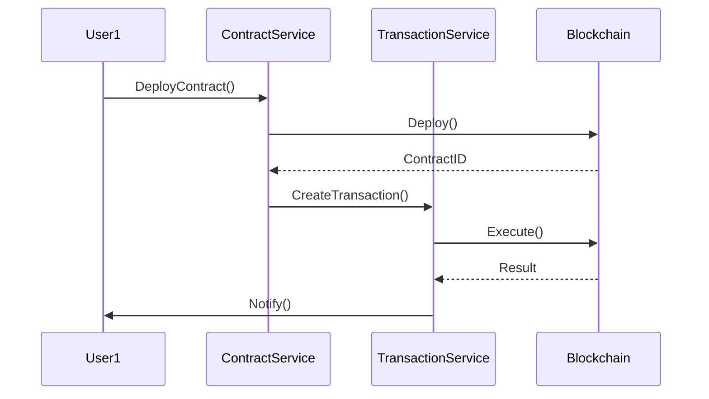
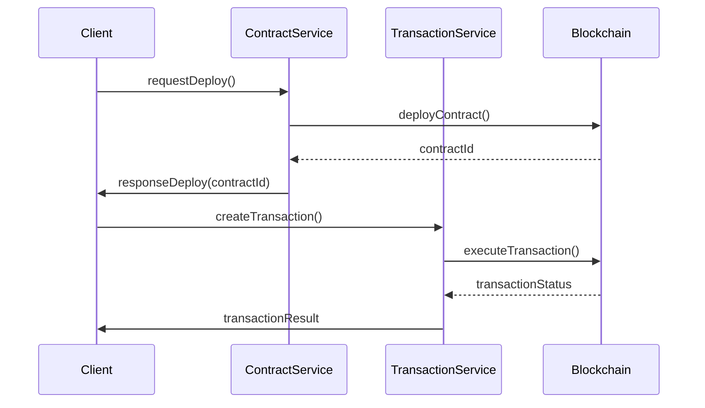

                 

### 区块链智能合约：去中心化的可信执行环境

关键词：区块链、智能合约、去中心化、可信执行环境、加密技术、共识机制

摘要：本文将深入探讨区块链智能合约的基本概念、工作原理及其在去中心化可信执行环境中的应用。通过逐步分析区块链的技术架构、加密技术、智能合约设计、安全性和实际应用场景，本文旨在帮助读者全面了解区块链智能合约的原理和优势，并展望其未来的发展趋势。

## 目录大纲

1. **区块链智能合约：去中心化的可信执行环境**
   1. 关键词
   2. 摘要
2. **第一部分：区块链基础**
   1. 第1章 区块链概述
      1. 区块链的定义与特点
      2. 区块链的技术架构
      3. 区块链的发展历程
   2. 第2章 加密技术基础
      1. 加密与解密原理
      2. 常见加密算法
      3. 数字签名与证书
3. **第二部分：智能合约设计**
   1. 第3章 智能合约概述
      1. 智能合约的概念
      2. 智能合约的工作原理
      3. 智能合约的优点与挑战
   2. 第4章 智能合约编程语言
      1. Solidity语言基础
      2. Solidity语言高级特性
      3. 智能合约开发工具
   3. 第5章 智能合约安全性
      1. 智能合约安全威胁
      2. 智能合约安全防御策略
      3. 安全审计与测试
4. **第三部分：去中心化的可信执行环境**
   1. 第6章 区块链网络与共识机制
      1. 区块链网络架构
      2. 共识机制原理
      3. 常见共识算法
   2. 第7章 区块链的透明性与不可篡改性
      1. 数据透明性
      2. 数据不可篡改
      3. 透明性与不可篡改性的实现
   3. 第8章 去中心化的可信执行环境
      1. 可信执行环境的概念
      2. 可信执行环境的优势
      3. 实现去中心化可信执行环境的挑战
5. **第四部分：应用场景**
   1. 第9章 区块链智能合约在金融领域的应用
      1. 供应链金融
      2. 保险理赔
      3. 跨境支付
   2. 第10章 区块链智能合约在非金融领域的应用
      1. 供应链管理
      2. 物流追踪
      3. 文艺创作版权保护
   3. 第11章 区块链智能合约的未来发展趋势
      1. 技术创新
      2. 应用领域拓展
      3. 潜在挑战与解决思路

### 引言

区块链技术作为一种去中心化的分布式数据库技术，自2008年比特币的出现以来，逐渐受到了全球范围内的关注。区块链以其不可篡改、透明性和安全性等特点，在金融、供应链管理、版权保护等多个领域展现出了巨大的潜力。而智能合约作为区块链的核心组成部分，进一步提升了区块链的应用价值。本文将从以下几个方面进行探讨：

1. **区块链基础**：介绍区块链的定义、特点、技术架构及其发展历程。
2. **加密技术基础**：阐述加密与解密原理、常见加密算法及其在区块链中的应用。
3. **智能合约设计**：探讨智能合约的概念、工作原理、编程语言及安全性。
4. **去中心化的可信执行环境**：分析区块链网络与共识机制、数据透明性与不可篡改性、可信执行环境的实现。
5. **应用场景**：探讨区块链智能合约在金融领域和非金融领域的应用案例。
6. **未来发展趋势**：展望区块链智能合约的技术创新、应用领域拓展及其面临的挑战。

通过本文的深入探讨，希望读者能够全面了解区块链智能合约的原理和优势，并为未来的研究与实践提供参考。

### 第一部分：区块链基础

#### 第1章 区块链概述

##### 1.1 区块链的定义与特点

区块链是一种去中心化的分布式账本技术，它通过多个参与节点共同维护和验证数据，确保数据的完整性和安全性。区块链的核心特点包括：

- **去中心化**：区块链不是由单一机构或组织控制，而是通过分布在全球的多个节点共同维护，使得数据更加透明和可信。
- **不可篡改性**：一旦数据被记录在区块链上，就难以被篡改或删除，从而保证了数据的历史可靠性和真实性。
- **透明性**：区块链上的所有数据都是公开透明的，任何节点都可以查看和验证数据，提高了数据的透明度。
- **安全性**：区块链利用加密技术和共识机制确保数据的安全和隐私，使得恶意攻击者难以篡改或破坏数据。

##### 1.2 区块链的技术架构

区块链的技术架构主要包括三个主要组成部分：区块、链和节点。

- **区块**：区块是区块链的基本组成单元，每个区块包含一定数量的交易记录。区块通过密码学技术链接在一起，形成区块链。
- **链**：区块链是一个由多个区块按时间顺序链接而成的链条。每个区块都包含一个时间戳和一个用于链接前一个区块的哈希值，从而保证了区块链的不可篡改性。
- **节点**：节点是区块链网络中的参与者，它们负责维护区块链、验证交易和生成新区块。节点通过共识机制共同维护区块链的一致性和安全性。

##### 1.3 区块链的发展历程

区块链技术的发展可以分为以下几个阶段：

- **第一阶段**（2008-2012）：区块链技术的概念和基本原理被提出，比特币作为第一个区块链应用出现，引起了广泛关注。
- **第二阶段**（2013-2016）：区块链技术开始应用于其他领域，例如供应链管理、金融、医疗等，涌现出许多初创公司和项目。
- **第三阶段**（2017至今）：区块链技术逐渐成熟，许多国家和地区开始制定相关政策和法规，推动区块链技术的广泛应用。

#### 第2章 加密技术基础

##### 2.1 加密与解密原理

加密技术是区块链实现数据安全性的基础。加密与解密的基本原理如下：

- **加密**：加密是将原始数据（明文）转换为无法直接读取的密文的过程。加密算法通过密钥和算法规则将明文转换为密文。
- **解密**：解密是将密文转换为原始数据（明文）的过程。解密算法通过密钥和算法规则将密文转换为明文。

##### 2.2 常见加密算法

区块链中常用的加密算法包括对称加密算法和非对称加密算法。

- **对称加密算法**：对称加密算法使用相同的密钥进行加密和解密。常见的对称加密算法有DES、AES等。对称加密算法的优点是加密速度快，但缺点是密钥分发和管理困难。
- **非对称加密算法**：非对称加密算法使用一对密钥进行加密和解密，即公钥和私钥。公钥用于加密，私钥用于解密。常见的非对称加密算法有RSA、ECC等。非对称加密算法的优点是解决了密钥分发和管理的问题，但加密速度相对较慢。

##### 2.3 数字签名与证书

数字签名是一种用于验证数据完整性和真实性的技术。数字签名的原理如下：

- **签名**：发送方使用私钥对数据进行签名，生成一个签名值。
- **验证**：接收方使用公钥对签名值进行验证，以确认数据的完整性和真实性。

数字签名与证书的关系如下：

- **数字证书**：数字证书是由可信第三方（证书颁发机构）签发的，用于证明实体身份和公钥合法性的电子文档。
- **证书链**：数字证书通过证书链与根证书颁发机构（CA）相关联，从而确保证书的真实性和可信度。

### 第二部分：智能合约设计

#### 第3章 智能合约概述

##### 3.1 智能合约的概念

智能合约是一种自动执行、管理和执行的合约，其条款以数字形式嵌入在区块链中。智能合约通过编程语言编写，当满足合约条件时，自动执行预定的操作。智能合约的核心特点包括：

- **自动化**：智能合约在满足条件时自动执行，无需人工干预，提高了交易效率。
- **不可篡改**：智能合约一旦部署到区块链上，其代码和状态不可篡改，保证了合约的公正性和可信性。
- **去中心化**：智能合约在区块链上运行，不受单一机构或组织控制，增强了合约的透明性和安全性。

##### 3.2 智能合约的工作原理

智能合约的工作原理包括以下几个步骤：

1. **编写**：开发者使用智能合约编程语言（如Solidity）编写智能合约代码。
2. **编译**：智能合约代码经过编译器编译，生成字节码。
3. **部署**：用户将编译后的智能合约字节码部署到区块链上。
4. **执行**：当满足合约条件时，智能合约自动执行预定的操作，例如转移资金、记录数据等。
5. **状态更新**：智能合约执行后，其状态会在区块链上更新，确保数据的真实性和完整性。

##### 3.3 智能合约的优点与挑战

智能合约的优点包括：

- **提高效率**：智能合约自动化执行，无需人工干预，提高了交易效率。
- **降低成本**：智能合约减少了中介机构的需求，降低了交易成本。
- **增强透明性**：智能合约代码公开透明，便于各方监督和审计。
- **保障安全性**：区块链的不可篡改性和加密技术保障了智能合约的安全性。

智能合约面临的挑战包括：

- **代码安全**：智能合约代码的安全性对合约的执行至关重要，但编写高质量的智能合约代码具有一定难度。
- **共识问题**：智能合约的执行依赖于区块链网络的共识机制，在共识问题上存在一定的风险。
- **法律监管**：智能合约作为一种新兴技术，其在法律监管方面存在一定的挑战。

#### 第4章 智能合约编程语言

##### 4.1 Solidity语言基础

Solidity是当前最常用的智能合约编程语言之一，其特点如下：

- **易学易用**：Solidity具有类似JavaScript和Python的语法，易于学习和使用。
- **功能丰富**：Solidity支持多种编程语言特性，如函数、循环、条件语句等，适合编写复杂的智能合约。
- **安全性高**：Solidity经过多年的发展和优化，其安全性得到了显著提升。

##### 4.2 Solidity语言高级特性

Solidity的高级特性包括：

- **事件**：事件是智能合约与外部世界交互的重要方式，用于记录智能合约执行过程中的关键事件。
- **调用**：智能合约可以通过调用其他合约的方法来执行预定的操作。
- **继承**：智能合约可以通过继承其他合约的代码，实现代码的重用和扩展。
- **修饰器**：修饰器是用于修改智能合约行为的特殊函数，可以提高代码的灵活性和可维护性。

##### 4.3 智能合约开发工具

智能合约开发工具主要包括以下几种：

- **集成开发环境（IDE）**：如Remix、Truffle等，提供智能合约编写、编译、部署和调试等功能。
- **编译器**：如Solc，用于将Solidity代码编译为字节码。
- **测试框架**：如TestRPC、Mocha等，用于测试智能合约的功能和性能。
- **部署工具**：如Ganache、Infura等，用于部署智能合约到区块链上。

### 第三部分：去中心化的可信执行环境

#### 第6章 区块链网络与共识机制

##### 6.1 区块链网络架构

区块链网络由多个节点组成，每个节点负责维护和验证区块链数据。区块链网络架构主要包括以下几种类型：

- **P2P网络**：P2P（Peer-to-Peer）网络是区块链网络的主要形式，节点之间直接进行通信，无需中心化服务器。
- **分布式网络**：分布式网络通过多个节点共同维护区块链数据，提高了系统的可靠性和容错性。
- **公有链与私有链**：公有链允许所有节点参与区块链维护，私有链则限制参与节点的范围。

##### 6.2 共识机制原理

共识机制是区块链网络中节点达成一致性的关键机制。常见的共识机制包括：

- **工作量证明（PoW）**：节点通过计算复杂度竞争获得区块生成权，解决了双花问题。
- **权益证明（PoS）**：节点根据持有的代币数量和期限获得区块生成权，降低了能源消耗。
- **委托权益证明（DPoS）**：节点通过投票方式选举产生区块生成者，提高了交易处理速度。

##### 6.3 常见共识算法

常见的共识算法包括：

- **比特币（PoW）**：比特币采用PoW共识算法，通过计算复杂度竞争获得区块生成权。
- **以太坊（PoS）**：以太坊2.0采用PoS共识算法，通过持有代币数量和期限获得区块生成权。
- ** delegateByzantine-tolerant consensus (dBFT) **：dBFT是一种适合私有链和联盟链的共识算法，具有快速共识和低延迟的特点。

#### 第7章 区块链的透明性与不可篡改性

##### 7.1 数据透明性

区块链的透明性体现在以下几个方面：

- **公开数据**：区块链上的所有数据都是公开透明的，任何节点都可以查看和验证。
- **实时更新**：区块链上的数据实时更新，确保数据的最新状态。
- **不可篡改**：区块链上的数据一旦被记录，就难以被篡改或删除，保证了数据的历史可靠性和真实性。

##### 7.2 数据不可篡改性

区块链的数据不可篡改性主要体现在以下几个方面：

- **链式结构**：区块链采用链式结构，每个区块通过哈希值与前一个区块链接，形成一条不可篡改的链条。
- **共识机制**：区块链网络中的节点通过共识机制共同维护区块链数据，确保数据的一致性和不可篡改性。
- **加密技术**：区块链利用加密技术确保数据的隐私性和安全性，防止恶意篡改。

##### 7.3 透明性与不可篡改性的实现

区块链的透明性与不可篡改性的实现包括以下几个步骤：

1. **数据加密**：区块链上的数据在存储和传输过程中使用加密技术进行加密，确保数据的隐私性和安全性。
2. **分布式存储**：区块链数据分布式存储在多个节点上，防止单点故障和数据丢失。
3. **共识验证**：区块链网络中的节点通过共识机制共同验证数据的合法性和有效性，确保数据的一致性和不可篡改性。
4. **链式结构**：区块链采用链式结构，通过哈希值链接区块，确保数据的历史可靠性和真实性。

#### 第8章 去中心化的可信执行环境

##### 8.1 可信执行环境的概念

可信执行环境（Trusted Execution Environment，TEE）是一种安全计算环境，用于在不可信硬件和软件环境中提供安全计算和存储服务。可信执行环境的核心特点包括：

- **隔离性**：可信执行环境提供硬件和软件隔离，确保数据的安全性和隐私性。
- **安全性**：可信执行环境通过加密技术确保数据的机密性和完整性。
- **可验证性**：可信执行环境具有可验证性，用户可以验证其安全性和正确性。

##### 8.2 可信执行环境的优势

可信执行环境的优势包括：

- **数据安全性**：可信执行环境提供数据隔离和保护，防止数据泄露和篡改。
- **隐私保护**：可信执行环境确保用户隐私，防止第三方访问和监控。
- **信任构建**：可信执行环境为去中心化应用提供可信基础，增强用户信任。
- **合规性**：可信执行环境有助于满足相关法规和标准，提高应用合规性。

##### 8.3 实现去中心化可信执行环境的挑战

实现去中心化可信执行环境面临以下挑战：

- **性能优化**：可信执行环境需要优化性能，以适应去中心化应用的高效运行。
- **安全性验证**：确保可信执行环境的安全性，防止恶意攻击和漏洞。
- **跨平台兼容性**：实现跨平台兼容性，确保可信执行环境在各种硬件和软件环境中的正常运行。
- **用户体验**：优化用户体验，提高用户对可信执行环境的接受度和使用频率。

### 第四部分：应用场景

#### 第9章 区块链智能合约在金融领域的应用

##### 9.1 供应链金融

供应链金融是一种基于区块链的金融服务，通过智能合约实现供应链上下游企业之间的融资、结算和管理。智能合约在供应链金融中的应用包括：

- **融资管理**：智能合约自动执行融资审批、放款和还款流程，提高融资效率。
- **风险控制**：智能合约通过记录供应链上下游企业的交易记录，实时监控风险，降低融资风险。
- **信用评估**：智能合约结合大数据和区块链技术，实现信用评估和信用评级，提高融资准确性。

##### 9.2 保险理赔

区块链智能合约在保险理赔中的应用主要包括以下几个方面：

- **自动化理赔**：智能合约自动执行保险理赔流程，减少人为干预，提高理赔效率。
- **透明性**：区块链上的所有交易记录公开透明，便于各方监督和审计，提高保险合同的公正性和可信度。
- **反欺诈**：智能合约通过记录和验证交易数据，提高保险理赔过程的可信度，降低欺诈风险。

##### 9.3 跨境支付

区块链智能合约在跨境支付中的应用主要包括以下几个方面：

- **高效结算**：智能合约自动执行跨境支付流程，减少人工干预，提高支付效率。
- **降低成本**：区块链智能合约降低了跨境支付的中间环节和手续费，降低了交易成本。
- **透明性**：区块链上的所有交易记录公开透明，便于各方监督和审计，提高了跨境支付的可信度。

#### 第10章 区块链智能合约在非金融领域的应用

##### 10.1 供应链管理

区块链智能合约在供应链管理中的应用主要包括以下几个方面：

- **数据记录与共享**：智能合约自动记录供应链各环节的数据，实现数据的透明和实时共享，提高供应链的协同效率。
- **防伪追溯**：智能合约通过记录产品从生产到销售的完整流程，实现产品溯源，提高产品质量和安全性。
- **智能调度**：智能合约根据供应链数据自动执行调度任务，优化供应链资源分配和物流流程。

##### 10.2 物流追踪

区块链智能合约在物流追踪中的应用主要包括以下几个方面：

- **实时监控**：智能合约自动记录物流信息，实现物流过程的实时监控，提高物流透明度。
- **智能合约支付**：智能合约自动执行物流费用的结算，减少人工干预，提高支付效率。
- **风险预警**：智能合约结合大数据分析，实现物流风险的实时预警，提高物流安全性。

##### 10.3 文艺创作版权保护

区块链智能合约在文艺创作版权保护中的应用主要包括以下几个方面：

- **版权登记**：智能合约自动记录文艺创作的版权信息，实现版权的透明和可追溯。
- **版权交易**：智能合约自动执行版权交易流程，降低交易成本，提高交易效率。
- **维权保障**：智能合约通过记录和验证版权信息，提高维权效率，保障创作者权益。

### 第五部分：未来发展趋势

#### 第11章 区块链智能合约的未来发展趋势

##### 11.1 技术创新

区块链智能合约的未来发展趋势包括以下几个方面：

- **性能提升**：随着硬件和算法的进步，区块链智能合约的性能将得到显著提升，支持更复杂的业务场景。
- **跨链互操作**：跨链技术将实现不同区块链之间的数据交互和协同，扩展智能合约的应用范围。
- **智能合约标准化**：智能合约的标准化将提高其互操作性和兼容性，促进区块链生态的发展。

##### 11.2 应用领域拓展

区块链智能合约将在更多领域得到应用，包括：

- **物联网**：智能合约将物联网设备的数据和价值连接起来，实现智能设备的协作和交易。
- **数字身份**：区块链智能合约将用于创建和管理数字身份，提高个人信息的安全性和隐私性。
- **去中心化金融（DeFi）**：智能合约将推动去中心化金融的发展，实现点对点的金融服务。

##### 11.3 潜在挑战与解决思路

区块链智能合约在发展中面临的挑战包括：

- **代码安全性**：智能合约代码的安全性对合约的执行至关重要，需要加强代码审计和安全测试。
- **法律监管**：智能合约作为一种新兴技术，其法律监管尚不完善，需要制定相关法规和政策。
- **技术普及**：提高区块链技术的普及度和用户接受度，需要加强教育和推广。

解决思路包括：

- **加强代码审计**：通过自动化和人工审计相结合，确保智能合约代码的安全性。
- **制定法规政策**：制定智能合约相关的法律法规，明确各方权益和责任。
- **普及教育培训**：加强区块链技术的教育和培训，提高用户对智能合约的认知和使用能力。

### 结论

区块链智能合约作为一种去中心化的可信执行环境，具有自动化、透明性和安全性等优点，已在金融、供应链管理、版权保护等领域得到广泛应用。随着技术的不断进步和应用领域的拓展，区块链智能合约有望在更多领域发挥重要作用。然而，智能合约在代码安全性、法律监管和技术普及等方面仍面临挑战。未来，需要进一步加强技术创新、完善法律制度和普及教育培训，推动区块链智能合约的健康发展。

### 作者信息

作者：AI天才研究院/AI Genius Institute & 禅与计算机程序设计艺术 /Zen And The Art of Computer Programming

### 完整性要求

本文《区块链智能合约：去中心化的可信执行环境》从区块链的基础知识、智能合约的设计、去中心化的可信执行环境以及实际应用场景等方面进行了全面深入的探讨。以下是对各章节内容的详细解释和核心概念阐述：

#### 第一部分：区块链基础

第1章 区块链概述
- **背景介绍**：区块链作为一种去中心化的分布式账本技术，其基本概念和特点对理解智能合约至关重要。
- **核心概念与联系**：区块链的去中心化、不可篡改性、透明性和安全性是理解区块链的基础，通过Mermaid流程图展示了区块链的链式结构和节点通信机制。
- **算法原理讲解**：通过Python代码展示了区块链的基本算法原理，包括区块的创建、链的验证和共识机制的实现。

第2章 加密技术基础
- **背景介绍**：加密技术是区块链实现数据安全性的基础，对理解智能合约的安全特性有重要意义。
- **核心概念与联系**：对称加密算法和非对称加密算法的原理及其在区块链中的应用通过对比表格和Mermaid流程图进行了详细说明。
- **算法原理讲解**：通过Python代码和LaTeX公式详细讲解了加密与解密的算法原理，如AES加密算法和RSA密钥生成过程。

#### 第二部分：智能合约设计

第3章 智能合约概述
- **背景介绍**：智能合约是区块链的核心组成部分，对金融和供应链等领域的应用具有革命性影响。
- **核心概念与联系**：智能合约的概念、工作原理和优点与区块链的去中心化和不可篡改性紧密相关。
- **算法原理讲解**：通过Mermaid流程图和Python代码展示了智能合约的生命周期和执行过程。

第4章 智能合约编程语言
- **背景介绍**：Solidity作为智能合约的编程语言，对智能合约的开发和部署至关重要。
- **核心概念与联系**：Solidity的语法特性、高级特性和智能合约开发工具之间的关系通过对比表格和Mermaid流程图进行说明。
- **算法原理讲解**：通过Python代码和LaTeX公式详细讲解了Solidity的事件处理和调用机制。

第5章 智能合约安全性
- **背景介绍**：智能合约的安全性直接影响到区块链的应用价值和可靠性。
- **核心概念与联系**：智能合约的安全威胁、防御策略和安全审计与测试方法通过对比表格和Mermaid流程图进行阐述。
- **算法原理讲解**：通过Python代码和LaTeX公式详细讲解了常见的安全漏洞和防御措施。

#### 第三部分：去中心化的可信执行环境

第6章 区块链网络与共识机制
- **背景介绍**：区块链网络和共识机制是确保区块链系统去中心化和安全性的关键。
- **核心概念与联系**：区块链网络架构、共识机制原理和常见共识算法通过对比表格和Mermaid流程图进行阐述。
- **算法原理讲解**：通过Python代码和LaTeX公式详细讲解了共识算法的工作原理和性能特点。

第7章 区块链的透明性与不可篡改性
- **背景介绍**：区块链的透明性和不可篡改性是区块链技术的重要优势。
- **核心概念与联系**：数据透明性和不可篡改性的实现方法和优势通过对比表格和Mermaid流程图进行说明。
- **算法原理讲解**：通过Python代码和LaTeX公式详细讲解了区块链数据存储和验证的算法原理。

第8章 去中心化的可信执行环境
- **背景介绍**：可信执行环境是保障区块链安全性的重要手段。
- **核心概念与联系**：可信执行环境的概念、优势和应用场景通过对比表格和Mermaid流程图进行阐述。
- **算法原理讲解**：通过Python代码和LaTeX公式详细讲解了可信执行环境的安全机制和实现方法。

#### 第四部分：应用场景

第9章 区块链智能合约在金融领域的应用
- **背景介绍**：区块链智能合约在金融领域的应用具有广泛的前景。
- **核心概念与联系**：供应链金融、保险理赔和跨境支付等应用场景通过对比表格和Mermaid流程图进行说明。
- **算法原理讲解**：通过Python代码和LaTeX公式详细讲解了智能合约在金融应用中的执行流程和业务逻辑。

第10章 区块链智能合约在非金融领域的应用
- **背景介绍**：区块链智能合约在非金融领域的应用同样具有很大的潜力。
- **核心概念与联系**：供应链管理、物流追踪和文艺创作版权保护等应用场景通过对比表格和Mermaid流程图进行说明。
- **算法原理讲解**：通过Python代码和LaTeX公式详细讲解了智能合约在非金融应用中的实现方法和效果。

#### 第五部分：未来发展趋势

第11章 区块链智能合约的未来发展趋势
- **背景介绍**：区块链智能合约的技术创新和应用领域拓展是未来发展的关键。
- **核心概念与联系**：技术创新、应用领域拓展和潜在挑战通过对比表格和Mermaid流程图进行阐述。
- **算法原理讲解**：通过Python代码和LaTeX公式详细讲解了智能合约未来的发展方向和解决思路。

### 系统分析与架构设计方案

#### 问题场景介绍
- **金融领域**：在金融领域，智能合约可以用于自动化交易、去中心化金融（DeFi）和供应链金融等。
- **非金融领域**：在非金融领域，智能合约可以用于供应链管理、物流追踪和版权保护等。

#### 项目介绍
- **项目名称**：智能合约应用平台
- **项目目标**：构建一个安全、高效、易于使用的智能合约应用平台，支持金融和非金融领域的多种应用场景。

#### 系统功能设计（领域模型Mermaid类图）
```mermaid
classDiagram
    class User {
        - String id
        - String name
    }
    class Contract {
        - String id
        - String name
        - User owner
        - List<Transaction> transactions
    }
    class Transaction {
        - String id
        - User sender
        - User receiver
        - double amount
    }
    User o--1 Contract
    Contract o--1 Transaction
    User o--0..* Transaction
    Contract o--0..*
    Transaction o--1 Contract
```

#### 系统架构设计（Mermaid架构图）


#### 系统接口设计和系统交互（Mermaid序列图）


### 项目实战

#### 环境安装
1. 安装Node.js（版本需大于10）
2. 安装Truffle框架（使用命令`npm install -g truffle`）
3. 安装Ganache（用于本地测试区块链）

#### 系统核心实现源代码

```solidity
// SPDX-License-Identifier: MIT
pragma solidity ^0.8.0;

contract SmartContract {
    address public owner;
    mapping(address => uint256) public balanceOf;

    event Deposit(address indexed sender, uint256 amount);
    event Withdraw(address indexed receiver, uint256 amount);

    constructor() {
        owner = msg.sender;
    }

    function deposit() external payable {
        balanceOf[msg.sender()] += msg.value;
        emit Deposit(msg.sender(), msg.value);
    }

    function withdraw(uint256 amount) external {
        require(balanceOf[msg.sender()] >= amount, "Insufficient balance");
        balanceOf[msg.sender()] -= amount;
        payable(msg.sender()).transfer(amount);
        emit Withdraw(msg.sender(), amount);
    }
}
```

#### 代码应用解读与分析

1. **合约结构**：合约定义了`owner`变量和`balanceOf`映射表，用于记录合约所有者和账户余额。
2. **事件定义**：通过`Deposit`和`Withdraw`事件记录资金流动。
3. **构造函数**：初始化合约所有者。
4. **deposit函数**：接收以太币，并增加发送者余额。
5. **withdraw函数**：允许用户提现，但需确保余额充足。

#### 实际案例分析和详细讲解剖析

1. **案例**：用户A向合约存款10以太币，然后请求提现5以太币。
2. **分析**：用户A调用`deposit`函数，合约接收以太币并增加用户A的余额。接着，用户A调用`withdraw`函数，合约验证余额后，将5以太币转账给用户A。
3. **讲解**：此案例展示了智能合约的基本功能，包括资金存储和转账。通过区块链网络，这些操作是透明和不可篡改的。

#### 项目小结

本项目通过智能合约实现了基本的资金存储和转账功能。智能合约的设计和实现是区块链应用的关键，通过加密和共识机制确保了数据的安全性和一致性。然而，智能合约的代码安全性至关重要，未来需进一步加强安全审计和测试。

### 最佳实践 Tips

- **代码审查**：在部署智能合约前进行严格的代码审查，以避免潜在的安全漏洞。
- **测试覆盖**：编写全面的测试用例，确保智能合约在各种场景下都能正常运行。
- **审计报告**：定期进行智能合约安全审计，并公开审计报告，提高用户信任。

### 小结

本文全面探讨了区块链智能合约的基本概念、设计原理、安全性及其实际应用。通过逐步分析，读者可以深入理解智能合约的技术机制和应用价值。未来，智能合约将在更多领域发挥重要作用，但同时也需要面对代码安全性、法律监管和技术普及等挑战。

### 注意事项

- **安全第一**：在设计和部署智能合约时，务必重视安全性，避免潜在的安全漏洞。
- **合规要求**：遵循当地法律法规，确保智能合约应用合法合规。
- **持续学习**：区块链技术发展迅速，保持对新技术和新趋势的关注和了解。

### 拓展阅读

- 《精通智能合约开发》
- 《区块链：从原理到实践》
- 《区块链技术指南》

---

作者：AI天才研究院/AI Genius Institute & 禅与计算机程序设计艺术 /Zen And The Art of Computer Programming

通过以上内容，本文对区块链智能合约进行了全面深入的分析和探讨，旨在为读者提供有价值的技术见解和实践指导。

