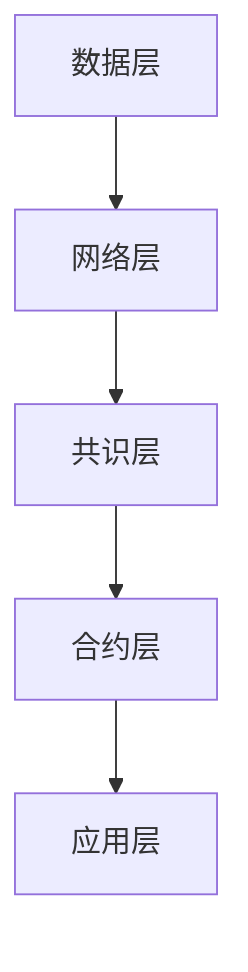

                 

### 文章标题：区块链系统设计：P9工程师的去中心化思考

#### 关键词：区块链，系统设计，去中心化，P9工程师，智能合约

#### 摘要：
本文深入探讨了区块链系统设计的核心概念、原则和方法。针对P9级工程师，本文将区块链系统设计分解为若干关键步骤，包括区块链技术基础、网络架构设计、系统需求分析、架构设计、智能合约设计、接口设计与API开发、项目实施与运维、性能分析与调优、安全性保障以及最佳实践与案例分析。通过一步步分析推理，本文旨在为读者提供清晰的区块链系统设计思路和实用技巧，帮助P9工程师在去中心化领域取得卓越成就。

---

## 第一部分：区块链技术基础

### 第1章：区块链技术概述

#### 1.1 区块链的概念与历史

区块链是一种分布式数据库技术，其特点是通过去中心化方式存储数据，数据记录按照时间顺序排列，每个记录之间通过密码学方式链接。区块链技术最早由中本聪（Satoshi Nakamoto）在2008年提出，旨在创造一种无需依赖中央机构进行交易验证的数字货币——比特币（Bitcoin）。

区块链的核心要素包括：数据块（Block）、链（Chain）、分布式节点（Node）和网络（Network）。区块链通过将这些数据块按时间顺序链接，形成一条不可篡改的链，分布式节点通过P2P网络进行数据同步和验证。

区块链在金融领域的影响是显著的。它为去中心化金融（DeFi）提供了基础设施，使得跨境支付、智能合约等应用得以实现，降低了交易成本，提高了交易透明度和安全性。

#### 1.2 区块链的工作原理

区块链的基本组成包括：区块链客户端、区块链节点、区块链网络和区块链数据库。每个区块链客户端可以是一个全节点或轻节点。全节点拥有完整的区块链数据，参与区块链网络的共识过程。轻节点则只保存部分区块链数据，通过全节点获取区块链数据。

区块链的交易流程如下：
1. 交易发起：用户发起一笔交易，并将其发送到区块链网络。
2. 网络广播：交易被多个节点接收并广播到整个网络。
3. 验证交易：节点验证交易的有效性，确保交易金额合法、签名有效等。
4. 添加到区块：验证后的交易被添加到一个新的区块中。
5. 广播新区块：新区块被生成后，通过网络广播到所有节点。
6. 共识达成：所有节点通过共识算法确认新区块的合法性，并将其加入区块链。

区块链的安全机制主要包括：加密技术、分布式存储和共识算法。加密技术确保数据传输和存储的安全性。分布式存储使得区块链数据在多个节点之间备份，提高了数据的安全性和可靠性。共识算法通过分布式节点之间的协商，确保区块链数据的一致性。

#### 1.3 区块链的核心技术

区块链的加密技术主要采用哈希函数、非对称加密和数字签名等技术。哈希函数将任意长度的数据映射为固定长度的字符串，用于生成数据块的唯一标识。非对称加密和数字签名则用于保证数据传输和存储的安全性。

分布式存储技术通过将区块链数据分散存储在多个节点上，提高了系统的可扩展性和容错性。每个节点都保存完整的区块链数据，任何节点的故障都不会影响整个系统的运行。

智能合约技术是区块链系统的重要组成部分。智能合约是一种自动执行的合约，它将合同条款写入代码，在满足特定条件时自动执行。智能合约通过编程语言（如Solidity）编写，运行在区块链网络中的虚拟机上。

#### 1.4 区块链的应用场景

区块链技术的应用场景广泛，包括但不限于以下领域：

- 跨境支付：通过区块链技术，可以实现跨境支付的无缝对接，减少交易成本和中间环节。
- 物流跟踪：区块链技术可以记录物流信息，确保信息的真实性和不可篡改性，提高供应链的透明度和效率。
- 供应链金融：区块链技术可以优化供应链金融流程，提高融资效率和降低风险。

#### 1.5 区块链的未来发展趋势

区块链技术正处于快速发展阶段，未来发展趋势包括：

- 区块链2.0：区块链2.0主要关注智能合约、去中心化应用（DApps）和分布式自治组织（DAO）等应用场景。
- 区块链3.0：区块链3.0将结合人工智能、物联网等新兴技术，实现更加智能和高效的区块链系统。
- 区块链与人工智能的结合：区块链技术可以为人工智能提供可信的数据来源和安全的计算环境，推动人工智能的发展。

### 第2章：区块链网络架构设计

#### 2.1 区块链网络架构概述

区块链网络架构分为三种类型：P2P网络、联盟链和公链。

- P2P网络：P2P网络是一种点对点网络，所有节点都可以直接与其他节点进行通信。P2P网络具有高可扩展性和容错性，但节点数量较多时，通信效率会降低。
- 联盟链：联盟链是由一组预选的节点组成的区块链网络。联盟链具有较高的安全性和可控性，适用于企业间的合作和交易。
- 公链：公链是公开的区块链网络，任何人都可以加入。公链具有去中心化的特点，但节点数量较多时，网络拥堵和交易速度可能会受到影响。

#### 2.2 区块链网络拓扑设计

区块链网络拓扑设计可以分为单层网络、多层网络和跨链网络。

- 单层网络：单层网络是最简单的网络结构，所有节点处于同一层级，数据传输效率较高，但容错性较差。
- 多层网络：多层网络通过分层结构，提高了网络的容错性和可扩展性。上层节点负责数据的传输和路由，下层节点负责数据的存储和验证。
- 跨链网络：跨链网络通过跨链技术，实现了不同区块链之间的数据传输和互操作。跨链网络可以扩展区块链的应用范围，提高系统的整体效率。

#### 2.3 节点选择与部署策略

节点选择和部署策略是区块链网络设计的关键因素。

- 节点角色的划分：根据区块链应用场景和需求，节点可以划分为全节点、轻节点和见证节点。全节点负责维护完整的区块链数据，轻节点只存储部分数据，见证节点负责验证交易和区块。
- 节点资源要求：节点资源要求包括CPU、内存、存储和网络带宽等。根据节点的角色和需求，合理配置节点资源，以确保网络的高效运行。
- 节点部署策略：节点部署策略包括集中部署、分布式部署和混合部署。集中部署可以提高节点间的通信效率，但风险较高；分布式部署可以提高系统的容错性，但通信效率较低；混合部署结合了两种部署策略的优点，适用于不同的应用场景。

#### 2.4 网络安全与隐私保护

网络安全和隐私保护是区块链网络设计的重要方面。

- 防火墙设置：防火墙可以限制节点之间的通信，防止恶意攻击和未经授权的访问。
- 数据加密：数据加密可以确保数据在传输过程中的安全性，防止数据被窃取或篡改。
- 访问控制策略：访问控制策略可以限制节点对区块链数据的访问权限，防止数据泄露和未经授权的操作。

## 第二部分：区块链系统设计

### 第3章：区块链系统需求分析

#### 3.1 系统需求概述

区块链系统的需求分析是系统设计的重要环节，包括功能需求、非功能需求和性能需求。

- 功能需求：功能需求描述系统应具备的基本功能和业务流程，如交易、转账、智能合约执行等。
- 非功能需求：非功能需求描述系统应满足的性能、安全性、可扩展性、可用性等要求。
- 性能需求：性能需求描述系统应达到的响应时间、吞吐量、延迟等性能指标。

#### 3.2 用户故事与用例图

用户故事和用例图是需求分析的重要工具。

- 用户故事编写：用户故事是一种描述用户需求和行为的简短故事，有助于理解和定义系统的功能需求。
- 用例图绘制：用例图是一种图形化表示用户和系统之间交互的模型，有助于明确系统的功能和用户角色。

#### 3.3 需求分析工具与方法

需求分析工具和方法包括UML图、SWOT分析和价值流图。

- UML图：UML图是一种用于描述系统需求和设计的图形化工具，包括类图、用例图、序列图等。
- SWOT分析：SWOT分析是一种用于评估系统需求和市场环境的分析方法，包括优势、劣势、机会和威胁。
- 价值流图：价值流图是一种用于描述系统业务流程和价值流动的图形化工具，有助于优化系统设计和流程。

### 第4章：区块链系统架构设计

#### 4.1 系统架构设计原则

区块链系统架构设计应遵循以下原则：

- 分层设计：将系统功能划分为多个层次，如数据层、网络层、共识层、合约层和应用层。
- 模块化：将系统功能划分为独立的模块，便于系统开发和维护。
- 高内聚低耦合：模块之间保持高内聚低耦合，以提高系统的可维护性和可扩展性。

#### 4.2 区块链系统架构

区块链系统架构包括以下层次：

- 数据层：数据层负责存储和管理区块链数据，包括交易数据、区块数据和链数据。
- 网络层：网络层负责区块链节点的通信和数据传输，包括P2P网络、数据广播和节点同步等。
- 共识层：共识层负责区块链节点之间的共识过程，包括共识算法、区块生成和验证等。
- 合约层：合约层负责智能合约的编写、部署和执行，包括合约编写语言、虚拟机和合约执行环境等。
- 应用层：应用层负责区块链系统与用户和其他系统的交互，包括Web接口、移动应用和API接口等。

#### 4.3 系统架构图绘制

系统架构图是一种图形化表示系统结构和组件关系的工具，可以使用Mermaid等图形化工具绘制。

### 第5章：区块链智能合约设计

#### 5.1 智能合约概述

智能合约是一种自动执行的合约，它将合同条款写入代码，在满足特定条件时自动执行。智能合约具有以下特点：

- 自动执行：智能合约在满足特定条件时自动执行，无需人工干预。
- 安全性：智能合约运行在区块链网络中的虚拟机上，数据存储和执行过程安全可靠。
- 可追溯性：智能合约的执行过程和结果被记录在区块链上，具有不可篡改的特性。

#### 5.2 Solidity编程语言

Solidity是一种用于编写智能合约的编程语言，具有以下特点：

- 类C语言：Solidity类似于C++和Java等编程语言，易于学习和使用。
- 支持面向对象编程：Solidity支持面向对象编程，包括类、继承、多态等特性。
- 事件日志：Solidity支持事件日志，用于记录智能合约的执行过程和结果。

#### 5.3 智能合约安全

智能合约安全是区块链系统设计的重要方面，主要包括以下方面：

- 漏洞分析：对智能合约代码进行漏洞分析，包括常见的安全漏洞（如重入攻击、整数溢出等）。
- 防范措施：针对潜在的安全漏洞，采取相应的防范措施，如使用安全库、代码审查等。
- 安全审计：对智能合约进行安全审计，确保代码的可靠性和安全性。

### 第6章：区块链系统接口设计与API开发

#### 6.1 接口设计原则

区块链系统接口设计应遵循以下原则：

- RESTful API设计：采用RESTful设计风格，实现系统的功能接口，提高系统的可扩展性和易用性。
- GraphQL设计：采用GraphQL设计风格，实现灵活的数据查询和操作接口，提高系统的性能和用户体验。

#### 6.2 API开发与测试

区块链系统API开发与测试包括以下方面：

- API文档生成：使用Markdown或Swagger等工具生成API文档，方便开发者理解和使用API。
- API测试工具：使用Postman、JMeter等工具对API进行功能测试、性能测试和安全测试。

#### 6.3 接口安全与优化

区块链系统接口安全与优化包括以下方面：

- 接口权限控制：通过身份验证和权限控制，确保只有授权用户才能访问特定接口。
- 性能优化：通过缓存、负载均衡等手段，提高接口的响应速度和吞吐量。

### 第7章：区块链项目实施与运维

#### 7.1 项目实施流程

区块链项目实施流程包括以下步骤：

- 需求分析：明确项目需求和目标，制定项目计划。
- 设计评审：对系统设计进行评审，确保设计合理性和可行性。
- 编码与单元测试：根据设计文档编写代码，并进行单元测试。
- 集成测试与系统测试：对系统进行集成测试和系统测试，确保系统的功能完整性和性能。
- 部署与上线：将系统部署到生产环境，并进行上线操作。

#### 7.2 系统部署与运维

区块链系统部署与运维包括以下方面：

- 环境配置：配置区块链系统的运行环境，包括操作系统、数据库、网络等。
- 节点部署：部署区块链节点，包括全节点、轻节点和见证节点等。
- 日志监控：监控系统日志，及时发现和处理系统故障。

#### 7.3 故障处理与性能优化

区块链系统故障处理与性能优化包括以下方面：

- 故障排除策略：根据故障现象和日志分析，采取相应的故障排除策略。
- 性能监控：监控系统性能指标，及时发现和处理性能瓶颈。
- 性能优化措施：通过调整系统配置、优化代码和数据库等手段，提高系统性能。

### 第8章：区块链系统性能分析与调优

#### 8.1 性能指标

区块链系统性能指标包括以下方面：

- 响应时间：系统处理请求的平均时间。
- 吞吐量：系统单位时间内处理请求的个数。
- 延迟：系统处理请求的延迟时间。

#### 8.2 性能测试方法

区块链系统性能测试方法包括以下方面：

- 压力测试：模拟高负载情况，测试系统的稳定性和性能。
- 健康状态监控：实时监控系统的健康状态，包括CPU、内存、磁盘空间等。

#### 8.3 性能优化策略

区块链系统性能优化策略包括以下方面：

- 数据库优化：优化数据库性能，包括索引、分区、缓存等。
- 网络优化：优化网络性能，包括带宽、延迟、丢包率等。
- 系统架构优化：优化系统架构，包括分布式存储、负载均衡等。

### 第9章：区块链系统的安全性保障

#### 9.1 安全性分析

区块链系统安全性分析包括以下方面：

- 恶意攻击类型：分析常见的恶意攻击类型，包括DDoS攻击、智能合约攻击等。
- 安全漏洞扫描：对系统进行安全漏洞扫描，识别潜在的安全风险。

#### 9.2 安全防护措施

区块链系统安全防护措施包括以下方面：

- 防火墙：设置防火墙，限制未经授权的访问。
- 加密技术：使用加密技术，保护数据传输和存储的安全性。
- 访问控制：设置访问控制策略，限制用户对系统的访问权限。

#### 9.3 应急响应与处置

区块链系统应急响应与处置包括以下方面：

- 应急预案：制定应急预案，确保在系统发生故障时能够迅速响应。
- 应急响应流程：明确应急响应流程，包括故障上报、故障定位、故障修复等。

### 第10章：区块链系统的最佳实践与案例分析

#### 10.1 区块链系统最佳实践

区块链系统最佳实践包括以下方面：

- 设计原则：遵循系统设计原则，确保系统的高内聚低耦合。
- 实施技巧：根据具体应用场景，选择合适的区块链技术和架构。
- 运维经验：积累运维经验，提高系统的稳定性和可靠性。

#### 10.2 区块链系统案例分析

区块链系统案例分析包括以下方面：

- 成功案例分析：分析成功的区块链项目，总结经验和教训。
- 失败案例分析：分析失败的区块链项目，识别风险和问题。

#### 10.3 未来趋势与展望

区块链系统未来趋势与展望包括以下方面：

- 区块链技术的演进：分析区块链技术的演进方向和趋势。
- 区块链与其他技术的融合：探讨区块链与其他技术的融合和应用。
- 区块链在社会治理中的应用：分析区块链在社会治理中的应用场景和前景。

---

**作者：AI天才研究院/AI Genius Institute & 禅与计算机程序设计艺术 /Zen And The Art of Computer Programming**

