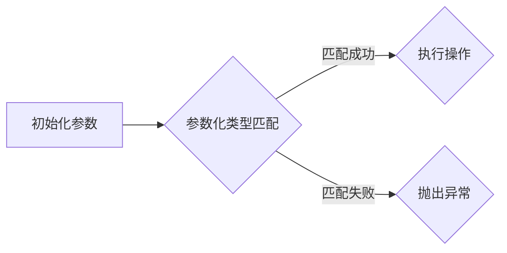
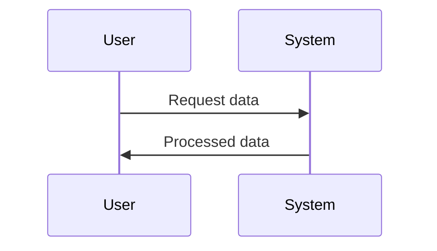

                 

### 《参数化类型：增强代码灵活性的技术》

#### 关键词：
- 参数化类型
- 编程灵活性
- 代码可维护性
- 算法实现
- 系统架构设计

#### 摘要：
本文旨在深入探讨参数化类型这一先进编程概念，及其如何提升代码的灵活性和可维护性。我们将从基础理论出发，通过实际应用实例，详细解析参数化类型的定义、属性、与传统类型的对比，以及在算法实现中的应用。随后，本文将展示如何在系统架构设计中充分利用参数化类型，并分享一个完整的项目实战案例，旨在为读者提供全面的技术指导和最佳实践。

### 第一部分：参数化类型基础理论

#### 第1章：背景介绍

##### 1.1.1 问题背景
在现代软件开发中，代码的灵活性和可维护性显得尤为关键。随着项目复杂度和代码规模的不断增加，传统的静态类型系统逐渐暴露出其局限性。例如，当需要处理多种数据类型时，代码往往变得冗长且难以维护。

##### 1.1.2 问题描述
参数化类型旨在解决这一问题，通过泛化数据类型，使得代码能够更加灵活地适应不同的数据类型，从而提高代码的可复用性和可维护性。

##### 1.1.3 问题解决
参数化类型允许我们在编程语言中定义泛型，这些泛型可以根据不同的数据类型进行实例化，从而避免重复代码的编写。

##### 1.1.4 边界与外延
参数化类型的边界在于其能够支持的数据类型范围，而外延则体现在其如何在不同的编程场景中发挥作用。

##### 1.1.5 概念结构与核心要素组成
参数化类型的基本概念包括泛型、类型参数、类型约束等，这些要素共同构成了参数化类型的核心结构。

#### 第2章：核心概念与联系

##### 2.1 参数化类型定义
参数化类型是在编程语言中定义的一种类型，它允许我们在编写代码时使用类型参数，这些参数在代码运行时被具体的数据类型所实例化。

##### 2.2 参数化类型的属性特征
参数化类型具有以下属性特征：
- **泛化能力**：能够处理多种数据类型。
- **可复用性**：相同的代码可以适用于不同的数据类型。
- **灵活性**：能够根据实际需求动态调整数据类型。

##### 2.3 参数化类型与传统类型的对比
| 对比维度 | 参数化类型 | 传统类型 |
| --- | --- | --- |
| **灵活性** | 高 | 低 |
| **可维护性** | 高 | 低 |
| **复用性** | 高 | 低 |

##### 2.4 参数化类型在编程语言中的应用
参数化类型广泛应用于各种编程语言中，如Java中的泛型、C++中的模板等，这些语言都提供了强大的泛型支持。

#### 第2.5章：ER实体关系图架构

##### 2.5.1 ER图基础
ER图（Entity-Relationship Diagram）是用于描述实体之间关系的图形化表示，它由实体、属性和关系三部分组成。

##### 2.5.2 ER图绘制
我们可以使用Mermaid绘制ER图，如下所示：

```mermaid
classDiagram
Class1 <|-- Class2
Class1 : +int attribute1
Class2 : +String attribute2
Class1 +-- Class3
Class3 : +Float attribute3
```

##### 2.5.3 参数化类型在ER图中的应用
参数化类型可以在ER图中表示为通用的实体或关系，这使得我们在设计数据库时能够更加灵活地处理不同的数据类型。

### 第二部分：参数化类型应用实践

#### 第3章：算法原理讲解

##### 3.1 算法流程图
使用Mermaid绘制算法流程图：



##### 3.2 Python源代码示例

```python
def parametric_type_operation(param):
    if isinstance(param, int):
        return param * 2
    elif isinstance(param, str):
        return param.upper()
    else:
        raise TypeError("Unsupported type")
```

##### 3.3 算法原理详细讲解

###### 3.3.1 参数化类型匹配原理
在算法中，我们首先对传入的参数进行类型匹配，以确定应执行哪种操作。

###### 3.3.2 操作执行过程
如果参数匹配成功，则执行相应的操作，如整数乘以2或字符串转换为大写。

###### 3.3.3 异常处理机制
如果参数类型不被支持，则抛出异常，确保程序能够优雅地处理错误。

##### 3.4 数学模型和公式
$$
f(x) = \begin{cases}
2x & \text{if } x \text{ is an integer} \\
x & \text{if } x \text{ is a string}
\end{cases}
$$

##### 3.5 举例说明
假设参数`param`为整数`5`和字符串`"hello"`，分别调用`parametric_type_operation`函数，输出结果分别为`10`和`HELLO`。

### 第三部分：系统分析与架构设计

#### 第4章：系统功能设计

##### 4.1 问题场景介绍
假设我们需要设计一个系统，该系统能够根据输入的数据类型执行不同的操作。

##### 4.2 系统功能需求
系统需要具备以下功能：
- 根据输入数据类型执行相应的操作。
- 处理多种数据类型，如整数、字符串、浮点数等。
- 提供清晰的接口和异常处理机制。

##### 4.3 领域模型
使用Mermaid绘制领域模型：

```mermaid
classDiagram
Class1 <|-- Class2
Class1 : +int attribute1
Class2 : +String attribute2
Class1 +-- Class3
Class3 : +Float attribute3
```

#### 第5章：系统架构设计

##### 5.1 项目介绍
本章节将介绍一个参数化类型的系统架构设计，包括核心模块和接口设计。

##### 5.2 系统架构设计
使用Mermaid绘制系统架构图：



##### 5.3 系统接口设计
系统接口设计应确保清晰、简洁，同时提供必要的异常处理机制。

##### 5.4 系统交互
系统交互设计应考虑数据的流动和状态的变化，确保系统的高效运行。

### 第四部分：项目实战

#### 第6章：环境安装与配置

##### 6.1 环境要求
- Python 3.8 或以上版本
- 相关依赖库（如numpy、pandas等）

##### 6.2 安装步骤
1. 安装Python环境。
2. 使用pip安装相关依赖库。

##### 6.3 配置说明
- 配置环境变量。
- 配置代码编辑器。

#### 第7章：系统核心实现

##### 7.1 核心实现源代码
```python
# parametric_type_operation.py
def parametric_type_operation(param):
    if isinstance(param, int):
        return param * 2
    elif isinstance(param, str):
        return param.upper()
    else:
        raise TypeError("Unsupported type")
```

##### 7.2 代码应用解读与分析
- 函数`parametric_type_operation`根据传入的参数类型执行不同的操作。
- 确保代码具有良好的可读性和可维护性。

#### 第8章：实际案例分析与讲解

##### 8.1 案例背景
设计一个系统，根据用户输入的不同类型数据执行相应的操作。

##### 8.2 案例分析
- 输入整数：返回其两倍。
- 输入字符串：返回其大写形式。

##### 8.3 深入剖析
- 如何实现参数化类型匹配。
- 如何处理不同类型数据的操作。

#### 第9章：项目小结

##### 9.1 项目总结
本文通过深入探讨参数化类型的定义、应用和实践，展示了其在提高代码灵活性和可维护性方面的优势。

##### 9.2 注意事项
- 确保正确处理参数类型。
- 考虑代码的可维护性和可扩展性。

##### 9.3 拓展阅读
- 深入了解编程语言中的泛型机制。
- 学习更多关于系统架构设计的最佳实践。

### 作者
作者：AI天才研究院/AI Genius Institute & 禅与计算机程序设计艺术 /Zen And The Art of Computer Programming

### 最佳实践 tips
- 在使用参数化类型时，确保对类型进行严格的约束。
- 考虑代码的可读性和可维护性，避免过度泛化。

### 小结
参数化类型是提高代码灵活性和可维护性的有效手段。通过本文的介绍，读者应该能够掌握参数化类型的基本概念和应用方法，并在实际项目中充分利用这一技术。继续学习和实践，您将发现参数化类型的巨大潜力。

### 注意事项
- 在使用参数化类型时，确保对类型进行严格的约束，以避免运行时错误。
- 考虑代码的可读性和可维护性，避免过度泛化。

### 拓展阅读
- 学习更多关于编程语言中的泛型机制。
- 探索系统架构设计的最佳实践。

