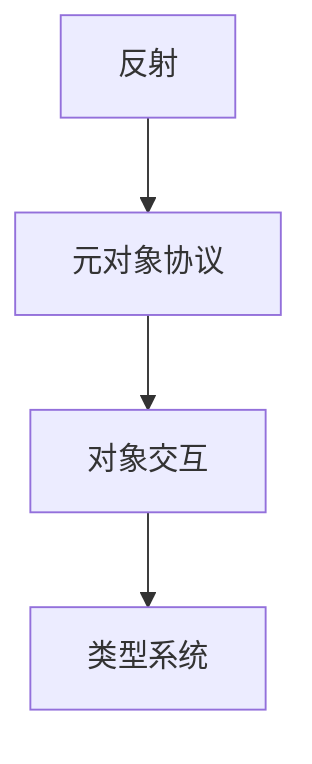

                 

### 《反射与元对象协议的类型理论》

#### 关键词：反射、元对象协议、类型理论、编程语言、应用场景

> 摘要：本文将深入探讨反射与元对象协议的类型理论，通过详细介绍两者的基本概念、类型系统、编程语言实现和应用场景，帮助读者理解其在现代编程语言中的重要作用和具体应用，为软件开发提供新的视角和思路。

#### 引言

在计算机科学中，反射和元对象协议是两个核心概念，它们在编程语言的抽象和实现中扮演着至关重要的角色。反射允许程序在运行时检查和修改自身的结构，而元对象协议则定义了对象之间的交互方式。这些特性在动态语言、框架开发、测试和调试中具有广泛的应用。

本文将按照以下结构展开：

1. **反射与元对象协议概述**：介绍反射和元对象协议的基本概念和重要性。
2. **基础概念**：详细描述反射和元对象协议的核心概念及其相互关系。
3. **类型理论**：讨论类型系统、类型推断和类型检查的理论基础。
4. **编程语言实现**：分析不同编程语言如何支持反射和元对象协议。
5. **应用与案例分析**：探讨反射和元对象协议在实际项目中的应用。
6. **最佳实践与未来趋势**：总结最佳实践和对未来发展的展望。

#### 第一部分：反射与元对象协议概述

##### 1.1 问题背景

在传统的面向对象编程中，代码的结构是静态定义的，编译时即可确定。然而，随着程序复杂性的增加，尤其是在框架开发、测试和调试过程中，动态性变得越来越重要。反射和元对象协议提供了一种在运行时动态操作代码和对象的能力。

##### 1.2 问题描述

反射是程序能够检查或修改自身的结构，例如，检查类的成员变量和方法。元对象协议则是定义对象之间如何交互的规则，例如，对象的创建、销毁、方法调用等。

##### 1.3 问题解决

通过引入反射和元对象协议，程序员可以编写更加灵活和可扩展的代码。反射允许在运行时动态加载类和对象，而元对象协议则保证了对象之间的一致性和互操作性。

##### 1.4 边界与外延

尽管反射和元对象协议非常强大，但它们也有其局限性。反射可能导致性能下降和安全性问题，因此应在适当的情况下使用。元对象协议则更多地依赖于具体的编程语言和框架。

##### 1.5 概念结构与核心要素组成

反射和元对象协议的核心要素包括：

- **反射**：运行时检查和修改程序结构的能力。
- **元对象协议**：对象之间的交互规则和协议。

两者的关系如下所示：

#### 第二部分：基础概念

##### 2.1 反射的概念

反射是一种程序能够检查或修改自身结构的能力。在Java中，反射可以通过`Class`和`Object`类来实现。反射的核心机制包括：

- **类加载**：在运行时加载类。
- **方法调用**：在运行时调用方法。
- **字段访问**：在运行时访问和修改字段。

反射的典型应用包括：

- **动态加载类**：在运行时动态加载所需的类。
- **方法拦截**：在运行时拦截方法调用，进行额外的处理。
- **属性修改**：在运行时修改对象的属性。

##### 2.2 元对象协议的概念

元对象协议是一种定义对象之间交互规则的机制。在Python中，元对象协议通过`__getattr__`、`__setattr__`和`__call__`等特殊方法实现。元对象协议的核心机制包括：

- **属性访问**：定义对象属性的访问和修改规则。
- **方法调用**：定义对象方法的调用规则。
- **对象创建**：定义对象的创建和销毁规则。

元对象协议的典型应用包括：

- **动态属性**：在运行时动态定义和修改对象的属性。
- **动态方法**：在运行时动态定义和调用对象的方法。
- **对象代理**：通过代理对象实现对象的封装和增强。

##### 2.3 反射与元对象协议的关联

反射和元对象协议紧密相关，但有所区别。反射主要关注程序结构，而元对象协议主要关注对象交互。两者之间的联系如下：

- **反射**：通过反射可以动态地访问和修改对象结构。
- **元对象协议**：通过元对象协议可以定义对象的交互规则。

#### 第三部分：类型理论

##### 3.1 类型系统的基本原理

类型系统是编程语言的核心组成部分，它定义了数据类型的分类和操作。类型系统的基本原理包括：

- **静态类型**：在编译时确定变量的类型。
- **动态类型**：在运行时确定变量的类型。
- **类型检查**：在编译或运行时检查代码是否符合类型规定。

类型系统的分类包括：

- **强类型**：变量具有固定类型，类型检查严格。
- **弱类型**：变量类型可以动态改变，类型检查宽松。

类型系统的组成要素包括：

- **数据类型**：定义了程序中的数据分类。
- **类型约束**：定义了变量和表达式之间的类型兼容性。
- **类型推导**：自动推导变量和表达式的类型。

##### 3.2 类型推断机制

类型推断是一种在编译或运行时自动推导变量和表达式类型的方法。类型推断的机制包括：

- **显式类型声明**：程序员显式声明变量的类型。
- **隐式类型推导**：编译器或解释器自动推导变量的类型。

类型推断的应用包括：

- **简化代码**：通过类型推断可以减少代码中类型声明的数量。
- **提高性能**：类型推断可以优化代码的执行效率。

##### 3.3 类型检查方法

类型检查是在编译或运行时检查代码是否符合类型规定的过程。类型检查的方法包括：

- **静态类型检查**：在编译时检查代码是否符合类型规定。
- **动态类型检查**：在运行时检查代码是否符合类型规定。

类型检查的应用包括：

- **早期错误检测**：在编译时发现类型错误，提高程序的正确性。
- **优化代码执行**：通过类型检查优化代码的执行效率。

#### 第四部分：编程语言实现

##### 4.1 编程语言中的反射

不同编程语言对反射的支持程度不同。以下是一些常见编程语言中反射的实现：

- **Java**：Java提供了丰富的反射API，允许在运行时检查和修改类的结构。
- **Python**：Python通过特殊方法实现了反射机制，例如`__getattr__`和`__setattr__`。
- **C#**：C#提供了反射API，允许在运行时访问和修改类的成员。

##### 4.2 编程语言中的元对象协议

不同编程语言对元对象协议的支持也有所不同。以下是一些常见编程语言中元对象协议的实现：

- **Python**：Python通过特殊方法实现了元对象协议，例如`__getattr__`、`__setattr__`和`__call__`。
- **JavaScript**：JavaScript通过原型链实现了元对象协议。
- **Java**：Java通过反射API实现了部分元对象协议功能。

##### 4.3 示例编程语言分析

以下是对Java、Python和JavaScript这三种编程语言中反射和元对象协议的示例分析：

- **Java**：Java中的反射API允许在运行时访问类的成员，例如字段和方法。通过反射，可以动态地创建对象、调用方法和修改字段。Java中的元对象协议主要通过反射API实现。
- **Python**：Python中的反射机制通过特殊方法实现，例如`__getattr__`、`__setattr__`和`__call__`。这些方法允许在运行时动态地访问和修改对象的属性和方法。Python中的元对象协议也通过这些特殊方法实现。
- **JavaScript**：JavaScript中的反射和元对象协议主要通过对象原型链实现。通过原型链，可以动态地添加和删除对象的属性和方法。

#### 第五部分：应用与案例分析

##### 5.1 应用场景分析

反射和元对象协议在以下应用场景中具有广泛的应用：

- **框架开发**：在框架开发中，反射和元对象协议可以用于动态加载类、拦截方法和扩展功能。
- **测试和调试**：在测试和调试中，反射和元对象协议可以用于动态修改代码和对象的状态。
- **动态语言**：在动态语言中，反射和元对象协议是核心特性，用于实现动态类型和动态交互。

##### 5.2 案例研究

以下是对Spring框架中反射和元对象协议应用的案例研究：

- **Spring框架中的反射**：Spring框架通过反射API实现了对Bean的动态加载和管理。通过反射，Spring可以自动创建对象、设置属性和调用方法。
- **Spring框架中的元对象协议**：Spring框架通过元对象协议实现了对对象的动态扩展和增强。通过特殊方法，Spring可以在运行时动态地修改对象的属性和方法。

##### 5.3 性能考虑

反射和元对象协议在性能方面存在一些挑战。由于反射和元对象协议在运行时动态操作代码和对象，可能会导致性能下降。以下是一些性能优化的策略：

- **缓存**：通过缓存反射和元对象协议的结果，可以减少重复操作的次数，提高性能。
- **延迟加载**：在需要时再加载反射和元对象协议相关的代码，可以减少启动时间。
- **编译优化**：通过编译优化，可以减少反射和元对象协议相关的代码的执行时间。

#### 第六部分：最佳实践与未来趋势

##### 6.1 最佳实践建议

以下是一些关于反射和元对象协议的最佳实践建议：

- **谨慎使用反射**：反射具有强大的功能，但也可能导致性能下降和安全性问题。在不需要时尽量避免使用反射。
- **合理使用元对象协议**：元对象协议可以提供灵活的对象交互能力，但在使用时应确保一致性。
- **优化性能**：通过缓存、延迟加载和编译优化等方法，可以提高反射和元对象协议的性能。

##### 6.2 未来发展趋势

未来，反射和元对象协议可能会在以下几个方面发展：

- **更高效的支持**：随着硬件和编译技术的进步，反射和元对象协议的性能可能会得到显著提高。
- **更广泛的应用**：反射和元对象协议将在更广泛的编程领域得到应用，例如云计算、人工智能和区块链。
- **更安全的支持**：为了提高安全性，编程语言和框架可能会引入更严格的安全机制，以限制反射和元对象协议的滥用。

##### 6.3 小结与展望

反射和元对象协议是现代编程语言中的重要特性，它们提供了强大的动态操作能力。通过合理使用反射和元对象协议，程序员可以编写更加灵活和可扩展的代码。未来，随着技术的发展，反射和元对象协议将在更广泛的领域中发挥重要作用。

### 总结

本文深入探讨了反射与元对象协议的类型理论，从基础概念到编程语言实现，再到应用场景和最佳实践，为读者提供了一个全面的视角。通过本文的阅读，读者可以更好地理解反射与元对象协议在编程语言中的重要作用，为实际项目开发提供有力的支持。希望本文能为读者带来启发和帮助。作者：AI天才研究院/AI Genius Institute & 禅与计算机程序设计艺术/Zen And The Art of Computer Programming。

