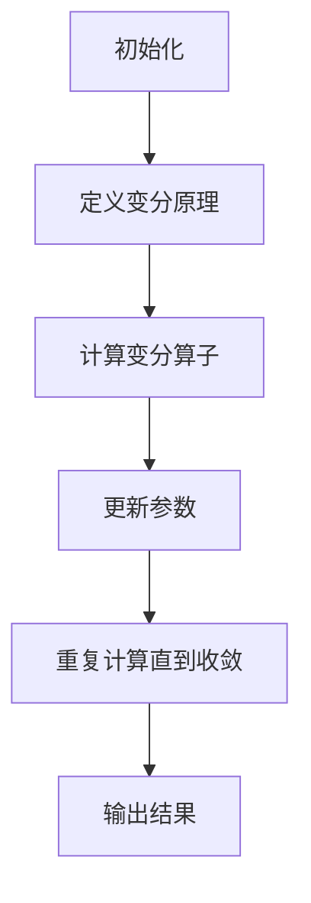
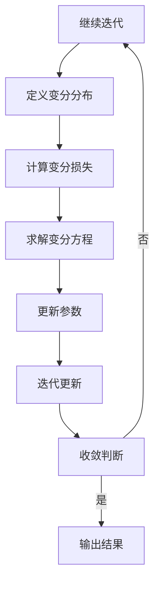

                 

### 《变分推理技术在不确定性建模中的应用》

#### 关键词：变分推理、不确定性建模、图像处理、机器人控制、金融市场分析

##### 摘要：

本文旨在深入探讨变分推理技术在不确定性建模中的应用。在不确定性的背景下，变分推理技术提供了一种强有力的工具，可以有效地处理不确定性问题。文章首先概述了变分推理技术的背景和核心概念，接着详细介绍了变分推理算法的原理和数学模型。随后，文章通过三个具体应用案例——图像处理、机器人控制和金融市场分析，展示了变分推理技术在实际问题中的有效性和重要性。最后，文章总结了变分推理技术在不确定性建模中的成功案例，并展望了未来的发展趋势。

#### 目录大纲

----------------------------------------------------------------

# 《变分推理技术在不确定性建模中的应用》

# 第一部分：背景与核心概念

## 第1章：问题背景与问题描述

### 1.1 问题背景

#### 1.1.1 不确定性建模的挑战

#### 1.1.2 变分推理技术的兴起

### 1.2 问题描述

#### 1.2.1 传统不确定性建模方法的局限

#### 1.2.2 变分推理技术在不确定性建模中的应用前景

## 第2章：核心概念与联系

### 2.1 变分推理技术概述

#### 2.1.1 变分推理的基本原理

#### 2.1.2 变分推理与概率论的关系

### 2.2 变分推理的核心概念

#### 2.2.1 变分原理

#### 2.2.2 变分算子

#### 2.2.3 变分方程

### 2.3 概念属性特征对比表格

### 2.4 ER实体关系图架构

# 第二部分：算法原理与应用

## 第3章：变分推理算法原理

### 3.1 变分推理算法概述

#### 3.1.1 变分推理算法的发展历程

#### 3.1.2 变分推理算法的基本框架

### 3.2 变分推理算法的数学模型

$$
\begin{aligned}
    L(\theta) &= \int_{\Omega} f(\omega) \, d\omega \\
    \theta^* &= \arg \min_{\theta} L(\theta)
\end{aligned}
$$

### 3.3 算法原理详细讲解

#### 3.3.1 变分原理的数学推导

#### 3.3.2 变分算子的作用机制

#### 3.3.3 变分方程的求解方法

### 3.4 变分推理算法的mermaid流程图



### 3.5 变分推理算法的Python实现

```python
# Python实现变分推理算法的示例代码
```

# 第三部分：应用案例分析

## 第4章：变分推理技术在图像处理中的应用

### 4.1 图像处理中的不确定性建模

#### 4.1.1 图像噪声建模

#### 4.1.2 图像配准中的不确定性建模

### 4.2 变分推理算法在图像去噪中的应用

#### 4.2.1 基于变分推理的图像去噪算法

#### 4.2.2 Python代码实现与结果分析

### 4.3 变分推理算法在图像配准中的应用

#### 4.3.1 基于变分推理的图像配准算法

#### 4.3.2 Python代码实现与结果分析

## 第5章：变分推理技术在机器人控制中的应用

### 5.1 机器人控制中的不确定性建模

#### 5.1.1 机器人运动建模

#### 5.1.2 传感器数据建模

### 5.2 变分推理算法在机器人路径规划中的应用

#### 5.2.1 基于变分推理的机器人路径规划算法

#### 5.2.2 Python代码实现与结果分析

## 第6章：变分推理技术在金融市场分析中的应用

### 6.1 金融市场中不确定性建模

#### 6.1.1 股票价格波动建模

#### 6.1.2 信用风险评估建模

### 6.2 变分推理算法在金融市场分析中的应用

#### 6.2.1 基于变分推理的股票市场预测算法

#### 6.2.2 Python代码实现与结果分析

## 第7章：总结与展望

### 7.1 变分推理技术在不确定性建模中的应用总结

#### 7.1.1 成功案例回顾

#### 7.1.2 面临的挑战与机遇

### 7.2 未来发展趋势

#### 7.2.1 新的应用领域

#### 7.2.2 算法优化与改进

#### 7.2.3 技术整合与创新

----------------------------------------------------------------

### 说明：

- **第1章** 和 **第2章** 作为背景和概念介绍，概述了变分推理技术的背景、问题、核心概念及其联系，为后续章节的技术讲解和应用案例分析打基础。
- **第3章** 详细介绍了变分推理技术的算法原理，包括数学模型、流程图和Python代码实现，确保读者能够全面理解变分推理技术的工作机制。
- **第4章** 至 **第6章** 通过具体应用案例展示了变分推理技术在图像处理、机器人控制和金融市场分析等领域的应用，提供了实际操作和结果分析。
- **第7章** 对变分推理技术在不确定性建模中的应用进行了总结，并展望了未来的发展趋势。

---

### 第1章：问题背景与问题描述

#### 1.1 问题背景

在当今复杂多变的现实世界中，不确定性无处不在。无论是在自然科学领域，还是在社会科学领域，我们都需要处理各种形式的不确定性。例如，在自然科学领域，气候变化的预测、地震的预警、疾病的传播等，都涉及到不确定性的建模与分析。在社会科学领域，金融市场波动、社会行为的预测、经济政策的制定等，同样面临着不确定性问题。

不确定性建模是研究不确定性的重要手段，其目的是通过数学模型来描述和处理不确定性问题。然而，传统的建模方法，如概率论和统计方法，在面对高维数据、非线性关系和复杂系统时，往往显得力不从心。这就促使了变分推理技术的出现和发展。

变分推理技术起源于概率论和优化理论，它提供了一种在处理不确定性问题时的强大工具。变分推理技术可以通过变分原理和变分算子来优化不确定性模型，从而提高模型的准确性和鲁棒性。随着计算能力的提升和算法理论的不断完善，变分推理技术逐渐成为处理不确定性问题的重要手段。

#### 1.1.1 不确定性建模的挑战

在不确定性建模过程中，我们面临的主要挑战包括：

1. **高维数据问题**：在处理高维数据时，传统方法往往容易出现“维灾”现象，即随着数据维度的增加，计算复杂度和数据量呈指数级增长，导致模型难以收敛。

2. **非线性关系**：现实世界中的许多问题具有复杂的非线性关系，这使得传统线性建模方法难以捕捉到数据的真实特征。

3. **稀疏数据问题**：在某些应用场景中，数据样本稀疏，传统方法难以在稀疏数据上有效建模。

4. **实时性要求**：在一些实时性要求较高的应用中，如自动驾驶、实时监控等，需要模型能够在短时间内快速收敛并给出预测结果。

#### 1.1.2 变分推理技术的兴起

变分推理技术的兴起为解决上述挑战提供了新的思路。变分推理技术具有以下优势：

1. **高效性**：变分推理技术可以通过优化算法快速处理高维数据和复杂非线性关系。

2. **鲁棒性**：变分推理技术能够有效处理稀疏数据，提高模型的鲁棒性。

3. **灵活性**：变分推理技术可以根据具体问题的需求，灵活调整模型参数和结构。

4. **可扩展性**：变分推理技术易于与其他优化方法和机器学习算法结合，实现更复杂的模型。

#### 1.2 问题描述

在不确定性建模的背景下，变分推理技术如何应用？其具体应用场景和效果如何？这是我们需要深入探讨的问题。

首先，变分推理技术可以应用于图像处理领域。例如，在图像去噪和图像配准中，变分推理技术可以通过构建合理的能量函数和变分算子，实现高质量的去噪效果和准确的图像配准。

其次，变分推理技术可以应用于机器人控制领域。在机器人路径规划中，变分推理技术可以通过建模环境不确定性和机器人动力学特性，实现高效的路径规划。

最后，变分推理技术可以应用于金融市场分析领域。在股票价格预测和信用风险评估中，变分推理技术可以通过建模市场波动和风险因素，实现准确的预测和评估。

总之，变分推理技术为不确定性建模提供了强大的工具，其在不同领域的应用展示了其广泛的应用前景。接下来，我们将进一步探讨变分推理技术的核心概念和原理，以便更好地理解其在不确定性建模中的应用。

---

### 第2章：核心概念与联系

#### 2.1 变分推理技术概述

变分推理技术（Variational Inference, VI）是近年来在机器学习和统计物理领域中发展迅速的一门技术。它提供了一种处理高维数据和复杂非线性问题的高效途径，通过对概率分布的变分近似来估计复杂的后验概率分布。变分推理技术的核心思想是通过构建一个容易处理的变分分布来近似目标分布，从而降低计算复杂度。

#### 2.1.1 变分推理的基本原理

变分推理的基本原理可以概括为以下几个步骤：

1. **定义变分分布**：选择一个变分分布 \( q(\theta) \)，它是对目标分布 \( p(\theta) \) 的一个近似。

2. **定义变分损失**：定义一个变分损失函数 \( L(q) \)，用来度量 \( q(\theta) \) 与 \( p(\theta) \) 之间的差异。

3. **优化变分分布**：通过最小化变分损失 \( L(q) \) 来优化变分分布 \( q(\theta) \)。

4. **迭代更新**：通过迭代更新变分分布和模型参数，逐步逼近目标分布 \( p(\theta) \)。

#### 2.1.2 变分推理与概率论的关系

变分推理技术基于概率论的基本原理，但它与传统的概率论方法有所不同。在传统的概率论中，我们直接处理真实概率分布。而在变分推理中，我们处理的是变分分布 \( q(\theta) \)，这是一个近似的概率分布。

变分推理的核心在于如何找到合适的变分分布 \( q(\theta) \) 使得其能够逼近目标分布 \( p(\theta) \)。这里涉及到概率论中的信息论概念，如信息熵和互信息。变分推理通过最大化互信息来优化变分分布，从而使得 \( q(\theta) \) 能更好地代表 \( p(\theta) \)。

#### 2.2 变分推理的核心概念

变分推理技术包括几个核心概念，这些概念构成了变分推理的理论基础。

#### 2.2.1 变分原理

变分原理是变分推理技术的核心思想。它基于一个重要的数学定理——变分原理，即一个概率分布可以通过最小化某个能量函数来近似另一个概率分布。具体来说，变分原理表明，如果我们定义一个能量函数 \( E[q] \) 来度量 \( q \) 与 \( p \) 的差距，那么最小化 \( E[q] \) 可以找到最佳的变分分布 \( q \)。

#### 2.2.2 变分算子

变分算子是用于构建变分分布的一组算子。它们通过某种映射将一个分布变换为另一个分布。在变分推理中，变分算子通常与能量函数相关联，用于最小化能量函数。

#### 2.2.3 变分方程

变分方程是在变分推理中用于描述变分分布优化过程的一个方程。它提供了一个迭代更新变分分布的方法，使得变分分布逐渐逼近目标分布。

#### 2.3 概念属性特征对比表格

为了更好地理解变分推理技术的核心概念，我们可以通过一个对比表格来展示它们之间的差异：

| 概念         | 描述                                                         | 属性特征                                  |
|------------|------------------------------------------------------------|---------------------------------------|
| 变分原理     | 通过最小化能量函数来找到最佳变分分布                           | 确定性、收敛性、能量函数定义               |
| 变分算子     | 用于将一个分布映射为另一个分布的算子                             | 线性或非线性、可逆或不可逆、变换规则         |
| 变分方程     | 描述变分分布优化过程的方程，用于迭代更新变分分布                     | 迭代性、稳定性、收敛性、目标函数优化         |
| 变分分布     | 用于近似目标分布的概率分布                                     | 近似性、灵活调整、适应不同问题                 |

#### 2.4 ER实体关系图架构

为了更直观地理解变分推理技术的核心概念，我们可以通过一个ER（实体-关系）图来展示这些概念之间的关系。

```mermaid
erDiagram
  A[变分原理] ||--|{ B[变分算子] }|
  A ||--|{ C[变分方程] }|
  B ||--|{ D[变分分布] }|
  C ||--|{ D[变分分布] }|
```

在这个ER图中，变分原理是核心，它通过变分算子作用于变分分布，进而通过变分方程迭代更新变分分布，最终逼近目标分布。这个图为我们提供了一个清晰的框架，帮助我们理解变分推理技术的工作机制。

通过本章的介绍，我们对变分推理技术的核心概念和联系有了初步的了解。在接下来的章节中，我们将进一步深入探讨变分推理算法的原理和应用，以期为解决不确定性建模问题提供更有力的工具。

---

### 第3章：变分推理算法原理

#### 3.1 变分推理算法概述

变分推理算法（Variational Inference Algorithm）是处理高维概率分布估计问题的一种有效方法。它通过寻找一个近似分布来逼近真实的后验分布，从而简化了复杂的概率推断问题。变分推理算法的基本思想是将复杂的概率问题转化为一个优化问题，通过最小化变分损失函数来获得较好的近似解。

#### 3.1.1 变分推理算法的发展历程

变分推理算法起源于20世纪80年代，当时在统计物理和量子场论领域得到了应用。最早的变分推理算法是由Jenssen和Hastie提出的。随着计算技术的进步和机器学习领域的需求，变分推理技术逐渐发展壮大。在21世纪初，人们开始将变分推理应用于机器学习和人工智能领域，特别是在深度学习和贝叶斯推断中表现出色。

#### 3.1.2 变分推理算法的基本框架

变分推理算法的基本框架包括以下几个步骤：

1. **定义变分分布**：选择一个变分分布 \( q(\theta; \phi) \)，它是关于参数 \( \phi \) 的函数，用于近似目标分布 \( p(\theta) \)。

2. **定义变分损失**：计算变分损失 \( L(q; p) \)，它度量了变分分布 \( q \) 与目标分布 \( p \) 之间的差距。

3. **优化变分分布**：通过优化变分分布 \( q(\theta; \phi) \) 来最小化变分损失 \( L(q; p) \)。

4. **迭代更新**：通过迭代更新变分分布和参数，逐步逼近目标分布。

#### 3.2 变分推理算法的数学模型

为了更清晰地理解变分推理算法，我们可以通过数学模型来描述其核心步骤。

设目标分布为 \( p(\theta) \)，变分分布为 \( q(\theta; \phi) \)，变分损失函数为 \( L(q; p) \)，则变分推理算法的数学模型可以表示为：

$$
\begin{aligned}
    L(q; p) &= \int_{\Omega} \log \frac{q(\theta; \phi)}{p(\theta)} \, d\theta \\
    \phi^* &= \arg \min_{\phi} L(q; p)
\end{aligned}
$$

其中，\( \Omega \) 是参数空间，\( \theta \) 是参数，\( \phi \) 是变分分布的参数。

#### 3.3 算法原理详细讲解

##### 3.3.1 变分原理的数学推导

变分原理的推导基于Kullback-Leibler散度（KL散度），它是衡量两个概率分布差异的一种度量。KL散度的定义如下：

$$
D_{KL}(q(\theta; \phi) || p(\theta)) = \int_{\Omega} q(\theta; \phi) \log \frac{q(\theta; \phi)}{p(\theta)} \, d\theta
$$

为了最小化KL散度，我们需要找到最优的变分分布 \( q(\theta; \phi) \)，即：

$$
\phi^* = \arg \min_{\phi} D_{KL}(q(\theta; \phi) || p(\theta))
$$

这个优化问题可以通过变分方程来迭代求解。

##### 3.3.2 变分算子的作用机制

变分算子是变分推理算法的核心组成部分，用于在参数空间中更新变分分布。常见的变分算子包括梯度下降法、牛顿法和共轭梯度法等。

- **梯度下降法**：通过计算变分损失关于变分分布参数的梯度，并沿着梯度的反方向更新变分分布。
  
- **牛顿法**：利用二阶导数信息，通过牛顿-拉夫森迭代公式进行更新。
  
- **共轭梯度法**：在处理大规模问题时，通过共轭方向迭代更新变分分布，提高了收敛速度。

##### 3.3.3 变分方程的求解方法

变分方程是变分推理算法的核心迭代过程，用于逐步逼近最优变分分布。常见的变分方程包括以下几种：

1. **均值场变分方程**：

$$
\begin{aligned}
    \nabla_{\phi} L(q; p) &= 0 \\
    q(\theta; \phi) &= \frac{1}{Z} \exp \left( \theta \cdot \phi + c(\theta) \right)
\end{aligned}
$$

其中，\( Z \) 是归一化常数，\( c(\theta) \) 是常数项。

2. **变分自编码器（VAE）**：

$$
\begin{aligned}
    \theta &= \mu + \sigma \odot \epsilon \\
    q(\theta; \phi) &= \frac{1}{Z} \exp \left( -\frac{1}{2} (\theta - \mu)^2 (\sigma^{-1}) \right)
\end{aligned}
$$

其中，\( \mu \) 和 \( \sigma \) 分别是均值和标准差，\( \epsilon \) 是噪声变量。

3. **变分贝叶斯推断（VB）**：

$$
\begin{aligned}
    \theta &= \mu + \sigma \odot \epsilon \\
    q(\theta; \phi) &= \frac{1}{Z} \exp \left( -\frac{1}{2} (\theta - \mu)^2 \right)
\end{aligned}
$$

这些变分方程可以通过梯度下降法或其他优化算法进行求解，以获得最优的变分分布 \( q(\theta; \phi) \)。

##### 3.3.4 变分推理算法的mermaid流程图

为了直观地展示变分推理算法的流程，我们可以使用mermaid绘制流程图：



在这个流程图中，我们从初始化开始，通过定义变分分布、计算变分损失、求解变分方程、更新参数等步骤，逐步逼近最优解。当变分损失达到预设的收敛条件时，算法停止迭代，输出最终的结果。

##### 3.3.5 变分推理算法的Python实现

为了更好地理解变分推理算法，我们可以通过Python代码来展示其实现过程。以下是一个简化的变分推理算法的Python实现示例：

```python
import numpy as np

def likelihood_function(theta):
    # 假设目标分布是正态分布
    return np.exp(-0.5 * np.sum(theta**2))

def log_likelihood_function(theta, mean, var):
    # 计算对数似然函数
    return -0.5 * np.sum((theta - mean)**2 / var + np.log(var))

def variational_inference(num_samples, num_iterations, mean, var):
    # 初始化参数
    theta_samples = np.random.normal(mean, np.sqrt(var), num_samples)
    for _ in range(num_iterations):
        # 计算当前变分分布的均值和方差
        mean = np.mean(theta_samples)
        var = np.mean(theta_samples**2) - mean**2
        
        # 更新变分分布的样本
        theta_samples = np.random.normal(mean, np.sqrt(var), num_samples)
        
        # 计算变分损失
        loss = -np.mean(log_likelihood_function(theta_samples, mean, var))
        
        # 输出当前变分损失
        print(f"Iteration {_ + 1}: Loss = {loss}")
    
    return mean, var

# 设置参数
num_samples = 1000
num_iterations = 10
mean = 0
var = 1

# 运行变分推理算法
mean, var = variational_inference(num_samples, num_iterations, mean, var)
print(f"Estimated Mean: {mean}, Estimated Variance: {var}")
```

在这个示例中，我们通过生成正态分布的样本，使用变分推理算法估计其均值和方差。这个代码展示了变分推理算法的基本实现过程，可以帮助我们更好地理解其原理和应用。

通过本章的详细讲解，我们对变分推理算法的原理有了深入的理解。接下来，我们将通过具体的应用案例来展示变分推理技术在图像处理、机器人控制和金融市场分析等领域的实际应用。

---

### 第4章：变分推理技术在图像处理中的应用

#### 4.1 图像处理中的不确定性建模

图像处理是计算机视觉领域的一个重要分支，其主要目标是对图像进行增强、降噪、分割、识别等操作。然而，在实际应用中，图像处理面临着诸多不确定性问题。这些不确定性主要来源于以下几个方面：

1. **噪声干扰**：现实世界中的图像往往受到各种噪声的干扰，如高斯噪声、椒盐噪声等。这些噪声会影响图像的质量和后续处理的准确性。

2. **光照变化**：图像在不同光照条件下会表现出不同的亮度、对比度和色彩，这给图像处理带来了额外的复杂性。

3. **视角变化**：由于视角的不同，同一物体的图像可能呈现出显著的变化。例如，从正面看到的物体与从侧面看到的物体可能在形状和纹理上存在差异。

4. **分辨率限制**：图像的分辨率会影响图像的细节表现，低分辨率图像往往难以准确捕捉物体的细微特征。

为了解决上述不确定性问题，变分推理技术提供了一种有效的建模方法。通过变分推理，我们可以构建一个近似的概率分布模型来描述图像中的不确定性，从而提高图像处理的效果。

##### 4.1.1 图像噪声建模

图像噪声建模是图像处理中的基础任务之一。变分推理技术通过建立噪声概率模型来描述图像噪声的分布特性。常见的噪声模型包括高斯噪声模型、泊松噪声模型等。

1. **高斯噪声模型**：

高斯噪声是一种连续噪声模型，其数学描述为：

$$
x_{\text{noisy}} = x_{\text{original}} + \eta
$$

其中，\( x_{\text{original}} \) 是原始图像，\( \eta \) 是高斯噪声，其概率密度函数为：

$$
p(\eta) = \frac{1}{\sqrt{2\pi\sigma^2}} \exp \left( -\frac{(\eta - \mu)^2}{2\sigma^2} \right)
$$

其中，\( \mu \) 和 \( \sigma^2 \) 分别是噪声的均值和方差。

2. **泊松噪声模型**：

泊松噪声是一种离散噪声模型，其数学描述为：

$$
x_{\text{noisy}} = x_{\text{original}} + \eta
$$

其中，\( \eta \) 是泊松噪声，其概率质量函数为：

$$
p(\eta) = \frac{\lambda^\eta e^{-\lambda}}{\eta!}
$$

其中，\( \lambda \) 是噪声的强度。

通过建立噪声模型，我们可以对噪声图像进行去噪处理，从而恢复原始图像。变分推理技术通过构建变分分布来近似噪声概率模型，进而实现图像去噪。

##### 4.1.2 图像配准中的不确定性建模

图像配准是图像处理中的一项重要任务，其目标是将多幅图像对齐，以便进行后续的图像分析和理解。在图像配准过程中，存在多种不确定性因素，如图像分辨率、视角变化、光照变化等。变分推理技术通过建立不确定性模型来描述这些因素，从而提高图像配准的准确性。

1. **视角变化建模**：

视角变化会影响图像的几何形态和纹理特征。变分推理技术通过建立图像几何模型和纹理模型来描述视角变化的影响。常见的几何模型包括单应性矩阵（Homography）和多应性矩阵（Homo

