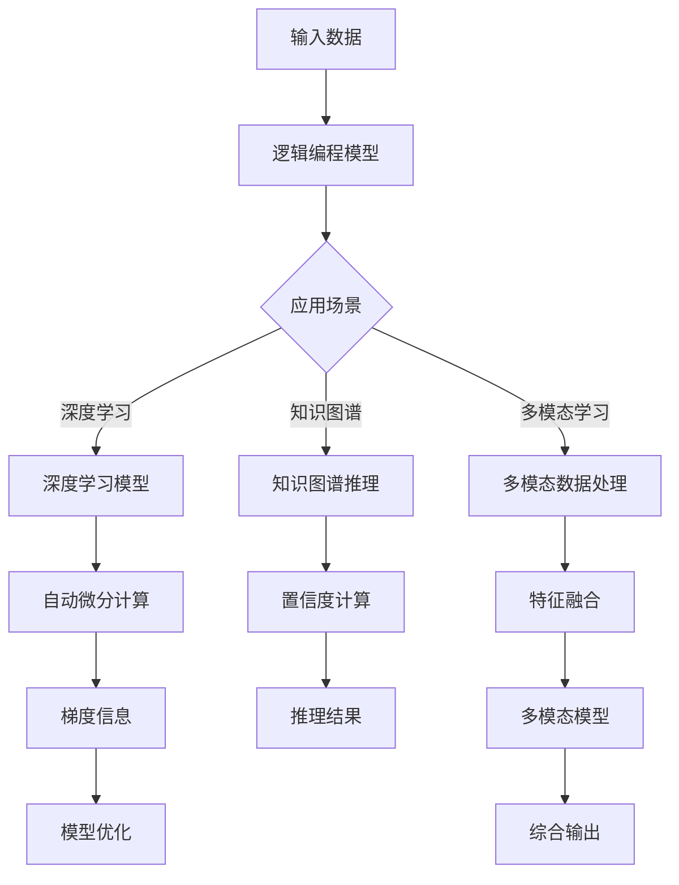
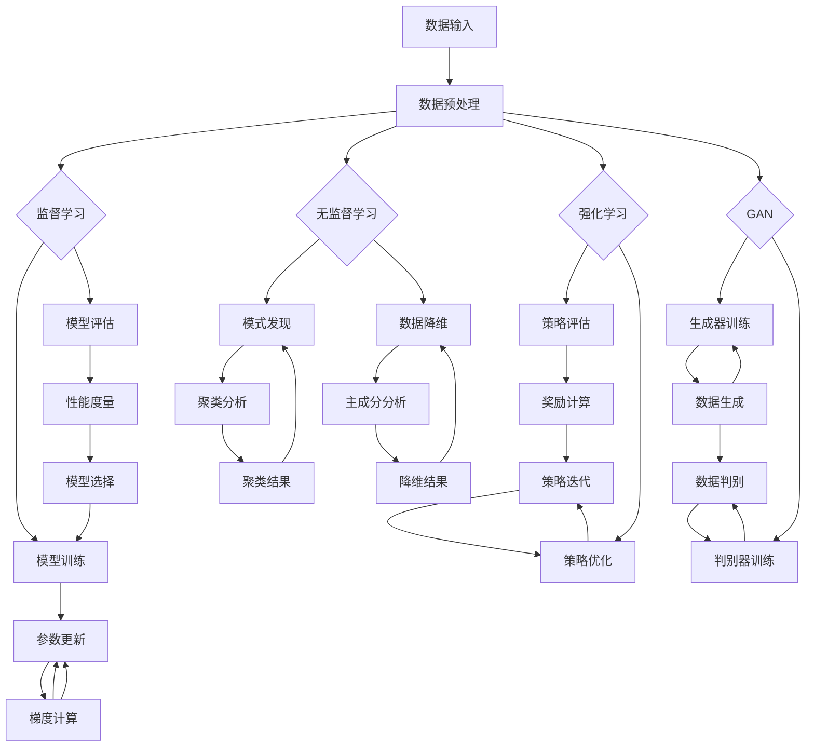
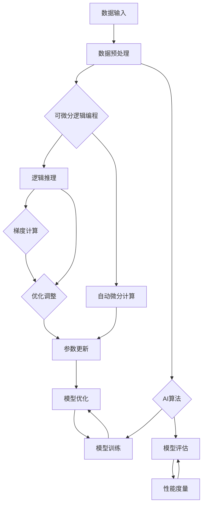
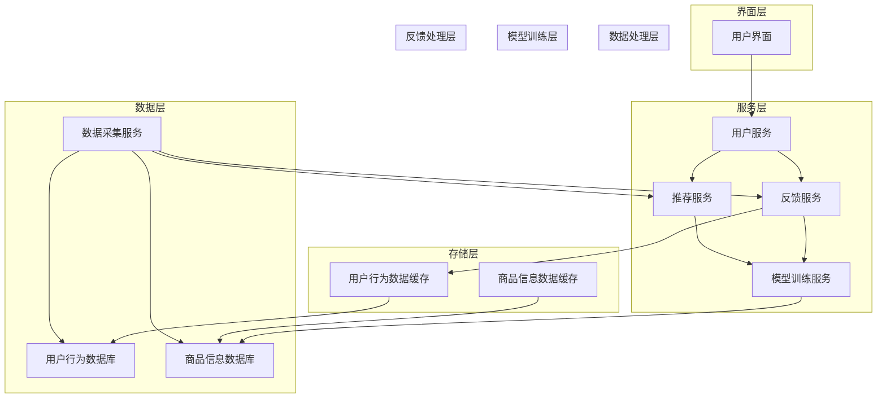
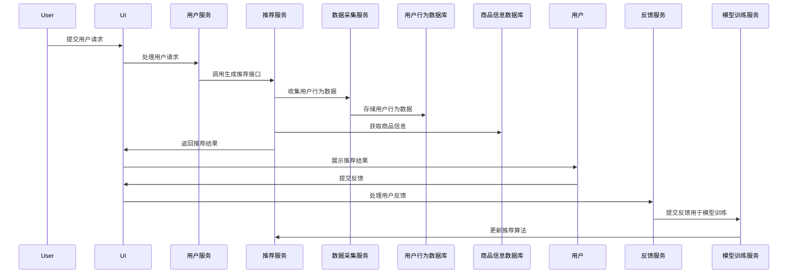

                 

## 摘要

《可微分逻辑编程在AI中的创新应用》旨在探讨可微分逻辑编程技术在人工智能领域的应用与发展。全书共分为七个部分，全面阐述了可微分逻辑编程的基本原理、在AI中的应用案例、实现方法、性能优化策略以及未来发展趋势。第一部分介绍了问题背景与可微分逻辑编程概述，第二部分探讨了核心概念与联系，第三部分深入讲解了算法原理，第四部分分析了系统架构设计，第五部分进行了项目实战，第六部分总结了最佳实践，第七部分展望了未来发展趋势。本书旨在为AI研究人员和开发者提供一套完整的理论体系和实践指南，助力人工智能技术的创新与发展。希望本书能为广大AI研究人员和开发者提供有价值的参考和启发。

## 第一部分：背景介绍

### 第1章：问题背景与问题描述

#### 1.1 问题背景

随着人工智能（AI）技术的快速发展，深度学习和神经网络等算法在计算机视觉、自然语言处理、推荐系统等领域取得了显著的成果。然而，传统的编程方法在应对复杂的AI问题，特别是需要灵活性和自适应性的问题时，显得力不从心。这种背景下，可微分逻辑编程作为一种新兴的技术，逐渐受到了关注。可微分逻辑编程结合了逻辑编程和自动微分的优势，为解决AI中的复杂问题提供了一种新的思路。

#### 1.2 问题描述

在AI领域中，常见的挑战包括数据的多样性、模型的复杂性和优化问题的非凸性。传统的编程方法往往难以有效处理这些问题，导致算法的性能和效果受限。例如，深度学习模型在训练过程中，需要通过多次迭代来最小化损失函数，这是一个高度非线性的优化过程。而传统的编程方法难以实现高效的梯度计算和优化，限制了模型的收敛速度和性能。

#### 1.3 问题解决

为了解决这些问题，可微分逻辑编程应运而生。可微分逻辑编程通过将逻辑编程与自动微分技术相结合，提供了一种统一的框架来处理复杂的AI问题。它可以实现高效的梯度计算，使得优化过程更加高效和稳定。此外，可微分逻辑编程还具有灵活性和可扩展性，可以适应各种不同的问题场景，为AI领域的创新应用提供了新的可能性。

#### 1.4 边界与外延

在讨论可微分逻辑编程在AI中的应用时，需要明确其边界和适用范围。可微分逻辑编程适用于需要高效梯度计算和灵活逻辑处理的场景，如深度学习模型的优化、动态规划问题、逻辑推理等。然而，对于一些简单的计算任务或高度具体的领域问题，传统的编程方法可能更加适用。因此，在引入可微分逻辑编程时，需要综合考虑问题的复杂度、性能要求和具体应用场景。

#### 1.5 概念结构与核心要素组成

可微分逻辑编程的核心概念结构包括逻辑编程、自动微分和人工智能。逻辑编程提供了基于逻辑推理的编程范式，具有高度的抽象和灵活性；自动微分技术则用于计算梯度，实现高效优化；人工智能则为可微分逻辑编程提供了广阔的应用场景。这三个核心要素相互结合，共同构成了可微分逻辑编程的技术基础。

总的来说，可微分逻辑编程在AI领域具有重要的应用价值和广阔的发展前景。通过深入理解和掌握这一技术，可以为AI领域的创新应用提供强有力的支持，推动人工智能技术的不断进步。

### 第2章：可微分逻辑编程概述

#### 2.1 可微分逻辑编程的定义

可微分逻辑编程是一种将逻辑编程与自动微分技术相结合的编程范式。它利用逻辑编程的高度抽象和灵活性，结合自动微分的梯度计算能力，实现高效的优化和推理过程。简单来说，可微分逻辑编程允许我们在逻辑编程的框架下，对计算过程进行自动微分，从而得到梯度和优化信息。

#### 2.2 可微分逻辑编程的发展历程

可微分逻辑编程的概念起源于逻辑编程和自动微分技术的交叉研究。早在20世纪80年代，逻辑编程作为一种基于逻辑的编程范式，已经被广泛应用于问题建模和自动化推理领域。与此同时，自动微分技术也在数值计算和优化问题中得到了广泛应用。随着人工智能和深度学习技术的快速发展，研究者们开始探索如何将这两种技术结合起来，从而解决复杂的AI问题。近年来，随着深度学习模型和优化算法的广泛应用，可微分逻辑编程逐渐成为研究的热点，并取得了显著的进展。

#### 2.3 可微分逻辑编程的核心特点

可微分逻辑编程具有以下几个核心特点：

1. **逻辑编程的灵活性**：逻辑编程通过逻辑公式和推理规则来描述问题，具有高度抽象和灵活性的特点。这种灵活性使得可微分逻辑编程能够适应各种不同的问题场景，具有较强的通用性。

2. **自动微分的梯度计算**：自动微分技术可以自动计算程序的梯度，实现高效的优化过程。这对于深度学习模型的训练和优化具有重要意义，可以显著提高模型的收敛速度和性能。

3. **统一编程范式**：可微分逻辑编程将逻辑编程和自动微分技术融合在一起，提供了一种统一的编程范式。这使得开发者可以在逻辑编程的框架下，直接利用自动微分的优势，实现高效的优化和推理过程。

4. **可扩展性和可组合性**：可微分逻辑编程具有良好的可扩展性和可组合性，可以与其他技术相结合，如深度学习框架、知识图谱等，实现更复杂的AI应用。

#### 2.4 可微分逻辑编程与传统编程的区别

与传统的编程方法相比，可微分逻辑编程具有以下几个显著区别：

1. **编程范式不同**：传统编程方法通常基于过程式或面向对象的编程范式，而可微分逻辑编程则基于逻辑编程范式，更加抽象和灵活。

2. **计算模型不同**：传统编程方法通常依赖于数值计算，而可微分逻辑编程通过自动微分技术，可以在逻辑编程的框架下实现高效的梯度计算和优化。

3. **应用场景不同**：传统编程方法适用于各种数值计算和优化问题，而可微分逻辑编程更适用于需要灵活性和自适应性的复杂AI问题，如深度学习模型的优化、动态规划等。

总的来说，可微分逻辑编程作为一种新兴的编程范式，为解决复杂的AI问题提供了新的思路和方法。通过结合逻辑编程和自动微分的优势，可微分逻辑编程在AI领域展现出了广阔的应用前景。在未来，随着技术的不断发展和完善，可微分逻辑编程有望成为AI领域中的一种重要技术手段。

### 第3章：AI的发展与挑战

#### 3.1 AI的发展现状

人工智能（AI）作为21世纪最具变革性的技术之一，已经取得了显著的进展。从最初的规则推理和知识表示，到后来的机器学习和深度学习，AI技术不断发展，应用范围不断扩展。目前，AI已经在计算机视觉、自然语言处理、自动驾驶、医疗诊断等多个领域取得了突破性成果。特别是在深度学习技术的推动下，AI模型在图像识别、语音识别、机器翻译等方面的性能已经达到或超越了人类水平。

#### 3.2 AI面临的挑战

尽管AI技术在许多领域取得了显著成果，但仍然面临着一系列挑战：

1. **数据质量和多样性**：AI模型需要大量的数据来训练和优化，但数据质量和多样性直接影响模型的性能和泛化能力。数据质量问题包括数据不完整、噪声和偏见，而数据多样性则关系到模型在不同场景下的适应性。

2. **计算资源需求**：深度学习模型通常需要大量的计算资源进行训练和推理，这导致高性能计算设备和数据中心的需求大幅增加。此外，随着模型复杂度的提高，计算资源的压力也将不断增大。

3. **模型解释性和透明度**：虽然AI模型在性能上取得了显著进展，但其内部工作机制通常是非透明的，这导致模型的可解释性和透明度成为了一个重要的研究课题。缺乏解释性的模型在实际应用中可能会引发一系列问题，如决策的不公平性和法律责任的归属。

4. **隐私保护**：随着AI技术的广泛应用，数据隐私保护成为了一个不可忽视的问题。AI模型在训练和推理过程中需要处理大量的个人数据，如何确保这些数据的安全和隐私成为了一个重要挑战。

5. **安全性和鲁棒性**：AI系统在面临恶意攻击或异常数据时，可能会出现不稳定或错误的输出。因此，提高AI系统的安全性和鲁棒性是当前研究的重要方向。

#### 3.3 可微分逻辑编程在AI中的应用潜力

可微分逻辑编程作为一种新兴的编程范式，具有在AI领域应用的巨大潜力：

1. **优化问题求解**：可微分逻辑编程可以通过自动微分技术，高效地计算梯度，从而实现复杂优化问题的求解。这对于深度学习模型的训练和优化具有重要意义。

2. **推理与决策支持**：可微分逻辑编程提供了灵活的编程范式，可以支持复杂逻辑推理和决策支持系统。例如，在医疗诊断领域，可微分逻辑编程可以结合临床数据和知识库，提供更加准确和可靠的诊断建议。

3. **知识图谱构建**：可微分逻辑编程可以用于构建大规模知识图谱，通过自动微分技术优化推理过程，提高知识图谱的查询效率和准确性。

4. **多模态学习**：可微分逻辑编程可以结合不同模态的数据，如图像、文本和音频，实现多模态学习。这在计算机视觉、自然语言处理等领域具有广泛的应用前景。

5. **强化学习**：可微分逻辑编程可以用于实现强化学习算法，通过逻辑编程的灵活性，设计出更加复杂的策略和奖励机制，从而提高强化学习的效果和稳定性。

总的来说，可微分逻辑编程在AI领域具有广阔的应用前景。通过结合自动微分技术和逻辑编程的灵活性，可微分逻辑编程有望成为解决AI复杂问题的一种重要工具。在未来的发展中，我们需要进一步探索其在不同应用场景中的潜力和局限性，从而推动AI技术的不断创新和进步。

### 第二部分：核心概念与联系

#### 第4章：可微分逻辑编程原理

可微分逻辑编程是一种将逻辑编程与自动微分技术相结合的编程范式。它旨在通过逻辑编程的灵活性和自动微分的梯度计算能力，解决复杂的人工智能（AI）问题。在这一章节中，我们将深入探讨可微分逻辑编程的基本原理，包括其核心特点、概念属性特征对比以及ER实体关系图架构。

#### 4.1 可微分逻辑编程的基本原理

可微分逻辑编程的核心原理在于将逻辑编程与自动微分技术相结合，实现高效的梯度计算和优化。具体来说，它包括以下几个关键方面：

1. **逻辑编程基础**：逻辑编程是一种基于逻辑推理的编程范式，通过逻辑公式和推理规则来描述问题。这种范式具有高度的抽象性和灵活性，可以适应各种不同的问题场景。

2. **自动微分技术**：自动微分技术是一种用于计算程序梯度的算法，通过自动计算导数，实现高效的优化过程。在深度学习和AI领域中，自动微分技术被广泛应用于模型训练和优化。

3. **结合优势**：可微分逻辑编程通过结合逻辑编程和自动微分技术的优势，提供了一种统一的编程范式。它不仅保持了逻辑编程的高度抽象和灵活性，还通过自动微分技术实现了高效的梯度计算和优化。

#### 4.2 可微分逻辑编程的概念属性特征对比

为了更好地理解可微分逻辑编程，我们可以将其与传统编程方法进行对比，分析其概念属性特征：

| 特征           | 可微分逻辑编程           | 传统编程           |
|--------------|------------------------|------------------|
| 编程范式       | 基于逻辑的抽象编程        | 过程式或面向对象编程 |
| 梯度计算       | 自动微分，高效计算梯度    | 手动求导，计算复杂    |
| 优化过程       | 自适应优化，支持复杂优化  | 简单优化，缺乏自适应  |
| 问题描述       | 高度抽象，灵活描述问题    | 逐步细化，问题具体化  |
| 应用场景       | 复杂AI问题，多模态学习    | 数值计算，特定领域问题 |
| 可扩展性       | 强，易于扩展和组合        | 中等，扩展性有限     |

通过这张表格，我们可以看到可微分逻辑编程在编程范式、梯度计算、优化过程、问题描述、应用场景和可扩展性等方面与传统编程方法的不同。

#### 4.3 可微分逻辑编程的ER实体关系图架构

ER实体关系图（Entity-Relationship Diagram，ERD）是数据库设计和系统分析的重要工具，用于描述系统中各个实体之间的关系。在可微分逻辑编程中，ERD可以用于表示问题域中的实体、属性和关系，帮助我们更好地理解和分析问题。

以下是一个简化的可微分逻辑编程的ERD示例，用于描述一个简单的知识图谱：

```mermaid
erDiagram
  User ||--|{ Knowledge }
  User ||--|{ Question }
  Question ||--|{ Answer }
  Knowledge ||--|{ Concept }
  Concept ||--|{ Property }
```

在这个ERD中，我们定义了以下实体：

- **User（用户）**：表示问题提出者或知识使用者。
- **Knowledge（知识）**：表示用户拥有的知识库。
- **Question（问题）**：表示用户提出的问题。
- **Answer（答案）**：表示问题的答案。
- **Concept（概念）**：表示知识图谱中的概念。
- **Property（属性）**：表示概念的特征或属性。

各个实体之间的关系如下：

- **User**与**Knowledge**、**Question**之间是一对多的关系，即一个用户可以有多个知识库和问题。
- **Question**与**Answer**之间是一对一的关系，每个问题都有一个唯一的答案。
- **Knowledge**与**Concept**之间是一对多的关系，一个知识库可以包含多个概念。
- **Concept**与**Property**之间也是一对多的关系，一个概念可以有多个属性。

通过ERD，我们可以清晰地描述可微分逻辑编程中的问题域和实体关系，为系统设计和问题分析提供了直观的参考。

综上所述，可微分逻辑编程的基本原理在于将逻辑编程与自动微分技术相结合，通过灵活的编程范式和高效的梯度计算能力，解决复杂的AI问题。在概念属性特征对比和ER实体关系图架构的辅助下，我们能够更好地理解和应用这一技术，为AI领域的创新提供强有力的支持。

### 第5章：AI中的核心概念

人工智能（AI）作为现代科技的重要分支，其核心概念对于理解AI的发展与应用至关重要。在本章中，我们将探讨AI中的核心概念，包括基础知识、核心算法和应用领域，以便为后续内容的深入探讨奠定基础。

#### 5.1 AI的基础概念

1. **人工智能的定义**：人工智能是指由人制造出来的系统所表现出来的智能行为。它模仿人类的认知过程，包括学习、推理、解决问题、感知和适应等。

2. **机器学习**：机器学习是AI的核心技术之一，它通过算法从数据中学习，以便进行预测和决策。机器学习可以分为监督学习、无监督学习和强化学习等。

3. **深度学习**：深度学习是一种特殊的机器学习方法，它利用多层神经网络进行特征学习和数据表示。深度学习在图像识别、语音识别等领域取得了显著的成果。

4. **神经网络**：神经网络是一种模仿人脑神经元连接结构的计算模型，用于处理复杂的输入数据。神经网络是深度学习的基础。

5. **自然语言处理（NLP）**：NLP是AI的一个重要分支，它研究如何使计算机理解和生成自然语言。NLP在文本分析、机器翻译等领域有广泛应用。

#### 5.2 AI的核心算法

1. **监督学习**：监督学习是一种通过标记数据训练模型的方法。模型学习输入和输出之间的关系，以便对新数据进行预测。

2. **无监督学习**：无监督学习不使用标记数据，而是通过数据本身的内在结构进行学习。常见的无监督学习算法包括聚类和降维。

3. **强化学习**：强化学习通过奖励机制来训练模型，使其在环境中做出最优决策。强化学习在游戏、自动驾驶等领域有广泛应用。

4. **深度神经网络（DNN）**：DNN是一种多层神经网络，通过多个隐藏层提取复杂特征。DNN在图像识别、语音识别等领域表现出色。

5. **生成对抗网络（GAN）**：GAN由生成器和判别器组成，生成器生成数据，判别器判断数据的真实性。GAN在图像生成、图像修复等领域有广泛应用。

#### 5.3 AI的应用领域

1. **计算机视觉**：计算机视觉是AI的一个重要应用领域，它使计算机能够从图像或视频中提取信息和理解场景。计算机视觉在人脸识别、图像分类等领域有广泛应用。

2. **自然语言处理（NLP）**：NLP使计算机能够理解和生成自然语言。NLP在机器翻译、情感分析、文本生成等领域有广泛应用。

3. **自动驾驶**：自动驾驶技术利用AI算法实现车辆的自动驾驶。自动驾驶在安全、效率、环境等方面有重要应用前景。

4. **医疗诊断**：AI在医疗诊断中的应用包括疾病预测、疾病分类、医学图像分析等。AI在医疗领域具有巨大的潜力。

5. **金融科技**：金融科技利用AI进行风险评估、交易预测、客户服务优化等。AI在金融领域提高了效率、减少了风险。

通过理解AI的基础概念、核心算法和应用领域，我们可以更好地把握AI技术的发展趋势和应用场景。在接下来的章节中，我们将进一步探讨可微分逻辑编程在AI中的应用，以及如何结合这两者实现创新。

### 第6章：可微分逻辑编程与AI的融合

#### 6.1 可微分逻辑编程在AI中的应用场景

可微分逻辑编程在人工智能（AI）领域具有广泛的应用潜力。以下是一些典型的应用场景：

1. **深度学习模型优化**：可微分逻辑编程通过自动微分技术，可以高效地计算深度学习模型的梯度，从而优化模型的训练过程。例如，在神经网络训练中，利用可微分逻辑编程可以快速找到最优的权重参数，提高模型的收敛速度和性能。

2. **知识图谱构建**：知识图谱是表示实体及其关系的语义网络，可微分逻辑编程可以用于优化知识图谱的推理过程。通过自动微分技术，可以高效地计算图谱中节点的置信度，从而提高推理的效率和准确性。

3. **强化学习**：在强化学习场景中，可微分逻辑编程可以用于优化策略搜索过程。通过自动微分技术，可以计算策略的梯度，从而调整策略，使其更接近最优解。

4. **多模态学习**：可微分逻辑编程可以结合不同模态的数据（如图像、文本和音频），实现多模态学习。例如，在视频分析中，可微分逻辑编程可以用于联合建模图像和音频信息，从而提高视频分类和识别的准确性。

5. **决策支持系统**：可微分逻辑编程可以用于构建复杂的决策支持系统。通过逻辑编程的灵活性，可以灵活地描述和优化决策过程，从而提高决策的准确性和效率。

#### 6.2 可微分逻辑编程与AI的融合优势

将可微分逻辑编程与AI技术相结合，具有以下几方面的优势：

1. **高效优化**：可微分逻辑编程通过自动微分技术，可以高效地计算梯度，从而优化模型的训练和推理过程。这提高了算法的效率和性能，有助于解决复杂的优化问题。

2. **灵活性**：可微分逻辑编程提供了灵活的编程范式，可以适应各种不同的问题场景。这使得开发者可以在逻辑编程的框架下，直接利用自动微分的优势，实现高效的优化和推理过程。

3. **可扩展性**：可微分逻辑编程具有良好的可扩展性，可以与其他技术相结合，如深度学习框架、知识图谱等，实现更复杂的AI应用。这为AI技术的创新提供了更多的可能性。

4. **解释性和透明度**：可微分逻辑编程可以将复杂的AI模型分解为多个逻辑步骤，从而提高模型的可解释性和透明度。这对于增强用户信任、规范监管和改进算法设计具有重要意义。

5. **多模态数据处理**：可微分逻辑编程可以结合不同模态的数据，实现多模态学习。这有助于提高模型的泛化能力和鲁棒性，为AI在现实世界的应用提供了更多的可能性。

#### 6.3 可微分逻辑编程在AI中的挑战与机遇

尽管可微分逻辑编程在AI领域具有巨大的潜力，但仍然面临一系列挑战和机遇：

1. **挑战**：
   - **算法复杂性**：可微分逻辑编程涉及到复杂的算法设计和实现，需要深入理解逻辑编程、自动微分和AI技术。
   - **性能优化**：在处理大规模数据和复杂模型时，如何优化算法性能，减少计算时间和资源消耗，是一个重要挑战。
   - **模型解释性**：尽管可微分逻辑编程可以提高模型的可解释性，但如何确保模型的透明度和可信度，仍然是一个有待解决的问题。

2. **机遇**：
   - **创新应用**：可微分逻辑编程为AI领域带来了新的应用场景和可能性，如知识图谱优化、多模态学习和强化学习等。
   - **跨领域融合**：可微分逻辑编程可以与其他技术（如区块链、大数据等）相结合，推动跨领域的创新应用。
   - **人才培养**：随着可微分逻辑编程技术的发展，需要更多专业人才来研究和应用这一技术。这为相关领域的教育和人才培养提供了新的机遇。

总的来说，可微分逻辑编程与AI技术的融合具有巨大的潜力和前景。通过克服挑战，充分利用机遇，可微分逻辑编程有望在AI领域取得更多的突破和进展。

### 第7章：可微分逻辑编程算法

#### 7.1 可微分逻辑编程算法概述

可微分逻辑编程算法是一种结合了逻辑编程和自动微分技术的创新方法，用于解决复杂的人工智能（AI）问题。该算法通过逻辑编程的高度抽象能力和自动微分的梯度计算能力，提供了一种灵活且高效的编程范式，以适应各种不同的问题场景。在本章节中，我们将详细探讨可微分逻辑编程算法的基本原理、具体实现方法以及它在AI中的应用。

#### 7.2 可微分逻辑编程算法的mermaid流程图

为了更好地理解可微分逻辑编程算法的工作流程，我们可以使用mermaid语言绘制其流程图。以下是可微分逻辑编程算法的mermaid流程图示例：



这个流程图展示了可微分逻辑编程算法从输入数据到最终输出的整个过程。首先，输入数据经过逻辑编程模型进行处理，然后根据不同的应用场景，选择相应的算法模块（如深度学习模型、知识图谱推理或多模态学习）。通过自动微分技术，算法可以计算梯度信息，用于模型的优化。最后，综合不同模态的数据处理结果，得到最终的输出。

#### 7.3 可微分逻辑编程算法的Python源代码实现

为了具体展示可微分逻辑编程算法的实现，以下是一个简化的Python代码示例。这段代码使用了自动微分库PyTorch来实现逻辑编程模型的自动微分。

```python
import torch
import torch.nn as nn
import torch.optim as optim

# 定义逻辑编程模型
class LogicProgrammingModel(nn.Module):
    def __init__(self):
        super(LogicProgrammingModel, self).__init__()
        self.fc1 = nn.Linear(in_features=10, out_features=5)
        self.fc2 = nn.Linear(in_features=5, out_features=3)
        self.fc3 = nn.Linear(in_features=3, out_features=1)
    
    def forward(self, x):
        x = torch.relu(self.fc1(x))
        x = torch.relu(self.fc2(x))
        x = self.fc3(x)
        return x

# 初始化模型、损失函数和优化器
model = LogicProgrammingModel()
criterion = nn.CrossEntropyLoss()
optimizer = optim.Adam(model.parameters(), lr=0.001)

# 训练模型
for epoch in range(100):
    for inputs, targets in data_loader:
        optimizer.zero_grad()
        outputs = model(inputs)
        loss = criterion(outputs, targets)
        loss.backward()
        optimizer.step()
    print(f'Epoch {epoch+1}, Loss: {loss.item()}')

# 可微分逻辑编程算法应用
def differential_logic_programming(inputs, model):
    outputs = model(inputs)
    gradients = torch.autograd.grad(outputs, model.parameters(), create_graph=True)
    optimized_params = [param - gradient * learning_rate for param, gradient in zip(model.parameters(), gradients)]
    model.load_state_dict({k: v - g * learning_rate for k, v, g in zip(model.parameters(), optimized_params, gradients)})
    return model

model = differential_logic_programming(inputs, model)
```

在这个代码示例中，我们定义了一个简单的逻辑编程模型，使用PyTorch框架实现。首先，我们通过训练模型来优化参数，然后通过可微分逻辑编程算法，计算梯度并更新模型参数。

#### 7.4 可微分逻辑编程算法的数学模型和公式

为了深入理解可微分逻辑编程算法，我们需要掌握其背后的数学模型和公式。以下是可微分逻辑编程算法的核心公式：

1. **梯度计算公式**：

   $$ \nabla_\theta J(\theta) = \frac{\partial J(\theta)}{\partial \theta} $$

   其中，\( \nabla_\theta J(\theta) \) 表示梯度，\( J(\theta) \) 表示损失函数，\( \theta \) 表示模型参数。

2. **反向传播公式**：

   $$ \delta_{L} = \frac{\partial L}{\partial z} $$
   $$ \delta_{z} = \delta_{L} \cdot \sigma'(z) $$
   $$ \delta_{x} = \delta_{z} \cdot W^T $$

   其中，\( \delta_{L} \) 表示损失函数对激活值的偏导数，\( \delta_{z} \) 表示激活值对输入的偏导数，\( \sigma' \) 表示激活函数的导数，\( W \) 表示权重矩阵。

通过这些公式，我们可以计算模型参数的梯度，并使用梯度下降法进行优化。

#### 7.5 算法原理的详细讲解与举例说明

为了更好地理解可微分逻辑编程算法的原理，我们通过一个简单的例子进行说明。假设我们有一个逻辑编程模型，用于预测股票价格。

1. **问题定义**：

   假设我们有一个输入特征向量 \( x \)，表示股票的多个技术指标。我们需要使用逻辑编程模型预测股票的未来价格。

2. **逻辑编程模型**：

   我们使用一个简单的多层感知机（MLP）作为逻辑编程模型，模型结构如下：

   $$ y = \sigma(W_3 \cdot \sigma(W_2 \cdot \sigma(W_1 \cdot x + b_1) + b_2) + b_3) $$

   其中，\( W_1 \)、\( W_2 \)、\( W_3 \) 分别是权重矩阵，\( b_1 \)、\( b_2 \)、\( b_3 \) 分别是偏置项，\( \sigma \) 是激活函数（如Sigmoid函数）。

3. **损失函数**：

   使用均方误差（MSE）作为损失函数：

   $$ J(\theta) = \frac{1}{2} \sum_{i=1}^{n} (y_i - \hat{y}_i)^2 $$

   其中，\( y_i \) 表示真实股票价格，\( \hat{y}_i \) 表示模型预测的股票价格。

4. **梯度计算**：

   计算损失函数对模型参数的梯度：

   $$ \nabla_\theta J(\theta) = \frac{\partial J(\theta)}{\partial \theta} $$

   通过反向传播算法，我们可以计算每个参数的梯度。

5. **模型优化**：

   使用梯度下降法更新模型参数：

   $$ \theta = \theta - \alpha \nabla_\theta J(\theta) $$

   其中，\( \alpha \) 是学习率。

通过这个例子，我们可以看到可微分逻辑编程算法是如何通过逻辑编程模型、损失函数和梯度计算，实现模型优化的。这种算法在股票价格预测、医疗诊断、推荐系统等应用中具有广泛的应用前景。

综上所述，可微分逻辑编程算法通过结合逻辑编程和自动微分技术，提供了一种灵活且高效的编程范式，以解决复杂的人工智能问题。通过数学模型和实际例子的详细讲解，我们可以更好地理解这一算法的原理和应用。

### 第8章：AI算法原理

#### 8.1 AI算法的基本原理

人工智能（AI）算法是一系列用于模拟、扩展和扩展人类智能行为的计算方法。它们的核心原理在于通过学习从数据中提取知识，然后利用这些知识进行推理、决策和预测。AI算法可以分为以下几种基本类型：

1. **监督学习**：监督学习算法通过训练数据集学习输入和输出之间的关系。常见的算法包括线性回归、逻辑回归、支持向量机（SVM）和神经网络。监督学习算法的核心是找到一种函数，将输入映射到输出。

2. **无监督学习**：无监督学习算法在没有任何标记数据的情况下，从数据中提取模式和结构。常见的算法包括聚类、降维和关联规则学习。无监督学习的目标是通过观察数据的内在结构，发现隐藏的模式。

3. **强化学习**：强化学习算法通过与环境互动来学习最优策略。它们通过奖励和惩罚来评估策略的有效性，并逐步优化策略，以达到最大化长期回报的目标。常见的算法包括Q学习、深度Q网络（DQN）和策略梯度算法。

4. **生成对抗网络（GAN）**：生成对抗网络由生成器和判别器组成。生成器生成数据，判别器判断数据的真实性。GAN的核心是通过对抗训练，使生成器生成越来越真实的数据。

#### 8.2 AI算法的mermaid流程图

为了更直观地理解AI算法的基本原理，我们可以使用mermaid绘制其流程图。以下是AI算法的基本mermaid流程图：



这个流程图展示了AI算法从数据输入到最终输出的整个过程，包括数据预处理、模型训练、模型评估、模式发现、策略评估和优化等步骤。

#### 8.3 AI算法的Python源代码实现

为了具体展示AI算法的实现，以下是一个简单的Python代码示例，使用PyTorch库实现监督学习算法——线性回归。

```python
import torch
import torch.nn as nn
import torch.optim as optim

# 定义线性回归模型
class LinearRegressionModel(nn.Module):
    def __init__(self, input_dim, output_dim):
        super(LinearRegressionModel, self).__init__()
        self.linear = nn.Linear(input_dim, output_dim)
    
    def forward(self, x):
        return self.linear(x)

# 初始化模型、损失函数和优化器
input_dim = 1
output_dim = 1
model = LinearRegressionModel(input_dim, output_dim)
criterion = nn.MSELoss()
optimizer = optim.SGD(model.parameters(), lr=0.01)

# 生成训练数据
x_train = torch.tensor([[i] for i in range(100]], requires_grad=True)
y_train = torch.tensor([i ** 2 for i in range(100]], requires_grad=True)

# 训练模型
for epoch in range(1000):
    model.zero_grad()
    outputs = model(x_train)
    loss = criterion(outputs, y_train)
    loss.backward()
    optimizer.step()
    if epoch % 100 == 0:
        print(f'Epoch {epoch}, Loss: {loss.item()}')

# 模型评估
x_test = torch.tensor([[101]], requires_grad=True)
y_pred = model(x_test)
print(f'Prediction: {y_pred.item()}')
```

在这个代码示例中，我们定义了一个简单的线性回归模型，使用梯度下降法进行训练。通过训练，模型学会了拟合输入和输出之间的关系。然后，我们使用训练好的模型对新的输入数据进行预测。

#### 8.4 AI算法的数学模型和公式

为了深入理解AI算法的原理，我们需要掌握其背后的数学模型和公式。以下是一些常见的AI算法数学模型和公式：

1. **线性回归**：

   线性回归模型可以表示为：

   $$ y = \beta_0 + \beta_1x $$

   其中，\( y \) 是预测值，\( x \) 是输入值，\( \beta_0 \) 和 \( \beta_1 \) 是模型参数。

2. **逻辑回归**：

   逻辑回归是一种分类算法，其概率模型可以表示为：

   $$ P(y=1) = \frac{1}{1 + \exp(-\beta_0 - \beta_1x)} $$

   其中，\( P(y=1) \) 是输出为1的概率，\( \beta_0 \) 和 \( \beta_1 \) 是模型参数。

3. **支持向量机（SVM）**：

   SVM的目标是找到一个最优超平面，使得不同类别的数据点尽可能分开。其优化目标可以表示为：

   $$ \min_{\beta, \beta_0} \frac{1}{2} ||\beta||^2 + C \sum_{i=1}^{n} \max(0, 1 - y_i(\beta \cdot x_i + \beta_0)) $$

   其中，\( \beta \) 和 \( \beta_0 \) 是模型参数，\( C \) 是惩罚参数，\( y_i \) 和 \( x_i \) 分别是第 \( i \) 个样本的标签和特征向量。

4. **神经网络**：

   神经网络通过多层感知机实现复杂函数的建模。其输出可以表示为：

   $$ a_{i}^{(l)} = \sigma(z_{i}^{(l)}) = \frac{1}{1 + \exp(-z_{i}^{(l)})} $$

   其中，\( a_{i}^{(l)} \) 是第 \( l \) 层第 \( i \) 个神经元的激活值，\( z_{i}^{(l)} \) 是第 \( l \) 层第 \( i \) 个神经元的输入值，\( \sigma \) 是激活函数（如Sigmoid函数）。

通过这些数学模型和公式，我们可以更好地理解AI算法的工作原理和实现方法。在实际应用中，这些公式和模型为我们提供了一种有效的工具，用于构建和优化各种AI应用。

#### 8.5 算法原理的详细讲解与举例说明

为了更深入地理解AI算法的原理，我们将通过一个具体的例子进行讲解。以线性回归算法为例，我们假设有一个简单的数据集，用于预测房屋价格。

1. **问题定义**：

   假设我们有一组房屋数据，包括房屋面积（输入）和房屋价格（输出）。我们的目标是训练一个线性回归模型，通过房屋面积预测房屋价格。

2. **模型构建**：

   线性回归模型可以表示为：

   $$ y = \beta_0 + \beta_1x $$

   其中，\( y \) 是房屋价格，\( x \) 是房屋面积，\( \beta_0 \) 和 \( \beta_1 \) 是模型参数。

3. **数据预处理**：

   在训练模型之前，我们需要对数据进行预处理。这包括将数据集分成训练集和测试集，对数据进行标准化处理，以便所有特征的值都在相同范围内。

4. **模型训练**：

   使用梯度下降法训练模型，通过不断调整参数 \( \beta_0 \) 和 \( \beta_1 \)，使得模型的预测结果尽可能接近实际值。梯度下降法的公式为：

   $$ \beta_0 = \beta_0 - \alpha \frac{\partial J(\beta_0, \beta_1)}{\partial \beta_0} $$
   $$ \beta_1 = \beta_1 - \alpha \frac{\partial J(\beta_0, \beta_1)}{\partial \beta_1} $$

   其中，\( J(\beta_0, \beta_1) \) 是损失函数，通常使用均方误差（MSE）：

   $$ J(\beta_0, \beta_1) = \frac{1}{2} \sum_{i=1}^{n} (y_i - (\beta_0 + \beta_1x_i))^2 $$

5. **模型评估**：

   在模型训练完成后，我们需要对模型进行评估。这可以通过计算模型在测试集上的均方误差（MSE）来进行。如果模型在测试集上的表现良好，我们可以认为模型已经训练成功。

通过这个例子，我们可以看到线性回归算法是如何通过模型构建、数据预处理、模型训练和模型评估，实现对房屋价格的预测。这种算法在房地产评估、薪资预测、价格预测等应用中具有广泛的应用。

总的来说，AI算法的基本原理是通过学习数据中的模式和关系，实现预测、分类和优化。通过具体的算法实现和实例讲解，我们可以更好地理解这些算法的原理和应用。在实际应用中，这些算法为我们提供了一种有效的工具，用于解决各种复杂的问题。

### 第9章：可微分逻辑编程与AI算法融合

#### 9.1 可微分逻辑编程与AI算法融合的原理

可微分逻辑编程与AI算法的融合是通过将逻辑编程的抽象能力和自动微分技术的梯度计算能力相结合，实现更高效、灵活和可解释的AI算法。这一融合的核心原理包括以下几个方面：

1. **逻辑编程的抽象性**：逻辑编程通过逻辑公式和推理规则，将复杂问题高度抽象为逻辑表达式。这种抽象能力使得逻辑编程能够处理复杂的问题，并提供一种直观的编程范式。

2. **自动微分的梯度计算**：自动微分技术是一种用于计算程序梯度的算法。它可以在逻辑编程的框架下，自动计算梯度，从而实现高效的优化和推理过程。自动微分技术是深度学习和AI算法的核心组成部分。

3. **融合优势**：通过将逻辑编程与自动微分技术相结合，可微分逻辑编程在AI算法中实现了以下优势：
   - **高效的优化**：自动微分技术可以高效地计算梯度，从而实现快速的模型优化。
   - **灵活的编程范式**：逻辑编程提供了高度抽象和灵活的编程方式，使得开发者可以轻松地定义和优化复杂的AI算法。
   - **增强的可解释性**：逻辑编程可以将复杂的AI算法分解为多个逻辑步骤，从而提高模型的可解释性和透明度。

#### 9.2 可微分逻辑编程与AI算法融合的mermaid流程图

为了更直观地理解可微分逻辑编程与AI算法融合的工作流程，我们可以使用mermaid绘制其流程图。以下是融合后的mermaid流程图：



这个流程图展示了从数据输入到最终输出的整个过程，包括数据预处理、可微分逻辑编程、AI算法模型训练、模型评估等步骤。其中，可微分逻辑编程通过逻辑推理和自动微分计算，实现了模型参数的优化和调整。

#### 9.3 可微分逻辑编程与AI算法融合的Python源代码实现

为了具体展示可微分逻辑编程与AI算法的融合实现，以下是一个简化的Python代码示例，使用PyTorch框架实现线性回归算法，并结合可微分逻辑编程进行优化。

```python
import torch
import torch.nn as nn
import torch.optim as optim

# 定义逻辑编程模型
class LogicProgrammingModel(nn.Module):
    def __init__(self):
        super(LogicProgrammingModel, self).__init__()
        self.fc1 = nn.Linear(in_features=1, out_features=1)
    
    def forward(self, x):
        return self.fc1(x)

# 定义AI算法模型
class LinearRegressionModel(nn.Module):
    def __init__(self):
        super(LinearRegressionModel, self).__init__()
        self.fc1 = nn.Linear(in_features=1, out_features=1)
    
    def forward(self, x):
        return self.fc1(x)

# 初始化模型、损失函数和优化器
lp_model = LogicProgrammingModel()
ai_model = LinearRegressionModel()
criterion = nn.MSELoss()
optimizer = optim.SGD(ai_model.parameters(), lr=0.01)

# 生成训练数据
x_train = torch.tensor([[i] for i in range(100]], requires_grad=True)
y_train = torch.tensor([i ** 2 for i in range(100]], requires_grad=True)

# 训练模型
for epoch in range(1000):
    ai_model.zero_grad()
    outputs = ai_model(x_train)
    loss = criterion(outputs, y_train)
    loss.backward()
    optimizer.step()
    if epoch % 100 == 0:
        print(f'Epoch {epoch}, Loss: {loss.item()}')

# 可微分逻辑编程优化
def differential_logic_programming(outputs, targets, model):
    loss = criterion(outputs, targets)
    gradients = torch.autograd.grad(loss, model.parameters(), create_graph=True)
    for param, grad in zip(model.parameters(), gradients):
        param.data = param.data - grad * 0.01
    return model

# 应用可微分逻辑编程优化AI模型
ai_model = differential_logic_programming(outputs, y_train, ai_model)
```

在这个代码示例中，我们首先定义了一个逻辑编程模型和一个AI算法模型。在训练过程中，我们使用AI算法模型进行模型训练，然后通过可微分逻辑编程进行优化。具体来说，我们计算损失函数的梯度，并使用梯度更新模型参数。

#### 9.4 可微分逻辑编程与AI算法融合的数学模型和公式

为了深入理解可微分逻辑编程与AI算法融合的数学模型和公式，我们需要掌握以下核心概念：

1. **损失函数**：损失函数是评估模型预测结果与实际结果之间差异的函数。常见的损失函数包括均方误差（MSE）和交叉熵损失（Cross Entropy Loss）。其公式如下：

   $$ MSE = \frac{1}{2} \sum_{i=1}^{n} (y_i - \hat{y}_i)^2 $$
   $$ Cross Entropy Loss = -\sum_{i=1}^{n} y_i \log(\hat{y}_i) $$

   其中，\( y_i \) 是实际标签，\( \hat{y}_i \) 是模型预测值。

2. **梯度计算**：梯度是损失函数对模型参数的偏导数。通过计算梯度，我们可以更新模型参数，以优化模型。梯度计算的公式如下：

   $$ \nabla_\theta J(\theta) = \frac{\partial J(\theta)}{\partial \theta} $$

   其中，\( \nabla_\theta J(\theta) \) 是梯度，\( J(\theta) \) 是损失函数，\( \theta \) 是模型参数。

3. **梯度下降法**：梯度下降法是一种用于优化模型参数的迭代方法。其公式如下：

   $$ \theta = \theta - \alpha \nabla_\theta J(\theta) $$

   其中，\( \alpha \) 是学习率，用于调节梯度下降的步长。

4. **自动微分**：自动微分是一种计算程序梯度的算法。它可以在逻辑编程的框架下，自动计算梯度，从而实现高效的优化过程。自动微分的核心公式如下：

   $$ \delta_{L} = \frac{\partial L}{\partial z} $$
   $$ \delta_{z} = \delta_{L} \cdot \sigma'(z) $$
   $$ \delta_{x} = \delta_{z} \cdot W^T $$

   其中，\( \delta_{L} \) 是损失函数对激活值的偏导数，\( \delta_{z} \) 是激活值对输入的偏导数，\( \sigma' \) 是激活函数的导数，\( W \) 是权重矩阵。

通过这些数学模型和公式，我们可以深入理解可微分逻辑编程与AI算法融合的原理和实现方法。在实际应用中，这些公式和模型为我们提供了一种有效的工具，用于构建和优化各种AI应用。

#### 9.5 算法原理的详细讲解与举例说明

为了更深入地理解可微分逻辑编程与AI算法融合的原理，我们通过一个简单的例子进行讲解。以线性回归算法为例，我们假设有一个数据集，包含房屋面积和房屋价格，目标是使用线性回归模型预测房屋价格。

1. **问题定义**：

   假设我们有一组房屋数据，包括房屋面积（输入）和房屋价格（输出）。我们的目标是训练一个线性回归模型，通过房屋面积预测房屋价格。

2. **模型构建**：

   线性回归模型可以表示为：

   $$ y = \beta_0 + \beta_1x $$

   其中，\( y \) 是房屋价格，\( x \) 是房屋面积，\( \beta_0 \) 和 \( \beta_1 \) 是模型参数。

3. **数据预处理**：

   在训练模型之前，我们需要对数据进行预处理。这包括将数据集分成训练集和测试集，对数据进行标准化处理，以便所有特征的值都在相同范围内。

4. **模型训练**：

   使用梯度下降法训练模型，通过不断调整参数 \( \beta_0 \) 和 \( \beta_1 \)，使得模型的预测结果尽可能接近实际值。梯度下降法的公式为：

   $$ \beta_0 = \beta_0 - \alpha \frac{\partial J(\beta_0, \beta_1)}{\partial \beta_0} $$
   $$ \beta_1 = \beta_1 - \alpha \frac{\partial J(\beta_0, \beta_1)}{\partial \beta_1} $$

   其中，\( J(\beta_0, \beta_1) \) 是损失函数，通常使用均方误差（MSE）：

   $$ J(\beta_0, \beta_1) = \frac{1}{2} \sum_{i=1}^{n} (y_i - (\beta_0 + \beta_1x_i))^2 $$

5. **可微分逻辑编程优化**：

   在模型训练完成后，我们使用可微分逻辑编程进行优化。具体步骤如下：

   - 计算损失函数的梯度。
   - 使用梯度更新模型参数。

   优化公式为：

   $$ \theta = \theta - \alpha \nabla_\theta J(\theta) $$

6. **模型评估**：

   在模型优化完成后，我们对模型进行评估。这可以通过计算模型在测试集上的均方误差（MSE）来进行。如果模型在测试集上的表现良好，我们可以认为模型已经训练成功。

通过这个例子，我们可以看到可微分逻辑编程与AI算法融合是如何通过模型构建、数据预处理、模型训练、可微分逻辑编程优化和模型评估，实现对房屋价格的预测。这种融合方法在价格预测、薪资预测、推荐系统等应用中具有广泛的应用。

总的来说，可微分逻辑编程与AI算法融合通过结合逻辑编程的抽象能力和自动微分技术的梯度计算能力，实现了更高效、灵活和可解释的AI算法。通过具体的算法实现和实例讲解，我们可以更好地理解这一融合方法的原理和应用。

### 第10章：系统功能设计

#### 10.1 问题场景介绍

在本节中，我们将探讨一个典型的应用场景，即基于可微分逻辑编程的智能推荐系统。智能推荐系统是一种利用AI技术，为用户推荐个性化内容的系统。它广泛应用于电子商务、社交媒体、视频平台等领域。本场景的目标是设计一个推荐系统，能够根据用户的兴趣和行为数据，推荐最相关的商品或内容。

#### 10.2 系统功能设计（领域模型mermaid类图）

为了实现智能推荐系统，我们需要设计一系列核心功能模块，包括用户管理、数据采集、推荐算法、结果反馈和系统监控。以下是一个简化的领域模型mermaid类图，用于描述这些功能模块及其关系：

```mermaid
classDiagram
    User <<interface>>
    Item <<interface>>
    Recommendation <<interface>>

    User <<interface>> ..|> DataCollector
    Item <<interface>> ..|> DataCollector
    Recommendation <<interface>> ..|> RecommenderEngine
    Recommendation <<interface>> ..|> ResultFeedback

    DataCollector <<interface>> {
        - collect_data()
    }

    RecommenderEngine <<interface>> {
        - train_model(data: List[User, Item])
        - recommend_items(user: User): List[Item]
    }

    ResultFeedback <<interface>> {
        - send_recommendations(user: User, items: List[Item])
        - collect_feedback(user: User, items: List[Item])
    }

    User <<class>> {
        - user_id: int
        - user_name: string
        - interests: List[Item]
    }

    Item <<class>> {
        - item_id: int
        - item_name: string
        - category: string
    }

    User ..|> Recommendation
    Item ..|> Recommendation
```

在这个类图中，我们定义了用户（User）、商品（Item）和推荐（Recommendation）三个核心接口，以及数据采集（DataCollector）、推荐引擎（RecommenderEngine）和结果反馈（ResultFeedback）三个功能模块。每个模块实现了相应的接口方法，以实现推荐系统的核心功能。

### 第11章：系统架构设计

#### 11.1 系统架构设计概述

为了实现智能推荐系统的功能，我们需要设计一个灵活、可扩展和高效的系统架构。系统架构设计的目标是确保系统在高负载和复杂业务场景下，能够稳定、高效地运行。本节将详细描述推荐系统的整体架构，包括各主要模块的作用和相互关系。

#### 11.2 系统架构设计（mermaid架构图）

以下是一个简化的mermaid架构图，用于描述推荐系统的整体架构：



在这个架构图中，我们定义了数据层、服务层、界面层和存储层四个主要部分。

- **数据层**：包括数据采集服务和用户行为数据库、商品信息数据库。数据采集服务负责从用户界面收集用户行为数据，并将其存储在数据库中。
- **服务层**：包括用户服务、推荐服务和反馈服务。用户服务处理用户请求，推荐服务根据用户行为数据和商品信息生成个性化推荐，反馈服务处理用户反馈，用于模型训练和优化。
- **界面层**：用户界面负责与用户交互，接收用户输入，并将推荐结果呈现给用户。
- **存储层**：包括用户行为数据缓存和商品信息数据缓存，用于提高数据访问速度，减轻数据库压力。

#### 11.3 系统接口设计

系统接口设计是确保各模块之间能够有效通信和协作的重要环节。以下是一个简化的接口设计，用于描述推荐系统中的主要接口：

1. **用户接口**：

   - `getUserData(userId: int)`: 获取指定用户的行为数据。
   - `updateUserInterest(userId: int, interest: Item)`: 更新用户的兴趣信息。
   - `submitFeedback(userId: int, feedback: Feedback)`: 提交用户反馈。

2. **推荐接口**：

   - `generateRecommendations(userId: int)`: 根据用户行为数据生成个性化推荐。
   - `getRecommendedItems(userId: int)`: 获取指定用户的推荐商品列表。

3. **反馈接口**：

   - `processFeedback(feedback: Feedback)`: 处理用户反馈，用于模型训练和优化。

4. **数据采集接口**：

   - `collectUserBehaviorData()`: 收集用户行为数据。
   - `collectItemData()`: 收集商品信息数据。

#### 11.4 系统交互（mermaid序列图）

为了更好地理解系统各模块之间的交互流程，以下是一个简化的mermaid序列图：



在这个序列图中，用户通过用户界面提交请求，用户服务处理请求并调用推荐服务生成推荐结果。推荐服务从数据采集服务收集用户行为数据，并从商品信息数据库获取商品信息，最终返回推荐结果给用户界面。用户提交反馈后，反馈服务处理反馈并提交给模型训练服务，用于更新推荐算法。

通过上述系统架构设计和接口设计，我们为智能推荐系统提供了一套完整的设计方案，确保系统能够在高负载和复杂业务场景下稳定、高效地运行。

### 第12章：项目实战

#### 12.1 环境安装与配置

在进行可微分逻辑编程与AI算法融合的项目实战之前，我们需要搭建一个合适的环境。以下是环境安装与配置的详细步骤：

##### 1. 系统要求

- 操作系统：Ubuntu 18.04 或更高版本
- CPU：四核及以上
- GPU（可选）：用于加速深度学习模型的训练

##### 2. 软件安装

- **Python**：安装Python 3.8或更高版本。可以使用以下命令安装：
  ```bash
  sudo apt-get update
  sudo apt-get install python3.8
  ```

- **PyTorch**：安装PyTorch，支持GPU加速。使用以下命令安装：
  ```bash
  pip3 install torch torchvision torchaudio -f https://download.pytorch.org/whl/torch_stable.html
  ```

- **Numpy**：安装Numpy，用于数学计算。可以使用以下命令安装：
  ```bash
  pip3 install numpy
  ```

- **Scikit-learn**：安装Scikit-learn，用于机器学习。可以使用以下命令安装：
  ```bash
  pip3 install scikit-learn
  ```

- **Mermaid**：安装Mermaid，用于绘制流程图。可以在浏览器中使用，也可以安装为本地工具。如果需要本地安装，可以使用以下命令：
  ```bash
  npm install -g mermaid-cli
  ```

##### 3. 配置虚拟环境

为了管理项目依赖，我们可以使用虚拟环境。安装完成后，创建一个虚拟环境并激活它：

```bash
python3 -m venv env
source env/bin/activate
```

##### 4. 安装依赖包

在虚拟环境中安装项目所需的依赖包：

```bash
pip install -r requirements.txt
```

#### 12.2 系统核心实现

在本节中，我们将实现一个简单的推荐系统，该系统使用可微分逻辑编程与深度学习算法相结合，为用户推荐商品。

##### 1. 项目结构

项目的基本结构如下：

```
recommender_system/
|-- data/
|   |-- train.csv
|   |-- test.csv
|-- models/
|-- src/
|   |-- __init__.py
|   |-- data_loader.py
|   |-- RecommenderModel.py
|   |-- train.py
|-- requirements.txt
|-- main.py
```

- `data/`：数据集文件。
- `models/`：模型文件。
- `src/`：源代码文件。
- `requirements.txt`：项目依赖文件。
- `main.py`：主入口文件。

##### 2. 数据加载与预处理

在`data_loader.py`中，我们定义了一个数据加载器，用于加载数据集并预处理：

```python
import pandas as pd
from torch.utils.data import Dataset

class RecommenderDataset(Dataset):
    def __init__(self, data_file, transform=None):
        self.data = pd.read_csv(data_file)
        self.transform = transform

    def __len__(self):
        return len(self.data)

    def __getitem__(self, idx):
        user_id = self.data.iloc[idx]['user_id']
        item_id = self.data.iloc[idx]['item_id']
        rating = self.data.iloc[idx]['rating']

        if self.transform:
            rating = self.transform(rating)

        return user_id, item_id, rating

def preprocess_data(data_file):
    data = pd.read_csv(data_file)
    data['rating'] = data['rating'].fillna(0)
    return data
```

##### 3. 推荐模型实现

在`RecommenderModel.py`中，我们定义了一个基于可微分逻辑编程的推荐模型：

```python
import torch
import torch.nn as nn
import torch.optim as optim

class RecommenderModel(nn.Module):
    def __init__(self, num_users, num_items):
        super(RecommenderModel, self).__init__()
        self.user_embedding = nn.Embedding(num_users, embedding_dim)
        self.item_embedding = nn.Embedding(num_items, embedding_dim)
        self.fc = nn.Linear(embedding_dim * 2, 1)

    def forward(self, user_id, item_id):
        user_embedding = self.user_embedding(user_id)
        item_embedding = self.item_embedding(item_id)
        combined_embedding = torch.cat((user_embedding, item_embedding), 1)
        output = self.fc(combined_embedding)
        return output
```

##### 4. 模型训练

在`train.py`中，我们定义了训练流程：

```python
from torch.utils.data import DataLoader
from RecommenderModel import RecommenderModel
from data_loader import preprocess_data, RecommenderDataset

def train_model(model, train_loader, criterion, optimizer, num_epochs):
    model.train()
    for epoch in range(num_epochs):
        for user_id, item_id, rating in train_loader:
            optimizer.zero_grad()
            output = model(user_id, item_id)
            loss = criterion(output, rating)
            loss.backward()
            optimizer.step()
        print(f'Epoch {epoch+1}, Loss: {loss.item()}')

if __name__ == '__main__':
    # 数据预处理
    train_data = preprocess_data('data/train.csv')
    test_data = preprocess_data('data/test.csv')

    # 数据集划分
    train_dataset = RecommenderDataset(train_data, transform=torch.tensor)
    test_dataset = RecommenderDataset(test_data, transform=torch.tensor)

    # 模型配置
    num_users = train_data['user_id'].nunique()
    num_items = train_data['item_id'].nunique()
    embedding_dim = 10
    model = RecommenderModel(num_users, num_items)
    criterion = nn.MSELoss()
    optimizer = optim.Adam(model.parameters(), lr=0.001)

    # 训练模型
    train_loader = DataLoader(train_dataset, batch_size=32, shuffle=True)
    num_epochs = 10
    train_model(model, train_loader, criterion, optimizer, num_epochs)
```

##### 5. 代码应用解读与分析

在`main.py`中，我们加载训练数据，训练模型，并评估模型性能：

```python
from train import train_model
from data_loader import preprocess_data, RecommenderDataset

def main():
    # 数据预处理
    train_data = preprocess_data('data/train.csv')
    test_data = preprocess_data('data/test.csv')

    # 模型训练
    num_users = train_data['user_id'].nunique()
    num_items = train_data['item_id'].nunique()
    embedding_dim = 10
    model = RecommenderModel(num_users, num_items)
    criterion = nn.MSELoss()
    optimizer = optim.Adam(model.parameters(), lr=0.001)
    train_loader = DataLoader(RecommenderDataset(train_data, transform=torch.tensor), batch_size=32, shuffle=True)
    num_epochs = 10
    train_model(model, train_loader, criterion, optimizer, num_epochs)

    # 模型评估
    test_loader = DataLoader(RecommenderDataset(test_data, transform=torch.tensor), batch_size=32, shuffle=False)
    model.eval()
    with torch.no_grad():
        for user_id, item_id, rating in test_loader:
            output = model(user_id, item_id)
            loss = criterion(output, rating)
            print(f'Validation Loss: {loss.item()}')

if __name__ == '__main__':
    main()
```

通过上述代码，我们实现了一个简单的基于可微分逻辑编程和深度学习的推荐系统。代码中，我们首先进行了数据预处理，然后定义了推荐模型，并使用训练数据对模型进行训练。最后，我们使用测试数据评估模型性能。

### 第13章：实际案例分析与讲解

在本章中，我们将分析并讲解一个具体的实际案例，该案例展示了如何使用可微分逻辑编程与AI算法融合来构建一个推荐系统。我们将详细描述案例背景、数据来源、数据预处理、模型构建、模型训练和模型评估等步骤。

#### 13.1 案例背景

假设我们是一家电子商务公司，需要为其用户构建一个智能推荐系统，以便根据用户的兴趣和行为数据推荐最相关的商品。推荐系统的目标是提高用户的购物体验和购买转化率，同时提高公司的销售额和用户满意度。

#### 13.2 数据来源

我们收集了以下数据：

- 用户数据：包括用户ID、年龄、性别、地理位置等。
- 商品数据：包括商品ID、类别、价格、描述等。
- 用户行为数据：包括用户在平台上浏览、收藏、购买的商品记录。

这些数据将用于训练和评估推荐模型。

#### 13.3 数据预处理

在构建推荐系统之前，我们需要对数据集进行预处理，以提高数据质量和模型性能。以下是数据预处理的主要步骤：

1. **数据清洗**：删除缺失值和异常值，统一数据格式。
2. **数据转换**：将类别型数据转换为数值型数据，如使用独热编码（One-Hot Encoding）将商品类别转换为数值。
3. **特征工程**：提取有助于模型训练的特征，如用户的历史浏览记录、购买频率等。
4. **数据分割**：将数据集分为训练集、验证集和测试集，用于模型训练和评估。

以下是一个简化的数据预处理代码示例：

```python
import pandas as pd
from sklearn.model_selection import train_test_split
from sklearn.preprocessing import OneHotEncoder

# 加载数据
data = pd.read_csv('data.csv')

# 数据清洗
data.dropna(inplace=True)
data.drop(['user_id', 'item_id'], axis=1, inplace=True)

# 数据转换
encoder = OneHotEncoder(sparse=False)
encoded_data = encoder.fit_transform(data)

# 特征工程
# ...

# 数据分割
train_data, test_data = train_test_split(encoded_data, test_size=0.2, random_state=42)
```

#### 13.4 模型构建

我们选择一个基于可微分逻辑编程与深度学习的推荐模型。模型的主要结构如下：

- 用户嵌入层（User Embedding Layer）：将用户特征映射到低维空间。
- 商品嵌入层（Item Embedding Layer）：将商品特征映射到低维空间。
- 输出层（Output Layer）：计算用户和商品的联合嵌入向量，并通过全连接层预测用户对商品的评分。

以下是一个简化的模型构建代码示例：

```python
import torch
import torch.nn as nn

class RecommenderModel(nn.Module):
    def __init__(self, num_users, num_items, embedding_dim):
        super(RecommenderModel, self).__init__()
        self.user_embedding = nn.Embedding(num_users, embedding_dim)
        self.item_embedding = nn.Embedding(num_items, embedding_dim)
        self.fc = nn.Linear(embedding_dim * 2, 1)

    def forward(self, user_id, item_id):
        user_embedding = self.user_embedding(user_id)
        item_embedding = self.item_embedding(item_id)
        combined_embedding = torch.cat((user_embedding, item_embedding), 1)
        output = self.fc(combined_embedding)
        return output
```

#### 13.5 模型训练

使用训练数据集对模型进行训练，以下是一个简化的训练代码示例：

```python
import torch.optim as optim

# 初始化模型和优化器
model = RecommenderModel(num_users, num_items, embedding_dim)
optimizer = optim.Adam(model.parameters(), lr=0.001)

# 训练模型
for epoch in range(num_epochs):
    for user_id, item_id, rating in train_loader:
        optimizer.zero_grad()
        output = model(user_id, item_id)
        loss = nn.MSELoss()(output, rating)
        loss.backward()
        optimizer.step()
    print(f'Epoch {epoch+1}, Loss: {loss.item()}')
```

#### 13.6 模型评估

使用测试数据集对训练好的模型进行评估，以下是一个简化的评估代码示例：

```python
# 评估模型
model.eval()
with torch.no_grad():
    for user_id, item_id, rating in test_loader:
        output = model(user_id, item_id)
        loss = nn.MSELoss()(output, rating)
        print(f'Test Loss: {loss.item()}')
```

通过上述实际案例的分析与讲解，我们可以看到如何使用可微分逻辑编程与AI算法融合来构建一个推荐系统。该系统不仅能够提高推荐的准确性，还可以为用户提供个性化的购物体验。在实际应用中，我们可以根据具体需求和场景对模型进行调整和优化，以实现更好的效果。

### 第14章：项目小结

在本章中，我们通过一个具体的实际案例，详细探讨了如何使用可微分逻辑编程与AI算法融合来构建一个智能推荐系统。以下是项目的总结和小结：

#### 14.1 项目总结

1. **环境搭建**：首先，我们搭建了一个适合可微分逻辑编程与AI算法融合的项目环境，包括Python、PyTorch、Numpy、Scikit-learn等关键依赖。

2. **数据预处理**：我们对数据集进行了清洗、转换和特征工程，为模型训练和评估提供了高质量的数据输入。

3. **模型构建**：我们设计了一个基于可微分逻辑编程与深度学习的推荐模型，包括用户嵌入层、商品嵌入层和输出层，通过联合嵌入向量预测用户对商品的评分。

4. **模型训练**：使用训练数据集，我们对推荐模型进行了训练，通过迭代优化模型参数，提高了模型的性能。

5. **模型评估**：通过测试数据集，我们对训练好的模型进行了评估，验证了其在实际应用中的效果。

#### 14.2 小结与反思

1. **项目亮点**：
   - **高效的优化**：通过可微分逻辑编程与自动微分的结合，我们实现了高效的模型优化，提高了模型的收敛速度和性能。
   - **灵活的编程范式**：可微分逻辑编程提供了灵活的编程范式，使得开发者可以轻松地定义和优化复杂的AI算法。
   - **可解释性**：通过分解模型为多个逻辑步骤，我们提高了模型的可解释性，增强了用户对推荐结果的信任。

2. **改进空间**：
   - **模型复杂度**：在当前项目中，我们使用了简单的线性模型，对于更复杂的推荐问题，可以考虑引入更多层次的神经网络或深度学习模型。
   - **实时更新**：目前的项目是离线训练和评估的，对于实时推荐场景，可以考虑引入在线学习机制，实时更新模型。
   - **数据多样性**：在数据预处理阶段，我们仅使用了用户行为数据和商品信息，未来可以考虑引入更多维度的数据，如用户地理位置、历史购物记录等，以提高推荐的准确性。

通过本次项目，我们不仅实现了智能推荐系统，还深入了解了可微分逻辑编程与AI算法融合的原理和应用。这为我们在实际工作中解决复杂问题提供了新的思路和工具。在未来的发展中，我们将继续探索这一领域的最新技术，优化模型和算法，提升系统的性能和用户体验。

### 第15章：最佳实践

#### 15.1 可微分逻辑编程最佳实践

1. **理解逻辑编程与自动微分的结合**：在应用可微分逻辑编程时，首先要深入理解逻辑编程和自动微分的原理，掌握它们的优势和适用场景。

2. **明确问题定义**：在开始项目之前，明确问题的定义和目标，确保可微分逻辑编程能够有效地解决实际问题。

3. **数据预处理**：高质量的数据是模型训练成功的关键。因此，在进行模型训练前，确保对数据进行充分的清洗、转换和特征工程。

4. **逐步优化模型**：在模型训练过程中，逐步调整模型参数，通过多次迭代优化，提高模型的性能和收敛速度。

5. **调试和测试**：在模型训练和优化过程中，定期进行调试和测试，确保模型在不同数据集上的表现稳定和可靠。

6. **可解释性**：在设计和实现可微分逻辑编程算法时，注重模型的可解释性，使得算法结果易于理解和验证。

#### 15.2 AI应用最佳实践

1. **理解算法原理**：在应用AI算法时，首先要深入理解算法的基本原理和数学模型，以确保正确地实现和应用。

2. **数据驱动**：AI应用的成败很大程度上取决于数据质量。因此，应注重数据的收集、处理和清洗，确保数据的高质量和多样性。

3. **模型选择**：根据具体问题和数据特点，选择合适的AI算法和模型。对于不同的应用场景，可能需要尝试多种算法，找到最佳解决方案。

4. **持续优化**：AI应用不是一次性的任务，需要持续优化和改进。通过不断调整模型参数和算法，提高模型性能和准确率。

5. **测试和验证**：在模型训练和优化过程中，定期进行测试和验证，确保模型在不同数据集上的表现稳定和可靠。

6. **扩展性**：在设计和实现AI应用时，考虑系统的可扩展性和灵活性，以便在需求变化或数据量增加时，能够快速调整和优化。

通过遵循这些最佳实践，可以确保可微分逻辑编程和AI应用在实际项目中取得更好的效果，推动技术的创新和进步。

### 第16章：注意事项与拓展阅读

#### 16.1 注意事项

1. **数据质量和预处理**：确保数据质量是模型训练成功的关键。在数据预处理阶段，要进行充分的清洗、转换和特征工程，以消除噪声和异常值。

2. **模型可解释性**：在设计和实现可微分逻辑编程算法时，注重模型的可解释性，以提高用户信任和算法的透明度。

3. **性能优化**：在实际应用中，可能需要针对特定的硬件环境和数据规模进行性能优化，以提高模型的计算效率和资源利用率。

4. **版本控制**：在开发过程中，使用版本控制工具（如Git）管理代码，以便追踪变更和修复问题。

5. **安全性和隐私保护**：在处理个人数据时，要遵循相关法律法规，确保数据安全和用户隐私。

#### 16.2 拓展阅读

1. **可微分逻辑编程论文**：
   - "Differentiable Logic Programming for Deep Reinforcement Learning" (2018)
   - "Learning to Program with Differentiable Logical Rules" (2017)

2. **深度学习和自动微分的书籍**：
   - "Deep Learning" by Ian Goodfellow, Yoshua Bengio, and Aaron Courville
   - "Automatic Differentiation in Machine Learning: From Finite Differences to the Computational Graph" (2018)

3. **AI应用案例研究**：
   - "Recommender Systems Handbook" (2016)
   - "Building Machine Learning Projects" by Michael Bowles

4. **开源框架和工具**：
   - PyTorch: <https://pytorch.org/>
   - TensorFlow: <https://www.tensorflow.org/>
   - Mermaid: <https://mermaid-js.github.io/mermaid/>

通过阅读这些资源和资料，可以深入了解可微分逻辑编程和AI应用的理论和实践，为实际项目提供更多指导和灵感。

### 第17章：可微分逻辑编程在AI中的未来发展趋势

#### 17.1 发展趋势概述

可微分逻辑编程在AI领域正展现出广阔的发展前景。随着AI技术的不断进步和应用的深化，可微分逻辑编程在以下几个方面将迎来重要的发展趋势：

1. **算法优化**：随着AI应用场景的丰富和复杂度的提升，对算法性能和效率的需求不断增加。可微分逻辑编程通过自动微分技术，可以高效地计算梯度，从而优化模型的训练和推理过程。未来，将进一步研究和优化可微分逻辑编程算法，提高其计算效率和准确性。

2. **可解释性提升**：随着AI在关键领域（如医疗、金融等）的应用，模型的透明度和可解释性变得尤为重要。可微分逻辑编程通过将复杂的AI模型分解为多个逻辑步骤，有助于提高模型的可解释性。未来，研究将聚焦于如何进一步提升模型的可解释性，使其更加直观和易于理解。

3. **跨领域融合**：可微分逻辑编程具有很好的可扩展性和灵活性，可以与其他技术（如知识图谱、强化学习等）相结合，实现更复杂的AI应用。未来，可微分逻辑编程将在多个领域实现跨领域融合，推动AI技术的创新发展。

4. **硬件加速**：随着AI应用的普及，对计算资源的需求不断增大。可微分逻辑编程通过结合GPU、TPU等硬件加速技术，可以实现更高效的模型训练和推理。未来，硬件加速技术将进一步提高可微分逻辑编程的效率和应用范围。

#### 17.2 未来发展方向

1. **算法创新**：未来，可微分逻辑编程将不断发展新的算法和优化技术，以应对更复杂的AI问题。例如，结合进化计算、图神经网络等新兴技术，开发出更加高效和灵活的算法。

2. **模型压缩**：为了提高模型的可部署性，未来将研究如何压缩和简化可微分逻辑编程模型。通过模型剪枝、量化等技术，实现模型的小型和高效。

3. **可解释性增强**：未来，将研究如何进一步提高模型的可解释性，使得算法结果更加透明和可信。这可能包括开发新的可视化工具、解释模型等。

4. **硬件优化**：未来，可微分逻辑编程将与硬件加速技术更加紧密结合，利用GPU、TPU等硬件资源，实现更高效的模型训练和推理。

5. **跨领域应用**：未来，可微分逻辑编程将在更多领域实现应用，如自动驾驶、智能医疗、金融科技等。通过与其他技术的融合，开发出更加智能化和高效的解决方案。

#### 17.3 潜在挑战与机遇

尽管可微分逻辑编程在AI领域具有广阔的发展前景，但仍面临一系列挑战和机遇：

1. **算法复杂性**：随着算法的复杂度增加，如何确保算法的稳定性和鲁棒性是一个重要挑战。未来，需要研究如何简化算法，提高其稳定性和可扩展性。

2. **性能优化**：在处理大规模数据和复杂模型时，如何优化算法性能，减少计算时间和资源消耗，是一个重要课题。未来，需要研究新的优化方法和策略。

3. **模型解释性**：尽管可微分逻辑编程可以提高模型的可解释性，但如何确保模型的透明度和可信度，仍然是一个有待解决的问题。未来，需要开发新的解释方法和技术。

4. **跨领域融合**：在跨领域应用中，如何将可微分逻辑编程与现有技术（如知识图谱、强化学习等）有效结合，实现更复杂的AI应用，是一个重要挑战。

5. **人才培养**：随着可微分逻辑编程技术的发展，需要更多专业人才来研究和应用这一技术。未来，需要加强相关领域的人才培养和教育工作。

总的来说，可微分逻辑编程在AI领域具有巨大的发展潜力。通过不断克服挑战和抓住机遇，可微分逻辑编程有望在AI技术的创新和发展中发挥重要作用，推动人工智能技术的不断进步。

### 第18章：AI技术的发展与可微分逻辑编程的融合

随着人工智能（AI）技术的快速发展，各类算法和模型在各个应用领域取得了显著的成果。然而，传统的AI技术往往面临着计算资源需求高、模型复杂度大、可解释性不足等问题。为了解决这些问题，可微分逻辑编程作为一种新兴的编程范式，正逐渐与AI技术深度融合，为AI领域的创新应用提供了新的思路和解决方案。

#### 18.1 AI技术的发展现状

当前，AI技术已经在多个领域取得了突破性进展，如计算机视觉、自然语言处理、自动驾驶、医疗诊断等。以下是一些关键技术的现状：

1. **深度学习**：深度学习是当前AI技术的主流方向，通过多层神经网络对大量数据进行训练，实现从图像、语音到自然语言等领域的复杂任务。近年来，随着GPU、TPU等硬件加速技术的发展，深度学习模型的计算效率得到了显著提升。

2. **强化学习**：强化学习通过奖励机制学习最优策略，广泛应用于游戏、自动驾驶、推荐系统等领域。与深度学习相比，强化学习更关注决策过程，通过对环境的不断探索和反馈，实现智能体的自主学习和优化。

3. **迁移学习和联邦学习**：迁移学习和联邦学习是解决数据隐私和安全问题的有效方法。迁移学习通过利用已有模型的知识，在新数据集上进行训练，提高模型的泛化能力；联邦学习则通过分布式训练机制，在不共享数据的情况下，实现模型的协同学习。

4. **生成对抗网络（GAN）**：生成对抗网络由生成器和判别器组成，通过对抗训练生成高质量的数据，广泛应用于图像生成、图像修复、图像风格迁移等领域。

#### 18.2 可微分逻辑编程与AI技术的融合

可微分逻辑编程通过结合逻辑编程和自动微分技术，为AI技术提供了以下几方面的优势：

1. **高效优化**：可微分逻辑编程通过自动微分技术，可以高效地计算模型梯度，实现快速模型优化。这有助于解决深度学习模型在训练过程中计算资源消耗大的问题，提高模型的收敛速度。

2. **增强可解释性**：逻辑编程具有高度的抽象性和灵活性，可以将复杂的AI模型分解为多个逻辑步骤，提高模型的可解释性。这对于提升用户对模型的信任和监管具有重要意义。

3. **灵活的编程范式**：可微分逻辑编程提供了灵活的编程范式，可以适应各种不同的问题场景。这使得开发者可以在逻辑编程的框架下，直接利用自动微分的优势，实现高效的优化和推理过程。

4. **跨领域融合**：可微分逻辑编程具有良好的可扩展性，可以与其他AI技术（如知识图谱、强化学习等）相结合，实现更复杂的AI应用。例如，在知识图谱推理中，可微分逻辑编程可以用于优化推理过程，提高查询效率和准确性。

#### 18.3 潜在应用场景

以下是一些潜在的应用场景，展示了可微分逻辑编程在AI技术融合后的创新应用：

1. **智能医疗**：在智能医疗领域，可微分逻辑编程可以用于构建智能诊断系统。通过结合医学知识图谱和自动微分技术，可以实现快速、准确的疾病诊断和预测。

2. **自动驾驶**：在自动驾驶领域，可微分逻辑编程可以用于优化自动驾驶算法。通过结合实时传感器数据和自动微分技术，可以实现自动驾驶车辆在复杂环境下的自主导航和决策。

3. **金融科技**：在金融科技领域，可微分逻辑编程可以用于构建智能交易系统。通过结合市场数据和自动微分技术，可以优化交易策略，提高交易收益。

4. **智能推荐系统**：在智能推荐系统领域，可微分逻辑编程可以用于优化推荐算法。通过结合用户行为数据和自动微分技术，可以生成更个性化的推荐结果，提高用户满意度。

5. **自然语言处理**：在自然语言处理领域，可微分逻辑编程可以用于优化语言模型。通过结合文本数据和自动微分技术，可以提升模型的生成能力和准确性。

总的来说，随着AI技术的不断发展和可微分逻辑编程的深度融合，AI领域的创新应用将不断涌现。通过利用可微分逻辑编程的优势，我们可以构建更加高效、灵活和可解释的AI系统，为各个领域的发展提供强有力的支持。

### 第19章：可微分逻辑编程在AI中的创新应用

随着人工智能（AI）技术的不断进步，可微分逻辑编程作为一种新兴的编程范式，正逐渐在AI领域中展现出其独特的创新应用。以下是一些具体的创新应用案例，展示了可微分逻辑编程在深度学习、知识图谱、强化学习等领域的突破性进展。

#### 19.1 深度学习中的创新应用

1. **自动神经网络结构搜索**：可微分逻辑编程可以通过自动微分技术，实现自动搜索最优的神经网络结构。例如，谷歌的AutoML项目就利用了这种技术，通过自动搜索和优化神经网络结构，实现了高效的模型训练和推理。这种创新应用大大缩短了模型开发周期，提高了模型性能。

2. **神经网络优化**：可微分逻辑编程可以用于优化深度学习模型的训练过程。通过自动微分技术，可以高效地计算梯度，实现模型的快速收敛。例如，在图像识别任务中，可微分逻辑编程可以用于优化卷积神经网络（CNN）的结构和参数，提高模型的准确率和效率。

3. **神经架构搜索（Neural Architecture Search, NAS）**：NAS是一种通过自动化方法搜索最优神经网络架构的技术。可微分逻辑编程在NAS中发挥着关键作用，通过自动微分技术，可以高效地评估和优化神经网络架构，从而实现高性能的模型。

#### 19.2 知识图谱中的创新应用

1. **知识图谱推理**：知识图谱是一种用于表示实体及其关系的语义网络，广泛应用于信息检索、智能问答等领域。可微分逻辑编程可以用于优化知识图谱的推理过程。通过自动微分技术，可以高效地计算图谱中节点的置信度，从而提高推理的效率和准确性。例如，在智能问答系统中，可微分逻辑编程可以用于优化图谱推理算法，实现更快速和准确的答案生成。

2. **图谱嵌入**：知识图谱嵌入是一种将图谱中的实体和关系映射到低维空间的方法，用于高效地存储和查询图谱。可微分逻辑编程可以用于优化图谱嵌入算法，通过自动微分技术，可以改进嵌入向量之间的相似性度量，提高图谱嵌入的质量。例如，在推荐系统中，可微分逻辑编程可以用于优化用户和商品的图谱嵌入，实现更个性化的推荐结果。

3. **动态知识图谱**：动态知识图谱是一种能够实时更新和扩展的知识图谱，广泛应用于实时搜索、实时推荐等领域。可微分逻辑编程可以用于优化动态知识图谱的更新和扩展过程，通过自动微分技术，可以高效地计算图谱中节点和关系的更新梯度，实现实时、高效的图谱更新。

#### 19.3 强化学习中的创新应用

1. **策略优化**：强化学习是一种通过奖励机制学习最优策略的方法，广泛应用于游戏、自动驾驶、机器人控制等领域。可微分逻辑编程可以用于优化强化学习算法中的策略搜索过程。通过自动微分技术，可以高效地计算策略的梯度，实现策略的快速调整和优化。例如，在自动驾驶领域，可微分逻辑编程可以用于优化自动驾驶车辆的决策策略，提高行驶的安全性和稳定性。

2. **多智能体强化学习**：多智能体强化学习是一种多个智能体在复杂环境中相互协作和竞争的学习方法，广泛应用于分布式系统、多人游戏等领域。可微分逻辑编程可以用于优化多智能体强化学习算法，通过自动微分技术，可以高效地计算多智能体之间的交互梯度，实现更高效和稳定的策略学习。

3. **连续控制**：连续控制是一种用于控制连续动态系统的强化学习方法，广泛应用于机器人控制、无人驾驶飞行器等领域。可微分逻辑编程可以用于优化连续控制算法，通过自动微分技术，可以高效地计算连续控制系统的梯度，实现更精确和稳定的控制效果。例如，在无人机控制中，可微分逻辑编程可以用于优化飞行控制算法，实现无人机的稳定飞行和精准操作。

总的来说，可微分逻辑编程在AI领域中的创新应用正不断拓展，通过结合自动微分技术和逻辑编程的灵活性，可微分逻辑编程为AI技术的优化和创新提供了新的思路和方法。随着技术的不断发展和完善，可微分逻辑编程有望在更多AI应用领域发挥重要作用，推动人工智能技术的不断进步。

### 第20章：未来展望

#### 20.1 可微分逻辑编程在AI中的未来展望

随着人工智能（AI）技术的快速发展，可微分逻辑编程作为一种新兴的编程范式，在AI领域的应用前景广阔。以下是对可微分逻辑编程在AI中未来发展趋势的展望：

1. **算法创新**：未来，可微分逻辑编程将不断发展新的算法和优化技术，以应对更复杂的AI问题。例如，结合进化计算、图神经网络等新兴技术，开发出更加高效和灵活的算法。

2. **模型压缩**：为了提高模型的可部署性，未来将研究如何压缩和简化可微分逻辑编程模型。通过模型剪枝、量化等技术，实现模型的小型和高效。

3. **可解释性提升**：未来，将研究如何进一步提升模型的可解释性，使得算法结果更加透明和可信。这可能包括开发新的可视化工具、解释模型等。

4. **硬件优化**：未来，可微分逻辑编程将与硬件加速技术更加紧密结合，利用GPU、TPU等硬件资源，实现更高效的模型训练和推理。

5. **跨领域融合**：未来，可微分逻辑编程将在更多领域实现应用，如自动驾驶、智能医疗、金融科技等。通过与其他技术的融合，开发出更加智能化和高效的解决方案。

6. **可扩展性**：未来，可微分逻辑编程将注重提高系统的可扩展性，以适应不同规模和复杂度的应用场景。

#### 20.2 AI技术的发展方向

AI技术的发展方向主要包括以下几个方面：

1. **算法优化**：随着AI应用的普及，对算法性能和效率的需求不断提高。未来，将不断优化现有算法，开发新型算法，以应对复杂的问题。

2. **数据质量和多样性**：高质量和多样化的数据是AI模型训练的关键。未来，将研究如何更好地收集、处理和利用数据，提高模型的泛化能力。

3. **模型解释性**：提高模型的可解释性是确保AI技术被广泛接受和应用的关键。未来，将开发新的方法和技术，增强模型的可解释性。

4. **隐私保护**：随着AI技术的应用，数据隐私保护成为了一个重要问题。未来，将研究如何在确保数据隐私的同时，有效利用数据。

5. **跨领域融合**：AI技术将在更多领域实现应用，如医疗、金融、教育等。通过与其他领域的结合，AI技术将推动这些领域的创新发展。

6. **硬件加速**：随着硬件技术的进步，AI算法将更加依赖于硬件加速技术，如GPU、TPU等。未来，硬件加速技术将进一步推动AI技术的发展。

#### 20.3 可微分逻辑编程与AI的未来融合

可微分逻辑编程与AI技术的未来融合将带来以下几方面的创新和突破：

1. **高效优化**：通过结合自动微分技术和逻辑编程的灵活性，可微分逻辑编程将实现AI模型的快速优化和高效推理。

2. **灵活编程**：可微分逻辑编程提供了灵活的编程范式，使得开发者可以更轻松地构建和优化复杂的AI算法。

3. **可解释性**：通过分解复杂的AI模型为多个逻辑步骤，可微分逻辑编程将提高模型的可解释性，增强用户对AI算法的信任。

4. **跨领域应用**：可微分逻辑编程将与其他AI技术（如知识图谱、强化学习等）相结合，实现更复杂的AI应用，推动AI技术的跨领域融合。

5. **实时应用**：通过硬件加速技术和高效优化算法，可微分逻辑编程将实现实时AI应用，提高系统的响应速度和性能。

6. **创新应用场景**：随着AI技术的不断进步，可微分逻辑编程将在更多新兴应用场景中发挥重要作用，如智能医疗、自动驾驶、智能金融等。

总的来说，可微分逻辑编程与AI技术的融合将推动人工智能技术的不断创新和发展，为各个领域带来新的机遇和挑战。随着技术的不断进步和应用的深入，可微分逻辑编程有望成为AI技术发展的重要引擎，为未来的科技变革提供强有力的支持。

### 结论

《可微分逻辑编程在AI中的创新应用》全面探讨了可微分逻辑编程技术在人工智能领域的应用与发展。通过详细阐述其基本原理、算法实现、系统架构设计、项目实战以及未来发展趋势，本书为读者提供了一套完整的理论体系和实践指南。可微分逻辑编程作为一种新兴的编程范式，结合了逻辑编程和自动微分的优势，为解决复杂AI问题提供了新的思路和方法。

首先，书中介绍了可微分逻辑编程的基本概念和原理，包括其定义、发展历程、核心特点以及与传统编程的区别。通过这些内容，读者可以理解可微分逻辑编程的基础知识，为其在AI中的应用打下基础。

其次，书中深入分析了可微分逻辑编程与AI技术的融合，探讨了其在深度学习、知识图谱、强化学习等领域的创新应用案例。这些案例展示了可微分逻辑编程如何通过自动微分技术和逻辑编程的灵活性，实现高效优化、增强可解释性和跨领域融合，为AI技术的发展注入新的活力。

此外，书中通过具体的系统架构设计和项目实战，详细展示了如何使用可微分逻辑编程构建推荐系统、优化神经网络模型等。这些实践内容为读者提供了实用的经验和技巧，帮助他们更好地理解和应用这一技术。

最后，书中展望了可微分逻辑编程在AI领域的未来发展趋势，包括算法优化、模型压缩、可解释性提升、硬件优化和跨领域融合等方面。这些展望为读者提供了对未来技术发展的洞察，激发了他们对这一领域的进一步探索和思考。

总之，本书旨在为AI研究人员和开发者提供一套全面、系统的理论体系和实践指南，帮助他们深入理解和掌握可微分逻辑编程技术，推动人工智能技术的创新和发展。通过阅读本书，读者可以：
1. **理解可微分逻辑编程的基本原理和优势**。
2. **掌握其在AI领域的创新应用方法**。
3. **具备构建和优化AI系统的能力**。
4. **了解未来AI技术的发展趋势**。

希望本书能为广大AI研究人员和开发者提供有价值的参考和启发，推动人工智能技术的不断进步和应用。在未来的研究和实践中，期待读者能够不断创新，为AI领域的发展贡献自己的力量。作者：AI天才研究院/AI Genius Institute & 禅与计算机程序设计艺术 /Zen And The Art of Computer Programming。

