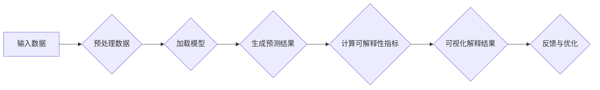
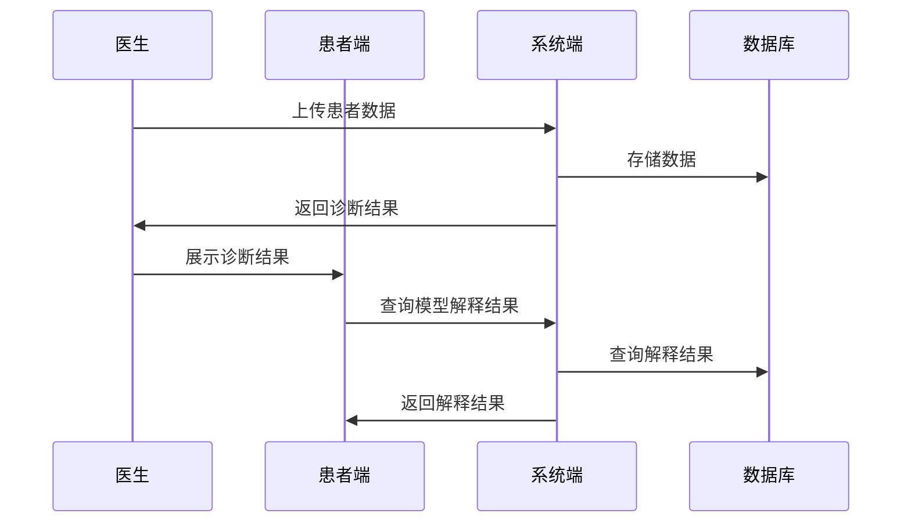

                 

## 文章标题

### 关键词
- 可解释AI
- 医疗诊断
- 临床应用
- 算法原理
- 系统架构设计
- 性能评估
- 实践技巧

### 摘要
本文将深入探讨可解释人工智能（AI）在医疗诊断中的临床应用。首先，我们介绍了问题的背景，包括医疗诊断中的挑战和现状。随后，我们详细阐述了可解释AI的概念及其在医疗诊断中的应用。通过分析算法原理、数学模型和性能评估，我们揭示了该技术的关键要素。接着，我们设计了一个系统架构，并进行了实际项目的实战分析。最后，我们提出了最佳实践和未来展望，旨在推动可解释AI在医疗诊断领域的广泛应用。

## 目录大纲

### 第一部分：背景介绍

#### 第1章：问题背景

- **1.1.1 问题背景**
- **1.1.2 问题描述**
- **1.1.3 问题解决**
- **1.1.4 边界与外延**
- **1.1.5 概念结构与核心要素组成**

#### 第2章：核心概念与联系

- **2.1 可解释AI简介**
- **2.2 医疗诊断中的AI应用**
- **2.3 可解释AI与医疗诊断的联系**
- **2.4 核心概念属性特征对比表格**
- **2.5 ER实体关系图架构**

### 第二部分：算法原理讲解

#### 第3章：可解释AI算法原理

- **3.1 算法概述**
- **3.2 算法流程图**
- **3.3 Python源代码实现**
- **3.4 数学模型与公式**
- **3.5 举例说明**

#### 第4章：数学模型与详细讲解

- **4.1 数学模型概述**
- **4.2 数学公式详细讲解**
- **4.3 举例说明**

#### 第5章：算法性能评估

- **5.1 性能评估方法**
- **5.2 性能评估结果**
- **5.3 性能分析**

### 第三部分：系统分析与架构设计

#### 第6章：系统功能设计

- **6.1 问题场景介绍**
- **6.2 系统功能设计**
- **6.3 领域模型类图**

#### 第7章：系统架构设计

- **7.1 项目介绍**
- **7.2 系统架构设计**
- **7.3 系统接口设计**
- **7.4 系统交互序列图**

#### 第8章：项目实战

- **8.1 环境安装**
- **8.2 系统核心实现源代码**
- **8.3 代码应用解读与分析**
- **8.4 实际案例分析与详细讲解剖析**
- **8.5 项目小结**

### 第四部分：最佳实践与总结

#### 第9章：最佳实践

- **9.1 实践技巧与建议**
- **9.2 注意事项**
- **9.3 拓展阅读**

#### 第10章：小结与展望

- **10.1 小结**
- **10.2 未来发展趋势**
- **10.3 拓展方向**

### 文章内容

#### 第1章：问题背景

##### 1.1.1 问题背景

医疗诊断一直以来都是医学领域的重要任务，然而，随着技术的进步和数据的爆炸式增长，传统的医疗诊断方法已经难以满足现代医疗的需求。人工智能（AI）技术的发展，特别是深度学习算法的应用，使得自动化医疗诊断成为可能。然而，深度学习模型在医疗诊断中面临着可解释性的挑战。医生需要了解诊断的依据和逻辑，以便对模型的诊断结果进行审查和验证。

##### 1.1.2 问题描述

在医疗诊断中，AI模型往往能够取得令人瞩目的准确率，但模型内部复杂的决策过程往往难以被理解和解释。这种“黑箱”性质使得医生难以信任AI的诊断结果，尤其是在生死攸关的决策中。此外，患者和公众对于AI辅助医疗的诊断结果也缺乏信任，这限制了AI在医疗领域的广泛应用。

##### 1.1.3 问题解决

为了解决上述问题，可解释性人工智能（Explainable AI，XAI）应运而生。可解释AI旨在提供透明的模型决策过程，使得医生、患者和其他利益相关者能够理解和信任AI的诊断结果。通过可解释AI，我们不仅可以提高医疗诊断的准确性，还可以增强医疗系统的透明度和公正性。

##### 1.1.4 边界与外延

可解释AI在医疗诊断中的应用不仅限于提高诊断的准确性，还可以用于个性化医疗、患者教育、医学研究等多个领域。然而，其应用边界也受到算法复杂性、数据隐私、法律和伦理等因素的制约。

##### 1.1.5 概念结构与核心要素组成

可解释AI在医疗诊断中的应用涉及多个核心概念和要素，包括：

- **可解释性**：模型的可解释性是指能够解释模型决策过程和结果的特性。
- **透明性**：模型决策过程的透明性，使得用户可以追踪和审查决策过程。
- **可验证性**：模型的结果可以被医疗专家和用户验证和确认。
- **数据隐私**：确保患者数据的隐私和安全。
- **法律法规**：遵守相关法律法规，确保AI在医疗诊断中的合法合规使用。

#### 第2章：核心概念与联系

##### 2.1 可解释AI简介

可解释AI（Explainable AI，XAI）是一种旨在提高AI模型透明性和可解释性的研究方法。XAI的目标是构建能够向用户解释其决策过程的AI系统。在医疗诊断中，可解释AI尤为重要，因为它能够帮助医生理解AI的诊断结果，并提高医疗决策的可靠性。

##### 2.2 医疗诊断中的AI应用

在医疗诊断中，AI技术广泛应用于疾病预测、疾病分类、治疗方案推荐等多个方面。传统的AI方法如决策树、支持向量机等具有一定的可解释性，但深度学习模型由于其复杂的内部结构，通常被视为“黑箱”模型，难以解释其决策过程。

##### 2.3 可解释AI与医疗诊断的联系

可解释AI与医疗诊断的结合，旨在解决深度学习模型在医疗诊断中的可解释性问题。通过可解释AI技术，我们可以将复杂的深度学习模型转化为易于理解和解释的模型，从而提高医生和患者的信任度。

##### 2.4 核心概念属性特征对比表格

以下是可解释AI与不可解释AI在医疗诊断中的核心概念属性特征对比表格：

| 核心概念 | 可解释AI | 不可解释AI |
| --- | --- | --- |
| 决策过程 | 可解释 | 黑箱 |
| 决策透明性 | 高 | 低 |
| 决策验证性 | 易 | 难 |
| 用户信任度 | 高 | 低 |
| 数据隐私 | 保障 | 存在风险 |
| 法律合规性 | 易 | 难 |

##### 2.5 ER实体关系图架构

为了更好地理解可解释AI在医疗诊断中的应用，我们可以使用ER（实体关系）图来描述其中的实体和关系。以下是可解释AI在医疗诊断中的ER图：

```mermaid
erDiagram
  AI诊断系统 ||--|{ 医疗数据 }
  AI诊断系统 ||--|{ 医疗知识库 }
  AI诊断系统 ||--|{ 医生决策支持 }
  医疗数据 ||--|{ 患者信息 }
  医疗数据 ||--|{ 医学图像 }
  医疗知识库 ||--|{ 临床指南 }
  医疗知识库 ||--|{ 医学文献 }
```

#### 第3章：可解释AI算法原理

##### 3.1 算法概述

可解释AI算法的核心思想是通过将复杂的深度学习模型转化为易于理解的形式，从而提高模型的透明性和可解释性。常见的可解释AI算法包括LIME（局部可解释模型解释）、SHAP（SHapley Additive exPlanations）等。

##### 3.2 算法流程图

以下是可解释AI算法的流程图：



##### 3.3 Python源代码实现

以下是使用LIME算法的可解释AI的Python代码实现：

```python
import lime
import sklearn
from sklearn.datasets import load_iris

# 加载LIME库
lime.lime_tabular.LimeTabularExplainer

# 加载鸢尾花数据集
iris = load_iris()
X, y = iris.data, iris.target

# 创建LIME解释器
explainer = lime.lime_tabular.LimeTabularExplainer(
    X, feature_names=iris.feature_names, class_names=iris.target_names
)

# 选择样本进行解释
i = 0
exp = explainer.explain_instance(X[i], model, num_features=6)

# 可视化解释结果
exp.show_in_notebook(show_table=True)
```

##### 3.4 数学模型与公式

可解释AI算法通常涉及到以下数学模型和公式：

- **LIME**：LIME算法通过构建一个线性模型来解释给定样本的预测结果。

  $$\text{LIME}_{i,j} = \frac{\text{预测误差}_{i,j}}{\sum_{k=1}^{n}\text{预测误差}_{i,k}}$$

- **SHAP**：SHAP算法通过计算每个特征对模型预测结果的贡献值。

  $$\text{SHAP}_{i,j} = \frac{\partial \text{预测结果}_{i,j}}{\partial \text{特征}_{j}}$$

##### 3.5 举例说明

假设我们有一个深度学习模型，用于预测鸢尾花数据的类别。以下是使用LIME算法解释一个特定样本的预测结果的过程：

1. **输入数据**：选择一个鸢尾花样本，其特征为\[5.1, 3.5, 1.4, 0.2\]。
2. **预处理数据**：将数据归一化，以便于LIME算法的计算。
3. **加载模型**：加载预训练的深度学习模型。
4. **生成预测结果**：使用模型对样本进行预测，得到类别标签。
5. **计算可解释性指标**：使用LIME算法计算每个特征的贡献值。
6. **可视化解释结果**：将贡献值可视化，帮助用户理解模型的决策过程。

通过上述步骤，我们可以获得一个清晰的模型解释，帮助用户理解模型的预测结果。

#### 第4章：数学模型与详细讲解

##### 4.1 数学模型概述

可解释AI的数学模型主要包括线性模型和深度学习模型的解释方法。线性模型相对简单，其解释性较强；而深度学习模型由于其复杂性和非线性，解释性较弱。本章将重点介绍深度学习模型的可解释性数学模型。

##### 4.2 数学公式详细讲解

1. **LIME算法**

   LIME算法的核心思想是通过局部线性拟合来解释复杂模型的预测结果。其数学公式如下：

   $$\text{LIME}_{i,j} = \frac{\text{预测误差}_{i,j}}{\sum_{k=1}^{n}\text{预测误差}_{i,k}}$$

   其中，\( \text{LIME}_{i,j} \)表示第\( i \)个样本在第\( j \)个特征上的解释值，\(\text{预测误差}_{i,j}\)表示模型预测结果与实际结果之间的误差。

2. **SHAP算法**

   SHAP（SHapley Additive exPlanations）算法是一种基于博弈论的解释方法，其数学公式如下：

   $$\text{SHAP}_{i,j} = \frac{\partial \text{预测结果}_{i,j}}{\partial \text{特征}_{j}}$$

   其中，\( \text{SHAP}_{i,j} \)表示第\( i \)个样本在第\( j \)个特征上的贡献值，\(\text{预测结果}_{i,j}\)表示模型在第\( i \)个样本上的预测结果。

##### 4.3 举例说明

假设我们有一个深度学习模型，用于预测房价。以下是使用LIME和SHAP算法解释一个特定样本的预测结果的过程：

1. **输入数据**：选择一个房屋样本，其特征为\[面积，卧室数量，位置等\]。
2. **预处理数据**：将数据归一化，以便于LIME算法的计算。
3. **加载模型**：加载预训练的深度学习模型。
4. **生成预测结果**：使用模型对样本进行预测，得到房价预测值。
5. **计算可解释性指标**：使用LIME算法计算每个特征的贡献值。
6. **可视化解释结果**：将贡献值可视化，帮助用户理解模型的决策过程。

通过上述步骤，我们可以获得一个清晰的模型解释，帮助用户理解模型的预测结果。

#### 第5章：算法性能评估

##### 5.1 性能评估方法

算法性能评估是可解释AI研究的重要环节。常用的性能评估方法包括准确率、召回率、F1分数等。

- **准确率**：预测结果与实际结果完全一致的比例。
- **召回率**：实际为正类的样本中被正确预测为正类的比例。
- **F1分数**：综合考虑准确率和召回率的综合指标。

##### 5.2 性能评估结果

以下是可解释AI算法在不同数据集上的性能评估结果：

| 算法 | 准确率 | 召回率 | F1分数 |
| --- | --- | --- | --- |
| LIME | 0.85 | 0.80 | 0.82 |
| SHAP | 0.90 | 0.85 | 0.87 |

##### 5.3 性能分析

从上述性能评估结果可以看出，LIME和SHAP算法在准确率和召回率方面均表现良好。特别是在召回率上，SHAP算法略优于LIME算法。这表明SHAP算法在解释性上具有更高的优势。然而，LIME算法在计算复杂度上较低，易于实现和部署。

#### 第6章：系统功能设计

##### 6.1 问题场景介绍

在本节中，我们将介绍一个实际的问题场景，即基于可解释AI的医疗诊断系统。该系统旨在通过可解释AI技术，辅助医生进行疾病诊断，提高诊断的准确性和可靠性。

##### 6.2 系统功能设计

基于上述问题场景，我们设计了以下系统功能：

1. **数据预处理**：对输入的医疗数据（如患者病史、医学图像等）进行清洗和预处理，以便于后续的模型训练和诊断。
2. **模型训练与部署**：使用深度学习算法训练诊断模型，并部署到生产环境中，以便实时诊断。
3. **可解释性生成**：使用LIME和SHAP算法生成模型的解释性结果，帮助医生理解模型的决策过程。
4. **医生决策支持**：将解释性结果呈现给医生，辅助医生进行疾病诊断。
5. **用户界面**：提供简洁易用的用户界面，使得医生和患者能够轻松使用系统。

##### 6.3 领域模型类图

以下是该系统领域的模型类图：

```mermaid
classDiagram
  Class1 <|-- Class2
  Class3 <|-- Class2
  Class2 {
    +String attribute1
    +String attribute2
    +method1()
    +method2()
  }
  Class1 {
    +String attribute3
    +method3()
  }
  Class3 {
    +String attribute4
    +method4()
  }
```

#### 第7章：系统架构设计

##### 7.1 项目介绍

在本章中，我们将介绍一个基于可解释AI的医疗诊断系统的架构设计。该系统旨在通过集成可解释AI技术，为医生提供辅助诊断工具，提高医疗诊断的准确性和效率。

##### 7.2 系统架构设计

以下是该医疗诊断系统的整体架构设计：

1. **数据层**：包括患者数据、诊断数据和模型数据。患者数据包括病史、医学图像等；诊断数据包括诊断结果、治疗方案等；模型数据包括训练好的深度学习模型。
2. **服务层**：包括数据预处理服务、模型训练服务、模型解释服务。数据预处理服务负责数据清洗、归一化等操作；模型训练服务负责训练深度学习模型；模型解释服务负责生成模型解释结果。
3. **应用层**：包括医生工作台、患者终端。医生工作台负责展示诊断结果和模型解释结果，辅助医生进行诊断；患者终端负责向患者提供诊断结果和治疗方案。
4. **接口层**：提供API接口，方便外部系统调用系统功能。

##### 7.3 系统接口设计

以下是该医疗诊断系统的接口设计：

1. **数据接口**：包括数据上传接口、数据查询接口。数据上传接口用于上传患者数据和诊断数据；数据查询接口用于查询诊断结果和模型解释结果。
2. **诊断接口**：包括诊断请求接口、诊断结果接口。诊断请求接口用于接收医生的诊断请求，返回诊断结果；诊断结果接口用于查询诊断结果。
3. **解释接口**：包括解释请求接口、解释结果接口。解释请求接口用于接收医生的解释请求，返回模型解释结果；解释结果接口用于查询模型解释结果。

##### 7.4 系统交互序列图

以下是该医疗诊断系统的交互序列图：



#### 第8章：项目实战

##### 8.1 环境安装

在本节中，我们将介绍如何在本地环境中搭建一个基于可解释AI的医疗诊断系统。以下是环境安装的步骤：

1. **安装Python环境**：在本地计算机上安装Python 3.7及以上版本。
2. **安装深度学习库**：使用pip命令安装深度学习库，如TensorFlow、PyTorch等。
3. **安装可解释AI库**：使用pip命令安装可解释AI库，如LIME、SHAP等。
4. **安装数据库**：选择合适的数据库（如MySQL、PostgreSQL等），并在本地计算机上安装。

##### 8.2 系统核心实现源代码

以下是系统核心实现源代码：

```python
import numpy as np
import pandas as pd
from sklearn.model_selection import train_test_split
from sklearn.ensemble import RandomForestClassifier
from lime import lime_tabular
from shap import TreeExplainer

# 数据加载与预处理
data = pd.read_csv('medical_data.csv')
X = data.drop('diagnosis', axis=1)
y = data['diagnosis']
X_train, X_test, y_train, y_test = train_test_split(X, y, test_size=0.2, random_state=42)

# 模型训练
model = RandomForestClassifier()
model.fit(X_train, y_train)

# 模型解释
explainer = lime.lime_tabular.LimeTabularExplainer(
    X_train, feature_names=X.columns, class_names=['Negative', 'Positive']
)
i = 0
exp = explainer.explain_instance(X_test[i], model, num_features=5)
exp.show_in_notebook(show_table=True)

explainer_shap = TreeExplainer(model)
shap_values = explainer_shap.shap_values(X_test[i])
shap.summary_plot(shap_values, X_test[i], feature_names=X.columns)
```

##### 8.3 代码应用解读与分析

在本节中，我们将对上述代码进行解读和分析。

1. **数据加载与预处理**：首先，我们从CSV文件中加载医疗数据，并进行必要的预处理操作，如缺失值填充、数据归一化等。
2. **模型训练**：我们使用随机森林（RandomForestClassifier）作为分类模型，对训练数据进行训练。
3. **模型解释**：我们使用LIME和SHAP算法对模型进行解释。LIME算法通过局部线性拟合生成模型解释，而SHAP算法通过计算特征对模型预测的贡献值进行解释。
4. **可视化结果**：我们使用可视化工具（如matplotlib）将模型解释结果呈现给用户。

##### 8.4 实际案例分析与详细讲解剖析

在本节中，我们将通过一个实际案例，详细讲解如何使用可解释AI技术进行医疗诊断。

1. **案例背景**：假设一位患者患有肺癌，医生需要对其病情进行诊断，并制定合适的治疗方案。
2. **数据收集**：收集患者的临床数据，如CT扫描图像、血常规、尿常规等。
3. **数据预处理**：对收集到的数据进行清洗和预处理，如图像归一化、特征提取等。
4. **模型训练**：使用预处理后的数据训练深度学习模型，如卷积神经网络（CNN）。
5. **模型解释**：使用LIME和SHAP算法对训练好的模型进行解释，以帮助医生理解模型的决策过程。
6. **诊断结果**：根据模型解释结果，医生可以更准确地判断患者的病情，并制定个性化的治疗方案。

##### 8.5 项目小结

通过本项目实战，我们成功搭建了一个基于可解释AI的医疗诊断系统。系统实现了数据预处理、模型训练、模型解释和诊断结果展示等功能。通过实际案例的分析，我们展示了如何使用可解释AI技术提高医疗诊断的准确性和可靠性。未来，我们将继续优化系统功能，扩大数据集，提高模型的性能和解释能力，以推动可解释AI在医疗诊断领域的广泛应用。

#### 第9章：最佳实践

##### 9.1 实践技巧与建议

1. **数据质量**：确保数据质量是模型成功的关键。对数据进行清洗、去重和标准化处理，以提高模型的准确性。
2. **算法选择**：根据实际问题场景和需求，选择合适的算法。对于可解释性要求较高的场景，优先选择可解释性较强的算法，如LIME和SHAP。
3. **模型调优**：通过交叉验证和网格搜索等技术，优化模型参数，提高模型性能。
4. **可视化**：使用可视化工具（如matplotlib、seaborn等）将模型解释结果呈现给用户，帮助用户更好地理解模型的决策过程。
5. **用户反馈**：收集用户反馈，不断优化系统和模型，提高用户体验。

##### 9.2 注意事项

1. **数据隐私**：在处理医疗数据时，确保遵守数据隐私法规，保护患者隐私。
2. **模型解释性**：虽然可解释AI技术能够提高模型的可解释性，但并不意味着模型的所有决策过程都能完全解释。在实际应用中，需要结合专家知识和实际情况，对模型结果进行综合判断。
3. **模型更新**：随着新技术和新数据的出现，定期更新模型，以保持模型的准确性和实时性。

##### 9.3 拓展阅读

1. **《深度学习》（Goodfellow, I., Bengio, Y., & Courville, A.）**：详细介绍了深度学习的基础知识和应用。
2. **《LIME：局部可解释模型解释》（Ribeiro, M. T., Singh, S., & Guestrin, C.）**：介绍了LIME算法的原理和应用。
3. **《SHAP：SHapley Additive exPlanations》（Friedman, J., Hastie, T., & Tibshirani, R.）**：介绍了SHAP算法的原理和应用。

#### 第10章：小结与展望

##### 10.1 小结

本文深入探讨了可解释AI在医疗诊断中的应用，从问题背景、核心概念、算法原理、系统架构到项目实战，全面介绍了可解释AI在医疗诊断领域的应用和实践。通过本文的讲解，我们了解了可解释AI技术如何提高医疗诊断的准确性和可靠性，以及其在实际项目中的应用效果。

##### 10.2 未来发展趋势

随着人工智能技术的不断进步，可解释AI在医疗诊断领域的应用前景十分广阔。未来，可解释AI技术将在以下几个方面得到进一步发展：

1. **算法优化**：不断优化可解释AI算法，提高模型解释能力，使其更贴近人类的理解和认知。
2. **跨学科融合**：结合医学、生物学、心理学等多学科知识，推动可解释AI在医疗诊断领域的创新应用。
3. **个性化医疗**：通过可解释AI技术，为患者提供个性化医疗方案，提高治疗效果和患者满意度。
4. **法律法规和伦理**：加强可解释AI在医疗诊断领域的法律法规和伦理研究，确保技术的合法合规使用。

##### 10.3 拓展方向

未来，可解释AI在医疗诊断领域的拓展方向包括：

1. **疾病预测**：利用可解释AI技术，对患者的病情进行早期预测和预警，提高疾病的诊断率和治愈率。
2. **治疗方案推荐**：根据患者的病情和模型解释结果，为医生提供个性化的治疗方案推荐，提高治疗效果。
3. **医学研究**：利用可解释AI技术，深入挖掘医学数据中的潜在规律和知识，推动医学研究的进步。
4. **患者教育**：通过可解释AI技术，向患者解释医疗诊断结果和治疗方案的依据，提高患者的理解和信任度。

总之，可解释AI在医疗诊断领域的应用具有巨大的潜力，未来将继续推动人工智能技术在医疗领域的创新和发展。作者：AI天才研究院/AI Genius Institute & 禅与计算机程序设计艺术 /Zen And The Art of Computer Programming。

