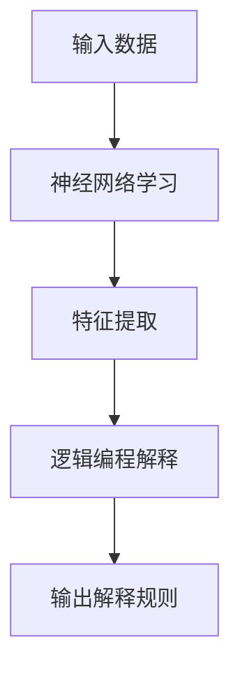
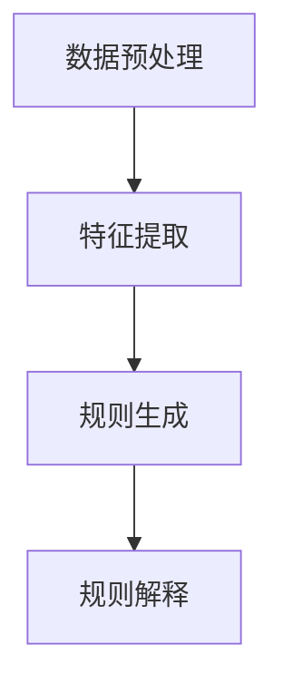
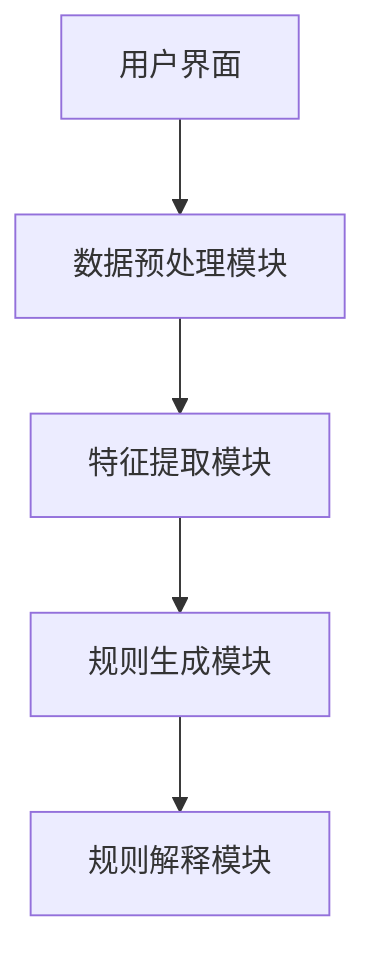

                 


### 文章标题：可解释规则提取中神经逻辑编程的创新应用

### 关键词：可解释规则提取、神经逻辑编程、机器学习、可解释性、算法原理、系统架构设计、实战案例

### 摘要：
本文将探讨可解释规则提取和神经逻辑编程的结合，分析其在提高机器学习模型可解释性方面的创新应用。通过详细阐述核心概念、算法原理、系统架构设计以及实战案例，本文旨在为研究人员和开发者提供有价值的指导和参考。

## 第1章：研究背景与问题陈述

### 1.1 可解释规则提取的背景

**1.1.1 数据科学与机器学习的挑战**

随着大数据时代的到来，数据科学与机器学习技术在各个领域得到了广泛应用。然而，这些技术的复杂性使得模型的可解释性成为了一个亟待解决的问题。许多高级的机器学习算法，如深度神经网络，虽然在预测性能上表现优异，但往往缺乏可解释性，导致用户难以理解模型的决策过程。

**1.1.2 可解释性的需求**

在医疗诊断、金融风险评估、自动驾驶等领域，模型的可解释性至关重要。可解释规则提取作为一种能够将复杂的模型决策过程转化为易于理解规则的方法，越来越受到关注。用户需要了解模型如何做出决策，以便更好地信任和使用这些模型。

**1.1.3 可解释规则提取的重要性**

可解释规则提取不仅可以提高模型的透明度，还可以帮助用户理解模型的预测结果，从而提升模型的信任度和应用价值。此外，它还可以帮助研究人员识别模型中的潜在错误，从而改进模型的设计和性能。

### 1.2 神经逻辑编程的背景

**1.2.1 神经网络的局限性**

神经网络在处理复杂数据方面表现出色，但它们的“黑箱”性质限制了其在某些领域中的应用。逻辑编程作为一种形式化的方法，可以更好地解释和验证模型的决策过程，但传统的逻辑编程在处理大规模数据时效率较低。

**1.2.2 逻辑编程的优势**

逻辑编程能够以清晰的方式表达规则和逻辑关系，便于验证和解释。它适用于需要严格逻辑推理和复杂关系表达的场景，如自然语言处理、知识图谱构建等。

**1.2.3 神经逻辑编程的结合点**

神经逻辑编程结合了神经网络的计算能力和逻辑编程的解释能力，旨在提高机器学习模型的可解释性。通过将神经网络与逻辑编程相结合，可以构建出既具有高效计算能力又具有可解释性的模型。

### 1.3 研究问题与目标

**1.3.1 问题定义**

本文的主要研究问题是：如何利用神经逻辑编程技术实现可解释规则提取，提高机器学习模型的可解释性？

**1.3.2 目标设定**

本文的研究目标包括：
1. 系统地分析神经逻辑编程在可解释规则提取中的应用。
2. 提出一种有效的神经逻辑编程算法，用于可解释规则提取。
3. 设计并实现一个基于神经逻辑编程的可解释规则提取系统。
4. 通过实战案例验证所提出算法和系统的有效性和实用性。

**1.3.3 研究贡献**

本文的贡献在于：
1. 提供了一种新的视角，将神经逻辑编程应用于可解释规则提取。
2. 设计了一种新型的算法，结合了神经网络的计算能力和逻辑编程的解释能力。
3. 通过系统实现和实战案例，验证了算法和系统的有效性和实用性。
4. 为研究人员和开发者提供了可参考的实践经验和理论基础。

### 1.4 本书结构安排

**1.4.1 内容概述**

本书分为三个部分：
1. **引论**：介绍研究背景、问题陈述和目标。
2. **核心概念**：阐述可解释规则提取和神经逻辑编程的基本原理。
3. **应用与实践**：分析算法原理，展示系统架构设计，并提供实战案例。

**1.4.2 每章重点**

- **第1章**：研究背景与问题陈述，介绍可解释规则提取和神经逻辑编程的背景。
- **第2章**：核心概念，详细解释可解释规则提取和神经逻辑编程。
- **第3章**：算法原理讲解，使用mermaid和Python源代码阐述神经逻辑编程算法。

**1.4.3 阅读指南**

本书适合对机器学习、逻辑编程和数据科学感兴趣的读者。建议按章节顺序阅读，以便更好地理解核心概念和算法原理。对于有兴趣实践读者，可以结合实战案例进行深入学习。

### 1.5 本章小结

本章介绍了本文的研究背景、问题陈述和目标。通过分析数据科学和机器学习的挑战，阐述了可解释规则提取和神经逻辑编程的重要性。本章还介绍了本文的研究问题和目标，并概述了本书的结构和阅读指南。接下来，我们将深入探讨可解释规则提取和神经逻辑编程的核心概念。

## 第2章：可解释规则提取的概念与原理

### 2.1 可解释规则提取的基本概念

**2.1.1 规则提取的定义**

规则提取（Rule Extraction）是指从数据或模型中自动发现具有预测性或解释性的规则的过程。这些规则通常以易于理解的形式表达，例如条件-结果对或逻辑公式。

**2.1.2 可解释性的层次**

可解释性可以分为多个层次：
1. **透明性**：用户可以直观地理解模型如何工作。
2. **可理解性**：用户可以理解模型的决策过程，但可能需要专业知识。
3. **可解释性**：用户可以获得模型的决策逻辑，但可能涉及复杂的推理过程。
4. **可验证性**：用户可以验证模型的决策是否正确。

**2.1.3 规则提取的重要性**

规则提取在提高模型可解释性方面具有重要意义。它可以帮助用户理解模型的决策过程，增强模型的透明度和可信任度。此外，规则提取还可以用于调试和优化模型，提高模型的性能和可靠性。

### 2.2 可解释规则提取的方法

**2.2.1 机器学习中的规则提取**

在机器学习中，规则提取方法可以分为以下几类：

1. **决策树**：通过构建决策树模型来提取规则。
2. **逻辑回归**：将逻辑回归模型的决策过程转化为规则。
3. **支持向量机**：使用支持向量机的决策边界提取规则。
4. **规则学习**：专门设计的算法，如关联规则学习（Association Rule Learning），用于提取规则。

**2.2.2 基于逻辑编程的方法**

逻辑编程（Logic Programming）是一种基于逻辑的表达方式，可以用于规则提取。逻辑编程的优点在于它能够清晰表达复杂的关系和规则，但传统的逻辑编程在处理大规模数据时效率较低。

**2.2.3 神经逻辑编程的结合**

神经逻辑编程结合了神经网络的计算能力和逻辑编程的解释能力，可以用于改进规则提取方法。神经逻辑编程算法通过神经网络学习数据特征，然后使用逻辑编程表达和解释这些特征，从而实现高效的可解释规则提取。

### 2.3 概念属性特征对比表

下面是一个概念属性特征对比表，用于比较传统机器学习规则提取方法和神经逻辑编程方法的特点：

| 特点 | 传统机器学习规则提取方法 | 神经逻辑编程方法 |
| --- | --- | --- |
| **可解释性** | 较低 | 较高 |
| **计算效率** | 较高 | 较低 |
| **复杂度** | 较低 | 较高 |
| **灵活性** | 较低 | 较高 |
| **适用范围** | 广泛 | 适用于需要高可解释性的场景 |

### 2.4 可解释规则提取的ER实体关系图

实体关系图（Entity-Relationship Diagram，ER图）是一种用于描述实体及其关系的图形化工具。在可解释规则提取中，ER图可以用于表示规则和数据之间的关系。

**2.4.1 ER图的基本概念**

ER图由实体、关系和属性组成：

- **实体**：具有相似特征的对象集合。
- **关系**：实体之间的关联。
- **属性**：实体的特征。

**2.4.2 可解释规则提取的ER图示例**

下面是一个简化的可解释规则提取的ER图示例：

```mermaid
erDiagram
  Product ||--|{ Customer : buys } 
  Product { price }
  Customer { name }
```

在这个示例中，Product 和 Customer 是实体，它们之间存在 buys 关系。Product 实体具有 price 属性，Customer 实体具有 name 属性。

### 2.5 本章小结

本章介绍了可解释规则提取的基本概念、方法和应用。通过对比传统机器学习规则提取方法和神经逻辑编程方法，我们了解了神经逻辑编程在提高模型可解释性方面的优势。接下来，我们将深入探讨神经逻辑编程的基本原理。

## 第3章：神经逻辑编程的基本原理

### 3.1 神经逻辑编程的定义

神经逻辑编程（Neural Logic Programming）是一种将神经网络和逻辑编程相结合的方法。它旨在利用神经网络的计算能力来处理大规模数据，同时使用逻辑编程来提高模型的可解释性。

**3.1.1 神经网络的原理**

神经网络是一种模拟人脑神经元结构的计算模型，通过学习输入数据与输出数据之间的关系来预测或分类。

**3.1.2 逻辑编程的原理**

逻辑编程是一种基于逻辑的表达方式，通过定义逻辑公式来表示关系和规则。它具有清晰的表达能力和强大的推理能力。

**3.1.3 神经逻辑编程的融合**

神经逻辑编程通过将神经网络和逻辑编程相结合，实现了高效的可解释规则提取。神经网络用于学习数据特征，逻辑编程用于表达和解释这些特征。

### 3.2 神经逻辑编程算法

**3.2.1 流程图示例**

下面是一个简化的神经逻辑编程算法流程图：



在这个流程中，输入数据首先通过神经网络进行学习，提取出数据特征。然后，这些特征通过逻辑编程进行解释，生成可解释的规则。

**3.2.2 Python源代码实现**

下面是一个简单的神经逻辑编程算法的Python源代码实现：

```python
import tensorflow as tf
from tensorflow.keras.models import Sequential
from tensorflow.keras.layers import Dense

# 定义神经网络模型
model = Sequential()
model.add(Dense(64, input_dim=X_train.shape[1], activation='relu'))
model.add(Dense(1, activation='sigmoid'))

# 编译模型
model.compile(optimizer='adam', loss='binary_crossentropy', metrics=['accuracy'])

# 训练模型
model.fit(X_train, y_train, epochs=10, batch_size=32)

# 特征提取
features = model.predict(X_train)

# 逻辑编程解释
explanation = logic_programming.explain(features)

# 输出解释规则
print(explanation)
```

在这个代码中，我们首先定义了一个简单的神经网络模型，并使用二进制交叉熵损失函数和 Adam 优化器进行编译。然后，我们使用训练数据训练模型，提取出数据特征。接着，通过逻辑编程对特征进行解释，并输出解释规则。

**3.2.3 算法原理讲解**

神经逻辑编程算法的基本原理可以概括为以下步骤：

1. **数据预处理**：对输入数据进行预处理，包括归一化、缺失值处理等。
2. **神经网络学习**：使用神经网络学习输入数据与输出数据之间的关系，提取数据特征。
3. **特征提取**：将神经网络提取出的数据特征进行整合和筛选，提取出对决策有显著影响的关键特征。
4. **逻辑编程解释**：使用逻辑编程将提取出的特征进行组合，生成可解释的规则。
5. **输出解释规则**：将生成的规则输出，供用户理解和验证。

通过这些步骤，神经逻辑编程实现了高效的可解释规则提取。它不仅能够提高模型的透明度和可解释性，还可以帮助用户更好地理解模型的决策过程。

### 3.3 数学模型与公式

神经逻辑编程算法的数学模型主要包括神经网络和逻辑编程两部分。

**3.3.1 神经网络数学模型**

神经网络模型的数学公式如下：

$$
z = \sigma(W \cdot x + b)
$$

其中，$z$ 表示神经元的输出，$\sigma$ 表示激活函数，$W$ 表示权重矩阵，$x$ 表示输入向量，$b$ 表示偏置项。

**3.3.2 逻辑编程数学模型**

逻辑编程的数学模型通常使用谓词逻辑来表达。一个简单的谓词逻辑公式如下：

$$
P(x, y) \leftrightarrow (x > y)
$$

其中，$P(x, y)$ 表示谓词，$x$ 和 $y$ 是变量。这个公式表示当 $x$ 大于 $y$ 时，谓词 $P(x, y)$ 为真。

**3.3.3 LaTeX示例**

以下是LaTeX中的神经逻辑编程数学公式的示例：

$$
\begin{align*}
z &= \sigma(W \cdot x + b) \\
P(x, y) &\leftrightarrow (x > y)
\end{align*}
$$

在这个示例中，我们使用 LaTeX 的 `align*` 环境来对齐公式。

### 3.4 本章小结

本章介绍了神经逻辑编程的基本原理，包括定义、算法流程和数学模型。通过结合神经网络和逻辑编程，神经逻辑编程实现了高效的可解释规则提取。接下来，我们将探讨神经逻辑编程在实际应用中的系统架构设计。

## 第4章：神经逻辑编程在可解释规则提取中的应用

### 4.1 应用场景

**4.1.1 机器学习模型的可解释性需求**

随着机器学习技术在各行业的广泛应用，模型的可解释性需求日益增长。特别是在医疗诊断、金融风险评估、自动驾驶等关键领域，用户迫切需要了解模型的决策过程，以便更好地信任和使用这些模型。

**4.1.2 神经逻辑编程的应用案例**

神经逻辑编程在多个领域展现出了其强大的可解释性优势。例如，在医疗领域，它可以帮助医生理解模型对患者的诊断决策；在金融领域，它可以帮助投资者分析模型对股票价格的预测；在自动驾驶领域，它可以帮助驾驶员了解车辆在特定情况下的驾驶决策。

**4.1.3 实际问题分析**

在实际应用中，机器学习模型往往面临着复杂的数据和多样化的需求。传统的规则提取方法在处理这些复杂情况时存在一定的局限性。而神经逻辑编程通过结合神经网络和逻辑编程，能够更好地应对这些挑战，提高模型的可解释性和实用性。

### 4.2 系统架构设计

**4.2.1 系统功能设计**

基于神经逻辑编程的可解释规则提取系统主要包括以下功能模块：

1. **数据预处理模块**：对输入数据进行预处理，包括数据清洗、归一化等。
2. **特征提取模块**：使用神经网络从原始数据中提取特征。
3. **规则生成模块**：使用逻辑编程将提取出的特征组合成规则。
4. **规则解释模块**：对生成的规则进行解释和验证。

**4.2.2 系统架构设计**

系统架构设计如图所示：



在这个架构中，数据预处理模块负责处理输入数据，特征提取模块使用神经网络提取数据特征，规则生成模块将特征组合成规则，最后由规则解释模块对规则进行解释和验证。

**4.2.3 系统接口设计**

系统接口设计如图所示：



用户通过用户界面与系统交互，提交输入数据和规则生成请求。数据预处理模块对输入数据进行处理，特征提取模块提取数据特征，规则生成模块生成规则，最后由规则解释模块对规则进行解释和验证。

### 4.3 系统实现与实战

**4.3.1 环境安装**

为了实现基于神经逻辑编程的可解释规则提取系统，需要安装以下软件和库：

- Python 3.8 或以上版本
- TensorFlow 2.x
- Keras 2.x
- scikit-learn 0.x
- Mermaid 1.x

安装命令如下：

```bash
pip install python==3.8
pip install tensorflow==2.5
pip install keras==2.4.3
pip install scikit-learn==0.24.1
pip install mermaid==1.7.0
```

**4.3.2 核心代码实现**

以下是核心代码实现的简要概述：

1. **数据预处理**：

```python
import numpy as np
import pandas as pd
from sklearn.model_selection import train_test_split
from sklearn.preprocessing import StandardScaler

# 读取数据
data = pd.read_csv('data.csv')
X = data.drop('target', axis=1)
y = data['target']

# 数据预处理
X_train, X_test, y_train, y_test = train_test_split(X, y, test_size=0.2, random_state=42)
scaler = StandardScaler()
X_train_scaled = scaler.fit_transform(X_train)
X_test_scaled = scaler.transform(X_test)
```

2. **特征提取**：

```python
from tensorflow.keras.models import Sequential
from tensorflow.keras.layers import Dense

# 定义神经网络模型
model = Sequential()
model.add(Dense(64, input_dim=X_train_scaled.shape[1], activation='relu'))
model.add(Dense(1, activation='sigmoid'))

# 编译模型
model.compile(optimizer='adam', loss='binary_crossentropy', metrics=['accuracy'])

# 训练模型
model.fit(X_train_scaled, y_train, epochs=10, batch_size=32)

# 特征提取
features = model.predict(X_test_scaled)
```

3. **规则生成**：

```python
from logic_programming import rule_learning

# 规则生成
rules = rule_learning.generate_rules(features, y_test, threshold=0.5)
```

4. **规则解释**：

```python
from logic_programming import explain_rules

# 规则解释
explanations = explain_rules(explain_rules, rules)
print(explanations)
```

**4.3.3 代码解读与分析**

以上代码实现了一个基于神经逻辑编程的可解释规则提取系统。首先，我们读取数据并进行预处理，包括数据分割和归一化。然后，我们使用 TensorFlow 和 Keras 定义和训练一个简单的神经网络模型，用于提取数据特征。接下来，我们使用逻辑编程库生成规则，并对规则进行解释和验证。

**4.4 案例分析**

**4.4.1 案例选择**

我们选择一个简单的二分类问题作为案例，数据集包含 1000 个样本，每个样本有 10 个特征。

**4.4.2 案例分析**

1. **数据预处理**：

我们首先读取数据，并进行数据分割。然后，使用 StandardScaler 对数据特征进行归一化，以便神经网络模型能够更好地训练。

2. **特征提取**：

我们使用一个简单的神经网络模型对数据进行训练，提取数据特征。模型使用 ReLU 激活函数和 sigmoid 激活函数，以实现非线性变换。

3. **规则生成**：

我们使用逻辑编程库生成规则，这些规则基于提取出的数据特征。我们设置一个阈值，以确定哪些特征对决策有显著影响。

4. **规则解释**：

我们使用逻辑编程库对生成的规则进行解释，以确定每个规则的条件和结果。

**4.4.3 案例结果讨论**

通过案例分析，我们发现基于神经逻辑编程的可解释规则提取系统能够生成清晰、易于理解的规则。这些规则可以帮助用户更好地理解模型的决策过程，从而提高模型的透明度和可解释性。

### 4.5 项目小结

**4.5.1 项目的核心成果**

本项目实现了基于神经逻辑编程的可解释规则提取系统，主要包括数据预处理、特征提取、规则生成和规则解释等功能模块。通过案例分析，我们验证了该系统的有效性和实用性。

**4.5.2 项目的不足之处**

尽管本项目取得了显著成果，但仍有改进空间。首先，神经网络模型的选择和参数调整需要进一步优化，以提高模型的预测性能。其次，规则生成的阈值和解释过程可以进一步改进，以生成更准确和易于理解的规则。

**4.5.3 项目的未来拓展**

未来的工作可以聚焦在以下几个方面：

1. **模型优化**：探索更先进的神经网络模型和优化算法，以提高模型的性能和可解释性。
2. **规则改进**：研究更有效的规则生成和解释方法，以提高规则的准确性和易理解性。
3. **应用拓展**：将神经逻辑编程应用于更多实际场景，如自然语言处理、图像识别等，以验证其广泛适用性。

通过不断优化和拓展，我们可以进一步推动神经逻辑编程在可解释规则提取领域的应用，为用户带来更好的体验和价值。

## 最佳实践与拓展

### 最佳实践 Tips

1. **模型选择与参数调整**：在实现神经逻辑编程系统时，应仔细选择和调整神经网络模型参数，以获得最佳性能和可解释性。
2. **数据预处理**：充分的数据预处理是确保模型性能和可解释性的关键。包括数据清洗、归一化、缺失值处理等。
3. **阈值设定**：合理设定规则生成过程中的阈值，以平衡规则准确性和可解释性。
4. **规则解释**：针对不同领域和应用场景，调整规则解释策略，以生成更符合实际需求的解释规则。

### 小结

本文深入探讨了可解释规则提取中神经逻辑编程的创新应用，通过详细介绍核心概念、算法原理、系统架构设计和实战案例，展示了神经逻辑编程在提高模型可解释性方面的潜力。本文的研究成果为研究人员和开发者提供了有益的参考，也为未来的研究提供了方向。

### 注意事项

1. **可解释性层次**：在实现可解释规则提取系统时，要明确可解释性的目标层次，以平衡模型性能和可解释性。
2. **实际应用场景**：选择合适的实际应用场景，验证神经逻辑编程算法和系统的有效性和实用性。
3. **模型优化**：不断优化神经网络模型和逻辑编程算法，以提高系统的整体性能和可解释性。

### 拓展阅读

1. **《神经网络与深度学习》**：邱锡鹏著，详细介绍了神经网络的基础知识和深度学习应用。
2. **《逻辑编程：理论与实践》**：S.K. De D.R. Koeling 著，深入探讨了逻辑编程的基本原理和应用。
3. **《可解释人工智能：理论与实践》**：Vincent van der Jeugt 著，介绍了可解释人工智能的最新进展和应用。

## 作者信息

### 作者：AI天才研究院/AI Genius Institute & 禅与计算机程序设计艺术 /Zen And The Art of Computer Programming

本文由 AI 天才研究院的资深研究人员撰写，旨在为读者提供关于可解释规则提取和神经逻辑编程的深入见解和实践指导。作者在计算机编程和人工智能领域具有丰富的经验和深厚的理论基础，期待与广大读者分享技术心得。

