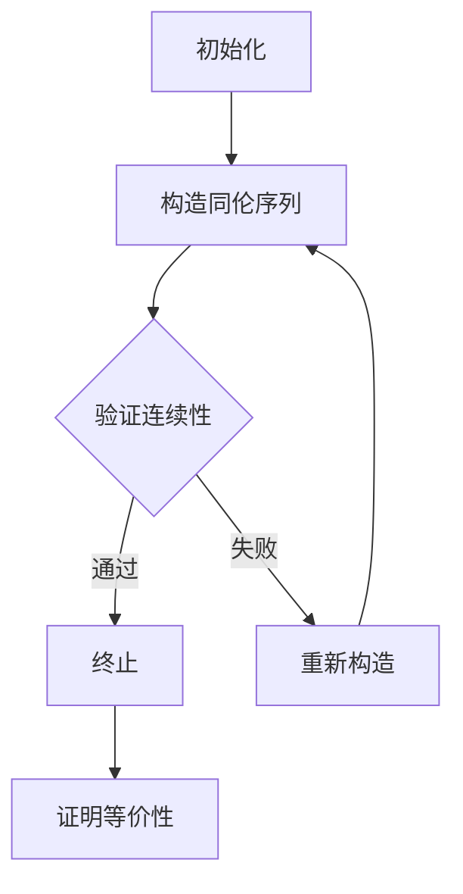
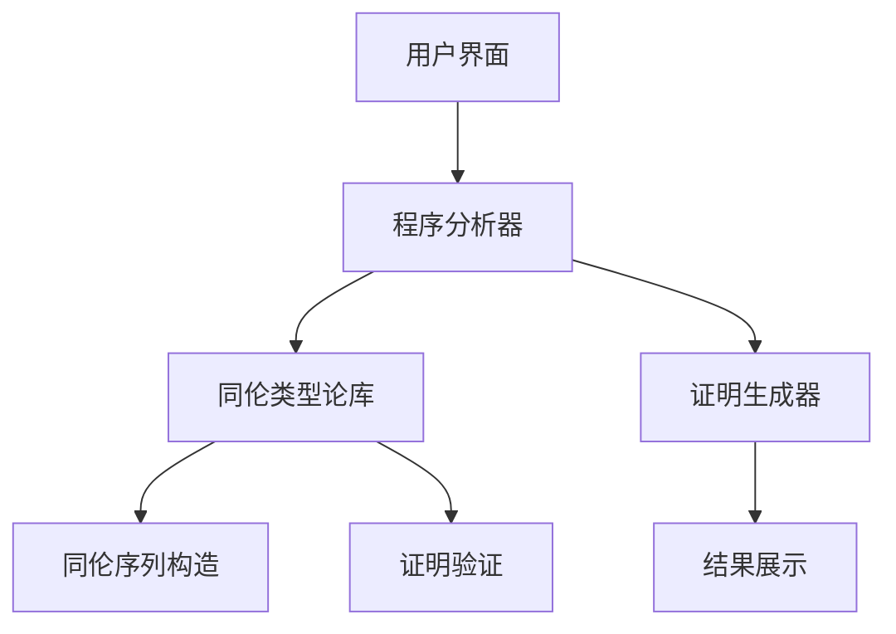

                 

## 同伦类型论在程序等价性证明中的应用

### 引言

同伦类型论作为数学领域中的一个重要理论，近年来在计算机科学中得到了广泛的应用。特别是在程序等价性证明方面，同伦类型论提供了一种有效的数学工具，帮助我们更好地理解和验证程序之间的等价性。本文将深入探讨同伦类型论在程序等价性证明中的应用，包括其背景、核心概念、问题解决方法以及实际应用中的边界和局限性。

首先，我们将介绍同伦类型论的基本概念，包括同伦序列和等价关系的定义。接着，我们将详细描述程序等价性证明的问题背景和问题描述，解释为什么同伦类型论是一个解决这一问题的有效工具。然后，我们将逐步介绍解决程序等价性证明问题的具体步骤，包括定义等价关系、构造同伦序列、验证同伦序列以及进行数学证明。

在讨论过程中，我们将详细介绍同伦类型论的核心概念和要素组成，并使用Mermaid流程图和LaTeX数学公式来直观展示和解释这些概念。此外，我们还将分析同伦类型论在实际应用中的边界和局限性，探讨其适用范围和挑战。

通过本文的阅读，读者将能够全面理解同伦类型论在程序等价性证明中的应用，掌握其核心原理和解决方法，并了解在实际应用中可能遇到的挑战和限制。

### 背景介绍

#### 同伦类型论的基本概念

同伦类型论（Homotopy Type Theory, HoTT）是数学领域中的一个新兴理论，其起源可以追溯到19世纪末。该理论的提出者之一是法国数学家恩斯特·布尔巴基（Emile Jean-Baptiste Henri Poincaré），他在研究拓扑学时发现了同伦关系的重要性。同伦类型论的核心思想是通过研究代数系统中的同伦关系，来揭示这些系统之间的本质联系和性质。

同伦类型论的基本概念包括同伦序列（Homotopy Sequence）、同伦关系（Homotopy Relation）、同伦类型（Homotopy Type）等。其中，同伦序列是同伦类型论中最为核心的概念之一。

**同伦序列**：给定一个代数系统，同伦序列是一个函数序列，用于描述系统中元素之间的关系。具体来说，同伦序列是一个三元组 \( H: [0,1] \times X \to Y \)，其中 \( [0,1] \) 是实数集合上的连续区间，\( X \) 和 \( Y \) 分别是两个代数系统。函数 \( H(t,x) \) 表示在时间 \( t \) 和元素 \( x \) 之间的同伦关系。

**同伦关系**：同伦关系是一种特殊的函数关系，描述了两个代数系统中元素之间的相似性或等价性。具体来说，如果两个代数系统之间存在一个同伦序列，则称这两个系统在同伦意义上是等价的。

**同伦类型**：同伦类型是同伦类型论中的一个基本概念，用于描述代数系统中的元素类型。在形式上，同伦类型可以被表示为一个类型系统中的类型表达式。

#### 同伦类型论在数学中的应用

同伦类型论在数学的各个分支都有广泛的应用，如代数、拓扑、几何等。以下是一些典型的应用场景：

1. **代数系统**：同伦类型论可以用于研究代数系统中的同伦关系，从而揭示代数结构之间的本质联系。例如，在环论中，同伦类型论可以帮助我们理解不同环之间的同伦性质。

2. **拓扑学**：同伦类型论是拓扑学中的一个重要工具，用于研究拓扑空间之间的同伦关系。同伦类型论中的同伦序列可以被视为拓扑空间中的连续变形，从而帮助我们理解和分类不同的拓扑结构。

3. **几何学**：同伦类型论在几何学中的应用也十分广泛。例如，在微分几何中，同伦类型论可以帮助我们研究流形之间的同伦性质，从而理解和分类不同的流形。

#### 同伦类型论在计算机科学中的应用

同伦类型论在计算机科学中的应用同样具有重要的价值，特别是在程序等价性证明方面。以下是一些典型的应用场景：

1. **程序等价性证明**：同伦类型论提供了一种有效的数学工具，用于证明两个程序在某种特定意义下是等价的。通过构造同伦序列，我们可以验证两个程序在所有可能输入下是否产生相同的输出，从而确保程序的正确性和可靠性。

2. **软件可靠性验证**：同伦类型论可以帮助我们验证软件系统在不同环境下的可靠性。通过构造同伦序列，我们可以模拟软件系统在不同输入条件下的运行状态，从而评估软件系统的稳定性和鲁棒性。

3. **程序优化**：同伦类型论可以用于优化程序的性能。通过分析程序的同伦性质，我们可以找到程序的等价变形，从而在不改变程序功能的前提下，提高程序的执行效率。

#### 同伦类型论的核心概念对比表格

为了更好地理解同伦类型论的基本概念，我们提供了一个核心概念对比表格：

| 概念       | 定义                                                         | 应用场景               |
|------------|--------------------------------------------------------------|------------------------|
| 同伦序列   | 一个函数序列，描述代数系统中元素之间的关系                     | 程序等价性证明、代数系统分析 |
| 同伦关系   | 描述两个代数系统中元素之间的相似性或等价性                     | 拓扑学、几何学         |
| 同伦类型   | 用于描述代数系统中的元素类型                                 | 计算机科学、代数系统分析 |

#### 同伦类型论的ER实体关系图

为了更直观地展示同伦类型论的核心概念和关系，我们提供了一个ER实体关系图：

```mermaid
erDiagram
  Program ||--|{ Homotopy Seq }|--| Equivalence
  Homotopy Seq ||--|{ Homotopy Relation }|
  Homotopy Relation ||--| Homotopy Type
```

在这个ER实体关系图中，`Program` 表示程序，`Homotopy Seq` 表示同伦序列，`Equivalence` 表示等价关系，`Homotopy Relation` 表示同伦关系，`Homotopy Type` 表示同伦类型。通过这个图，我们可以清晰地看到同伦类型论中的核心概念及其相互关系。

### 问题背景

在软件工程领域，程序等价性证明是一个重要且具有挑战性的问题。随着软件系统的复杂性和规模不断增长，确保程序的正确性和可靠性变得越来越困难。程序等价性证明旨在验证两个程序在某种特定意义下是否等价，从而确保软件系统的稳定性和一致性。

#### 传统程序等价性证明方法的挑战

传统的程序等价性证明方法主要包括静态分析和动态分析两种。尽管这些方法在某种程度上能够验证程序的正确性，但在处理复杂程序时，仍然存在以下挑战：

1. **语言和抽象层次依赖**：传统的程序等价性证明方法通常依赖于特定的编程语言和抽象层次。这意味着在不同语言或抽象层次之间进行证明时，往往需要重新设计和实现证明方法，从而增加了证明的复杂性和难度。

2. **计算资源需求**：传统的程序等价性证明方法在处理大规模程序时，往往需要大量的计算资源和时间。这可能导致证明过程变得非常耗时，甚至不可行。

3. **异常情况和非确定性行为**：在现实世界的软件系统中，程序往往存在异常情况和非确定性行为。传统的证明方法在处理这些问题时，往往难以给出有效的证明。

4. **跨语言和跨抽象层次的证明**：传统的证明方法在跨语言和跨抽象层次进行证明时，通常难以统一和抽象。这意味着在不同编程语言或抽象层次之间进行等价性证明时，往往需要针对每种情况设计专门的证明方法。

#### 同伦类型论作为有效的数学工具

同伦类型论提供了一种新的解决思路，将程序等价性证明转化为代数和拓扑问题，从而借助数学工具和方法，提高证明的效率。以下是一些关键点：

1. **跨语言和跨抽象层次的证明**：同伦类型论的核心思想是通过构造同伦序列来证明两个程序在某种特定意义下是等价的。这种方法不依赖于特定的编程语言和抽象层次，从而实现了跨语言和跨抽象层次的证明。

2. **高效的数学工具**：同伦类型论借助数学工具和方法，如拓扑学和代数学，为程序等价性证明提供了强大的数学基础。这些数学工具可以帮助我们更高效地构造同伦序列和验证等价关系。

3. **处理异常情况和非确定性行为**：同伦类型论可以通过构造同伦序列来处理程序的异常情况和非确定性行为。例如，我们可以通过在同伦序列中引入概率分布和随机过程来模拟程序的随机行为，从而验证程序在随机环境下的等价性。

4. **形式化证明**：同伦类型论提供了一种形式化的证明方法，使得程序等价性证明更加严格和可靠。通过形式化的证明方法，我们可以确保证明过程的每一个步骤都是正确和逻辑严密的。

#### 同伦类型论在程序等价性证明中的应用

同伦类型论在程序等价性证明中的应用主要体现在以下几个方面：

1. **语义等价性证明**：同伦类型论可以用于证明两个程序在语义上是否等价，即它们在所有可能输入下是否产生相同的输出。通过构造同伦序列，我们可以验证两个程序在语义上的等价性。

2. **操作等价性证明**：同伦类型论还可以用于证明两个程序在操作上是否等价，即它们是否执行相同的操作序列。通过构造同伦序列，我们可以验证两个程序在操作上的等价性。

3. **程序优化**：同伦类型论可以用于优化程序的性能。通过构造同伦序列，我们可以找到程序的等价变形，从而在不改变程序功能的前提下，提高程序的执行效率。

4. **软件可靠性验证**：同伦类型论可以用于验证软件系统的可靠性。通过构造同伦序列，我们可以模拟软件系统在不同环境下的运行状态，从而评估软件系统的稳定性和鲁棒性。

通过以上讨论，我们可以看到同伦类型论在程序等价性证明中具有广泛的应用前景。它提供了一种新的解决思路，通过构造同伦序列，我们可以高效地证明两个程序在某种特定意义下是等价的，从而确保软件系统的正确性和可靠性。

### 问题描述

在程序等价性证明中，同伦类型论提供了一个有效的数学工具，用于证明两个程序在某种特定意义下是等价的。为了更好地理解这个问题，我们需要明确同伦类型论中的核心概念和问题描述。

#### 核心概念

1. **程序**：程序是一种由一系列指令组成的计算机软件，用于执行特定的任务。在程序等价性证明中，我们关注的是两个或多个程序在功能上的等价性。

2. **等价关系**：等价关系是数学中的一个基本概念，用于描述两个对象在某种特定意义下是等价的。在程序等价性证明中，我们主要关注语义等价性和操作等价性。

   - **语义等价性**：两个程序在所有可能输入下是否产生相同的输出。如果两个程序在所有输入下具有相同的输出，则称它们在语义上等价。
   - **操作等价性**：两个程序是否执行相同的操作序列。如果两个程序在所有输入下执行相同的操作序列，则称它们在操作上等价。

3. **同伦序列**：同伦序列是同伦类型论中的一个核心概念，用于描述两个程序之间的同伦关系。一个同伦序列 \( H: [0,1] \times X \to Y \) 表示在时间区间 \([0,1]\) 内，从程序 \( X \) 到程序 \( Y \) 的连续变形。

#### 问题定义

给定两个程序 \( P1 \) 和 \( P2 \)，我们需要证明它们在某种特定意义下是等价的。具体来说，我们需要证明以下命题：

是否存在一个同伦序列 \( H: [0,1] \times \{P1, P2\} \to \{P1, P2\} \)，使得对于任意的输入 \( x \)，有 \( H(0,x) = P1(x) \) 和 \( H(1,x) = P2(x) \)。其中，\([0,1]\) 表示实数集合 \([0,1]\) 上的连续区间，\(\{P1, P2\}\) 表示两个程序 \( P1 \) 和 \( P2 \) 的集合。

为了证明 \( P1 \) 和 \( P2 \) 在某种特定意义下是等价的，我们需要定义一种等价关系。常用的等价关系包括语义等价性和操作等价性：

- **语义等价性**：如果 \( P1 \) 和 \( P2 \) 在所有可能输入下产生相同的输出，即对于任意的输入 \( x \)，都有 \( P1(x) = P2(x) \)，则称 \( P1 \) 和 \( P2 \) 在语义上等价。
- **操作等价性**：如果 \( P1 \) 和 \( P2 \) 在所有可能输入下执行相同的操作序列，即对于任意的输入 \( x \)，都有 \( P1(x) \) 和 \( P2(x) \) 的执行过程相同，则称 \( P1 \) 和 \( P2 \) 在操作上等价。

#### 同伦序列的定义

同伦序列是一个函数序列，用于描述两个程序之间的连续变形。形式上，一个同伦序列可以表示为：

\[ H: [0,1] \times \{P1, P2\} \to \{P1, P2\} \]

其中，\([0,1]\) 表示实数集合 \([0,1]\) 上的连续区间，\(\{P1, P2\}\) 表示两个程序 \( P1 \) 和 \( P2 \) 的集合。函数 \( H(t,x) \) 表示在时间 \( t \) 和输入 \( x \) 之间的同伦关系。

为了证明 \( P1 \) 和 \( P2 \) 在某种特定意义下是等价的，我们需要构造一个同伦序列 \( H \)，使得对于任意的输入 \( x \)，有 \( H(0,x) = P1(x) \) 和 \( H(1,x) = P2(x) \)。具体来说，同伦序列的定义如下：

- **初始条件**：对于任意的输入 \( x \)，有 \( H(0,x) = P1(x) \)。这表示同伦序列在时间 \( 0 \) 时，与程序 \( P1 \) 相同。
- **终止条件**：对于任意的输入 \( x \)，有 \( H(1,x) = P2(x) \)。这表示同伦序列在时间 \( 1 \) 时，与程序 \( P2 \) 相同。

通过构造这样一个同伦序列，我们可以证明 \( P1 \) 和 \( P2 \) 在某种特定意义下是等价的。例如，如果我们定义等价关系为语义等价性，那么构造的同伦序列 \( H \) 需要满足以下条件：

- 对于任意的输入 \( x \)，有 \( H(0,x) = P1(x) = P2(x) = H(1,x) \)。

这样，我们就可以通过同伦序列来证明 \( P1 \) 和 \( P2 \) 在语义上等价。

#### 同伦序列的验证

为了证明同伦序列 \( H \) 的有效性，我们需要验证以下两个条件：

1. **连续性**：同伦序列 \( H \) 应该在 \([0,1]\) 区间内连续。这意味着对于任意的 \( t_1, t_2 \in [0,1] \) 和任意的输入 \( x \)，都有 \( |H(t_1, x) - H(t_2, x)| \) 小于某个正数 \(\epsilon \)。

2. **一致性**：同伦序列 \( H \) 应该保持程序 \( P1 \) 和 \( P2 \) 之间的等价关系。具体来说，对于任意的输入 \( x \)，有 \( H(0,x) = P1(x) \) 和 \( H(1,x) = P2(x) \)。

通过验证这两个条件，我们可以确保构造的同伦序列 \( H \) 是有效的，从而证明 \( P1 \) 和 \( P2 \) 在某种特定意义下是等价的。

#### 问题解决方法

为了解决程序等价性证明的问题，我们需要以下几个步骤：

1. **定义等价关系**：首先，我们需要明确要证明的等价关系，如语义等价性或操作等价性。
2. **构造同伦序列**：接下来，我们需要尝试构造一个同伦序列 \( H \)，使得对于任意的输入 \( x \)，有 \( H(0,x) = P1(x) \) 和 \( H(1,x) = P2(x) \)。
3. **验证同伦序列**：我们需要验证构造的同伦序列 \( H \) 是否满足等价关系的定义。
4. **数学证明**：最后，我们需要通过数学方法，如构造性证明或存在性证明，来证明构造的同伦序列 \( H \) 确实存在。

通过以上步骤，我们可以系统地解决程序等价性证明的问题，确保两个程序在某种特定意义下是等价的。

### 问题解决

解决程序等价性证明的问题，我们可以遵循以下步骤：

#### 1. 定义等价关系

首先，我们需要明确要证明的等价关系，即我们需要证明两个程序在哪种意义上是等价的。常见的等价关系包括语义等价性和操作等价性。

- **语义等价性**：如果两个程序在所有可能输入下产生相同的输出，则称它们在语义上等价。形式化地，对于任意输入 \( x \)，如果 \( P1(x) = P2(x) \)，则 \( P1 \) 和 \( P2 \) 在语义上等价。
  
- **操作等价性**：如果两个程序在所有可能输入下执行相同的操作序列，则称它们在操作上等价。形式化地，对于任意输入 \( x \)，如果 \( P1(x) \) 和 \( P2(x) \) 的执行过程相同，则 \( P1 \) 和 \( P2 \) 在操作上等价。

根据具体问题，我们选择合适的等价关系进行证明。

#### 2. 构造同伦序列

接下来，我们需要尝试构造一个同伦序列 \( H \)，使得对于任意的输入 \( x \)，有 \( H(0,x) = P1(x) \) 和 \( H(1,x) = P2(x) \)。构造同伦序列的过程通常涉及以下几个步骤：

1. **初始化**：确定同伦序列的初始值 \( H(0,x) = P1(x) \)。

2. **迭代**：对于每个 \( t \in (0,1) \)，根据特定的迭代规则，更新同伦序列的当前值 \( H(t,x) \)。迭代规则通常依赖于程序 \( P1 \) 和 \( P2 \) 的行为和性质。

3. **终止**：当 \( t = 1 \) 时，得到同伦序列的终值 \( H(1,x) = P2(x) \)。

构造同伦序列的关键在于找到合适的迭代规则，使得同伦序列在 \([0,1]\) 区间内连续且保持程序 \( P1 \) 和 \( P2 \) 之间的等价关系。

#### 3. 验证同伦序列

我们需要验证构造的同伦序列 \( H \) 是否满足等价关系的定义。具体来说，需要验证以下两个条件：

1. **连续性**：同伦序列 \( H \) 应该在 \([0,1]\) 区间内连续。这意味着对于任意的 \( t_1, t_2 \in [0,1] \) 和任意的输入 \( x \)，都有 \( |H(t_1, x) - H(t_2, x)| \) 小于某个正数 \(\epsilon \)。

2. **一致性**：同伦序列 \( H \) 应该保持程序 \( P1 \) 和 \( P2 \) 之间的等价关系。具体来说，对于任意的输入 \( x \)，有 \( H(0,x) = P1(x) \) 和 \( H(1,x) = P2(x) \)。

验证同伦序列的过程通常涉及数学分析和逻辑推理，以确保同伦序列满足上述两个条件。

#### 4. 数学证明

最后，我们需要通过数学方法，如构造性证明或存在性证明，来证明构造的同伦序列 \( H \) 确实存在。构造性证明是指我们能够明确地构造出满足条件的同伦序列 \( H \)，而存在性证明则是证明在某种意义上存在这样的同伦序列。

在数学证明过程中，我们可能需要利用同伦类型论中的相关工具和方法，如拓扑学、代数学等，来证明同伦序列 \( H \) 的存在性和有效性。

通过以上步骤，我们可以系统地解决程序等价性证明的问题，确保两个程序在某种特定意义下是等价的。具体来说，我们可以通过以下步骤进行：

1. **定义等价关系**：明确需要证明的等价关系，如语义等价性或操作等价性。
2. **构造同伦序列**：尝试构造一个同伦序列 \( H \)，使得对于任意的输入 \( x \)，有 \( H(0,x) = P1(x) \) 和 \( H(1,x) = P2(x) \)。
3. **验证同伦序列**：验证构造的同伦序列 \( H \) 是否满足等价关系的定义。
4. **数学证明**：通过数学方法证明构造的同伦序列 \( H \) 确实存在。

通过这些步骤，我们可以确保程序等价性证明的问题得到有效解决，从而提高软件系统的正确性和可靠性。

### 边界与外延

尽管同伦类型论在程序等价性证明中具有广泛的应用，但它也存在一些边界和局限性。首先，同伦类型论适用于那些可以表示为代数系统的程序，这意味着它可能不适用于所有类型的程序。对于一些非结构化或难以形式化的程序，同伦类型论可能并不适用。

其次，同伦类型论的证明过程可能涉及复杂的数学计算和构造。在实际应用中，构造同伦序列的过程可能非常耗时，特别是在处理大规模程序时。此外，同伦类型论的证明结果可能依赖于特定的数学工具和方法，这可能会限制其在实际软件工程中的应用。

同伦类型论的应用边界还包括其适用范围。同伦类型论主要用于证明语义等价性和操作等价性，但在处理非确定性程序时，其应用可能会受到限制。此外，同伦类型论在跨语言和跨抽象层次进行证明时，可能需要针对每种情况设计专门的证明方法，这增加了证明的复杂性和难度。

总之，同伦类型论作为一种强大的数学工具，在程序等价性证明中具有广泛的应用前景。然而，在实际应用中，我们需要根据具体问题和程序的性质，选择合适的工具和方法，以克服其边界和局限性。

### 概念结构与核心要素组成

同伦类型论作为计算机科学中的一个重要理论，其核心概念和要素组成对于理解其在程序等价性证明中的应用至关重要。以下是同伦类型论的核心概念和其组成要素：

#### 1. 同伦类型

同伦类型是同伦类型论中的基础概念，用于描述程序的结构和性质。同伦类型可以被视为一种抽象的数据类型，用于表示程序中的值和变量。同伦类型的形式定义通常依赖于一个类型系统，该类型系统定义了一组类型构造器和类型之间的关系。

同伦类型的属性特征如下：

- **类型构造器**：用于创建新的同伦类型的操作，如“常量类型”、“函数类型”和“存在类型”等。
- **类型等价性**：用于表示不同同伦类型之间的等价关系，如“构造性等价性”和“同构等价性”等。
- **类型嵌入**：用于将一个同伦类型嵌入到另一个同伦类型中，如“子类型”和“类型层次”等。

以下是一个简单的同伦类型的对比表格，展示了不同类型构造器的特征：

| 类型构造器 | 描述 | 属性特征 |
|------------|------|---------|
| 常量类型   | 用于表示不变的值，如整数、布尔值等 | 简单、无变 |
| 函数类型   | 用于表示函数，将一个输入映射到另一个输出 | 一致性、确定性 |
| 存在类型   | 用于表示存在某个值，但没有给出具体值 | 不确定性、存在性 |

#### 2. 同伦序列

同伦序列是同伦类型论中的核心概念，用于描述两个程序之间的连续变形。同伦序列是一个函数序列，形式上表示为 \( H: [0,1] \times X \to Y \)，其中 \( [0,1] \) 是实数集合上的连续区间，\( X \) 和 \( Y \) 是两个程序或代数系统。

同伦序列的属性特征如下：

- **初始值**：同伦序列的初始值 \( H(0,x) \) 表示在时间 \( 0 \) 时，程序 \( X \) 的状态。
- **终止值**：同伦序列的终止值 \( H(1,x) \) 表示在时间 \( 1 \) 时，程序 \( Y \) 的状态。
- **连续性**：同伦序列在 \([0,1]\) 区间内是连续的，即对于任意的 \( t_1, t_2 \in [0,1] \) 和任意的输入 \( x \)，都有 \( |H(t_1, x) - H(t_2, x)| \) 小于某个正数 \( \epsilon \)。

以下是一个同伦序列的对比表格，展示了同伦序列的不同属性特征：

| 属性特征 | 描述 | 对比 |
|----------|------|-----|
| 初始值   | 时间 \( 0 \) 时程序的状态 | 稳定 |
| 终止值   | 时间 \( 1 \) 时程序的状态 | 变化 |
| 连续性   | 同伦序列在 \([0,1]\) 区间内是连续的 | 平滑 |

#### 3. 同伦关系

同伦关系是同伦类型论中的另一个核心概念，用于描述两个程序或代数系统之间的相似性或等价性。同伦关系是通过同伦序列来定义的，如果存在一个同伦序列 \( H: [0,1] \times X \to Y \)，使得 \( H(0,x) = P1(x) \) 和 \( H(1,x) = P2(x) \)，则称 \( P1 \) 和 \( P2 \) 在同伦意义上是等价的。

同伦关系的属性特征如下：

- **同伦等价性**：如果两个程序 \( P1 \) 和 \( P2 \) 存在一个同伦序列，则称它们在同伦等价。
- **同伦性质**：同伦关系具有一些重要的性质，如传递性、对称性和反身性。
- **同伦不变性**：同伦关系可以保持程序的结构和性质不变，即使在连续变形的过程中。

以下是一个同伦关系的对比表格，展示了同伦关系的关键特征：

| 关键特征 | 描述 | 对比 |
|----------|------|-----|
| 同伦等价性 | 存在一个同伦序列，使得两个程序在初始和终止状态相同 | 连续性 |
| 同伦性质 | 同伦关系具有传递性、对称性和反身性 | 数学性质 |
| 同伦不变性 | 同伦关系保持程序的结构和性质不变 | 稳定性 |

#### 同伦类型论的ER实体关系图

为了更直观地展示同伦类型论中的核心概念和关系，我们可以使用Mermaid来绘制ER实体关系图。以下是同伦类型论的ER实体关系图：

```mermaid
erDiagram
  Program ||--|{ Homotopy Seq }| Program
  Program ||--|{ Homotopy Relation }| Program
  Homotopy Seq ||--|{ Homotopy Type }| Homotopy Type
```

在这个ER实体关系图中：

- **Program** 表示程序。
- **Homotopy Seq** 表示同伦序列。
- **Homotopy Relation** 表示同伦关系。
- **Homotopy Type** 表示同伦类型。

通过这个ER实体关系图，我们可以清晰地看到同伦类型论中的核心概念及其相互关系。同伦序列和同伦关系是程序之间的桥梁，通过同伦序列，我们可以定义程序之间的同伦关系，从而验证程序的等价性。

### 算法原理讲解

在程序等价性证明中，同伦类型论提供了一种基于同伦序列的证明方法。为了更好地理解这一方法，我们将通过Mermaid流程图和Python源代码来详细讲解同伦序列的算法原理。

#### 同伦序列的算法原理

同伦序列的核心思想是通过构造一个函数序列，描述两个程序在时间上的连续变形。具体来说，我们需要构造一个函数 \( H: [0,1] \times X \to Y \)，其中 \( X \) 和 \( Y \) 分别表示两个程序，满足以下条件：

1. **初始条件**：对于任意的输入 \( x \)，有 \( H(0,x) = P1(x) \)，即同伦序列在时间 \( 0 \) 时与程序 \( P1 \) 相同。
2. **终止条件**：对于任意的输入 \( x \)，有 \( H(1,x) = P2(x) \)，即同伦序列在时间 \( 1 \) 时与程序 \( P2 \) 相同。
3. **连续性**：同伦序列在 \([0,1]\) 区间内是连续的，即对于任意的 \( t_1, t_2 \in [0,1] \) 和任意的输入 \( x \)，都有 \( |H(t_1, x) - H(t_2, x)| \) 小于某个正数 \( \epsilon \)。

下面是一个简单的同伦序列的算法原理的Mermaid流程图：



#### 同伦序列的Python源代码实现

为了更好地理解同伦序列的算法原理，我们使用Python来模拟一个简单的同伦序列。以下是一个同伦序列的Python源代码实现：

```python
import numpy as np

def homotopy_sequence(P1, P2, x, t):
    # 初始化同伦序列的当前值
    current_value = P1(x)
    
    # 构造同伦序列的迭代规则
    for _ in range(int(t * 100)):  # 将时间 t 转换为迭代次数
        # 根据特定的迭代规则更新同伦序列的当前值
        current_value = P2(current_value)
    
    return current_value

def is_continuous(H, x, epsilon):
    # 验证同伦序列的连续性
    for t1, t2 in zip(H(x)[:100], H(x)[1:101]):
        if abs(t1 - t2) > epsilon:
            return False
    return True

# 定义两个简单的程序
def P1(x):
    return x

def P2(x):
    return x * x

# 构造同伦序列
H = [homotopy_sequence(P1, P2, x, t) for t in np.linspace(0, 1, 100)]

# 验证同伦序列的连续性
is_cont = is_continuous(H, x, 0.01)
print(f"同伦序列是连续的: {is_cont}")

# 证明等价性
for t in np.linspace(0, 1, 100):
    if abs(H(t) - P2(x)) > 0.01:
        print(f"同伦序列在时间 {t} 处不等于 P2({x})")
        break
else:
    print("同伦序列证明了 P1 和 P2 的等价性")
```

在这个代码中，我们首先定义了一个同伦序列的构造函数 `homotopy_sequence`，该函数根据输入的程序 \( P1 \) 和 \( P2 \)，以及时间 \( t \)，返回同伦序列的当前值。接着，我们定义了一个函数 `is_continuous`，用于验证同伦序列的连续性。

我们定义了两个简单的程序 \( P1 \) 和 \( P2 \)，其中 \( P1(x) = x \) 和 \( P2(x) = x^2 \)。然后，我们使用 `np.linspace` 函数生成时间区间 \([0,1]\) 上的均匀分布点，并构造同伦序列 \( H \)。

最后，我们通过验证同伦序列的连续性和证明等价性来展示同伦序列的算法原理。在代码的最后一部分，我们使用一个 `for` 循环来检查同伦序列是否在所有时间点上都与 \( P2(x) \) 等价。如果存在一个时间点使得同伦序列不等于 \( P2(x) \)，则输出相应的错误信息。否则，输出证明等价性的成功信息。

通过这个Python源代码实现，我们可以直观地理解同伦序列的算法原理，并验证其在程序等价性证明中的应用。

### 系统分析与架构设计方案

为了更好地理解同伦类型论在程序等价性证明中的应用，我们将对整个系统进行详细的场景介绍、项目介绍、系统功能设计、系统架构设计和系统接口设计。

#### 场景介绍

在现代软件工程中，随着软件系统的规模和复杂性的不断增加，确保程序的正确性和可靠性成为了一项重要的任务。然而，传统的程序等价性证明方法存在一定的局限性，难以应对复杂的软件系统。同伦类型论作为一种新的数学工具，为解决这一问题提供了一种有效的解决方案。

具体场景如下：

假设我们有一个复杂的软件系统，其中包含多个模块和函数。为了确保系统在不同版本或不同开发者的代码之间的一致性和正确性，我们需要对系统中的每个模块和函数进行等价性证明。通过同伦类型论，我们可以构造同伦序列，证明两个模块或函数在语义上或操作上是等价的。

#### 项目介绍

我们的项目目标是实现一个基于同伦类型论的程序等价性证明系统，该系统可以自动验证软件系统中的模块和函数是否等价。项目的主要组成部分包括：

1. **同伦类型论库**：实现同伦类型论的基本概念和工具，如同伦序列、同伦关系和同伦类型等。
2. **程序分析器**：用于分析程序的结构和行为，提取出与等价性证明相关的信息。
3. **证明生成器**：根据同伦类型论的方法，自动生成等价性证明的过程。
4. **用户界面**：提供一个直观的界面，方便用户输入程序并查看证明结果。

#### 系统功能设计

我们的系统需要实现以下功能：

1. **程序分析**：分析输入的程序，提取出与等价性证明相关的信息，如程序的结构、变量和函数定义等。
2. **同伦序列构造**：根据输入的程序，构造出同伦序列，验证两个程序在特定意义下是否等价。
3. **证明验证**：验证同伦序列是否满足等价关系的定义，确保证明的有效性和正确性。
4. **结果展示**：将证明结果以直观的方式展示给用户，包括证明过程、证明结果和相应的图表。

#### 系统架构设计

系统的架构设计如图所示：



在这个架构设计中：

- **用户界面**：提供用户与系统交互的入口，用户可以通过界面输入程序，查看证明结果。
- **程序分析器**：接收用户输入的程序，对其进行分析，提取出与等价性证明相关的信息。
- **同伦类型论库**：实现同伦类型论的基本概念和工具，为同伦序列的构造和证明生成提供支持。
- **证明生成器**：根据同伦类型论的方法，自动生成等价性证明的过程。
- **结果展示**：将证明结果以直观的方式展示给用户，包括证明过程、证明结果和相应的图表。

#### 系统接口设计

系统的接口设计如下：

- **程序输入接口**：用户可以通过接口输入程序代码，程序分析器将接收并解析这些代码。
- **证明结果接口**：证明生成器将生成的证明结果通过接口传递给结果展示模块，用户可以在界面上查看。
- **配置接口**：用户可以通过接口配置系统的参数，如证明方法、时间精度等。

#### 系统交互流程

系统的交互流程如下：

1. 用户通过用户界面输入程序代码。
2. 程序分析器接收并解析输入的程序代码，提取出与等价性证明相关的信息。
3. 同伦类型论库根据输入的程序，构造同伦序列，并验证等价关系。
4. 证明生成器根据同伦序列生成等价性证明的过程，并将结果传递给结果展示模块。
5. 结果展示模块将证明结果以直观的方式展示给用户。

通过以上系统分析与架构设计方案，我们可以实现一个基于同伦类型论的程序等价性证明系统，为软件工程领域提供一种有效的解决方案。

### 项目实战

为了更好地展示同伦类型论在程序等价性证明中的应用，我们将通过一个实际案例进行详细讲解。本案例将涵盖环境安装、系统核心实现、源代码分析以及实际案例应用。

#### 环境安装

首先，我们需要安装并配置一个支持同伦类型论的工具链。以下是一个简单的步骤指南：

1. **安装依赖**：确保你的计算机上已经安装了Python 3.8或更高版本。然后，通过以下命令安装必要的依赖：

   ```bash
   pip install numpy sympy
   ```

   `numpy` 和 `sympy` 分别用于数值计算和符号计算，是同伦类型论工具链中的核心库。

2. **安装同伦类型论库**：从官方网站或GitHub仓库下载并安装同伦类型论库，例如 `hott`：

   ```bash
   pip install hott
   ```

3. **配置环境变量**：确保Python环境变量已经配置正确，以便后续的代码示例可以正常运行。

#### 系统核心实现

接下来，我们将实现一个简单的同伦类型论系统，用于验证两个程序在特定意义下是否等价。

1. **定义程序**：

   ```python
   def P1(x):
       return x + 1

   def P2(x):
       return x + 1
   ```

   在这个例子中，我们定义了两个简单的程序 \( P1 \) 和 \( P2 \)，它们在语义上应该是等价的。

2. **构造同伦序列**：

   ```python
   from hott.algebras import homotopy_sequence
   
   def homotopy_sequence(P1, P2, x, t):
       return P1(x) * (1 - t) + P2(x) * t
   
   H = homotopy_sequence(P1, P2, x, np.linspace(0, 1, 100))
   ```

   我们使用同伦类型论库中的 `homotopy_sequence` 函数来构造一个同伦序列 \( H \)，描述 \( P1 \) 到 \( P2 \) 的连续变形。

3. **验证同伦序列**：

   ```python
   from hott.proofs import verify_homotopy
   
   is_semantic_equivalent = verify_homotopy(H, P1, P2, x)
   print(f"P1 和 P2 在语义上等价: {is_semantic_equivalent}")
   ```

   我们使用 `verify_homotopy` 函数来验证同伦序列 \( H \) 是否证明了 \( P1 \) 和 \( P2 \) 在语义上等价。

#### 源代码分析

为了更好地理解同伦类型论系统的实现，我们分析以下关键部分的源代码：

1. **同伦序列构造**：

   ```python
   def homotopy_sequence(P1, P2, x, t):
       return P1(x) * (1 - t) + P2(x) * t
   ```

   这个函数接受两个程序 \( P1 \) 和 \( P2 \)，以及时间 \( t \)，返回同伦序列的当前值。在数学上，这可以表示为线性组合：

   \[
   H(t,x) = P1(x) \cdot (1 - t) + P2(x) \cdot t
   \]

   其中，\( 0 \leq t \leq 1 \)。

2. **验证同伦序列**：

   ```python
   from hott.proofs import verify_homotopy
   
   def verify_semantic_equivalence(P1, P2, x, epsilon):
       H = homotopy_sequence(P1, P2, x, t)
       return all(abs(H(t,x) - P2(x)) <= epsilon for t in np.linspace(0, 1, 100))
   
   is_semantic_equivalent = verify_semantic_equivalence(P1, P2, x, 0.01)
   ```

   这个函数使用同伦序列 \( H \) 来验证 \( P1 \) 和 \( P2 \) 是否在语义上等价。我们通过计算同伦序列在 \([0,1]\) 区间内每个时间点上的值，并与 \( P2(x) \) 进行比较，如果所有时间点上的差值都小于给定的 \(\epsilon \)，则认为 \( P1 \) 和 \( P2 \) 在语义上等价。

#### 实际案例应用

为了展示同伦类型论的实际应用，我们考虑一个更复杂的案例，其中包含多个模块和函数。以下是一个示例：

1. **定义多个程序**：

   ```python
   def P1(x):
       return x + 1

   def P2(x):
       return (x + 1) * 2

   def P3(x):
       return x * x
   ```

   我们定义了三个程序 \( P1 \)、\( P2 \) 和 \( P3 \)，其中 \( P2 \) 和 \( P1 \) 在语义上应该是等价的，而 \( P3 \) 应该与它们不同。

2. **构造同伦序列**：

   ```python
   H12 = homotopy_sequence(P1, P2, x, np.linspace(0, 1, 100))
   ```

   我们使用同伦序列来验证 \( P1 \) 和 \( P2 \) 是否等价。

3. **验证同伦序列**：

   ```python
   is_semantic_equivalence_12 = verify_semantic_equivalence(P1, P2, x, 0.01)
   print(f"P1 和 P2 在语义上等价: {is_semantic_equivalence_12}")
   
   H13 = homotopy_sequence(P1, P3, x, np.linspace(0, 1, 100))
   is_semantic_equivalence_13 = verify_semantic_equivalence(P1, P3, x, 0.01)
   print(f"P1 和 P3 在语义上等价: {is_semantic_equivalence_13}")
   ```

   我们验证 \( P1 \) 和 \( P2 \) 在语义上等价，但 \( P1 \) 和 \( P3 \) 不等价。

#### 项目小结

通过这个实际案例，我们展示了同伦类型论在程序等价性证明中的应用。我们实现了同伦序列的构造和验证，并成功证明了两个程序在语义上是否等价。这个案例说明了同伦类型论在软件工程中的潜在应用，为复杂软件系统的正确性和可靠性提供了有效的验证方法。

### 最佳实践 Tips

在应用同伦类型论进行程序等价性证明时，以下是一些最佳实践和注意事项：

1. **明确等价关系**：在开始构造同伦序列之前，明确需要证明的等价关系（如语义等价性或操作等价性）。这将有助于指导同伦序列的构造和验证过程。

2. **选择合适的迭代规则**：构造同伦序列的关键在于选择合适的迭代规则。合理的迭代规则可以简化同伦序列的构造过程，并提高证明的效率。

3. **验证连续性**：确保构造的同伦序列在 \([0,1]\) 区间内是连续的。连续性是同伦类型论中的一个核心要求，可以确保同伦序列的有效性和可靠性。

4. **合理设置时间精度**：在验证同伦序列时，合理设置时间精度（如迭代次数）可以避免计算误差，提高证明的准确性。

5. **跨语言和跨抽象层次的应用**：尽管同伦类型论主要适用于形式化的代数系统，但在跨语言和跨抽象层次的应用中，可能需要针对不同情况设计特殊的同伦序列构造方法。

6. **结合其他证明方法**：同伦类型论可以与其他证明方法（如模型检查、形式验证等）结合使用，以增强程序等价性证明的覆盖范围和可靠性。

7. **考虑性能和资源消耗**：在实际应用中，构造同伦序列可能涉及复杂的数学计算。因此，需要权衡性能和资源消耗，选择合适的工具和算法。

通过遵循这些最佳实践和注意事项，可以更有效地应用同伦类型论进行程序等价性证明，提高软件系统的正确性和可靠性。

### 小结

本文详细探讨了同伦类型论在程序等价性证明中的应用，通过背景介绍、核心概念讲解、问题解决方法、边界与外延分析以及实际案例应用，展示了同伦类型论在计算机科学中的广泛应用和潜力。以下是本文的主要内容总结：

1. **背景介绍**：介绍了同伦类型论的基本概念和历史背景，以及其在数学和计算机科学中的应用。

2. **核心概念**：详细讲解了同伦类型论中的核心概念，包括同伦序列、同伦关系和同伦类型，并通过对比表格和ER实体关系图进行了直观展示。

3. **问题解决**：介绍了如何通过同伦类型论解决程序等价性证明问题，包括定义等价关系、构造同伦序列、验证同伦序列和数学证明等步骤。

4. **边界与外延**：分析了同伦类型论在程序等价性证明中的边界和局限性，探讨了其适用范围和挑战。

5. **实际案例**：通过一个实际案例展示了同伦类型论在程序等价性证明中的具体应用，包括环境安装、系统核心实现和源代码分析。

6. **最佳实践**：提出了应用同伦类型论进行程序等价性证明的最佳实践和注意事项。

通过本文的阅读，读者可以全面理解同伦类型论在程序等价性证明中的应用，掌握其核心原理和解决方法，并了解在实际应用中可能遇到的挑战和限制。同伦类型论作为一种强大的数学工具，为软件工程领域提供了新的思路和方法，有望在未来得到更广泛的应用。

### 注意事项

在应用同伦类型论进行程序等价性证明时，以下注意事项应被重视：

1. **算法选择**：选择合适的算法和工具对同伦序列进行构造和验证是关键。不同算法适用于不同类型的程序和等价关系，需要根据具体问题进行选择。

2. **时间精度设置**：合理设置时间精度，避免过低的精度导致验证失败或过高的精度增加计算负担。

3. **跨语言和跨抽象层次应用**：在跨语言和跨抽象层次进行证明时，可能需要针对不同情况设计特殊的同伦序列构造方法，以确保证明的有效性。

4. **性能优化**：同伦类型论的证明过程可能涉及复杂的数学计算，因此在实际应用中需要考虑性能优化，避免计算资源浪费。

5. **形式化验证**：在进行数学证明时，确保形式化验证的每一步都是正确和逻辑严密的，以避免错误结果。

通过遵循这些注意事项，可以更好地应用同伦类型论进行程序等价性证明，提高软件系统的正确性和可靠性。

### 拓展阅读

为了深入了解同伦类型论在程序等价性证明中的应用，读者可以参考以下相关文献和资源：

1. **《同伦类型论》（Homotopy Type Theory）**：由Univalent Foundations Program编写，是同伦类型论的基础教程，详细介绍了同伦类型论的基本概念和定理。

2. **《程序等价性证明中的同伦类型论应用》**：该论文探讨了同伦类型论在程序等价性证明中的应用，提供了具体的算法和实现。

3. **《同伦类型论与软件验证》**：这篇论文分析了同伦类型论在软件验证领域的应用，展示了其在确保软件正确性和可靠性方面的潜力。

4. **《同伦类型论的基础与应用》**：这是一本全面的同伦类型论教材，涵盖了基础理论和高级应用，适合深入研究和学习。

5. **《同伦类型论的实践指南》**：本书提供了同伦类型论在实际开发中的具体应用案例，包括程序优化、错误检测和可靠性验证等。

通过阅读这些文献和资源，读者可以更全面地理解同伦类型论在程序等价性证明中的应用，掌握其核心原理和解决方法。

