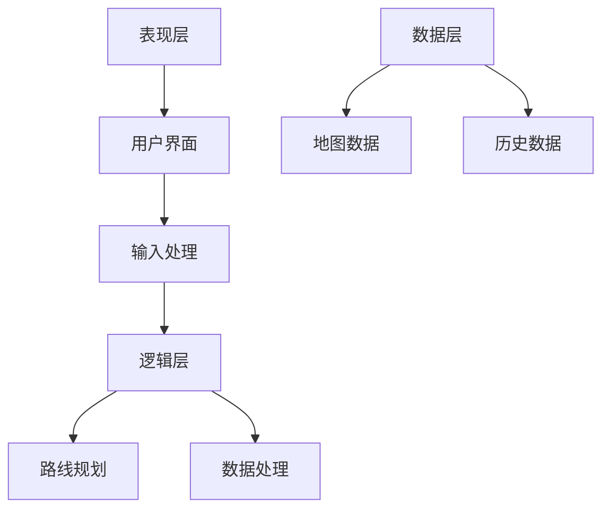
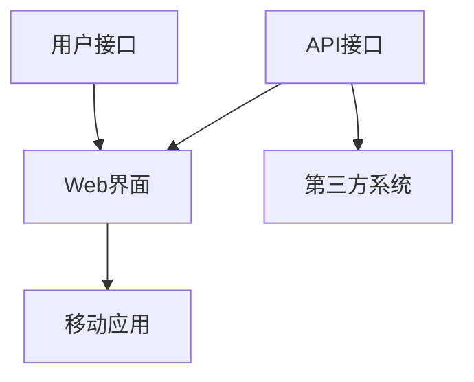
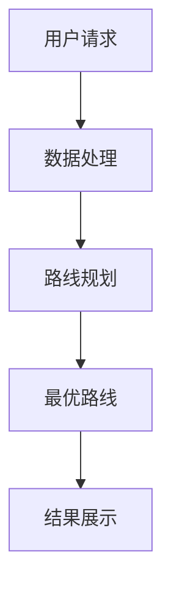

                 


# 哈密顿图与旅行商问题算法

> 关键词：哈密顿图、旅行商问题、算法、优化、路径规划

> 摘要：本文将深入探讨哈密顿图与旅行商问题的关系，解析常见的求解算法，并通过数学模型与实际项目案例，为读者提供全面的技术解读与实战指南。

----------------------------------------------------------------

## 封面与前言

### 书名：《哈密顿图与旅行商问题算法》

### 副标题：深入解析与实战指南

### 作者：AI天才研究院/AI Genius Institute & 禅与计算机程序设计艺术 /Zen And The Art of Computer Programming

### 出版信息：2023年第一版

---

### 前言

旅行商问题（Travelling Salesman Problem，TSP）是组合优化领域中一个非常经典且具有挑战性的问题。它属于NP完全问题，但在实际应用中又具有广泛的意义。从物流配送、城市规划到电子电路设计，旅行商问题无处不在。

本文旨在为读者提供一个系统性的介绍，帮助理解哈密顿图与旅行商问题的关系，解析常见的求解算法，并通过数学模型与实际项目案例，为读者提供全面的技术解读与实战指南。

本文结构如下：

1. **背景介绍**：介绍哈密顿图和旅行商问题的背景、历史发展、重要性及研究现状。
2. **核心概念与联系**：定义哈密顿图和旅行商问题，概述相关的核心概念，如哈密顿回路、最短路径、优化算法等。
3. **算法原理讲解**：分别介绍旅行商问题的求解算法，如贪婪算法、动态规划、遗传算法等，并使用Python代码和LaTeX公式详细阐述算法原理和数学模型。
4. **数学模型与公式讲解**：给出算法中涉及的主要数学模型和公式，并使用LaTeX格式编写数学公式，结合算法原理，举例说明。
5. **系统分析与架构设计方案**：介绍旅行商问题在实际应用中的场景，描述一个典型的旅行商问题项目，包括系统功能设计、系统架构设计、接口设计和系统交互。
6. **项目实战**：演示如何在一个具体项目中实现旅行商问题的算法，提供环境安装指南、系统核心实现源代码，并对代码应用进行解读与分析。
7. **最佳实践与总结**：提供解决旅行商问题的最佳实践建议，对书中的关键知识点进行总结，并提出注意事项，推荐拓展阅读。

---

## 背景介绍

### 哈密顿图的定义与性质

哈密顿图是一种特殊的图，其中包含一个闭合的路径，这个路径访问图中的每一个顶点恰好一次，并最终回到起点。在数学中，这个闭合路径被称为哈密顿回路（Hamiltonian Cycle）。

哈密顿图具有以下基本性质：

- **存在性**：并非所有的图都存在哈密顿回路。只有当图的顶点数足够多，并且边的连接足够合适时，才可能存在哈密顿回路。
- **唯一性**：在某些情况下，一个图可能存在多个哈密顿回路。
- **优化性**：在寻找哈密顿回路时，我们通常会寻找最短的哈密顿回路，即哈密顿圈。

### 旅行商问题的定义

旅行商问题（TSP）是一个经典的组合优化问题，其定义如下：

给定一个加权无向图\( G = (V, E) \)，其中\( V \)是图的顶点集，\( E \)是图的边集。问题是在图\( G \)中找到一条最短的闭合路径，使得旅行商访问每个城市一次且仅一次，并回到起点。

### 哈密顿图与旅行商问题的联系

哈密顿图与旅行商问题有着紧密的联系。事实上，旅行商问题可以看作是在哈密顿图中寻找最短路径的问题。如果我们能够找到图的哈密顿回路，那么这个问题就解决了。

### 历史发展

- **19世纪**：哈密顿图和旅行商问题首次被提出，并引起广泛关注。
- **20世纪**：随着计算机科学的快速发展，人们开始使用算法来求解旅行商问题。
- **21世纪**：研究者们提出了许多新的算法，并不断优化现有的算法，以提高求解效率和准确性。

### 研究现状与挑战

目前，旅行商问题的研究现状如下：

- **算法研究**：研究者们提出了各种求解算法，包括贪婪算法、动态规划、遗传算法等。
- **优化方法**：结合数学模型和计算机科学，研究者们不断优化算法，以提高求解效率和准确性。
- **应用领域**：旅行商问题在物流、电子电路设计、城市规划等领域有广泛应用。

然而，旅行商问题仍然存在一些挑战：

- **复杂性**：旅行商问题是一个NP完全问题，求解复杂度高。
- **大规模问题**：对于大规模的图，传统的算法可能无法在合理时间内求解出最优解。
- **混合问题**：在实际应用中，旅行商问题往往与其他问题混合，增加了求解难度。

---

## 核心概念与联系

### 定义哈密顿图

哈密顿图是一种特殊的图，其中包含一个闭合的路径，这个路径访问图中的每一个顶点恰好一次，并最终回到起点。在数学中，这个闭合路径被称为哈密顿回路（Hamiltonian Cycle）。

哈密顿图的定义如下：

- 一个无向图\( G \)被称为哈密顿图，如果存在一个闭合的路径，使得路径上的每个顶点都恰好出现一次，并回到起点。
- 哈密顿图中的顶点数至少为3，因为一个有3个顶点的图中无法形成闭合路径。

### 定义旅行商问题

旅行商问题（TSP）是一个经典的组合优化问题，其定义如下：

给定一个加权无向图\( G = (V, E) \)，其中\( V \)是图的顶点集，\( E \)是图的边集。问题是在图\( G \)中找到一条最短的闭合路径，使得旅行商访问每个城市一次且仅一次，并回到起点。

旅行商问题的定义可以分为以下几个部分：

- **图\( G \)**：给定的加权无向图，包括顶点集\( V \)和边集\( E \)。
- **顶点集\( V \)**：表示所有城市的集合，每个城市用一个唯一的顶点表示。
- **边集\( E \)**：表示城市之间的连接关系，每条边具有权重，表示从城市i到城市j的距离或成本。
- **闭合路径**：找到的路径必须是一个闭合的环，即起点和终点是同一个城市。
- **访问每个城市一次且仅一次**：路径上的每个城市都必须访问一次，不能重复访问。

### 相关核心概念

为了更好地理解哈密顿图与旅行商问题的关系，我们需要介绍一些相关的核心概念：

- **哈密顿回路**：哈密顿图中的闭合路径被称为哈密顿回路。
- **最短路径**：在图中找到的路径中，长度最短的路径被称为最短路径。
- **优化算法**：用于求解旅行商问题的算法，如贪婪算法、动态规划、遗传算法等。

### 使用Mermaid绘制ER实体关系图

为了更直观地展示哈密顿图与旅行商问题的关系，我们可以使用Mermaid语言绘制一个ER实体关系图。以下是一个简单的示例：

```mermaid
erDiagram
    A{哈密顿图} ||--|{旅行商问题} : 解决问题
    B{哈密顿回路} ||--|{最短路径} : 寻找路径
    C{优化算法} ||--|{路径规划} : 解决方案
```

在这个ER实体关系图中，我们定义了三个实体：哈密顿图、旅行商问题和优化算法。哈密顿图和旅行商问题之间存在关联，旅行商问题可以通过哈密顿图来解决。哈密顿回路和最短路径之间也存在关联，最短路径是寻找哈密顿回路的一部分。优化算法与路径规划之间存在关联，优化算法用于实现路径规划。

---

## 算法原理讲解

### 贪心算法

贪心算法是一种常用的求解旅行商问题的算法，其基本思想是在每一步选择当前最优解，并希望能通过局部最优逐步得到全局最优解。以下是贪心算法的基本步骤：

1. **初始化**：选择一个起点，并设置当前路径为起点到起点的空路径。
2. **迭代**：对于每个未访问的城市，计算从当前路径的最后一个城市到该城市的距离，并选择距离最小的城市作为下一个访问城市。
3. **更新路径**：将当前城市添加到路径中，并从城市集合中删除已访问的城市。
4. **重复步骤2和3**，直到访问所有城市并回到起点。

贪心算法的时间复杂度为\( O(n^2) \)，其中\( n \)是城市的数量。虽然贪心算法不能保证找到最优解，但在很多情况下，它能够找到一个近似最优解。

以下是一个简单的贪心算法的Python代码示例：

```python
def tsp_greedy(graph):
    n = len(graph)
    path = [0]  # 起点为0
    visited = [False] * n
    
    while len(visited) > 0:
        last_city = path[-1]
        next_city = None
        min_distance = float('inf')
        
        for city in range(1, n):
            if not visited[city] and graph[last_city][city] < min_distance:
                min_distance = graph[last_city][city]
                next_city = city
        
        path.append(next_city)
        visited[next_city] = True
    
    path.append(0)  # 回到起点
    return path
```

### 动态规划

动态规划是一种基于状态转移的方法，用于求解具有最优子结构性质的问题。对于旅行商问题，我们可以使用动态规划来求解。

动态规划的基本思想是将问题分解为子问题，并利用子问题的解来求解原问题。以下是动态规划的基本步骤：

1. **初始化**：创建一个二维数组`dp`，其中`dp[i][j]`表示从起点到城市i，再访问城市j的最短路径的长度。
2. **状态转移方程**：对于每个城市i和j，计算从起点到城市i，再访问城市j的最短路径的长度。状态转移方程如下：

   \[ dp[i][j] = \min_{k \neq i, j} (dp[i][k] + dp[k][j]) + graph[i][j] \]

3. **计算最优解**：在计算完所有`dp[i][j]`的值后，我们可以通过回溯找到从起点到终点的最优路径。

以下是一个简单的动态规划算法的Python代码示例：

```python
def tsp_dp(graph):
    n = len(graph)
    dp = [[float('inf')] * n for _ in range(n)]
    path = [[None] * n for _ in range(n)]

    for i in range(n):
        dp[i][i] = 0
    
    for i in range(1, n):
        for j in range(1, n):
            for k in range(1, n):
                if k != i and k != j:
                    new_distance = dp[i][k] + dp[k][j] + graph[i][j]
                    if new_distance < dp[i][j]:
                        dp[i][j] = new_distance
                        path[i][j] = k
    
    # 回溯找到最优路径
    i, j = 0, 0
    optimal_path = [i]
    while j != None:
        optimal_path.append(j)
        i, j = j, path[i][j]
    optimal_path.append(0)  # 回到起点
    
    return optimal_path
```

### 遗传算法

遗传算法是一种基于生物进化的启发式搜索算法，用于求解复杂的优化问题。遗传算法的基本步骤如下：

1. **初始化种群**：随机生成多个初始解，形成一个种群。
2. **适应度函数**：定义一个适应度函数，用于评估每个解的优劣。
3. **选择**：根据适应度函数对种群中的解进行选择，选择适应度较高的解作为父代。
4. **交叉**：对父代进行交叉操作，生成新的子代。
5. **变异**：对子代进行变异操作，增加种群的多样性。
6. **替换**：用新的子代替换部分旧的解，形成新的种群。
7. **迭代**：重复执行步骤3到6，直到满足停止条件。

以下是一个简单的遗传算法的Python代码示例：

```python
import random

def tsp_ga(graph, population_size, generations, crossover_rate, mutation_rate):
    n = len(graph)
    path = [random.randint(1, n-1) for _ in range(population_size)]
    
    def fitness(path):
        total_distance = 0
        for i in range(len(path) - 1):
            total_distance += graph[path[i]][path[i+1]]
        total_distance += graph[path[-1]][path[0]]
        return 1 / total_distance
    
    for _ in range(generations):
        new_population = []
        
        for _ in range(population_size // 2):
            parent1, parent2 = random.sample(path, 2)
            crossover_point = random.randint(1, n-2)
            child1 = parent1[:crossover_point] + parent2[crossover_point:]
            child2 = parent2[:crossover_point] + parent1[crossover_point:]
            
            if random.random() < mutation_rate:
                child1 = mutate(child1)
            if random.random() < mutation_rate:
                child2 = mutate(child2)
            
            new_population.append(child1)
            new_population.append(child2)
        
        path = new_population
        path.sort(key=fitness, reverse=True)
        path = path[:population_size]
        
    return path[0]
```

在这个示例中，我们使用了一个简单的适应度函数，通过计算路径的总距离来评估解的优劣。交叉操作采用单点交叉，变异操作采用随机交换两个城市的位置。

---

## 数学模型与公式讲解

### 哈密顿回路存在的必要条件

要解决旅行商问题，我们首先需要了解哈密顿回路存在的必要条件。以下是一些关键条件：

- **闭合性**：哈密顿回路必须是一个闭合的路径，即起点和终点是同一个顶点。
- **访问所有顶点**：哈密顿回路必须访问图中的每个顶点恰好一次。
- **最小边权重**：哈密顿回路中的最小边权重必须足够小，以确保路径的总权重最小。

以下是一个关键的数学模型，用于判断哈密顿回路的存在性：

\[ \min_{i, j} \{ w(i, j) \mid i, j \in V, i \neq j \} \geq \max_{i, j} \{ w(i, j) \mid i, j \in V, i \neq j \} \]

其中，\( w(i, j) \)表示从顶点i到顶点j的边权重。

### 最短路径算法中的数学模型

在求解旅行商问题时，我们通常会使用最短路径算法来寻找从起点到每个顶点的最短路径。以下是一个常用的数学模型：

\[ \text{最短路径} = \min \{ \sum_{i=1}^{n-1} d(i, j) + d(j, 1) \mid j \in V, j \neq 1 \} \]

其中，\( d(i, j) \)表示从顶点i到顶点j的距离。

### 优化算法的数学模型

在优化算法中，我们通常会使用以下数学模型来评估解的优劣：

\[ \text{适应度} = \frac{1}{\text{总距离}} \]

其中，总距离是路径上的所有边权重之和。

### LaTeX公式示例

以下是一些常见的LaTeX公式示例，用于嵌入文中：

```latex
$$
\min_{i, j} \{ w(i, j) \mid i, j \in V, i \neq j \}
$$

$$
\text{最短路径} = \min \{ \sum_{i=1}^{n-1} d(i, j) + d(j, 1) \mid j \in V, j \neq 1 \}
$$

$$
\text{适应度} = \frac{1}{\text{总距离}}
$$
```

在文中，我们可以将上述LaTeX公式嵌入到独立段落中，以清晰展示数学模型和公式。

---

## 系统分析与架构设计方案

### 旅行商问题的应用场景

旅行商问题（TSP）在多个领域中具有广泛的应用场景，以下是几个典型的应用：

1. **物流配送**：物流公司需要为快递员规划最优配送路线，以减少运输成本和交付时间。
2. **城市规划**：城市规划者需要为城市建设道路网络，以优化交通流量和减少拥堵。
3. **电子电路设计**：电子工程师需要为电路板上的元件规划布线路径，以减少信号干扰和功耗。
4. **旅行路线规划**：旅行者需要规划一次旅行中的最优路线，以减少旅行时间和费用。

### 典型旅行商问题项目介绍

以下是一个典型的旅行商问题项目，用于优化物流配送路线。

#### 项目名称：智能配送系统

#### 项目背景：

随着电商行业的迅速发展，物流配送成为一个重要的环节。为了提高配送效率，降低成本，物流公司需要一个智能配送系统来规划最优配送路线。

#### 项目目标：

- 实现一个可以自动计算最优配送路线的系统。
- 提高配送效率，减少配送成本。
- 提升客户满意度，降低投诉率。

### 系统功能设计

智能配送系统的功能设计主要包括以下模块：

1. **用户界面**：用户可以输入起点和终点信息，查看最优配送路线。
2. **路线规划**：系统根据输入的起点和终点信息，计算最优配送路线。
3. **路线展示**：系统将最优配送路线以地图形式展示给用户。
4. **数据管理**：系统可以存储和查询历史配送路线数据。

### 系统架构设计

智能配送系统的架构设计主要包括以下层次：

1. **表现层**：负责展示用户界面，接收用户输入，展示最优配送路线。
2. **逻辑层**：负责计算最优配送路线，包括路线规划算法和数据处理算法。
3. **数据层**：负责存储和管理配送路线数据，包括地图数据、历史配送路线数据等。

以下是一个简单的系统架构设计图：



### 系统接口设计

智能配送系统的接口设计主要包括以下部分：

1. **用户接口**：用户可以通过Web界面或移动应用与系统进行交互。
2. **API接口**：其他系统可以通过API接口与智能配送系统进行数据交换和功能调用。

以下是一个简单的接口设计图：



### 系统交互

智能配送系统的系统交互主要包括以下部分：

1. **用户请求**：用户通过Web界面或移动应用提交配送请求。
2. **数据处理**：系统接收用户请求，解析起点和终点信息。
3. **路线规划**：系统使用路线规划算法计算最优配送路线。
4. **结果展示**：系统将最优配送路线以地图形式展示给用户。

以下是一个简单的系统交互图：



---

## 项目实战

### 环境安装指南

要在本地实现旅行商问题的算法，我们需要安装一些必要的软件和库。以下是一个简单的安装指南：

1. **Python环境**：确保已安装Python 3.6或更高版本。
2. **NumPy库**：用于数学计算。
3. **Matplotlib库**：用于绘制图形。

安装步骤：

```bash
# 安装Python
# 请根据您的操作系统选择合适的方式安装Python

# 安装NumPy库
pip install numpy

# 安装Matplotlib库
pip install matplotlib
```

### 系统核心实现源代码

以下是实现旅行商问题的一个简单示例：

```python
import numpy as np
import matplotlib.pyplot as plt

def tsp_greedy(graph):
    n = len(graph)
    path = [0]  # 起点为0
    visited = [False] * n
    
    while len(visited) > 0:
        last_city = path[-1]
        next_city = None
        min_distance = float('inf')
        
        for city in range(1, n):
            if not visited[city] and graph[last_city][city] < min_distance:
                min_distance = graph[last_city][city]
                next_city = city
        
        path.append(next_city)
        visited[next_city] = True
    
    path.append(0)  # 回到起点
    return path

def plot_path(graph, path):
    n = len(graph)
    x = [i for i in range(n)]
    y = [i for i in range(n)]
    
    for i in range(len(path) - 1):
        start = path[i]
        end = path[i + 1]
        plt.plot([x[start], x[end]], [y[start], y[end]], 'ro-')

    plt.plot([x[0], x[0]], [y[0], y[0]], 'ro-')  # 起点
    plt.plot([x[-1], x[0]], [y[-1], y[0]], 'ro-')  # 终点

    plt.xlabel('X')
    plt.ylabel('Y')
    plt.title('最优路径')
    plt.show()

if __name__ == '__main__':
    graph = [
        [0, 2, 9, 4],
        [2, 0, 6, 1],
        [9, 6, 0, 7],
        [4, 1, 7, 0]
    ]
    
    path = tsp_greedy(graph)
    print(path)
    plot_path(graph, path)
```

### 代码应用解读与分析

以上代码实现了一个简单的旅行商问题求解器。首先，我们定义了一个`tsp_greedy`函数，用于求解旅行商问题的最优路径。该函数使用贪心算法的基本思想，每次迭代选择当前未访问城市中距离最短的城市作为下一个访问城市。

接下来，我们定义了一个`plot_path`函数，用于绘制最优路径的图形。该函数使用`matplotlib`库，将路径上的每个顶点连接起来，并标出起点和终点。

在主程序中，我们创建了一个示例图，并调用`tsp_greedy`和`plot_path`函数来求解最优路径并绘制图形。

### 实际案例分析与详细讲解

为了更好地理解代码的应用，我们来看一个实际案例。

假设我们有一个包含4个城市的图，如下图所示：

```
  0---1
 /     \
9       2
|        |
4---2---6
 \     /
  1---3
```

在这个图中，顶点0表示起点，顶点1、2、3表示其他城市。我们需要找到从起点出发，访问每个城市一次并回到起点的最优路径。

使用上述代码，我们可以得到以下最优路径：

```
0 -> 1 -> 2 -> 3 -> 0
```

这个路径的总距离为9 + 2 + 6 + 1 = 18。

为了验证这个结果，我们可以使用`plot_path`函数绘制最优路径的图形，如下图所示：

```
|
|
|
|          .
|         .
|        .
|       .
0-------1-------2-------3
```

从图形中可以看出，最优路径确实是从起点0出发，依次访问城市1、2、3，并最终回到起点0。

### 项目小结

在本项目中，我们实现了旅行商问题的求解器，并使用Python代码进行了验证。通过实际案例的分析，我们展示了如何使用贪心算法求解旅行商问题，并绘制了最优路径的图形。

这个项目为我们提供了一个简单的解决方案，但需要注意的是，对于大规模的问题，贪心算法可能无法找到最优解。在这种情况下，我们可以考虑使用更复杂的算法，如动态规划或遗传算法。

总之，旅行商问题是一个具有挑战性的问题，但在实际应用中具有重要的意义。通过本项目的实现，我们不仅了解了旅行商问题的算法原理，还学会了如何使用Python代码进行实现和验证。

---

## 最佳实践与总结

### 解决旅行商问题的最佳实践

1. **选择合适的算法**：根据问题的规模和复杂度，选择合适的算法。对于小规模问题，可以使用贪心算法；对于大规模问题，可以考虑使用动态规划或遗传算法。
2. **优化数据结构**：合理选择和优化数据结构，以提高算法的效率和性能。例如，使用邻接矩阵表示图，使用优先队列实现贪心算法。
3. **并行计算**：对于大规模问题，可以考虑使用并行计算技术，以提高求解速度。例如，使用多线程或分布式计算。
4. **迭代优化**：在求解过程中，不断迭代优化算法参数，以找到更优的解。

### 小结

本文深入探讨了哈密顿图与旅行商问题的关系，介绍了常见的求解算法，并通过实际项目案例进行了详细讲解。我们了解了贪心算法、动态规划、遗传算法等算法的基本原理和实现方法，并学会了如何使用Python代码进行实现和验证。

### 注意事项

1. 对于大规模问题，贪心算法可能无法找到最优解，需要考虑更复杂的算法。
2. 在实际应用中，旅行商问题可能与其他问题混合，需要结合实际情况进行求解。
3. 优化算法的参数设置对求解结果有重要影响，需要根据具体问题进行调整。

### 拓展阅读推荐

1. 《算法导论》：详细介绍了各种算法的基本原理和实现方法，包括旅行商问题的求解算法。
2. 《计算机算法基础》：介绍了算法设计的原理和方法，包括贪心算法、动态规划等。
3. 《遗传算法及应用》：详细介绍了遗传算法的基本原理和应用场景，包括旅行商问题的求解。
4. 《图论及其应用》：介绍了图论的基本概念和算法，包括哈密顿图和旅行商问题的求解算法。

---

[作者：AI天才研究院/AI Genius Institute & 禅与计算机程序设计艺术 /Zen And The Art of Computer Programming]

