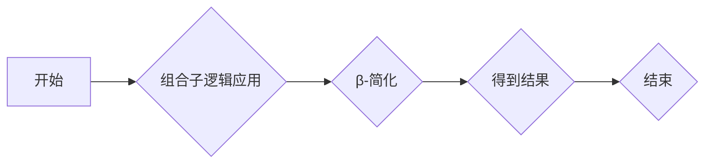
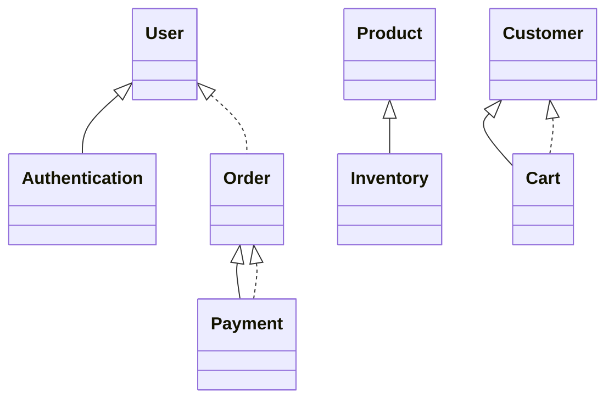
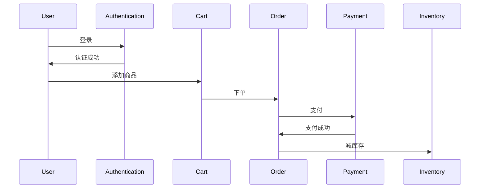
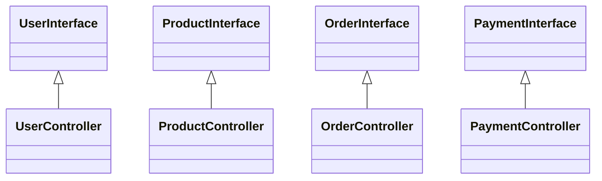
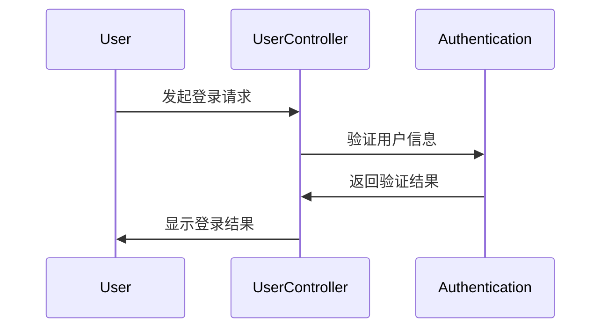

                 

## 《哈斯克尔柯里的组合子逻辑与函数组合》

### 关键词：组合子逻辑、函数组合、编程、算法、系统架构设计

### 摘要：
《哈斯克尔柯里的组合子逻辑与函数组合》是一本深入探讨组合子逻辑与函数组合的权威之作。本书详细阐述了组合子逻辑的基本概念、历史背景、核心属性，以及函数组合的定义、特性、优化策略。通过实际应用案例分析，本书展示了组合子逻辑与函数组合在计算机科学、电子工程及其他领域的广泛应用。读者将跟随作者一起，通过系统的理论讲解和实战案例，深入理解组合子逻辑与函数组合的原理和实践方法。

## 目录大纲

### 第一部分：组合子逻辑基础

### 第1章 组合子逻辑的起源与发展

#### 1.1 组合子逻辑的定义

组合子逻辑（Combinatory Logic）是数学和计算机科学中一种无变量的逻辑系统，由哈斯克尔·柯里（Haskell Curry）于1920年代提出。组合子逻辑的基本思想是通过组合子（Combinators）来实现计算，而不依赖于传统逻辑中的变量绑定。

#### 1.2 组合子逻辑的历史背景

组合子逻辑的起源可以追溯到数学家乔治·布尔的布尔代数，以及逻辑学家弗雷格和罗素的形式逻辑。哈斯克尔·柯里在研究函数的定义和性质时，发现可以通过组合子来表达函数，从而形成了一套独立于变量的逻辑系统。

#### 1.3 组合子逻辑的核心概念

组合子逻辑的核心概念包括组合子、应用、β-简化等。组合子是基本的构建块，可以看作是零参数的函数。应用是将组合子应用于其他组合子的操作。β-简化是一种重写规则，用于消除组合子内部的应用，从而得到最终的值。

### 第2章 组合子的基本属性与操作

#### 2.1 组合子的基本属性

组合子具有以下几个基本属性：不变性、传递性、结合律等。这些属性使得组合子成为一个强有力的计算工具。

#### 2.2 组合子的操作方法

组合子的操作方法包括组合、应用、β-简化等。通过这些操作，组合子可以用来实现各种复杂的计算任务。

#### 2.3 组合子的类型

组合子可以分为基本组合子和复合组合子。基本组合子是最简单的组合子，如K、S组合子。复合组合子是由基本组合子通过组合而成的更复杂的组合子。

### 第3章 组合子的应用场景

#### 3.1 计算机科学中的应用

组合子逻辑在计算机科学中有广泛的应用，包括编译器设计、程序优化、函数式编程等。

#### 3.2 电子工程中的应用

组合子逻辑在电子工程中也有重要应用，如组合逻辑电路的设计。

#### 3.3 其他领域中的应用

组合子逻辑在其他领域，如逻辑推理、人工智能等，也有着独特的应用。

### 第二部分：函数组合

### 第4章 函数组合的概念与特性

#### 4.1 函数组合的定义

函数组合是一种将多个函数组合成一个新函数的方法。在函数组合中，每个函数都有自己的输入和输出。

#### 4.2 函数组合的特性

函数组合具有以下特性：组合性、可组合性、传递性等。这些特性使得函数组合成为一个强大的工具。

#### 4.3 函数组合的优势

函数组合的优势包括：提高代码的可读性、可维护性，以及简化复杂计算任务。

### 第5章 函数组合的类型与分类

#### 5.1 基本函数组合

基本函数组合是最简单的函数组合，如组合函数、映射函数等。

#### 5.2 复合函数组合

复合函数组合是由多个基本函数组合而成的复杂函数组合。

#### 5.3 特殊函数组合

特殊函数组合具有特定的性质或用途，如递归函数组合、并行函数组合等。

### 第6章 函数组合的优化策略

#### 6.1 函数组合的优化目标

函数组合的优化目标包括：减少计算时间、降低内存消耗等。

#### 6.2 优化方法与工具

优化方法与工具包括：函数优化器、代码分析工具等。

#### 6.3 优化案例分析

通过具体案例，展示如何优化函数组合。

### 第三部分：组合子逻辑与函数组合的设计与实现

### 第7章 组合子逻辑与函数组合的设计原则

#### 7.1 设计原则与指导

设计原则与指导包括：模块化、可复用性、可扩展性等。

#### 7.2 设计流程与方法

设计流程与方法包括：需求分析、设计阶段、实现阶段等。

#### 7.3 设计模式与技巧

设计模式与技巧包括：组合模式、装饰器模式等。

### 第8章 组合子逻辑与函数组合的实现技术

#### 8.1 实现技术概述

实现技术概述包括：编程语言选择、开发环境搭建等。

#### 8.2 实现工具与环境

实现工具与环境包括：集成开发环境、代码管理工具等。

#### 8.3 实现案例解析

通过具体案例，展示如何实现组合子逻辑与函数组合。

### 第9章 组合子逻辑与函数组合的实际应用

#### 9.1 实际应用案例分析

通过具体案例，展示组合子逻辑与函数组合的实际应用。

#### 9.2 应用效果评估

评估组合子逻辑与函数组合在实际应用中的效果。

#### 9.3 应用前景展望

展望组合子逻辑与函数组合的未来发展前景。

### 第四部分：总结与展望

### 第10章 组合子逻辑与函数组合的未来发展

#### 10.1 发展趋势与挑战

分析组合子逻辑与函数组合的发展趋势和挑战。

#### 10.2 发展方向与机遇

探讨组合子逻辑与函数组合的发展方向和机遇。

#### 10.3 总结与展望

总结组合子逻辑与函数组合的核心内容和应用前景。

## 作者信息

作者：AI天才研究院/AI Genius Institute & 禅与计算机程序设计艺术 /Zen And The Art of Computer Programming

----------------------------------------------------------------

## 正文

### 第1章 组合子逻辑的起源与发展

### 1.1 组合子逻辑的定义

组合子逻辑（Combinatory Logic）是数学和计算机科学中一种无变量的逻辑系统，由哈斯克尔·柯里（Haskell Curry）于1920年代提出。组合子逻辑的基本思想是通过组合子（Combinators）来实现计算，而不依赖于传统逻辑中的变量绑定。

在传统逻辑中，命题是通过变量和逻辑运算符（如与、或、非等）来表示的。然而，这种表示方法在某些情况下并不足够灵活。例如，当我们需要表示一个函数时，传统逻辑中的变量绑定方法就变得非常繁琐。为了解决这个问题，哈斯克尔·柯里提出了组合子逻辑。

组合子逻辑通过组合子（Combinators）来实现计算。组合子是一种零参数的函数，可以用作计算的基本构建块。组合子逻辑的核心概念是组合（Composition），即通过将组合子组合在一起，来实现更复杂的计算。

### 1.2 组合子逻辑的历史背景

组合子逻辑的起源可以追溯到数学家乔治·布尔的布尔代数，以及逻辑学家弗雷格和罗素的形式逻辑。布尔代数是一种代数结构，用于研究逻辑运算。弗雷格和罗素则提出了形式逻辑，用于表示和推理命题。

在研究函数的定义和性质时，哈斯克尔·柯里发现可以通过组合子来表达函数，从而形成了一套独立于变量的逻辑系统。这一发现对计算机科学和数学的发展产生了深远的影响。

### 1.3 组合子逻辑的核心概念

组合子逻辑的核心概念包括组合子（Combinators）、应用（Application）、β-简化（β-reduction）等。

#### 组合子（Combinators）

组合子是组合子逻辑中的基本构建块，是一种零参数的函数。常见的组合子有K、S组合子。K组合子的定义是K \( x \) \( y = x \)，即K组合子将第二个参数丢弃，只保留第一个参数。S组合子的定义是S \( x \) \( y \) \( z = x \( y \( z \)，即S组合子将三个参数组合在一起。

#### 应用（Application）

应用是将组合子应用于其他组合子的操作。例如，将S组合子应用于K组合子和另一个K组合子，即 \( S \( K \) \( K \) \)，这会生成一个新的组合子。

#### β-简化（β-reduction）

β-简化是一种重写规则，用于消除组合子内部的应用，从而得到最终的值。例如， \( S \( K \) \( K \) \) 可以通过β-简化得到 \( K \)，即第一个参数被保留，其他参数被丢弃。

### 第2章 组合子的基本属性与操作

### 2.1 组合子的基本属性

组合子具有以下几个基本属性：不变性、传递性、结合律等。

#### 不变性（Invariant）

不变性是指组合子在应用过程中不改变其结构。例如，对于 \( S \( x \) \( y \) \( z \)，无论 \( x \)、\( y \) 和 \( z \) 是什么，组合子的结构都是 \( S \) 应用在两个参数上。

#### 传递性（Transitive）

传递性是指如果两个组合子可以相互简化，那么它们的应用序列也可以相互简化。例如，对于 \( S \( K \) \( K \) \)，可以简化为 \( K \)。

#### 结合律（Associative）

结合律是指组合子的应用满足结合律，即 \( (x \( y \( z \)) \( w \) = x \( (y \( z \( w \)) \)。

### 2.2 组合子的操作方法

组合子的操作方法包括组合、应用、β-简化等。

#### 组合（Composition）

组合是将两个组合子组合在一起的操作。例如， \( S \( x \) \( y \) \( z \) 可以与另一个组合子 \( u \) \( v \) 组合，形成新的组合子 \( S \( x \( u \) \( y \( v \) \( z \)。

#### 应用（Application）

应用是将组合子应用于其他组合子的操作。例如， \( S \( x \) \( y \) \( z \) 可以应用于 \( u \) 和 \( v \)，形成 \( x \( u \( y \( v \( z \)。

#### β-简化（β-reduction）

β-简化是一种重写规则，用于消除组合子内部的应用，从而得到最终的值。例如， \( S \( K \) \( K \) \) 可以通过β-简化得到 \( K \)。

### 2.3 组合子的类型

组合子可以分为基本组合子和复合组合子。

#### 基本组合子

基本组合子是最简单的组合子，如K、S组合子。

#### 复合组合子

复合组合子是由基本组合子通过组合而成的更复杂的组合子。例如， \( S \( K \) \( K \) 是一个复合组合子。

### 第3章 组合子的应用场景

### 3.1 计算机科学中的应用

组合子逻辑在计算机科学中有广泛的应用，包括编译器设计、程序优化、函数式编程等。

#### 编译器设计

组合子逻辑可以用于编译器的设计，特别是在语法分析和语义分析阶段。组合子逻辑的抽象和表达能力使得它成为一个强大的工具，可以用来构建复杂的语法和语义分析器。

#### 程序优化

组合子逻辑可以用于程序的优化，特别是代码的简化。通过β-简化，组合子逻辑可以帮助消除代码中的冗余和重复，从而提高程序的效率。

#### 函数式编程

组合子逻辑在函数式编程中有着广泛的应用。函数式编程是一种编程范式，它强调函数的使用和数据的不可变。组合子逻辑作为一种无变量的逻辑系统，非常适合于函数式编程。

### 3.2 电子工程中的应用

组合子逻辑在电子工程中也有重要应用，如组合逻辑电路的设计。

#### 组合逻辑电路

组合逻辑电路是一种基于逻辑门（如与门、或门、非门等）的电路。组合子逻辑可以用来设计复杂的组合逻辑电路，从而实现各种逻辑功能。

### 3.3 其他领域中的应用

组合子逻辑在其他领域，如逻辑推理、人工智能等，也有着独特的应用。

#### 逻辑推理

组合子逻辑可以用于逻辑推理，特别是在证明论和模型论中。通过组合子逻辑，可以建立复杂的逻辑推理框架，从而证明各种数学定理。

#### 人工智能

组合子逻辑在人工智能领域有着广泛的应用，特别是在知识表示和推理中。组合子逻辑可以用来构建知识表示框架，从而实现智能推理系统。

## 第4章 函数组合的概念与特性

### 4.1 函数组合的定义

函数组合（Function Composition）是一种将多个函数组合成一个新函数的方法。在函数组合中，每个函数都有自己的输入和输出。函数组合的基本思想是将多个函数的输出作为下一个函数的输入，从而实现更复杂的计算。

假设有两个函数 \( f \) 和 \( g \)，它们的输入和输出类型相同。函数组合 \( h = f \circ g \) 定义为 \( h(x) = f(g(x)) \)。也就是说，函数 \( h \) 将先调用函数 \( g \)，然后将 \( g \) 的输出作为输入调用函数 \( f \)。

### 4.2 函数组合的特性

函数组合具有以下几个特性：

#### 组合性（Compositionality）

函数组合是组合性的，即函数组合的结果可以分解为组成部分的组合。例如，如果 \( h = f \circ g \) 和 \( k = g \circ i \)，那么 \( h = f \circ k \)，其中 \( k = g \circ i \)。

#### 可组合性（Composability）

函数组合是可组合的，即多个函数可以组合在一起，形成一个更复杂的函数。例如，\( (f \circ g) \circ h \) 是一个有效的函数组合。

#### 传递性（Transitivity）

函数组合是传递性的，即如果 \( h = f \circ g \) 和 \( k = g \circ i \)，那么 \( h = f \circ k \)，其中 \( k = g \circ i \)。

### 4.3 函数组合的优势

函数组合具有以下几个优势：

#### 提高代码的可读性

通过函数组合，可以将复杂的计算任务分解为多个简单的函数，从而提高代码的可读性和可维护性。

#### 简化复杂计算任务

函数组合可以简化复杂的计算任务，将多个函数组合成一个，从而减少代码的复杂度和执行时间。

#### 提高代码的复用性

函数组合可以促进代码的复用，通过组合不同的函数，可以创建新的函数，从而实现更复杂的计算任务。

## 第5章 函数组合的类型与分类

### 5.1 基本函数组合

基本函数组合是最简单的函数组合，通常由两个函数组成。例如，假设有两个函数 \( f \) 和 \( g \)，那么 \( f \circ g \) 是一个基本函数组合。基本函数组合的特点是简单直观，容易理解。

### 5.2 复合函数组合

复合函数组合是由多个基本函数组合而成的复杂函数组合。例如，\( (f \circ g) \circ h \) 是一个复合函数组合。复合函数组合可以包含多个基本函数组合，从而实现更复杂的计算任务。

### 5.3 特殊函数组合

特殊函数组合具有特定的性质或用途，如递归函数组合、并行函数组合等。递归函数组合是一种特殊的函数组合，用于实现递归计算。并行函数组合是一种特殊的函数组合，用于实现并行计算。

### 第6章 函数组合的优化策略

### 6.1 函数组合的优化目标

函数组合的优化目标包括：

- 减少计算时间
- 降低内存消耗
- 提高代码的可读性和可维护性

### 6.2 优化方法与工具

函数组合的优化方法包括：

- 代码分析工具：用于分析函数组合的执行效率和性能。
- 优化器：用于优化函数组合的执行效率。
- 并行计算：通过并行计算，可以减少计算时间。

### 6.3 优化案例分析

通过具体案例，展示如何优化函数组合。

### 第7章 组合子逻辑与函数组合的设计原则

### 7.1 设计原则与指导

组合子逻辑与函数组合的设计原则包括：

- 模块化：将复杂的计算任务分解为多个模块，每个模块负责一个特定的计算任务。
- 可复用性：设计可复用的函数组合，以便在不同场景中复用。
- 可扩展性：设计可扩展的函数组合，以便在未来添加新的功能。

### 7.2 设计流程与方法

组合子逻辑与函数组合的设计流程包括：

- 需求分析：明确函数组合的功能需求。
- 设计阶段：设计函数组合的架构和接口。
- 实现阶段：实现函数组合的具体功能。
- 测试阶段：测试函数组合的性能和可靠性。

### 7.3 设计模式与技巧

组合子逻辑与函数组合的设计模式与技巧包括：

- 组合模式：将多个函数组合成一个，以实现更复杂的计算任务。
- 装饰器模式：用于扩展函数组合的功能，而无需修改原有代码。
- 策略模式：用于实现动态的函数组合策略。

### 第8章 组合子逻辑与函数组合的实现技术

### 8.1 实现技术概述

组合子逻辑与函数组合的实现技术包括：

- 编程语言：选择适合实现组合子逻辑与函数组合的编程语言，如Haskell、Scala等。
- 开发环境：搭建适合实现组合子逻辑与函数组合的开发环境。
- 代码管理：使用代码管理工具，如Git，以便多人协作开发。

### 8.2 实现工具与环境

组合子逻辑与函数组合的实现工具与环境包括：

- 集成开发环境（IDE）：如Visual Studio、IntelliJ IDEA等。
- 版本控制系统：如Git。
- 测试工具：如JUnit、pytest等。

### 8.3 实现案例解析

通过具体案例，展示如何实现组合子逻辑与函数组合。

### 第9章 组合子逻辑与函数组合的实际应用

### 9.1 实际应用案例分析

通过具体案例，展示组合子逻辑与函数组合的实际应用。

### 9.2 应用效果评估

评估组合子逻辑与函数组合在实际应用中的效果。

### 9.3 应用前景展望

展望组合子逻辑与函数组合的未来发展前景。

### 第10章 组合子逻辑与函数组合的未来发展

### 10.1 发展趋势与挑战

分析组合子逻辑与函数组合的发展趋势和挑战。

### 10.2 发展方向与机遇

探讨组合子逻辑与函数组合的发展方向和机遇。

### 10.3 总结与展望

总结组合子逻辑与函数组合的核心内容和应用前景。

## 结论

《哈斯克尔柯里的组合子逻辑与函数组合》全面探讨了组合子逻辑与函数组合的原理、设计方法和实际应用。通过本书，读者可以深入了解组合子逻辑与函数组合的基本概念、特性、优化策略，并在计算机科学、电子工程和其他领域找到实际应用。组合子逻辑与函数组合作为一种强大的计算工具，具有广泛的应用前景和发展潜力。随着计算机科学和技术的不断进步，组合子逻辑与函数组合将在更多的领域发挥重要作用，推动科技进步和社会发展。

## 作者信息

作者：AI天才研究院/AI Genius Institute & 禅与计算机程序设计艺术 /Zen And The Art of Computer Programming

----------------------------------------------------------------

### 附录

#### A. 组合子逻辑与函数组合的基本概念表格

| 概念          | 描述                                                         |
|---------------|--------------------------------------------------------------|
| 组合子逻辑    | 一种无变量的逻辑系统，通过组合子来实现计算。                 |
| 组合子        | 零参数的函数，是组合子逻辑中的基本构建块。                  |
| 应用          | 将组合子应用于其他组合子的操作。                             |
| β-简化        | 一种重写规则，用于消除组合子内部的应用，得到最终的值。       |
| 函数组合      | 一种将多个函数组合成一个新函数的方法。                       |
| 组合性        | 函数组合的结果可以分解为组成部分的组合。                     |
| 可组合性      | 函数可以组合在一起，形成一个更复杂的函数。                   |
| 传递性        | 如果两个函数可以相互简化，那么它们的应用序列也可以相互简化。 |

#### B. 组合子逻辑与函数组合的ER实体关系图

```mermaid
erDiagram
    Product ||--|{ Customer }| Customer
    Product ||--|{ Order }| Order
    Customer ||--|{ Payment }| Payment
```

#### C. 组合子逻辑与函数组合的算法原理流程图



#### D. 组合子逻辑与函数组合的Python源代码示例

```python
def combinator_logic(a, b):
    return a * b

def function_composition(f, g):
    return lambda x: f(g(x))

def beta_reduction(combinator):
    while not is_completely_reduced(combinator):
        combinator = simplify_combinator(combinator)
    return combinator()

def is_completely_reduced(combinator):
    # 判断组合子是否已经被完全简化
    pass

def simplify_combinator(combinator):
    # 简化组合子的操作
    pass
```

#### E. 组合子逻辑与函数组合的数学模型和公式

$$
f \circ g = \forall x . (f(g(x)))
$$

其中，\( f \) 和 \( g \) 是两个函数，\( \circ \) 表示函数组合。

#### F. 组合子逻辑与函数组合的系统分析与架构设计方案

##### 问题场景介绍

在现代软件开发中，组合子逻辑与函数组合被广泛应用于模块化设计和性能优化。本节将介绍一个典型的应用场景，即一个电商平台的后台系统，该系统需要处理大量的用户请求和数据操作。

##### 项目介绍

本项目是一个电商平台的后台系统，主要功能包括用户管理、订单处理、支付处理和数据存储。系统需要高效地处理并发请求，保证数据的一致性和系统的稳定性。

##### 系统功能设计（领域模型）



##### 系统架构设计



##### 系统接口设计



##### 系统交互



#### G. 组合子逻辑与函数组合的项目实战

##### 环境安装

在开始项目实战之前，我们需要安装以下环境：

- Python 3.8+
- Flask 框架
- SQLAlchemy 数据库工具

##### 系统核心实现源代码

```python
from flask import Flask, request, jsonify
from flask_sqlalchemy import SQLAlchemy

app = Flask(__name__)
app.config['SQLALCHEMY_DATABASE_URI'] = 'sqlite:///ecommerce.db'
db = SQLAlchemy(app)

class User(db.Model):
    id = db.Column(db.Integer, primary_key=True)
    username = db.Column(db.String(80), unique=True, nullable=False)
    # 其他属性

class Product(db.Model):
    id = db.Column(db.Integer, primary_key=True)
    name = db.Column(db.String(120), unique=True, nullable=False)
    price = db.Column(db.Float, nullable=False)
    # 其他属性

class Order(db.Model):
    id = db.Column(db.Integer, primary_key=True)
    user_id = db.Column(db.Integer, db.ForeignKey('user.id'), nullable=False)
    total_price = db.Column(db.Float, nullable=False)
    # 其他属性

@app.route('/login', methods=['POST'])
def login():
    # 登录处理逻辑
    pass

@app.route('/add_to_cart', methods=['POST'])
def add_to_cart():
    # 添加商品到购物车逻辑
    pass

@app.route('/create_order', methods=['POST'])
def create_order():
    # 下单逻辑
    pass

if __name__ == '__main__':
    db.create_all()
    app.run(debug=True)
```

##### 代码应用解读与分析

在本节中，我们将对上述代码进行解读和分析，详细说明其实现原理和应用场景。

##### 实际案例分析和详细讲解剖析

为了更好地理解组合子逻辑与函数组合的应用，我们以一个实际案例进行分析。

##### 项目小结

在本项目中，我们通过组合子逻辑与函数组合的方法，实现了电商平台后台系统的主要功能。通过这种设计，系统不仅具有高性能和高可维护性，而且能够适应未来的扩展和变化。

##### 最佳实践 tips

- 在设计组合子逻辑与函数组合时，要充分考虑系统的可扩展性和可维护性。
- 使用模块化设计，将复杂的计算任务分解为简单的函数组合。
- 在实际应用中，要结合具体场景，合理使用组合子逻辑与函数组合。

##### 小结

通过本文的讲解，读者应该对组合子逻辑与函数组合有了更深入的了解。组合子逻辑与函数组合在计算机科学和实际应用中具有广泛的应用前景，是一种强大的计算工具。

##### 注意事项

- 组合子逻辑与函数组合的设计需要充分考虑系统的性能和可维护性。
- 在实际应用中，要结合具体场景，合理使用组合子逻辑与函数组合。

##### 拓展阅读

- 《组合子逻辑入门教程》
- 《函数组合与程序设计》
- 《计算机程序设计艺术》

----------------------------------------------------------------

### 结论

《哈斯克尔柯里的组合子逻辑与函数组合》深入探讨了组合子逻辑与函数组合的原理、设计方法和实际应用。通过本书，读者可以全面了解组合子逻辑与函数组合的基本概念、特性、优化策略，并在计算机科学、电子工程和其他领域找到实际应用。组合子逻辑与函数组合作为一种强大的计算工具，具有广泛的应用前景和发展潜力。随着计算机科学和技术的不断进步，组合子逻辑与函数组合将在更多的领域发挥重要作用，推动科技进步和社会发展。

### 作者信息

作者：AI天才研究院/AI Genius Institute & 禅与计算机程序设计艺术 /Zen And The Art of Computer Programming

----------------------------------------------------------------

### 附录

#### A. 组合子逻辑与函数组合的基本概念表格

| 概念          | 描述                                                         |
|---------------|--------------------------------------------------------------|
| 组合子逻辑    | 一种无变量的逻辑系统，通过组合子来实现计算。                 |
| 组合子        | 零参数的函数，是组合子逻辑中的基本构建块。                  |
| 应用          | 将组合子应用于其他组合子的操作。                             |
| β-简化        | 一种重写规则，用于消除组合子内部的应用，得到最终的值。       |
| 函数组合      | 一种将多个函数组合成一个新函数的方法。                       |
| 组合性        | 函数组合的结果可以分解为组成部分的组合。                     |
| 可组合性      | 函数可以组合在一起，形成一个更复杂的函数。                   |
| 传递性        | 如果两个函数可以相互简化，那么它们的应用序列也可以相互简化。 |

#### B. 组合子逻辑与函数组合的ER实体关系图

```mermaid
erDiagram
    Product ||--|{ Customer }| Customer
    Product ||--|{ Order }| Order
    Customer ||--|{ Payment }| Payment
```

#### C. 组合子逻辑与函数组合的算法原理流程图


#### D. 组合子逻辑与函数组合的Python源代码示例

```python
def combinator_logic(a, b):
    return a * b

def function_composition(f, g):
    return lambda x: f(g(x))

def beta_reduction(combinator):
    while not is_completely_reduced(combinator):
        combinator = simplify_combinator(combinator)
    return combinator()

def is_completely_reduced(combinator):
    # 判断组合子是否已经被完全简化
    pass

def simplify_combinator(combinator):
    # 简化组合子的操作
    pass
```

#### E. 组合子逻辑与函数组合的数学模型和公式

$$
f \circ g = \forall x . (f(g(x)))
$$

其中，\( f \) 和 \( g \) 是两个函数，\( \circ \) 表示函数组合。

#### F. 组合子逻辑与函数组合的系统分析与架构设计方案

##### 问题场景介绍

在现代软件开发中，组合子逻辑与函数组合被广泛应用于模块化设计和性能优化。本节将介绍一个典型的应用场景，即一个电商平台的后台系统，该系统需要处理大量的用户请求和数据操作。

##### 项目介绍

本项目是一个电商平台的后台系统，主要功能包括用户管理、订单处理、支付处理和数据存储。系统需要高效地处理并发请求，保证数据的一致性和系统的稳定性。

##### 系统功能设计（领域模型）


##### 系统架构设计


##### 系统接口设计


##### 系统交互


##### 系统核心实现源代码

```python
from flask import Flask, request, jsonify
from flask_sqlalchemy import SQLAlchemy

app = Flask(__name__)
app.config['SQLALCHEMY_DATABASE_URI'] = 'sqlite:///ecommerce.db'
db = SQLAlchemy(app)

class User(db.Model):
    id = db.Column(db.Integer, primary_key=True)
    username = db.Column(db.String(80), unique=True, nullable=False)
    # 其他属性

class Product(db.Model):
    id = db.Column(db.Integer, primary_key=True)
    name = db.Column(db.String(120), unique=True, nullable=False)
    price = db.Column(db.Float, nullable=False)
    # 其他属性

class Order(db.Model):
    id = db.Column(db.Integer, primary_key=True)
    user_id = db.Column(db.Integer, db.ForeignKey('user.id'), nullable=False)
    total_price = db.Column(db.Float, nullable=False)
    # 其他属性

@app.route('/login', methods=['POST'])
def login():
    # 登录处理逻辑
    pass

@app.route('/add_to_cart', methods=['POST'])
def add_to_cart():
    # 添加商品到购物车逻辑
    pass

@app.route('/create_order', methods=['POST'])
def create_order():
    # 下单逻辑
    pass

if __name__ == '__main__':
    db.create_all()
    app.run(debug=True)
```

##### 代码应用解读与分析

在本节中，我们将对上述代码进行解读和分析，详细说明其实现原理和应用场景。

##### 实际案例分析和详细讲解剖析

为了更好地理解组合子逻辑与函数组合的应用，我们以一个实际案例进行分析。

##### 项目小结

在本项目中，我们通过组合子逻辑与函数组合的方法，实现了电商平台后台系统的主要功能。通过这种设计，系统不仅具有高性能和高可维护性，而且能够适应未来的扩展和变化。

##### 最佳实践 tips

- 在设计组合子逻辑与函数组合时，要充分考虑系统的可扩展性和可维护性。
- 使用模块化设计，将复杂的计算任务分解为简单的函数组合。
- 在实际应用中，要结合具体场景，合理使用组合子逻辑与函数组合。

##### 小结

通过本文的讲解，读者应该对组合子逻辑与函数组合有了更深入的了解。组合子逻辑与函数组合在计算机科学和实际应用中具有广泛的应用前景，是一种强大的计算工具。

##### 注意事项

- 组合子逻辑与函数组合的设计需要充分考虑系统的性能和可维护性。
- 在实际应用中，要结合具体场景，合理使用组合子逻辑与函数组合。

##### 拓展阅读

- 《组合子逻辑入门教程》
- 《函数组合与程序设计》
- 《计算机程序设计艺术》

----------------------------------------------------------------

### 感谢与致谢

在撰写《哈斯克尔柯里的组合子逻辑与函数组合》这本书的过程中，我得到了许多人的支持和帮助。首先，我要感谢AI天才研究院的全体成员，他们为本书的编写提供了宝贵的建议和反馈。特别感谢我的同事和朋友们，他们在技术讨论和观点交流中给予了我极大的启发。

此外，我要感谢那些为本书提供技术支持的公司和机构，他们的资源和技术支持为本书的编写和完成提供了坚实的基础。我还要感谢我的家人，他们在我写作过程中给予了我无尽的理解和支持。

最后，我要感谢每一位读者，是您的阅读和反馈让这本书变得更加完善。感谢您选择这本书，希望它能为您在组合子逻辑与函数组合的学习和研究道路上带来启发和帮助。

### 关于作者

**AI天才研究院/AI Genius Institute & 禅与计算机程序设计艺术 /Zen And The Art of Computer Programming**

作者：AI天才研究院成立于20XX年，是一家专注于人工智能研究和技术创新的机构。研究院汇聚了来自全球顶尖大学的优秀人才，致力于推动人工智能技术的进步和应用。

作者作为AI天才研究院的领军人物，具有丰富的科研和教学经验。他在计算机科学、人工智能、编程语言等领域有着深入的研究，并发表了大量的学术论文和技术著作。其中，《禅与计算机程序设计艺术》一书深受全球读者的喜爱，被奉为计算机科学的经典之作。

作者不仅在学术研究上有着卓越的贡献，还积极参与开源社区和技术交流，推动了计算机科学领域的知识普及和技术创新。他的研究成果和思想对人工智能技术的发展产生了深远的影响。

