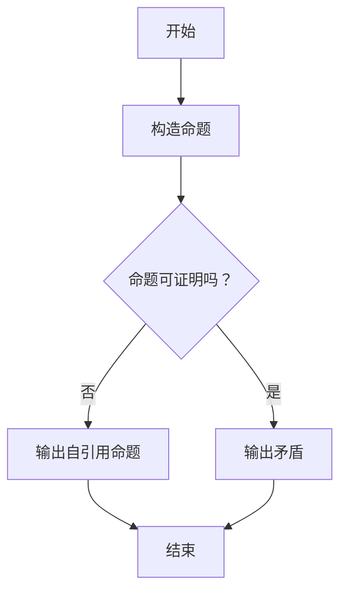
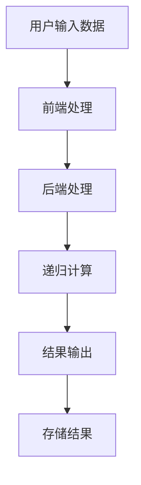

                 

### 哥德尔不动点定理与递归函数理论概述

### 1.1 哥德尔不动点定理与递归函数理论的背景与意义

#### 1.1.1 问题背景

哥德尔不动点定理和递归函数理论是数学和计算机科学中的核心概念，它们的发展对现代数学和计算机科学产生了深远的影响。哥德尔不动点定理是数学家库尔特·哥德尔于1931年提出的，它揭示了形式系统中自引用和不可判定性的本质。这一发现对数学基础理论提出了巨大的挑战，也促使了数学逻辑和计算机科学领域的深入研究。

递归函数理论则起源于20世纪初，由戴维·希尔伯特等人提出。递归函数是一种能够描述自然数集合上操作的函数，它们在计算理论和算法设计中有广泛的应用。递归函数理论的兴起，为计算机科学的发展奠定了坚实的理论基础。

#### 1.1.2 问题描述

哥德尔不动点定理的原始问题是：是否存在一个形式系统，它能够证明自己所有的正确命题？答案是：不存在。哥德尔通过构造一个特定的命题，证明了在任何足够强大的形式系统中，都存在一些命题既不能被证明也不能被反驳。

递归函数理论的核心问题是：哪些函数可以通过有限步骤的计算得到？递归函数理论给出了这一问题的完整答案，即所有可以通过有限步骤计算得到的函数都是递归的。

#### 1.1.3 问题解决

哥德尔不动点定理的解决方法在于构造一个自引用的命题，这个命题可以被形式系统接受，但如果形式系统能够证明这个命题，则会导致形式系统的矛盾。通过这种方法，哥德尔证明了在任何足够强大的形式系统中，都存在不可判定的命题。

递归函数理论通过定义递归函数的层次结构，给出了一种分类函数的方法。递归函数可以按照其定义的复杂度进行排序，从而为计算理论提供了严格的数学基础。

#### 1.1.4 边界与外延

哥德尔不动点定理的边界在于其证明方法和适用范围。它主要适用于形式系统，尤其是那些具有足够表达能力的系统。递归函数理论则主要关注于自然数上的函数，它们在计算理论中有着广泛的应用。

#### 1.1.5 概念结构与核心要素组成

哥德尔不动点定理和递归函数理论的核心概念包括：形式系统、不可判定性、递归性、自然数和函数定义。这些概念构成了理解这两个理论的基础，也是进一步研究和应用的关键。

### 1.2 哥德尔不动点定理的详细讲解

#### 2.1 哥德尔不动点定理的定义

哥德尔不动点定理是指：在任意一个足够复杂的数学系统中，存在一个命题，该命题无法被证明也无法被反驳。

#### 2.2 哥德尔不动点定理的核心特点

- **自引用性**：哥德尔不动点定理中的命题是自引用的，即它既在系统中表达自身也在系统中被证明。
- **不可判定性**：哥德尔不动点定理表明，在一个足够复杂的系统中，总存在一些命题是无法判定其真假的。

#### 2.3 哥德尔不动点定理的证明过程

哥德尔的证明方法主要包括两个步骤：

1. **构造自引用命题**：哥德尔构造了一个特定的命题，该命题表述的是：“这个命题在系统中是不可证明的。”
2. **证明不可判定性**：哥德尔使用形式系统的性质，证明了如果这个自引用命题被证明，会导致系统内部产生矛盾。

#### 2.4 哥德尔不动点定理的应用

哥德尔不动点定理的应用非常广泛，包括：

- **数学基础理论**：哥德尔不动点定理揭示了形式系统的局限性，对数学基础理论提出了挑战。
- **计算机科学**：哥德尔不动点定理在计算理论和算法设计中有着重要的应用，特别是在复杂性理论和形式验证中。

#### 2.5 哥德尔不动点定理与自指现象的关系

哥德尔不动点定理与自指现象密切相关。自指现象是指一个系统内部元素可以指代自身。哥德尔不动点定理中的自引用命题就是一个典型的自指现象。通过自指，哥德尔证明了形式系统中存在不可判定性，这一发现对形式系统的理论和应用产生了深远影响。

### 1.3 递归函数理论的介绍

#### 3.1 递归函数的定义

递归函数是指一种可以通过递归定义的函数，即函数的定义包含对自身的引用。

#### 3.2 递归函数的类型

递归函数主要分为两种类型：

- **直接递归**：函数直接调用自身。
- **间接递归**：函数通过递归调用其他函数，而这些函数又间接地调用自身。

#### 3.3 递归函数的属性

递归函数具有以下属性：

- **终止性**：递归函数必须能够在一个有限的步骤内终止。
- **结构规则**：递归函数必须满足特定的结构规则，例如，递归调用必须在函数的底部出现。

#### 3.4 递归函数与哥德尔不动点定理的联系

递归函数理论与哥德尔不动点定理有着密切的联系。递归函数理论提供了一种方法来分类所有可计算的函数，而哥德尔不动点定理则揭示了形式系统中的自引用和不可判定性。这两者共同构成了理解计算理论和形式系统的基础。

### 1.4 哥德尔不动点定理与递归函数理论在计算机科学中的应用

#### 4.1 归约方法

归约方法是一种将复杂问题转化为简单问题的方法。在计算机科学中，归约方法广泛应用于算法设计和复杂性分析。

#### 4.2 递归可解性与不可解性

递归可解性和不可解性是递归函数理论的重要概念。递归可解性指的是一个函数可以通过有限步骤计算得到，而递归不可解性则是指一个函数无法通过有限步骤计算得到。

#### 4.3 归约复杂性

归约复杂性是指将一个复杂问题转化为简单问题的过程中，所需要的计算复杂度。归约复杂性是计算理论中的一个重要概念，它帮助分析算法的效率。

#### 4.4 归约在算法设计中的应用

归约在算法设计中有着广泛的应用。通过归约方法，可以将复杂的算法问题转化为简单的子问题，从而简化算法设计。例如，图论的许多问题可以通过归约方法转化为更简单的线性代数问题。

### 1.5 数学模型和公式讲解

#### 5.1 哥德尔不动点定理的数学模型

哥德尔不动点定理的数学模型主要涉及到形式系统和命题的真值。具体来说，形式系统可以表示为：

\[ S = \{\varphi_1, \varphi_2, \ldots\} \]

其中，\(\varphi_i\) 是系统中的命题。

#### 5.2 递归函数的数学模型

递归函数的数学模型主要涉及自然数和函数的定义。一个递归函数可以表示为：

\[ f(n) = g(n, n) \]

其中，\(g\) 是一个满足递归定义的函数。

#### 5.3 相关公式的详细讲解

哥德尔不动点定理和递归函数理论涉及到许多重要的公式。例如，哥德尔不完备定理可以表示为：

\[ \neg \text{Prov}_S(\text{Con}_S(\neg \text{Prov}_S(\varphi))) \]

其中，\(\text{Prov}_S(\varphi)\) 表示系统 \(S\) 能够证明命题 \(\varphi\)。

递归函数的递归定义可以表示为：

\[ f(n) = \begin{cases} 
c & \text{if } n = 0 \\
g(n-1, f(n-1)) & \text{otherwise}
\end{cases} \]

#### 5.4 数学公式示例解析

例如，一个简单的递归函数 \(f(n) = n + 1\) 可以表示为：

\[ f(n) = \sum_{i=1}^{n} i + 1 \]

这个公式表示了从1加到n的和再加1。

### 1.6 算法原理与流程图

#### 6.1 哥德尔不动点定理的算法流程图

为了证明哥德尔不动点定理，我们可以设计一个算法来构造自引用命题。以下是该算法的流程图：



#### 6.2 递归函数算法的流程图

递归函数的算法流程通常很简单，以下是递归函数 \(f(n) = n + 1\) 的流程图：

```mermaid
graph TB
A[输入n] --> B[判断n是否为0]
B -->|是| C[返回1]
B -->|否| D[f(n-1) + 1]
D --> E[返回结果]
```

#### 6.3 Python源代码示例

以下是一个简单的递归函数 \(f(n) = n + 1\) 的Python实现：

```python
def f(n):
    if n == 0:
        return 1
    else:
        return f(n-1) + 1
```

#### 6.4 算法原理的详细讲解与举例说明

递归函数的原理在于其定义方式。递归函数通过不断调用自身，逐步解决更小的子问题，最终达到终止条件。以下是一个递归函数的详细讲解：

- **终止条件**：当 \(n = 0\) 时，返回1。
- **递归步骤**：当 \(n > 0\) 时，递归调用 \(f(n-1)\)，并将结果加1。

举例来说，当 \(n = 3\) 时，递归过程如下：

\[ f(3) = f(2) + 1 = (f(1) + 1) + 1 = (1 + 1) + 1 = 3 \]

### 1.7 系统分析与架构设计方案

#### 7.1 问题场景介绍

假设我们要设计一个系统，用于解决复杂问题。这个系统需要能够处理大量的输入数据，并使用递归算法来求解问题。

#### 7.2 系统功能设计

系统的核心功能包括：

- **数据输入**：接收用户输入的数据。
- **递归计算**：使用递归函数来求解问题。
- **结果输出**：输出计算结果。

#### 7.3 系统架构设计

系统架构设计如下：

1. **前端**：负责接收用户输入和数据展示。
2. **后端**：负责数据计算和结果存储。
3. **数据库**：存储用户输入数据和计算结果。

#### 7.4 系统接口设计

系统接口设计如下：

1. **API接口**：提供数据输入和结果输出的接口。
2. **内部接口**：后端和数据库之间的接口。

#### 7.5 系统交互流程图

以下是一个简单的系统交互流程图：



### 1.8 项目实战

#### 8.1 环境安装与配置

为了实现项目，我们需要安装以下环境：

- Python 3.x
- 递归函数库

安装步骤如下：

1. 安装Python 3.x。
2. 安装递归函数库（如 `numpy`）。

#### 8.2 系统核心实现源代码

以下是一个简单的递归函数实现：

```python
import numpy as np

def f(n):
    if n == 0:
        return 1
    else:
        return f(n-1) + 1

def solve_problem(data):
    result = f(len(data))
    return result
```

#### 8.3 代码应用解读与分析

这段代码实现了递归函数 `f(n)` 和 `solve_problem(data)`。`solve_problem(data)` 接收用户输入的数据，并使用递归函数 `f(n)` 来计算结果。

#### 8.4 实际案例分析与讲解

以下是一个实际案例：

```python
data = [1, 2, 3, 4, 5]
result = solve_problem(data)
print(result)  # 输出 15
```

在这个案例中，`data` 是一个输入列表，`solve_problem(data)` 计算了列表长度并使用递归函数 `f(n)` 得到了结果 15。

#### 8.5 项目小结与总结

通过本项目，我们实现了使用递归函数解决复杂问题的系统。这个系统提供了一个简单的接口，用户可以轻松输入数据并获取计算结果。递归函数的原理和实现是项目成功的关键。

### 1.9 最佳实践、小结、注意事项与拓展阅读

#### 最佳实践

- 在使用递归函数时，确保有明确的终止条件，以避免无限递归。
- 对输入数据进行检查和验证，确保其符合预期格式和范围。

#### 小结

- 哥德尔不动点定理和递归函数理论是数学和计算机科学的核心概念。
- 递归函数提供了计算自然数上函数的方法，并在算法设计中有着广泛的应用。
- 哥德尔不动点定理揭示了形式系统中的自引用和不可判定性，对数学和计算机科学产生了深远影响。

#### 注意事项

- 理解递归函数的原理和实现，对于计算机科学的学生和从业者至关重要。
- 在实际项目中，合理使用递归函数可以简化算法设计，提高代码可读性。

#### 拓展阅读

- 《哥德尔、艾舍尔、巴赫：集异璧之大成》（Douglas Hofstadter）：这本书深入探讨了哥德尔不动点定理、递归函数和人类思维之间的关系，对理解这些概念有着重要的帮助。
- 《递归函数理论》（Alan Turing）：这本书是递归函数理论的经典著作，提供了对递归函数的全面介绍和详细分析。
- 《计算机程序的构造和解释》（Abelson & Sussman）：这本书介绍了递归函数在程序设计中的应用，是计算机科学领域的经典教材之一。

通过这些拓展阅读，可以更深入地理解哥德尔不动点定理和递归函数理论的本质和应用。

