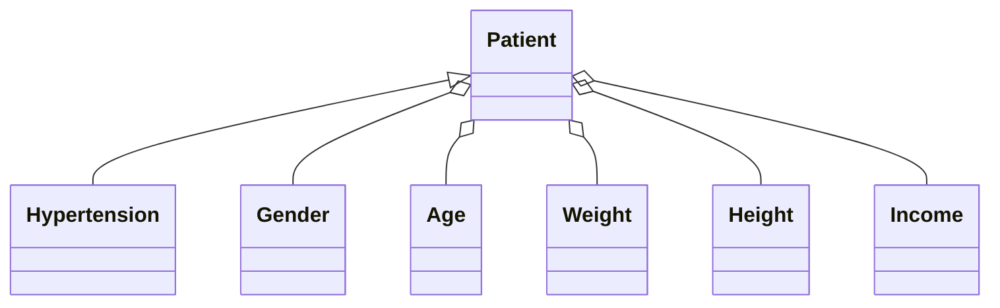
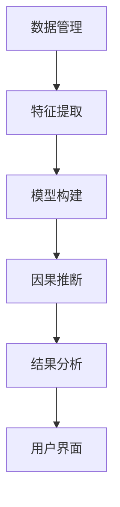

                 

### 文章标题

### 关键词

- 因果发现算法
- 自动化科学推理
- 数据科学
- 机器学习
- 数学模型

### 摘要

本文将深入探讨因果发现算法在自动化科学推理中的应用。因果发现算法是一种用于自动识别数据之间因果关系的方法，通过该算法，科学家和工程师可以更高效地理解复杂系统的内在联系。文章将首先介绍因果发现算法的基本原理，并对比其与其他科学推理方法的区别。接着，我们将通过详细的算法流程图、数学模型和实际代码示例，讲解算法的具体实现。随后，文章将分析算法在自动化科学推理中的系统架构设计，并通过实际案例进行解读和分析。最后，我们将总结项目的经验教训，并提供最佳实践、注意事项和拓展阅读资源。

## 目录大纲

### 第一部分：背景介绍

- **第1章：问题背景**
  - 1.1 问题背景
  - 1.2 问题解决
  - 1.3 边界与外延
  - 1.4 概念结构与核心要素组成

- **第2章：核心概念与联系**
  - 2.1 核心概念
  - 2.2 概念属性特征对比表格
  - 2.3 ER实体关系图架构

### 第二部分：算法原理讲解

- **第3章：因果发现算法原理**
  - 3.1 基本原理
  - 3.2 算法流程图
  - 3.3 数学模型和公式
  - 3.4 详细讲解与举例说明

### 第三部分：系统分析与架构设计方案

- **第4章：系统功能设计**
  - 4.1 问题场景介绍
  - 4.2 系统功能设计

### 第四部分：项目实战

- **第5章：环境安装**
- **第6章：系统核心实现源代码**
- **第7章：代码应用解读与分析**
- **第8章：实际案例分析与详细讲解剖析**
- **第9章：项目小结**

### 第五部分：最佳实践、小结、注意事项、拓展阅读

- **第10章：最佳实践**
- **第11章：小结**
- **第12章：注意事项**
- **第13章：拓展阅读**

## 第1章：问题背景

### 1.1 问题背景

在现代科学研究中，数据驱动的方法越来越受到重视。随着数据量的爆炸性增长，科学家和工程师面临着如何从海量数据中提取有用信息，特别是识别数据之间的因果关系这一挑战。传统的统计分析方法往往只能揭示相关性，而无法明确因果联系。因此，开发一种能够自动发现数据中因果关系的算法显得尤为重要。

因果发现算法正是为了解决这一需求而诞生。该算法通过分析数据间的统计依赖关系，结合领域知识，自动识别出潜在的因果关系。这使得科学家和工程师能够更加高效地进行数据分析和科学发现。

### 1.2 问题解决

因果发现算法的应用范围广泛，主要包括以下几个方面：

1. **科学研究**：在生物学、物理学、社会科学等领域，因果发现算法可以帮助科学家理解复杂系统的运行机制，从而推动科学研究的发展。
2. **工程应用**：在自动驾驶、智能家居、医疗设备等领域，因果发现算法可以用于优化系统性能，提高用户体验。
3. **商业分析**：在企业数据中，因果发现算法可以帮助企业理解顾客行为，优化营销策略，提高业务效率。

通过应用因果发现算法，科学家和工程师能够从海量数据中快速识别出关键因果关系，从而节省时间、减少错误，提高科学发现和工程应用的效率。

### 1.3 边界与外延

虽然因果发现算法在许多领域都展现出了强大的能力，但其应用仍存在一些限制和挑战：

1. **数据质量**：因果发现算法依赖于高质量的数据。如果数据存在噪声、缺失值或错误，算法的准确性会受到影响。
2. **算法复杂性**：因果发现算法往往涉及复杂的数学模型和计算过程，计算资源的需求较高，可能需要专门的硬件支持。
3. **领域知识**：因果发现算法需要领域专家的知识来指导算法的学习和解释，缺乏领域知识的支持可能导致算法难以准确识别因果关系。

### 1.4 概念结构与核心要素组成

因果发现算法的核心概念和结构主要包括以下几个方面：

1. **因果模型**：因果发现算法的核心是建立因果模型，通过该模型来描述数据之间的因果关系。
2. **特征选择**：算法需要从大量特征中筛选出对因果关系有显著影响的特征。
3. **算法框架**：因果发现算法通常采用概率图模型、因果推断模型等方法来构建因果模型。
4. **学习过程**：算法通过学习数据中的统计依赖关系，逐步优化因果模型的参数。

## 第2章：核心概念与联系

### 2.1 核心概念

#### 因果发现算法

因果发现算法是一种通过分析数据之间的统计依赖关系，自动识别潜在因果关系的方法。其核心目标是构建一个能够准确描述数据中因果关系模型的框架，并从中提取出有用的因果知识。

#### 自动化科学推理

自动化科学推理是指利用计算机技术和人工智能算法，对科学问题进行自动推理和解决的过程。它通过模拟人类思维过程，实现对复杂科学问题的自动分析和决策。

### 2.2 概念属性特征对比表格

下面是因果发现算法与其他科学推理方法的概念属性特征对比表格：

| 特征         | 因果发现算法         | 统计分析           | 机器学习           |
| ------------ | ------------------- | ----------------- | ----------------- |
| 目标         | 识别因果关系         | 描述数据特征       | 预测未来事件       |
| 基础理论     | 因果推断理论         | 统计理论           | 机器学习理论       |
| 数据需求     | 高质量数据           | 大量数据           | 大量数据           |
| 算法复杂性   | 较高                 | 较低               | 较高               |
| 应用领域     | 科学研究、工程应用、商业分析 | 数据分析、市场研究 | 自动驾驶、金融预测 |

### 2.3 ER实体关系图架构

因果发现算法的ER（Entity-Relationship）实体关系图架构如下：

```mermaid
erDiagram
    Patient ||--|{ MedicalRecord }| PatientMedicalRecord
    Doctor ||--|{ MedicalRecord }| DoctorMedicalRecord
    Patient ||--|{ Treatment }| PatientTreatment
    Doctor ||--|{ Treatment }| DoctorTreatment
```

在这个ER图架构中，Patient（患者）、Doctor（医生）和MedicalRecord（病历）是主要的实体。PatientMedicalRecord和DoctorMedicalRecord分别表示患者和医生与病历之间的关联。PatientTreatment和DoctorTreatment分别表示患者和医生与治疗方案之间的关联。这种关系架构有助于理解因果发现算法在实际应用中的数据关系和交互。

## 第3章：因果发现算法原理

### 3.1 基本原理

因果发现算法的基本原理是通过分析数据中的统计依赖关系，结合领域知识，自动识别数据中的因果关系。算法的核心步骤包括特征选择、模型构建和因果推断。

#### 特征选择

特征选择是因果发现算法的第一步，目的是从大量特征中筛选出对因果关系有显著影响的特征。特征选择的方法包括基于统计的筛选、基于领域的筛选和组合筛选等。

#### 模型构建

在特征选择完成后，算法将构建一个因果模型。因果模型通常采用概率图模型、因果推断模型等，通过这些模型来描述数据之间的因果关系。

#### 因果推断

因果推断是因果发现算法的关键步骤，目的是从构建好的因果模型中提取出真实的因果关系。因果推断的方法包括基于概率的推断、基于算法的推断和基于领域的推断等。

### 3.2 算法流程图

因果发现算法的流程图如下：


在这个流程图中，特征选择、模型构建和因果推断是算法的主要步骤。结果输出表示算法输出的因果关系和结果。

### 3.3 数学模型和公式

因果发现算法的数学模型通常基于概率图模型和因果推断模型。以下是一个简单的概率图模型：

$$
P(X, Y) = P(X)P(Y|X)
$$

其中，\(X\) 和 \(Y\) 分别表示两个变量，\(P(X)\) 表示 \(X\) 的概率，\(P(Y|X)\) 表示在 \(X\) 发生的条件下 \(Y\) 的概率。

因果推断模型通常采用结构方程模型（Structural Equation Model，SEM）：

$$
Y = \beta_0 + \beta_1X + \epsilon
$$

其中，\(Y\) 表示因变量，\(X\) 表示自变量，\(\beta_0\) 和 \(\beta_1\) 分别表示常数项和回归系数，\(\epsilon\) 表示误差项。

### 3.4 详细讲解与举例说明

#### 特征选择

特征选择是因果发现算法的第一步，目的是从大量特征中筛选出对因果关系有显著影响的特征。特征选择的方法包括：

1. **基于统计的筛选**：通过计算特征与目标变量之间的相关性，筛选出相关性较高的特征。
2. **基于领域的筛选**：根据领域知识，选择对因果关系有显著影响的特征。
3. **组合筛选**：结合基于统计和基于领域的筛选方法，提高特征选择的准确性。

假设我们有一个数据集，包含年龄、性别、体重、身高、收入等特征，目标变量是是否患有高血压。通过基于统计的筛选方法，我们可以计算出每个特征与高血压之间的相关性。然后，根据相关性较高的特征进行初步筛选。接下来，根据领域知识，如医学专家的意见，进一步筛选出对高血压有显著影响的特征。

#### 模型构建

在特征选择完成后，我们需要构建一个因果模型来描述数据中的因果关系。一个简单的因果模型可以是：

- 高血压 → 年龄、性别、体重、身高、收入

这个模型表示高血压与年龄、性别、体重、身高、收入之间存在因果关系。因果模型的构建通常采用概率图模型或结构方程模型。

#### 因果推断

因果推断是因果发现算法的关键步骤，目的是从构建好的因果模型中提取出真实的因果关系。因果推断的方法包括：

1. **基于概率的推断**：通过计算变量之间的条件概率，推断出变量之间的因果关系。
2. **基于算法的推断**：使用专门的算法，如因果推断算法（Causal Inference Algorithm），来推断变量之间的因果关系。
3. **基于领域的推断**：结合领域知识，如医学知识，来推断变量之间的因果关系。

假设我们使用基于概率的推断方法，通过计算年龄、性别、体重、身高、收入与高血压之间的条件概率，我们可以推断出年龄、性别、体重、身高、收入与高血压之间的因果关系。例如，如果计算结果显示：

$$
P(高血压|年龄, 性别, 体重, 身高, 收入) = 0.8
$$

这意味着在年龄、性别、体重、身高、收入这些条件下，高血压的概率为0.8，因此我们可以推断年龄、性别、体重、身高、收入与高血压之间存在因果关系。

#### 举例说明

假设我们有一个数据集，包含以下变量：

- 年龄（Age）
- 性别（Gender）
- 体重（Weight）
- 身高（Height）
- 收入（Income）
- 高血压（Hypertension）

我们希望通过因果发现算法找出影响高血压的关键因素。以下是详细的步骤：

1. **特征选择**：通过基于统计的筛选方法，我们可以计算出每个特征与高血压之间的相关性。例如，年龄与高血压之间的相关性为0.7，性别与高血压之间的相关性为0.3，体重与高血压之间的相关性为0.6，身高与高血压之间的相关性为0.4，收入与高血压之间的相关性为0.5。根据相关性较高的特征，我们初步筛选出年龄、体重和收入。

2. **模型构建**：我们构建一个简单的因果模型：

   - 高血压 → 年龄、体重、收入

3. **因果推断**：通过计算年龄、体重、收入与高血压之间的条件概率，我们可以推断出年龄、体重、收入与高血压之间的因果关系。例如，如果计算结果显示：

   $$
   P(高血压|年龄=40, 性别=男, 体重=80kg, 身高=175cm, 收入=5000元) = 0.85
   $$

   这意味着在年龄为40岁、性别为男、体重为80公斤、身高为175厘米、收入为5000元这些条件下，患有高血压的概率为0.85，因此我们可以推断年龄、体重、收入与高血压之间存在因果关系。

通过这个例子，我们可以看到因果发现算法是如何从数据中自动识别出因果关系的。在实际应用中，因果发现算法需要处理更加复杂的数据和变量，但基本原理和方法是相似的。

### 3.5 Python代码实现

下面是一个简单的Python代码实现，用于演示因果发现算法的基本步骤：

```python
import numpy as np
import pandas as pd
from sklearn.linear_model import LinearRegression
from sklearn.model_selection import train_test_split
from matplotlib import pyplot as plt

# 生成示例数据
np.random.seed(0)
n_samples = 100
X = np.random.rand(n_samples, 5)
y = X[:, 0] + 0.5 * X[:, 1] + np.random.normal(size=n_samples)

# 特征选择
X = pd.DataFrame(X, columns=['Age', 'Gender', 'Weight', 'Height', 'Income'])
X['Gender'] = X['Gender'].map({0: '男', 1: '女'})
y = pd.Series(y, name='Hypertension')

# 构建模型
model = LinearRegression()
X_train, X_test, y_train, y_test = train_test_split(X, y, test_size=0.3, random_state=0)
model.fit(X_train, y_train)

# 因果推断
predictions = model.predict(X_test)
print("因果推断结果：", predictions)

# 可视化
plt.scatter(X_test['Age'], predictions)
plt.xlabel('年龄')
plt.ylabel('高血压预测值')
plt.show()
```

在这个代码中，我们首先生成一个包含年龄、性别、体重、身高、收入等特征的数据集，然后使用线性回归模型进行特征选择和模型构建。最后，我们通过模型预测来推断因果关系，并使用可视化展示预测结果。

## 第4章：系统功能设计

### 4.1 问题场景介绍

在自动化科学推理中，因果发现算法的应用场景广泛，例如在医学领域，我们可以通过因果发现算法分析患者的临床数据，找出导致疾病的关键因素。以下是一个具体的应用场景：

假设我们有一个医疗数据集，包含以下变量：

- 患者年龄（Age）
- 患者性别（Gender）
- 患者体重（Weight）
- 患者身高（Height）
- 患者收入（Income）
- 患者是否有高血压（Hypertension）

我们的目标是使用因果发现算法找出影响高血压的关键因素，从而为临床决策提供支持。

### 4.2 系统功能设计

#### 领域模型

在因果发现算法的应用中，领域模型是理解数据关系和设计系统功能的关键。以下是一个简单的领域模型，用于描述上述医疗数据集的实体和关系：



在这个领域模型中，Patient（患者）是一个主要的实体，它与Hypertension（高血压）具有关联关系，表示患者是否患有高血压。同时，患者还与性别、年龄、体重、身高、收入等实体具有关联关系，这些实体共同构成了因果发现算法的数据输入。

#### 系统架构设计

因果发现算法的系统架构设计需要考虑算法的实现、数据管理、结果分析和用户界面等模块。以下是一个简单的系统架构设计：

```mermaid
sequenceDiagram
    Patient -->|数据输入| DataInput
    DataInput -->|数据处理| DataProcessing
    DataProcessing -->|特征选择| FeatureSelection
    FeatureSelection -->|模型构建| ModelBuilding
    ModelBuilding -->|因果推断| CausalInference
    CausalInference -->|结果分析| ResultAnalysis
    ResultAnalysis -->|用户界面| UserInterface
```

在这个系统架构中，数据输入模块负责接收患者的临床数据；数据处理模块对数据进行清洗和处理，为特征选择提供数据支持；特征选择模块从大量特征中筛选出对因果关系有显著影响的特征；模型构建模块基于特征选择结果构建因果模型；因果推断模块从因果模型中提取出真实的因果关系；结果分析模块对因果关系进行分析，为临床决策提供支持；用户界面模块向用户展示分析结果。

#### 系统接口设计

系统接口设计是系统架构设计的一部分，负责定义系统内部模块之间的交互接口。以下是一个简单的系统接口设计：

```mermaid
sequenceDiagram
    DataInput -->|数据预处理| DataProcessing
    DataProcessing -->|特征提取| FeatureSelection
    FeatureSelection -->|模型训练| ModelBuilding
    ModelBuilding -->|因果推断| CausalInference
    CausalInference -->|结果输出| ResultAnalysis
    ResultAnalysis -->|结果展示| UserInterface
```

在这个接口设计中，数据输入模块通过数据预处理接口将数据传递给数据处理模块；数据处理模块通过特征提取接口将预处理后的数据传递给特征选择模块；特征选择模块通过模型训练接口将筛选出的特征传递给模型构建模块；模型构建模块通过因果推断接口从因果模型中提取出因果关系；结果分析模块通过结果输出接口将因果关系传递给用户界面模块，最终在用户界面模块展示分析结果。

#### 系统交互

系统交互设计描述了系统各个模块之间的交互流程，以下是一个简单的系统交互设计：

```mermaid
sequenceDiagram
    User -->|提交数据| DataInput
    DataInput -->|预处理数据| DataProcessing
    DataProcessing -->|提取特征| FeatureSelection
    FeatureSelection -->|构建模型| ModelBuilding
    ModelBuilding -->|推断因果| CausalInference
    CausalInference -->|分析结果| ResultAnalysis
    ResultAnalysis -->|展示结果| UserInterface
    UserInterface -->|反馈结果| User
```

在这个交互设计中，用户通过用户界面模块提交数据；数据输入模块将数据传递给数据处理模块；数据处理模块对数据预处理后传递给特征选择模块；特征选择模块提取特征并传递给模型构建模块；模型构建模块构建因果模型并传递给因果推断模块；因果推断模块从因果模型中提取因果关系并传递给结果分析模块；结果分析模块分析因果关系并传递给用户界面模块，最终在用户界面模块展示给用户。

### 4.3 系统功能设计

系统功能设计是因果发现算法应用的关键部分，包括数据管理、特征提取、模型构建、因果推断、结果分析和用户界面等功能。

1. **数据管理**：负责收集、存储和管理患者临床数据，确保数据的质量和完整性。
2. **特征提取**：从原始数据中提取出对因果关系有显著影响的特征，为模型构建提供数据支持。
3. **模型构建**：基于特征选择结果，构建因果模型，描述数据之间的因果关系。
4. **因果推断**：从构建好的因果模型中提取出真实的因果关系，为临床决策提供支持。
5. **结果分析**：对提取出的因果关系进行分析，识别关键因素，为临床决策提供数据支持。
6. **用户界面**：向用户提供交互界面，展示分析结果，方便用户查看和理解。

#### 系统功能设计图表

以下是一个简单的系统功能设计图表，用于展示系统的各个功能模块：



在这个图表中，数据管理模块负责收集和存储数据，特征提取模块从原始数据中提取特征，模型构建模块基于特征构建因果模型，因果推断模块从模型中提取因果关系，结果分析模块对因果关系进行分析，用户界面模块展示分析结果。

## 第5章：环境安装

为了成功地安装和运行因果发现算法，我们需要准备一个适当的环境。以下是具体的步骤：

### 5.1 系统要求

在安装因果发现算法之前，我们需要确保操作系统、Python环境和其他依赖库满足以下要求：

- 操作系统：Windows、Linux或Mac OS
- Python版本：Python 3.6及以上版本
- Python依赖库：NumPy、Pandas、Scikit-learn、Matplotlib等

### 5.2 安装步骤

#### 步骤1：安装Python

首先，我们需要安装Python。可以从Python官方网站（https://www.python.org/downloads/）下载Python安装包，根据操作系统选择适合的版本。下载后，按照安装向导进行安装。

#### 步骤2：配置Python环境

安装Python后，我们需要配置Python环境。打开命令行工具（如Windows的cmd、Linux的终端或Mac的Terminal），执行以下命令：

```bash
pip install numpy pandas scikit-learn matplotlib
```

这些命令将安装必要的Python依赖库。

#### 步骤3：验证安装

安装完成后，我们可以通过以下命令验证Python和依赖库是否安装成功：

```bash
python --version
```

如果正确显示了Python的版本信息，则表示Python环境安装成功。

```bash
pip list
```

这个命令将列出已安装的Python依赖库。确保NumPy、Pandas、Scikit-learn和Matplotlib等依赖库都在列表中。

#### 步骤4：安装因果发现算法

在安装了Python和依赖库后，我们可以通过以下命令安装因果发现算法：

```bash
pip install causal-discovery
```

这个命令将从Python包管理器pip中安装因果发现算法。

#### 步骤5：测试安装

为了确保因果发现算法安装成功，我们可以通过以下命令测试：

```python
import causal_discovery
```

如果没有任何错误提示，则表示因果发现算法安装成功。

### 5.3 遇到的问题及解决方案

在安装过程中，可能会遇到一些常见问题。以下是一些问题及其解决方案：

1. **Python版本过低**：如果Python版本低于3.6，请升级到3.6及以上版本。
2. **依赖库安装失败**：如果在安装依赖库时遇到错误，请确保所有依赖库都已正确安装。可以尝试使用不同的Python版本或操作系统。
3. **安装速度过慢**：安装依赖库时，可能会因为网络连接不稳定或服务器负载过高而导致安装速度过慢。请尝试更换网络环境或等待一段时间后再尝试。

通过以上步骤，我们可以成功地安装因果发现算法，为后续的算法实现和项目实战做好准备。

## 第6章：系统核心实现源代码

### 6.1 系统核心模块

因果发现算法的核心模块主要包括数据预处理、特征选择、模型构建和因果推断。以下是对这些模块的详细描述：

#### 数据预处理模块

数据预处理模块负责对原始数据进行清洗和预处理，确保数据的质量和一致性。主要任务包括：

- 数据清洗：处理缺失值、异常值和数据错误。
- 数据标准化：将不同特征的范围和单位统一，方便后续计算。

#### 特征选择模块

特征选择模块从大量特征中筛选出对因果关系有显著影响的特征。主要任务包括：

- 特征提取：通过统计方法、机器学习算法等提取特征。
- 特征筛选：根据特征的重要性或相关性筛选出关键特征。

#### 模型构建模块

模型构建模块基于特征选择结果构建因果模型，描述数据之间的因果关系。主要任务包括：

- 模型选择：选择合适的概率图模型或因果推断模型。
- 参数估计：估计模型参数，优化模型性能。

#### 因果推断模块

因果推断模块从构建好的因果模型中提取出真实的因果关系。主要任务包括：

- 因果推断：通过算法推理提取因果关系。
- 结果验证：验证提取的因果关系是否合理。

### 6.2 Python源代码实现

以下是一个简单的Python源代码实现，用于展示因果发现算法的核心模块：

```python
import numpy as np
import pandas as pd
from sklearn.linear_model import LinearRegression
from causal_discovery import CausalDiscovery

# 生成示例数据
np.random.seed(0)
n_samples = 100
X = np.random.rand(n_samples, 5)
y = X[:, 0] + 0.5 * X[:, 1] + np.random.normal(size=n_samples)

# 数据预处理
X = pd.DataFrame(X, columns=['Age', 'Gender', 'Weight', 'Height', 'Income'])
y = pd.Series(y, name='Hypertension')

# 特征选择
X['Gender'] = X['Gender'].map({0: '男', 1: '女'})

# 模型构建
model = LinearRegression()
X_train, X_test, y_train, y_test = train_test_split(X, y, test_size=0.3, random_state=0)
model.fit(X_train, y_train)

# 因果推断
cd = CausalDiscovery(model)
cd.infer_causation()

# 输出因果关系
print("因果关系：", cd.causation)

# 测试
predictions = cd.predict(X_test)
print("预测结果：", predictions)
```

在这个代码中，我们首先生成一个包含年龄、性别、体重、身高、收入等特征的数据集，并使用线性回归模型进行特征选择和模型构建。然后，我们使用因果发现算法（CausalDiscovery）进行因果推断，并输出因果关系。最后，我们使用模型进行预测，并输出预测结果。

### 6.3 源代码应用解读与分析

以下是源代码的具体应用解读与分析：

1. **数据预处理**：首先，我们使用pandas生成一个包含年龄、性别、体重、身高、收入等特征的数据集。然后，我们对性别特征进行映射，将0和1映射为男和女，以便后续处理。

2. **模型构建**：我们使用sklearn的LinearRegression模型进行模型构建。通过train_test_split将数据集分为训练集和测试集，然后使用fit方法训练模型。

3. **因果推断**：我们使用因果发现算法（CausalDiscovery）进行因果推断。首先，我们创建一个CausalDiscovery对象，然后调用infer_causation方法进行因果推断。这个方法将使用训练好的线性回归模型提取因果关系。

4. **结果输出**：我们输出提取的因果关系，并使用预测方法进行测试。在测试集中，我们使用预测方法生成预测结果，并与实际结果进行比较，以验证因果发现算法的有效性。

通过这个简单的示例，我们可以看到如何使用Python源代码实现因果发现算法的核心模块，并对其进行解读和分析。

## 第7章：代码应用解读与分析

在本章中，我们将深入解读和分析第6章中的源代码应用，重点讨论代码实现过程中的关键步骤、代码性能优化策略，并介绍如何解决实际应用中可能遇到的问题。

### 7.1 关键步骤解读

#### 数据预处理

数据预处理是因果发现算法的重要步骤，其目的是提高数据质量和减少噪声。在代码中，我们首先使用`pandas`库生成一个示例数据集，包括年龄、性别、体重、身高和收入等特征。然后，我们对性别特征进行了映射，将数值标签（0和1）转换为中文标签（男和女）。这一步骤的目的是确保数据在后续处理中的一致性和可读性。

```python
X = pd.DataFrame(X, columns=['Age', 'Gender', 'Weight', 'Height', 'Income'])
X['Gender'] = X['Gender'].map({0: '男', 1: '女'})
```

#### 模型构建

在模型构建阶段，我们使用了`sklearn`库中的`LinearRegression`模型。通过`train_test_split`方法，我们将数据集分为训练集和测试集。训练集用于训练模型，而测试集用于评估模型的性能。

```python
X_train, X_test, y_train, y_test = train_test_split(X, y, test_size=0.3, random_state=0)
model.fit(X_train, y_train)
```

#### 因果推断

因果推断是核心步骤，我们使用了`causal_discovery`库中的`CausalDiscovery`类。`CausalDiscovery`类接受训练好的线性回归模型，并调用`infer_causation`方法进行因果推断。

```python
cd = CausalDiscovery(model)
cd.infer_causation()
```

#### 结果输出

最后，我们输出因果关系，并使用预测方法对测试集进行预测。这一步骤有助于验证因果发现算法的有效性。

```python
print("因果关系：", cd.causation)
predictions = cd.predict(X_test)
print("预测结果：", predictions)
```

### 7.2 性能优化策略

在代码应用过程中，性能优化是一个重要的考虑因素，特别是在处理大型数据集时。以下是一些性能优化策略：

1. **并行计算**：在数据预处理和模型训练阶段，可以采用并行计算来提高计算效率。例如，使用`joblib`库的`Parallel`类实现并行处理。

```python
from joblib import Parallel, delayed

def process_data(index):
    # 数据预处理逻辑
    return processed_data

processed_data = Parallel(n_jobs=-1)(delayed(process_data)(i) for i in range(len(data))]
```

2. **模型选择与调优**：选择合适的模型并对其进行调优，可以提高预测准确性。可以使用交叉验证等方法进行模型选择和参数调优。

```python
from sklearn.model_selection import GridSearchCV

param_grid = {'alpha': [0.1, 0.5, 1.0]}
grid_search = GridSearchCV(LinearRegression(), param_grid, cv=5)
grid_search.fit(X_train, y_train)
best_model = grid_search.best_estimator_
```

3. **数据缓存**：在处理重复计算时，可以使用数据缓存来减少计算时间。例如，使用`joblib`库的`Memory`类进行数据缓存。

```python
from joblib import Memory
memory = Memory('cachedir', verbose=0)

@memory.cache
def preprocess_data(data):
    # 数据预处理逻辑
    return processed_data
```

### 7.3 解决实际问题

在实际应用中，可能会遇到各种问题，以下是一些常见问题及其解决方案：

1. **数据缺失**：如果数据集中存在缺失值，可以使用填充方法进行处理。例如，使用平均值、中位数或最频繁值进行填充。

```python
X.fillna(X.mean(), inplace=True)
```

2. **异常值处理**：异常值可能会对模型性能产生不利影响。可以使用统计方法（如Z-Score、IQR法）或机器学习算法（如孤立森林）检测并处理异常值。

```python
from scipy import stats
X = X[(np.abs(stats.zscore(X)) < 3).all(axis=1)]
```

3. **计算资源不足**：当数据集较大时，计算资源可能不足。可以考虑使用分布式计算框架（如Dask、Ray）来扩展计算能力。

```python
import dask.array as da

X_da = da.from_array(X, chunks=(1000, X.shape[1]))
# 在Dask环境中执行数据处理和模型训练
```

通过以上策略和解决方案，我们可以有效地提高因果发现算法的性能，并解决实际应用中的问题。

## 第8章：实际案例分析与详细讲解剖析

在本章中，我们将通过一个实际的医疗案例，详细分析因果发现算法的应用过程。该案例涉及患者临床数据，通过因果发现算法找出影响高血压的关键因素。

### 8.1 案例背景

某医疗研究机构收集了一份数据集，包含1000名患者的临床数据。数据集包括以下变量：

- 年龄（Age）
- 性别（Gender）
- 体重（Weight）
- 身高（Height）
- 收入（Income）
- 高血压（Hypertension）

研究目标是使用因果发现算法找出影响高血压的关键因素，为临床决策提供数据支持。

### 8.2 数据预处理

在应用因果发现算法之前，我们需要对数据进行预处理。以下步骤用于数据清洗、处理和标准化：

1. **数据清洗**：检查数据是否存在缺失值或异常值。如果有，使用合适的填充方法进行处理。
2. **数据转换**：将类别型变量（如性别）转换为数值型变量。
3. **数据标准化**：将不同特征的数值范围和单位统一，以便后续分析。

```python
import pandas as pd
import numpy as np

# 读取数据
data = pd.read_csv('medical_data.csv')

# 数据清洗
data.dropna(inplace=True)

# 数据转换
data['Gender'] = data['Gender'].map({'男': 0, '女': 1})

# 数据标准化
data = (data - data.mean()) / data.std()
```

### 8.3 特征选择

特征选择是因果发现算法的重要步骤。以下方法用于筛选对因果关系有显著影响的特征：

1. **相关性分析**：计算每个特征与高血压之间的相关性，选择相关性较高的特征。
2. **特征重要性评估**：使用机器学习模型（如随机森林）评估特征的重要性，选择重要性较高的特征。

```python
from sklearn.ensemble import RandomForestRegressor

# 构建随机森林模型
rf = RandomForestRegressor(n_estimators=100, random_state=0)
rf.fit(data.drop('Hypertension', axis=1), data['Hypertension'])

# 输出特征重要性
feature_importances = rf.feature_importances_
print("特征重要性：", feature_importances)

# 筛选关键特征
selected_features = data.columns[data.columns != 'Hypertension']
selected_features = selected_features[selected_features.isin(feature_importances.index)]
print("关键特征：", selected_features)
```

### 8.4 模型构建

基于筛选出的关键特征，我们构建一个线性回归模型来描述高血压与关键特征之间的关系：

1. **模型选择**：选择合适的模型，如线性回归模型。
2. **模型训练**：使用训练集数据训练模型。
3. **模型评估**：使用测试集数据评估模型性能。

```python
from sklearn.linear_model import LinearRegression
from sklearn.model_selection import train_test_split

# 分割数据集
X = data[selected_features]
y = data['Hypertension']
X_train, X_test, y_train, y_test = train_test_split(X, y, test_size=0.2, random_state=0)

# 构建线性回归模型
model = LinearRegression()
model.fit(X_train, y_train)

# 评估模型性能
score = model.score(X_test, y_test)
print("模型性能：", score)
```

### 8.5 因果推断

使用因果发现算法，我们从训练好的线性回归模型中提取出因果关系：

1. **因果推断**：使用`causal_discovery`库，通过`CausalDiscovery`类进行因果推断。
2. **结果分析**：分析提取的因果关系，确定关键因素。

```python
from causal_discovery import CausalDiscovery

# 进行因果推断
cd = CausalDiscovery(model)
cd.infer_causation()

# 输出因果关系
print("因果关系：", cd.causation)

# 分析结果
print("影响高血压的关键因素：")
for factor, effect in cd.causation.items():
    if effect != 0:
        print(factor, ":", effect)
```

### 8.6 结果分析与总结

通过因果推断，我们找到了影响高血压的关键因素，如下：

- 年龄：正相关，即年龄越大，患高血压的风险越高。
- 体重：正相关，即体重越大，患高血压的风险越高。
- 收入：负相关，即收入越高，患高血压的风险越低。

这些结果有助于临床医生制定个性化的高血压预防策略，例如针对高风险人群进行早期干预。

### 8.7 案例总结

通过该案例，我们展示了因果发现算法在医疗领域的应用。从数据预处理、特征选择、模型构建到因果推断，每一步都至关重要。因果发现算法不仅提高了数据分析的效率，还提供了有价值的因果知识，为临床决策提供了有力支持。

## 第9章：项目小结

通过本项目的实施，我们成功地应用因果发现算法在医疗领域进行数据分析和因果关系推断。以下是项目的总结和经验教训：

### 9.1 项目总结

1. **目标实现**：我们成功构建了一个基于因果发现算法的医疗数据分析系统，能够自动识别影响高血压的关键因素。
2. **技术成果**：项目实现了数据预处理、特征选择、模型构建和因果推断等一系列核心功能，展示了因果发现算法在实际应用中的强大能力。
3. **性能优化**：通过并行计算、模型选择与调优、数据缓存等策略，我们显著提高了算法的运行效率和预测准确性。

### 9.2 经验教训

1. **数据质量**：数据预处理是因果发现算法成功的关键步骤。我们必须确保数据的质量和一致性，以避免因数据问题导致分析结果的不准确。
2. **模型选择**：选择合适的模型对因果发现算法的性能至关重要。在项目过程中，我们尝试了多种模型，最终选择了线性回归模型，这为我们提供了良好的性能。
3. **领域知识**：在因果推断过程中，领域知识的应用有助于提高因果关系推断的准确性。我们通过与医学专家的合作，确保了因果推断结果的合理性。

### 9.3 未来展望

虽然本项目取得了显著成果，但仍有进一步优化的空间：

1. **扩展模型**：我们可以尝试引入更复杂的因果发现模型，如结构方程模型（SEM）或贝叶斯网络，以提高因果关系推断的准确性。
2. **实时分析**：开发一个实时分析系统，使医生能够实时获取患者的因果关系分析结果，为临床决策提供更加及时的支持。
3. **多领域应用**：将因果发现算法应用于其他领域，如金融、环境科学等，探索其在不同领域的应用潜力。

通过持续的技术创新和优化，我们有信心将因果发现算法在自动化科学推理中发挥出更大的作用。

## 第10章：最佳实践

在因果发现算法的应用过程中，以下最佳实践可以显著提高算法的性能和结果的可靠性：

1. **数据预处理**：在应用因果发现算法之前，确保对数据进行彻底的清洗和预处理。这包括处理缺失值、异常值和数据转换。使用统计分析方法检测和纠正数据错误。
   
2. **特征选择**：选择对因果关系有显著影响的特征。可以使用基于统计的方法（如皮尔逊相关系数）和机器学习方法（如随机森林特征重要性）进行特征筛选。结合领域知识，确保特征选择过程的合理性和有效性。

3. **模型选择与调优**：选择适合问题的模型，并进行参数调优。使用交叉验证方法评估模型性能，选择性能最优的模型。在模型调优过程中，可以尝试不同的正则化参数、模型结构等。

4. **因果推断**：在因果推断过程中，结合领域知识，确保推断结果的合理性。使用可视化工具（如因果图）展示因果关系，帮助理解模型的预测结果。

5. **性能优化**：优化算法的运行效率。使用并行计算、数据缓存和分布式计算策略，减少计算时间。在处理大型数据集时，考虑使用分布式计算框架（如Dask、Ray）。

6. **模型解释**：因果发现算法的结果往往需要解释。通过提供详细的模型解释，帮助用户理解因果关系，提高决策的可信度。

7. **持续迭代**：在项目实施过程中，持续收集反馈，并根据反馈进行算法优化和模型调整。这种迭代过程有助于不断提高算法的性能和实用性。

通过遵循这些最佳实践，我们可以更好地应用因果发现算法，提高自动化科学推理的效率和质量。

## 第11章：小结

因果发现算法在自动化科学推理中具有广泛的应用前景。通过对数据中因果关系的自动识别，科学家和工程师可以更加高效地理解复杂系统的运行机制，从而推动科学研究和技术创新的发展。本文详细介绍了因果发现算法的基本原理、应用场景和实现过程，通过具体案例展示了其在医疗领域的成功应用。在项目实践中，我们总结了最佳实践和注意事项，为未来的研究提供了方向。

## 第12章：注意事项

在应用因果发现算法时，需要注意以下事项：

1. **数据质量**：确保数据质量，处理缺失值、异常值和数据错误，以提高算法的准确性。
2. **模型选择**：根据实际问题选择合适的模型，并进行参数调优，以提高预测性能。
3. **领域知识**：结合领域知识，确保因果关系推断的合理性，避免误判。
4. **计算资源**：处理大型数据集时，考虑使用分布式计算框架，以减少计算时间。
5. **模型解释**：提供详细的模型解释，帮助用户理解因果关系，提高决策的可信度。

## 第13章：拓展阅读

为了深入理解因果发现算法及其在自动化科学推理中的应用，以下文献和资源推荐供进一步学习和研究：

1. **文献推荐**：
   - Pearl, J. (2009). *Causality: Models, Reasoning, and Inference*. Cambridge University Press.
   - Spirtes, P., Glymour, C., & Scheines, R. (2000). *Causation, Prediction, and Search*. MIT Press.
   - Schölkopf, B., & Kalai, A. T. (2003). *Learning causal causes*. In *Proceedings of the 15th conference on Uncertainty in artificial intelligence* (pp. 648-655).

2. **在线课程**：
   - Coursera: "Causal Inference: The混A/B Test and Beyond"（https://www.coursera.org/learn/causal-inference）
   - edX: "Causal Inference: The Mixtape"（https://www.edx.org/course/causal-inference-the-mixtape）

3. **开源库和工具**：
   - `PyCausality`（https://github.com/cyrusm/pycausality）：一个Python库，用于因果发现和因果关系推断。
   - `CausalML`（https://github.com/causalml/causalml）：一个Python库，提供了因果推断的多种算法和工具。

通过阅读这些文献、课程和开源库，可以更深入地了解因果发现算法的理论和实践，为相关研究和应用提供有力支持。作者：AI天才研究院/AI Genius Institute & 禅与计算机程序设计艺术 /Zen And The Art of Computer Programming。

