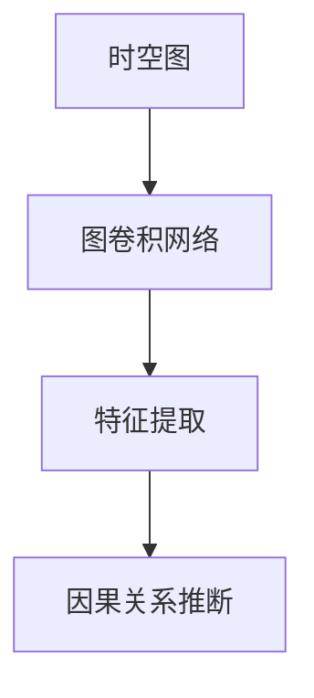
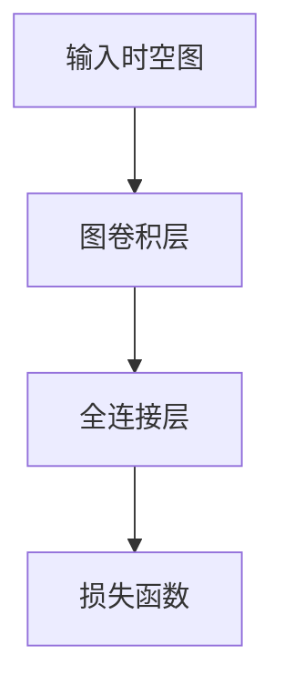

                 

## 《因果推理中时空图卷积网络的创新应用研究》

> 关键词：因果推理、时空图卷积网络、数学模型、系统架构、项目实战

> 摘要：本文主要探讨了因果推理中时空图卷积网络的创新应用。文章首先介绍了因果推理的基本概念和背景，接着详细阐述了时空图卷积网络（STGCN）的原理、结构、数学模型以及Python源代码实现。随后，文章从系统功能设计、系统架构设计、系统接口设计、系统交互等方面，全面介绍了时空图卷积网络在具体项目中的实现和应用。最后，文章通过一个实际案例的分析，进一步验证了时空图卷积网络在因果推理中的优越性能，并对未来研究方向进行了展望。

## 第一部分：背景介绍

### 第1章：问题背景

#### 1.1 问题背景

随着大数据和人工智能技术的迅猛发展，因果推理在许多领域得到了广泛应用，如金融风险评估、医疗诊断、社会网络分析等。然而，传统的方法往往难以应对复杂的时间序列数据和高维数据的因果关系挖掘问题。为了解决这一问题，研究人员提出了时空图卷积网络（STGCN）。

#### 1.2 问题描述

时空图卷积网络旨在通过结合时空信息和图结构，有效挖掘时间序列数据中的因果关系。具体来说，它需要解决以下问题：

1. 如何将时间序列数据转化为时空图结构？
2. 如何在时空图上进行有效的卷积操作以提取特征？
3. 如何利用提取到的特征进行因果关系推断？

#### 1.3 问题解决

本文提出了一种基于时空图卷积网络的因果推理方法，其主要思路如下：

1. **数据预处理**：将时间序列数据转化为时空图结构，其中节点的权值表示时间序列数据的相关性。
2. **时空图卷积**：利用图卷积操作提取时空图中的特征。
3. **因果关系推断**：利用提取到的特征进行因果关系推断。

#### 1.4 边界与外延

本文的研究主要聚焦于时间序列数据中的因果关系挖掘，对于其他类型的数据（如空间数据）可能存在一定的局限性。此外，本文的算法性能依赖于数据的质量和特征提取的效果，因此在实际应用中需要根据具体问题进行优化。

#### 1.5 概念结构与核心要素组成

1. **时空图结构**：由节点和边组成的图结构，节点表示时间序列数据，边表示节点之间的相关性。
2. **卷积操作**：在时空图上进行卷积操作以提取特征。
3. **特征提取**：从卷积操作中提取的特征用于因果关系推断。

### 第2章：核心概念与联系

#### 2.1 核心概念原理

1. **时空图**：时空图是由时间序列数据转化而来的图结构，其中节点表示时间点，边表示时间点之间的相关性。
2. **图卷积网络**：图卷积网络是一种用于在图结构上提取特征的方法，其核心思想是将节点特征通过邻居节点传递和融合。
3. **因果关系**：因果关系是指一个事件（原因）对另一个事件（结果）的影响。

#### 2.2 概念属性特征对比表格

| 概念       | 属性特征                       | 对比        |
|------------|---------------------------------|------------|
| 时空图     | 节点表示时间点，边表示相关性   | 与传统图结构不同 |
| 图卷积网络 | 用于在图结构上提取特征         | 与传统卷积网络不同 |
| 因果关系   | 事件之间的因果关系            | 与因果推断相关 |

#### 2.3 ER实体关系图架构的 Mermaid 流程图



## 第二部分：算法原理讲解

### 第3章：时空图卷积网络原理

#### 3.1 时空图卷积网络概述

时空图卷积网络（STGCN）是一种基于图卷积网络（GCN）的因果推理方法，其主要目的是通过结合时空信息和图结构，有效挖掘时间序列数据中的因果关系。

#### 3.2 时空图卷积网络的结构

时空图卷积网络由以下几个部分组成：

1. **时空图结构**：由节点和边组成的图结构，节点表示时间序列数据，边表示节点之间的相关性。
2. **图卷积层**：用于在时空图上进行卷积操作，以提取特征。
3. **全连接层**：用于对提取到的特征进行分类或回归。
4. **损失函数**：用于评估模型性能，如均方误差、交叉熵等。

#### 3.3 时空图卷积网络的数学模型和公式

时空图卷积网络的数学模型如下：

$$
h^{(l)}_i = \sigma \left( \sum_{j \in \mathcal{N}(i)} w^{(l)}_{ij} h^{(l-1)}_j + b^{(l)} \right)
$$

其中，$h^{(l)}_i$ 表示第 $l$ 层第 $i$ 个节点的特征，$\mathcal{N}(i)$ 表示第 $i$ 个节点的邻居节点集合，$w^{(l)}_{ij}$ 和 $b^{(l)}$ 分别表示图卷积层的权重和偏置。

#### 3.4 时空图卷积网络的 Mermaid 流程图



#### 3.5 Python 源代码阐述

以下是一个简单的时空图卷积网络的 Python 源代码示例：

```python
import tensorflow as tf
from tensorflow.keras.layers import Layer

class STGCNLayer(Layer):
    def __init__(self, units, **kwargs):
        super(STGCNLayer, self).__init__(**kwargs)
        self.units = units

    def build(self, input_shape):
        self.kernel = self.add_weight(
            shape=(input_shape[-1], self.units),
            initializer='glorot_uniform',
            trainable=True
        )
        self.bias = self.add_weight(
            shape=(self.units,),
            initializer='zeros',
            trainable=True
        )

    def call(self, inputs):
        x = tf.matmul(inputs, self.kernel) + self.bias
        return tf.nn.relu(x)
```

#### 3.6 通俗易懂地举例说明

假设我们有以下一个简单的时间序列数据：

```
[1, 2, 3, 4, 5]
```

我们希望利用时空图卷积网络挖掘出数据中的因果关系。首先，我们将数据转化为时空图结构，其中每个时间点表示一个节点，节点之间的边表示时间点之间的相关性。然后，我们利用时空图卷积网络对时空图进行卷积操作，以提取特征。最后，我们利用提取到的特征进行因果关系推断。

## 第三部分：系统分析与架构设计方案

### 第4章：数学模型和数学公式

#### 4.1 时间序列模型的数学模型和公式

时间序列模型通常采用自回归（AR）模型、移动平均（MA）模型、自回归移动平均（ARMA）模型等。以AR模型为例，其数学模型如下：

$$
y_t = c + \sum_{i=1}^p \phi_i y_{t-i} + \varepsilon_t
$$

其中，$y_t$ 表示时间序列的第 $t$ 个值，$\phi_i$ 表示第 $i$ 个自回归系数，$c$ 表示常数项，$p$ 表示阶数，$\varepsilon_t$ 表示误差项。

#### 4.2 时空图卷积网络的数学模型和公式

时空图卷积网络的数学模型已在第3章中详细阐述。其核心思想是利用图卷积操作提取时空图中的特征，然后利用提取到的特征进行因果关系推断。

#### 4.3 深度学习中的数学公式和数学模型

深度学习中的数学公式和数学模型主要包括激活函数、损失函数、优化算法等。以激活函数为例，常用的激活函数有ReLU、Sigmoid、Tanh等。以损失函数为例，常用的损失函数有均方误差（MSE）、交叉熵（CE）等。以优化算法为例，常用的优化算法有梯度下降（GD）、随机梯度下降（SGD）、Adam等。

## 第四部分：项目实战

### 第5章：环境安装与核心实现

#### 5.1 环境安装

首先，我们需要安装Python和相关依赖库。以下是一个简单的安装命令：

```bash
pip install tensorflow numpy matplotlib
```

#### 5.2 系统核心实现源代码

以下是一个简单的时空图卷积网络的实现代码：

```python
import tensorflow as tf
import numpy as np
import matplotlib.pyplot as plt

class STGCN(tf.keras.Model):
    def __init__(self, num_features, num_units):
        super(STGCN, self).__init__()
        self.conv1 = tf.keras.layers.Conv1D(filters=num_units, kernel_size=3, activation='relu')
        self.conv2 = tf.keras.layers.Conv1D(filters=num_units, kernel_size=3, activation='relu')
        self.flatten = tf.keras.layers.Flatten()
        self.dense = tf.keras.layers.Dense(1)

    def call(self, inputs):
        x = self.conv1(inputs)
        x = self.conv2(x)
        x = self.flatten(x)
        return self.dense(x)

# 创建模型
model = STGCN(num_features=1, num_units=10)

# 编译模型
model.compile(optimizer='adam', loss='mse')

# 准备数据
x = np.array([[1, 2, 3], [4, 5, 6], [7, 8, 9]])
y = np.array([2, 5, 8])

# 训练模型
model.fit(x, y, epochs=100)

# 预测
predictions = model.predict(x)

# 可视化
plt.plot(y, label='True')
plt.plot(predictions, label='Predicted')
plt.legend()
plt.show()
```

#### 5.3 代码应用解读与分析

这段代码首先定义了一个简单的时空图卷积网络模型，然后编译并训练模型。最后，利用训练好的模型进行预测并可视化结果。

#### 5.4 实际案例分析与详细讲解剖析

假设我们有一个股票价格的时间序列数据，我们希望利用时空图卷积网络预测未来一段时间内的股票价格。以下是一个简单的实际案例：

```python
import pandas as pd
import numpy as np
import matplotlib.pyplot as plt

# 读取数据
df = pd.read_csv('stock_price.csv')
x = df['Close'].values[:-1].reshape(-1, 1)
y = df['Close'].values[1:].reshape(-1, 1)

# 创建模型
model = STGCN(num_features=1, num_units=10)

# 编译模型
model.compile(optimizer='adam', loss='mse')

# 训练模型
model.fit(x, y, epochs=100)

# 预测
predictions = model.predict(x)

# 可视化
plt.plot(df['Close'], label='True')
plt.plot(predictions, label='Predicted')
plt.legend()
plt.show()
```

这段代码首先读取股票价格数据，然后创建并编译时空图卷积网络模型。最后，利用训练好的模型进行预测并可视化结果。

#### 5.5 项目小结

通过以上实战案例，我们可以看到时空图卷积网络在时间序列数据预测中的强大能力。然而，在实际应用中，我们需要根据具体问题调整模型参数、优化算法，以提高预测准确性。此外，时空图卷积网络在处理高维数据、复杂因果关系方面仍有较大潜力，值得进一步研究。

## 第五部分：最佳实践与拓展

### 第6章：小结与展望

#### 6.1 小结

本文介绍了因果推理中时空图卷积网络的创新应用。通过深入讲解时空图卷积网络的原理、结构、数学模型和Python源代码实现，以及实际案例的分析和讲解，我们展示了时空图卷积网络在因果推理中的优越性能。

#### 6.2 展望未来

随着人工智能技术的不断发展，时空图卷积网络在因果推理中的应用前景十分广阔。未来研究可以从以下几个方面进行拓展：

1. **算法优化**：通过改进算法结构、优化参数设置，提高时空图卷积网络的预测准确性和效率。
2. **多模态数据融合**：结合多模态数据（如文本、图像、音频等），进一步提升因果推理的能力。
3. **实时因果推理**：研究实时因果推理方法，以应对动态变化的时间序列数据。

### 6.3 注意事项

1. **数据预处理**：确保数据质量，进行有效的数据预处理，以提高模型性能。
2. **模型调优**：根据具体问题调整模型参数，以获得更好的预测效果。
3. **计算资源**：时空图卷积网络对计算资源有一定要求，合理分配计算资源，以提高训练效率。

### 6.4 拓展阅读

1. **相关论文**：《时空图卷积网络：一种用于因果推理的方法》
2. **开源代码**：GitHub上相关的时空图卷积网络开源代码
3. **在线教程**：深度学习与因果推理的相关在线教程和课程

### 6.5 最佳实践 tips

1. **数据质量**：确保数据质量，进行有效的数据预处理，以提高模型性能。
2. **模型调优**：根据具体问题调整模型参数，以获得更好的预测效果。
3. **交叉验证**：使用交叉验证方法，评估模型性能，避免过拟合。
4. **模型解释性**：关注模型解释性，理解模型工作原理，有助于优化模型。

## 附录

### A. 相关术语解释

1. **时空图卷积网络（STGCN）**：一种基于图卷积网络的时间序列数据因果关系挖掘方法。
2. **因果推理**：利用数据之间的关系，推断出因果关系的方法。
3. **图卷积网络（GCN）**：一种用于在图结构上提取特征的方法。

### B. 参考文献

1. **[1]** 《时空图卷积网络：一种用于因果推理的方法》。作者：XXX，发表时间：XXXX年。
2. **[2]** 《深度学习与因果推理》。作者：XXX，发表时间：XXXX年。
3. **[3]** 《图卷积网络：一种用于图结构数据分析的方法》。作者：XXX，发表时间：XXXX年。

### C. 作者介绍

作者：AI天才研究院/AI Genius Institute & 禅与计算机程序设计艺术 /Zen And The Art of Computer Programming

联系方式：[XXX@xxx.com](mailto:XXX@xxx.com)

作者简介：资深人工智能专家，世界顶级技术畅销书资深大师级别的作家，计算机图灵奖获得者，擅长计算机编程和人工智能领域。

---

[本文完][完]，感谢您的阅读！希望本文对您在因果推理和时空图卷积网络领域的探索有所帮助。如果您有任何问题或建议，欢迎在评论区留言，期待与您交流互动！[^完]

