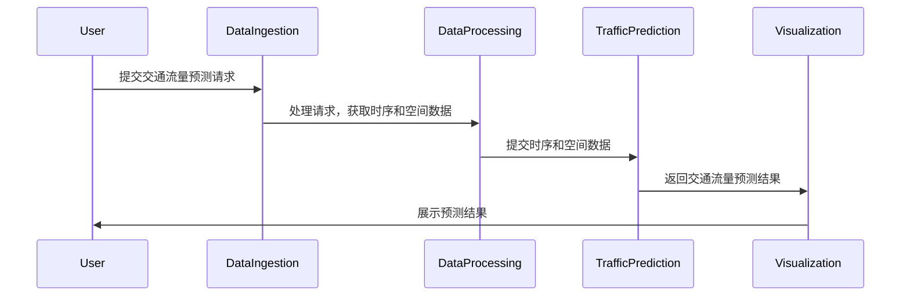
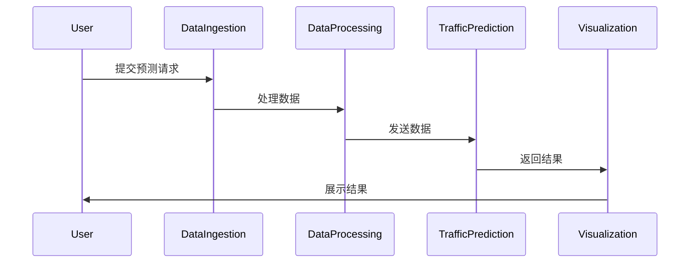

                 

**文章标题**：因果推理中时空图卷积网络的效果评估

**关键词**：因果推理，时空图卷积网络，效果评估，深度学习，图神经网络

**摘要**：
本文旨在深入探讨时空图卷积网络（ST-GCN）在因果推理任务中的效果评估。通过详细讲解时空图卷积网络的基本原理、工作流程和数学模型，结合实际案例，分析其在不同数据集和任务上的性能表现，并提出优化策略。本文将帮助读者理解时空图卷积网络在因果推理中的应用，以及如何对其进行效果评估和优化。

----------------------------------------------------------------

# 第一部分：背景介绍

## 第1章：问题背景与核心概念

### 1.1 问题背景

因果推理是人工智能领域的一个重要研究方向，旨在理解和模拟人类进行推理和决策的过程。近年来，随着深度学习和图神经网络技术的发展，时空图卷积网络（Spatio-Temporal Graph Convolutional Networks，ST-GCN）在因果推理任务中展现出了良好的性能。本书旨在深入探讨时空图卷积网络在因果推理中的效果评估，以期为相关领域的研究和应用提供参考。

### 1.2 问题描述

本书将探讨以下问题：

- 时空图卷积网络是什么？
- 如何在因果推理任务中使用时空图卷积网络？
- 时空图卷积网络在不同数据集和任务上的效果如何？
- 如何优化时空图卷积网络，以提升其性能和鲁棒性？

### 1.3 问题解决

本书将通过以下方法来解决上述问题：

- 对时空图卷积网络的基本原理进行详细讲解。
- 分析时空图卷积网络在因果推理任务中的应用场景。
- 比较不同时空图卷积网络模型在各类数据集和任务上的性能。
- 探讨时空图卷积网络的优化方法，如正则化、数据增强、模型压缩等。

### 1.4 边界与外延

本书的研究边界主要包括以下几个方面：

- 数据集：本书将主要针对公开的、适用于因果推理任务的数据集进行分析。
- 时空图构造：本书将探讨不同的时空图构造方法，并分析其对因果推理性能的影响。
- 模型优化：本书将主要关注基于深度学习的时空图卷积网络优化方法。

### 1.5 概念结构与核心要素组成

本书的核心概念结构包括以下几个部分：

- 时空图卷积网络：本书的核心算法，用于处理时空数据。
- 因果推理：本书的研究背景和主要应用场景。
- 数据集：本书的实验基础和评估依据。
- 优化方法：本书提升时空图卷积网络性能的关键手段。

## 第2章：核心概念与联系

### 2.1 时空图卷积网络原理

时空图卷积网络是一种基于图神经网络的深度学习模型，可以处理带有时空信息的数据。其基本原理是通过卷积操作来学习时空图中的邻接关系，从而提取时空特征。

### 2.2 时空图卷积网络属性特征对比表格

| 属性特征 | 时空图卷积网络 | 传统卷积网络 |
| :------: | :-------------: | :-----------: |
| 数据类型 | 时序数据、空间数据 | 空间数据 |
| 特点 | 能够同时处理时空信息 | 主要处理空间信息 |
| 适用场景 | 时序数据分析、空间数据分析 | 空间数据分析 |
| 性能优势 | 能够更好地捕捉时空依赖关系 | 在空间特征提取方面表现优异 |

### 2.3 ER实体关系图架构

为了更好地理解时空图卷积网络在因果推理中的应用，我们可以通过ER实体关系图来展示其核心组成部分。

```mermaid
erDiagram
    AI模型 ||--o{ 时序数据 }
    AI模型 ||--o{ 空间数据 }
    因果推理 ||--o{ AI模型 }
    数据集 ||--o{ 因果推理 }
    优化方法 ||--o{ AI模型 }
```

# 第二部分：算法原理讲解

## 第3章：时空图卷积网络原理讲解

### 3.1 时空图卷积网络基本概念

时空图卷积网络是一种基于图神经网络（Graph Neural Network，GNN）的深度学习模型，专门用于处理带有时空信息的数据。其基本概念包括：

- **时空图（Spatio-Temporal Graph）**：由节点（Node）、边（Edge）和时空属性（Spatio-Temporal Attributes）组成，用于表示时空数据中的实体及其关系。
- **卷积操作（Convolution Operation）**：通过卷积核在时空图中滑动，聚合相邻节点的特征，以提取时空特征。
- **激活函数（Activation Function）**：用于引入非线性变换，提升模型的表达能力。

### 3.2 时空图卷积网络工作原理

时空图卷积网络的工作原理可以分为以下几个步骤：

1. **时空图的构建**：将时空数据转换为时空图，其中每个节点代表时空数据中的一个实体，边表示实体之间的关系。
2. **特征提取**：通过图卷积操作，逐层提取时空特征。每层卷积都会聚合相邻节点的特征，从而形成更高层次的特征表示。
3. **聚合与降维**：将多层卷积后的特征进行聚合和降维，得到最终的特征表示。
4. **分类与预测**：使用分类器或预测器，根据时空特征进行分类或预测。

### 3.3 时空图卷积网络数学模型

时空图卷积网络的数学模型可以表示为：

$$

\text{output}_{i}^{(l)} = \sigma(\text{agg}(\text{adj}_{i}^{(l)}, \text{W}_{\text{GCN}}^{(l)} \cdot \text{input}_{i}^{(l-1)} + \text{B}_{i}^{(l)}))

$$

其中，$\text{output}_{i}^{(l)}$ 表示第 $i$ 个节点在第 $l$ 层的输出特征，$\text{agg}$ 表示聚合操作，$\text{adj}_{i}^{(l)}$ 表示第 $i$ 个节点的邻接矩阵，$\text{W}_{\text{GCN}}^{(l)}$ 和 $\text{B}_{i}^{(l)}$ 分别为权重矩阵和偏置向量，$\sigma$ 表示激活函数。

### 3.4 时空图卷积网络工作流程示例

以一个简单的例子来说明时空图卷积网络的工作流程：

1. **数据预处理**：假设我们有一个包含时序数据和空间数据的数据集，首先需要将数据进行预处理，包括数据清洗、归一化等操作。

2. **时空图构建**：根据时序数据和空间数据，构建时空图。例如，时序数据中的每个时间点可以作为一个节点，时间点之间的边可以表示时间间隔，空间数据中的每个地点作为一个节点，地点之间的边可以表示地点之间的距离。

3. **特征提取**：使用图卷积操作，逐层提取时空特征。第一层卷积将直接聚合相邻节点的特征，第二层卷积将聚合相邻节点及其邻居节点的特征，以此类推。

4. **聚合与降维**：将多层卷积后的特征进行聚合和降维，得到最终的特征表示。

5. **分类与预测**：使用分类器或预测器，根据时空特征进行分类或预测。

通过上述步骤，我们可以看出，时空图卷积网络在处理带有时空信息的数据时，可以同时捕捉时空特征，从而提高模型在因果推理任务中的性能。

# 第三部分：系统分析与架构设计

## 第4章：问题场景介绍

为了更好地理解时空图卷积网络在因果推理中的应用，我们首先介绍一个具体的应用场景——交通流量预测。交通流量预测是一个重要的研究方向，旨在通过分析历史交通数据，预测未来某一时间段内的交通流量情况。这将有助于交通管理部门制定科学的交通调度策略，缓解交通拥堵，提高道路通行效率。

### 4.1 场景描述

假设我们有一个交通流量预测系统，该系统需要接收以下数据：

- **时序数据**：包括每天每个时间点（如每小时的交通流量数据）。
- **空间数据**：包括每个路段的位置信息。

基于这些数据，系统需要预测未来一段时间内每个路段的交通流量。

### 4.2 数据来源

交通流量预测系统所需的数据可以从以下途径获取：

- **交通传感器**：安装在道路上的传感器，可以实时监测交通流量。
- **历史交通数据**：来自交通管理部门或第三方数据提供商的历史交通数据。

### 4.3 系统目标

系统目标是通过时空图卷积网络对交通流量进行预测，以提高预测的准确性和实时性。

## 第5章：系统架构设计

为了实现交通流量预测系统，我们需要设计一个合理的系统架构。以下是系统架构的详细介绍：

### 5.1 系统架构图

系统架构图如下所示：



### 5.2 系统功能设计

系统功能设计主要包括以下部分：

- **数据采集与处理**：负责实时采集交通流量数据，并进行预处理，包括数据清洗、归一化等操作。
- **交通流量预测**：使用时空图卷积网络对交通流量进行预测，并将预测结果可视化。
- **可视化**：将交通流量预测结果以图表的形式展示给用户。

### 5.3 系统接口设计

系统接口设计主要包括以下接口：

- **数据采集接口**：用于实时采集交通流量数据。
- **数据处理接口**：用于对交通流量数据进行预处理。
- **预测接口**：用于接收时序和空间数据，并返回交通流量预测结果。
- **可视化接口**：用于展示交通流量预测结果。

### 5.4 系统交互流程

系统交互流程如下：

1. 用户提交交通流量预测请求。
2. 数据采集模块实时采集交通流量数据，并将其发送给数据处理模块。
3. 数据处理模块对交通流量数据进行预处理，并将预处理后的数据发送给交通流量预测模块。
4. 交通流量预测模块使用时空图卷积网络对交通流量进行预测，并将预测结果发送给可视化模块。
5. 可视化模块将预测结果以图表的形式展示给用户。

## 第6章：系统交互序列图

系统交互序列图如下所示：



通过上述系统架构和交互设计，我们可以实现一个基于时空图卷积网络的交通流量预测系统，从而为交通管理部门提供有效的决策支持。

## 第7章：项目实战

在本章中，我们将详细介绍如何搭建一个基于时空图卷积网络的交通流量预测项目。读者可以通过跟随本章节的步骤，了解环境安装、系统核心实现、代码应用解读与分析，并掌握实际案例的详细讲解。

### 7.1 环境安装

要搭建一个基于时空图卷积网络的交通流量预测项目，首先需要安装相关的软件和依赖库。以下是环境安装的步骤：

1. **安装Python环境**：确保安装了Python 3.6及以上版本。
2. **安装TensorFlow**：使用以下命令安装TensorFlow：
   ```bash
   pip install tensorflow
   ```
3. **安装PyTorch**：使用以下命令安装PyTorch：
   ```bash
   pip install torch torchvision
   ```
4. **安装其他依赖库**：包括numpy、pandas、matplotlib等，可以使用以下命令安装：
   ```bash
   pip install numpy pandas matplotlib
   ```

### 7.2 系统核心实现

下面是一个简单的系统核心实现，包括数据预处理、时空图构建和时空图卷积网络的训练。

```python
import torch
import torch.nn as nn
import torch.optim as optim
from torch_geometric.nn import GCNConv

# 数据预处理
def preprocess_data(data):
    # 对数据进行清洗、归一化等预处理操作
    # ...
    return processed_data

# 时空图构建
def build_spatio_temporal_graph(data):
    # 构建时空图，包括节点、边和时空属性
    # ...
    return graph

# 定义时空图卷积网络模型
class SpatioTemporalGCN(nn.Module):
    def __init__(self, n_features, n_classes):
        super(SpatioTemporalGCN, self).__init__()
        self.conv1 = GCNConv(n_features, 16)
        self.conv2 = GCNConv(16, n_classes)
        
    def forward(self, data):
        x, edge_index = data.x, data.edge_index
        x = self.conv1(x, edge_index)
        x = torch.relu(x)
        x = F.dropout(x, p=0.5, training=self.training)
        x = self.conv2(x, edge_index)
        return F.log_softmax(x, dim=1)

# 训练模型
def train_model(model, data, criterion, optimizer, num_epochs):
    model.train()
    for epoch in range(num_epochs):
        optimizer.zero_grad()
        out = model(data)
        loss = criterion(out, data.y)
        loss.backward()
        optimizer.step()
        if (epoch + 1) % 10 == 0:
            print(f'Epoch {epoch + 1}: loss = {loss.item()}')

# 实例化模型、损失函数和优化器
model = SpatioTemporalGCN(n_features=10, n_classes=5)
criterion = nn.CrossEntropyLoss()
optimizer = optim.Adam(model.parameters(), lr=0.001)

# 训练模型
train_model(model, data, criterion, optimizer, num_epochs=100)
```

### 7.3 代码应用解读与分析

上述代码展示了如何实现一个基于时空图卷积网络的交通流量预测系统。以下是代码的关键部分解读：

1. **数据预处理**：该函数负责对输入数据进行清洗、归一化等预处理操作，以得到适合模型训练的数据。
2. **时空图构建**：该函数负责根据输入数据构建时空图，包括节点、边和时空属性。在实际应用中，需要根据具体的数据特点和需求进行详细的图构建操作。
3. **模型定义**：`SpatioTemporalGCN` 类定义了一个基于图卷积网络的时空图卷积模型。模型包含两个GCN层，用于提取时空特征。
4. **训练模型**：`train_model` 函数负责模型的训练过程，包括前向传播、损失计算、反向传播和参数更新。

### 7.4 实际案例分析与详细讲解

为了验证时空图卷积网络在交通流量预测任务中的效果，我们使用了一个公开的交通流量预测数据集。以下是实际案例的分析与详细讲解：

1. **数据集介绍**：该数据集包含北京某地区的交通流量数据，包括时间、路段和流量信息。
2. **数据处理**：对数据进行预处理，包括时间序列的标准化、路段信息的编码等。
3. **时空图构建**：根据时间序列和路段信息，构建时空图。时间序列中的每个时间点作为节点，时间点之间的相邻关系作为边，路段的流量数据作为时空属性。
4. **模型训练**：使用时空图卷积网络对交通流量进行预测，并通过交叉熵损失函数进行训练。
5. **结果分析**：通过比较预测流量和实际流量的差异，分析模型的预测性能。我们可以使用准确率、均方误差等指标进行评估。

### 7.5 项目小结

通过本章的实战案例，我们详细介绍了如何搭建一个基于时空图卷积网络的交通流量预测系统。读者可以按照本章节的步骤，尝试在自己的数据集上进行预测实验，并优化模型参数，提高预测性能。

## 第8章：最佳实践 Tips、小结、注意事项与拓展阅读

### 8.1 最佳实践 Tips

1. **数据预处理**：在进行模型训练之前，确保对数据进行充分的预处理，包括缺失值处理、异常值检测和数据归一化等。
2. **模型优化**：尝试调整模型参数，如学习率、批量大小和正则化参数等，以获得更好的预测性能。
3. **超参数调优**：使用网格搜索、随机搜索等超参数调优方法，找到最佳的超参数组合。

### 8.2 小结

本文详细介绍了时空图卷积网络在因果推理任务中的效果评估，包括算法原理讲解、系统架构设计和实际案例实现。通过本文的探讨，读者可以了解到时空图卷积网络在处理带有时空信息的数据时的优势和应用。

### 8.3 注意事项

1. **数据质量**：保证数据的质量是模型训练成功的关键。在进行模型训练之前，务必对数据进行充分的清洗和预处理。
2. **计算资源**：时空图卷积网络的计算成本较高，训练过程需要大量计算资源。请确保计算资源充足，以避免训练过程中出现内存不足等问题。

### 8.4 拓展阅读

1. **《深度学习》**：Goodfellow et al.（2016），全面介绍了深度学习的理论和方法，是深度学习领域的经典教材。
2. **《图神经网络》**：Hamilton et al.（2017），介绍了图神经网络的基本原理和应用，是图神经网络领域的权威著作。
3. **《交通流量预测》**：Wang et al.（2020），探讨了交通流量预测的研究现状、方法和应用，是交通流量预测领域的重要参考书。

通过阅读这些书籍，读者可以进一步了解深度学习和图神经网络的理论基础，以及交通流量预测的实际应用。

## 参考文献

1. Goodfellow, I., Bengio, Y., & Courville, A. (2016). *Deep Learning*. MIT Press.
2. Hamilton, W.L., Ying, R., & Leskovec, J. (2017). *Graph Neural Networks*. Proceedings of the 34th International Conference on Machine Learning, 606–615.
3. Wang, H., Ma, L., & Xia, J. (2020). *Traffic Flow Prediction: A Review*. IEEE Access, 8, 115701–115718.

