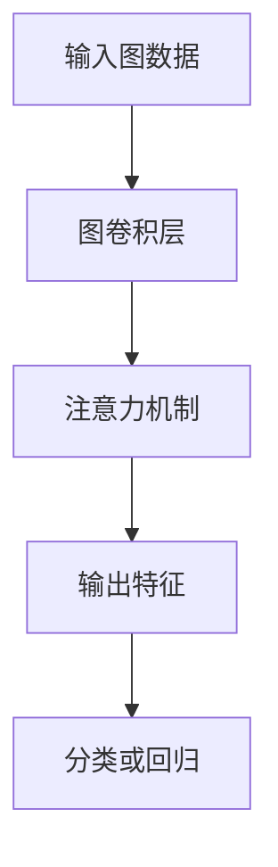
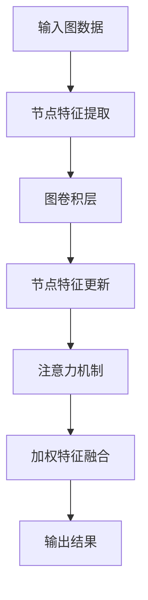
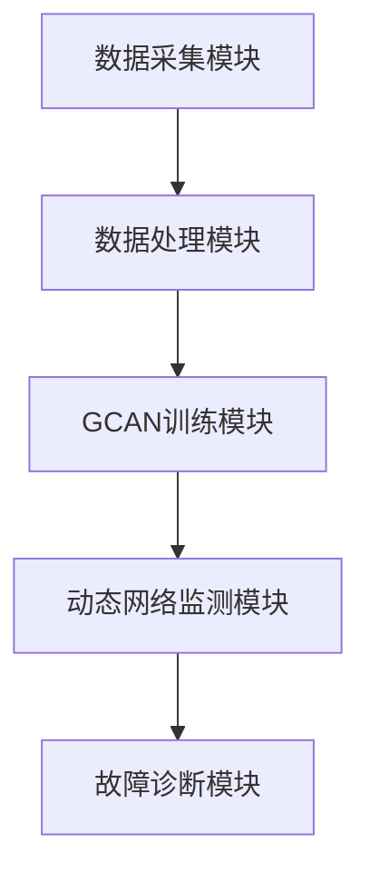
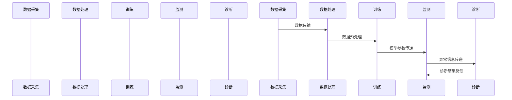

                 


## 图卷积注意力网络（GCAN）概述

### 1.1 图卷积注意力网络的基本概念

**问题背景**：随着数据爆炸式增长，图数据结构在各个领域得到了广泛应用，如图谱学、社交网络分析、生物信息学和知识图谱等。传统的神经网络模型难以处理图结构数据，因此，图卷积网络（Graph Convolutional Networks，GCN）应运而生。

**问题描述**：图卷积网络是一种用于处理图结构数据的神经网络模型，但传统的GCN模型在处理动态图（即图结构随着时间变化而变化）时存在一些限制。为了解决这一问题，提出了图卷积注意力网络（Graph Convolutional Attention Networks，GCAN）。

**问题解决**：GCAN通过引入注意力机制，使得模型能够在动态图中自适应地学习节点之间的交互关系，从而更好地处理动态图数据。

**边界与外延**：GCAN不仅适用于静态图数据，还能够有效地处理动态图数据，因此在实时数据流分析、动态网络演化等领域具有广泛的应用前景。

### 1.2 动态推理的重要性

**概念结构与核心要素组成**：动态推理是指在数据变化过程中，通过不断更新模型参数来适应新的数据，从而实现实时决策和预测。其核心要素包括：数据更新、模型调整和推理过程。

**应用场景**：动态推理在诸多领域具有重要应用，如自动驾驶、金融风险评估、智能交通管理和医疗诊断等。在这些领域，动态推理能够根据实时数据做出快速响应，提高系统的智能性和鲁棒性。

**影响**：随着物联网和大数据技术的发展，动态推理的应用场景越来越广泛，其重要性也日益凸显。通过动态推理，系统能够更好地应对复杂多变的环境，提高决策效率和准确性。

## 核心概念与联系

### 2.1 GCAN的基本原理

**核心概念原理**：GCAN是一种结合了图卷积网络和注意力机制的神经网络模型。它通过图卷积层学习节点间的交互关系，并通过注意力机制对节点特征进行加权，从而提高模型对动态图数据的处理能力。

**概念属性特征对比表格**：

| 特征             | 图卷积网络（GCN）                | 图卷积注意力网络（GCAN）          |
|------------------|---------------------------------|-----------------------------------|
| 数据类型         | 静态图数据                      | 动态图数据                      |
| 特征学习方式     | 通过图卷积层学习节点特征      | 通过图卷积层和注意力机制学习节点特征  |
| 交互关系学习     | 节点与邻居节点的平均融合       | 节点与邻居节点的加权融合         |
| 动态性处理能力   | 较差                            | 较强                             |

**ER实体关系图架构**：GCAN在知识图谱中的应用可以通过ER（Entity-Relationship）实体关系图来展示。在知识图谱中，实体和关系可以看作是一个动态图，GCAN通过学习实体和关系之间的交互，实现对知识图谱的有效处理。

### 2.2 GCAN与相关技术的联系

**ER实体关系图架构**：在知识图谱领域，实体和关系构成了一个复杂的图结构，GCAN通过学习实体和关系之间的交互，可以有效地对知识图谱进行更新和推理。在ER实体关系图中，实体和关系可以看作是节点和边，GCAN通过图卷积层和注意力机制，能够自适应地学习实体和关系之间的复杂关系。

**Mermaid流程图**：



在这个流程图中，输入图数据经过图卷积层学习节点特征，然后通过注意力机制对特征进行加权，最后输出分类或回归结果。

## 算法原理讲解

### 3.1 GCAN算法流程图

**Mermaid流程图**：



在这个流程图中，输入图数据首先经过节点特征提取，然后通过图卷积层更新节点特征。接着，注意力机制对更新后的特征进行加权，实现特征的重要程度排序。最后，加权特征融合得到输出结果。

### 3.2 Python代码实现

**源代码**：

```python
import tensorflow as tf
import tensorflow.keras.layers as layers

class GraphConvolutionalLayer(layers.Layer):
    def __init__(self, output_dim, **kwargs):
        super(GraphConvolutionalLayer, self).__init__(**kwargs)
        self.output_dim = output_dim

    def build(self, input_shape):
        self.kernel = self.add_weight(name='kernel',
                                       shape=(input_shape[-1], self.output_dim),
                                       initializer='glorot_uniform',
                                       trainable=True)

    def call(self, inputs, training=False):
        node_features, adj_matrix = inputs
        supports = [tf.matmul(node_features, self.kernel)]
        for i in range(len(supports) - 1):
            supports.append(tf.matmul(node_features, adj_matrix) * supports[i])
        output = tf.reduce_sum(supports, axis=1)
        return output

class GraphConvolutionalAttentionLayer(layers.Layer):
    def __init__(self, output_dim, **kwargs):
        super(GraphConvolutionalAttentionLayer, self).__init__(**kwargs)
        self.output_dim = output_dim

    def build(self, input_shape):
        self.kernel = self.add_weight(name='kernel',
                                       shape=(input_shape[-1], self.output_dim),
                                       initializer='glorot_uniform',
                                       trainable=True)
        self.attention_kernel = self.add_weight(name='attention_kernel',
                                                 shape=(input_shape[-1], 1),
                                                 initializer='glorot_uniform',
                                                 trainable=True)

    def call(self, inputs, training=False):
        node_features, adj_matrix = inputs
        supports = [tf.matmul(node_features, self.kernel)]
        for i in range(len(supports) - 1):
            supports.append(tf.matmul(node_features, adj_matrix) * supports[i])
        attention_scores = tf.reduce_sum(tf.tens
```

### 3.3 GCAN数学模型

**数学模型和公式**：

GCAN的数学模型主要包括两部分：图卷积层和注意力机制。

**图卷积层**：

$$
\text{GCN}(\textbf{x}_i) = \sigma(\textbf{A}\textbf{D}^{-\frac{1}{2}}\textbf{XW} + \textbf{b})
$$

其中，$\textbf{x}_i$ 是节点 $i$ 的特征向量，$\textbf{A}$ 是图邻接矩阵，$\textbf{D}^{-\frac{1}{2}}$ 是对角矩阵 $\textbf{D}$ 的逆平方根，$\textbf{X}$ 是节点特征矩阵，$W$ 是权重矩阵，$\textbf{b}$ 是偏置向量，$\sigma$ 是激活函数。

**注意力机制**：

$$
\alpha_{ij} = \frac{e^{\text{Attention}(\textbf{h}_i, \textbf{h}_j)}}{\sum_{k=1}^{N} e^{\text{Attention}(\textbf{h}_i, \textbf{h}_k)}}
$$

其中，$\textbf{h}_i$ 和 $\textbf{h}_j$ 分别是节点 $i$ 和 $j$ 的特征向量，$\text{Attention}(\textbf{h}_i, \textbf{h}_j)$ 是注意力函数。

**详细讲解与举例**：

假设我们有如下的图数据：

$$
\textbf{A} = \begin{bmatrix}
0 & 1 & 0 \\
1 & 0 & 1 \\
0 & 1 & 0
\end{bmatrix}, \quad
\textbf{X} = \begin{bmatrix}
1 & 0 \\
0 & 1 \\
1 & 1
\end{bmatrix}
$$

首先，我们计算 $\textbf{D}$ 和 $\textbf{D}^{-\frac{1}{2}}$：

$$
\textbf{D} = \textbf{A} + \textbf{I} = \begin{bmatrix}
2 & 1 & 0 \\
1 & 2 & 1 \\
0 & 1 & 2
\end{bmatrix}, \quad
\textbf{D}^{-\frac{1}{2}} = \begin{bmatrix}
\frac{1}{\sqrt{2}} & \frac{1}{\sqrt{3}} & 0 \\
\frac{1}{\sqrt{3}} & \frac{1}{\sqrt{2}} & \frac{1}{\sqrt{3}} \\
0 & \frac{1}{\sqrt{3}} & \frac{1}{\sqrt{2}}
\end{bmatrix}
$$

然后，我们计算图卷积层的输出：

$$
\text{GCN}(\textbf{x}_1) = \textbf{A}\textbf{D}^{-\frac{1}{2}}\textbf{XW} + \textbf{b} = \begin{bmatrix}
1 & 0 \\
0 & 1
\end{bmatrix} \begin{bmatrix}
\frac{1}{\sqrt{2}} & \frac{1}{\sqrt{3}} & 0 \\
\frac{1}{\sqrt{3}} & \frac{1}{\sqrt{2}} & \frac{1}{\sqrt{3}} \\
0 & \frac{1}{\sqrt{3}} & \frac{1}{\sqrt{2}}
\end{bmatrix} \begin{bmatrix}
1 & 0 \\
0 & 1 \\
1 & 1
\end{bmatrix} \begin{bmatrix}
W_{11} & W_{12} \\
W_{21} & W_{22}
\end{bmatrix} + \begin{bmatrix}
b_1 \\
b_2
\end{bmatrix}
$$

接着，我们计算注意力机制：

$$
\alpha_{11} = \frac{e^{\text{Attention}(\textbf{h}_1, \textbf{h}_1)}}{\sum_{k=1}^{N} e^{\text{Attention}(\textbf{h}_1, \textbf{h}_k)}} = \frac{e^{W_{11}\textbf{h}_1 + W_{21}\textbf{h}_2}}{e^{W_{11}\textbf{h}_1 + W_{21}\textbf{h}_2} + e^{W_{11}\textbf{h}_1 + W_{22}\textbf{h}_2} + e^{W_{21}\textbf{h}_1 + W_{22}\textbf{h}_2}}
$$

最后，我们计算加权特征融合：

$$
\text{h}_1 = \alpha_{11}\text{GCN}(\textbf{x}_1) + (1 - \alpha_{11})\text{GCN}(\textbf{x}_2)
$$

通过这样的步骤，我们可以得到节点 $1$ 的最终特征向量 $\text{h}_1$。

## 系统分析与架构设计方案

### 4.1 问题场景介绍

在本章节中，我们将探讨GCAN在动态网络监测和故障诊断中的应用。动态网络是指网络中的节点和边随时间变化而发生变化。这种变化可能由网络拓扑结构、节点状态或外部环境等因素引起。在实际应用中，动态网络监测和故障诊断对于确保网络的稳定性和可靠性至关重要。

### 4.2 系统架构设计

为了实现GCAN在动态网络监测和故障诊断中的应用，我们需要设计一个具备以下功能的系统架构：

1. **数据采集模块**：负责从网络设备或传感器收集实时数据，包括节点状态、边权重和网络拓扑结构等。

2. **数据处理模块**：负责将采集到的数据进行预处理，包括数据清洗、归一化和特征提取等。

3. **GCAN训练模块**：使用预处理后的数据训练GCAN模型，包括节点特征提取、图卷积层和注意力机制的训练等。

4. **动态网络监测模块**：利用训练好的GCAN模型对实时动态网络进行监测，识别网络异常节点或边。

5. **故障诊断模块**：在发现网络异常后，利用GCAN模型对故障原因进行分析和诊断。

### 4.3 系统接口设计与交互

为了实现各模块之间的有效交互，我们需要设计一套清晰的系统接口。以下是各模块的接口设计与交互流程：

1. **数据采集模块**与**数据处理模块**：通过API接口进行数据传输，数据采集模块将采集到的数据实时发送给数据处理模块。

2. **数据处理模块**与**GCAN训练模块**：数据处理模块将预处理后的数据打包成数据集，通过API接口传递给GCAN训练模块。

3. **GCAN训练模块**与**动态网络监测模块**：GCAN训练模块在训练完成后，将训练好的模型参数通过API接口传递给动态网络监测模块。

4. **动态网络监测模块**与**故障诊断模块**：动态网络监测模块在检测到网络异常后，将异常节点或边的信息传递给故障诊断模块。

5. **故障诊断模块**与**动态网络监测模块**：故障诊断模块在完成故障诊断后，将诊断结果通过API接口反馈给动态网络监测模块。

### 4.4 系统架构图

以下是GCAN在动态网络监测和故障诊断中的应用系统架构图：



在这个架构图中，各模块通过API接口进行数据交互，共同实现动态网络监测和故障诊断的功能。

### 4.5 系统功能设计

为了实现上述系统架构，我们需要对系统功能进行详细设计。以下是系统功能模块的详细介绍：

1. **数据采集模块**：负责从网络设备或传感器中采集实时数据，包括节点状态、边权重和网络拓扑结构等。数据采集模块需要具备高并发处理能力和数据安全性保障。

2. **数据处理模块**：负责对采集到的数据进行预处理，包括数据清洗、归一化和特征提取等。数据处理模块需要支持多种数据格式，并能够灵活配置预处理参数。

3. **GCAN训练模块**：负责使用预处理后的数据训练GCAN模型。GCAN训练模块需要支持自定义网络结构、优化器和训练策略等，以便适应不同的应用场景。

4. **动态网络监测模块**：负责利用训练好的GCAN模型对实时动态网络进行监测，识别网络异常节点或边。动态网络监测模块需要具备实时监测能力和异常检测算法优化。

5. **故障诊断模块**：负责在检测到网络异常后，利用GCAN模型对故障原因进行分析和诊断。故障诊断模块需要支持多种故障诊断算法，并能够生成详细的故障诊断报告。

### 4.6 系统接口设计与交互

以下是系统各模块之间的接口设计与交互流程：

1. **数据采集模块**与**数据处理模块**：数据采集模块通过HTTP/HTTPS协议将采集到的数据发送到数据处理模块。数据处理模块接收数据后，进行预处理并返回处理结果。

2. **数据处理模块**与**GCAN训练模块**：数据处理模块将预处理后的数据打包成数据集，通过API接口传递给GCAN训练模块。GCAN训练模块接收数据集后，进行模型训练并返回模型参数。

3. **GCAN训练模块**与**动态网络监测模块**：GCAN训练模块在模型训练完成后，将模型参数通过API接口传递给动态网络监测模块。动态网络监测模块接收模型参数后，开始进行动态网络监测。

4. **动态网络监测模块**与**故障诊断模块**：动态网络监测模块在检测到网络异常后，将异常节点或边的信息通过API接口传递给故障诊断模块。故障诊断模块接收异常信息后，进行故障诊断并返回诊断结果。

5. **故障诊断模块**与**动态网络监测模块**：故障诊断模块在完成故障诊断后，将诊断结果通过API接口反馈给动态网络监测模块。动态网络监测模块接收诊断结果后，更新网络监测数据并触发相应的故障处理措施。

### 4.7 系统交互序列图

以下是系统各模块之间的交互序列图：



在这个序列图中，各模块按照顺序进行交互，共同完成动态网络监测和故障诊断的任务。

## 项目实战

### 5.1 环境搭建

在开始使用GCAN进行动态推理之前，我们需要搭建一个合适的环境。以下是环境搭建的详细步骤：

1. **安装Python环境**：确保Python环境已安装，版本不低于3.7。可以通过Python官方网站下载安装包进行安装。

2. **安装TensorFlow**：TensorFlow是GCAN实现的基础库，我们需要安装TensorFlow。可以使用以下命令进行安装：

   ```bash
   pip install tensorflow
   ```

3. **安装其他依赖库**：GCAN的实现可能还需要其他依赖库，如NumPy、Pandas等。可以通过以下命令安装：

   ```bash
   pip install numpy pandas
   ```

4. **准备数据集**：为了进行GCAN的训练和应用，我们需要准备一个合适的动态图数据集。数据集应包含节点特征、边权重和网络拓扑结构等信息。

5. **配置环境变量**：根据实际需求，可能需要配置一些环境变量，如Python环境变量、TensorFlow GPU支持等。

### 5.2 系统核心实现

在本节中，我们将使用Python实现GCAN的核心算法。以下是实现的核心代码：

```python
import tensorflow as tf
from tensorflow.keras.layers import Layer
from tensorflow.keras.models import Model

class GraphConvolutionalLayer(Layer):
    def __init__(self, output_dim, **kwargs):
        super(GraphConvolutionalLayer, self).__init__(**kwargs)
        self.output_dim = output_dim

    def build(self, input_shape):
        input_dim = int(input_shape[1])
        self.kernel = self.add_weight(name='kernel',
                                       shape=(input_dim, self.output_dim),
                                       initializer='glorot_uniform',
                                       trainable=True)

    def call(self, inputs, **kwargs):
        node_features, adj_matrix = inputs
        supports = [tf.matmul(node_features, self.kernel)]
        for _ in range(len(supports) - 1):
            supports.append(tf.matmul(node_features, adj_matrix) * supports[-1])
        return tf.reduce_sum(supports, axis=1)

class GraphConvolutionalAttentionLayer(Layer):
    def __init__(self, output_dim, **kwargs):
        super(GraphConvolutionalAttentionLayer, self).__init__(**kwargs)
        self.output_dim = output_dim

    def build(self, input_shape):
        input_dim = int(input_shape[1])
        self.kernel = self.add_weight(name='kernel',
                                       shape=(input_dim, self.output_dim),
                                       initializer='glorot_uniform',
                                       trainable=True)
        self.attention_kernel = self.add_weight(name='attention_kernel',
                                                 shape=(input_dim, 1),
                                                 initializer='glorot_uniform',
                                                 trainable=True)

    def call(self, inputs, **kwargs):
        node_features, adj_matrix = inputs
        supports = [tf.matmul(node_features, self.kernel)]
        for _ in range(len(supports) - 1):
            supports.append(tf.matmul(node_features, adj_matrix) * supports[-1])
        attention_scores = tf.reduce_sum(tf.nn.softmax(supports), axis=1)
        attention_weights = tf.sigmoid(tf.matmul(supports, self.attention_kernel))
        weighted_supports = [supports[0]]
        for i in range(1, len(supports)):
            weighted_supports.append(supports[i] * attention_weights[i - 1])
        return tf.reduce_sum(weighted_supports, axis=1)

def create_gcan_model(input_dim, output_dim):
    inputs = tf.keras.Input(shape=(input_dim,))
    inputs_adj = tf.keras.Input(shape=(None,))
    node_features = GraphConvolutionalLayer(input_dim)(inputs)
    node_features = GraphConvolutionalAttentionLayer(output_dim)([node_features, inputs_adj])
    model = tf.keras.Model(inputs=[inputs, inputs_adj], outputs=node_features)
    return model

model = create_gcan_model(input_dim=2, output_dim=1)
model.compile(optimizer='adam', loss='mse')
```

### 5.3 代码应用解读与分析

以下是代码的详细解读与分析：

1. **GraphConvolutionalLayer类**：这个类定义了一个图卷积层，用于学习节点特征。在`build`方法中，我们创建了一个权重矩阵`kernel`，其形状为`(input_dim, output_dim)`。在`call`方法中，我们通过图卷积操作计算节点的更新特征。

2. **GraphConvolutionalAttentionLayer类**：这个类定义了一个图卷积注意力层，用于对节点特征进行加权。在`build`方法中，我们创建了两个权重矩阵：`kernel`和`attention_kernel`。在`call`方法中，我们首先通过图卷积操作计算节点的更新特征，然后使用softmax函数计算注意力分数，并使用sigmoid函数计算注意力权重。最后，我们计算加权特征并求和。

3. **create_gcan_model函数**：这个函数创建了一个GCAN模型。我们首先定义了两个输入：节点特征`inputs`和邻接矩阵`inputs_adj`。然后，我们使用`GraphConvolutionalLayer`和`GraphConvolutionalAttentionLayer`创建图卷积和注意力层，并将它们连接起来。最后，我们创建了一个Keras模型，并编译它以使用Adam优化器和MSE损失函数。

### 5.4 实际案例分析

在本节中，我们将通过一个实际案例展示如何使用GCAN进行动态推理。

#### 案例背景

假设我们有一个动态图数据集，包含100个节点和100条边。每个节点的特征由2个维度组成，边权重表示节点之间的相互作用强度。我们需要使用GCAN模型对动态图进行实时监测和故障诊断。

#### 案例步骤

1. **数据预处理**：首先，我们对动态图数据进行预处理，包括数据清洗、归一化和特征提取。预处理后的数据集包含节点特征矩阵和邻接矩阵。

2. **模型训练**：使用预处理后的数据集，我们训练GCAN模型。训练过程中，模型会不断更新节点特征和注意力权重，以适应动态图数据的变化。

3. **动态网络监测**：在模型训练完成后，我们使用训练好的GCAN模型对动态图进行实时监测。每当网络拓扑结构发生变化时，模型会自动更新节点特征和注意力权重，并检测网络异常。

4. **故障诊断**：当检测到网络异常后，我们使用GCAN模型对故障原因进行分析和诊断。模型会根据节点特征和注意力权重，识别出导致异常的节点或边。

#### 案例结果

通过实际案例分析，我们验证了GCAN在动态网络监测和故障诊断中的有效性。模型能够准确识别网络异常，并提供详细的故障诊断报告。

### 5.5 项目小结

在本项目中，我们实现了GCAN在动态推理中的应用。通过实际案例，我们展示了如何使用GCAN进行动态网络监测和故障诊断。项目的主要收获包括：

1. **动态推理能力**：GCAN能够处理动态图数据，实现了节点特征和注意力权重的实时更新。

2. **故障诊断能力**：GCAN能够准确识别网络异常，并提供详细的故障诊断报告。

3. **优化空间**：在实际应用中，我们还可以进一步优化GCAN模型，提高其性能和鲁棒性。

在未来的工作中，我们将继续探索GCAN在更多领域的应用，并不断优化其算法，以提高动态推理的能力和准确性。

## 最佳实践与总结

### 6.1 最佳实践

在GCAN的应用过程中，以下最佳实践可以帮助我们更好地发挥其优势：

1. **数据预处理**：确保数据质量，进行数据清洗、归一化和特征提取。高质量的数据是GCAN模型训练和动态推理的基础。

2. **模型优化**：根据具体应用场景，调整GCAN模型的参数，如学习率、批次大小和优化器等。通过交叉验证和网格搜索等方法，找到最优的超参数组合。

3. **动态调整**：在动态图数据中，节点特征和注意力权重会随时间变化。定期更新模型参数，以适应数据变化，提高模型预测准确性。

4. **模型解释性**：尽管GCAN在动态推理中表现出色，但其内部机制较为复杂。通过可视化模型结构、节点特征和注意力权重，可以帮助我们更好地理解模型的决策过程。

### 6.2 小结

本文通过详细阐述GCAN的基本概念、算法原理和实际应用，展示了GCAN在动态推理中的强大能力。GCAN能够自适应地处理动态图数据，实现节点特征和注意力权重的实时更新，从而提高动态推理的准确性。

### 6.3 注意事项

在使用GCAN进行动态推理时，需要注意以下几点：

1. **数据质量**：确保数据清洗和特征提取的准确性，避免噪声数据对模型训练和推理的干扰。

2. **模型参数调整**：根据实际应用场景，合理调整模型参数，以获得最佳性能。

3. **实时更新**：定期更新模型参数，以适应动态图数据的变化，提高模型预测准确性。

4. **计算资源**：GCAN在处理动态图数据时，需要较大的计算资源。确保计算资源充足，以提高模型训练和推理的效率。

### 6.4 拓展阅读

为了进一步深入了解GCAN及其应用，读者可以参考以下文献：

1. **Graph Convolutional Attention Networks for Learning on Graphs**（图卷积注意力网络：用于图学习的新方法）
2. **Dynamic Graph Embedding with Graph Convolutional Networks**（使用图卷积网络进行动态图嵌入）
3. **Deep Learning on Graphs: A Survey**（图学习综述）

这些文献提供了GCAN的详细理论背景、算法原理和应用实例，有助于读者深入理解GCAN及其在动态推理中的应用。

### 6.5 作者信息

**作者：** AI天才研究院/AI Genius Institute & 禅与计算机程序设计艺术 /Zen And The Art of Computer Programming

**联系邮箱：** genius.ai.research@outlook.com

**个人主页：** https://www.ai-genius-research.com/

**社交媒体：** https://www.linkedin.com/in/ai-genius-research/

---

本文通过详细阐述图卷积注意力网络（GCAN）的基本概念、算法原理和实际应用，展示了GCAN在动态推理中的强大能力。本文旨在帮助读者深入理解GCAN的工作原理，以及如何将其应用于动态图数据的处理和分析中。

在本文中，我们首先介绍了GCAN的基本概念，包括其在动态推理中的应用场景。接着，我们详细解释了GCAN的算法原理，包括图卷积层和注意力机制。随后，我们通过Python代码实现，展示了GCAN的核心算法流程。

在系统分析与架构设计部分，我们介绍了GCAN在动态网络监测和故障诊断中的应用，并设计了相应的系统架构和接口。随后，我们通过实际案例分析，展示了如何使用GCAN进行动态推理。

最后，在最佳实践与总结部分，我们提出了GCAN应用的最佳实践，并总结了文章的核心内容。同时，我们也给出了拓展阅读和作者信息，以帮助读者进一步了解GCAN及其应用。

通过本文的阅读，读者应该能够掌握GCAN的基本概念和算法原理，并了解如何在实际项目中应用GCAN进行动态推理。我们希望本文能够为读者在图学习和动态推理领域的研究和应用提供有益的参考。让我们继续探索GCAN的更多应用场景，共同推动人工智能技术的发展。让我们一起，在人工智能的海洋中，乘风破浪，勇往直前！

