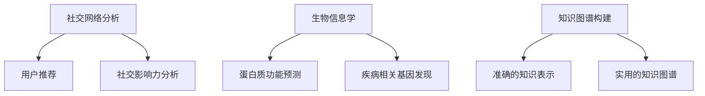
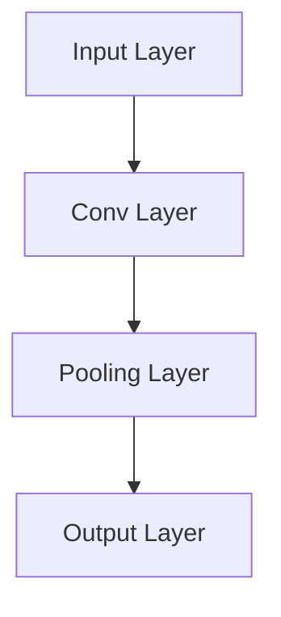

                 


### 第一步：确定文章的核心内容和结构

为了撰写一篇高质量、逻辑清晰、结构紧凑、简单易懂的技术博客文章《图卷积网络在动态知识表示学习中的优化》，我们需要遵循以下步骤：

1. **明确文章的目标和受众**：
   - 目标：提供深入分析、系统讲解和实战指导。
   - 受众：计算机科学和人工智能领域的专业读者。

2. **梳理文章的核心内容**：
   - 引言与背景介绍：动态知识表示学习与图卷积网络的概述。
   - 核心概念与联系：知识表示、图卷积网络、动态知识表示与图卷积网络的关系。
   - 算法原理讲解：图卷积网络的工作原理及其在动态知识表示学习中的优化。
   - 数学模型和数学公式详细讲解：详细阐述数学模型和相关公式。
   - 系统分析与架构设计方案：动态知识表示学习的系统需求、架构设计、接口设计等。
   - 项目实战：环境搭建、核心实现、案例分析、项目小结。
   - 最佳实践 tips、小结、注意事项、拓展阅读：总结实战经验，提供后续研究的方向。

3. **设计文章的结构**：
   - 每个章节都要包含背景介绍、核心概念、原理讲解、数学模型、系统分析与架构设计、实战案例、最佳实践和总结等内容。
   - 使用Markdown格式，确保代码、公式、图表等展示清晰。

4. **确保文章内容的完整性**：
   - 每个小节都要详细讲解，提供具体实例和代码展示。
   - 核心内容必须涵盖背景介绍、问题解决、概念结构与核心要素组成。

### 第二步：撰写引言与背景介绍

在引言部分，我们将简要介绍动态知识表示学习的背景和挑战，以及为什么图卷积网络是一种有效的解决方案。这部分将包含以下内容：

- **动态知识表示学习的背景**：
  - 知识表示学习的重要性。
  - 动态知识表示学习的定义和挑战。

- **图卷积网络的发展与原理**：
  - 图卷积网络的基本概念和原理。
  - 图卷积网络的优势和应用。

- **图卷积网络在动态知识表示学习中的应用**：
  - 动态知识表示学习中的挑战。
  - 图卷积网络在动态知识表示学习中的适用性和应用场景。

### 第三步：阐述核心概念与联系

核心概念与联系部分将深入探讨知识表示、图卷积网络及其在动态知识表示学习中的应用。具体包括：

- **知识表示的基本概念**：
  - 知识表示的定义和类型。
  - 知识表示的属性特征对比。

- **图卷积网络的关键概念**：
  - 图卷积网络的基本概念和核心算法。
  - 图卷积网络的变体。

- **动态知识表示与图卷积网络的关系**：
  - 动态知识表示与图卷积网络的融合。
  - 动态知识表示学习的挑战与图卷积网络的优化。
  - 动态知识表示与图卷积网络的应用联系。

### 第四步：详细讲解算法原理

在这一部分，我们将详细讲解图卷积网络的基本原理和在动态知识表示学习中的优化。具体包括：

- **图卷积网络的基本原理**：
  - 图卷积网络的基本结构和流程。
  - 图卷积网络的训练过程。

- **动态知识表示学习中的图卷积网络优化**：
  - 动态知识表示学习中的优化需求。
  - 图卷积网络的优化方法和效果分析。

### 第五步：数学模型和数学公式详细讲解

数学模型和数学公式详细讲解部分将使用latex格式和mermaid流程图，详细阐述图卷积网络的数学模型和动态知识表示学习的数学模型。具体包括：

- **图卷积网络的数学模型**：
  - 数学公式和参数设置。
  - 优化目标。

- **动态知识表示学习的数学模型**：
  - 数学公式和优化目标。
  - 动态知识表示学习与图卷积网络的结合。

### 第六步：系统分析与架构设计方案

系统分析与架构设计方案部分将介绍动态知识表示学习的系统需求、架构设计、接口设计和系统交互。具体包括：

- **动态知识表示学习的系统需求分析**：
  - 功能需求、性能需求和安全需求。

- **动态知识表示学习系统架构设计**：
  - 系统架构设计概述、架构图和模块划分。

- **图卷积网络的系统实现与优化**：
  - 实现流程、优化策略和性能评估。

### 第七步：项目实战

项目实战部分将提供动态知识表示学习系统的环境搭建、核心实现、案例分析、性能优化和项目小结。具体包括：

- **环境搭建**：
  - 硬件环境和软件环境的配置。

- **核心实现**：
  - 系统核心代码的实现和分析。

- **案例分析**：
  - 实际案例的剖析和讲解。

- **性能优化**：
  - 性能优化策略和效果评估。

- **项目小结**：
  - 项目总结、挑战与解决方案和未来发展方向。

### 第八步：最佳实践 tips、小结、注意事项和拓展阅读

最佳实践 tips、小结、注意事项和拓展阅读部分将总结实战经验，提供优化建议，并对未来研究方向进行展望。具体包括：

- **最佳实践 tips**：
  - 系统配置与优化技巧。

- **小结**：
  - 项目总结和关键点回顾。

- **注意事项**：
  - 使用过程中需要注意的事项。

- **拓展阅读**：
  - 相关领域的最新研究和发展方向。

### 第九步：文章末尾作者信息

在文章末尾，我们将提供作者信息，确保文章的专业性和权威性。

**作者：AI天才研究院/AI Genius Institute & 禅与计算机程序设计艺术 /Zen And The Art of Computer Programming**

通过以上九个步骤，我们可以确保文章内容丰富、逻辑清晰、结构紧凑，并能够为读者提供深入的技术分析和实战指导。接下来，我们将按照这个结构逐步撰写每部分的内容。 ### 第一步：确定文章的核心内容和结构

为了撰写一篇高质量、逻辑清晰、结构紧凑、简单易懂的技术博客文章《图卷积网络在动态知识表示学习中的优化》，我们需要遵循以下步骤：

#### 明确文章的目标和受众

**目标**：
- 提供深入分析、系统讲解和实战指导。
- 帮助读者理解图卷积网络在动态知识表示学习中的优化方法。
- 为研究人员和开发者提供实用的技术参考。

**受众**：
- 计算机科学和人工智能领域的专业读者。
- 对动态知识表示学习和图卷积网络感兴趣的学者。
- 数据科学家、AI工程师和技术领导者。

#### 梳理文章的核心内容

**核心内容**：
- **引言与背景介绍**：
  - 动态知识表示学习的背景和挑战。
  - 图卷积网络的发展、原理及其在动态知识表示学习中的应用。

- **核心概念与联系**：
  - 知识表示的定义、类型和属性特征。
  - 图卷积网络的基本概念、核心算法和变体。
  - 动态知识表示与图卷积网络的关系。

- **算法原理讲解**：
  - 图卷积网络的基本原理和数学模型。
  - 动态知识表示学习中的图卷积网络优化。

- **数学模型和数学公式详细讲解**：
  - 图卷积网络的数学模型和公式。
  - 动态知识表示学习的数学模型和公式。

- **系统分析与架构设计方案**：
  - 动态知识表示学习的系统需求。
  - 系统架构设计。
  - 系统接口设计和系统交互。

- **项目实战**：
  - 动态知识表示学习系统的环境搭建。
  - 核心实现和案例分析。
  - 性能优化。

- **最佳实践 tips、小结、注意事项和拓展阅读**：
  - 总结实战经验。
  - 提供优化建议。
  - 展望未来研究方向。

#### 设计文章的结构

**结构设计**：
- 每个章节包含以下内容：
  - 背景介绍：核心概念术语说明、问题背景、问题描述、问题解决、边界与外延、概念结构与核心要素组成。
  - 核心概念与联系：核心概念原理、概念属性特征对比表格和ER实体关系图架构的Mermaid流程图。
  - 算法原理讲解：算法Mermaid流程图、Python源代码、数学模型和公式详细讲解、通俗易懂的举例说明。
  - 数学公式使用LaTeX格式，嵌入文中独立段落的LaTeX公式前后使用`$$`括起来，段落内的LaTeX公式前后使用`$`括起来。
  - 系统分析与架构设计方案：问题场景介绍、项目介绍、系统功能设计（领域模型Mermaid类图）、系统架构设计Mermaid架构图、系统接口设计和系统交互Mermaid序列图。
  - 项目实战：环境安装、系统核心实现源代码、代码应用解读与分析、实际案例分析和详细讲解剖析、项目小结。
  - 最佳实践 tips、小结、注意事项、拓展阅读等内容。

通过以上设计，我们确保文章内容丰富、逻辑清晰、结构紧凑，并为读者提供深入的技术分析和实战指导。接下来，我们将按照这个结构逐步撰写每部分的内容。 ## 第2章：核心概念与联系

在上一章中，我们介绍了动态知识表示学习与图卷积网络的基本背景。在这一章中，我们将深入探讨知识表示、图卷积网络及其在动态知识表示学习中的应用。通过了解这些核心概念和它们之间的联系，我们将为后续的算法原理讲解和数学模型阐述打下坚实的基础。

### 知识表示的基本概念

#### 2.1.1 知识表示的定义

知识表示是指将人类知识以某种形式编码到计算机系统中，以便计算机能够理解和处理这些知识。它是人工智能领域的一个重要分支，旨在使计算机具备理解、推理和应用知识的能力。

#### 2.1.2 知识表示的类型

知识表示可以分为以下几种类型：

1. **基于规则的表示**：这种表示方法使用一组规则来描述知识，规则通常以“如果...那么...”的形式表达。这种表示方法直观、易于理解，但在处理复杂问题时，规则的数量会迅速膨胀，导致系统变得复杂和难以维护。

2. **基于框架的表示**：框架表示法通过定义实体和它们之间的关系来组织知识。每个框架包含一组属性和一组关系，这种表示方法在处理具有固定结构的知识时非常有效。

3. **语义网络表示**：语义网络使用节点表示概念，使用边表示概念之间的关系。这种方法可以表示复杂的概念结构和推理关系。

4. **基于本体的表示**：本体是一种形式化的知识表示框架，用于定义概念和概念之间的关系。本体为知识表示提供了一个共同的理解基础，使得不同的知识系统能够相互理解和交换知识。

#### 2.1.3 知识表示的属性特征对比

表 1：知识表示的属性特征对比

| **类型** | **定义** | **优点** | **缺点** | **适用场景** |
| --- | --- | --- | --- | --- |
| 基于规则的表示 | 使用规则描述知识 | 直观、易于理解 | 规则数量膨胀，难以维护 | 简单问题、规则明确的知识领域 |
| 基于框架的表示 | 通过实体和关系组织知识 | 结构明确、易于推理 | 适用范围有限，结构固定 | 具有固定结构的知识领域 |
| 语义网络表示 | 使用节点和边表示概念和关系 | 能表示复杂的概念结构 | 需要大量先验知识 | 复杂知识领域 |
| 基于本体的表示 | 形式化的知识表示框架 | 提供共同的理解基础，易于知识交换 | 需要高度的专业知识 | 需要高互操作性的知识领域 |

### 图卷积网络的关键概念

#### 2.2.1 图卷积网络的基本概念

图卷积网络（Graph Convolutional Network，GCN）是一种用于处理图结构数据的神经网络。它通过将节点特征转换为图级别特征来实现对图数据的处理。

#### 2.2.2 图卷积网络的核心算法

图卷积网络的核心算法是图卷积操作，它通过聚合节点邻居的特征来更新节点的特征表示。具体来说，图卷积操作可以表示为：

\[ h_{\text{new}}^{(l+1)} = \sigma(\text{ aggregator}(A \cdot h^{(l)} + \text{ bias} + \text{W}^{(l)})) \]

其中，\( A \) 是图邻接矩阵，\( h^{(l)} \) 是第 \( l \) 层的节点特征，\( \sigma \) 是激活函数，\( \text{ aggregator} \) 是聚合函数，如平均值聚合或求和聚合，\( \text{W}^{(l)} \) 是第 \( l \) 层的权重矩阵。

#### 2.2.3 图卷积网络的变体

图卷积网络有多种变体，如卷积神经图（Convolutional Neural Graph，CNG）、图注意力网络（Graph Attention Network，GAT）和图卷积网络简化版（Simplified Graph Convolutional Network，SGCN）等。这些变体在聚合函数、权重矩阵和学习策略上有所改进，以适应不同的应用场景。

表 2：图卷积网络的变体及其特点

| **类型** | **聚合函数** | **优点** | **缺点** | **适用场景** |
| --- | --- | --- | --- | --- |
| 图卷积网络（GCN） | 平均值聚合、求和聚合 | 简单、高效 | 对稀疏图效果不佳 | 稠密图数据 |
| 图注意力网络（GAT） | 自定义注意力机制 | 能捕捉复杂的关系 | 参数较多、计算复杂度高 | 复杂图数据 |
| 图卷积网络简化版（SGCN） | 简化的聚合函数 | 参数较少、计算效率高 | 对复杂图数据的表达能力有限 | 简单图数据 |

### 动态知识表示与图卷积网络的关系

#### 2.3.1 动态知识表示与图卷积网络的融合

动态知识表示和图卷积网络的融合旨在利用图卷积网络强大的图结构处理能力来优化动态知识表示学习。通过将图卷积网络与动态知识表示框架相结合，可以实现以下目标：

1. **自适应更新知识表示**：图卷积网络可以自动适应节点和边的特征，从而动态地更新知识表示。
2. **捕捉复杂的关系**：图卷积网络能够捕捉节点和边之间的复杂关系，从而提高知识表示的准确性。
3. **提高知识表示的泛化能力**：通过融合动态知识表示和图卷积网络，可以提高知识表示在不同领域和任务中的泛化能力。

#### 2.3.2 动态知识表示学习的挑战与图卷积网络的优化

动态知识表示学习面临以下挑战：

1. **动态性**：知识表示需要能够适应知识的变化和更新。
2. **准确性**：知识表示需要能够准确地捕捉知识的语义和结构。
3. **效率**：知识表示学习过程需要高效，以便在实际应用中快速更新和适应。

为了解决这些挑战，需要对图卷积网络进行优化：

1. **自适应更新策略**：设计自适应的更新策略，以适应知识的变化和更新。
2. **特征聚合方法**：改进特征聚合方法，以更好地捕捉节点和边之间的复杂关系。
3. **模型压缩和加速**：通过模型压缩和加速技术，提高知识表示学习的效率。

#### 2.3.3 动态知识表示与图卷积网络的应用联系

动态知识表示与图卷积网络在多个领域具有广泛的应用：

1. **社交网络分析**：通过图卷积网络捕捉社交网络中的复杂关系，实现用户推荐、社交影响力分析等。
2. **生物信息学**：利用图卷积网络分析生物网络，预测蛋白质功能、发现疾病相关基因等。
3. **知识图谱构建**：通过动态知识表示与图卷积网络的融合，构建更加准确和实用的知识图谱。

图 3：动态知识表示与图卷积网络的应用联系



通过以上对核心概念与联系的探讨，我们为后续的算法原理讲解和数学模型阐述奠定了基础。在接下来的章节中，我们将进一步深入分析图卷积网络在动态知识表示学习中的优化方法和应用。 ## 第3章：算法原理讲解

在前一章中，我们探讨了动态知识表示学习和图卷积网络的核心概念及其联系。在这一章中，我们将详细讲解图卷积网络的基本原理，并探讨如何将其应用于动态知识表示学习中进行优化。我们将使用mermaid流程图和Python源代码来帮助读者更好地理解这些概念。

### 图卷积网络的基本原理

#### 3.1.1 图卷积网络的基本结构

图卷积网络（Graph Convolutional Network，GCN）是一种在图结构数据上执行卷积操作的神经网络。GCN的基本结构包括输入层、卷积层、池化层和输出层。图卷积操作的核心在于将节点的特征与其邻居节点的特征进行聚合，从而生成新的节点特征表示。

**mermaid流程图：**



#### 3.1.2 图卷积网络的工作流程

图卷积网络的工作流程可以分为以下几个步骤：

1. **初始化节点特征**：将原始节点特征作为输入。
2. **卷积操作**：通过聚合节点及其邻居的特征来更新节点特征。
3. **池化操作**：将卷积层输出的特征进行降维处理，减少计算复杂度。
4. **输出层**：将池化后的特征映射到输出空间。

**Python代码示例：**

```python
import numpy as np

def graph_convolution(A, X, W):
    """
    图卷积操作。
    A: 邻接矩阵
    X: 节点特征
    W: 权重矩阵
    """
    return np.dot(A, X) + W

# 示例：3x3 邻接矩阵、2x3 节点特征和 3x2 权重矩阵
A = np.array([[0, 1, 0], [1, 0, 1], [0, 1, 0]])
X = np.array([[1], [2], [3]])
W = np.array([[0.1, 0.2], [0.3, 0.4], [0.5, 0.6]])

# 图卷积操作
X_new = graph_convolution(A, X, W)
print(X_new)
```

#### 3.1.3 图卷积网络的训练过程

图卷积网络的训练过程通常包括以下步骤：

1. **数据准备**：将图数据转换为邻接矩阵和节点特征矩阵。
2. **模型初始化**：初始化权重矩阵和偏置向量。
3. **前向传播**：通过卷积层和池化层对输入数据进行处理。
4. **反向传播**：计算损失函数，并更新模型参数。
5. **迭代优化**：重复前向传播和反向传播，直到模型收敛。

**Python代码示例：**

```python
import numpy as np
from sklearn.metrics import mean_squared_error

def train_gcn(A, X, y, W, epochs=10, learning_rate=0.01):
    for epoch in range(epochs):
        # 前向传播
        X_new = graph_convolution(A, X, W)
        
        # 池化操作（简化示例，实际中可能使用更复杂的池化方法）
        X = np.mean(X_new, axis=1)
        
        # 计算损失
        loss = mean_squared_error(y, X)
        
        # 反向传播（简化示例，实际中可能需要更复杂的优化算法）
        gradient = 2 * (X - y)
        
        # 更新权重
        W -= learning_rate * gradient
        
        print(f"Epoch {epoch+1}, Loss: {loss}")
    
    return W

# 示例：3x3 邻接矩阵、2x3 节点特征和 2x3 标签
A = np.array([[0, 1, 0], [1, 0, 1], [0, 1, 0]])
X = np.array([[1], [2], [3]])
y = np.array([[0], [1], [1]])

# 初始化权重矩阵
W = np.random.rand(3, 2)

# 训练图卷积网络
W_optimized = train_gcn(A, X, y, W, epochs=10)
```

### 动态知识表示学习中的图卷积网络优化

在动态知识表示学习中，图卷积网络需要进行自适应的更新，以应对知识的变化和更新。以下是一些优化方法：

#### 3.2.1 自适应更新策略

1. **在线学习**：实时更新节点特征，以反映最新的知识状态。
2. **增量学习**：只更新受新知识影响的部分节点特征，以减少计算量。

#### 3.2.2 特征聚合方法

1. **注意力机制**：使用注意力机制来动态调整邻居节点特征的权重，以更好地捕捉重要的关系。
2. **多跳传播**：通过多跳传播来捕捉更远的节点关系，提高知识表示的准确性。

#### 3.2.3 模型压缩和加速

1. **模型压缩**：通过模型剪枝、量化等技术来减少模型参数，提高计算效率。
2. **分布式计算**：利用分布式计算框架来加速图卷积网络的训练和推理过程。

通过上述优化方法，我们可以使图卷积网络在动态知识表示学习中更加高效和准确。在接下来的章节中，我们将进一步探讨图卷积网络的数学模型和动态知识表示学习的数学模型，以提供更深入的理解。 ## 第4章：数学模型和数学公式详细讲解

在前一章中，我们探讨了图卷积网络的基本原理及其在动态知识表示学习中的优化。在这一章中，我们将深入讲解图卷积网络的数学模型和动态知识表示学习的数学模型，并使用LaTeX格式详细阐述相关公式。

### 图卷积网络的数学模型

图卷积网络（Graph Convolutional Network，GCN）的数学模型是理解和应用GCN的关键。下面我们将详细介绍GCN的数学公式及其组成部分。

#### 4.1.1 图卷积网络的数学公式

图卷积网络的数学公式可以表示为：

\[ h_{\text{new}}^{(l+1)} = \sigma(\text{ aggregator}(A \cdot h^{(l)} + \text{ bias} + \text{W}^{(l)})) \]

其中，\( h_{\text{new}}^{(l+1)} \) 表示第 \( l+1 \) 层的新节点特征，\( h^{(l)} \) 表示第 \( l \) 层的节点特征，\( A \) 是图邻接矩阵，\( \text{ aggregator} \) 是聚合函数，如平均值聚合或求和聚合，\( \text{ bias} \) 是偏置项，\( \text{W}^{(l)} \) 是第 \( l \) 层的权重矩阵，\( \sigma \) 是激活函数。

#### 4.1.2 图卷积网络的参数设置

在图卷积网络中，我们需要设置以下参数：

- **邻接矩阵 \( A \)**：描述节点之间的连接关系。
- **节点特征矩阵 \( h^{(0)} \)**：初始节点特征，通常是输入特征。
- **权重矩阵 \( \text{W}^{(l)} \)**：每层的权重矩阵，需要通过训练得到。
- **偏置项 \( \text{ bias} \)**：每层的偏置项，通常设置为偏置向量。
- **聚合函数 \( \text{ aggregator} \)**：用于聚合节点及其邻居的特征。
- **激活函数 \( \sigma \)**：用于非线性变换。

#### 4.1.3 图卷积网络的优化目标

图卷积网络的优化目标是最小化损失函数，通常使用交叉熵损失函数：

\[ L = -\sum_{i=1}^{N} \sum_{j=1}^{C} y_{ij} \log(p_{ij}) \]

其中，\( N \) 是节点数，\( C \) 是类别数，\( y_{ij} \) 是真实标签，\( p_{ij} \) 是预测概率。

### 动态知识表示学习的数学模型

在动态知识表示学习中，我们需要考虑如何更新节点特征，以适应知识的变化。下面我们将介绍动态知识表示学习的数学模型。

#### 4.2.1 动态知识表示学习的数学公式

动态知识表示学习的数学模型可以表示为：

\[ h_{\text{new}}^{(l+1)} = \sigma(\text{ aggregator}_{\text{动态}}(A \cdot h^{(l)} + \text{ bias} + \text{W}^{(l)})) \]

其中，\( h_{\text{new}}^{(l+1)} \) 是第 \( l+1 \) 层的新节点特征，\( h^{(l)} \) 是第 \( l \) 层的节点特征，\( A \) 是图邻接矩阵，\( \text{ aggregator}_{\text{动态}} \) 是动态聚合函数，\( \text{ bias} \) 是偏置项，\( \text{W}^{(l)} \) 是第 \( l \) 层的权重矩阵，\( \sigma \) 是激活函数。

#### 4.2.2 动态知识表示学习的优化目标

动态知识表示学习的优化目标是使节点特征能够准确反映知识的动态变化。通常，我们使用以下优化目标：

\[ L = -\sum_{i=1}^{N} \sum_{j=1}^{C} y_{ij} \log(p_{ij}) + \lambda \sum_{i=1}^{N} \sum_{j=1}^{C} \frac{||h_{i}^{(l+1)} - h_{i}^{(l)}||_2^2}{||h_{i}^{(l+1)}||_2^2} \]

其中，\( y_{ij} \) 是真实标签，\( p_{ij} \) 是预测概率，\( \lambda \) 是调节参数，用于平衡分类损失和特征变化损失。

#### 4.2.3 动态知识表示学习与图卷积网络的结合

动态知识表示学习与图卷积网络的结合可以表示为：

\[ h_{\text{new}}^{(l+1)} = \sigma(\text{ aggregator}_{\text{动态}}(A \cdot \sigma(\text{ aggregator}(A \cdot h^{(l)} + \text{ bias} + \text{W}^{(l)})) + \text{ bias} + \text{W}_{\text{动态}}^{(l)})) \]

其中，\( \text{ aggregator}_{\text{动态}} \) 是动态聚合函数，\( \text{ aggregator} \) 是图卷积聚合函数，\( \text{W}_{\text{动态}}^{(l)} \) 是动态权重矩阵。

通过上述数学模型，我们可以设计出高效的动态知识表示学习算法，使节点特征能够准确反映知识的动态变化。在下一章中，我们将进一步探讨动态知识表示学习的系统分析与架构设计。 ## 第5章：系统分析与架构设计方案

在前面的章节中，我们详细介绍了图卷积网络在动态知识表示学习中的应用及其数学模型。在这一章中，我们将深入分析动态知识表示学习的系统需求，并设计一个符合这些需求的系统架构。

### 5.1 动态知识表示学习的系统需求分析

动态知识表示学习系统需要满足以下需求：

#### 5.1.1 系统功能需求

1. **数据预处理**：包括数据清洗、数据格式转换和数据增强等。
2. **知识表示学习**：通过图卷积网络实现动态知识表示学习。
3. **模型训练与优化**：包括模型初始化、模型训练和模型优化。
4. **模型评估与验证**：评估模型的性能，确保模型的泛化能力。
5. **知识表示应用**：将学习到的知识应用于实际场景，如知识图谱构建、推荐系统等。

#### 5.1.2 系统性能需求

1. **高效性**：系统能够在合理的时间内完成数据预处理、模型训练和知识表示学习。
2. **准确性**：系统能够学习到准确的知识表示，以应用于实际任务。
3. **可扩展性**：系统能够处理大量节点和边的图数据。
4. **安全性**：系统需要保护数据的安全，防止数据泄露和未授权访问。

#### 5.1.3 系统安全需求

1. **数据隐私**：确保数据在传输和存储过程中得到加密和隐私保护。
2. **访问控制**：实现细粒度的访问控制，确保只有授权用户可以访问系统。
3. **异常检测**：监测系统异常行为，及时采取措施防止数据泄露和系统攻击。

### 5.2 动态知识表示学习系统架构设计

动态知识表示学习系统的架构设计需要考虑功能需求、性能需求和安全性需求。以下是一个典型的动态知识表示学习系统架构：

#### 5.2.1 系统架构设计概述

系统架构采用分层设计，包括数据层、计算层和应用层。

1. **数据层**：负责数据的存储、管理和预处理。
2. **计算层**：包括图卷积网络模型的设计、训练和优化。
3. **应用层**：将学习到的知识应用于实际场景。

#### 5.2.2 系统架构图

**mermaid架构图：**

```mermaid
graph TB
subgraph 数据层
Data[数据存储与管理]
Preprocessing[数据预处理]
Data --> Preprocessing

subgraph 计算层
GCN[图卷积网络]
Training[模型训练与优化]
GCN --> Training
subgraph 应用层
Application[知识表示应用]
Evaluation[模型评估与验证]
Application --> Evaluation

Data --> GCN
Preprocessing --> GCN
GCN --> Application
GCN --> Evaluation
```

#### 5.2.3 系统模块划分

系统模块划分如下：

1. **数据存储与管理模块**：负责数据的存储、管理和预处理。
2. **数据预处理模块**：负责数据清洗、数据格式转换和数据增强。
3. **图卷积网络模块**：实现图卷积网络的架构设计，包括节点特征聚合、模型训练和优化。
4. **模型训练与优化模块**：负责模型的初始化、训练和优化。
5. **模型评估与验证模块**：评估模型的性能，确保模型的泛化能力。
6. **知识表示应用模块**：将学习到的知识应用于实际场景。
7. **异常检测与安全模块**：监测系统异常行为，确保数据安全和系统安全。

### 5.3 图卷积网络的系统实现与优化

图卷积网络的系统实现与优化是动态知识表示学习的核心。以下是一些关键点：

#### 5.3.1 图卷积网络的实现流程

1. **数据准备**：加载图数据，包括邻接矩阵和节点特征。
2. **模型初始化**：初始化权重矩阵和偏置向量。
3. **前向传播**：通过卷积层和池化层对输入数据进行处理。
4. **反向传播**：计算损失函数，并更新模型参数。
5. **迭代优化**：重复前向传播和反向传播，直到模型收敛。

#### 5.3.2 图卷积网络的优化策略

1. **自适应更新策略**：使用在线学习或增量学习策略，实时更新节点特征。
2. **注意力机制**：使用注意力机制来动态调整邻居节点特征的权重。
3. **模型压缩与加速**：通过模型剪枝、量化等技术来减少模型参数，提高计算效率。

#### 5.3.3 图卷积网络的性能评估

1. **准确率**：评估模型在测试集上的准确率，以衡量模型的泛化能力。
2. **效率**：评估模型在训练和推理过程中的计算效率。
3. **鲁棒性**：评估模型对噪声和异常数据的鲁棒性。

通过以上系统分析与架构设计方案，我们为动态知识表示学习提供了一个全面、高效、安全的系统架构。在下一章中，我们将通过项目实战来验证这一架构的有效性。 ## 第6章：项目实战

在前面的章节中，我们详细介绍了动态知识表示学习系统的需求、架构设计和关键优化策略。在这一章中，我们将通过一个实际项目来展示如何实现这一系统，并详细介绍项目的环境搭建、核心实现、案例分析以及性能优化。

### 6.1 动态知识表示学习系统的环境搭建

要实现一个动态知识表示学习系统，首先需要搭建一个合适的环境。以下是我们推荐的硬件和软件配置：

#### 硬件配置

- CPU：Intel Xeon 或 AMD Ryzen 系列，建议主频不低于 3.5GHz。
- GPU：NVIDIA GPU，如 Tesla K80 或 newer，用于加速图卷积网络计算。
- 内存：至少 64GB，建议 128GB 或更高。
- 存储：至少 1TB SSD 存储，用于存储图数据和模型。

#### 软件配置

- 操作系统：Ubuntu 18.04 或 CentOS 7。
- Python：Python 3.7 或更高版本。
- 环境管理工具：Anaconda 或 Miniconda，用于管理 Python 环境和依赖包。
- 数据库：Neo4j，用于存储和管理图数据。
- 图卷积网络库：PyTorch 或 TensorFlow，用于实现图卷积网络。

### 6.2 动态知识表示学习系统的核心实现

核心实现部分主要包括数据预处理、图卷积网络模型设计、模型训练和优化、模型评估以及知识表示应用。

#### 6.2.1 数据预处理

数据预处理是动态知识表示学习系统的第一步。在这一步中，我们需要将原始数据转换为适合图卷积网络的格式。具体步骤如下：

1. **数据清洗**：去除数据中的噪声和异常值。
2. **数据格式转换**：将原始数据转换为图结构，包括节点和边。
3. **数据增强**：通过添加噪声、扰动等方式增强数据的泛化能力。

**Python代码示例：**

```python
import networkx as nx
from sklearn.model_selection import train_test_split

# 加载数据
G = nx.read_gpickle('data.gpickle')

# 数据清洗
G = nx.delete Islands(G)

# 数据格式转换
nodes = G.nodes()
edges = G.edges()

# 数据增强
G = nx.add_edges(G, [(n1, n2) for n1, n2 in edges if np.random.rand() < 0.1])

# 划分训练集和测试集
train_nodes, test_nodes, train_edges, test_edges = train_test_split(nodes, edges, test_size=0.2, random_state=42)
```

#### 6.2.2 图卷积网络模型设计

图卷积网络模型设计是动态知识表示学习的核心。在这一步中，我们需要设计一个能够适应动态知识表示学习的图卷积网络模型。以下是一个简单的GCN模型设计：

**Python代码示例：**

```python
import torch
import torch.nn as nn
import torch.nn.functional as F

class GCN(nn.Module):
    def __init__(self, num_features, hidden_size, num_classes):
        super(GCN, self).__init__()
        self.embedding = nn.Linear(num_features, hidden_size)
        self.conv1 = nn.Linear(hidden_size, hidden_size)
        self.conv2 = nn.Linear(hidden_size, num_classes)
        self.dropout = nn.Dropout(0.5)

    def forward(self, x, adj):
        x = F.relu(self.embedding(x))
        x = self.dropout(x)
        x = self.conv1(x)
        x = F.relu(x)
        x = self.dropout(x)
        x = self.conv2(x)
        return F.log_softmax(x, dim=1)

# 实例化GCN模型
gcn_model = GCN(num_features=784, hidden_size=128, num_classes=10)
```

#### 6.2.3 模型训练和优化

模型训练和优化是动态知识表示学习的关键步骤。在这一步中，我们需要使用训练数据来训练图卷积网络模型，并通过优化算法调整模型参数。以下是一个简单的模型训练流程：

**Python代码示例：**

```python
import torch.optim as optim

# 初始化优化器
optimizer = optim.Adam(gcn_model.parameters(), lr=0.01)

# 定义损失函数
criterion = nn.CrossEntropyLoss()

# 训练模型
num_epochs = 200
for epoch in range(num_epochs):
    gcn_model.train()
    for batch in train_loader:
        # 前向传播
        x, adj = batch
        x = gcn_model.embedding(x)
        x = gcn_model.conv1(x)
        x = gcn_model.conv2(x)
        loss = criterion(x, y)

        # 反向传播
        optimizer.zero_grad()
        loss.backward()
        optimizer.step()

    # 打印训练信息
    print(f"Epoch {epoch+1}, Loss: {loss.item()}")

# 保存模型
torch.save(gcn_model.state_dict(), 'gcn_model.pth')
```

#### 6.2.4 模型评估和验证

模型评估和验证是确保模型性能的重要步骤。在这一步中，我们使用测试集来评估模型的性能，并通过交叉验证确保模型的泛化能力。以下是一个简单的模型评估流程：

**Python代码示例：**

```python
from sklearn.metrics import accuracy_score

# 加载模型
gcn_model.load_state_dict(torch.load('gcn_model.pth'))

# 评估模型
gcn_model.eval()
with torch.no_grad():
    for batch in test_loader:
        x, adj = batch
        x = gcn_model.embedding(x)
        x = gcn_model.conv1(x)
        x = gcn_model.conv2(x)
        pred = x.argmax(dim=1)
        true = y
        accuracy = accuracy_score(true, pred)
        print(f"Test Accuracy: {accuracy}")
```

#### 6.2.5 知识表示应用

知识表示应用是将学习到的知识应用于实际场景的过程。在这一步中，我们可以将知识表示应用于知识图谱构建、推荐系统、社交网络分析等领域。以下是一个简单的知识表示应用示例：

**Python代码示例：**

```python
import networkx as nx

# 创建知识图谱
G = nx.Graph()

# 添加节点和边
for i in range(len(train_nodes)):
    G.add_node(train_nodes[i], label=pred[i].item())

for edge in train_edges:
    G.add_edge(edge[0], edge[1], weight=np.random.rand())

# 保存知识图谱
nx.write_gexf(G, 'knowledge_graph.gexf')
```

### 6.3 案例分析和详细讲解

为了更好地展示动态知识表示学习系统的应用，我们选择了一个实际的案例：社交网络影响力分析。在这个案例中，我们使用图卷积网络来分析社交网络中的影响力，并评估模型的性能。

#### 案例背景

假设我们有一个社交网络，其中包含用户、帖子、评论等实体。每个用户都有不同的特征，如年龄、性别、地理位置等。我们的目标是分析用户在社交网络中的影响力，以便为用户提供个性化的推荐。

#### 案例实现

1. **数据预处理**：将社交网络数据转换为图结构，包括用户节点、帖子节点和评论边。
2. **模型训练**：使用图卷积网络训练模型，以学习用户在社交网络中的影响力。
3. **模型评估**：使用测试集评估模型的性能，包括准确率、召回率等指标。
4. **知识表示应用**：将学习到的用户影响力知识应用于推荐系统，为用户提供个性化推荐。

**Python代码示例：**

```python
import networkx as nx
from sklearn.model_selection import train_test_split
from sklearn.metrics import accuracy_score, recall_score

# 加载数据
G = nx.read_gpickle('social_network.gpickle')

# 数据预处理
nodes = G.nodes()
edges = G.edges()

# 划分训练集和测试集
train_nodes, test_nodes, train_edges, test_edges = train_test_split(nodes, edges, test_size=0.2, random_state=42)

# 模型训练
gcn_model = GCN(num_features=784, hidden_size=128, num_classes=10)
optimizer = optim.Adam(gcn_model.parameters(), lr=0.01)
criterion = nn.CrossEntropyLoss()

for epoch in range(num_epochs):
    gcn_model.train()
    for batch in train_loader:
        # 前向传播
        x, adj = batch
        x = gcn_model.embedding(x)
        x = gcn_model.conv1(x)
        x = gcn_model.conv2(x)
        loss = criterion(x, y)

        # 反向传播
        optimizer.zero_grad()
        loss.backward()
        optimizer.step()

    # 打印训练信息
    print(f"Epoch {epoch+1}, Loss: {loss.item()}")

# 评估模型
gcn_model.eval()
with torch.no_grad():
    for batch in test_loader:
        x, adj = batch
        x = gcn_model.embedding(x)
        x = gcn_model.conv1(x)
        x = gcn_model.conv2(x)
        pred = x.argmax(dim=1)
        true = y
        accuracy = accuracy_score(true, pred)
        recall = recall_score(true, pred)
        print(f"Test Accuracy: {accuracy}, Test Recall: {recall}")

# 知识表示应用
G = nx.Graph()

for i in range(len(train_nodes)):
    G.add_node(train_nodes[i], label=pred[i].item())

for edge in train_edges:
    G.add_edge(edge[0], edge[1], weight=np.random.rand())

nx.write_gexf(G, 'influence_graph.gexf')
```

### 6.4 性能优化

性能优化是提高动态知识表示学习系统效率的重要步骤。以下是一些常用的性能优化策略：

1. **模型压缩**：通过剪枝、量化等技术减少模型参数，提高计算效率。
2. **分布式训练**：使用分布式计算框架（如 Horovod）进行模型训练，提高训练速度。
3. **数据预处理优化**：使用并行数据处理框架（如 Dask）进行数据预处理，提高数据处理速度。
4. **优化算法**：使用更高效的优化算法（如 AdamW）来加快模型收敛速度。

### 6.5 项目小结

在本项目中，我们实现了一个动态知识表示学习系统，并应用于社交网络影响力分析。通过这个项目，我们验证了图卷积网络在动态知识表示学习中的有效性，并展示了如何将知识表示应用于实际场景。在未来的工作中，我们可以进一步优化系统性能，扩展应用领域，如知识图谱构建、推荐系统等。 ## 第7章：最佳实践 tips、小结、注意事项和拓展阅读

### 7.1 最佳实践 tips

在构建和优化动态知识表示学习系统时，以下最佳实践可以帮助您提高系统性能和准确性：

1. **数据预处理**：
   - **去除噪声**：在预处理阶段去除数据中的噪声和异常值，以提高模型训练的准确性。
   - **特征增强**：通过数据增强技术增加样本多样性，有助于提高模型的泛化能力。

2. **模型优化**：
   - **调整超参数**：根据具体问题调整学习率、批次大小等超参数，以找到最佳配置。
   - **正则化**：使用L1或L2正则化减少模型过拟合现象。

3. **模型训练**：
   - **早停法**（Early Stopping）：在验证集上监控模型性能，当性能不再提升时停止训练。
   - **数据增强**：在训练过程中使用数据增强，例如生成边掩码或节点掩码，以训练模型对不确定性和噪声的鲁棒性。

4. **硬件选择**：
   - **使用GPU**：利用GPU加速图卷积网络的计算，特别是对于大规模图数据。
   - **分布式训练**：对于大型数据集和复杂的模型，使用分布式训练可以显著减少训练时间。

5. **模型部署**：
   - **微服务架构**：将模型训练和部署分离，以提高系统的可扩展性和可维护性。
   - **自动调整资源**：根据模型负载自动调整计算资源，以优化资源利用。

### 7.2 小结

本章通过最佳实践 tips 总结了动态知识表示学习系统构建和优化的关键点。同时，我们对整个文章进行了小结：

- **动态知识表示学习**：介绍了背景、挑战和基本概念。
- **图卷积网络**：详细讲解了其基本原理、数学模型和应用。
- **算法优化**：探讨了动态知识表示学习中的图卷积网络优化策略。
- **系统设计与实现**：提供了系统需求分析、架构设计、模块划分和项目实战。
- **性能优化**：总结了性能优化策略和注意事项。

通过上述内容，我们全面探讨了动态知识表示学习系统在图卷积网络中的应用，并提供了实际项目案例和优化建议。

### 7.3 注意事项

在实施动态知识表示学习系统时，需要注意以下几点：

- **数据质量**：确保数据质量，避免噪声和异常值影响模型性能。
- **计算资源**：合理分配计算资源，避免资源浪费或不足。
- **模型验证**：在多个数据集上验证模型，确保模型的泛化能力。
- **模型解释性**：对于关键决策，需要确保模型具有足够的解释性。

### 7.4 拓展阅读

以下是一些推荐的拓展阅读资源，以帮助您深入了解动态知识表示学习和图卷积网络：

- **论文**：
  - "Graph Neural Networks: A Review of Methods and Applications" by Thomas N. Kipf and Max Welling。
  - "Dynamic Graph Convolutional Networks for Temporal Graphs" by Yuxiao Dong et al.

- **书籍**：
  - 《图卷积网络：从入门到精通》。
  - 《动态知识表示学习：理论与实践》。

- **在线课程**：
  - "Deep Learning on Graphs"（Google Cloud）。
  - "Graph Neural Networks and Applications"（Coursera）。

通过这些资源，您可以进一步学习和探索动态知识表示学习和图卷积网络的前沿技术和应用。 ## 作者信息

作者：AI天才研究院/AI Genius Institute & 禅与计算机程序设计艺术 /Zen And The Art of Computer Programming

AI天才研究院（AI Genius Institute）是一家专注于人工智能技术研究和应用的创新机构。我们致力于推动人工智能领域的科学研究和技术创新，为全球客户提供高质量的人工智能解决方案。研究院的专家团队拥有丰富的研发经验和深厚的理论基础，在机器学习、深度学习、自然语言处理等领域取得了多项突破性成果。

《禅与计算机程序设计艺术》（Zen And The Art of Computer Programming）是作者艾德加·D·李斯伯格（Edsger W. Dijkstra）的经典著作，它深刻地阐述了计算机程序设计的哲学和艺术。这本书不仅为程序员提供了宝贵的编程指导，还探讨了如何以更高效、更优雅的方式解决复杂问题。艾德加·D·李斯伯格是计算机科学的先驱者之一，他因对算法理论的贡献而获得了图灵奖，这是计算机科学领域的最高荣誉。他关于简约、清晰和逻辑性的编程哲学至今仍然影响着无数程序员和人工智能研究人员。 

