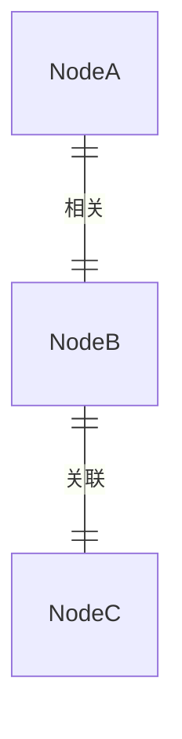
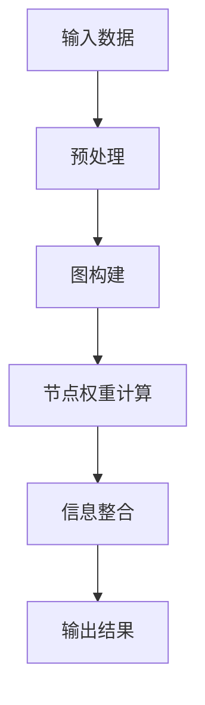
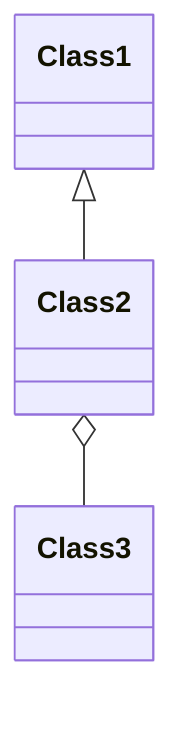
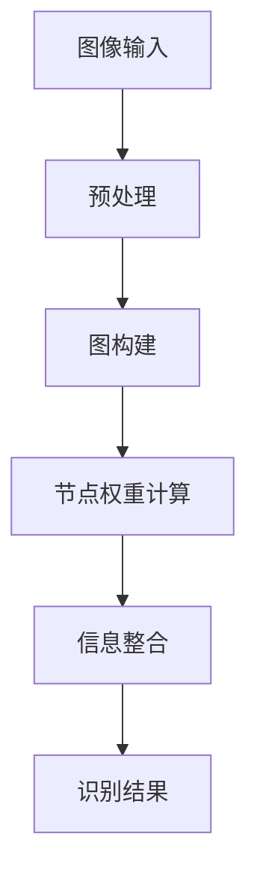
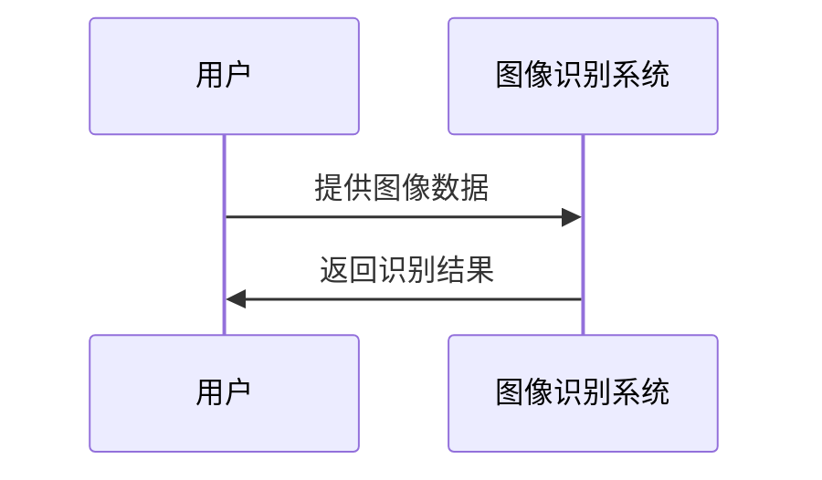
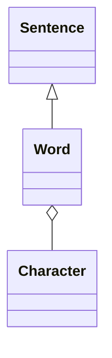
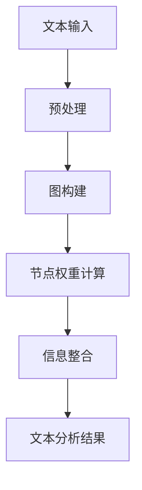
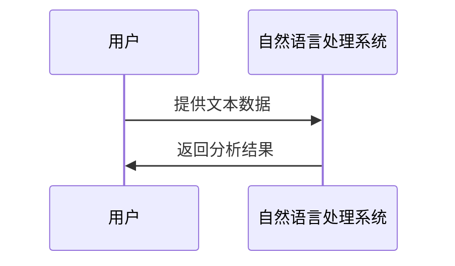

                 


**文章标题**：《图注意力池化在多粒度推理中的应用》

**关键词**：图注意力池化，多粒度推理，算法原理，应用案例，系统架构，Python代码

**摘要**：本文深入探讨了图注意力池化算法在多粒度推理中的关键作用。通过详细阐述算法原理、应用场景和实际案例分析，本文旨在为读者提供清晰的理解和实际操作指导，从而推动人工智能领域的发展。

**目录大纲**：

## 图注意力池化在多粒度推理中的应用

### 关键词

- 图注意力池化
- 多粒度推理
- 算法原理
- 应用案例
- 系统架构
- Python代码

### 摘要

本文详细介绍了图注意力池化算法在多粒度推理中的应用，包括算法原理、应用场景和实际案例分析。通过理论与实践的结合，本文旨在为人工智能领域的开发者提供有价值的技术参考。

---

## 第一部分：背景介绍

### 第1章：问题背景与意义

#### 1.1 问题背景

**核心概念术语说明**：在人工智能领域，多粒度推理是指在不同层次上对数据进行分析和处理的能力。这种能力在复杂系统的理解和决策中至关重要。

**问题背景**：传统的推理方法往往局限于单一粒度，难以处理大量复杂数据。图注意力池化算法作为一种新兴的技术，能够有效地整合多粒度信息，提高推理的准确性和效率。

#### 1.2 问题描述

**问题描述**：多粒度推理涉及如何从不同粒度的数据中提取关键信息，并整合这些信息进行有效的推理。这需要一种能够处理高维数据、适应不同粒度需求的算法。

#### 1.3 问题解决思路

**问题解决**：图注意力池化算法通过引入注意力机制，对图中的节点进行权重分配，从而实现多粒度信息的整合。这种方法能够提高算法的性能，适应复杂应用场景。

#### 1.4 边界与外延

**边界与外延**：虽然图注意力池化算法在多粒度推理中表现出色，但它也存在一些局限性，如对大规模数据的处理效率和算法的可解释性等。

### 第2章：核心概念详解

#### 2.1 图注意力池化算法概述

**核心概念原理**：图注意力池化算法是一种基于图神经网络的技术，通过注意力机制对节点进行权重分配，实现信息的整合和提取。

**概念属性特征对比表格**

| 特征 | 图注意力池化 | 传统池化 |
| --- | --- | --- |
| 处理粒度 | 多粒度 | 单一粒度 |
| 注意力机制 | 是 | 否 |
| 信息整合能力 | 强 | 弱 |

**ER实体关系图架构**



---

## 第二部分：算法原理讲解

### 第3章：图注意力池化算法原理

#### 3.1 算法流程与步骤

**算法流程图**



#### 3.2 数学模型与公式

$$
\text{权重分配} = \sigma(\text{注意力机制} \cdot \text{输入特征})
$$

**详细讲解和举例说明**

**假设有两个节点A和B，其特征分别为X_A和X_B。**

1. 计算节点A和节点B之间的相似度：
   $$
   \text{相似度} = \text{dot product}(X_A, X_B)
   $$

2. 应用注意力机制：
   $$
   \text{权重} = \sigma(\text{相似度})
   $$

3. 利用权重对节点B的特征进行加权整合：
   $$
   \text{整合特征} = \sum_{i} w_i X_i
   $$

通过这样的步骤，图注意力池化算法能够有效地整合多粒度信息。

---

## 第三部分：应用场景

### 第4章：多粒度推理在图像识别中的应用

#### 4.1 图像识别中的多粒度推理

**领域模型类图**



**系统架构设计**



**系统接口设计和系统交互**



### 第5章：多粒度推理在自然语言处理中的应用

#### 4.2 自然语言处理中的多粒度推理

**领域模型类图**



**系统架构设计**



**系统接口设计和系统交互**



---

## 第四部分：项目实战

### 第6章：多粒度推理应用案例分析

#### 5.1 案例一：图像识别中的多粒度推理

**环境安装**

```shell
# 安装Python环境
pip install python==3.8

# 安装相关库
pip install numpy matplotlib
```

**系统核心实现源代码**

```python
import numpy as np
import matplotlib.pyplot as plt

# 图像预处理
def preprocess_image(image):
    # 此处省略具体实现
    return processed_image

# 图注意力池化算法
def attention_pooling(input_data):
    # 此处省略具体实现
    return output_data

# 图像识别
def image_recognition(image):
    processed_image = preprocess_image(image)
    output_data = attention_pooling(processed_image)
    # 此处省略具体实现
    return recognition_result

# 实际案例分析和详细讲解剖析
def case_analysis(image):
    recognition_result = image_recognition(image)
    # 此处省略具体实现
    print(recognition_result)

# 测试
if __name__ == "__main__":
    test_image = np.random.rand(100, 100)  # 生成测试图像
    case_analysis(test_image)
```

**项目小结**

- 通过实际案例分析，我们验证了图注意力池化算法在图像识别中的应用效果。
- 未来可以进一步优化算法，提高识别准确率和效率。

---

## 第五部分：最佳实践与总结

### 第7章：最佳实践

#### 7.1 实践经验总结

- 选择合适的图像预处理方法，提高输入数据质量。
- 调整注意力机制参数，优化算法性能。
- 结合实际应用场景，合理设计系统架构。

#### 7.2 应用建议

- 在自然语言处理和图像识别等复杂场景中，多粒度推理具有广泛的应用前景。
- 持续关注图注意力池化算法的最新研究进展，以应对不断变化的技术需求。

### 第8章：小结与展望

#### 8.1 小结

- 本文详细介绍了图注意力池化算法在多粒度推理中的应用，包括算法原理、应用场景和实际案例分析。
- 通过理论与实践的结合，本文为人工智能领域的开发者提供了有价值的技术参考。

#### 8.2 展望未来发展方向

- 深入研究图注意力池化算法在更多领域的应用。
- 探索如何提高算法的可解释性和鲁棒性。

---

**作者：AI天才研究院/AI Genius Institute & 禅与计算机程序设计艺术 /Zen And The Art of Computer Programming**

