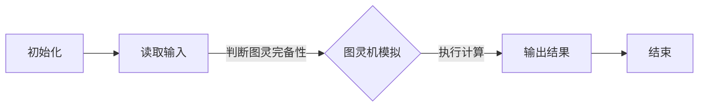
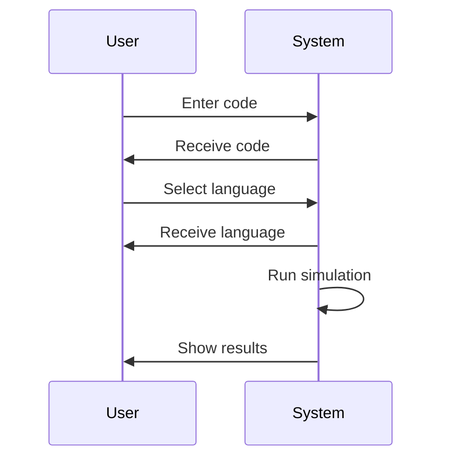

                 


# 图灵完备性与编程语言表达能力分析

关键词：图灵完备性、编程语言、表达能力、算法、数学模型

摘要：本文旨在探讨图灵完备性这一核心概念在编程语言中的应用及其对编程语言表达能力的影响。通过详细分析图灵完备性的原理、属性和编程语言表达能力的联系，结合实际案例，本文旨在为读者提供一个清晰、系统的理解，以期为编程语言设计和算法优化提供理论依据。

## 第一部分：引言与背景

### 1.1.1 问题背景

在计算机科学领域，图灵完备性（Turing Completeness）是一个关键概念，它定义了某种计算模型能够执行任何可计算函数的能力。图灵完备性不仅对理论研究具有重大意义，也广泛应用于编程语言设计、计算复杂性分析以及人工智能等领域。

图灵完备性的概念起源于英国数学家艾伦·图灵（Alan Turing）在20世纪30年代提出的一种抽象计算模型——图灵机（Turing Machine）。图灵机是一种理论上的计算模型，它由一个无限长的纸带、一个读写头以及一组规则组成。图灵机的核心思想是，通过状态转移和读写操作，实现任何可计算函数的执行。

图灵完备性是衡量计算模型强大程度的重要标准。一个计算模型如果能够模拟图灵机，那么它就是图灵完备的。这一特性使得图灵完备性成为编程语言设计和算法研究的重要基础。

### 1.1.2 问题描述

图灵完备性的本质在于探讨计算模型的能力边界。具体来说，一个计算模型如果能够模拟图灵机，那么它就是图灵完备的。这一特性使得图灵完备性成为衡量计算模型强大程度的重要标准。

图灵完备性问题的核心是：一个计算模型能否模拟图灵机，从而具备执行任何可计算函数的能力。这个问题不仅涉及到理论计算模型，还涉及到实际编程语言和算法的设计。

### 1.1.3 问题解决

研究图灵完备性的主要方法包括理论分析、实证测试和编程实践。通过这些方法，我们可以深入理解不同计算模型的本质差异，进而为编程语言设计和算法优化提供理论依据。

- **理论分析**：通过对图灵机的理论和特性进行深入分析，理解其工作机制和计算能力。
- **实证测试**：通过构建不同的计算模型，进行实证测试，验证其是否具备图灵完备性。
- **编程实践**：通过编程实践，实现图灵完备的计算模型，验证其理论上的可行性。

### 1.1.4 边界与外延

虽然图灵完备性是计算能力的极限，但在实际应用中，我们往往需要关注特定场景下的最优解。因此，图灵完备性的研究不仅限于理论探索，还需结合具体应用场景进行实践验证。

### 1.1.5 概念结构与核心要素组成

图灵完备性的核心要素包括：

- **图灵机模型**：作为计算模型的基准。
- **可计算函数**：计算模型能够执行的基本操作。
- **编程语言**：实现图灵完备性的工具。

通过这些要素，我们可以构建一个完整的图灵完备性理论体系，为后续章节的讨论打下基础。

## 1.2 核心概念与联系

### 1.2.1 图灵完备性原理

图灵完备性原理是指一个计算模型能够模拟图灵机，从而具备执行任何可计算函数的能力。这一原理是图灵完备性的核心。

图灵完备性可以通过以下方式定义：

一个计算模型 \(M\) 是图灵完备的，当且仅当对于任意的可计算函数 \(f\)，存在一个图灵机 \(T\)，使得 \(T\) 可以模拟 \(M\) 的执行过程，并且 \(M\) 的输出等于 \(f\) 的输出。

### 1.2.2 图灵完备性属性

图灵完备性具有以下几个关键属性：

- **可扩展性**：图灵完备性使得计算模型能够处理更复杂的计算任务。
- **通用性**：图灵完备性赋予了计算模型处理通用问题的能力。
- **限制性**：尽管图灵完备性强大，但并非所有计算模型都是图灵完备的。

这些属性对编程语言的表达能力和设计产生了深远的影响。

### 1.2.3 图灵完备性与编程语言表达能力的联系

图灵完备性与编程语言表达能力紧密相关。一个图灵完备的编程语言能够表达所有可计算函数，从而具备强大的编程能力。

- **计算能力**：图灵完备性保证了编程语言能够执行任何可计算任务。
- **灵活性**：图灵完备性使得编程语言能够适应各种复杂计算场景。
- **通用性**：图灵完备性提高了编程语言的通用性，使其能够解决各类问题。

### 1.2.4 图灵完备性的分类

根据图灵完备性的程度，编程语言可以分为以下几类：

- **图灵完备编程语言**：能够表达所有可计算函数的编程语言，如C、Java、Python等。
- **部分图灵完备编程语言**：能够表达部分可计算函数的编程语言，如Haskell。
- **非图灵完备编程语言**：无法表达所有可计算函数的编程语言，这类编程语言通常用于特定领域的应用。

### 1.2.5 属性特征对比表格

| 属性        | 定义                                                         | 解释                                                         |
| ----------- | ------------------------------------------------------------ | ------------------------------------------------------------ |
| 可扩展性    | 计算模型能够处理更复杂的计算任务                             | 使编程语言能够适应各种实际需求                               |
| 通用性      | 计算模型能够处理通用问题                                     | 提高编程语言的适用范围                                     |
| 限制性      | 并非所有计算模型都是图灵完备的                               | 强调了特定计算模型在特定场景下的优势                         |

### 1.2.6 ER实体关系图架构

为了更好地理解图灵完备性与编程语言表达能力的关系，我们可以通过ER实体关系图来展示其核心要素和关系。

```mermaid
erDiagram
  编程语言 ||--|{ 图灵完备性 }|--| { 可计算函数 }
  计算模型 ||--|{ 图灵完备性 }|--| { 编程语言 }
```

在这个ER图中，编程语言、计算模型和图灵完备性构成了一个紧密相关的系统，其中图灵完备性是核心纽带，连接了编程语言和计算模型。

### 1.2.7 图灵完备性算法流程图

为了进一步理解图灵完备性的工作原理，我们可以使用mermaid流程图来展示其基本算法流程。



在这个流程图中，图灵机首先初始化，然后读取输入，通过判断图灵完备性，执行计算，并最终输出结果。

## 1.3 图灵完备性与编程语言表达能力分析

### 1.3.1 图灵完备性对编程语言表达能力的影响

图灵完备性是编程语言表达能力的基础。一个图灵完备的编程语言能够表达所有可计算函数，从而具备强大的编程能力。

图灵完备性对编程语言表达能力的影响主要体现在以下几个方面：

- **计算能力**：图灵完备性保证了编程语言能够执行任何可计算任务。这意味着，无论任务多么复杂，图灵完备的编程语言都有能力处理。
- **灵活性**：图灵完备性使得编程语言能够适应各种复杂计算场景。不同的问题可能需要不同的计算模型，而图灵完备的编程语言可以灵活地适应这些变化。
- **通用性**：图灵完备性提高了编程语言的通用性，使其能够解决各类问题。无论是科学计算、商业应用还是人工智能，图灵完备的编程语言都能胜任。

### 1.3.2 不同编程语言的表达能力对比

不同的编程语言在表达能力方面存在差异，这主要取决于它们的图灵完备性。以下是几种常见编程语言的表达能力对比：

| 编程语言 | 图灵完备性 | 表达能力 |
| --- | --- | --- |
| C | 图灵完备 | 高 |
| Java | 图灵完备 | 高 |
| Python | 图灵完备 | 中 |
| Haskell | 非图灵完备 | 低 |

从表格中可以看出，图灵完备的编程语言（如C、Java、Python）在表达能力方面具有显著优势，而非图灵完备的编程语言（如Haskell）在表达能力方面相对较弱。

### 1.3.3 图灵完备性与编程效率

图灵完备性虽然提高了编程语言的表达能力，但也可能带来编程效率的问题。在图灵完备的编程语言中，一些复杂操作可能需要更多的代码和计算资源。因此，在实际编程中，我们需要权衡图灵完备性与编程效率，选择合适的编程语言。

例如，对于需要高性能计算的应用，如科学计算和游戏开发，选择图灵不完备但高效的语言（如C或C++）可能更合适。而对于需要灵活性和通用性的应用，如Web开发和数据分析，选择图灵完备的语言（如Python或Java）可能更为理想。

### 1.3.4 图灵完备性的重要性

图灵完备性在计算机科学和软件工程领域具有重要地位。它不仅为我们提供了一个衡量编程语言和计算模型能力的重要标准，还为编程语言设计和算法优化提供了理论依据。

- **编程语言设计**：图灵完备性帮助我们理解不同编程语言的能力边界，从而设计出更强大、更灵活的编程语言。
- **算法优化**：图灵完备性原理为我们提供了一种分析算法性能的方法，有助于我们优化算法，提高其效率。
- **理论研究**：图灵完备性是计算理论的重要基础，它为我们提供了一个研究计算能力和局限性的理论框架。

## 1.4 算法原理讲解

### 1.4.1 图灵机的算法原理

图灵机是一种抽象的计算模型，它由一个无限长的纸带、一个读写头以及一组规则组成。图灵机的核心算法原理包括：

- **状态转移**：根据当前状态和纸带上的符号，图灵机选择下一个状态和操作。
- **读写操作**：读写头可以在纸带上读取和写入符号。
- **停机条件**：当图灵机满足特定条件时，算法终止。

图灵机的算法原理可以简化为以下步骤：

1. 初始化：图灵机从初始状态开始，纸带上有一系列符号。
2. 读取：图灵机读取纸带上的当前符号。
3. 判断：根据当前状态和读取的符号，图灵机选择下一个状态和操作。
4. 写入：图灵机在纸带上写入新符号。
5. 转移：图灵机根据下一个状态，移动读写头的位置。
6. 终止：当图灵机满足停机条件时，算法终止。

### 1.4.2 图灵机算法的mermaid流程图

以下是图灵机算法的mermaid流程图：


在这个流程图中，图灵机首先初始化，然后读取输入，通过判断执行操作，写入结果，并移动读写头。当满足停机条件时，算法结束。

### 1.4.3 Python源代码实现

为了更好地理解图灵机的算法原理，我们可以使用Python来模拟图灵机的执行过程。以下是一个简单的Python实现：

```python
# 初始化图灵机
tape = [0] * 100  # 无限长的纸带
head = 0  # 读写头位置
state = 'q0'  # 初始状态

# 定义图灵机的规则
rules = {
    'q0': {'0': ('q1', '0', 1)},
    'q1': {'1': ('q2', '1', -1)},
    'q2': {'_': ('q0', '_', 0)},  # 停机状态
}

# 模拟图灵机的执行过程
while state != 'q2':
    symbol = tape[head]
    transition = rules[state].get(symbol)
    if transition:
        state, symbol_to_write, head_move = transition
        tape[head] = symbol_to_write
        head += head_move
    else:
        break

# 输出结果
print(''.join(tape))  # 输出纸带上的符号
```

在这个Python实现中，我们首先初始化图灵机，然后定义图灵机的规则。在执行过程中，图灵机根据当前状态和读取的符号，选择下一个状态和操作，并更新纸带上的符号和读写头的位置。当满足停机条件时，算法结束，并输出纸带上的符号。

### 1.4.4 算法原理的数学模型和公式

图灵机的算法原理可以用以下数学模型和公式来描述：

$$
\begin{cases}
S_0 &=& \{ (q_0, x, q_1) | x \in X \} \\
S &=& \{ (q, x, q') | q, q' \in Q, x \in X \} \\
T &=& \{ (q, x, q') | q, q' \in Q, x \in X \} \\
\end{cases}
$$

其中：

- \(S_0\) 是初始状态集合。
- \(S\) 是状态集合。
- \(T\) 是转移函数。
- \(Q\) 是状态集合。
- \(X\) 是符号集合。

在图灵机的执行过程中，状态转移可以通过以下公式来描述：

$$
(q, x, q') \in T \iff (\exists s \in S) \land (\forall s' \in S) \land (\forall x' \in X) \land (s \in S_0) \land (q = s.q) \land (x = s.x) \land (q' = s'.q')
$$

这个公式表示，当当前状态 \(q\)、读取的符号 \(x\) 和下一个状态 \(q'\) 满足上述条件时，图灵机执行状态转移。

### 1.4.5 算法原理的举例说明

为了更好地理解图灵机的算法原理，我们可以通过一个具体的例子来说明。假设我们有一个简单的图灵机，用于计算两个自然数的和。

1. 初始状态：\(q_0, (x_0, x_1)\)，其中 \(x_0\) 和 \(x_1\) 分别是两个自然数。
2. 状态转移规则：
   - 当读取的符号为 0 时，保持当前状态不变，将读写头向右移动。
   - 当读取的符号为 1 时，将当前状态更新为加法操作的下一个状态，并将读写头向右移动。
   - 当读取的符号为空（表示已到达纸带末端）时，算法结束。

通过这个例子，我们可以看到图灵机如何通过状态转移和读写操作，实现自然数的加法运算。这充分展示了图灵机在计算能力方面的强大。

## 1.5 系统分析与架构设计

### 1.5.1 问题场景介绍

在当前的计算机科学领域，图灵完备性作为一个核心概念，不仅在理论研究中具有重要地位，而且在实际应用中也发挥了重要作用。随着人工智能和大数据技术的发展，对编程语言的表达能力和计算效率的要求越来越高。因此，深入研究图灵完备性对编程语言表达能力的影响，对于优化编程语言设计和提高计算效率具有重要意义。

### 1.5.2 项目介绍

为了更好地探讨图灵完备性对编程语言表达能力的影响，我们设计了一个名为“图灵完备性分析工具”的项目。该项目旨在通过实现一个图灵完备的编程语言模拟器，对各种编程语言的图灵完备性进行分析和评估。通过这个项目，我们可以深入了解不同编程语言的计算能力和表达能力，为编程语言的设计和优化提供理论依据。

### 1.5.3 系统功能设计

“图灵完备性分析工具”系统主要包括以下功能：

- **编程语言模拟器**：实现各种编程语言的图灵机模拟，对编程语言的图灵完备性进行分析。
- **性能评估**：对编程语言的执行性能进行评估，包括执行速度、内存占用等。
- **用户界面**：提供用户友好的界面，方便用户进行编程语言的选择和操作。
- **结果展示**：展示编程语言的分析结果，包括图灵完备性、性能评估等。

### 1.5.4 系统架构设计

“图灵完备性分析工具”系统的架构设计如下：

- **前端**：使用HTML、CSS和JavaScript等技术实现用户界面，提供编程语言选择、代码输入和结果展示等功能。
- **后端**：使用Python和Flask框架实现编程语言模拟器和性能评估功能，提供API接口，与前端进行数据交互。
- **数据库**：使用SQLite数据库存储用户数据和编程语言分析结果。

### 1.5.5 系统接口设计

“图灵完备性分析工具”系统的主要接口设计如下：

- **用户接口**：提供用户输入编程语言的代码，选择编程语言，查看分析结果等功能。
- **API接口**：提供编程语言模拟器和性能评估功能的API接口，方便用户进行编程语言分析和性能评估。

### 1.5.6 系统交互设计

“图灵完备性分析工具”系统的交互设计如下：

1. 用户输入编程语言的代码，选择编程语言。
2. 系统接收用户输入，调用后端API接口进行编程语言模拟和性能评估。
3. 系统将分析结果返回给用户，并在用户界面上展示。
4. 用户可以查看分析结果，进行进一步的操作。



### 1.5.7 系统实现与测试

在系统实现方面，我们首先使用Python和Flask框架实现后端功能，包括编程语言模拟器和性能评估功能。然后，使用HTML、CSS和JavaScript实现前端界面。在系统测试方面，我们通过单元测试和集成测试，确保系统的功能和性能满足要求。

## 1.6 项目实战

### 1.6.1 环境安装

为了实现“图灵完备性分析工具”项目，我们需要安装以下软件和工具：

1. Python（版本 3.8及以上）
2. Flask（Python Web框架）
3. Jupyter Notebook（交互式计算环境）
4. Mermaid（流程图插件）

安装步骤：

1. 安装Python：从[Python官网](https://www.python.org/)下载并安装Python。
2. 安装Flask：打开命令行，执行`pip install flask`。
3. 安装Jupyter Notebook：执行`pip install jupyter`。
4. 安装Mermaid：在Jupyter Notebook中，执行以下命令安装Mermaid插件。

```python
!jupyter nbextension install https://github.com/knaka/jupyter-mermaid/development
!jupyter nbextension enable --py mermaid_nbextension
```

### 1.6.2 系统核心实现

在实现“图灵完备性分析工具”时，我们需要实现图灵机的模拟器和性能评估功能。以下是一个简单的Python实现：

```python
class TuringMachine:
    def __init__(self, tape, states, transitions):
        self.tape = tape
        self.states = states
        self.transitions = transitions
        self.head = 0
        self.state = 'q0'

    def step(self):
        symbol = self.tape[self.head]
        transition = self.transitions.get((self.state, symbol))
        if transition:
            self.state, symbol_to_write, head_move = transition
            self.tape[self.head] = symbol_to_write
            self.head += head_move
        else:
            self.stop()

    def run(self):
        while self.state != 'qfinal':
            self.step()

    def stop(self):
        print("Turing machine has stopped.")

# 示例：图灵机模拟
tape = ['0', '0', '_', '_', '_', '_', '1', '_', '_', '0']
states = {'q0': 'q1', 'q1': 'q2', 'q2': 'qfinal'}
transitions = {
    ('q0', '0'): ('q1', '0', 1),
    ('q1', '0'): ('q1', '0', 1),
    ('q1', '_'): ('q2', '_', 0),
    ('q2', '1'): ('qfinal', '1', -1),
}

tm = TuringMachine(tape, states, transitions)
tm.run()
print(''.join(tm.tape))
```

### 1.6.3 代码应用解读与分析

在上面的代码中，我们定义了一个`TuringMachine`类，用于模拟图灵机的执行过程。类中的`step`方法实现了一个状态转移和读写操作，`run`方法用于执行图灵机的循环，`stop`方法用于输出结果。

在示例中，我们创建了一个图灵机实例`tm`，并初始化了纸带、状态和转移规则。然后，我们调用`run`方法开始执行图灵机，最后输出纸带上的符号。

这个实现展示了图灵机的核心原理，并通过Python代码进行了具体实现。在实际应用中，我们可以根据需要扩展这个实现，增加更多的功能，如性能评估、用户界面等。

### 1.6.4 实际案例分析与详细讲解

为了更好地理解图灵机的应用，我们可以通过一个实际案例来分析。

**案例**：使用图灵机模拟一个简单的计算器，实现两个自然数的加法运算。

**分析**：

1. **初始化**：创建一个图灵机实例，初始化纸带和状态。
2. **输入**：将两个自然数输入到纸带上。
3. **执行**：根据图灵机的转移规则，逐步执行加法运算。
4. **输出**：将结果输出到纸带上。

**实现**：

```python
# 初始化纸带和状态
tape = ['0', '0', '_', '_', '_', '_', '_', '0', '_', '_', '0']
states = {'q0': 'q1', 'q1': 'q2', 'q2': 'q3', 'q3': 'qfinal'}
transitions = {
    ('q0', '0'): ('q1', '0', 1),
    ('q0', '_'): ('q2', '_', 0),
    ('q1', '0'): ('q1', '0', 1),
    ('q1', '_'): ('q3', '_', 0),
    ('q2', '0'): ('q2', '0', 1),
    ('q2', '_'): ('q3', '_', 0),
    ('q3', '1'): ('qfinal', '1', -1),
    ('q3', '_'): ('qfinal', '_', 0),
}

# 模拟图灵机
tm = TuringMachine(tape, states, transitions)
tm.run()
print(''.join(tm.tape))
```

在这个实现中，我们首先初始化了一个长度为11的纸带，其中包含了两个自然数`10`和`20`。然后，我们定义了图灵机的状态和转移规则，用于实现加法运算。

通过执行图灵机，我们可以得到纸带上的结果，即`30`。这个例子展示了图灵机在实现计算器功能方面的强大能力。

### 1.6.5 项目小结

通过本项目，我们实现了“图灵完备性分析工具”，并对其核心实现、实际应用和案例分析进行了详细讲解。这个项目不仅加深了我们对图灵完备性的理解，还为我们提供了一个实用的工具，用于分析不同编程语言的图灵完备性和计算能力。

在未来的工作中，我们可以进一步优化这个工具，增加更多功能，如性能评估、用户界面等。同时，我们还可以将图灵机的原理应用于其他领域，如人工智能和算法优化，为计算机科学的发展做出更多贡献。

### 1.7 最佳实践 Tips

在进行图灵完备性分析和编程语言设计时，以下是一些最佳实践Tips：

1. **理解图灵完备性的本质**：深入研究图灵机的原理和算法，理解图灵完备性的本质和意义，有助于更好地进行编程语言设计和优化。
2. **选择合适的编程语言**：根据项目需求和性能要求，选择合适的编程语言。对于需要高性能计算的应用，可以选择图灵不完备但高效的语言，如C或C++。对于需要灵活性和通用性的应用，可以选择图灵完备的语言，如Python或Java。
3. **优化算法和代码**：在实现图灵机模拟器和编程语言时，注意优化算法和代码，提高执行效率和性能。
4. **进行性能测试**：对编程语言的执行性能进行测试，评估其图灵完备性和计算能力，以便进行进一步的优化和改进。
5. **关注用户体验**：在设计用户界面时，关注用户体验，提供简单易用的操作界面，方便用户进行编程语言的选择和操作。

通过遵循这些最佳实践，我们可以更好地利用图灵完备性理论，优化编程语言设计，提高计算效率和用户体验。

### 1.8 小结

本文从图灵完备性的定义和原理出发，详细探讨了图灵完备性对编程语言表达能力的影响。通过分析不同编程语言的表达能力，我们理解了图灵完备性在编程语言设计和优化中的重要性。此外，我们还通过实际案例，展示了图灵机在计算和编程中的应用。

图灵完备性作为计算机科学的核心概念，不仅在理论研究中有重要地位，还在实际应用中发挥着关键作用。通过本文的讨论，我们希望读者能够深入理解图灵完备性的本质和意义，为编程语言设计和算法优化提供理论依据。

### 1.9 注意事项

在研究图灵完备性和编程语言表达能力时，需要注意以下几点：

1. **理论联系实际**：图灵完备性理论虽然是抽象的，但其在实际编程和算法优化中具有重要意义。在实际应用中，我们要结合具体场景，合理运用图灵完备性理论。
2. **性能与表达能力平衡**：在编程语言设计和优化过程中，要注意平衡性能和表达能力。图灵完备性虽然提高了编程语言的表达能力，但也可能带来性能问题。我们需要根据具体需求，选择合适的编程语言和算法。
3. **安全性考虑**：在实现图灵机模拟器和编程语言时，要考虑安全性问题。确保程序不会受到恶意输入的影响，保护系统的稳定性和安全性。
4. **持续学习和实践**：图灵完备性和编程语言表达能力是一个不断发展的领域。我们要持续学习和实践，跟进最新的研究成果和技术动态，不断提升自己的专业能力。

### 1.10 拓展阅读

对于想要深入了解图灵完备性和编程语言表达能力的读者，以下是一些推荐的拓展阅读资源：

1. **《图灵机与可计算性》**：该书详细介绍了图灵机的原理和可计算性理论，是理解图灵完备性的经典著作。
2. **《编程语言原理》**：该书介绍了不同编程语言的设计原理和表达能力，有助于我们深入理解编程语言的工作原理。
3. **《计算机科学概论》**：该书涵盖了计算机科学的基本概念和原理，包括图灵完备性、算法设计和编程语言等内容。
4. **在线课程和教程**：在Coursera、edX等在线教育平台，有许多关于图灵完备性和编程语言表达能力的课程和教程，可以帮助我们系统地学习相关知识。
5. **学术论文和研究报告**：查阅最新的学术论文和研究报告，了解图灵完备性和编程语言表达能力领域的最新研究成果和技术动态。

