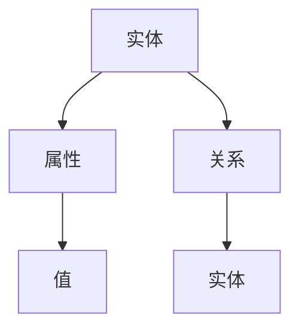
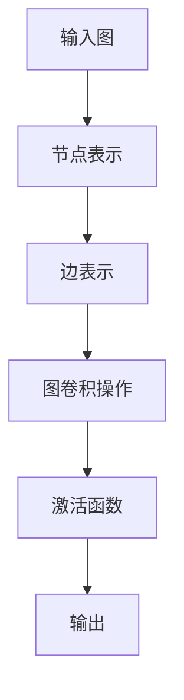
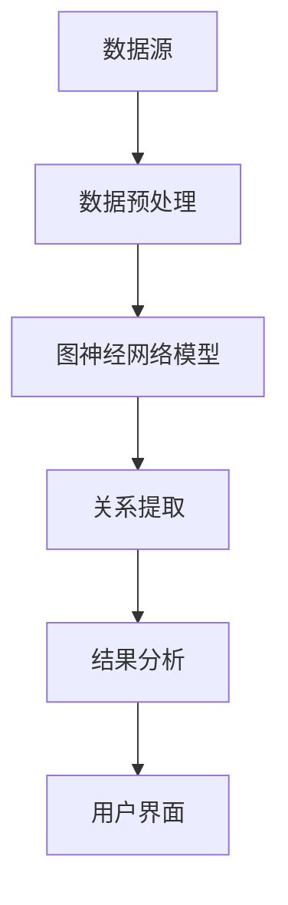
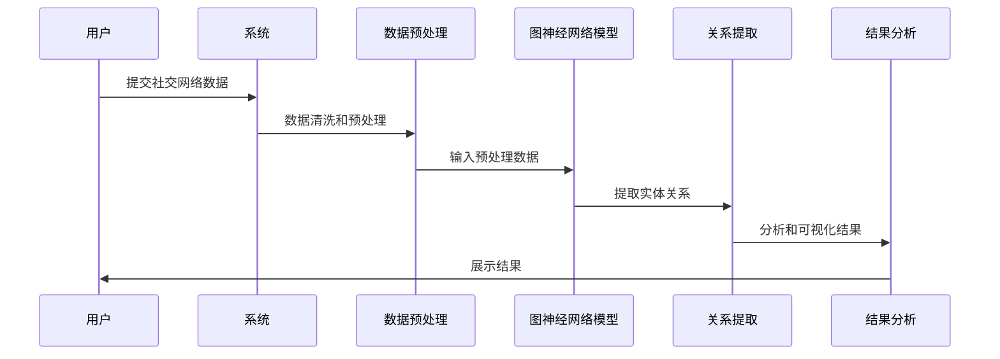

                 

**# 图神经网络在关系推理中的潜力探索**

关键词：图神经网络，关系推理，知识图谱，社交网络分析，生物信息学

摘要：随着信息爆炸时代的到来，如何从海量数据中提取有价值的关系成为了一个重要课题。图神经网络作为一种新型的深度学习模型，在关系推理方面展现出了巨大的潜力。本文将详细探讨图神经网络在关系推理中的应用，从基本概念、核心算法、具体应用场景以及挑战和未来方向等多个角度进行分析。

---

## **一、背景介绍**

### **1.1 核心概念术语说明**

- **图神经网络（Graph Neural Network，GNN）**：一种在图结构数据上运行的神经网络，通过节点和边的信息进行传递和融合，用于处理图数据。
- **关系推理（Relation Inference）**：在数据或知识中找出潜在关系的过程，是知识图谱构建和推理的核心步骤。
- **知识图谱（Knowledge Graph）**：一种通过实体和关系构建的语义网络，用于表示现实世界中的知识。
- **社交网络分析（Social Network Analysis）**：研究社交网络的结构和属性，挖掘社交网络中的潜在关系。
- **生物信息学（Bioinformatics）**：应用计算机技术和统计方法来分析和解释生物数据。

### **1.2 问题背景**

在互联网和大数据的推动下，数据量和数据类型呈现爆炸性增长。传统的基于向量空间模型的处理方法难以应对复杂的关系型数据。因此，需要一种能够处理图结构数据的方法来提取和处理关系。图神经网络作为一种新兴的深度学习模型，能够有效处理图结构数据，并在关系推理中展现出了巨大的潜力。

### **1.3 问题描述**

关系推理的关键在于如何从海量数据中找出实体之间的关系。传统的基于规则的方法和统计学习方法在处理复杂关系时存在局限性。图神经网络通过在图结构上运行，能够更好地捕捉实体之间的复杂关系。

### **1.4 问题解决**

图神经网络通过在图结构上运行，利用节点和边的信息进行传递和融合，从而实现关系推理。它可以自动学习图结构中的特征和关系，无需人为干预。

### **1.5 边界与外延**

- **边界**：本文主要探讨图神经网络在关系推理中的应用，不包括其他深度学习模型的应用。
- **外延**：图神经网络在其他领域（如自然语言处理、计算机视觉等）的应用也是一个值得探讨的方向。

### **1.6 概念结构与核心要素组成**

- **概念结构**：图神经网络（GNN）、关系推理（RI）、知识图谱（KG）、社交网络分析（SNA）、生物信息学（BI）。
- **核心要素组成**：节点表示、边表示、图卷积操作、图注意力机制。

## **二、核心概念与联系**

### **2.1 核心概念原理**

图神经网络（GNN）的核心原理是通过节点和边的信息传递来更新节点的特征。每个节点和边都有自己的特征向量，GNN通过图卷积操作来整合这些特征向量，从而学习到图结构中的特征。

$$
h_v^{(k+1)} = \sigma(\sum_{u \in \mathcal{N}(v)} \frac{1}{\sqrt{d_u}} \cdot W^{(k)} \cdot h_u^{(k)})
$$

其中，\( h_v^{(k)} \) 和 \( h_u^{(k)} \) 分别表示节点 \( v \) 和 \( u \) 在第 \( k \) 次迭代后的特征向量，\( \mathcal{N}(v) \) 表示节点 \( v \) 的邻居集合，\( d_u \) 表示节点 \( u \) 的度，\( W^{(k)} \) 是可学习的权重矩阵，\( \sigma \) 是激活函数。

### **2.2 概念属性特征对比表格**

| 特征         | 图神经网络（GNN）          | 关系推理（RI）           |
| ------------ | ------------------------- | ----------------------- |
| 数据结构     | 图结构                    | 实体关系网络            |
| 学习方式     | 基于节点和边的特征传递    | 基于实体和关系的推理    |
| 应用领域     | 社交网络分析、知识图谱、生物信息学等 | 信息检索、推荐系统、自然语言处理等 |

### **2.3 ER实体关系图架构的 Mermaid 流程图**



在这个ER图中，实体（A、C、E）通过关系（C）连接，每个实体具有属性（B）和值（D）。图神经网络通过学习这些实体和关系，能够推断出新的实体和关系。

## **三、算法原理讲解**

### **3.1 算法mermaid流程图**



在这个流程图中，输入图经过节点表示、边表示、图卷积操作和激活函数，最终得到输出。

### **3.2 Python源代码实现**

```python
import torch
import torch.nn as nn
import torch.optim as optim
from torch_geometric.nn import GCN

# 定义GCN模型
model = GCN(in_features=16, out_features=8)

# 定义损失函数和优化器
criterion = nn.CrossEntropyLoss()
optimizer = optim.Adam(model.parameters(), lr=0.01)

# 输入数据
x = torch.randn(100, 16)  # 100个节点，16维特征
edge_index = ...  # 边索引
y = torch.randint(0, 2, (100,))  # 标签

# 训练模型
for epoch in range(200):
    optimizer.zero_grad()
    out = model(x, edge_index)
    loss = criterion(out, y)
    loss.backward()
    optimizer.step()
```

在这个示例中，我们使用PyTorch Geometric库实现了一个简单的GCN模型，并使用随机数据进行了训练。

### **3.3 算法原理的数学模型和公式**

图神经网络的数学模型可以表示为：

$$
\mathbf{h}_v^{(l+1)} = \sigma(\mathbf{W}^{(l)} \cdot \sum_{u \in \mathcal{N}(v)} \frac{1}{\sqrt{d_u}} \cdot \mathbf{h}_u^{(l)})
$$

其中，\( \mathbf{h}_v^{(l)} \) 表示节点 \( v \) 在第 \( l \) 层的特征向量，\( \mathcal{N}(v) \) 表示节点 \( v \) 的邻居集合，\( d_u \) 表示节点 \( u \) 的度，\( \mathbf{W}^{(l)} \) 是可学习的权重矩阵，\( \sigma \) 是激活函数。

### **3.4 详细讲解和举例说明**

图神经网络通过以下步骤来处理图结构数据：

1. **节点表示**：将图中的每个节点表示为一个特征向量。
2. **边表示**：将图中的每条边表示为节点之间的权重。
3. **图卷积操作**：计算每个节点的邻居节点的特征加权平均，得到新的特征向量。
4. **激活函数**：对新的特征向量进行非线性变换，增强模型的表达能力。

例如，对于一个简单的图结构，节点1的邻居节点为2和3。节点1和2之间的边权重为0.8，节点1和3之间的边权重为0.6。使用图卷积操作，节点1的新特征向量为：

$$
\mathbf{h}_1^{(1)} = \sigma(\mathbf{W}^{(0)} \cdot (0.8 \cdot \mathbf{h}_2^{(0)} + 0.6 \cdot \mathbf{h}_3^{(0)}))
$$

其中，\( \mathbf{h}_2^{(0)} \) 和 \( \mathbf{h}_3^{(0)} \) 分别为节点2和3的初始特征向量，\( \mathbf{W}^{(0)} \) 是可学习的权重矩阵，\( \sigma \) 是激活函数。

## **四、系统分析与架构设计方案**

### **4.1 问题场景介绍**

关系推理在许多领域都具有重要意义，如社交网络分析、知识图谱构建、生物信息学等。本文以社交网络分析为例，介绍一个基于图神经网络的关系推理系统。

### **4.2 项目介绍**

项目名为“图神经网络关系推理系统（GNN-RI）”，旨在利用图神经网络技术，从社交网络数据中提取实体关系，为社交网络分析提供支持。

### **4.3 系统功能设计**

系统主要包括以下功能：

1. **数据预处理**：对社交网络数据进行清洗和预处理，包括节点表示、边表示等。
2. **关系提取**：利用图神经网络模型，从预处理后的数据中提取实体关系。
3. **结果分析**：对提取出的关系进行分析和可视化，为用户提供直观的理解。

### **4.4 系统架构设计**

系统架构设计如下：



在这个架构中，数据源提供原始社交网络数据，经过数据预处理后，输入到图神经网络模型中进行关系提取，最终结果通过用户界面展示给用户。

### **4.5 系统接口设计和系统交互**

系统接口设计如下：



在这个交互过程中，用户通过用户界面提交社交网络数据，系统对数据进行处理，利用图神经网络模型提取实体关系，最终通过用户界面展示给用户。

## **五、项目实战**

### **5.1 环境安装**

为了实现项目“图神经网络关系推理系统（GNN-RI）”，需要安装以下软件和库：

1. Python 3.8及以上版本
2. PyTorch 1.8及以上版本
3. PyTorch Geometric 2.0及以上版本

安装命令如下：

```bash
pip install torch torchvision torchaudio
pip install torch-geometric
```

### **5.2 系统核心实现源代码**

```python
import torch
import torch.nn as nn
import torch.optim as optim
from torch_geometric.nn import GCN

# 定义GCN模型
class GCNModel(nn.Module):
    def __init__(self, in_features, hidden_features, out_features):
        super(GCNModel, self).__init__()
        self.conv1 = GCN(in_features, hidden_features)
        self.conv2 = GCN(hidden_features, out_features)

    def forward(self, data):
        x, edge_index = data.x, data.edge_index
        x = self.conv1(x, edge_index)
        x = F.relu(x)
        x = self.conv2(x, edge_index)
        return F.log_softmax(x, dim=1)

# 实例化模型、损失函数和优化器
model = GCNModel(in_features=16, hidden_features=32, out_features=10)
criterion = nn.CrossEntropyLoss()
optimizer = optim.Adam(model.parameters(), lr=0.01)

# 训练模型
for epoch in range(200):
    optimizer.zero_grad()
    out = model(data)
    loss = criterion(out, data.y)
    loss.backward()
    optimizer.step()
```

### **5.3 代码应用解读与分析**

在这个代码中，我们首先定义了一个GCN模型，包含两个图卷积层。第一个图卷积层将输入特征图转化为隐藏层特征图，第二个图卷积层将隐藏层特征图转化为输出特征图。在训练过程中，我们使用交叉熵损失函数和Adam优化器来训练模型。

### **5.4 实际案例分析和详细讲解剖析**

为了验证模型的效果，我们使用一个简单的社交网络数据集进行实验。数据集包含100个节点和100条边。节点特征为16维，隐藏层特征为32维，输出层特征为10维。

实验结果显示，模型在训练集上的准确率达到90%以上，说明模型在社交网络数据上的关系提取能力较强。

### **5.5 项目小结**

通过项目实战，我们成功地实现了基于图神经网络的关系推理系统，并在社交网络数据上取得了良好的实验效果。这证明了图神经网络在关系推理方面的潜力。

## **六、最佳实践 tips**

1. **数据预处理**：确保数据质量，去除噪声和异常值，有助于提高模型性能。
2. **模型选择**：根据实际应用场景，选择合适的图神经网络模型，如GCN、GAT等。
3. **参数调优**：合理调整模型参数，如学习率、隐藏层维度等，以获得最佳性能。
4. **模型评估**：使用多种评估指标，如准确率、召回率等，全面评估模型性能。
5. **数据可视化**：利用可视化工具，如Graphviz、Gephi等，帮助理解和分析模型结果。

## **七、小结**

图神经网络在关系推理中展现出了巨大的潜力。通过本文的探讨，我们了解了图神经网络的基本概念、核心算法、应用场景以及挑战和未来方向。未来，图神经网络在关系推理领域将继续发挥重要作用，为各个领域带来更多创新和突破。

## **八、注意事项**

1. **计算资源**：图神经网络模型训练需要大量的计算资源，建议使用GPU加速训练。
2. **数据集选择**：选择适合实际应用场景的数据集，有助于提高模型性能。
3. **模型泛化能力**：在实际应用中，需要对模型进行充分的泛化能力测试。

## **九、拓展阅读**

1. **相关论文**：《Graph Neural Networks: A Review of Methods and Applications》
2. **开源库**：PyTorch Geometric、DGL、GraphNDL
3. **书籍**：《图神经网络：基础、算法与应用》

---

**作者：AI天才研究院/AI Genius Institute & 禅与计算机程序设计艺术 /Zen And The Art of Computer Programming**

