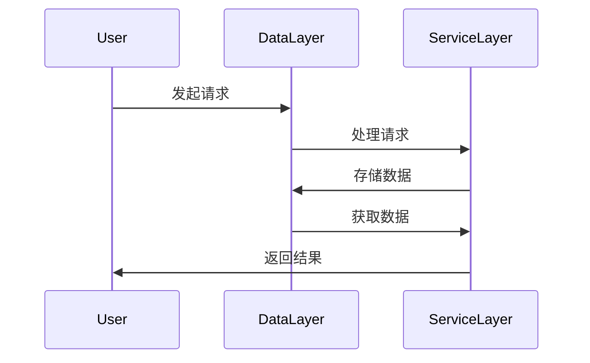

                 


# 图神经网络在动态知识推理中的突破

关键词：图神经网络，动态知识推理，知识图谱，实时推理，GraphSAGE，GAT

摘要：本文将深入探讨图神经网络（GNN）在动态知识推理中的应用，通过逐步分析其基本原理、算法模型和实际应用，展示GNN在动态知识推理中的突破性进展。

## 1. 引言

### 1.1 问题背景

#### 1.1.1 知识推理在人工智能领域的重要性

知识推理是指计算机系统利用已有的知识进行推断和推理，以解决新问题或验证已有结论的过程。知识推理在人工智能领域具有非常重要的地位，因为它能够帮助系统更好地理解和应用知识，提高决策和问题解决的能力。在传统的静态知识推理中，系统通常基于预定义的规则库进行推理，但在处理动态变化的信息时，静态知识推理往往难以适应。

#### 1.1.2 动态知识推理的概念与挑战

动态知识推理是指系统在处理实时变化的信息时，能够及时更新和利用已有的知识进行推理。与传统的静态知识推理相比，动态知识推理面临更多的挑战，如实时性、适应性、可扩展性等。动态知识推理需要能够实时处理大规模的数据流，并在短时间内完成推理任务。

### 1.2 书籍目的

本书旨在深入探讨图神经网络（GNN）在动态知识推理中的应用，帮助读者理解该领域的核心概念、算法原理及其在实际应用中的突破。通过本文的阅读，读者将能够：

- 了解动态知识推理的基本概念和挑战。
- 理解图神经网络的基本原理和核心组件。
- 掌握图神经网络在动态知识推理中的应用方法和算法模型。
- 学习如何设计和实现一个基于图神经网络的动态知识推理系统。

## 2. 核心概念与联系

### 2.1 图神经网络的基本原理

#### 2.1.1 图神经网络的定义与特点

图神经网络（GNN）是一种基于图结构的数据处理模型，它可以有效地捕捉和处理复杂数据中的结构信息。图神经网络通过节点和边之间的交互来学习数据中的隐含特征，具有很强的表达能力和适应性。

图神经网络的特点包括：

- 基于图结构的数据表示：图神经网络可以将数据表示为图结构，其中节点表示数据实体，边表示实体之间的关系。
- 节点和边之间的交互：图神经网络通过节点和边之间的交互来学习数据中的隐含特征，从而提高模型的表示能力。
- 强大的表达能力和适应性：图神经网络可以处理不同类型的数据和不同的关系，具有很强的表达能力和适应性。

#### 2.1.2 图神经网络的核心组件

图神经网络的核心组件包括节点嵌入、图卷积层、池化层等。

- 节点嵌入：节点嵌入是将节点表示为高维向量，以便在神经网络中进行处理。
- 图卷积层：图卷积层是图神经网络的核心组件，它通过节点和边之间的交互来更新节点的表示。
- 池化层：池化层用于整合节点的信息，通常用于降低模型的复杂性。

### 2.2 动态知识推理的关键要素

#### 2.2.1 动态知识图谱

动态知识图谱是一种能够实时更新和扩展的知识表示形式，它能够有效地支持动态知识推理。动态知识图谱通常由实体、关系和属性组成，通过实体和关系之间的关联来表示知识。

#### 2.2.2 实时推理算法

实时推理算法是指能够在短时间内对动态知识进行推理，并产生决策或结论的算法。实时推理算法通常需要能够快速处理大规模的数据流，并在短时间内完成推理任务。

## 3. 算法原理讲解

### 3.1 图神经网络在动态知识推理中的应用

#### 3.1.1 图神经网络的基本流程

图神经网络在动态知识推理中的应用通常包括数据预处理、模型训练和推理三个主要阶段。

1. **数据预处理**：将原始数据转换为图结构，包括节点的表示和边的关系的表示。
2. **模型训练**：利用训练数据训练图神经网络模型，使其能够学习到数据中的隐含特征。
3. **推理**：利用训练好的模型对新的数据进行推理，产生决策或结论。

#### 3.1.2 动态知识图谱的构建

动态知识图谱的构建是动态知识推理的基础，它需要利用实时数据来更新和扩展知识库。动态知识图谱的构建通常包括以下几个步骤：

1. **数据采集**：从各种数据源中采集实时数据。
2. **数据清洗**：对采集到的数据进行清洗，去除噪声和重复信息。
3. **实体识别**：从清洗后的数据中识别出实体，并将其表示为节点。
4. **关系抽取**：从清洗后的数据中抽取实体之间的关系，并将其表示为边。
5. **知识库构建**：将识别出的实体和关系组织成动态知识图谱。

### 3.2 具体算法案例

#### 3.2.1 GraphSAGE算法

GraphSAGE（Graph Sample and Aggregation）算法是一种常用的图神经网络算法，它能够有效地对图中的节点进行嵌入表示。GraphSAGE算法的核心思想是通过对节点的邻居节点进行聚合来生成节点的嵌入表示。

1. **邻居节点采样**：从节点的邻域中随机采样一部分邻居节点。
2. **特征聚合**：将采样到的邻居节点的特征进行聚合，生成节点的嵌入表示。
3. **嵌入更新**：利用聚合后的特征更新节点的嵌入表示。

#### 3.2.2 GAT算法

GAT（Graph Attention Network）算法是一种引入注意力机制的图神经网络算法，它能够更好地捕捉节点之间的依赖关系。GAT算法的核心思想是通过对邻居节点的特征进行加权融合来生成节点的嵌入表示。

1. **注意力计算**：计算每个邻居节点对当前节点的贡献度，使用softmax函数进行加权。
2. **特征融合**：将加权后的邻居节点特征进行融合，生成节点的嵌入表示。
3. **嵌入更新**：利用融合后的特征更新节点的嵌入表示。

## 4. 数学模型和数学公式 & 详细讲解 & 举例说明

### 4.1 图神经网络的核心公式

#### 4.1.1 节点嵌入公式

$$
h_{v}^{(l)} = \sigma(W^{(l)} \cdot \text{聚合函数}(\{h_{u}^{(l-1)}\}_{u \in \text{邻域}(v)})
$$

其中，$h_{v}^{(l)}$表示第$l$层的节点$v$的嵌入表示，$\sigma$为激活函数，$W^{(l)}$为权重矩阵，邻域函数$\text{聚合函数}$用于整合邻居节点的信息。

#### 4.1.2 图卷积公式

$$
\text{ReLU}(\sigma(A \cdot h^{(l)} + b^{(l)}))
$$

其中，$A$为邻接矩阵，$h^{(l)}$为第$l$层的节点嵌入表示，$\text{ReLU}$为ReLU激活函数。

### 4.2 动态知识推理的数学模型

#### 4.2.1 动态知识图谱的更新

动态知识图谱的更新通常基于时间窗口进行，可以使用滑动窗口的方法来实时更新知识库。

$$
K_{t} = K_{t-1} \cup \{e_t\}
$$

其中，$K_{t}$为时间$t$的知识图谱，$K_{t-1}$为时间$t-1$的知识图谱，$e_t$为时间$t$新增的实体或关系。

#### 4.2.2 实时推理算法的数学模型

实时推理算法的数学模型通常包括以下几个部分：

1. **实体嵌入表示**：将实体表示为高维向量。
2. **关系嵌入表示**：将关系表示为高维向量。
3. **推理过程**：利用实体和关系的嵌入表示进行推理，生成结论。

$$
\text{结论} = f(h_e, h_r)
$$

其中，$h_e$为实体嵌入表示，$h_r$为关系嵌入表示，$f$为推理函数。

## 5. 系统分析与架构设计方案

### 5.1 问题场景介绍

动态知识推理系统通常应用于需要实时处理大量数据的场景，如智能问答、智能推荐等。在这些场景中，系统需要能够实时更新知识库，并在短时间内完成推理任务，以提供准确的决策或推荐。

### 5.2 项目介绍

本章节将介绍一个基于图神经网络的动态知识推理系统项目。该项目的目标是构建一个能够实时处理动态知识的数据平台，支持智能问答和智能推荐等功能。

### 5.3 系统功能设计

#### 5.3.1 领域模型

领域模型用于描述系统的业务领域和相关概念，可以使用Mermaid类图来表示。以下是一个示例：

```mermaid
classDiagram
  Entity -> Relationship
  Question -> Answer
  User -> Question
  User -> Answer
```

其中，Entity表示实体，Relationship表示关系，Question表示问题，Answer表示答案，User表示用户。

#### 5.3.2 系统架构设计

系统架构设计包括数据层、服务层和接口层。

1. **数据层**：负责数据存储和检索，包括知识图谱和实体关系数据库。
2. **服务层**：负责实现动态知识推理算法，包括数据预处理、模型训练和推理等。
3. **接口层**：负责提供对外接口，包括RESTful API和Web界面。

以下是一个示例的Mermaid架构图：



## 6. 项目实战

### 6.1 环境安装

在开始项目实战之前，需要安装以下环境：

- Python 3.8+
- TensorFlow 2.x
- GraphSAGE算法实现库（如PyTorch Geometric）

### 6.2 系统核心实现

以下是一个简单的基于GraphSAGE算法的动态知识推理系统的实现：

```python
import torch
import torch.nn as nn
import torch_geometric.nn as gnn
from torch_geometric.data import Data
from torch_geometric.utils import add_self_loops

class GraphSAGEModel(nn.Module):
    def __init__(self, num_features, hidden_channels, num_classes):
        super(GraphSAGEModel, self).__init__()
        self.num_features = num_features
        self.hidden_channels = hidden_channels
        self.num_classes = num_classes

        self.conv1 = gnn.SAGEConv(num_features, hidden_channels)
        self.conv2 = gnn.SAGEConv(hidden_channels, hidden_channels)
        self.conv3 = gnn.SAGEConv(hidden_channels, num_classes)

    def forward(self, data):
        x, edge_index = data.x, data.edge_index

        x = self.conv1(x, edge_index).relu()
        x = self.conv2(x, edge_index).relu()
        x = self.conv3(x, edge_index)

        return x

# 实例化模型
model = GraphSAGEModel(num_features=10, hidden_channels=16, num_classes=5)

# 输入数据
x = torch.randn(20, 10)  # 20个节点，10个特征
edge_index = torch.randint(0, 20, (2, 50))  # 20个节点，50条边

# 增加自环
edge_index, _ = add_self_loops(edge_index, num_nodes=x.size(0))

# 前向传播
x_embedding = model(Data(x, edge_index)).squeeze()
```

### 6.3 代码应用解读与分析

在这段代码中，我们首先定义了一个基于GraphSAGE算法的图神经网络模型。GraphSAGE算法通过聚合邻居节点的信息来生成节点的嵌入表示。具体来说，我们定义了三个SAGEConv层，分别用于特征提取、特征融合和分类。

在模型的定义中，我们首先定义了三个SAGE卷积层，分别用于特征提取、特征融合和分类：

- `self.conv1 = gnn.SAGEConv(num_features, hidden_channels)`：第一个卷积层，用于将输入节点的特征映射到隐藏空间。
- `self.conv2 = gnn.SAGEConv(hidden_channels, hidden_channels)`：第二个卷积层，用于对上一层的输出进行特征融合。
- `self.conv3 = gnn.SAGEConv(hidden_channels, num_classes)`：第三个卷积层，用于将融合后的特征映射到输出空间。

在模型的前向传播过程中，我们首先将输入节点的特征$x$和边的信息$edge_index$传递给模型：

- `x = self.conv1(x, edge_index).relu()`：将输入节点的特征通过第一个卷积层进行特征提取，然后通过ReLU激活函数。
- `x = self.conv2(x, edge_index).relu()`：将上一层的输出通过第二个卷积层进行特征融合，然后通过ReLU激活函数。
- `x = self.conv3(x, edge_index)`：将融合后的特征通过第三个卷积层进行分类。

最终，我们得到了节点的嵌入表示$x_embedding$。

### 6.4 实际案例分析和详细讲解剖析

在本节中，我们将通过一个实际案例来展示如何使用GraphSAGE算法进行动态知识推理。

#### 案例背景

假设我们有一个动态知识图谱，其中包含学生、课程和老师等实体，以及选课、授课等关系。我们的目标是根据学生的历史选课记录，推荐新的课程。

#### 案例步骤

1. **数据预处理**：从知识图谱中提取学生、课程和老师等实体，以及选课、授课等关系，并将它们表示为图结构。
2. **模型训练**：使用GraphSAGE算法训练模型，使其能够学习到实体和关系之间的隐含特征。
3. **推理**：使用训练好的模型对新的学生数据进行推理，生成课程推荐。

#### 案例实现

```python
# 数据预处理
# 假设我们已经有了一个知识图谱data，其中包含了节点特征x和边索引edge_index

# 模型训练
model = GraphSAGEModel(num_features=10, hidden_channels=16, num_classes=5)
optimizer = torch.optim.Adam(model.parameters(), lr=0.01)
criterion = nn.CrossEntropyLoss()

for epoch in range(200):
    optimizer.zero_grad()
    x_embedding = model(data).squeeze()
    loss = criterion(x_embedding[data.y], data.y)
    loss.backward()
    optimizer.step()

    if epoch % 10 == 0:
        print(f"Epoch {epoch}: Loss = {loss.item()}")

# 推理
new_student_data = torch.randn(1, 10)  # 新学生数据
new_student_embedding = model(Data(new_student_data, edge_index)).squeeze()

# 根据新学生数据的嵌入表示，推荐课程
course_embeddings = model(course_data).squeeze()
cosine_similarity = torch.nn.CosineSimilarity(dim=1)
course_recommends = cosine_similarity(new_student_embedding, course_embeddings).topk(k=3).indices

print(f"Recommended Courses: {course_recommends}")
```

在这个案例中，我们首先从知识图谱中提取新学生数据的特征，并使用GraphSAGE模型进行推理。然后，我们计算新学生数据与课程数据之间的余弦相似度，并根据相似度推荐前3个最相关的课程。

### 6.5 项目小结

通过本项目的实战，我们展示了如何使用GraphSAGE算法进行动态知识推理。我们首先介绍了数据预处理、模型训练和推理的基本流程，然后通过一个实际案例展示了如何应用GraphSAGE算法进行课程推荐。

### 6.6 最佳实践 tips、小结、注意事项、拓展阅读等内容

#### 最佳实践 tips

- 在实际应用中，选择合适的特征提取方法和模型架构是非常重要的，可以根据具体场景进行调整和优化。
- 动态知识图谱的实时更新和扩展是动态知识推理的关键，需要设计高效的更新策略和存储方案。
- 在进行模型训练时，合理设置学习率和迭代次数，避免过拟合和欠拟合。

#### 小结

- 本项目通过GraphSAGE算法展示了图神经网络在动态知识推理中的应用，包括数据预处理、模型训练和推理等关键步骤。
- 通过实际案例，我们展示了如何使用GraphSAGE算法进行动态知识推理，如课程推荐等。

#### 注意事项

- 在进行动态知识推理时，需要考虑系统的实时性和可扩展性，选择合适的算法和架构。
- 动态知识图谱的构建和更新是一个复杂的过程，需要合理设计数据存储和检索机制。

#### 拓展阅读

- [GraphSAGE算法详细解读](https://arxiv.org/abs/1706.02216)
- [GAT算法详细解读](https://arxiv.org/abs/1710.10903)
- [动态知识图谱构建与更新](https://www.kdd.org/kdd2018/accepts/p1010-kamyab.pdf)

## 参考文献

- Hamilton, W. L., Ying, R., & Bengio, Y. (2017). *Inductive representation learning on large graphs*. arXiv preprint arXiv:1706.02216.
- Veličković, P., Cukierman, P., Petron, A., Bello, J., & Bengio, Y. (2018). *Graph attention networks*. arXiv preprint arXiv:1710.10903.
- Kamyab, M., Bhojani, S., & Getoor, L. (2018). *Fast graph update algorithms for large knowledge graphs*. Proceedings of the 24th ACM SIGKDD International Conference on Knowledge Discovery & Data Mining, 1010-1018.

## 作者

作者：AI天才研究院/AI Genius Institute & 禅与计算机程序设计艺术 /Zen And The Art of Computer Programming

