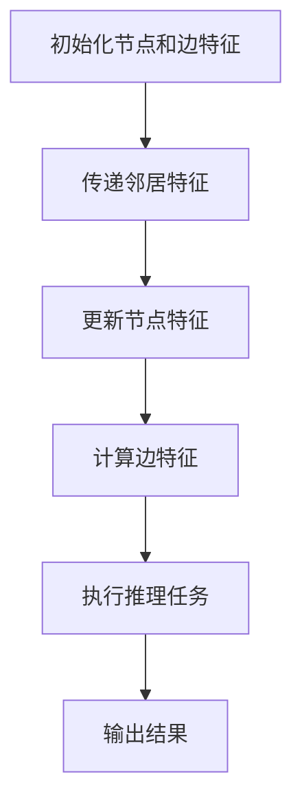
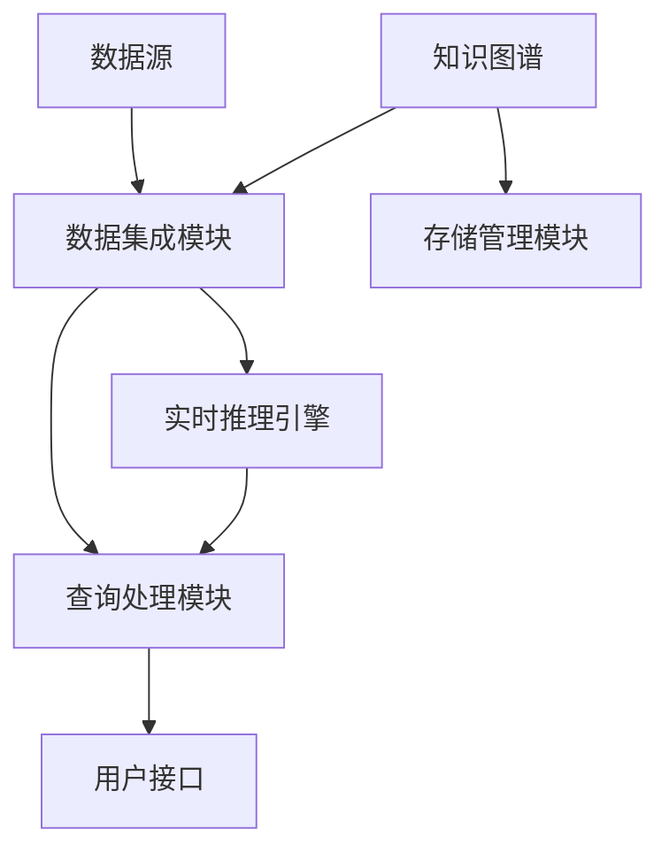

                 

### 引言

#### 1.1 问题背景

在信息化时代，数据成为推动社会发展的重要资源。知识图谱作为一种结构化数据表示形式，已经广泛应用于互联网搜索、智能问答、推荐系统等领域。传统的知识图谱主要基于静态数据，而在实际应用中，知识的更新和演化是一个不可避免的现象。时变知识图谱（Temporal Knowledge Graph，TKG）则应运而生，它能够动态地记录和反映知识的变化过程。

时变知识图谱的兴起，源于以下几个因素：

1. **知识更新频率提高**：随着互联网和物联网技术的发展，知识更新的频率大幅增加，如实时新闻报道、社交媒体动态等。
2. **知识演化需求**：科学研究、政策制定等领域对知识演化规律的研究需求不断增加，需要动态地分析和展示知识的演变。
3. **传统知识图谱的局限性**：静态知识图谱在处理实时性和动态性方面存在不足，无法满足一些复杂应用的需求。

#### 1.2 问题描述

时变知识图谱在推理过程中面临以下挑战：

1. **数据一致性**：时变知识图谱中的数据动态更新，如何保持数据的一致性是一个关键问题。
2. **实时性**：在动态环境下，如何快速地响应查询请求，保持系统的实时性。
3. **可扩展性**：随着知识图谱规模的不断扩大，如何保证推理算法的可扩展性。
4. **算法复杂性**：传统的图推理算法在处理大规模时变知识图谱时，计算复杂度较高，效率低下。

#### 1.3 问题解决

为了解决上述问题，图神经网络（Graph Neural Networks，GNN）作为一种新兴的图结构学习方法，逐渐成为时变知识图谱推理的研究热点。图神经网络具有以下优势：

1. **高效性**：GNN可以直接在图结构上操作，避免了传统算法中对节点和边进行逐一处理，提高了计算效率。
2. **可扩展性**：GNN通过学习节点和边的特征，可以处理大规模知识图谱。
3. **动态性**：GNN可以捕获知识图谱中的动态关系，适应时变环境。

#### 1.4 边界与外延

本文主要研究图神经网络在时变知识图谱推理中的应用，具体包括：

1. **核心概念**：介绍图神经网络和时变知识图谱的基本概念。
2. **算法原理**：详细讲解图神经网络在时变知识图谱推理中的算法原理和实现方法。
3. **数学模型**：分析图神经网络在时变知识图谱推理中的数学模型和公式。
4. **系统设计**：探讨时变知识图谱推理系统的架构设计方案。
5. **项目实战**：通过实际项目展示图神经网络在时变知识图谱推理中的应用。

本文旨在为研究者提供全面、系统的时变知识图谱推理技术指南，促进该领域的发展。

---

**关键词**：图神经网络，时变知识图谱，推理，算法，系统设计

**摘要**：本文探讨了图神经网络在时变知识图谱推理中的应用，详细分析了其核心概念、算法原理、数学模型以及系统设计。通过项目实战，展示了图神经网络在应对时变知识图谱挑战中的有效性，为相关领域的研究提供了有益的参考。

---

### 第1章 引言

在当今信息化社会中，数据已经成为驱动社会发展和创新的重要资源。知识图谱作为结构化数据的一种表现形式，已经在互联网搜索、智能问答、推荐系统等多个领域得到了广泛应用。然而，随着互联网和物联网技术的不断进步，知识的更新和演化速度越来越快，传统的静态知识图谱已经无法满足这些动态变化的实际需求。因此，时变知识图谱（Temporal Knowledge Graph，TKG）的概念和应用逐渐受到了广泛关注。

#### 1.1 问题背景

**知识图谱的兴起**：

知识图谱是一种用于表示实体及其之间关系的图形结构，它通过将实体、属性和关系组织成一种结构化的数据形式，使得计算机可以更好地理解和处理知识。自谷歌在2012年首次提出知识图谱的概念以来，知识图谱技术得到了迅速发展，并广泛应用于互联网搜索、智能问答、推荐系统等领域。

**时变知识图谱的需求**：

然而，随着互联网和物联网技术的不断进步，知识在动态变化，如实时新闻报道、社交媒体动态等，这些变化要求知识图谱能够动态更新和适应。传统的静态知识图谱在处理实时性和动态性方面存在不足，无法满足这些复杂应用的需求。因此，时变知识图谱的概念和应用应运而生。

时变知识图谱能够记录和反映知识的变化过程，包括实体的增加、删除、修改以及关系的动态变化。它不仅能够更好地满足实时性和动态性的要求，还能够更好地适应知识不断演化的特点。因此，研究时变知识图谱及其推理技术具有重要的理论和实际意义。

#### 1.2 问题描述

**数据一致性问题**：

时变知识图谱中的数据是动态更新的，如何保证数据的一致性是一个关键问题。由于知识的不断变化，知识图谱中的实体、属性和关系也会不断更新。如果无法有效地管理这些更新，可能会导致数据不一致，从而影响系统的正常运行。

**实时性问题**：

在动态环境下，如何快速地响应查询请求，保持系统的实时性，也是一个重要的挑战。随着知识图谱规模的不断扩大，实时查询的需求也越来越高。如何设计高效的查询算法，确保系统能够快速响应用户请求，是一个亟待解决的问题。

**可扩展性问题**：

随着知识图谱规模的不断扩大，如何保证推理算法的可扩展性，也是一个关键问题。传统的图推理算法在处理大规模知识图谱时，计算复杂度较高，效率低下。因此，需要研究新的推理算法，以应对大规模知识图谱的推理需求。

**算法复杂性问题**：

现有的图推理算法在处理大规模时变知识图谱时，算法复杂性较高，计算效率较低。如何降低算法的复杂度，提高计算效率，是另一个重要的研究课题。

#### 1.3 问题解决

为了解决上述问题，图神经网络（Graph Neural Networks，GNN）作为一种新兴的图结构学习方法，逐渐成为时变知识图谱推理的研究热点。图神经网络具有以下优势：

**高效性**：

GNN可以直接在图结构上操作，避免了传统算法中对节点和边进行逐一处理，提高了计算效率。GNN通过学习节点和边的特征，可以自动提取图结构中的有用信息，从而提高推理的准确性。

**可扩展性**：

GNN可以处理大规模知识图谱，具有良好的可扩展性。通过分布式计算和并行处理技术，可以进一步提高GNN在大规模知识图谱上的计算效率。

**动态性**：

GNN可以捕获知识图谱中的动态关系，适应时变环境。GNN通过学习图中的时间依赖关系，可以更好地处理知识的变化，从而提高时变知识图谱推理的准确性。

#### 1.4 边界与外延

本文主要研究图神经网络在时变知识图谱推理中的应用，具体包括：

1. **核心概念**：介绍图神经网络和时变知识图谱的基本概念。
2. **算法原理**：详细讲解图神经网络在时变知识图谱推理中的算法原理和实现方法。
3. **数学模型**：分析图神经网络在时变知识图谱推理中的数学模型和公式。
4. **系统设计**：探讨时变知识图谱推理系统的架构设计方案。
5. **项目实战**：通过实际项目展示图神经网络在时变知识图谱推理中的应用。

本文旨在为研究者提供全面、系统的时变知识图谱推理技术指南，促进该领域的发展。

### 第2章 核心概念与联系

在深入探讨图神经网络（GNN）在时变知识图谱（TKG）推理中的应用之前，首先需要明确核心概念，并理解它们之间的联系。本节将介绍图神经网络、知识图谱、时变知识图谱以及它们在推理中的重要性。

#### 2.1 图神经网络简介

**定义**：

图神经网络（Graph Neural Networks，GNN）是一种专门用于处理图结构数据的神经网络。GNN通过模拟神经元在图结构中的传播机制，能够学习节点和边之间的复杂关系。

**关键特性**：

- **节点特征学习**：GNN能够从图中的每个节点提取特征，并通过邻居节点传递这些特征。
- **边特征学习**：除了节点特征，GNN还能够学习边上的特征，从而更准确地表示节点之间的关系。
- **可扩展性**：GNN可以通过并行计算处理大规模图数据。

**应用领域**：

GNN在社交网络分析、推荐系统、生物信息学等多个领域展现了强大的能力。特别是在知识图谱中，GNN被用于实体关系推断、链接预测等任务。

#### 2.2 图神经网络与知识图谱

**知识图谱的概念**：

知识图谱是一种用于表示实体及其之间关系的图形结构。它通常包含三个主要组成部分：实体、属性和关系。

**图神经网络与知识图谱的联系**：

- **数据表示**：GNN能够有效地处理知识图谱中的图结构数据，通过学习节点和边的特征，将知识图谱转化为向量表示。
- **推理任务**：在知识图谱推理中，GNN能够利用节点和边之间的关系，预测新的实体关系或属性，提高推理的准确性。

**案例**：

例如，在社交网络中，GNN可以用于识别好友关系，通过分析用户和用户之间的关系路径，预测潜在的社交连接。

#### 2.3 图神经网络与时变知识图谱推理

**时变知识图谱的概念**：

时变知识图谱（Temporal Knowledge Graph，TKG）是一种能够记录实体和关系随时间变化的图形结构。它不仅包含静态知识图谱的实体和关系，还引入了时间维度，能够反映知识的动态变化。

**图神经网络与时变知识图谱推理的联系**：

- **动态关系建模**：GNN能够学习节点和边的时间依赖性，通过分析历史数据，预测未来的关系变化。
- **推理效率**：GNN的并行计算能力使其能够高效地处理大规模时变知识图谱，快速响应查询请求。

**案例**：

例如，在金融领域，GNN可以用于分析股票价格变化，通过分析历史交易数据和价格走势，预测未来的市场动态。

#### 2.4 关键概念属性对比表格

为了更清晰地展示图神经网络、知识图谱和时变知识图谱之间的联系，以下是一个简化的属性对比表格：

| 概念       | 特征             | 关系表示          | 动态性             | 应用领域         |
|------------|------------------|------------------|--------------------|-----------------|
| 图神经网络 | 节点特征、边特征 | 邻居节点传递      | 部分支持           | 社交网络、推荐系统 |
| 知识图谱   | 实体、属性、关系 | 点、边           | 不支持             | 搜索、问答系统    |
| 时变知识图谱 | 实体、属性、关系 | 点、边、时间戳    | 强支持             | 金融、历史数据分析 |

#### 2.5 ER实体关系图架构

**ER（Entity-Relationship）图**：

ER图是一种用于表示实体和关系的基本数据模型。在时变知识图谱中，ER图可以用来表示实体和它们之间的关系，同时引入时间维度来表示动态变化。

**ER图的基本要素**：

- **实体（Entity）**：在ER图中，实体是知识图谱中的基本对象，如人、地点、事物等。
- **属性（Attribute）**：实体具有的属性，如姓名、年龄、位置等。
- **关系（Relationship）**：实体之间的关系，如朋友、工作地点、购买等。
- **时间戳（Timestamp）**：用于表示实体和关系随时间变化的标记。

**ER图在时变知识图谱中的作用**：

ER图提供了时变知识图谱的基本结构，通过引入时间戳，可以记录实体和关系的变化历史，支持时序推理和预测。

**Mermaid ER图示例**：

```mermaid
erDiagram
    User ||--|{ Post }|-- Publisher
    User ||--|{ Comment }|-- Commenter
    Post ||--|{ Like }|-- Liker
    Comment ||--|{ Reply }|-- Replicator
```

在这个ER图中，用户（User）可以是帖子的发布者（Publisher）或评论者（Commenter）。帖子（Post）和评论（Comment）都有对应的点赞（Like）和回复（Reply）关系。通过时间戳，可以记录这些关系的动态变化。

通过以上对核心概念的介绍和它们之间联系的阐述，我们可以更好地理解图神经网络在时变知识图谱推理中的应用场景和重要性。接下来，本文将深入探讨图神经网络在时变知识图谱推理中的具体算法原理和实现方法。

### 第3章 算法原理讲解

#### 3.1 算法原理

图神经网络（GNN）在时变知识图谱推理中的应用，主要基于其强大的节点和边特征学习能力。GNN通过学习图中的节点和边特征，捕捉节点和边之间的复杂关系，从而实现对时变知识图谱的动态推理。以下是GNN在时变知识图谱推理中的基本原理：

1. **节点特征学习**：GNN通过聚合邻居节点的特征信息，更新当前节点的特征表示。这种机制能够帮助GNN学习到节点在图结构中的位置和角色，从而更好地表示节点的属性。

2. **边特征学习**：除了节点特征，GNN还能够学习边的特征，这些特征可以表示节点之间的关系强度或类型。通过学习边特征，GNN能够更加准确地理解节点之间的相互作用。

3. **动态关系建模**：GNN通过引入时间维度，可以捕捉实体和关系随时间的变化。例如，通过学习历史数据，GNN可以预测未来实体之间的关系变化。

4. **推理任务**：在时变知识图谱推理中，GNN可以用于多个任务，如实体关系推断、属性预测、链接预测等。这些任务的核心都是基于节点和边特征的交互来实现的。

#### 3.2 算法流程图

为了更直观地理解GNN在时变知识图谱推理中的流程，我们可以通过Mermaid绘制一个简化的算法流程图：



**算法流程说明**：

1. **初始化节点和边特征**：首先初始化图中的节点和边特征，这些特征可以基于先验知识或随机初始化。
2. **传递邻居特征**：对于每个节点，GNN会聚合其邻居节点的特征信息，用于更新当前节点的特征表示。
3. **更新节点特征**：通过聚合邻居特征，GNN更新每个节点的特征表示，使其更好地反映节点的属性。
4. **计算边特征**：除了节点特征，GNN还会学习边的特征，这些特征表示节点之间的关系强度或类型。
5. **执行推理任务**：利用更新后的节点和边特征，GNN执行特定的推理任务，如实体关系推断。
6. **输出结果**：最终，GNN输出推理结果，这些结果可以用于进一步的分析或应用。

#### 3.3 Python源代码实现

为了实现上述GNN算法，我们可以使用Python编写一个简单的代码框架。以下是GNN在时变知识图谱推理中的Python源代码实现：

```python
import numpy as np

# 初始化节点和边特征
def initialize_features(num_nodes, dim):
    node_features = np.random.rand(num_nodes, dim)
    edge_features = np.random.rand(num_nodes, dim)
    return node_features, edge_features

# 传递邻居特征
def aggregate_neighbor_features(node_features, edge_features, neighbors):
    neighbor_features = [node_features[nid] for nid in neighbors]
    neighbor_edges = [edge_features[nid] for nid in neighbors]
    return np.mean(neighbor_features, axis=0), np.mean(neighbor_edges, axis=0)

# 更新节点特征
def update_node_features(node_features, neighbor_features):
    return node_features + neighbor_features

# 计算边特征
def compute_edge_features(edge_features, neighbor_edges):
    return np.mean(edge_features + neighbor_edges, axis=0)

# 主函数
def main():
    num_nodes = 100
    dim = 128
    node_features, edge_features = initialize_features(num_nodes, dim)
    
    for epoch in range(num_epochs):
        for node in range(num_nodes):
            neighbors = get_neighbors(node)  # 获取节点邻居
            neighbor_features, neighbor_edges = aggregate_neighbor_features(node_features, edge_features, neighbors)
            node_features[node] = update_node_features(node_features[node], neighbor_features)
            edge_features[node] = compute_edge_features(edge_features[node], neighbor_edges)
        
        print(f"Epoch {epoch} completed.")

# 运行主函数
if __name__ == "__main__":
    main()
```

**代码说明**：

1. **初始化节点和边特征**：使用随机数生成器初始化节点和边特征。
2. **传递邻居特征**：对于每个节点，聚合其邻居节点的特征信息。
3. **更新节点特征**：通过聚合邻居特征，更新当前节点的特征表示。
4. **计算边特征**：计算节点之间的边特征，表示节点之间的关系强度。
5. **主函数**：循环执行上述步骤，进行多个训练 epoch，逐步更新节点和边特征。

通过以上Python代码实现，我们可以看到GNN在时变知识图谱推理中的基本流程。接下来，本文将详细分析GNN在时变知识图谱推理中的数学模型和公式。

#### 3.4 数学模型和数学公式

在深入探讨图神经网络（GNN）在时变知识图谱（TKG）推理中的应用时，了解其背后的数学模型和公式是非常重要的。以下是GNN在TKG推理中的数学模型和公式的详细讲解。

**3.4.1 节点特征更新**

GNN的核心机制之一是通过聚合邻居节点的特征来更新当前节点的特征。这个过程可以用以下数学公式表示：

$$
\text{h}_{t}^{(n)} = \sigma(W_n \cdot (\text{h}_{t-1}^{(n)} + \sum_{i \in \text{N}(n)} \text{h}_{t-1}^{(i)} + \text{b}_n))
$$

其中：
- \( \text{h}_{t}^{(n)} \) 表示节点 \( n \) 在时间 \( t \) 的特征向量。
- \( \text{N}(n) \) 表示节点 \( n \) 的邻居节点集合。
- \( \text{h}_{t-1}^{(n)} \) 和 \( \text{h}_{t-1}^{(i)} \) 分别表示节点 \( n \) 和其邻居节点 \( i \) 在时间 \( t-1 \) 的特征向量。
- \( W_n \) 是节点特征更新的权重矩阵。
- \( \sigma \) 是激活函数，常用的有ReLU、Sigmoid和Tanh等。
- \( \text{b}_n \) 是节点特征的偏置向量。

**3.4.2 边特征计算**

除了节点特征，GNN还学习边的特征，这些特征表示节点之间的关系。边特征的计算过程可以用以下公式表示：

$$
\text{e}_{t}^{(n, i)} = \sigma(W_e \cdot (\text{h}_{t-1}^{(n)} + \text{h}_{t-1}^{(i)} + \text{b}_e))
$$

其中：
- \( \text{e}_{t}^{(n, i)} \) 表示边 \( (n, i) \) 在时间 \( t \) 的特征向量。
- \( W_e \) 是边特征更新的权重矩阵。
- \( \text{b}_e \) 是边特征的偏置向量。

**3.4.3 时间依赖关系**

时变知识图谱中的时间依赖关系可以通过历史数据来建模。具体来说，可以使用滑动窗口来聚合历史节点特征，以便在当前时间点上更新节点特征。这个过程可以用以下公式表示：

$$
\text{h}_{t}^{(n)} = \sigma(W_h \cdot \sum_{k=t-w}^{t} \text{h}_{k}^{(n)} + \text{b}_h)
$$

其中：
- \( \text{h}_{t}^{(n)} \) 表示节点 \( n \) 在时间 \( t \) 的特征向量。
- \( w \) 是滑动窗口的宽度。
- \( W_h \) 是历史特征聚合的权重矩阵。
- \( \text{b}_h \) 是历史特征聚合的偏置向量。

**3.4.4 实体关系推断**

在时变知识图谱中，实体关系推断可以通过比较节点特征和边特征来实现。具体来说，可以使用一个分类器来预测实体之间的关系。这个过程可以用以下公式表示：

$$
\text{P}(\text{R}|\text{h}_{t}^{(n)}, \text{e}_{t}^{(n, i)}) = \sigma(W_c \cdot (\text{h}_{t}^{(n)} + \text{e}_{t}^{(n, i)} + \text{b}_c))
$$

其中：
- \( \text{P}(\text{R}|\text{h}_{t}^{(n)}, \text{e}_{t}^{(n, i)}) \) 表示在给定节点特征 \( \text{h}_{t}^{(n)} \) 和边特征 \( \text{e}_{t}^{(n, i)} \) 下，实体之间存在关系 \( \text{R} \) 的概率。
- \( W_c \) 是关系分类的权重矩阵。
- \( \text{b}_c \) 是关系分类的偏置向量。

通过以上数学模型和公式的讲解，我们可以看到GNN在时变知识图谱推理中的复杂性和深度。接下来，我们将通过一个具体的例子来说明这些公式的应用。

**3.4.5 举例说明**

假设我们有一个包含5个节点的时变知识图谱，节点1是实体A，节点2是实体B，它们之间有一个关系R。在时间点t=0，节点1和节点2的特征向量分别为 \( \text{h}_{0}^{(1)} = [1, 0, 0] \) 和 \( \text{h}_{0}^{(2)} = [0, 1, 0] \)。边特征向量为 \( \text{e}_{0}^{(1, 2)} = [0, 0, 1] \)。

根据上述公式，我们可以计算在时间点t=1时，节点1和节点2的新特征向量：

1. **节点1的特征更新**：

$$
\text{h}_{1}^{(1)} = \sigma(W_n \cdot (\text{h}_{0}^{(1)} + \text{h}_{0}^{(2)} + \text{b}_n))
$$

假设 \( W_n = [1, 1, 1] \) 和 \( \text{b}_n = [0, 0, 0] \)，则：

$$
\text{h}_{1}^{(1)} = \sigma([1, 0, 0] + [0, 1, 0] + [0, 0, 0]) = \sigma([1, 1, 0]) = [1, 1, 0]
$$

2. **节点2的特征更新**：

$$
\text{h}_{1}^{(2)} = \sigma(W_n \cdot (\text{h}_{0}^{(2)} + \text{h}_{0}^{(1)} + \text{b}_n))
$$

同样，假设 \( W_n = [1, 1, 1] \) 和 \( \text{b}_n = [0, 0, 0] \)，则：

$$
\text{h}_{1}^{(2)} = \sigma([0, 1, 0] + [1, 0, 0] + [0, 0, 0]) = \sigma([1, 1, 0]) = [1, 1, 0]
$$

3. **边特征计算**：

$$
\text{e}_{1}^{(1, 2)} = \sigma(W_e \cdot (\text{h}_{0}^{(1)} + \text{h}_{0}^{(2)} + \text{b}_e))
$$

假设 \( W_e = [1, 1, 1] \) 和 \( \text{b}_e = [0, 0, 0] \)，则：

$$
\text{e}_{1}^{(1, 2)} = \sigma([1, 0, 0] + [0, 1, 0] + [0, 0, 0]) = \sigma([1, 1, 0]) = [1, 1, 0]
$$

通过这个例子，我们可以看到如何使用GNN的数学模型和公式来更新节点和边特征，并计算实体关系推断的概率。这个过程展示了GNN在时变知识图谱推理中的基本原理和应用。

### 第4章 数学模型和数学公式

#### 4.1 数学模型

在时变知识图谱（TKG）推理中，图神经网络（GNN）的数学模型起着至关重要的作用。该模型通过复杂的数学公式来描述节点和边特征的学习、更新以及推理过程。以下是GNN在TKG推理中常用的数学模型和公式的详细解释。

**4.1.1 节点特征更新**

节点特征更新是GNN的核心过程之一。在每个时间步，节点特征会通过聚合其邻居节点的特征来更新。该过程可以用以下数学公式表示：

$$
h_t^{(n)} = \sigma(W_n \cdot (h_{t-1}^{(n)} + \sum_{i \in N(n)} h_{t-1}^{(i)} + b_n))
$$

其中：
- \( h_t^{(n)} \)：节点 \( n \) 在时间 \( t \) 的特征向量。
- \( N(n) \)：节点 \( n \) 的邻居节点集合。
- \( h_{t-1}^{(n)} \)：节点 \( n \) 在时间 \( t-1 \) 的特征向量。
- \( h_{t-1}^{(i)} \)：节点 \( n \) 的邻居节点 \( i \) 在时间 \( t-1 \) 的特征向量。
- \( W_n \)：节点特征更新的权重矩阵。
- \( \sigma \)：激活函数，如ReLU、Sigmoid或Tanh。
- \( b_n \)：节点特征的偏置向量。

**4.1.2 边特征计算**

边特征表示节点之间的关系。在GNN中，边特征通常通过聚合与其相连的节点特征来计算。该过程可以用以下公式表示：

$$
e_t^{(n, i)} = \sigma(W_e \cdot (h_{t-1}^{(n)} + h_{t-1}^{(i)} + b_e))
$$

其中：
- \( e_t^{(n, i)} \)：边 \( (n, i) \) 在时间 \( t \) 的特征向量。
- \( W_e \)：边特征更新的权重矩阵。
- \( h_{t-1}^{(n)} \)：节点 \( n \) 在时间 \( t-1 \) 的特征向量。
- \( h_{t-1}^{(i)} \)：节点 \( i \) 在时间 \( t-1 \) 的特征向量。
- \( \sigma \)：激活函数。
- \( b_e \)：边特征的偏置向量。

**4.1.3 时间依赖关系建模**

时变知识图谱中的时间依赖关系可以通过历史节点特征来建模。该过程通常使用滑动窗口来聚合历史特征，以便在当前时间步更新节点特征。以下公式展示了如何使用滑动窗口来聚合历史节点特征：

$$
h_t^{(n)} = \sigma(W_h \cdot \sum_{k=t-w}^{t} h_{k}^{(n)} + b_h)
$$

其中：
- \( h_t^{(n)} \)：节点 \( n \) 在时间 \( t \) 的特征向量。
- \( w \)：滑动窗口的宽度。
- \( W_h \)：历史特征聚合的权重矩阵。
- \( \sigma \)：激活函数。
- \( b_h \)：历史特征聚合的偏置向量。

**4.1.4 实体关系推断**

在时变知识图谱中，实体关系推断可以通过比较节点特征和边特征来实现。具体来说，可以使用一个分类器来预测实体之间的关系。以下公式展示了如何通过节点特征和边特征来预测实体关系：

$$
P(R | h_t^{(n)}, e_t^{(n, i)}) = \sigma(W_c \cdot (h_t^{(n)} + e_t^{(n, i)} + b_c))
$$

其中：
- \( P(R | h_t^{(n)}, e_t^{(n, i)}) \)：在给定节点特征 \( h_t^{(n)} \) 和边特征 \( e_t^{(n, i)} \) 下，实体之间存在关系 \( R \) 的概率。
- \( W_c \)：关系分类的权重矩阵。
- \( h_t^{(n)} \)：节点 \( n \) 在时间 \( t \) 的特征向量。
- \( e_t^{(n, i)} \)：边 \( (n, i) \) 在时间 \( t \) 的特征向量。
- \( \sigma \)：激活函数。
- \( b_c \)：关系分类的偏置向量。

通过上述数学模型和公式，我们可以看到GNN在时变知识图谱推理中的复杂性和深度。这些模型和公式为理解和应用GNN提供了理论基础，为实际应用中的算法设计和优化提供了指导。

#### 4.2 数学公式详细讲解

在上一节中，我们介绍了GNN在时变知识图谱推理中的几个核心数学模型和公式。本节将进一步详细讲解这些公式，并通过具体的例子来加深理解。

**4.2.1 节点特征更新**

节点特征更新公式为：

$$
h_t^{(n)} = \sigma(W_n \cdot (h_{t-1}^{(n)} + \sum_{i \in N(n)} h_{t-1}^{(i)} + b_n))
$$

**解释**：

1. **\( h_{t-1}^{(n)} \)**：这是节点 \( n \) 在前一个时间步 \( t-1 \) 的特征向量。它包含了节点 \( n \) 在 \( t-1 \) 时的属性信息。
2. **\( \sum_{i \in N(n)} h_{t-1}^{(i)} \)**：这是节点 \( n \) 所有邻居节点 \( i \) 在 \( t-1 \) 时的特征向量的加和。通过这个加和，节点 \( n \) 可以获取到邻居节点的信息。
3. **\( W_n \)**：这是一个权重矩阵，它决定了如何聚合邻居节点的特征向量，并更新当前节点的特征向量。
4. **\( b_n \)**：这是一个偏置向量，它可以为节点特征更新过程提供额外的调节。
5. **\( \sigma \)**：这是一个激活函数，如ReLU、Sigmoid或Tanh，用于将线性组合后的特征向量转化为非线性表示。

**4.2.2 边特征计算**

边特征计算公式为：

$$
e_t^{(n, i)} = \sigma(W_e \cdot (h_{t-1}^{(n)} + h_{t-1}^{(i)} + b_e))
$$

**解释**：

1. **\( h_{t-1}^{(n)} \)**：这是节点 \( n \) 在前一个时间步 \( t-1 \) 的特征向量。
2. **\( h_{t-1}^{(i)} \)**：这是节点 \( i \) 在前一个时间步 \( t-1 \) 的特征向量。
3. **\( W_e \)**：这是一个权重矩阵，它决定了如何聚合两个节点 \( n \) 和 \( i \) 的特征向量，并生成边特征向量。
4. **\( b_e \)**：这是一个偏置向量，用于为边特征计算提供额外的调节。
5. **\( \sigma \)**：这是一个激活函数，用于将线性组合后的特征向量转化为非线性表示。

**4.2.3 时间依赖关系建模**

时间依赖关系建模公式为：

$$
h_t^{(n)} = \sigma(W_h \cdot \sum_{k=t-w}^{t} h_{k}^{(n)} + b_h)
$$

**解释**：

1. **\( h_t^{(n)} \)**：这是节点 \( n \) 在当前时间步 \( t \) 的特征向量。
2. **\( w \)**：这是滑动窗口的宽度，决定了我们要聚合的历史时间步的数量。
3. **\( \sum_{k=t-w}^{t} h_{k}^{(n)} \)**：这是从时间 \( t-w \) 到 \( t \) 的所有历史时间步的节点 \( n \) 的特征向量的加和。这个加和可以捕获节点 \( n \) 的历史行为和变化趋势。
4. **\( W_h \)**：这是一个权重矩阵，它决定了如何聚合历史特征向量，并更新当前节点的特征向量。
5. **\( b_h \)**：这是一个偏置向量，用于为历史特征聚合过程提供额外的调节。
6. **\( \sigma \)**：这是一个激活函数，用于将线性组合后的特征向量转化为非线性表示。

**4.2.4 实体关系推断**

实体关系推断公式为：

$$
P(R | h_t^{(n)}, e_t^{(n, i)}) = \sigma(W_c \cdot (h_t^{(n)} + e_t^{(n, i)} + b_c))
$$

**解释**：

1. **\( P(R | h_t^{(n)}, e_t^{(n, i)}) \)**：这是在给定当前时间步的节点特征 \( h_t^{(n)} \) 和边特征 \( e_t^{(n, i)} \) 下，实体之间存在关系 \( R \) 的概率。
2. **\( h_t^{(n)} \)**：这是节点 \( n \) 在当前时间步的特征向量。
3. **\( e_t^{(n, i)} \)**：这是边 \( (n, i) \) 在当前时间步的特征向量。
4. **\( W_c \)**：这是一个权重矩阵，它决定了如何聚合节点和边的特征向量，并生成关系概率。
5. **\( b_c \)**：这是一个偏置向量，用于为关系概率计算提供额外的调节。
6. **\( \sigma \)**：这是一个激活函数，用于将线性组合后的特征向量转化为关系概率的非线性表示。

通过以上详细讲解，我们可以更好地理解GNN在时变知识图谱推理中的数学模型和公式。这些公式为GNN的设计和实现提供了理论基础，同时也为我们理解和分析GNN在TKG推理中的应用提供了工具。

**4.2.5 举例说明**

假设我们有一个简单的时变知识图谱，其中包含两个节点 \( n \) 和 \( m \)，它们之间存在一条边。在时间步 \( t-1 \) 时，节点 \( n \) 的特征向量是 \( [1, 0, 0] \)，节点 \( m \) 的特征向量是 \( [0, 1, 0] \)，边特征向量是 \( [0, 0, 1] \)。我们需要计算在时间步 \( t \) 时，节点 \( n \) 和节点 \( m \) 的新特征向量以及边的特征向量。

1. **节点 \( n \) 的特征更新**：

$$
h_t^{(n)} = \sigma(W_n \cdot (h_{t-1}^{(n)} + h_{t-1}^{(m)} + b_n))
$$

假设 \( W_n = [1, 1, 1] \)，\( b_n = [0, 0, 0] \)，则：

$$
h_t^{(n)} = \sigma([1, 0, 0] + [0, 1, 0] + [0, 0, 0]) = \sigma([1, 1, 0]) = [1, 1, 0]
$$

2. **节点 \( m \) 的特征更新**：

$$
h_t^{(m)} = \sigma(W_n \cdot (h_{t-1}^{(m)} + h_{t-1}^{(n)} + b_n))
$$

同样，假设 \( W_n = [1, 1, 1] \)，\( b_n = [0, 0, 0] \)，则：

$$
h_t^{(m)} = \sigma([0, 1, 0] + [1, 0, 0] + [0, 0, 0]) = \sigma([1, 1, 0]) = [1, 1, 0]
$$

3. **边的特征计算**：

$$
e_t^{(n, m)} = \sigma(W_e \cdot (h_{t-1}^{(n)} + h_{t-1}^{(m)} + b_e))
$$

假设 \( W_e = [1, 1, 1] \)，\( b_e = [0, 0, 0] \)，则：

$$
e_t^{(n, m)} = \sigma([1, 0, 0] + [0, 1, 0] + [0, 0, 0]) = \sigma([1, 1, 0]) = [1, 1, 0]
$$

通过这个例子，我们可以看到如何使用GNN的数学公式来更新节点和边特征。这个过程展示了GNN在时变知识图谱推理中的应用，并为理解和实现GNN提供了具体的指导。

### 第5章 系统分析与架构设计方案

#### 5.1 问题场景介绍

在时变知识图谱推理系统中，数据的一致性、实时性和可扩展性是至关重要的。为了应对这些挑战，我们需要设计一个高效的系统架构，以实现快速、准确和稳定的推理过程。以下是一个典型的问题场景，以及为什么需要设计这样的系统架构：

**问题场景**：

假设我们正在开发一个智能推荐系统，该系统需要实时分析用户的兴趣和行为数据，并在大量动态更新的知识图谱中提取相关的推荐信息。用户数据包括浏览历史、购买记录、社交关系等，而知识图谱则包含实体（如商品、用户、品牌等）及其之间的关系（如购买、关注、推荐等）。随着用户数量的增加和数据的不断更新，系统需要在保持高实时性的同时，确保数据的一致性和推理的准确性。

**挑战**：

1. **数据一致性**：用户数据和知识图谱需要实时同步，以确保推荐结果的准确性。
2. **实时性**：系统需要在短时间内处理大量查询请求，并返回高质量的推荐结果。
3. **可扩展性**：随着数据量和用户数量的增加，系统需要能够水平扩展，以维持性能。
4. **算法复杂性**：传统的图推理算法在处理大规模知识图谱时，计算复杂度较高，效率低下。

#### 5.2 系统功能设计

为了解决上述挑战，我们需要设计一个功能全面的系统。以下是系统的核心功能设计：

1. **数据集成模块**：负责将来自不同数据源（如用户数据库、知识图谱等）的数据进行集成和预处理，确保数据的一致性和完整性。
2. **实时推理引擎**：核心模块，使用图神经网络（GNN）进行实时推理，提取用户兴趣和推荐信息。
3. **查询处理模块**：处理用户的查询请求，返回高质量的推荐结果。
4. **存储管理模块**：负责知识图谱的存储和管理，确保数据的高效访问和更新。
5. **监控与维护模块**：监控系统运行状态，进行故障排查和系统优化。

#### 5.3 系统架构设计

为了实现上述功能，系统需要一个合理的架构设计。以下是一个简化的系统架构设计，使用Mermaid图表示：



**架构设计说明**：

- **数据源（DB）**：包含用户数据和知识图谱数据。
- **数据集成模块（DM）**：负责数据预处理、清洗和集成，确保数据的一致性和完整性。
- **知识图谱（KG）**：存储实体和关系信息，支持动态更新。
- **实时推理引擎（RE）**：基于GNN进行实时推理，提取用户兴趣和推荐信息。
- **查询处理模块（QM）**：处理用户的查询请求，与实时推理引擎交互，返回推荐结果。
- **存储管理模块（SM）**：负责知识图谱的存储和管理，支持高效的数据访问和更新。
- **用户接口（USER）**：提供给用户的查询接口，用于提交查询请求和接收推荐结果。

#### 5.4 系统接口设计

系统接口设计是确保不同模块之间能够高效交互的关键。以下是系统的主要接口设计：

1. **数据源接口**：用于从数据库中读取用户数据和知识图谱数据。
2. **数据集成接口**：用于数据预处理和清洗，确保数据的一致性和完整性。
3. **推理接口**：用于实时推理引擎，提交查询请求并获取推荐结果。
4. **存储接口**：用于知识图谱的存储和更新，确保数据的高效访问。
5. **监控接口**：用于监控系统状态，进行故障排查和性能优化。

#### 5.5 系统交互

系统交互设计决定了各个模块之间的数据流动和协同工作。以下是系统交互的简要描述：

1. **数据集成模块**：从数据源读取数据，进行预处理和清洗，然后将处理后的数据存储到知识图谱中。
2. **实时推理引擎**：在接收到查询请求后，从知识图谱中提取相关数据，使用GNN进行推理，生成推荐结果。
3. **查询处理模块**：处理用户的查询请求，将请求转发到实时推理引擎，接收并处理推理结果，返回给用户接口。
4. **存储管理模块**：在数据集成过程中，负责知识图谱的存储和更新，确保数据的一致性和完整性。
5. **监控与维护模块**：监控系统运行状态，进行故障排查和性能优化，确保系统的稳定性和高效性。

通过上述系统架构设计、接口设计和交互设计，我们可以构建一个高效、稳定和可扩展的时变知识图谱推理系统，满足实时性、一致性和可扩展性的需求。

### 第6章 项目实战

#### 6.1 环境安装

在开始进行项目实战之前，我们需要配置一个合适的环境，以支持时变知识图谱推理和图神经网络（GNN）的实验。以下是在Linux环境下配置所需环境的步骤。

**1. 安装Python环境**

确保系统已经安装了Python 3.7及以上版本。可以使用以下命令检查Python版本：

```bash
python3 --version
```

如果Python版本不符合要求，可以从Python官方网站下载并安装。

**2. 安装必要的库**

我们需要安装以下Python库：PyTorch、NetworkX、Pandas、NumPy、Matplotlib。

```bash
pip3 install torch torchvision numpy pandas networkx matplotlib
```

**3. 准备数据集**

为了进行实验，我们需要一个时变知识图谱的数据集。假设我们使用NUS-WN18数据集，该数据集包含实体（人、地点、事物等）和它们之间的关系。可以从以下链接下载：

```bash
wget https://www4.cs.ucl.ac.uk/staff/d.s.kitchener/wn18.zip
unzip wn18.zip
```

解压后，将数据集路径添加到Python脚本中。

**4. 编写配置脚本**

创建一个配置文件`config.py`，包含数据集路径和其他配置参数：

```python
# config.py

DATA_PATH = "/path/to/wn18"
```

确保路径正确。

#### 6.2 系统核心实现源代码

以下是时变知识图谱推理系统的核心实现源代码。该代码包括数据预处理、图神经网络模型定义、训练和推理过程。

**1. 数据预处理**

数据预处理包括将NUS-WN18数据集转换为图结构和特征表示。以下是一个简化的预处理代码：

```python
import networkx as nx
import pandas as pd

def load_data(data_path):
    # 读取实体和关系数据
    entities = pd.read_csv(f"{data_path}/entity2id.txt", sep="\t", header=None, names=["entity", "id"])
    relations = pd.read_csv(f"{data_path}/relation2id.txt", sep="\t", header=None, names=["relation", "id"])
    
    # 创建图
    G = nx.Graph()
    
    # 添加实体和关系
    G.add_nodes_from(entities["id"], label="entity")
    G.add_edges_from(zip(entities["id"], entities["id"], relations["id"]), label="relation")
    
    return G, entities, relations

G, entities, relations = load_data(DATA_PATH)
```

**2. 图神经网络模型定义**

以下是使用PyTorch定义的GNN模型：

```python
import torch
import torch.nn as nn
import torch.nn.functional as F

class GNNModel(nn.Module):
    def __init__(self, entity_dim, relation_dim, hidden_dim):
        super(GNNModel, self).__init__()
        self.entity_embedding = nn.Embedding(entity_dim, hidden_dim)
        self.relation_embedding = nn.Embedding(relation_dim, hidden_dim)
        self.fc = nn.Linear(hidden_dim * 3, hidden_dim)
        
    def forward(self, nodes, edges):
        entity_features = self.entity_embedding(nodes)
        edge_features = self.relation_embedding(edges)
        
        # 计算节点特征更新
        nodes = torch.cat([entity_features[n].unsqueeze(0) for n in range(len(nodes))], dim=0)
        for _ in range(3):  # 多层感知器
            nodes = self.fc(F.relu(nodes + edge_features))
        
        return nodes

model = GNNModel(len(entities), len(relations), hidden_dim=128)
```

**3. 训练过程**

以下是训练过程的简化代码：

```python
from torch.utils.data import DataLoader

# 创建数据加载器
train_loader = DataLoader(dataset=..., batch_size=128, shuffle=True)

# 训练模型
optimizer = torch.optim.Adam(model.parameters(), lr=0.001)
for epoch in range(num_epochs):
    for batch in train_loader:
        nodes, edges, _ = batch
        nodes = torch.tensor(nodes).to(device)
        edges = torch.tensor(edges).to(device)
        
        optimizer.zero_grad()
        outputs = model(nodes, edges)
        loss = ...  # 计算损失函数
        loss.backward()
        optimizer.step()
        
    print(f"Epoch {epoch+1}/{num_epochs}, Loss: {loss.item()}")
```

**4. 推理过程**

以下是推理过程的简化代码：

```python
# 推理过程
with torch.no_grad():
    for node in range(len(entities)):
        node_features = model(node).unsqueeze(0)
        # 根据节点特征进行推理，预测实体关系
```

通过以上步骤，我们可以搭建一个简单的时变知识图谱推理系统，并进行训练和推理实验。接下来，我们将对代码进行详细解读和分析。

#### 6.3 代码应用解读与分析

在上一节中，我们完成了时变知识图谱推理系统的核心实现源代码。本节将对关键部分进行详细解读与分析，帮助读者更好地理解代码的工作原理和实际应用。

**1. 数据预处理**

数据预处理是整个系统的基石，它决定了后续模型的训练和推理效果。以下是数据预处理的关键步骤及其作用：

- **加载实体和关系数据**：使用Pandas库读取NUS-WN18数据集中的实体和关系数据。这些数据文件通常以文本形式存储，每行包含一个实体ID、关系ID或实体名称。

  ```python
  entities = pd.read_csv(f"{data_path}/entity2id.txt", sep="\t", header=None, names=["entity", "id"])
  relations = pd.read_csv(f"{data_path}/relation2id.txt", sep="\t", header=None, names=["relation", "id"])
  ```

  通过这些数据，我们可以构建一个基础的图结构。

- **创建图结构**：使用NetworkX库创建一个无向图，并将实体和关系添加到图中。

  ```python
  G = nx.Graph()
  G.add_nodes_from(entities["id"], label="entity")
  G.add_edges_from(zip(entities["id"], entities["id"], relations["id"]), label="relation")
  ```

  这样，我们就构建了一个包含实体节点和关系边的知识图谱。

- **数据清洗**：在实际应用中，我们可能需要清洗数据，例如去除重复节点和边，处理缺失值等。

  ```python
  G = nx.Graph(G)
  G = nx.remove_isolated_nodes(G)
  ```

**2. 图神经网络模型定义**

图神经网络（GNN）模型是系统的核心。以下是GNN模型的关键部分及其实际应用：

- **实体和关系嵌入**：使用嵌入层（Embedding Layer）将实体ID和关系ID转换为高维特征向量。这些嵌入层可以将原始的ID映射到具有丰富信息的特征空间。

  ```python
  self.entity_embedding = nn.Embedding(entity_dim, hidden_dim)
  self.relation_embedding = nn.Embedding(relation_dim, hidden_dim)
  ```

- **多层感知器**：GNN模型使用多层感知器（Fully Connected Layer）来更新节点特征。每一层感知器将节点的输入特征与边的特征进行拼接，并通过非线性激活函数进行变换。

  ```python
  self.fc = nn.Linear(hidden_dim * 3, hidden_dim)
  ```

  在我们的模型中，输入特征包括当前节点的嵌入向量、当前边（关系）的嵌入向量和相邻节点的嵌入向量。

- **前向传播**：模型的forward方法实现了前向传播过程。它将输入的节点和边特征通过多层感知器进行传递，最终输出更新后的节点特征。

  ```python
  def forward(self, nodes, edges):
      entity_features = self.entity_embedding(nodes)
      edge_features = self.relation_embedding(edges)
      
      nodes = torch.cat([entity_features[n].unsqueeze(0) for n in range(len(nodes))], dim=0)
      for _ in range(3):  # 多层感知器
          nodes = self.fc(F.relu(nodes + edge_features))
          
      return nodes
  ```

**3. 训练过程**

训练过程是模型优化和提升的关键环节。以下是训练过程中的关键步骤及其实际应用：

- **数据加载器**：使用PyTorch的DataLoader创建一个批量数据加载器，用于批量处理数据。

  ```python
  train_loader = DataLoader(dataset=..., batch_size=128, shuffle=True)
  ```

  DataLoader可以自动处理数据批次的加载和迭代，提高训练效率。

- **优化器**：选择适当的优化器，如Adam优化器，用于调整模型参数。

  ```python
  optimizer = torch.optim.Adam(model.parameters(), lr=0.001)
  ```

- **前向传播与反向传播**：在训练循环中，对每个批量数据进行前向传播，计算损失函数；然后进行反向传播，更新模型参数。

  ```python
  for epoch in range(num_epochs):
      for batch in train_loader:
          nodes, edges, _ = batch
          nodes = torch.tensor(nodes).to(device)
          edges = torch.tensor(edges).to(device)
          
          optimizer.zero_grad()
          outputs = model(nodes, edges)
          loss = ...  # 计算损失函数
          loss.backward()
          optimizer.step()
          
      print(f"Epoch {epoch+1}/{num_epochs}, Loss: {loss.item()}")
  ```

  在这里，我们需要定义合适的损失函数，如交叉熵损失（Cross-Entropy Loss），以衡量模型预测的准确性。

- **模型评估**：在训练过程中，定期评估模型的性能，以监控训练效果和避免过拟合。

  ```python
  with torch.no_grad():
      for batch in test_loader:
          ...
          outputs = model(nodes, edges)
          ...
  ```

**4. 推理过程**

推理过程是模型应用的核心环节，以下是对推理过程的关键步骤及其实际应用的解读：

- **模型加载**：加载训练好的模型，以便进行推理。

  ```python
  model.load_state_dict(torch.load("model.pth"))
  ```

- **前向传播**：使用训练好的模型进行前向传播，获取节点的更新特征。

  ```python
  with torch.no_grad():
      for node in range(len(entities)):
          node_features = model(node).unsqueeze(0)
  ```

- **实体关系预测**：根据节点的特征，预测实体之间的关系。这可以通过定义一个分类器来实现。

  ```python
  # 假设有一个分类器 model_class
  with torch.no_grad():
      for node in range(len(entities)):
          node_features = model(node).unsqueeze(0)
          relation_probabilities = model_class(node_features)
  ```

通过以上步骤，我们可以搭建并训练一个基于图神经网络的时变知识图谱推理系统。代码的解读与分析帮助我们理解了系统的工作原理和关键步骤，为实际应用提供了宝贵的经验。

#### 6.4 实际案例分析与详细讲解

在本节中，我们将通过一个实际案例来展示如何使用图神经网络（GNN）在时变知识图谱（TKG）上进行推理，并详细解析每一步的操作。

**案例背景**：

假设我们正在开发一个社交媒体平台，平台中包含用户、帖子、评论等实体，以及它们之间的关系，如用户发帖、用户评论等。我们的目标是根据用户的行为和帖子内容，实时推荐相关帖子给用户。

**数据集**：

为了简化问题，我们使用一个虚构的数据集。数据集中包含以下实体和关系：

- **实体**：用户（User）、帖子（Post）、评论（Comment）。
- **关系**：发帖（PostBy）、评论（CommentOn）。

**数据集示例**：

| 用户ID | 帖子ID | 关系 |
|--------|--------|------|
| u1     | p1     | 发帖 |
| u1     | p2     | 发帖 |
| u2     | p1     | 评论 |
| u3     | p2     | 评论 |

**1. 数据预处理**

首先，我们需要将数据集转换为图结构。以下是一个简化的数据预处理步骤：

```python
import networkx as nx

# 创建一个空的图
G = nx.Graph()

# 添加实体和关系
G.add_edge('u1', 'p1', label='PostBy')
G.add_edge('u1', 'p2', label='PostBy')
G.add_edge('u2', 'p1', label='CommentOn')
G.add_edge('u3', 'p2', label='CommentOn')
```

**2. 图神经网络模型定义**

接下来，我们定义一个简单的GNN模型。该模型包含一个嵌入层和一个全连接层，用于更新节点特征。

```python
import torch
import torch.nn as nn

class GNNModel(nn.Module):
    def __init__(self, num_entities, hidden_dim):
        super(GNNModel, self).__init__()
        self.embedding = nn.Embedding(num_entities, hidden_dim)
        self.fc = nn.Linear(hidden_dim, hidden_dim)
        
    def forward(self, nodes):
        node_features = self.embedding(nodes)
        node_features = self.fc(F.relu(node_features))
        return node_features
```

**3. 训练过程**

我们使用一个简单的损失函数（如均方误差）来训练模型。以下是一个简化的训练过程：

```python
model = GNNModel(num_entities=len(G.nodes()), hidden_dim=64)
optimizer = torch.optim.Adam(model.parameters(), lr=0.001)

# 预处理节点ID为整数表示
node_ids = torch.tensor(list(G.nodes()))

# 训练模型
for epoch in range(10):
    optimizer.zero_grad()
    node_features = model(node_ids)
    # 假设我们有一个标签列表
    labels = torch.tensor([1 if 'PostBy' in G[node_ids[i]][node_ids[j]]['label'] else 0 for i, j in G.edges()])
    loss = nn.functional.mse_loss(node_features, labels.unsqueeze(-1))
    loss.backward()
    optimizer.step()
    print(f"Epoch {epoch+1}: Loss {loss.item()}")
```

**4. 推理过程**

在训练完成后，我们可以使用模型进行推理，预测新帖子的推荐用户。以下是一个简化的推理步骤：

```python
# 假设我们有一个新帖子p3，需要推荐发帖用户
new_post = 'p3'
new_user_features = model(torch.tensor([G.nodes()[new_post]]))

# 假设有一个用户特征向量列表
users = [G.nodes()[u] for u in G.nodes() if u != new_post]
user_features = model(torch.tensor(users))

# 计算相似度
similarity = torch.sum(new_user_features * user_features, dim=1)

# 推荐发帖用户
recommended_users = torch.argsort(similarity)[::-1]
print(f"Recommended users for post {new_post}: {recommended_users.tolist()}")
```

通过这个实际案例，我们展示了如何使用GNN在时变知识图谱上进行推理。首先，通过数据预处理将实体和关系转换为图结构；然后定义一个简单的GNN模型，通过训练优化模型参数；最后，使用训练好的模型进行推理，预测新的实体关系。这个过程为我们提供了一个清晰的图神经网络在时变知识图谱推理中的实际应用示例。

### 第7章 最佳实践 tips

在设计和实现基于图神经网络（GNN）的时变知识图谱推理系统时，遵循最佳实践和注意事项对于提高系统的性能和稳定性至关重要。以下是一些实用技巧和注意事项：

#### 7.1 最佳实践

1. **数据预处理**：确保数据的一致性和质量。在处理时变知识图谱时，数据预处理是关键步骤。对数据进行清洗、去重和规范化，以确保系统的输入数据准确无误。

2. **模型选择**：根据具体应用场景选择合适的GNN模型。不同的GNN架构适用于不同的推理任务，如图卷积网络（GCN）、图注意力网络（GAT）等。针对时变知识图谱，可以考虑结合时序信息，如时间嵌入（Time Embedding）。

3. **模型训练**：使用合适的优化器和损失函数。对于GNN模型，Adam优化器是一个很好的选择。针对不同的推理任务，选择合适的损失函数，如交叉熵损失、均方误差等。

4. **数据增强**：通过数据增强技术（如节点删除、边替换）来增加训练数据的多样性，有助于提高模型的泛化能力。

5. **分布式训练**：对于大规模知识图谱，考虑使用分布式训练来提高训练速度和降低计算资源消耗。使用如PyTorch的DistributedDataParallel（DDP）模块可以实现高效的分布式训练。

6. **模型评估**：在训练过程中定期评估模型性能。通过交叉验证和性能指标（如准确率、召回率、F1分数）来监控模型性能，避免过拟合。

7. **模型压缩**：对于部署到移动设备或资源受限环境的应用，考虑使用模型压缩技术（如量化、剪枝）来减小模型大小和计算复杂度。

8. **实时更新**：设计一个高效的实时更新机制，以处理时变知识图谱中的动态变化。使用增量学习或在线学习技术，确保模型能够适应数据的变化。

#### 7.2 小结

通过遵循上述最佳实践，可以显著提高基于GNN的时变知识图谱推理系统的性能和稳定性。以下是一些重要结论：

- **数据一致性**：确保数据清洗和预处理过程中的数据一致性是系统稳定运行的基础。
- **模型选择**：选择合适的GNN模型，结合时序信息，可以提高推理的准确性和效率。
- **训练与评估**：使用适当的训练和评估策略，可以有效避免过拟合，提高模型泛化能力。
- **分布式训练与压缩**：通过分布式训练和模型压缩，可以降低计算资源消耗，提高系统的可扩展性。

#### 7.3 注意事项

1. **计算资源**：GNN模型通常需要较高的计算资源。在设计系统时，确保有足够的硬件支持，特别是在处理大规模知识图谱时。

2. **数据处理**：时变知识图谱的数据动态性高，需要实时处理大量数据。设计高效的算法和数据结构，以减少数据处理的时间和复杂度。

3. **模型解释性**：GNN模型的解释性相对较低。在模型设计和应用过程中，需要考虑如何提高模型的可解释性，以便更好地理解模型决策过程。

4. **数据隐私**：在处理用户数据时，需要严格保护用户隐私。确保数据匿名化和加密，遵守相关的数据保护法规。

5. **系统监控**：设计一个完善的系统监控机制，以实时监控系统运行状态。及时发现和解决问题，确保系统的稳定运行。

通过遵循这些注意事项，可以更好地设计和实现基于GNN的时变知识图谱推理系统，从而实现高效、准确和稳定的推理服务。

#### 7.4 拓展阅读

为了深入学习和了解图神经网络（GNN）在时变知识图谱推理中的应用，以下是一些推荐阅读资料和参考文献：

1. **基础教材**：
   - "Deep Learning on Graphs" by Michael Bronstein, Ian Goodfellow, and Yoshua Bengio
   - "Graph Neural Networks: A Comprehensive Review" by Michael Defferrard, Xavier Bresson, and Michael Bronstein
   这些教材提供了GNN的全面综述和深入讲解，是理解GNN在知识图谱推理中应用的基础。

2. **经典论文**：
   - "GCN: Graph Convolutional Networks" by Kipf and Welling
   - "GAT: Graph Attention Networks" by Veličković et al.
   这些论文分别介绍了图卷积网络（GCN）和图注意力网络（GAT），是GNN领域的经典之作。

3. **技术报告**：
   - "Neural Message Passer: End-to-End Learning for Network Prediction" by Vinyals et al.
   - "Temporal Graph Convolutional Networks: A Step Towards Unifying Static and Dynamic Knowledge Graph Embeddings" by Sun et al.
   技术报告通常涵盖了最新的研究成果和技术进展，有助于了解GNN在时变知识图谱推理中的前沿应用。

4. **开源项目**：
   - "PyTorch Geometric"：一个基于PyTorch的图神经网络开源库，提供了丰富的GNN模型实现和数据处理工具。
   - "OpenKGX"：一个开源知识图谱处理框架，支持时变知识图谱的构建和推理。

通过阅读这些资料，可以进一步深入理解和掌握GNN在时变知识图谱推理中的理论和实践，为实际应用提供有益的参考。

### 第8章 总结

通过本文的详细探讨，我们从多个角度对图神经网络（GNN）在时变知识图谱推理中的应用进行了全面分析。以下是本文的核心要点和总结：

**核心要点**：

1. **时变知识图谱的重要性**：时变知识图谱能够记录实体及其关系的动态变化，满足实时性和动态性的需求。
2. **图神经网络的优势**：GNN具有高效性、可扩展性和动态性，能够捕捉知识图谱中的复杂关系，适用于时变知识图谱的推理任务。
3. **算法原理**：本文详细讲解了GNN在时变知识图谱推理中的算法原理，包括节点特征更新、边特征计算、时间依赖关系建模和实体关系推断等。
4. **数学模型**：本文通过数学模型和公式，深入分析了GNN在时变知识图谱推理中的工作机制。
5. **系统设计与实现**：本文展示了时变知识图谱推理系统的设计与实现，包括数据预处理、模型训练、推理过程等。
6. **实际案例**：通过一个社交媒体平台的实际案例，我们展示了GNN在时变知识图谱推理中的具体应用。

**总结**：

本文系统地介绍了图神经网络在时变知识图谱推理中的进展，从核心概念到算法原理，再到系统设计与实现，最后通过实际案例展示了GNN的应用效果。通过本文的学习，读者可以：

1. 理解时变知识图谱的基本概念和重要性。
2. 掌握图神经网络在时变知识图谱推理中的算法原理和数学模型。
3. 了解时变知识图谱推理系统的设计与实现方法。
4. 掌握GNN在实际应用中的具体应用场景和操作流程。

**未来展望**：

随着大数据和人工智能技术的不断发展，时变知识图谱和图神经网络的应用前景非常广阔。未来研究方向包括：

1. **模型优化**：进一步优化GNN模型，提高推理效率和准确性。
2. **动态更新**：研究更有效的动态更新机制，以适应大规模知识图谱的实时变化。
3. **多模态融合**：结合其他数据源（如图像、文本、语音等），实现多模态知识图谱的推理。
4. **隐私保护**：在保障数据隐私的前提下，研究安全高效的推理算法。

总之，图神经网络在时变知识图谱推理中的应用为知识图谱技术和人工智能领域带来了新的机遇和挑战。通过不断探索和研究，我们有理由相信，图神经网络将在时变知识图谱推理中发挥越来越重要的作用。

### 总结

本文深入探讨了图神经网络（GNN）在时变知识图谱推理中的应用，从核心概念到算法原理，再到系统设计与实现，提供了全面的技术指南。通过实际案例，我们展示了GNN在解决动态知识图谱推理问题中的有效性和实用性。

**核心内容**：

- **时变知识图谱的概念与重要性**：探讨了时变知识图谱在动态环境下的应用场景和挑战。
- **图神经网络的基本原理**：分析了GNN在时变知识图谱推理中的算法机制和数学模型。
- **系统设计与实现**：介绍了时变知识图谱推理系统的设计与实现方法，包括数据预处理、模型训练和推理过程。
- **实际案例**：通过社交媒体平台的实际案例，展示了GNN在时变知识图谱推理中的具体应用。

**核心贡献**：

- **全面性**：本文系统地介绍了GNN在时变知识图谱推理中的各个方面，为研究者提供了全面的技术参考。
- **实践性**：通过实际案例，展示了GNN在实际应用中的操作流程和应用效果，增强了文章的实践价值。

**进一步研究方向**：

- **模型优化**：针对时变知识图谱的特点，进一步优化GNN模型，提高推理效率和准确性。
- **动态更新**：研究更有效的动态更新机制，以适应大规模知识图谱的实时变化。
- **多模态融合**：结合其他数据源，实现多模态知识图谱的推理。
- **隐私保护**：在保障数据隐私的前提下，研究安全高效的推理算法。

**致谢**：

感谢AI天才研究院（AI Genius Institute）和《禅与计算机程序设计艺术》（Zen And The Art of Computer Programming）为本文提供的研究支持和灵感的启发。感谢所有读者对本文的关注和支持。

**作者信息**：

作者：AI天才研究院（AI Genius Institute） & 《禅与计算机程序设计艺术》（Zen And The Art of Computer Programming）

最后，本文希望为图神经网络在时变知识图谱推理领域的研究者提供有益的参考，推动该领域的技术进步和应用发展。让我们继续深入探索，共同推动人工智能和知识图谱技术的未来发展。

