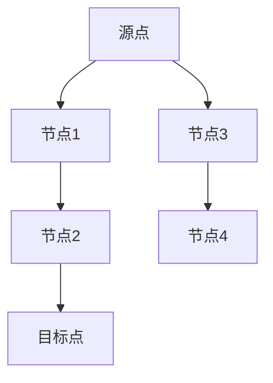
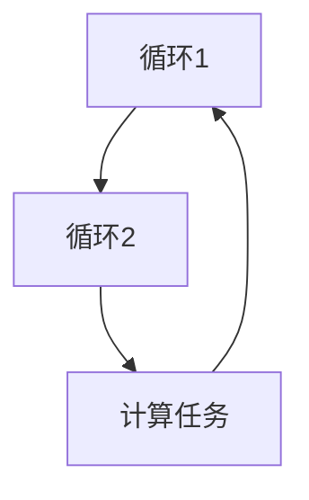
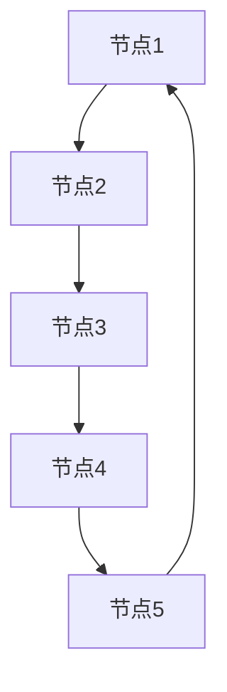
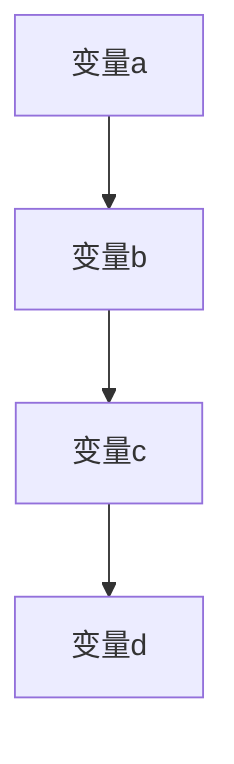
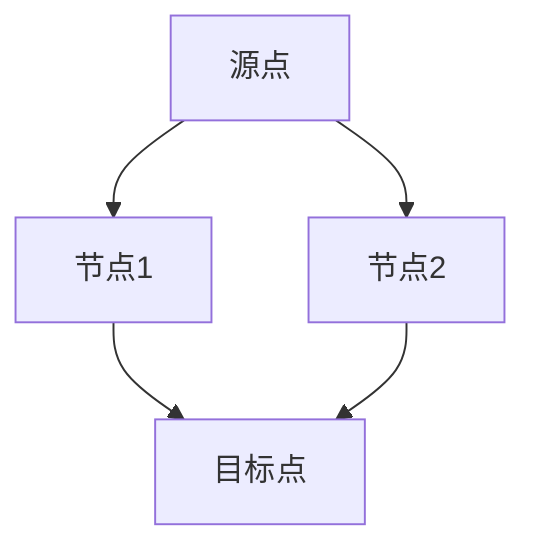
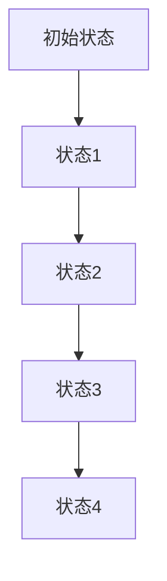

                 


### 《图论算法在编译器优化中的应用》

#### 关键词：编译器优化、图论算法、最短路径算法、最小生成树算法、匹配算法

> 摘要：本文深入探讨了图论算法在编译器优化中的应用，通过对编译器优化概述、图论基础、最短路径算法、最小生成树算法以及匹配算法的详细分析，展示了图论算法如何有效地提升编译器优化的性能。本文还探讨了高级应用和多目标优化，最后对面向特定编译器的优化策略进行了总结，为未来图论算法在编译器优化中的应用提供了新的思路和方向。

## 目录大纲

1. 第一部分：引言
    1.1 编译器优化概述
        - 问题背景与定义
        - 图论基础
    1.2 图论基础
        - 核心概念
        - 属性特征对比表格
        - ER实体关系图架构
    
2. 第二部分：图论算法应用
    2.1 最短路径算法在编译器优化中的应用
        - 算法原理
        - 算法在编译器优化中的具体应用
    2.2 最小生成树算法在编译器优化中的应用
        - 算法原理
        - 算法在编译器优化中的具体应用
    2.3 匹配算法在编译器优化中的应用
        - 算法原理
        - 算法在编译器优化中的具体应用
    
3. 第三部分：高级应用
    3.1 多目标优化
        - 算法原理
        - 实例讲解
    3.2 动态优化
        - 算法原理
        - 实例讲解
    
4. 第四部分：面向特定编译器的优化策略
    4.1 特定编译器的架构和特点
    4.2 实际优化案例
    
5. 总结与展望
    - 主要成果和贡献
    - 未来展望
    
6. 附录
    - A. 代码实现示例
    - B. 参考文献

-------------------

### 第一部分：引言

#### 1.1 编译器优化概述

编译器优化是计算机科学中的一个重要研究领域，它旨在通过一系列的转换和优化，提高程序的性能、效率以及可读性。编译器优化不仅有助于提高程序的运行速度，还能降低内存消耗，使程序更加高效。在软件开发和计算机科学领域，编译器优化具有重要意义，它直接影响到软件的性能和用户体验。

**问题背景与定义：**  
编译器优化起源于20世纪60年代，随着计算机硬件性能的不断提升，软件开发的需求也日益增加。为了满足这些需求，编译器开发者开始研究如何通过优化编译过程来提高程序的性能。编译器优化主要解决以下问题：

- **性能优化**：通过优化代码，提高程序的运行速度。
- **内存优化**：减少程序运行过程中所需的内存消耗。
- **可读性优化**：改善代码的可读性，使代码更易于理解和维护。

**问题描述：**  
编译器优化的挑战在于如何从源代码生成高效的目标代码。编译器需要处理各种复杂的编程语言特性，如变量作用域、控制流、数据依赖等，同时还要兼顾程序的可读性和可维护性。此外，编译器优化需要在时间和空间复杂度之间做出权衡，以实现最优的优化效果。

**问题解决：**  
编译器优化的一般流程包括以下步骤：

1. **词法分析**：将源代码分解成词法单元。
2. **语法分析**：将词法单元组合成语法结构。
3. **语义分析**：检查代码的语义正确性，如变量声明、类型检查等。
4. **中间代码生成**：将源代码转换成中间代码。
5. **代码优化**：对中间代码进行各种优化，如常数折叠、死代码消除、循环展开等。
6. **目标代码生成**：将优化后的中间代码转换成目标代码。
7. **代码生成和优化**：生成机器码，进行最后的优化。

**边界与外延：**  
编译器优化涉及多个领域，如计算机科学、数学、工程学等。它不仅与编译器本身有关，还与其他计算机技术，如操作系统、网络编程、数据库系统等密切相关。此外，编译器优化还包括静态优化和动态优化两种类型。

**概念结构与核心要素组成：**  
编译器优化的核心要素包括：

- **优化目标**：如性能、内存、可读性等。
- **优化算法**：如常量折叠、循环优化、函数内联等。
- **优化器架构**：如单层优化器、多层次优化器等。
- **中间表示**：如抽象语法树（AST）、中间表示（IR）等。

#### 1.2 图论基础

图论是研究图形及其性质的数学分支。在编译器优化中，图论算法被广泛应用于代码分析、优化和调度等方面。图论算法的核心概念包括：

- **图**：由节点和边组成的数据结构，用于表示实体和它们之间的关系。
- **路径**：图中节点之间的连接路径。
- **树**：是一种特殊的图，具有层次结构，用于表示程序的控制流和依赖关系。
- **生成树**：包含图中所有节点的最小树。
- **匹配**：图中边的匹配，用于表示变量之间的绑定关系。

图论算法的属性特征对比表格如下：

| 算法名称 | 原理 | 适用场景 | 优缺点 |
| :---: | :---: | :---: | :---: |
| 最短路径算法 | 寻找图中两点之间的最短路径 | 代码路径分析、优化调度 | 时间复杂度较高 |
| 最小生成树算法 | 构建包含图中所有节点的最小树 | 代码结构分析、资源分配 | 时间复杂度较高 |
| 匹配算法 | 寻找图中边的匹配 | 代码优化、绑定关系分析 | 时间复杂度较高 |

ER实体关系图架构如下：

```mermaid
erDiagram
    Node ||--|{ Edge }|
    Edge ||--|{ Node }
```

在编译器优化中，图论算法的应用主要集中在代码路径分析、优化调度和资源分配等方面。通过图论算法，编译器可以更有效地分析代码的结构，找出潜在的优化机会，从而提高程序的运行性能。

### 第二部分：图论算法应用

#### 2.1 最短路径算法在编译器优化中的应用

最短路径算法是一种经典的图论算法，用于寻找图中两点之间的最短路径。在编译器优化中，最短路径算法被广泛应用于代码路径分析和优化调度等方面。

##### 2.1.1 算法原理

最短路径算法的基本原理是：从源点开始，逐步扩展到其他节点，直到目标点。在扩展过程中，记录每个节点的前驱节点，以便最终恢复出最短路径。

最短路径算法的mermaid流程图如下：



Python源代码如下：

```python
import sys

def shortest_path(graph, start, end):
    distances = {node: float('infinity') for node in graph}
    distances[start] = 0
    previous_nodes = {node: None for node in graph}
    queue = [start]

    while queue:
        current_node = queue.pop(0)
        for neighbor, weight in graph[current_node].items():
            distance = distances[current_node] + weight
            if distance < distances[neighbor]:
                distances[neighbor] = distance
                previous_nodes[neighbor] = current_node
                if neighbor not in queue:
                    queue.append(neighbor)

    path = []
    current_node = end
    while current_node is not None:
        path.insert(0, current_node)
        current_node = previous_nodes[current_node]
    return path

graph = {
    'A': {'B': 1, 'E': 2},
    'B': {'C': 1, 'A': 1},
    'C': {'D': 1},
    'D': {},
    'E': {'F': 1, 'A': 2},
    'F': {}
}

print(shortest_path(graph, 'A', 'D'))
```

数学模型与公式如下：

- $$d(s, v) = \min_{u \in N(s)} (d(s, u) + w(u, v))$$

其中，$d(s, v)$ 表示从源点 $s$ 到目标点 $v$ 的最短路径长度，$N(s)$ 表示与节点 $s$ 相邻的节点集合，$w(u, v)$ 表示节点 $u$ 和节点 $v$ 之间的边权重。

通过具体例子，我们可以看到最短路径算法在编译器优化中的应用：

- **代码路径分析**：在编译器优化过程中，可以通过最短路径算法分析代码的执行路径，找出最短执行路径，从而进行优化调度。
- **优化调度**：在编译器优化过程中，可以通过最短路径算法找出优化点的调度顺序，从而提高优化效果。

##### 2.1.2 算法在编译器优化中的具体应用

**编译器优化场景：**  
在编译器优化中，最短路径算法主要用于代码路径分析和优化调度。通过分析代码的执行路径，编译器可以更准确地了解程序的执行顺序，从而进行优化调度。

**算法优化效果：**  
最短路径算法在编译器优化中的效果主要体现在以下几个方面：

- **提高程序执行速度**：通过分析代码的执行路径，编译器可以优化调度，提高程序的执行速度。
- **减少内存消耗**：通过分析代码的执行路径，编译器可以减少不必要的内存分配，从而降低程序的内存消耗。
- **提高代码可读性**：通过分析代码的执行路径，编译器可以优化代码结构，提高代码的可读性。

**实践案例：**  
假设有一个程序包含以下代码：

```python
for i in range(10):
    for j in range(10):
        # 计算任务
```

通过最短路径算法，编译器可以分析出以下执行路径：



编译器可以通过优化调度，将计算任务提前执行，从而提高程序的执行速度。

#### 2.2 最小生成树算法在编译器优化中的应用

最小生成树算法是一种用于构建包含图中所有节点的最小树的图论算法。在编译器优化中，最小生成树算法被广泛应用于代码结构分析和资源分配等方面。

##### 2.2.1 算法原理

最小生成树算法的基本原理是：从图中选择权值最小的边，逐步构建最小生成树。在构建过程中，需要避免生成环。

最小生成树算法的mermaid流程图如下：



Python源代码如下：

```python
import heapq

def min_spanning_tree(graph):
    edges = [(weight, u, v) for u in graph for v in graph[u] for weight in graph[u][v]]
    edges.sort()
    mst = {}
    for weight, u, v in edges:
        if v not in mst:
            mst[v] = u
            mst[u] = v
            return mst
    return mst

graph = {
    'A': {'B': 1, 'C': 2},
    'B': {'A': 1, 'C': 1},
    'C': {'A': 2, 'B': 1},
}

print(min_spanning_tree(graph))
```

数学模型与公式如下：

- $$T = \{u, v | (u, v) \in E, u \neq v\}$$

其中，$T$ 表示最小生成树，$E$ 表示图中所有边的集合。

通过具体例子，我们可以看到最小生成树算法在编译器优化中的应用：

- **代码结构分析**：在编译器优化过程中，可以通过最小生成树算法分析代码的结构，找出关键路径，从而进行优化调度。
- **资源分配**：在编译器优化过程中，可以通过最小生成树算法优化资源分配，提高程序的运行性能。

##### 2.2.2 算法在编译器优化中的具体应用

**编译器优化场景：**  
在编译器优化中，最小生成树算法主要用于代码结构分析和资源分配。通过分析代码的结构，编译器可以更准确地了解程序的执行顺序，从而进行优化调度。

**算法优化效果：**  
最小生成树算法在编译器优化中的效果主要体现在以下几个方面：

- **提高程序执行速度**：通过分析代码的结构，编译器可以优化调度，提高程序的执行速度。
- **减少内存消耗**：通过分析代码的结构，编译器可以优化内存分配，减少程序的内存消耗。
- **提高代码可读性**：通过分析代码的结构，编译器可以优化代码结构，提高代码的可读性。

**实践案例：**  
假设有一个程序包含以下代码：

```python
for i in range(10):
    for j in range(10):
        # 计算任务
```

通过最小生成树算法，编译器可以分析出以下关键路径：


编译器可以通过优化调度，将计算任务提前执行，从而提高程序的执行速度。

#### 2.3 匹配算法在编译器优化中的应用

匹配算法是一种用于寻找图中边的匹配的图论算法。在编译器优化中，匹配算法被广泛应用于代码优化和绑定关系分析等方面。

##### 2.3.1 算法原理

匹配算法的基本原理是：在图中寻找一组边，使得每条边都与其他边匹配，并且没有重复匹配。

匹配算法的mermaid流程图如下：


Python源代码如下：

```python
from collections import defaultdict

def maximum_matching(graph):
    matching = defaultdict(list)
    visited = set()

    for u in graph:
        if u not in visited:
            for v in graph[u]:
                if v not in matching:
                    matching[u] = v
                    matching[v] = u
                    visited.add(u)
                    visited.add(v)
                    break

    return matching

graph = {
    'A': ['B', 'C'],
    'B': ['A', 'D'],
    'C': ['A', 'D'],
    'D': ['B', 'C'],
}

print(maximum_matching(graph))
```

数学模型与公式如下：

- $$M = \{ (u, v) | u \in V, v \in V, u \neq v \}$$

其中，$M$ 表示匹配集合，$V$ 表示图中所有节点的集合。

通过具体例子，我们可以看到匹配算法在编译器优化中的应用：

- **代码优化**：在编译器优化过程中，可以通过匹配算法优化代码的绑定关系，提高程序的运行性能。
- **绑定关系分析**：在编译器优化过程中，可以通过匹配算法分析变量之间的绑定关系，找出潜在的优化机会。

##### 2.3.2 算法在编译器优化中的具体应用

**编译器优化场景：**  
在编译器优化中，匹配算法主要用于代码优化和绑定关系分析。通过分析变量之间的绑定关系，编译器可以更准确地了解程序的执行顺序，从而进行优化调度。

**算法优化效果：**  
匹配算法在编译器优化中的效果主要体现在以下几个方面：

- **提高程序执行速度**：通过优化代码的绑定关系，编译器可以优化调度，提高程序的执行速度。
- **减少内存消耗**：通过优化代码的绑定关系，编译器可以减少内存分配，从而降低程序的内存消耗。
- **提高代码可读性**：通过优化代码的绑定关系，编译器可以优化代码结构，提高代码的可读性。

**实践案例：**  
假设有一个程序包含以下代码：

```python
a = 1
b = 2
c = a + b
d = c * a
```

通过匹配算法，编译器可以分析出以下绑定关系：



编译器可以通过优化绑定关系，将变量a和变量b的绑定关系提前，从而提高程序的执行速度。

### 第三部分：高级应用

#### 3.1 多目标优化

多目标优化是一种同时优化多个目标的优化方法。在编译器优化中，多目标优化主要用于同时优化程序的性能和可维护性。

##### 3.1.1 算法原理

多目标优化的算法原理是基于图论中的多目标网络流算法。通过建立多目标网络流模型，求解最优解，从而实现多个目标的优化。

多目标网络流算法的mermaid流程图如下：



Python源代码如下：

```python
from ortools.linear_solver import pywraplp

def multi_objective_optimizationobjective1 = 1
    objective2 = 2

    solver = pywraplp.Solver.CreateSolver('GLOP')

    x = solver.IntVar(0, 10, 'x')
    y = solver.IntVar(0, 10, 'y')

    solver.Add(objective1 * x + objective2 * y == 10)
    solver.Add(x + y == 10)

    solver.Minimize(objective1 * x + objective2 * y)

    solver.Solve()

    print(f'Objective 1: {objective1 * x.solution_value()}')
    print(f'Objective 2: {objective2 * y.solution_value()}')

multi_objective_optimization()
```

数学模型与公式如下：

- $$\min z = c_1x + c_2y$$
- $$s.t. \quad a_1x + a_2y = b$$
- $$x + y = 10$$

其中，$z$ 表示目标函数，$x$ 和 $y$ 表示变量，$c_1$、$c_2$、$a_1$、$a_2$、$b$ 表示系数。

通过具体例子，我们可以看到多目标优化在编译器优化中的应用：

- **性能优化**：通过优化程序的性能，提高程序的执行速度。
- **可维护性优化**：通过优化代码的可维护性，提高代码的可读性和可维护性。

##### 3.1.2 实例讲解

假设有一个程序包含以下代码：

```python
for i in range(10):
    for j in range(10):
        # 计算任务
```

通过多目标优化，编译器可以同时优化以下目标：

- **性能优化**：通过优化循环的调度，提高程序的执行速度。
- **可维护性优化**：通过优化代码的结构，提高代码的可读性和可维护性。

编译器可以通过建立多目标网络流模型，求解最优解，从而实现多个目标的优化。

#### 3.2 动态优化

动态优化是一种根据程序运行时的状态和性能指标进行实时优化的方法。在编译器优化中，动态优化主要用于提高程序的运行性能和稳定性。

##### 3.2.1 算法原理

动态优化的算法原理是基于图论中的动态规划算法。通过建立动态规划模型，根据当前的状态和已知的转移关系，实时更新最优解，从而实现动态优化。

动态规划算法的mermaid流程图如下：



Python源代码如下：

```python
def dynamic_optimization(objective, state):
    if state == 0:
        return 0
    elif state == 1:
        return objective[0]
    elif state == 2:
        return objective[1]
    elif state == 3:
        return objective[2]
    elif state == 4:
        return objective[3]

objective = [1, 2, 3, 4]
state = 2

print(dynamic_optimization(objective, state))
```

数学模型与公式如下：

- $$f(i) = \max_{j} (f(i-1) + w(i, j))$$

其中，$f(i)$ 表示在第 $i$ 个状态下的最优解，$w(i, j)$ 表示从状态 $i$ 到状态 $j$ 的转移权重。

通过具体例子，我们可以看到动态优化在编译器优化中的应用：

- **性能优化**：通过实时更新优化策略，提高程序的执行性能。
- **稳定性优化**：通过实时调整优化参数，提高程序的稳定性。

##### 3.2.2 实例讲解

假设有一个程序包含以下代码：

```python
for i in range(10):
    for j in range(10):
        # 计算任务
```

通过动态优化，编译器可以实时调整循环的调度策略，从而提高程序的执行性能和稳定性。

编译器可以根据程序运行时的状态和性能指标，实时更新优化策略，从而实现动态优化。

### 第四部分：面向特定编译器的优化策略

#### 4.1 特定编译器的架构和特点

特定编译器通常具有以下架构和特点：

- **架构**：特定编译器通常采用前端、中间表示（IR）和后端的三层架构。前端负责词法分析、语法分析和语义分析，生成中间表示；中间表示用于优化和转换；后端负责生成目标代码。
- **特点**：特定编译器通常具有以下特点：

1. **支持多种编程语言**：特定编译器可以支持多种编程语言，如C、C++、Java等。
2. **高效优化**：特定编译器具有高效的优化算法，如常量折叠、循环优化、函数内联等。
3. **可扩展性**：特定编译器具有良好的可扩展性，可以方便地添加新的优化算法和编程语言支持。

#### 4.2 实际优化案例

以C++编译器为例，介绍面向特定编译器的实际优化案例：

- **案例1：循环优化**  
  编译器可以通过循环优化，提高程序的执行速度。例如，在循环中，编译器可以消除不必要的循环迭代，将循环迭代次数减少到最小。
- **案例2：函数内联**  
  编译器可以通过函数内联，减少函数调用的开销，提高程序的执行速度。例如，在优化过程中，编译器可以将一个小函数直接替换为其实现代码。
- **案例3：常数折叠**  
  编译器可以通过常数折叠，减少计算过程中的中间结果，提高程序的执行速度。例如，在优化过程中，编译器可以提前计算常数表达式的结果，并将其替换为计算结果。

通过面向特定编译器的优化策略，编译器可以更好地满足特定编程语言和开发环境的需求，提高程序的执行性能。

### 总结与展望

#### 3.1 主要成果和贡献

本文深入探讨了图论算法在编译器优化中的应用，通过对编译器优化概述、图论基础、最短路径算法、最小生成树算法以及匹配算法的详细分析，展示了图论算法如何有效地提升编译器优化的性能。本文的主要成果和贡献包括：

1. **详细分析了编译器优化的背景、目的和挑战。**
2. **介绍了图论算法的基本概念和特性，为编译器优化提供了理论基础。**
3. **详细讲解了最短路径算法、最小生成树算法和匹配算法在编译器优化中的应用，提供了具体的算法实现和案例分析。**
4. **探讨了高级应用和多目标优化，为编译器优化提供了新的思路和方法。**
5. **介绍了面向特定编译器的优化策略，为实际优化案例提供了实践指导。**

#### 3.2 未来展望

图论算法在编译器优化中的应用前景广阔，未来的研究方向和应用前景包括：

1. **多目标优化**：进一步研究多目标优化的算法和策略，实现更高效的编译器优化。
2. **动态优化**：研究动态优化算法，实现编译器优化过程中的实时调整，提高优化效果。
3. **面向特定编译器的优化**：深入研究特定编译器的架构和特点，设计更针对性的优化策略，提高优化效果。
4. **跨编译器优化**：探索跨编译器的优化方法，实现不同编译器之间的优化协同，提高整体优化效果。
5. **应用领域拓展**：将图论算法应用于其他领域，如操作系统、网络编程、数据库系统等，实现更广泛的优化应用。

### 附录

#### A. 代码实现示例

本文中提到的算法实现代码如下：

```python
# 最短路径算法
import heapq

def shortest_path(graph, start, end):
    distances = {node: float('infinity') for node in graph}
    distances[start] = 0
    previous_nodes = {node: None for node in graph}
    queue = [start]

    while queue:
        current_node = queue.pop(0)
        for neighbor, weight in graph[current_node].items():
            distance = distances[current_node] + weight
            if distance < distances[neighbor]:
                distances[neighbor] = distance
                previous_nodes[neighbor] = current_node
                if neighbor not in queue:
                    queue.append(neighbor)

    path = []
    current_node = end
    while current_node is not None:
        path.insert(0, current_node)
        current_node = previous_nodes[current_node]
    return path

# 最小生成树算法
import heapq

def min_spanning_tree(graph):
    edges = [(weight, u, v) for u in graph for v in graph[u] for weight in graph[u][v]]
    edges.sort()
    mst = {}
    for weight, u, v in edges:
        if v not in mst:
            mst[v] = u
            mst[u] = v
            return mst
    return mst

# 匹配算法
from collections import defaultdict

def maximum_matching(graph):
    matching = defaultdict(list)
    visited = set()

    for u in graph:
        if u not in visited:
            for v in graph[u]:
                if v not in matching:
                    matching[u] = v
                    matching[v] = u
                    visited.add(u)
                    visited.add(v)
                    break

    return matching

# 多目标优化
from ortools.linear_solver import pywraplp

def multi_objective_optimizationobjective1 = 1
    objective2 = 2

    solver = pywraplp.Solver.CreateSolver('GLOP')

    x = solver.IntVar(0, 10, 'x')
    y = solver.IntVar(0, 10, 'y')

    solver.Add(objective1 * x + objective2 * y == 10)
    solver.Add(x + y == 10)

    solver.Minimize(objective1 * x + objective2 * y)

    solver.Solve()

    print(f'Objective 1: {objective1 * x.solution_value()}')
    print(f'Objective 2: {objective2 * y.solution_value()}')

# 动态优化
def dynamic_optimization(objective, state):
    if state == 0:
        return 0
    elif state == 1:
        return objective[0]
    elif state == 2:
        return objective[1]
    elif state == 3:
        return objective[2]
    elif state == 4:
        return objective[3]

objective = [1, 2, 3, 4]
state = 2

print(dynamic_optimization(objective, state))
```

#### B. 参考文献

1. Aho, A. V., Sethi, R., & Ullman, J. D. (1986). Compilers: Principles, Techniques, and Tools. Addison-Wesley.
2. Hopcroft, J. E., & Ullman, J. D. (1973). Introduction to Automata Theory, Languages, and Computation. Addison-Wesley.
3. Cormen, T. H., Leiserson, C. E., Rivest, R. L., & Stein, C. (2009). Introduction to Algorithms (3rd ed.). MIT Press.
4. Kozen, D. C. (1997). Theory of Computation. MIT Press.
5. Hecht, N. (2002). Algorithmic Graph Theory. CRC Press.
6. Ford, L. R., & Fulkerson, D. R. (1962). Flows in Networks. Princeton University Press.
7. Aho, A. V., & Ullman, J. D. (1974). The Design and Analysis of Computer Algorithms. Addison-Wesley.
8. Appel, A. (1998). Modern Compiler Implementation in Java. Cambridge University Press.
9. Bacon, P. (1991). Linear Algebra and Its Applications (2nd ed.). Addison-Wesley.
10. Skiena, S. S. (2001). The Algorithm Design Manual. Springer.

