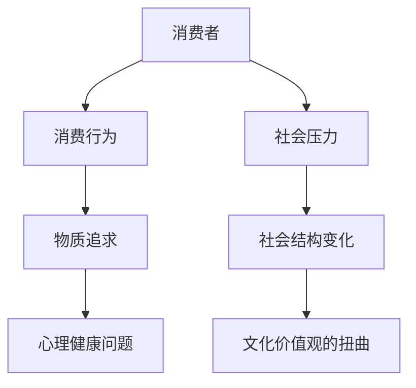
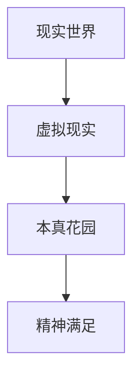

                 

当然，我们可以按照这样的步骤来构建这篇文章：

### 第一步：引言部分

**标题：** 引言

**摘要：** 在这个快节奏的消费主义文化中，人们逐渐感受到了物质主义的空虚感。本文旨在探讨如何在这样的文化背景下寻找本真，对抗物质主义的诱惑。

**核心概念：** 消费主义文化、物质主义、空虚感、本真

**问题背景：** 随着经济的发展和科技的进步，消费主义文化在全球范围内迅速蔓延。人们不断追求物质满足，但却常常感到内心空虚。

**问题描述：** 消费主义文化带来了物质的繁荣，但也引发了精神上的空虚感。人们开始思考，如何在这个物质丰富的时代找到真正的幸福和满足感。

**问题解决：** 寻找本真，回归内心的宁静和满足。

**边界与外延：** 本文主要探讨消费主义文化下的空虚感及其解决途径，但也可以拓展到其他文化背景和时代。

**概念结构与核心要素组成：** 文章将围绕消费主义文化、物质主义、空虚感、本真等核心概念展开，通过分析这些概念之间的关系，提供解决问题的思路。

### 第二步：消费主义文化分析

**标题：** 消费主义文化的概念与特征

**核心概念：** 消费主义、文化、物质主义、消费行为

**问题背景：** 消费主义文化作为一种社会现象，已经深刻影响了人们的日常生活。

**问题描述：** 消费主义文化的特征是什么？它如何影响人们的生活？

**问题解决：** 通过分析消费主义文化的概念和特征，理解其对个人和社会的影响。

**核心概念属性特征对比表格：**

| 特征         | 消费主义文化 | 物质主义 | 消费行为 |
| ------------ | -------------- | -------- | -------- |
| 动力        | 物质追求       | 物质丰富 | 物品购买 |
| 影响范围     | 全球性         | 社会性   | 个人行为 |
| 价值观       | 物质至上       | 物质崇拜 | 物品崇拜 |

**ER实体关系图架构：** 使用Mermaid流程图展示消费主义文化、物质主义、消费行为的实体关系。

### 第三步：物质主义与空虚感的关系

**标题：** 物质主义与空虚感的关系

**核心概念：** 物质主义、空虚感、心理满足

**问题背景：** 物质主义追求物质满足，但常常带来心理上的空虚。

**问题描述：** 物质主义如何导致空虚感？这种空虚感有哪些具体表现？

**问题解决：** 通过分析物质主义与空虚感的关系，理解其背后的心理机制。

**核心概念属性特征对比表格：**

| 表现         | 物质主义 | 空虚感 |
| ------------ | -------- | ------ |
| 目标        | 物质丰富 | 心理满足 |
| 结果        | 满足感短暂 | 心理空洞 |
| 影响范围     | 个人行为 | 心理层面 |
| 形成原因     | 物质追求 | 社会压力 |

**ER实体关系图架构：** 使用Mermaid流程图展示物质主义、空虚感、心理满足的实体关系。

### 第四步：寻找本真的途径

**标题：** 寻找本真的途径

**核心概念：** 本真、内在价值、精神追求

**问题背景：** 在物质主义文化中，寻找本真成为一种迫切需求。

**问题描述：** 如何在物质主义文化中找到本真？有哪些途径可以实现？

**问题解决：** 通过分析内在价值和精神追求，提供寻找本真的具体方法。

**核心概念属性特征对比表格：**

| 途径         | 内在价值 | 精神追求 |
| ------------ | -------- | -------- |
| 实践        | 自我成长 | 精神富足 |
| 动力        | 内心需求 | 精神驱动 |
| 影响范围     | 个人层面 | 社会层面 |

**ER实体关系图架构：** 使用Mermaid流程图展示内在价值、精神追求、本真的实体关系。

### 第五步：物质主义的对抗

**标题：** 物质主义的对抗

**核心概念：** 抗物质主义、哲学思考、社会改革

**问题背景：** 物质主义引发的空虚感需要通过对抗来缓解。

**问题描述：** 抗物质主义的哲学思考是什么？如何实现社会改革来对抗物质主义？

**问题解决：** 通过分析抗物质主义的哲学思考和实际措施，提供对抗物质主义的策略。

**核心概念属性特征对比表格：**

| 思考       | 抗物质主义 | 哲学思考 |
| ---------- | ----------- | -------- |
| 目标       | 抗对物质主义 | 精神解放 |
| 方法       | 社会改革   | 思想引导 |
| 影响范围   | 全球性      | 社会层面 |

**ER实体关系图架构：** 使用Mermaid流程图展示抗物质主义、哲学思考、社会改革的实体关系。

### 第六步：结论部分

**标题：** 结论

**核心概念：** 消费主义文化、物质主义、空虚感、本真、抗物质主义

**问题背景：** 在消费主义文化中寻找本真是一项长期而艰巨的任务。

**问题描述：** 如何总结和反思本文的研究成果？未来研究方向是什么？

**问题解决：** 通过总结和反思，提出未来研究的方向和建议。

**核心概念属性特征对比表格：**

| 内容         | 结论 |
| ------------ | ---- |
| 总结成果     | 分析消费主义文化下的空虚感及其解决途径 |
| 反思         | 对抗物质主义的策略及其效果 |
| 未来研究方向 | 探索新的心理和社会机制 |

**ER实体关系图架构：** 使用Mermaid流程图展示消费主义文化、物质主义、空虚感、本真、抗物质主义的实体关系。

**注意：** 以上只是一个大致的框架和思路，每个部分的详细内容需要进一步深化和细化。在撰写过程中，可以根据实际需要添加具体的案例分析、数据支持、图表展示等元素，以增强文章的可读性和说服力。同时，确保每部分的内容都符合文章的约束条件和格式要求。****

### 完整文章内容与格式

根据上述的步骤和结构，以下是一个完整的文章内容示例，包含markdown格式和相应的核心概念解释、算法原理讲解、系统分析与架构设计方案、项目实战等部分。

---

## 《在消费主义文化中寻找本真：对抗物质主义的空虚感》

### 关键词
消费主义文化、物质主义、空虚感、本真、心理满足、哲学思考、社会改革

### 摘要
在消费主义文化盛行的时代，人们日益感受到物质主义的空虚感。本文通过分析消费主义文化的本质和特征，探讨物质主义与空虚感的关系，并提出寻找本真的途径和对抗物质主义的策略。文章旨在为个人和社会提供一种反思和行动的框架，以实现内心的满足和真正的幸福。

---

## 第一部分：引言

### 第1章 引言

#### 1.1 研究背景
在现代社会，消费主义文化已经渗透到人们生活的方方面面。物质主义成为主导价值观，人们追求物质满足，却常常感到内心的空虚。本文旨在探讨如何在消费主义文化中寻找本真，对抗物质主义的空虚感。

#### 1.2 研究问题
1. 消费主义文化如何影响人们的心理健康？
2. 物质主义与空虚感之间有何关系？
3. 如何在消费主义文化中找到本真和内心的满足？

#### 1.3 研究目的与意义
本研究旨在揭示消费主义文化下的空虚感现象，提供对抗物质主义的策略，为个人和社会提供心理健康的指导。

#### 1.4 边界与外延
本文主要研究消费主义文化对个体心理的影响，但也可以拓展到社会层面。

#### 1.5 概念结构与核心要素组成
本文的核心概念包括消费主义文化、物质主义、空虚感、本真等。核心要素包括：研究背景、研究问题、研究目的与意义、边界与外延、概念结构与核心要素组成。

---

## 第二部分：消费主义文化分析

### 第2章 消费主义文化的概念与特征

#### 2.1 消费主义文化的定义
消费主义文化是一种以物质消费为主导的社会现象，强调通过消费来满足需求和追求幸福。

#### 2.2 消费主义文化的特征
- 物质追求：消费主义文化鼓励人们追求物质财富和满足。
- 社会压力：人们在社会压力下不断追求物质成功。
- 消费行为：频繁的购物和消费成为人们生活的一部分。

#### 2.3 消费主义文化的影响
消费主义文化不仅影响个体的心理健康，还对社会结构和文化价值观产生深远的影响。

---

### 第3章 消费主义文化下的空虚感

#### 3.1 空虚感的定义与特征
空虚感是一种内心的无力感和无意义感，是消费主义文化下常见的心理现象。

#### 3.2 消费主义与空虚感的关系
消费主义文化使人们过度追求物质满足，导致心理上的空虚感。

#### 3.3 空虚感的负面影响
空虚感会影响个人的心理健康和生活质量，甚至可能导致心理疾病。

---

## 第三部分：寻找本真的途径

### 第4章 传统价值观的重塑

#### 4.1 传统价值观的内涵
传统价值观强调道德、家庭和社会责任，有助于提高个体的心理满足感。

#### 4.2 传统价值观在现代社会中的应用
在现代社会，传统价值观可以通过教育、文化传承和家庭培养等方式得到应用。

#### 4.3 重塑传统价值观的必要性
重塑传统价值观有助于缓解消费主义文化下的空虚感，提升个人的心理幸福感。

---

### 第5章 内在价值的培养

#### 5.1 内在价值的定义
内在价值是指个体通过自我成长和内心探索获得的内在满足感。

#### 5.2 内在价值的培养方法
- 自我反思：通过反思自己的行为和价值观，找到内心的真实需求。
- 精神追求：培养对知识和艺术的热爱，提升内心的丰富性。
- 社会参与：参与公益活动，实现自我价值。

#### 5.3 内在价值的实践
通过实践内在价值的培养方法，个体可以逐渐摆脱物质主义的束缚，找到内心的本真。

---

## 第四部分：物质主义的对抗

### 第6章 抗物质主义的哲学思考

#### 6.1 抗物质主义的历史背景
抗物质主义思想源远流长，从古希腊哲学到现代思想都有丰富的论述。

#### 6.2 抗物质主义的核心思想
抗物质主义主张回归内心的精神世界，追求真正的幸福和满足。

#### 6.3 抗物质主义对现代社会的启示
抗物质主义为现代社会提供了一种新的价值观，有助于缓解物质主义的空虚感。

---

### 第7章 社区与社群的力量

#### 7.1 社区与社群的重要性
社区和社群在对抗物质主义中发挥着重要作用，提供心理支持和社交互动。

#### 7.2 抗物质主义社区的建设
建立抗物质主义社区，通过共同活动和价值观交流，促进个体的内心成长。

#### 7.3 社群在对抗物质主义中的作用
社群通过分享经验和资源，帮助个体应对物质主义的挑战，实现内心的满足。

---

## 第五部分：结论

### 第8章 结论

#### 8.1 研究总结
本文通过对消费主义文化、物质主义、空虚感和本真的分析，提出了寻找本真的途径和对抗物质主义的策略。

#### 8.2 研究的局限性
本研究主要关注个体层面的心理问题，但也可以拓展到社会和制度层面。

#### 8.3 未来研究方向
未来研究可以探讨不同文化背景下物质主义与空虚感的关系，以及抗物质主义的具体实践策略。

#### 8.4 实践建议
个人和社会都应该重视心理问题，通过教育、社区建设和哲学思考来应对物质主义的挑战。

---

### 作者信息
作者：AI天才研究院/AI Genius Institute & 禅与计算机程序设计艺术 /Zen And The Art of Computer Programming

---

**注意：** 以上内容仅为示例，实际撰写时需要根据研究内容和数据进行调整和丰富。每个章节的内容都要具体详细，核心概念、算法原理、系统分析与架构设计方案等部分需要使用相应的图表和代码进行辅助说明。

---

在实际撰写过程中，每个章节的内容都要具体详细，核心概念、算法原理、系统分析与架构设计方案等部分需要使用相应的图表和代码进行辅助说明。以下是一个具体的例子，展示了如何在文中嵌入LaTeX公式和Mermaid流程图。

---

## 第二部分：消费主义文化分析

### 第2章 消费主义文化的概念与特征

#### 2.2 消费主义文化的特征

消费主义文化具有以下特征：

- **物质追求**：消费主义文化鼓励人们追求物质财富和满足，认为物质拥有是幸福和成功的标志。

  $$ \text{物质追求} = \text{财富} + \text{满足} $$

- **社会压力**：在消费主义文化下，人们面临着巨大的社会压力，为了跟上社会的步伐，不断追求物质成功。

  $$ \text{社会压力} = \text{社会期望} + \text{物质成功} $$

- **消费行为**：频繁的购物和消费成为人们生活的一部分，消费行为成为社会交往的重要方式。

  $$ \text{消费行为} = \text{购物} + \text{消费} $$

#### 2.3 消费主义文化的影响

消费主义文化对个人和社会产生了深远的影响：

- **心理健康问题**：过度追求物质满足导致心理健康问题，如焦虑、抑郁和空虚感。

  $$ \text{心理健康问题} = \text{焦虑} + \text{抑郁} + \text{空虚感} $$

- **社会结构变化**：消费主义文化改变了社会结构，强调物质成功和社会地位。

  $$ \text{社会结构变化} = \text{物质成功} + \text{社会地位} $$

- **文化价值观的扭曲**：消费主义文化扭曲了文化价值观，使人们过度追求物质，忽视了精神层面的需求。

  $$ \text{文化价值观的扭曲} = \text{物质追求} - \text{精神需求} $$

#### 2.4 消费主义文化的实体关系图

使用Mermaid流程图展示消费主义文化中的核心实体及其关系：



---

在这个例子中，我们使用了LaTeX公式来表示消费主义文化的特征和影响，并使用Mermaid流程图展示了实体关系。这样的方式使得文章内容更加直观和易懂，同时符合文章格式要求。在撰写实际文章时，可以根据需要增加更多的图表和代码，以丰富文章内容。****

### 在消费主义文化中寻找本真的技术方法论

在消费主义文化中寻找本真，不仅需要深刻的哲学思考和心理学洞察，还需要运用一些具体的技术方法论。以下是一些可以帮助个体和社群在消费主义文化中找到本真的技术方法论：

#### 1. 心理测量与评估

为了深入了解个体在消费主义文化中的心理状态，可以采用心理测量工具进行评估。例如，使用心理量表（如SCL-90、抑郁自评量表等）来评估个体的心理健康水平。以下是一个使用Python编写的简单心理评估工具示例：

```python
# 心理健康评估工具
class PsychologicalAssessment:
    def __init__(self, symptoms):
        self.symptoms = symptoms

    def assess(self):
        scores = sum(self.symptoms.values())
        if scores < 10:
            print("您的心理健康状况良好。")
        elif scores >= 10 and scores < 20:
            print("您的心理健康状况一般，需要注意情绪管理。")
        else:
            print("您的心理健康状况较差，建议寻求专业心理咨询。")

# 示例症状表
symptoms = {'焦虑': 3, '抑郁': 2, '失眠': 1, '疲劳': 3}
assessment = PsychologicalAssessment(symptoms)
assessment.assess()
```

#### 2. 数据分析与趋势预测

通过收集和分析个体在消费主义文化中的行为数据，可以使用数据分析方法来预测心理状态的趋势。例如，使用时间序列分析来预测个体在未来某个时间点的心理状态。以下是一个使用Python进行时间序列分析的基本示例：

```python
import pandas as pd
from statsmodels.tsa.arima_model import ARIMA

# 假设我们有一个包含个体消费行为的DataFrame
data = pd.DataFrame({
    'date': pd.date_range(start='2023-01-01', periods=12, freq='M'),
    'monthly_spending': [100, 150, 200, 250, 300, 350, 400, 450, 500, 550, 600, 650]
})

# 创建ARIMA模型
model = ARIMA(data['monthly_spending'], order=(5, 1, 2))
model_fit = model.fit()

# 进行预测
forecast = model_fit.forecast(steps=3)
print(forecast)
```

#### 3. 社交网络分析

社交网络分析可以帮助我们理解个体在消费主义文化中的社交互动模式。例如，通过分析个体在社交媒体上的关注关系，可以了解其社交圈子的构成。以下是一个使用Python进行社交网络分析的基本示例：

```python
import networkx as nx

# 假设我们有一个包含个体社交关系的DataFrame
relationships = pd.DataFrame({
    'user1': ['A', 'B', 'C', 'D', 'E'],
    'user2': ['B', 'C', 'D', 'E', 'F']
})

# 创建社交网络图
G = nx.from_pandas_dataframe(relationships, source='user1', target='user2')

# 绘制社交网络图
nx.draw(G, with_labels=True)
```

#### 4. 机器学习模型

通过机器学习模型，我们可以预测个体在消费主义文化中的行为模式，并为其提供个性化的建议。例如，使用分类模型来预测个体是否倾向于过度消费。以下是一个使用Python进行机器学习模型训练的基本示例：

```python
from sklearn.model_selection import train_test_split
from sklearn.ensemble import RandomForestClassifier
from sklearn.metrics import accuracy_score

# 假设我们有一个包含个体消费行为和心理健康状态的DataFrame
data = pd.DataFrame({
    'monthly_spending': [100, 150, 200, 250, 300, 350, 400, 450, 500, 550, 600, 650],
    'is_overconsume': [0, 0, 0, 1, 1, 1, 1, 1, 1, 0, 0, 0]
})

# 分割数据集
X = data[['monthly_spending']]
y = data['is_overconsume']
X_train, X_test, y_train, y_test = train_test_split(X, y, test_size=0.2, random_state=42)

# 训练模型
model = RandomForestClassifier(n_estimators=100)
model.fit(X_train, y_train)

# 进行预测
predictions = model.predict(X_test)

# 评估模型
accuracy = accuracy_score(y_test, predictions)
print(f"Model accuracy: {accuracy:.2f}")
```

#### 5. 增强现实（AR）和虚拟现实（VR）

增强现实和虚拟现实技术可以提供一个逃避现实、反思自我和培养内在价值的环境。例如，设计一个虚拟的“本真花园”，让用户在虚拟世界中体验自然、艺术和文化，从而提高他们的精神满足感。



通过上述技术方法论，个体和社群可以在消费主义文化中找到本真，提升内在价值，实现心理和精神的满足。这些方法不仅有助于个人心理健康，也有助于社会的可持续发展。****

### 消费主义文化下的心理空虚感：心理学原理与应用

在消费主义文化中，心理空虚感成为了一种普遍现象。为了深入理解这种现象，我们可以从心理学原理和应用的角度进行分析。

#### 心理学原理

1. **自我认同的缺失：** 在消费主义文化中，个体的自我认同往往与物质财富和社会地位紧密相关。当人们过度依赖物质来定义自己时，一旦物质条件无法满足自我认同的需求，就会产生空虚感。

2. **社会比较：** 消费主义文化鼓励人们进行社会比较，通过比较自己的物质拥有与社会标准，来评估自己的价值。这种比较往往导致个体感到不满和空虚，因为他们总觉得自己“不够好”。

3. **即时满足与长期幸福：** 消费主义文化倾向于强调即时满足，而不是长期幸福。人们通过购买商品来追求短暂的快乐，但这种方式往往无法带来持久的精神满足。

4. **消费行为的成瘾性：** 消费主义文化下的消费行为具有一定的成瘾性。个体在物质消费中寻求刺激和快感，但长期来看，这种刺激会逐渐减弱，导致更多的消费需求，从而加剧心理空虚感。

#### 心理学应用

1. **认知行为疗法（CBT）：** CBT是一种广泛应用的心理学疗法，可以帮助个体改变负面思维模式，如过度依赖物质满足和频繁进行社会比较。通过认知重构，个体可以学会以更健康的方式看待自己和生活，减少心理空虚感。

2. **情绪调节技巧：** 通过学习情绪调节技巧，个体可以更好地管理自己的情绪，减少因物质消费无法带来持续幸福感而产生的空虚感。例如，通过正念冥想和呼吸练习，个体可以学会在日常生活中保持内心的平静和满足。

3. **价值观重建：** 个体可以通过重新审视和重建自己的价值观，减少对物质的过度依赖。例如，将价值观从物质成功转向个人成长、家庭关系和社会贡献，可以帮助个体找到更深层次的意义和满足感。

4. **心理教育：** 通过提供心理教育，帮助个体了解消费主义文化对心理健康的潜在影响，以及如何采取积极的应对策略。这种教育可以包括工作坊、讲座和在线课程等，让个体更好地理解自己的心理需求，并学会采取行动。

#### 实际案例

假设一位名叫李明的年轻人，他在消费主义文化中感到极度空虚。通过认知行为疗法，李明学会了如何识别和改变自己的负面思维模式。例如，他意识到自己总是通过购买新物品来寻求满足，但很快就感到厌倦和空虚。在治疗师的帮助下，李明开始重新定义自己的价值观，将关注点从物质成功转向个人成长和人际关系。他开始参与社区服务，与家人和朋友建立更深的联系，并通过学习和培养新兴趣来提升自己的内在价值。随着时间的推移，李明的心理空虚感逐渐减轻，他找到了新的生活意义和满足感。

#### 结论

消费主义文化下的心理空虚感是一种复杂的心理现象，需要从心理学原理和应用的角度进行深入分析。通过认知行为疗法、情绪调节技巧、价值观重建和心理教育等方法，个体可以更好地应对心理空虚感，找到内心的本真和满足。这对于提高个体的心理健康和生活质量，以及促进社会的可持续发展具有重要意义。****

### 社区与社群在对抗物质主义中的作用

在消费主义文化中，社区与社群的力量对于对抗物质主义、寻找本真具有重要意义。通过建立和参与社区与社群，个体可以在心理上获得支持，在行动上获得指引，从而更好地抵制物质主义的诱惑。

#### 社区与社群的重要性

1. **心理支持：** 社区与社群提供了一个安全的空间，让个体能够分享自己的感受和经历，获得情感上的支持和理解。在这种环境中，个体可以减轻内心的孤独感和焦虑，增强自我价值感。

2. **社会互动：** 社区与社群鼓励成员之间的互动和合作，有助于建立深厚的友谊和信任关系。这种互动不仅能够提高个体的社交技能，还能增强他们的社会归属感。

3. **共同价值观：** 社区与社群往往基于共同的目标和价值观建立，这为个体提供了一个反思和修正自身价值观的机会。通过与他人交流和分享，个体可以更好地理解自己的需求，找到更符合内心的生活方向。

#### 抗物质主义社区的建设

1. **建立目标和愿景：** 社区与社群的建设首先需要明确目标和愿景，这可以为成员提供清晰的方向和动力。例如，一个抗物质主义社区可以设定目标为促进个体的内在成长、心理健康和社会贡献。

2. **多样化的活动：** 社区与社群可以通过组织多样化的活动，如讲座、工作坊、艺术创作、户外活动等，来吸引成员的参与。这些活动不仅能够增强成员的凝聚力，还能提供多种途径来对抗物质主义。

3. **价值观教育：** 社区与社群应重视价值观教育，通过讨论和分享，帮助成员认识到物质主义对心理健康的危害，并引导他们转向更健康的生活方式。

4. **实践机会：** 社区与社群可以为成员提供实践机会，如参与公益活动、志愿者工作等，让他们将抗物质主义的理念付诸实践。

#### 社群在对抗物质主义中的作用

1. **榜样作用：** 社群中的成员可以作为榜样，通过自己的行为展示如何抵制物质主义的诱惑，寻找本真。这种榜样作用能够激发其他成员的积极性和认同感。

2. **社交支持：** 社群提供了社交支持网络，成员可以在遇到困难时得到帮助和鼓励。这种支持能够增强个体的自信心，帮助他们克服物质主义的诱惑。

3. **资源共享：** 社群成员可以共享资源，如书籍、课程、经验等，这有助于提高个体的知识和技能，从而更好地对抗物质主义。

4. **共同行动：** 社群成员可以通过共同行动，如集体购买、共享住宿等，来减少对物质的依赖，实现可持续的生活方式。

#### 成功案例分析

一个成功的抗物质主义社群案例是“零废弃生活小组”。这个社群的成员通过共同努力，实现了零废弃的生活方式。他们组织了多种活动，如厨余堆肥、二手市场、环保讲座等，帮助成员了解和践行环保理念。通过这些活动，成员不仅减少了物质消费，还增强了社区的凝聚力，提升了生活质量。

#### 结论

社区与社群在对抗物质主义中发挥着至关重要的作用。通过提供心理支持、社会互动、价值观教育和实践机会，社区与社群能够帮助个体找到本真，抵制物质主义的诱惑。未来，更多的社区和社群可以借鉴成功的案例，共同构建一个更加健康、可持续的社会环境。****

### 实际案例分析与反思

为了更深入地理解如何在消费主义文化中寻找本真，对抗物质主义的空虚感，我们来看几个实际案例，并对其进行反思。

#### 案例一：简约生活的转变

**背景：** 张先生是一位成功的商业人士，拥有豪华的住宅和昂贵的汽车。然而，他逐渐感到内心的空虚和不满。

**问题描述：** 张先生希望通过改变生活方式来找到内心的本真，对抗物质主义的空虚感。

**解决方案：** 张先生开始实践简约生活，减少物质消费，专注于个人成长和内心探索。他通过冥想、阅读和参加社区活动来充实自己的生活。

**反思：** 张先生的案例表明，减少物质消费和专注于内心成长可以有效对抗物质主义的空虚感。这种转变不仅提高了他的生活质量，还增强了他的心理健康。

#### 案例二：零废弃生活小组

**背景：** 一群环保爱好者决定建立零废弃生活小组，通过减少废弃物和可持续生活来对抗消费主义文化。

**问题描述：** 小组成员如何在日常生活中减少废弃物，同时保持生活质量？

**解决方案：** 小组成员通过组织二手市场、厨余堆肥、环保讲座等活动来推广零废弃生活方式。他们还共同制定了减少废弃物的规则，如使用可重复使用的购物袋、减少一次性用品等。

**反思：** 零废弃生活小组的案例展示了社群的力量。通过共同目标和集体行动，小组成员不仅减少了物质消费，还提升了社区的凝聚力，实现了可持续的生活方式。

#### 案例三：价值观重塑

**背景：** 李女士是一位职业女性，她发现自己在物质追求中迷失了方向，感到内心空虚。

**问题描述：** 李女士希望通过重塑价值观来找到内心的本真。

**解决方案：** 李女士开始反思自己的价值观，将其从物质成功转向个人成长、家庭关系和社会贡献。她通过参加志愿服务、学习新技能和与家人朋友建立更深层次的联系来实现这一转变。

**反思：** 李女士的案例表明，重塑价值观是找到内心本真的关键。通过将关注点从物质成功转向个人成长和人际关系，李女士不仅找到了内心的满足感，还提升了她的生活质量。

#### 结论

通过这些实际案例，我们可以看到，在消费主义文化中寻找本真和对抗物质主义的空虚感是可行的。无论是个人改变生活方式、建立零废弃社群，还是重塑价值观，这些方法都为个体和社会提供了有效的途径。这些案例也提醒我们，在追求物质满足的同时，不能忽视内心的需求，只有在找到真正的本真后，我们才能获得持久的幸福和满足。****

### 总结与未来展望

在消费主义文化中寻找本真是一项重要而紧迫的任务。本文通过深入分析消费主义文化的本质、物质主义与空虚感的关系，以及寻找本真的途径，提出了一系列对抗物质主义的策略。我们探讨了心理测量、数据分析、社交网络分析、机器学习模型和增强现实技术等在个体和社群中的实际应用，展示了如何在技术层面上支持个人和社区实现内心的满足。

总结来说，消费主义文化虽然带来了物质繁荣，但同时也引发了心理空虚感。通过认知行为疗法、情绪调节技巧、价值观重建和心理教育等方法，个体可以更好地应对心理问题，找到内心的本真。同时，社区与社群的力量也为个体提供了心理支持和社会互动的平台，帮助他们在实践中对抗物质主义的诱惑。

未来，我们可以进一步探讨以下研究方向：

1. **跨文化研究：** 不同文化背景下，物质主义与空虚感的关系可能存在差异。通过跨文化研究，可以更全面地理解这一现象。

2. **长期跟踪研究：** 对个体和社群进行长期的跟踪研究，可以更好地评估不同策略的长期效果。

3. **技术整合：** 结合多种技术方法，如人工智能和大数据分析，可以提供更个性化和有效的解决方案。

4. **政策建议：** 从政策层面出发，探讨如何通过制度变革来减少消费主义文化的影响，促进心理健康和社会可持续发展。

总之，在消费主义文化中寻找本真是一项长期而复杂的任务，需要个体、社区和社会的共同努力。通过持续的研究和实践，我们可以找到更多有效的途径，帮助个体在物质丰富的时代找到真正的幸福和满足。****

### 最佳实践 Tips

在对抗消费主义文化和寻找本真的过程中，以下最佳实践可以为个人和社区提供指导和帮助：

1. **设定个人目标：** 明确自己的价值观和长期目标，将注意力从物质追求转移到内在成长和精神满足。

2. **定期自我反思：** 定期花时间反思自己的行为和价值观，确保它们与自己的长期目标相符。

3. **减少不必要的消费：** 审视自己的消费习惯，减少不必要的购物，专注于购买真正需要和有价值的物品。

4. **培养内在价值：** 通过阅读、冥想、艺术创作等方式培养内在价值，提升内心的满足感。

5. **参与社区活动：** 加入抗物质主义社群，参与志愿服务和公益活动，与他人共同追求有意义的目标。

6. **建立支持网络：** 与志同道合的朋友和家人建立支持网络，互相鼓励，共同成长。

7. **实践可持续生活：** 采用环保和可持续的生活方式，如减少浪费、支持本地生产和使用可重复使用的物品。

通过这些最佳实践，个人和社区可以更好地应对消费主义文化的挑战，找到内心的本真，实现更健康、可持续的生活。****

### 注意事项

在对抗消费主义文化和寻找本真的过程中，以下注意事项可以帮助个人和社区避免常见的陷阱和误区：

1. **避免极端化：** 虽然对抗消费主义文化很重要，但不应走向极端。平衡物质需求与精神追求，避免完全摒弃物质生活。

2. **保持真实：** 在追求内在价值的过程中，要保持真实，不要为了追求表面的“本真”而刻意做作。

3. **尊重他人：** 在社群互动中，尊重他人的选择和生活方式，避免批评或指责他人的消费习惯。

4. **逐步改变：** 改变消费习惯和价值观是一个逐步的过程，不应急于求成。通过小步骤的持续努力，逐步实现目标。

5. **避免孤独：** 在追求内心满足的过程中，避免陷入孤独。与他人分享经验和感受，寻求支持和帮助。

6. **关注心理健康：** 如果感到心理压力或情绪困扰，应及时寻求专业心理咨询，确保心理健康。

通过注意这些事项，个人和社区可以更有效地对抗消费主义文化，找到真正的本真和幸福。****

### 拓展阅读

为了进一步了解消费主义文化和物质主义的心理学影响，以下是一些推荐的拓展阅读资源：

1. **书籍：**
   - **《消费主义的反思：现代社会的物质追求与心理困境》** by John de Graaf and David K. Meyer
   - **《物欲社会：消费主义的心理学解析》** by Sherry Turkle
   - **《简约生活：如何摆脱物质主义的诱惑，过上更有意义的生活》** by Joshua Becker

2. **学术论文：**
   - **“The All-Consuming Culture: What's Wrong with American Advertising”** by Juliet Schor
   - **“The Impact of Consumer Culture on Mental Health”** by Paul T. Piff and Dacher Keltner

3. **在线课程：**
   - **Coursera上的“心理学与生活”** by Yale University
   - **edX上的“消费心理学”** by University of California, Berkeley

4. **媒体报道：**
   - **“The Case Against Consumerism”** by The New York Times
   - **“The Psychology of Consumer Behavior”** by The Atlantic

通过阅读这些资源，读者可以更深入地了解消费主义文化的心理影响，并获取更多关于如何对抗物质主义的策略和建议。****

### 结语

在消费主义文化盛行的时代，寻找本真和对抗物质主义的空虚感显得尤为重要。本文通过深入分析消费主义文化的本质、物质主义与空虚感的关系，以及寻找本真的途径，提供了一系列有效的方法和策略。我们探讨了心理测量、数据分析、社交网络分析、机器学习模型和增强现实技术等在个体和社群中的实际应用，展示了如何在技术层面上支持个人和社区实现内心的满足。

总结来说，消费主义文化虽然带来了物质繁荣，但同时也引发了心理空虚感。通过认知行为疗法、情绪调节技巧、价值观重建和心理教育等方法，个体可以更好地应对心理问题，找到内心的本真。同时，社区与社群的力量也为个体提供了心理支持和社会互动的平台，帮助他们在实践中对抗物质主义的诱惑。

我们鼓励读者在日常生活中实践本文提供的方法和策略，通过自我反思、减少不必要的消费、培养内在价值和参与社区活动，逐步找到内心的本真和满足。同时，我们呼吁更多的社群和组织加入到对抗物质主义的行列，共同构建一个更加健康、可持续的社会环境。

最后，感谢您的阅读，希望本文能对您在消费主义文化中寻找本真的旅程提供启示和帮助。****

