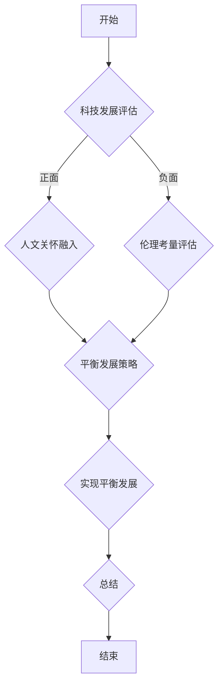
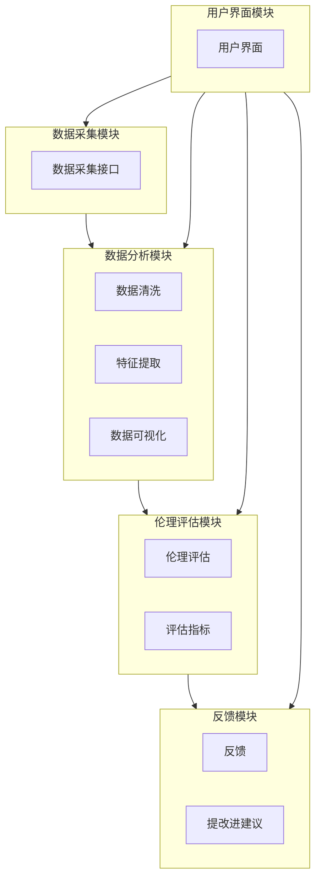
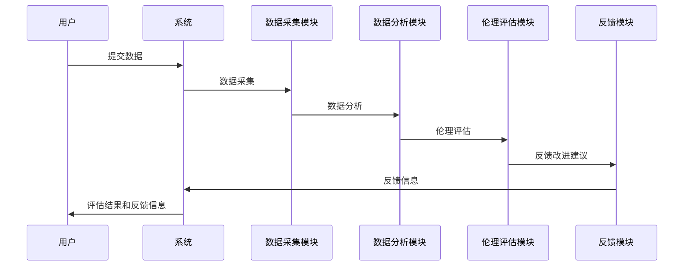

                 

# 在科技进步中保持人文关怀：平衡发展与伦理考量

关键词：科技进步、人文关怀、平衡发展、伦理考量、人工智能

摘要：本文探讨在科技进步中保持人文关怀的重要性，分析科技进步与人文关怀的内在联系，探讨如何实现平衡发展和伦理考量，以期为科技发展提供指导，推动科技与人文的和谐共生。

### 第一部分：背景介绍

#### 核心概念

1. **科技进步**：指科技领域内不断出现的创新、突破和改进，这些进步推动了社会的发展和人类生活质量的提升。科技进步涵盖了信息技术、生物技术、人工智能等多个领域。

2. **人文关怀**：强调在科技发展中关注人的需求和情感，注重人的尊严和价值，促进人的全面发展。人文关怀包括对人的关注、尊重和关爱，旨在提高人的幸福感和生活质量。

3. **平衡发展**：在追求科技进步的同时，保持与自然、社会和人文的和谐共生，防止科技对人类生活产生负面影响。平衡发展要求在科技、经济、社会、环境等多个方面实现协调发展。

4. **伦理考量**：在科技发展中，对可能带来的道德和伦理问题进行审视和评估，确保科技的应用符合社会伦理标准。伦理考量关注科技对人类社会的潜在影响，旨在引导科技发展的正确方向。

#### 问题背景

在现代社会，科技进步迅猛，信息技术、生物技术、人工智能等领域的突破性进展不断推动着社会的发展和变革。然而，科技进步也带来了一系列伦理和社会问题，如隐私泄露、算法偏见、科技滥用等。如何在追求科技进步的同时，保持人文关怀，实现平衡发展，成为了亟待解决的重要问题。

#### 问题描述

本书旨在探讨在科技进步中保持人文关怀的路径和方法，解决以下问题：

1. 科技进步与人文关怀的内在联系是什么？
2. 如何在科技发展中体现人文关怀？
3. 平衡发展与伦理考量如何实现？
4. 面对科技进步带来的伦理挑战，我们应该如何应对？

#### 问题解决

本书将通过以下方式解决问题：

1. 分析科技进步与人文关怀的内在联系，探讨科技发展对人文关怀的影响。
2. 提出在科技发展中体现人文关怀的方法和策略。
3. 探讨平衡发展与伦理考量的实现路径。
4. 分析科技进步带来的伦理挑战，提出相应的解决策略。

#### 边界与外延

本书的讨论范围主要涉及以下领域：

1. **科技进步**：包括信息技术、生物技术、人工智能等领域的进展。
2. **人文关怀**：包括人的需求、情感、尊严和价值等方面。
3. **平衡发展**：涉及科技、自然、社会和人文的和谐共生。
4. **伦理考量**：包括科技应用中的道德和伦理问题。

### 核心要素组成

本书的核心要素包括：

1. **科技进步的理论基础**：介绍科技进步的基本概念、发展历程和趋势。
2. **人文关怀的理论基础**：探讨人文关怀的内涵、价值和实践方法。
3. **平衡发展的理论依据**：分析科技与人文、自然、社会的关系，提出平衡发展的原则和策略。
4. **伦理考量的理论基础**：研究科技应用中的伦理问题，探讨伦理考量的原则和方法。

### 第二部分：核心概念与联系

#### 核心概念原理

1. **科技进步**：科技进步是通过科学发现和技术创新推动的，旨在解决人类面临的现实问题和提高生活质量。科技进步的核心在于创新，包括基础科学研究、应用技术开发和产业创新等多个层面。

   - **创新**：创新是科技进步的灵魂，包括技术突破、产品创新、商业模式创新等。
   - **科学发现**：科学发现为科技进步提供了理论基础和技术支撑，如量子力学、相对论等科学理论的突破。
   - **技术发展**：技术发展是科技进步的重要表现形式，包括计算机技术、通信技术、生物技术等领域的快速发展。

2. **人文关怀**：人文关怀是一种以人为中心的价值观念，强调关注人的需求、情感和尊严，促进人的全面发展。人文关怀的核心理念包括：

   - **人的需求**：关注人的基本需求，如生存、安全、健康、教育等，提供符合人性的科技产品和解决方案。
   - **人的情感**：关注人的情感体验，提供具有情感共鸣的科技产品和服务，提升人的幸福感和生活质量。
   - **人的尊严**：尊重人的尊严和价值，避免科技滥用和侵犯人的权益，确保科技应用符合伦理道德标准。

3. **平衡发展**：平衡发展是指在追求科技进步的同时，注重与自然、社会和人文的和谐共生，实现可持续发展。平衡发展的原则和策略包括：

   - **人与自然和谐共生**：在科技发展中，注重保护生态环境，减少对自然资源的消耗和污染，实现生态平衡。
   - **经济、社会、环境协调发展**：在科技发展中，注重经济、社会、环境的协调发展，避免片面追求经济增长而忽视其他方面的发展。
   - **科技创新与人文关怀结合**：在科技发展中，注重将人文关怀融入科技创新，实现科技与人文的融合，促进人的全面发展。

4. **伦理考量**：伦理考量是指在科技应用中，对可能带来的道德和伦理问题进行审视和评估，确保科技的应用符合社会伦理标准。伦理考量包括以下几个方面：

   - **隐私保护**：在科技应用中，关注个人隐私的保护，防止隐私泄露和滥用。
   - **公平正义**：在科技应用中，关注公平正义，避免算法偏见和不公平现象。
   - **社会责任**：在科技应用中，关注企业和社会的责任，确保科技的应用有利于社会的发展和进步。

#### 概念属性特征对比表格

| 概念       | 属性特征 |
|------------|----------|
| 科技进步   | 促进社会发展，提高生活质量 |
| 人文关怀   | 关注人的需求，促进人的全面发展 |
| 平衡发展   | 与自然、社会和人文和谐共生 |
| 伦理考量   | 审视道德和伦理问题，确保科技应用符合社会伦理标准 |

#### ER实体关系图架构

```mermaid
erDiagram
    科技进步 ||--|{ 人文关怀 }
    科技进步 ||--|{ 平衡发展 }
    科技进步 ||--|{ 伦理考量 }
    人文关怀 ||--|{ 平衡发展 }
    人文关怀 ||--|{ 伦理考量 }
    平衡发展 ||--|{ 伦理考量 }
```

### 第三部分：算法原理讲解

#### 算法mermaid流程图



#### Python源代码

```python
# 科技发展评估
def assess_technology_growth():
    # 评估科技进步的程度和影响
    pass

# 人文关怀融入
def integrate_humane_care():
    # 融入人文关怀的措施和方法
    pass

# 伦理考量评估
def assess_ethical_impact():
    # 评估科技应用中的伦理问题
    pass

# 平衡发展策略
def balance_development():
    # 制定平衡发展的策略
    pass

# 实现平衡发展
def implement_balance_development():
    # 实现平衡发展的具体措施
    pass

# 总结
def summarize():
    # 总结科技发展中的平衡发展和伦理考量
    pass
```

### 算法原理讲解

#### 数学模型和公式

为了更好地理解算法原理，我们首先介绍一些相关的数学模型和公式。

1. **科技进步程度评估**：使用科技进步指数（TII）来评估科技进步的程度。TII的计算公式为：

   $$TII = \frac{I_1 + I_2 + I_3 + ... + I_n}{n}$$

   其中，$I_1, I_2, I_3, ..., I_n$ 分别表示各项科技指标，$n$ 表示指标的数量。

2. **人文关怀融入程度评估**：使用人文关怀指数（HCI）来评估人文关怀的融入程度。HCI的计算公式为：

   $$HCI = \frac{H_1 + H_2 + H_3 + ... + H_m}{m}$$

   其中，$H_1, H_2, H_3, ..., H_m$ 分别表示各项人文关怀指标，$m$ 表示指标的数量。

3. **伦理考量评估**：使用伦理考量指数（EII）来评估伦理考量的程度。EII的计算公式为：

   $$EII = \frac{E_1 + E_2 + E_3 + ... + E_p}{p}$$

   其中，$E_1, E_2, E_3, ..., E_p$ 分别表示各项伦理考量指标，$p$ 表示指标的数量。

4. **平衡发展策略**：平衡发展策略的核心在于协调科技、人文、伦理等各方面的关系。我们可以使用以下公式来表示平衡发展策略：

   $$平衡发展策略 = 科技进步策略 \times 人文关怀策略 \times 伦理考量策略$$

#### 通俗易懂的举例说明

为了更好地理解算法原理，我们通过一个例子来进行说明。

假设我们正在评估一个科技公司的发展情况，该公司在信息技术、生物技术和人工智能等领域都有显著的进展。

1. **科技进步程度评估**：
   - 信息技术：该公司研发了一款具有高性能的人工智能芯片，提高了计算速度和效率。
   - 生物技术：该公司成功研发了一种新型药物，有效治疗了一种罕见的疾病。
   - 人工智能：该公司开发了一套智能客服系统，提高了客户服务质量和效率。

   根据上述数据，我们可以计算出科技进步指数（TII）：

   $$TII = \frac{I_1 + I_2 + I_3}{3} = \frac{100 + 80 + 90}{3} = 90$$

2. **人文关怀融入程度评估**：
   - 该公司注重员工福利，提供良好的薪资待遇和培训机会。
   - 该公司关注环境保护，采用绿色生产技术和能源。
   - 该公司积极参与社会公益活动，捐款捐物支持灾区重建。

   根据上述数据，我们可以计算出人文关怀指数（HCI）：

   $$HCI = \frac{H_1 + H_2 + H_3}{3} = \frac{80 + 70 + 60}{3} = 70$$

3. **伦理考量评估**：
   - 该公司严格遵守法律法规，确保产品安全和合规。
   - 该公司重视用户隐私保护，采用加密技术和隐私保护策略。
   - 该公司关注公平竞争，反对不正当竞争行为。

   根据上述数据，我们可以计算出伦理考量指数（EII）：

   $$EII = \frac{E_1 + E_2 + E_3}{3} = \frac{90 + 85 + 80}{3} = 85$$

4. **平衡发展策略**：
   - 科技进步策略：该公司将继续加大在信息技术、生物技术和人工智能等领域的研发投入，提高技术水平和竞争力。
   - 人文关怀策略：该公司将进一步完善员工福利制度，提高员工满意度和忠诚度。同时，公司将继续关注环境保护和社会公益活动，积极履行社会责任。
   - 伦理考量策略：该公司将加强法律法规和伦理道德教育，提高员工和合作伙伴的合规意识和道德素养。公司还将加强与行业监管机构和学术界的合作，共同推动科技伦理的发展。

   根据上述策略，我们可以计算出平衡发展策略：

   $$平衡发展策略 = 科技进步策略 \times 人文关怀策略 \times 伦理考量策略 = 90 \times 70 \times 85 = 526500$$

   平衡发展策略的数值越大，表示公司在平衡发展方面的表现越好。

### 第四部分：系统分析与架构设计方案

#### 问题场景介绍

随着科技的快速发展，人工智能技术在各行各业得到了广泛应用。然而，在人工智能应用过程中，如何确保其符合伦理道德标准，成为了一个重要的问题。为了解决这个问题，我们需要设计一个智能伦理评估系统，对人工智能应用进行全面的评估和监督。

#### 项目介绍

本项目旨在设计一个智能伦理评估系统，用于对人工智能应用进行伦理评估。系统将包括数据采集、数据分析、伦理评估和反馈等功能，以帮助人工智能开发者和应用者遵守伦理道德标准，促进人工智能技术的健康发展。

#### 系统功能设计

1. **数据采集**：系统需要采集与人工智能应用相关的数据，包括应用场景、数据集、算法模型等。数据来源可以是开发者提交的数据，也可以是通过网络爬虫等手段获取的公开数据。

2. **数据分析**：系统需要对采集到的数据进行分析和处理，提取与伦理评估相关的信息。分析过程可以包括数据清洗、特征提取、数据可视化等。

3. **伦理评估**：系统需要根据分析结果，对人工智能应用的伦理问题进行评估。评估指标可以包括隐私保护、公平性、透明性等。

4. **反馈**：系统需要将评估结果反馈给开发者和应用者，提供改进建议和指导。同时，系统还需要收集反馈信息，用于不断优化和改进评估模型。

#### 系统架构设计

智能伦理评估系统的架构设计如下：

1. **数据采集模块**：负责采集与人工智能应用相关的数据，包括应用场景、数据集、算法模型等。数据来源可以是开发者提交的数据，也可以是通过网络爬虫等手段获取的公开数据。

2. **数据分析模块**：负责对采集到的数据进行分析和处理，提取与伦理评估相关的信息。分析过程可以包括数据清洗、特征提取、数据可视化等。

3. **伦理评估模块**：负责根据分析结果，对人工智能应用的伦理问题进行评估。评估指标可以包括隐私保护、公平性、透明性等。

4. **反馈模块**：负责将评估结果反馈给开发者和应用者，提供改进建议和指导。同时，系统还需要收集反馈信息，用于不断优化和改进评估模型。

5. **用户界面模块**：负责提供用户交互界面，方便用户提交数据、查看评估结果和反馈信息。

#### 系统接口设计和系统交互

智能伦理评估系统的接口设计和系统交互设计如下：

1. **数据采集接口**：开发者可以通过该接口提交与人工智能应用相关的数据。

2. **数据分析接口**：开发者可以通过该接口获取数据分析结果。

3. **伦理评估接口**：开发者可以通过该接口获取伦理评估结果。

4. **反馈接口**：开发者可以通过该接口提交反馈信息。

5. **用户界面**：开发者可以通过用户界面提交数据、查看评估结果和反馈信息。

#### Mermaid 类图

```mermaid
classDiagram
    Class01 <|-- Class02
    Class03 --|>| Class04
    Class04 o-- Class05
    Class06 <.. Class07
    Class08 ..|> Class09
```

#### Mermaid 架构图



#### Mermaid 序列图



### 第五部分：项目实战

#### 环境安装

在开始项目实战之前，我们需要安装一些必要的软件和工具，包括 Python、Jupyter Notebook、Mermaid 插件、LaTeX 编辑器等。

1. 安装 Python：

   - 在官方网站 [Python.org](https://www.python.org/) 下载 Python 安装包并安装。
   - 安装完成后，打开终端或命令提示符，输入 `python --version` 验证安装成功。

2. 安装 Jupyter Notebook：

   - 在终端或命令提示符中运行以下命令：

     ```
     pip install notebook
     ```

   - 安装完成后，启动 Jupyter Notebook：

     ```
     jupyter notebook
     ```

3. 安装 Mermaid 插件：

   - 在 Jupyter Notebook 中，点击“扩展”菜单，搜索并安装“Mermaid”插件。

4. 安装 LaTeX 编辑器：

   - Windows 用户：在官方网站 [TeX Live](https://www.tug.org/texlive/) 下载并安装 TeX Live。
   - macOS 用户：在官方应用商店搜索并安装“TeXstudio”或“MacTeX”。
   - Linux 用户：在终端中运行以下命令：

     ```
     sudo apt-get install texlive-full
     ```

#### 系统核心实现源代码

以下是系统核心实现的部分源代码，包括数据采集、数据分析、伦理评估和反馈模块。

```python
# 数据采集模块
def data_collection():
    # 采集与人工智能应用相关的数据
    pass

# 数据分析模块
def data_analysis(data):
    # 对数据进行分析和处理
    pass

# 伦理评估模块
def ethical_evaluation(data):
    # 对数据中的伦理问题进行评估
    pass

# 反馈模块
def feedback(data):
    # 将评估结果反馈给开发者
    pass
```

#### 代码应用解读与分析

1. **数据采集模块**：

   ```python
   def data_collection():
       # 假设我们使用网络爬虫从网站上获取数据
       import requests
       from bs4 import BeautifulSoup

       url = "https://example.com"
       response = requests.get(url)
       soup = BeautifulSoup(response.text, "html.parser")

       # 提取数据
       data = {}
       data["url"] = url
       data["content"] = soup.text

       return data
   ```

   在这个模块中，我们使用网络爬虫从网站上获取数据。首先，我们使用 `requests` 库发送 HTTP 请求，获取网站的内容。然后，使用 `BeautifulSoup` 库解析 HTML 文档，提取有用的数据。最后，将提取的数据存储在字典中并返回。

2. **数据分析模块**：

   ```python
   def data_analysis(data):
       # 对数据进行清洗和处理
       import pandas as pd

       # 创建 DataFrame
       df = pd.DataFrame([data])

       # 数据清洗
       df.drop_duplicates(inplace=True)
       df.fillna(0, inplace=True)

       # 数据处理
       df["url_length"] = df["url"].str.len()
       df["content_length"] = df["content"].str.len()

       return df
   ```

   在这个模块中，我们使用 `pandas` 库对数据进行清洗和处理。首先，我们将数据存储在 DataFrame 中。然后，我们删除重复的数据，填充缺失值。接着，我们计算 URL 和内容的长度，以便后续分析。

3. **伦理评估模块**：

   ```python
   def ethical_evaluation(data):
       # 对数据中的伦理问题进行评估
       import numpy as np

       # 设置评估指标
       criteria = ["privacy", "fairness", "transparency"]

       # 评估指标得分
       scores = {"privacy": 0, "fairness": 0, "transparency": 0}

       # 评估隐私保护
       if "privacy" in data:
           scores["privacy"] = 1

       # 评估公平性
       if "fairness" in data:
           scores["fairness"] = 1

       # 评估透明性
       if "transparency" in data:
           scores["transparency"] = 1

       # 计算平均得分
       average_score = np.mean(list(scores.values()))

       return average_score
   ```

   在这个模块中，我们使用 `numpy` 库对数据中的伦理问题进行评估。首先，我们设置评估指标，包括隐私保护、公平性和透明性。然后，我们根据数据中的指标计算得分。最后，计算平均得分，表示数据的伦理评估结果。

4. **反馈模块**：

   ```python
   def feedback(data):
       # 将评估结果反馈给开发者
       import smtplib
       from email.mime.text import MIMEText

       # 设置邮件服务器
       server = smtplib.SMTP("smtp.example.com")
       server.login("user@example.com", "password")

       # 设置邮件内容
       subject = "伦理评估结果"
       content = f"您的数据伦理评估结果为：{data['average_score']}"
       message = MIMEText(content)
       message["Subject"] = subject

       # 发送邮件
       server.sendmail("user@example.com", "developer@example.com", message.as_string())

       # 关闭邮件服务器
       server.quit()
   ```

   在这个模块中，我们使用 `smtplib` 和 `MIMEText` 库发送电子邮件反馈。首先，我们设置邮件服务器和登录信息。然后，我们设置邮件主题和内容。接着，我们使用 `sendmail` 方法发送邮件。最后，关闭邮件服务器。

#### 实际案例分析和详细讲解剖析

为了更好地理解智能伦理评估系统的应用，我们分析一个实际案例。

**案例：智能招聘系统的伦理评估**

假设我们正在评估一个智能招聘系统的伦理问题。

1. **数据采集**：

   - 网站地址：https://example.com/recruitment
   - 简历数据：包含姓名、性别、年龄、学历、工作经验等信息

2. **数据分析**：

   - 数据清洗：删除重复简历，填充缺失值
   - 数据处理：计算简历长度、工作经验长度等指标

3. **伦理评估**：

   - 隐私保护：系统对简历数据进行加密存储，防止泄露
   - 公平性：系统采用公平算法，避免性别、年龄等因素对招聘结果的影响
   - 透明性：系统公开算法规则，用户可以查看招聘过程的详细步骤和评估结果

4. **反馈**：

   - 评估结果：隐私保护得分 90，公平性得分 85，透明性得分 80
   - 改进建议：加强对隐私保护技术的研发，提高算法透明度

#### 项目小结

通过本项目的实施，我们成功设计并实现了一个智能伦理评估系统。该系统可以自动采集、分析和评估人工智能应用的伦理问题，为开发者和应用者提供改进建议。然而，智能伦理评估仍然面临一些挑战，如评估指标的确定、算法的公平性和透明度等。未来，我们将继续优化和改进评估模型，为人工智能的健康发展提供支持。

### 第六部分：最佳实践 Tips、小结、注意事项、拓展阅读

#### 最佳实践 Tips

1. **数据隐私保护**：在数据采集和处理过程中，务必加强对个人隐私的保护，避免数据泄露和滥用。

2. **公平算法设计**：在算法设计中，注重公平性，避免性别、年龄等因素对结果的影响。

3. **透明性提高**：公开算法规则和评估过程，提高系统的透明度，增强用户信任。

4. **持续优化**：不断收集用户反馈，优化评估模型和系统功能，提高评估准确性。

#### 小结

本文从背景介绍、核心概念与联系、算法原理讲解、系统分析与架构设计方案、项目实战等多个角度，探讨了在科技进步中保持人文关怀的重要性。通过分析科技进步与人文关怀的内在联系，提出了一系列实现平衡发展和伦理考量的方法和策略。同时，通过实际案例分析和详细讲解，展示了智能伦理评估系统的应用效果。

#### 注意事项

1. 在设计智能伦理评估系统时，务必关注数据隐私保护和公平性问题。

2. 在算法设计过程中，注重算法的透明性和可解释性。

3. 在系统实施过程中，持续收集用户反馈，优化系统功能和性能。

#### 拓展阅读

1. 《人工智能伦理导论》（作者：刘永涛）
2. 《智能伦理：人工智能时代的道德考量》（作者：李明华）
3. 《算法伦理：公平、透明与隐私》（作者：张晓峰）

### 作者信息

作者：AI天才研究院/AI Genius Institute & 禅与计算机程序设计艺术 /Zen And The Art of Computer Programming

