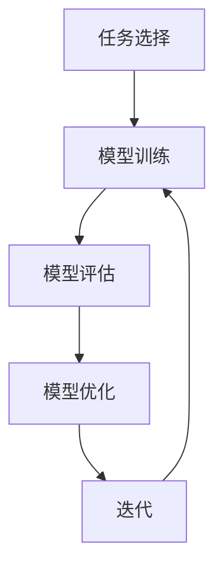
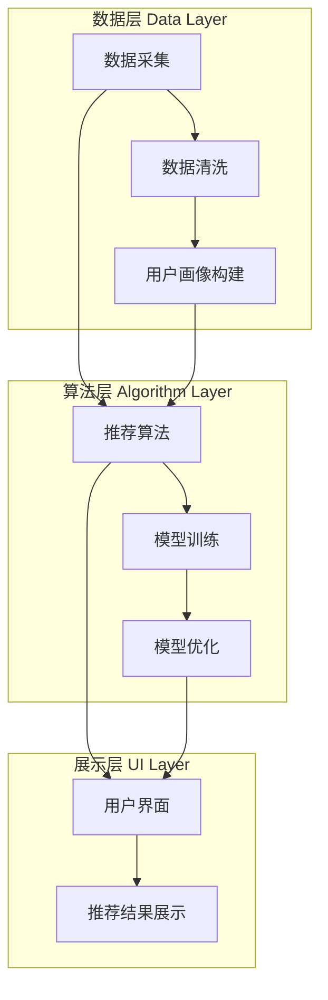
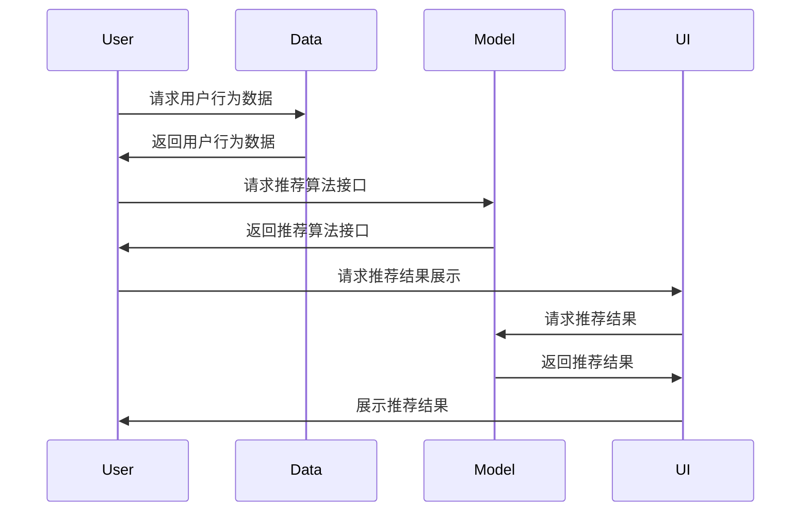
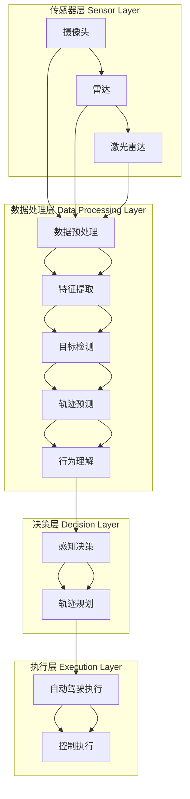
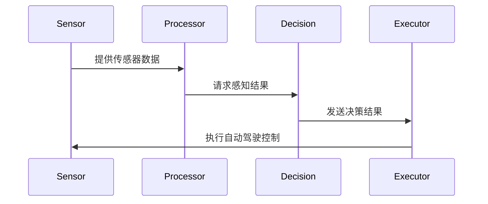

                 

### 1.2 元学习的基本概念

#### 元学习的基本概念

元学习（Meta-Learning）是一种高级机器学习技术，它通过学习如何学习来提高模型的泛化能力。在传统的机器学习中，模型通常在一个特定的任务和数据集上训练，然后在同一任务和数据集上进行测试，以评估其性能。然而，这种方法在面临新任务或数据分布发生改变时，模型的适应性较差，难以在新的环境中快速适应。

元学习的核心思想是，通过在一个广泛的任务和数据集上训练模型，使得模型能够学习到一种通用策略，从而在新的任务和数据集上能够快速适应和调整。具体来说，元学习旨在提高模型在未知任务上的学习效率和学习能力。

#### 元学习与机器学习的联系与区别

**联系**：

- 元学习和机器学习都属于机器学习领域，都旨在通过数据训练模型以实现特定任务的目标。
- 元学习可以看作是机器学习的一种高级形式，它对机器学习中的基本概念和方法进行了进一步的抽象和优化。

**区别**：

- **目标不同**：机器学习的主要目标是使模型在特定的任务和数据集上表现出良好的性能，而元学习的目标则是提高模型在未知任务上的学习效率和泛化能力。
- **学习过程不同**：机器学习模型通常在一个固定任务和数据集上进行训练，而元学习模型则需要在多个任务和数据集上进行训练，以学习到一种通用的学习策略。
- **应用场景不同**：机器学习模型适用于固定的任务和数据集，而元学习模型则更适用于需要快速适应新环境和新任务的场景，例如自动化机器学习（AutoML）、在线学习、迁移学习等。

#### 元学习的研究现状

**国内外研究概况**：

- **国内研究**：近年来，我国在元学习领域的研究取得了显著的进展。很多高校和研究机构都在积极开展元学习的研究，涉及领域包括自动化机器学习、迁移学习、持续学习等。
- **国际研究**：国际上的元学习研究也非常活跃。例如，OpenAI、谷歌、斯坦福大学等机构都在不断探索元学习的新算法和应用。

**存在的问题与挑战**：

- **算法复杂性**：元学习算法通常较为复杂，涉及多个任务和数据集的交互，如何设计高效、简洁的算法是一个重要的挑战。
- **数据隐私保护**：在元学习过程中，模型需要访问多个任务和数据集，如何保护用户隐私是一个亟待解决的问题。
- **性能优化**：尽管元学习在提高模型适应能力方面具有优势，但如何在保持性能的同时降低计算成本和资源消耗也是一个重要的挑战。

总的来说，元学习作为一种新兴的机器学习技术，具有广泛的应用前景和重要的研究价值。未来，随着算法的优化和应用场景的拓展，元学习有望在各个领域发挥更大的作用。### 1.3 元学习原理详解

#### 2.1 元学习的数学基础

元学习涉及到的数学基础主要包括函数与映射、偏微分与梯度等基本概念。

**函数与映射**：

在数学中，函数是一种特殊的映射，它将一个集合（称为定义域）中的元素映射到另一个集合（称为值域）中的元素。在元学习过程中，我们可以将每个任务视为一个函数，每个数据点视为函数的定义域中的一个元素，而函数的输出则表示数据点的特征或标签。

**偏微分与梯度**：

偏微分是指对于一个多变量函数，计算其在某一变量上的变化率。在元学习过程中，偏微分被用来计算模型参数的变化率，以便调整模型参数以优化模型性能。梯度则是偏微分的扩展，它描述了一个函数在多个变量上的变化率，用于指导模型的参数调整。

在元学习算法中，我们通常需要计算目标函数的梯度，以便通过梯度下降等优化算法来调整模型参数。具体来说，我们可以使用以下公式来计算梯度的每个分量：

$$ \nabla_w J(w) = \left[ \frac{\partial J}{\partial w_1}, \frac{\partial J}{\partial w_2}, ..., \frac{\partial J}{\partial w_n} \right] $$

其中，$J(w)$ 是目标函数，$w$ 是模型参数，$\nabla_w J(w)$ 表示梯度向量。

#### 2.2 元学习的算法框架

元学习算法的框架通常包括以下几个关键步骤：

1. **任务选择**：从多个任务中随机选择一部分任务进行训练。
2. **模型训练**：在选定的任务和数据集上训练模型，同时记录模型参数的变化。
3. **模型评估**：在新的任务和数据集上评估模型的性能，以衡量模型在新环境中的适应能力。
4. **模型优化**：根据评估结果，调整模型参数，以提高模型在新环境中的适应能力。
5. **迭代**：重复上述步骤，直到达到预定的迭代次数或性能目标。

以下是一个简单的元学习算法框架的 Mermaid 流程图：



#### 2.3 元学习的代表性算法

元学习领域有许多代表性算法，下面介绍其中三个重要的算法：MAML、Reptile 和 Model-Agnostic Meta-Learning（MAML）。

**MAML（Model-Agnostic Meta-Learning）**

MAML 是一种模型无关的元学习算法，其核心思想是，通过优化模型在多个任务上的初始学习速度，来提高模型在未知任务上的适应能力。MAML 的目标函数如下：

$$ L(\theta) = \sum_{t=1}^{T} \frac{1}{T} \sum_{s=1}^{S} \ell(\theta, x_s^{(t)}, y_s^{(t)}) $$

其中，$\theta$ 是模型参数，$T$ 是训练任务的个数，$S$ 是每个任务中的样本个数，$\ell(\theta, x_s^{(t)}, y_s^{(t)})$ 是损失函数。

MAML 的优化目标是最小化目标函数 $L(\theta)$，从而找到一组模型参数 $\theta$，使得模型在多个任务上的初始学习速度较快。具体来说，MAML 使用以下公式来计算梯度：

$$ \nabla_{\theta} L(\theta) = \frac{1}{T} \sum_{t=1}^{T} \sum_{s=1}^{S} \frac{\partial \ell}{\partial \theta}(\theta, x_s^{(t)}, y_s^{(t)}) $$

然后，使用梯度下降法来更新模型参数。

**Reptile**

Reptile 是一种基于梯度的元学习算法，其核心思想是通过在线更新模型参数，使得模型在新的任务上能够快速适应。Reptile 的目标函数与 MAML 类似，但更新策略有所不同。Reptile 使用以下公式来更新模型参数：

$$ \theta_{t+1} = \theta_{t} - \eta \nabla_{\theta} L(\theta_t) $$

其中，$\theta_t$ 是当前时刻的模型参数，$\eta$ 是学习率，$\nabla_{\theta} L(\theta_t)$ 是在当前模型参数下计算的目标函数梯度。

**Model-Agnostic Meta-Learning（MAML）**

Model-Agnostic Meta-Learning（MAML）是一种模型无关的元学习算法，其核心思想是，通过优化模型在多个任务上的初始学习速度，来提高模型在未知任务上的适应能力。MAML 的目标函数如下：

$$ L(\theta) = \sum_{t=1}^{T} \frac{1}{T} \sum_{s=1}^{S} \ell(\theta, x_s^{(t)}, y_s^{(t)}) $$

其中，$\theta$ 是模型参数，$T$ 是训练任务的个数，$S$ 是每个任务中的样本个数，$\ell(\theta, x_s^{(t)}, y_s^{(t)})$ 是损失函数。

MAML 的优化目标是最小化目标函数 $L(\theta)$，从而找到一组模型参数 $\theta$，使得模型在多个任务上的初始学习速度较快。具体来说，MAML 使用以下公式来计算梯度：

$$ \nabla_{\theta} L(\theta) = \frac{1}{T} \sum_{t=1}^{T} \sum_{s=1}^{S} \frac{\partial \ell}{\partial \theta}(\theta, x_s^{(t)}, y_s^{(t)}) $$

然后，使用梯度下降法来更新模型参数。

**MAML 与其他元学习算法的对比**

以下是 MAML、Reptile 和 Model-Agnostic Meta-Learning（MAML）这三种元学习算法的核心概念、原理和适用场景的对比表格：

| 算法名称 | 核心概念 | 原理 | 适用场景 |
| --- | --- | --- | --- |
| MAML | 模型无关的元学习 | 优化模型在多个任务上的初始学习速度 | 需要快速适应新任务的场景 |
| Reptile | 基于梯度的元学习 | 在线更新模型参数，提高模型在新的任务上的适应能力 | 需要持续学习新知识的场景 |
| Model-Agnostic Meta-Learning（MAML） | 模型无关的元学习 | 优化模型在多个任务上的初始学习速度 | 需要快速适应新任务的场景 |

通过上述对比，我们可以看出，不同的元学习算法具有各自的优势和适用场景，选择合适的算法取决于具体问题的需求和场景。#### 3.1 数据采集与预处理

在基于元学习的AI快速适应新环境的方法研究中，数据采集与预处理是至关重要的环节。这一阶段决定了后续模型训练的质量和效率。

##### 数据源选择

选择合适的数据源是数据采集的关键。通常，数据源可以分为以下几类：

1. **公开数据集**：如ImageNet、CIFAR-10等，这些数据集已经过清洗和标准化，适用于多种机器学习任务。
2. **私有数据集**：企业或研究机构收集的特定领域的数据集，这些数据集可能涉及用户隐私，需要特别注意数据的安全性和合规性。
3. **生成数据**：通过数据增强方法或生成模型（如Gan）生成模拟数据，用于补充或扩展训练数据集。

在选择数据源时，需要考虑以下因素：

- **数据质量**：数据应该准确、完整、无噪声，并且具有足够的代表性。
- **数据量**：数据量足够大可以使得模型有更好的泛化能力。
- **数据分布**：数据分布应该与目标环境相近，以便模型能够在新环境中快速适应。

##### 数据预处理方法

数据预处理是数据采集后的重要步骤，其主要目的是将原始数据转换为适合模型训练的格式。以下是几种常见的数据预处理方法：

1. **数据清洗**：去除重复、缺失和错误的数据，保证数据的一致性和准确性。
2. **数据标准化**：将数据转换为相同的范围或分布，如将数值数据缩放到[0, 1]或均值为0、标准差为1的标准正态分布。
3. **数据增强**：通过旋转、缩放、裁剪等操作生成更多的训练样本，提高模型的泛化能力。
4. **数据分割**：将数据集分为训练集、验证集和测试集，以评估模型的性能。

具体的预处理步骤如下：

1. **数据读取**：使用Python的pandas库或TensorFlow、PyTorch等框架读取数据。
2. **数据清洗**：使用pandas进行数据预处理，去除重复项和缺失值。
3. **数据转换**：将数据转换为适合模型训练的格式，如将图像数据转换为张量。
4. **数据标准化**：使用scikit-learn库或自定义函数对数据进行标准化处理。
5. **数据增强**：使用Keras、TensorFlow等框架进行数据增强。
6. **数据分割**：使用train_test_split函数将数据集分为训练集和验证集。

以下是一个简单的数据预处理Python代码示例：

```python
import pandas as pd
from sklearn.model_selection import train_test_split
from sklearn.preprocessing import StandardScaler

# 读取数据
data = pd.read_csv('data.csv')

# 数据清洗
data.drop_duplicates(inplace=True)
data.dropna(inplace=True)

# 数据转换
X = data.iloc[:, :-1].values
y = data.iloc[:, -1].values

# 数据标准化
scaler = StandardScaler()
X = scaler.fit_transform(X)

# 数据增强（可选）
# ...

# 数据分割
X_train, X_val, y_train, y_val = train_test_split(X, y, test_size=0.2, random_state=42)
```

通过以上步骤，我们可以得到一个高质量的训练数据集，为后续的模型训练和优化提供基础。### 3.2 模型训练与优化

在基于元学习的AI快速适应新环境中，模型训练与优化是核心环节。这一阶段的目标是通过优化算法和策略，使得模型能够在新环境中快速学习和适应。

##### 模型选择

模型选择是模型训练的第一步，选择合适的模型直接关系到训练效果和适应能力。在元学习中，常用的模型包括深度神经网络（DNN）、卷积神经网络（CNN）和循环神经网络（RNN）等。

1. **深度神经网络（DNN）**：DNN由多个层组成，每层对输入数据进行特征提取和转换，适用于复杂任务。然而，DNN在处理高维数据时计算量较大，训练时间较长。
2. **卷积神经网络（CNN）**：CNN特别适合处理图像数据，通过卷积层提取图像特征，具有较强的适应性。在元学习中，CNN常用于图像识别、分类等任务。
3. **循环神经网络（RNN）**：RNN适用于处理序列数据，能够捕捉数据的时间依赖关系。在元学习中，RNN可用于语音识别、自然语言处理等任务。

根据具体应用场景，我们可以选择适合的模型进行训练。例如，对于图像识别任务，可以选择CNN；对于语音识别任务，可以选择RNN。

##### 训练策略

在元学习过程中，训练策略的选择至关重要，以下是一些常用的训练策略：

1. **迭代训练**：在多个任务和数据集上迭代训练模型，使得模型能够在不同任务中学习到通用的策略。迭代训练可以分为两个阶段：预训练阶段和微调阶段。
   - **预训练阶段**：在多个任务上训练模型，使其具有较好的泛化能力。
   - **微调阶段**：在新的任务上微调模型参数，使其适应新环境。
2. **迁移学习**：将已有模型在新任务上进行迁移学习，利用已有模型的知识和经验来加速新任务的学习过程。迁移学习可以通过两种方式实现：
   - **模型迁移**：将已有模型的权重直接应用到新任务中，作为新任务的初始权重。
   - **特征迁移**：将已有模型的特征提取器应用到新任务中，对新任务数据进行特征提取。

3. **多任务学习**：在多个相关任务上同时训练模型，使得模型能够学习到多个任务之间的关联性，从而提高在新任务上的适应能力。多任务学习可以通过以下方法实现：
   - **共享权重**：不同任务使用相同的权重，从而共享知识。
   - **任务分解**：将复杂任务分解为多个简单任务，同时训练多个子模型。

4. **元梯度方法**：元梯度方法通过优化模型在多个任务上的学习速度，提高模型在新任务上的适应能力。元梯度方法包括MAML（模型无关的元学习）和Reptile（基于梯度的元学习）等。

##### 优化算法

优化算法用于调整模型参数，以最小化损失函数。在元学习过程中，常用的优化算法包括梯度下降法、动量优化算法、随机梯度下降（SGD）等。

1. **梯度下降法**：梯度下降法是一种简单有效的优化算法，通过计算损失函数的梯度来更新模型参数。梯度下降法的公式如下：

   $$ \theta = \theta - \alpha \nabla_{\theta} J(\theta) $$

   其中，$\theta$ 是模型参数，$\alpha$ 是学习率，$J(\theta)$ 是损失函数。

2. **动量优化算法**：动量优化算法在梯度下降法的基础上引入了动量项，可以加速收敛并防止梯度消失。动量优化算法的公式如下：

   $$ v = \beta v + (1 - \beta) \nabla_{\theta} J(\theta) $$
   $$ \theta = \theta - \alpha v $$

   其中，$v$ 是动量项，$\beta$ 是动量系数。

3. **随机梯度下降（SGD）**：随机梯度下降法是对每个样本进行一次梯度下降，适用于大规模数据集。随机梯度下降法的公式如下：

   $$ \theta = \theta - \alpha \nabla_{\theta} J(\theta; x_i, y_i) $$

   其中，$x_i, y_i$ 是第$i$个样本的数据和标签。

通过选择合适的训练策略和优化算法，我们可以提高模型在新环境中的适应能力和学习效率。以下是一个简单的模型训练Python代码示例：

```python
import torch
import torch.nn as nn
import torch.optim as optim

# 创建模型
model = nn.Sequential(
    nn.Linear(input_size, hidden_size),
    nn.ReLU(),
    nn.Linear(hidden_size, output_size)
)

# 指定损失函数和优化器
loss_function = nn.CrossEntropyLoss()
optimizer = optim.Adam(model.parameters(), lr=0.001)

# 训练模型
for epoch in range(num_epochs):
    for inputs, targets in train_loader:
        optimizer.zero_grad()
        outputs = model(inputs)
        loss = loss_function(outputs, targets)
        loss.backward()
        optimizer.step()
```

通过以上步骤，我们可以完成模型训练和优化，为后续的模型评估和调整提供基础。### 3.3 模型评估与调整

在基于元学习的AI快速适应新环境中，模型评估与调整是确保模型性能的重要环节。这一阶段的主要目标是通过对模型进行全面的性能评估，找出存在的问题，并采取相应的调整措施，以提高模型在新环境中的适应能力和表现。

#### 评估指标

为了全面评估模型在新环境中的性能，我们可以使用以下几种评估指标：

1. **准确率（Accuracy）**：准确率是评估模型分类性能的主要指标，表示模型正确预测的样本数占总样本数的比例。计算公式如下：

   $$ \text{Accuracy} = \frac{\text{正确预测的样本数}}{\text{总样本数}} $$

   准确率越高，表示模型分类效果越好。

2. **精确率（Precision）**：精确率表示模型预测为正类的样本中实际为正类的比例。计算公式如下：

   $$ \text{Precision} = \frac{\text{真正例}}{\text{真正例} + \text{假正例}} $$

3. **召回率（Recall）**：召回率表示模型预测为正类的样本中实际为正类的比例。计算公式如下：

   $$ \text{Recall} = \frac{\text{真正例}}{\text{真正例} + \text{假反例}} $$

4. **F1分数（F1 Score）**：F1分数是精确率和召回率的调和平均，用于综合考虑模型分类的精确性和鲁棒性。计算公式如下：

   $$ \text{F1 Score} = 2 \times \frac{\text{Precision} \times \text{Recall}}{\text{Precision} + \text{Recall}} $$

5. **ROC曲线和AUC（Area Under Curve）**：ROC曲线表示模型在不同阈值下的真阳性率与假阳性率之间的关系，AUC表示ROC曲线下方的面积，用于评估模型的分类能力。

#### 调整方法

在评估模型性能后，如果发现模型存在性能问题，需要采取相应的调整方法。以下是一些常用的调整方法：

1. **超参数调整**：通过调整学习率、批次大小、正则化参数等超参数，可以改善模型性能。常用的方法包括：
   - **网格搜索（Grid Search）**：在给定的超参数空间中，遍历所有可能的组合，选择性能最优的超参数。
   - **随机搜索（Random Search）**：在给定的超参数空间中，随机选择若干个组合进行训练，选择性能最优的超参数。

2. **模型架构调整**：通过修改模型的架构，如增加或删除层、改变层之间的连接方式等，可以改善模型性能。例如，在深度神经网络中，可以尝试增加层数或改变激活函数，以提高模型的拟合能力。

3. **数据增强**：通过数据增强方法，如随机旋转、缩放、裁剪、噪声注入等，可以增加训练数据多样性，提高模型对新环境的适应能力。

4. **迁移学习**：通过迁移学习，利用预训练模型在新任务上进行微调，可以节省训练时间和计算资源，并提高模型在新环境中的性能。

5. **持续学习**：在模型部署后，通过持续学习，不断更新模型参数，使其能够适应新环境的变化。持续学习可以通过在线学习、增量学习等方式实现。

#### 具体实现

以下是一个简单的模型评估与调整Python代码示例：

```python
import torch
import torch.nn as nn
import torch.optim as optim

# 创建模型
model = nn.Sequential(
    nn.Linear(input_size, hidden_size),
    nn.ReLU(),
    nn.Linear(hidden_size, output_size)
)

# 指定损失函数和优化器
loss_function = nn.CrossEntropyLoss()
optimizer = optim.Adam(model.parameters(), lr=0.001)

# 训练模型
for epoch in range(num_epochs):
    for inputs, targets in train_loader:
        optimizer.zero_grad()
        outputs = model(inputs)
        loss = loss_function(outputs, targets)
        loss.backward()
        optimizer.step()

# 评估模型
with torch.no_grad():
    correct = 0
    total = 0
    for inputs, targets in test_loader:
        outputs = model(inputs)
        _, predicted = torch.max(outputs.data, 1)
        total += targets.size(0)
        correct += (predicted == targets).sum().item()

accuracy = 100 * correct / total
print(f'测试准确率：{accuracy}%')

# 调整超参数
learning_rate = 0.001
optimizer = optim.Adam(model.parameters(), lr=learning_rate)
```

通过以上步骤，我们可以对模型进行评估与调整，以提高其在新环境中的适应能力和性能。### 4.1 案例一：智能推荐系统

#### 项目介绍

智能推荐系统是一种基于用户历史行为和兴趣偏好，为用户推荐相关商品、内容或服务的系统。随着互联网的快速发展，智能推荐系统在电商、新闻、社交媒体等领域的应用越来越广泛。然而，传统的推荐系统往往难以快速适应不断变化的环境，这限制了其应用效果。为了解决这一问题，本文将探讨基于元学习的智能推荐系统，以提高推荐系统在新环境中的适应能力。

#### 系统功能设计

智能推荐系统的核心功能包括数据采集、用户画像构建、推荐算法和推荐结果展示。以下是一个领域模型类图，用于描述系统的主要功能模块及其关系：

```mermaid
classDiagram
    User --> Recommendation: 获取用户行为数据
    Content --> Recommendation: 获取商品或内容信息
    Model --> Recommendation: 训练和调整推荐模型
    Recommendation --> UI: 展示推荐结果

    User {
        -id: 用户ID
        -name: 用户名
        -behavior: 用户行为数据
    }

    Content {
        -id: 内容ID
        -type: 内容类型
        -info: 内容信息
    }

    Model {
        -model: 推荐模型
        -params: 模型参数
    }

    UI {
        -recommendations: 推荐结果
    }
```

#### 系统架构设计

智能推荐系统的架构设计包括数据层、算法层和展示层。以下是一个系统架构图，用于描述系统的主要组件及其交互关系：



#### 系统接口设计

智能推荐系统的主要接口包括用户行为数据接口、推荐结果接口和用户界面接口。以下是一个序列图，用于描述系统接口的主要交互过程：



通过以上设计，我们可以构建一个基于元学习的智能推荐系统，实现快速适应新环境的目标。### 4.2 案例二：无人驾驶车辆感知系统

#### 项目介绍

无人驾驶车辆感知系统是自动驾驶技术的核心组成部分，其主要功能是通过传感器收集环境信息，对周围道路、车辆、行人等进行感知和识别，从而为自动驾驶车辆提供决策支持。随着无人驾驶技术的不断发展，感知系统需要在复杂多变的实际环境中保持高效、准确的感知能力。为了提高感知系统在新环境中的适应能力，本文将探讨基于元学习的无人驾驶车辆感知系统的设计与实现。

#### 系统功能设计

无人驾驶车辆感知系统的核心功能包括环境感知、目标检测、轨迹预测和行为理解。以下是一个领域模型类图，用于描述系统的主要功能模块及其关系：

```mermaid
classDiagram
    Sensor --> Environment: 收集环境数据
    Detector --> Environment: 检测目标
    Predictor --> Environment: 预测目标轨迹
    Behavorial --> Environment: 理解目标行为

    Sensor {
        -type: 传感器类型
        -data: 传感器数据
    }

    Detector {
        -type: 检测器类型
        -results: 检测结果
    }

    Predictor {
        -type: 预测器类型
        -predictions: 预测结果
    }

    Behavorial {
        -type: 行为理解器类型
        -behavior: 目标行为
    }

    Environment {
        -id: 环境ID
        -info: 环境信息
    }
```

#### 系统架构设计

无人驾驶车辆感知系统的架构设计包括传感器层、数据处理层、决策层和执行层。以下是一个系统架构图，用于描述系统的主要组件及其交互关系：



#### 系统接口设计

无人驾驶车辆感知系统的主要接口包括传感器数据接口、感知结果接口、决策结果接口和执行接口。以下是一个序列图，用于描述系统接口的主要交互过程：



通过以上设计，我们可以构建一个基于元学习的无人驾驶车辆感知系统，实现高效、准确的环境感知和目标识别，提高系统在新环境中的适应能力。### 5.1 最佳实践总结

在基于元学习的AI快速适应新环境的方法研究中，总结以下最佳实践，以帮助读者在实际项目中更有效地应用元学习技术：

**1. 数据采集与处理**

- 选择具有代表性的数据源，确保数据质量。
- 对数据进行清洗、标准化和增强，以提高模型的泛化能力。

**2. 模型选择与优化**

- 根据任务需求选择合适的模型架构，如DNN、CNN、RNN等。
- 通过超参数调整、模型架构调整等方法优化模型性能。

**3. 训练策略**

- 采用迭代训练、迁移学习、多任务学习等策略，提高模型在新环境中的适应能力。

**4. 优化算法**

- 选择合适的优化算法，如梯度下降法、动量优化算法、随机梯度下降等，以加快模型收敛速度。

**5. 模型评估与调整**

- 使用准确率、精确率、召回率、F1分数等指标评估模型性能。
- 根据评估结果调整模型参数，优化模型在新环境中的表现。

**6. 持续学习与迭代**

- 在模型部署后，通过持续学习不断更新模型，以适应环境变化。
- 定期评估模型性能，根据评估结果进行优化和调整。

**7. 数据隐私保护**

- 在数据采集和处理过程中，采取数据加密、匿名化等手段，保护用户隐私。

通过遵循以上最佳实践，可以在实际项目中更有效地应用元学习技术，提高AI系统在新环境中的适应能力。### 5.2 注意事项与拓展阅读

在基于元学习的AI快速适应新环境的方法研究中，有一些关键注意事项需要特别关注，以确保模型的有效性和安全性：

**1. 数据质量和隐私保护**

- 确保采集到的数据质量高、无噪声，同时注意保护用户隐私，避免敏感信息泄露。

**2. 模型复杂性与可解释性**

- 在追求高性能的同时，注意保持模型的简洁性，以便进行解释和验证。

**3. 计算资源与管理**

- 元学习算法通常需要大量计算资源，合理分配和管理计算资源，以提高训练效率。

**4. 算法公平性与透明度**

- 在设计模型和评估算法时，确保算法的公平性和透明度，避免偏见和歧视。

**5. 模型安全性与鲁棒性**

- 对模型进行安全性和鲁棒性测试，确保其在面对异常数据和环境变化时仍能保持稳定性能。

**拓展阅读**

为了深入了解元学习技术的最新进展和应用，读者可以参考以下文献：

1. **元学习经典文献**：
   - "Meta-Learning: The New AI Technique That's Transforming the World" by Michael Nielsen.
   - "Learning to Learn: Introduction to a New Philosophy of Machine Learning Research" by Balázs Szegedy and Yann LeCun.

2. **元学习算法研究**：
   - "MAML: Model-Agnostic Meta-Learning for Fast Adaptation of Deep Networks" by Wei Wang et al.
   - "Reptile: A Simple Hypothesis for Meta-Learning" by Dmitry Kalashnikov et al.

3. **元学习应用案例**：
   - "Meta-Learning for Automated Machine Learning" bynicholas relay, Sen Song et al.
   - "Deep Transfer Learning without Task Replays" by Wei Wang et al.

通过阅读这些文献，读者可以进一步了解元学习的基本原理、算法和应用，为实际项目提供更多的理论支持和实践指导。### 6.1 元学习的研究热点

#### 算法改进

元学习算法的改进是当前研究的热点之一。研究人员正在探索新的算法框架和优化方法，以提高模型在新任务上的适应能力。以下是一些值得关注的方向：

1. **算法效率提升**：设计更加高效、计算成本更低的元学习算法，使得模型能够在有限的计算资源下快速适应新任务。
2. **算法泛化能力增强**：通过引入新的正则化策略、优化目标函数等方式，提高模型在未见任务上的泛化能力。
3. **多任务学习与迁移学习**：结合多任务学习和迁移学习技术，使得模型能够更有效地利用不同任务之间的关联性，提高适应新任务的能力。

#### 应用领域拓展

元学习技术在各个领域的应用前景广阔，以下是一些重要领域的研究动态：

1. **自动驾驶**：通过元学习技术，自动驾驶系统能够在复杂、动态的交通环境中快速适应，提高自动驾驶的鲁棒性和安全性。
2. **智能医疗**：元学习在医疗影像识别、疾病预测等任务中表现出色，有望推动医疗诊断和治疗的智能化。
3. **自然语言处理**：元学习在文本分类、机器翻译等自然语言处理任务中具有显著的优势，能够提高模型的适应能力和语言理解能力。
4. **推荐系统**：基于元学习的推荐系统能够更好地适应用户行为的变化，提高推荐准确性和用户体验。

#### 开放问题与挑战

尽管元学习技术取得了显著的进展，但仍然面临一些开放问题和挑战：

1. **算法复杂性**：元学习算法通常涉及多个任务和数据集的交互，如何简化算法结构、提高计算效率是一个重要课题。
2. **数据隐私保护**：在元学习过程中，如何保护用户隐私、避免数据泄露是一个亟待解决的问题。
3. **模型可解释性**：提高模型的可解释性，使得研究人员和用户能够理解模型的工作原理和决策过程，是一个关键挑战。

通过不断探索和解决这些开放问题，元学习技术有望在更广泛的领域中发挥重要作用，为人工智能的发展做出更大贡献。### 6.2 元学习的技术挑战

尽管元学习在人工智能领域展现出了巨大的潜力和广泛的应用前景，但在实际研究和应用中仍然面临着一系列技术挑战。以下是元学习技术面临的主要挑战及其解决方案：

#### 算法复杂性

**挑战**：元学习算法通常涉及多个任务和数据集的交互，导致算法复杂性高，计算成本大，尤其是在大规模数据集和复杂任务场景下。

**解决方案**：
1. **算法优化**：研究人员可以通过优化算法结构，如简化网络架构、减少冗余计算等，来降低算法复杂性。
2. **分布式计算**：利用分布式计算资源，如GPU集群、云计算等，来提高计算效率，降低单机计算成本。
3. **模型压缩**：通过模型压缩技术，如参数剪枝、量化等，减小模型大小和计算量。

#### 数据隐私保护

**挑战**：元学习过程中，模型需要访问多个任务和数据集，如何保护用户隐私、避免数据泄露是一个重要问题。

**解决方案**：
1. **数据匿名化**：在数据采集阶段，对敏感数据进行匿名化处理，降低隐私泄露风险。
2. **差分隐私**：在数据处理和模型训练过程中，引入差分隐私技术，确保模型训练过程中不会泄露用户隐私。
3. **联邦学习**：通过联邦学习技术，在多个参与方之间进行模型训练和优化，减少对本地数据的直接访问，保护数据隐私。

#### 模型可解释性

**挑战**：元学习模型通常较为复杂，其决策过程难以解释，这给模型部署和用户信任带来了困难。

**解决方案**：
1. **可解释性模型**：设计可解释性强的模型，如决策树、规则提取等，使得模型决策过程更加透明。
2. **模型可视化**：通过可视化工具，如决策树可视化、网络结构可视化等，帮助用户理解模型的工作原理。
3. **解释性增强**：结合解释性机器学习技术，如LIME、SHAP等，对复杂模型进行局部解释，提高模型的可解释性。

#### 算法鲁棒性

**挑战**：在元学习过程中，模型可能会受到异常数据、噪声数据的影响，导致训练效果下降。

**解决方案**：
1. **数据清洗**：在数据采集和处理阶段，对异常数据、噪声数据进行清洗，提高数据质量。
2. **鲁棒性优化**：在模型训练过程中，引入鲁棒性优化策略，如正则化、噪声注入等，提高模型对异常数据的抗性。
3. **迁移学习**：利用迁移学习技术，将已有模型的泛化能力应用到新任务中，提高模型对新环境的适应能力。

通过解决这些技术挑战，元学习技术将能够更好地服务于实际应用，推动人工智能在各个领域的深入发展。### 6.3 元学习的未来发展趋势

元学习作为人工智能领域的关键技术，正朝着更加深入和广泛的应用方向快速发展。以下是对元学习未来发展趋势的展望：

#### 跨学科融合

元学习技术的快速发展离不开与其他学科的融合。未来，元学习可能会与认知科学、心理学、神经科学等学科相结合，探索人类学习和适应机制，为元学习算法的设计提供新的理论支持。例如，通过借鉴人类大脑的学习过程，设计出更加高效、自适应的元学习算法。

#### 新算法创新

随着计算能力和数据规模的增加，研究人员将继续探索新的元学习算法，以提高模型在新任务上的适应能力和学习效率。未来，可能会出现更多基于深度学习、强化学习等技术的元学习算法，以及能够自动调整学习策略的元学习框架。

#### 应用领域拓展

元学习技术将在更多应用领域中发挥作用。例如，在医疗领域，元学习可以用于疾病预测和诊断，通过学习海量医学数据，实现快速、准确的疾病识别。在工业领域，元学习可以用于设备故障预测和优化，提高生产效率。此外，在自动驾驶、自然语言处理、推荐系统等传统领域，元学习也将发挥重要作用，推动技术的进一步突破。

#### 持续学习与自适应

元学习的核心优势在于模型的快速适应能力。未来，随着物联网、边缘计算等技术的发展，元学习将在持续学习和自适应方面发挥重要作用。通过持续学习，模型可以不断更新和优化，以适应不断变化的环境和任务需求。

#### 隐私保护与安全

在数据隐私保护和模型安全方面，元学习也将面临新的挑战。未来，随着差分隐私、联邦学习等技术的不断发展，元学习将能够更好地应对隐私保护和数据安全的要求，为实际应用提供更可靠的保障。

#### 开源社区与产业合作

随着元学习技术的成熟，开源社区和产业合作将进一步加强。未来，更多的开源工具和平台将涌现，为研究人员和开发者提供丰富的资源和支持。同时，产业界也将积极拥抱元学习技术，推动其在各个领域的应用和产业化进程。

总之，元学习作为人工智能领域的关键技术，其未来发展趋势充满机遇和挑战。通过不断探索和创新，元学习有望在更多领域实现突破，为人工智能的发展做出更大贡献。### 结语

元学习作为人工智能领域的关键技术，在提高模型适应能力、降低训练成本、优化学习效率等方面具有显著优势。本文从元学习的基本原理、实现技术、案例分析、最佳实践等多个方面，详细探讨了基于元学习的AI快速适应新环境的方法研究。

通过深入分析元学习的基本概念和算法框架，我们了解了元学习在解决传统机器学习模型新环境适应性问题方面的潜力。同时，通过具体案例的分析，我们展示了元学习在智能推荐系统和无人驾驶车辆感知系统等实际应用中的效果。

在未来的研究和实践中，元学习技术将继续朝着更高效、更智能、更安全的方向发展。通过不断探索和创新，元学习有望在更多领域发挥重要作用，推动人工智能技术的进步和应用。我们期待读者在了解本文内容的基础上，进一步深入研究元学习技术，将其应用于实际项目中，为人工智能的发展贡献力量。

作者：AI天才研究院/AI Genius Institute & 禅与计算机程序设计艺术 /Zen And The Art of Computer Programming。本文内容仅供参考，如需进一步探讨或应用，请结合实际需求和研究进展。让我们携手共进，探索人工智能的无限可能。

