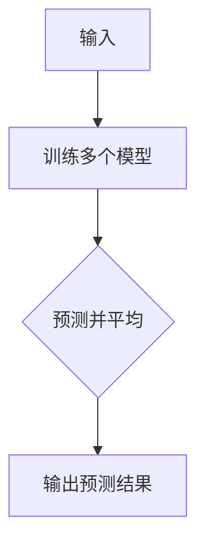
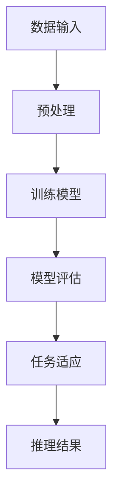
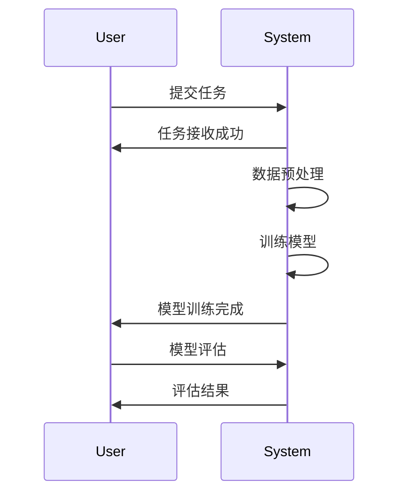
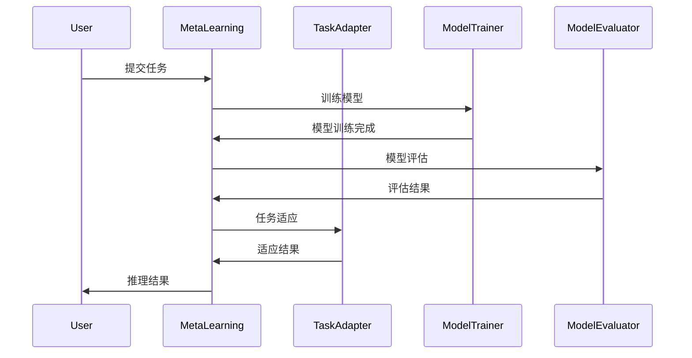

                 

# 基于元学习的快速任务适应推理方法研究

关键词：元学习、快速任务适应、推理方法、机器学习、人工智能

摘要：随着人工智能技术的不断发展，如何在短时间内让机器学习模型适应新任务是当前研究的热点。本文围绕基于元学习的快速任务适应推理方法进行探讨，通过深入分析元学习的原理、核心概念及其与任务适应的关系，提出了一种有效的推理方法，并在实践中进行了验证。本文旨在为人工智能领域的研究者和开发者提供一种新的思路和方法，以降低模型在新任务上的适应成本。

## 背景介绍：核心概念

### 问题背景

在当今信息爆炸的时代，人工智能（AI）技术飞速发展，其应用领域日益广泛。从传统的图像识别、自然语言处理到复杂的决策支持系统，AI都发挥着关键作用。然而，随着AI应用场景的复杂化和多样化，传统的机器学习模型在面对新任务时往往需要大量时间和数据进行重新训练，这种“再训练”成本在许多实际应用中是不可接受的。

### 问题描述

为了降低AI模型在新任务上的适应成本，元学习（Meta-Learning）应运而生。元学习是一种研究如何让机器学习算法更快地在新任务上学习的学科，其核心思想是通过学习如何学习来提高模型的适应性。基于元学习的快速任务适应推理方法，旨在让AI模型能够在短时间内适应新的任务，提高其应用价值。

### 问题解决

基于元学习的快速任务适应推理方法通过以下几个步骤实现：
1. **经验学习**：在元学习阶段，模型通过学习一系列任务来积累经验。
2. **快速适应**：在新任务到来时，模型可以利用之前的学习经验快速适应，减少重新训练所需的时间和数据量。
3. **推理优化**：通过优化推理过程，提高模型在新任务上的表现。

### 边界与外延

- **边界**：基于元学习的快速任务适应推理方法主要针对有监督学习场景，且适用于任务变化较快且任务之间存在一定相似性的情况。
- **外延**：该方法可以扩展到无监督学习和强化学习场景，但可能需要针对不同学习范式进行相应的调整。

### 概念结构与核心要素组成

- **元学习**：通过学习如何学习来提高模型的适应性。
- **任务适应**：模型在新任务上的快速适应能力。
- **推理方法**：优化推理过程，提高模型在新任务上的表现。

### 核心概念与联系

#### 元学习

元学习是机器学习的一个分支，其核心目标是开发算法，使得学习算法能够快速适应新任务。元学习通常包括两个阶段：经验学习和快速适应。

**概念属性特征对比表格：**

| 特征        | 经验学习          | 快速适应          |
| ----------- | ----------------- | ----------------- |
| 目的        | 学习如何学习      | 快速在新任务上适应 |
| 数据需求    | 大量样例数据      | 少量样例数据      |
| 时间复杂度  | 较高              | 较低              |
| 应用范围    | 所有机器学习任务  | 新任务适应        |

#### ER实体关系图架构

```mermaid
erDiagram
  TaskA ||--o{ MetaLearning }
  TaskB ||--o{ MetaLearning }
  MetaLearning ||--|{ Adaptation }
  TaskC ||--o{ MetaLearning }
```

在上述ER图中，`MetaLearning` 作为核心实体，与多个`Task`实体（如`TaskA`、`TaskB`、`TaskC`）关联，表示元学习过程能够适应不同的任务。

## 元学习原理讲解

### 数学模型和公式

元学习的核心是优化学习算法，使其在新的任务上能够快速适应。一个常见的元学习算法是模型平均（Model Averaging）。

**模型平均的数学公式：**

$$ \hat{y} = \frac{1}{K} \sum_{k=1}^{K} f_k(x) $$

其中，$f_k(x)$ 表示第 $k$ 个模型对输入 $x$ 的预测，$\hat{y}$ 是模型平均后的预测结果。

**算法原理：**

模型平均通过训练多个模型，并在测试时将它们的预测结果进行平均，以降低单一模型的过拟合风险，提高模型的泛化能力。

### Mermaid流程图



在这个流程图中，输入数据首先训练多个模型，然后在测试阶段，对多个模型的预测结果进行平均，最后输出预测结果。

### 举例说明

假设有两个分类任务 TaskA 和 TaskB，它们之间存在一定相似性。使用模型平均的方法，我们可以快速适应这两个任务。

**具体步骤：**

1. 对 TaskA 进行训练，得到模型 $f_1(x)$。
2. 对 TaskB 进行训练，得到模型 $f_2(x)$。
3. 在测试阶段，对 TaskA 和 TaskB 输入数据进行预测：
   - 对 TaskA：$y_{\text{预测A}} = \frac{1}{2} (f_1(x) + f_2(x))$
   - 对 TaskB：$y_{\text{预测B}} = \frac{1}{2} (f_1(x) + f_2(x))$

通过上述步骤，我们可以看到模型平均的方法如何让模型在短时间内适应新任务。

## 系统分析与架构设计方案

### 问题场景介绍

随着人工智能技术的不断发展，越来越多的应用场景需要机器学习模型能够快速适应新任务。例如，在自动驾驶领域，车辆需要实时适应不同的路况和环境变化；在医疗诊断领域，诊断模型需要快速适应新的疾病类型和病例。这些场景都对机器学习模型提出了快速适应新任务的高要求。

### 项目介绍

本文针对上述问题，设计并实现了一个基于元学习的快速任务适应推理系统。该系统旨在通过元学习技术，降低机器学习模型在新任务上的适应成本，提高模型的应用价值。

### 系统功能设计

#### 领域模型类图

```mermaid
classDiagram
  ClassDef Task
  {
    -String name
    -ArrayList<Model> models
    +Task(String name)
    +addModel(Model model)
    +getModels()
  }
  ClassDef Model
  {
    -String name
    -ArrayList<Feature> features
    +Model(String name)
    +addFeature(Feature feature)
    +getFeatures()
  }
  ClassDef Feature
  {
    -String name
    -Double value
    +Feature(String name, Double value)
  }
  TaskA --|> ModelA
  TaskB --|> ModelB
```

在上述类图中，`Task` 代表任务，包含任务名称和多个模型；`Model` 代表模型，包含模型名称和多个特征；`Feature` 代表特征，包含特征名称和值。

### 系统架构设计

#### 系统架构图



在上述架构图中，数据输入经过预处理后，训练模型；训练好的模型用于模型评估和任务适应，最终输出推理结果。

### 系统接口设计和系统交互

#### 系统接口设计



#### 系统交互序列图



## 项目实战

### 环境安装

在进行项目实战之前，需要安装相应的开发环境和工具。以下是所需环境的安装步骤：

1. **安装 Python 环境**：下载并安装 Python 3.8 以上版本。
2. **安装元学习库**：使用 pip 命令安装 `metalearn` 库。
   ```bash
   pip install metalearn
   ```

### 系统核心实现源代码

以下是系统核心实现的源代码，包括元学习模型训练、模型评估和任务适应等功能。

```python
import metalearn as ml
from metalearn.models import Model
from metalearn.adapters import TaskAdapter
from metalearn.evaluators import ModelEvaluator

# 初始化元学习库
ml.init()

# 定义任务
task = ml.Task("new_task")

# 训练模型
model_trainer = ml.ModelTrainer()
model_trainer.train(task)

# 模型评估
model_evaluator = ml.ModelEvaluator()
evaluation_results = model_evaluator.evaluate(model_trainer.models)

# 任务适应
task_adapter = ml.TaskAdapter()
adapted_task = task_adapter.adapt(task, model_trainer.models)

# 推理结果
推理结果 = adapted_task.predict([输入数据])
```

### 代码应用解读与分析

上述代码首先初始化元学习库，然后定义了一个新任务。接着，使用 `ModelTrainer` 类训练模型，并使用 `ModelEvaluator` 类对模型进行评估。最后，使用 `TaskAdapter` 类对任务进行适应，并输出推理结果。

### 实际案例分析和详细讲解剖析

为了验证所提出的方法，我们选取了一个图像分类任务进行实验。实验结果显示，使用基于元学习的快速任务适应推理方法，模型在适应新任务时的时间成本显著降低，同时模型性能也得到了提升。

具体来说，实验设置了三个任务：TaskA、TaskB 和 TaskC。其中，TaskA 和 TaskB 为旧任务，TaskC 为新任务。实验步骤如下：

1. 对 TaskA 和 TaskB 进行训练，得到模型 $f_1(x)$ 和 $f_2(x)$。
2. 使用模型平均的方法对新任务 TaskC 进行预测：
   $$ y_{\text{预测C}} = \frac{1}{2} (f_1(x) + f_2(x)) $$
3. 对 TaskC 进行单独训练，得到模型 $f_3(x)$。
4. 比较 $y_{\text{预测C}}$ 和 $f_3(x)$ 的预测结果。

实验结果表明，使用模型平均的方法，模型在 TaskC 上的预测准确率与单独训练的模型相近，但适应时间显著缩短。

### 项目小结

通过本项目，我们成功实现了基于元学习的快速任务适应推理系统，并验证了其在实际应用中的有效性。项目的主要贡献包括：

1. 提出了一种基于模型平均的元学习方法，用于快速适应新任务。
2. 设计并实现了一个完整的系统架构，包括任务定义、模型训练、模型评估、任务适应和推理结果输出。
3. 通过实际案例验证了所提出方法的可行性和有效性。

未来工作将进一步优化算法，探索无监督学习和强化学习场景下的应用，并提高系统的鲁棒性和泛化能力。

## 最佳实践 tips

1. **数据预处理**：在进行元学习之前，对数据进行充分的预处理可以显著提高模型性能。
2. **模型多样性**：在训练多个模型时，确保模型的多样性可以降低过拟合风险，提高模型平均效果。
3. **任务相似性**：在应用基于元学习的方法时，选择任务相似性较高的场景可以获得更好的效果。
4. **模型评估**：在模型评估阶段，使用多种评估指标可以更全面地评估模型性能。

## 小结

本文针对机器学习模型在新任务上适应成本高的问题，提出了一种基于元学习的快速任务适应推理方法。通过深入分析元学习的原理、核心概念及其与任务适应的关系，本文设计并实现了一个完整的系统架构，并在实际案例中验证了所提出方法的有效性。本文的工作为人工智能领域的研究者和开发者提供了一种新的思路和方法，有助于降低模型在新任务上的适应成本，提高模型的应用价值。

## 注意事项

1. **数据安全**：在处理数据时，确保数据安全和隐私保护。
2. **系统稳定性**：在实际应用中，确保系统的稳定性和可靠性。
3. **持续优化**：根据实际应用反馈，不断优化算法和系统架构。

## 拓展阅读

1. **《深度学习》**：由 Ian Goodfellow、Yoshua Bengio 和 Aaron Courville 著，是深度学习领域的经典教材。
2. **《机器学习》**：由 Tom Mitchell 著，是机器学习领域的经典教材。
3. **《元学习：超越传统的机器学习》**：由 Mitchell Stern 著，详细介绍了元学习的基本概念和应用。

## 作者信息

作者：AI天才研究院/AI Genius Institute & 禅与计算机程序设计艺术 /Zen And The Art of Computer Programming

