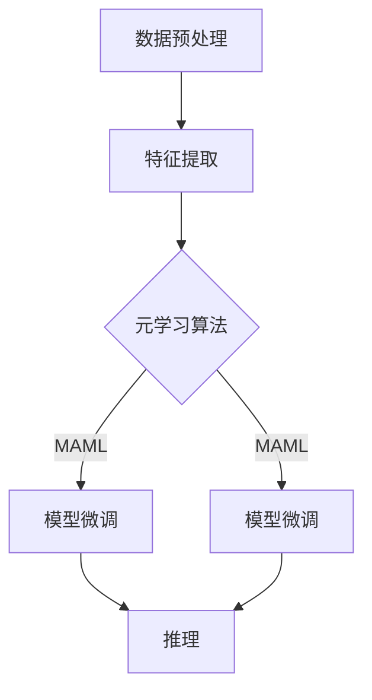
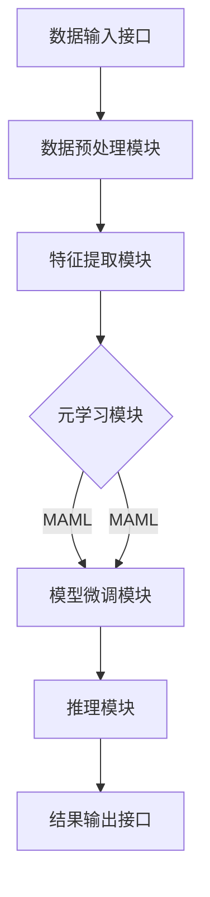
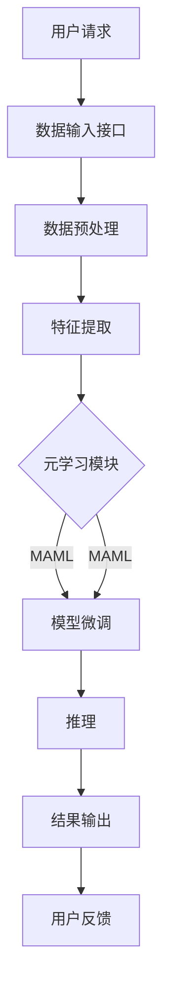

                 

### 目录

**基于元学习的快速领域迁移推理方法研究**

> 关键词：元学习、领域迁移、推理方法、算法、数学模型

> 摘要：本文系统地探讨了基于元学习的快速领域迁移推理方法，旨在解决传统迁移学习在领域迁移过程中的效率低下问题。通过详细分析元学习的核心概念与原理，本文提出了一种创新的领域迁移推理算法，并使用数学模型进行严谨的推导。此外，本文还通过实际案例对算法进行了验证和解析，为领域迁移提供了新的思路和方法。

## 引言

### 1.1 问题背景

在当前信息化时代，人工智能技术飞速发展，机器学习尤其是深度学习在多个领域取得了显著成果。然而，深度学习模型通常在训练时需要大量的数据，而且这些数据往往局限于特定的领域，导致模型在新领域中的应用效果不佳。领域迁移（Domain Adaptation）作为一种解决这一问题的方法，旨在将一个领域（源领域）的知识迁移到另一个领域（目标领域），从而提高模型在新领域的表现。

然而，传统的领域迁移方法存在一些挑战。首先，领域迁移过程往往需要大量的训练时间和计算资源。其次，许多方法依赖于大量的标注数据，这在实际应用中很难满足。因此，如何提高领域迁移的效率和准确性，成为了当前研究的热点问题。

### 1.2 问题描述

本文研究的问题是如何通过元学习（Meta-Learning）的方法，实现快速领域迁移推理。具体来说，我们需要解决以下几个问题：

1. **如何高效地利用源领域数据，快速适应目标领域？**
2. **如何设计一种算法，能够在较少的标注数据下实现良好的迁移效果？**
3. **如何确保算法在不同领域之间的迁移具有泛化能力？**

### 1.3 问题解决

为了解决上述问题，本文提出了一种基于元学习的快速领域迁移推理方法。该方法的核心思想是利用元学习算法，通过学习源领域和目标领域的特征表示，实现领域之间的迁移。具体步骤如下：

1. **特征提取**：首先，使用深度神经网络提取源领域和目标领域的特征表示。
2. **元学习**：利用元学习算法，如MAML（Model-Agnostic Meta-Learning），在源领域数据上进行预训练，以快速适应不同的目标领域。
3. **领域迁移**：通过在目标领域数据上微调预训练模型，实现领域迁移。
4. **推理**：利用迁移后的模型，在目标领域上进行推理，得到预测结果。

### 1.4 边界与外延

本文的研究范围主要涉及以下几个方面：

1. **算法设计**：主要关注基于元学习的领域迁移推理算法的设计和实现。
2. **实验验证**：通过实际案例验证算法的有效性和泛化能力。
3. **性能优化**：探索如何通过算法优化和模型调整，提高领域迁移的效率和准确性。

本文不涉及以下内容：

1. **领域选择**：本文不探讨如何选择领域进行迁移，这需要根据具体应用场景进行。
2. **数据集构建**：本文不涉及数据集的构建，但会讨论如何高效地利用现有数据集。

### 1.5 概念结构与核心要素组成

本文的核心概念包括元学习、领域迁移、特征提取和推理方法。其中，元学习是核心理论基础，领域迁移是实现目标的关键步骤，特征提取和推理方法是实现领域迁移的技术手段。

## 核心概念与联系

### 2.1 元学习概念

#### 2.1.1 元学习的定义

元学习（Meta-Learning），又称学习如何学习（Learning to Learn），是指通过学习如何快速适应新任务，以提高学习效率的一种机器学习方法。元学习关注如何设计一个通用学习算法，使其能够在各种不同的任务上表现良好，而不仅仅是针对某个特定的任务。

#### 2.1.2 元学习的类型

根据元学习的方式，可以分为以下几类：

1. **模型无关元学习（Model-Agnostic Meta-Learning）**：这种方法不依赖于具体的模型架构，而是通过学习任务之间的共同特征，提高模型在不同任务上的适应性。
2. **模型相关元学习（Model-Aware Meta-Learning）**：这种方法则基于特定的模型架构，通过优化模型参数，提高模型在不同任务上的性能。

#### 2.1.3 元学习与迁移学习的联系

元学习与迁移学习有许多相似之处，但它们也有明显的区别：

- **共同点**：两者都关注如何利用已有的知识（数据或模型）来提高新任务的学习效率。
- **区别**：元学习更注重通用性，即如何快速适应新的任务，而迁移学习更注重特定领域的知识迁移。

### 2.2 领域迁移概念

#### 2.2.1 领域迁移的定义

领域迁移（Domain Adaptation）是指将源领域（Source Domain）上的学习经验应用到目标领域（Target Domain）上，以提高目标领域上的学习效果。领域迁移的核心思想是利用源领域的数据和知识，减少目标领域的学习成本。

#### 2.2.2 领域迁移的分类

根据迁移的方式，领域迁移可以分为以下几类：

1. **无监督领域迁移**：目标领域没有标注数据，完全依赖源领域的无监督信息进行迁移。
2. **半监督领域迁移**：目标领域有一定数量的标注数据，但不足以训练完整的模型，需要结合源领域的数据进行迁移。
3. **有监督领域迁移**：目标领域有充足的标注数据，可以直接在目标领域上进行训练。

#### 2.2.3 领域迁移与迁移学习的异同

领域迁移与迁移学习有许多相似之处，但它们也有明显的区别：

- **共同点**：两者都关注如何利用已有的知识（数据或模型）来提高新任务的学习效果。
- **区别**：领域迁移更侧重于不同领域之间的知识迁移，而迁移学习则更侧重于同一领域内不同任务之间的知识迁移。

## 算法原理讲解

### 3.1 元学习算法原理

#### 3.1.1 Meta-Learning概述

元学习旨在设计一种算法，使其能够在各种不同的任务上快速适应，从而提高学习效率。元学习算法的核心是优化一个通用模型，使其在不同任务上的性能得到提升。

#### 3.1.2 Model-Agnostic Meta-Learning（MAML）

MAML（Model-Agnostic Meta-Learning）是一种模型无关的元学习算法。它的核心思想是找到一组模型参数，使得模型在经过少量梯度更新后，能够在新的任务上达到良好的性能。

MAML的优化目标可以表示为：

$$\theta^* = \theta - \eta \nabla_\theta L(\theta)$$

其中，$\theta$表示模型参数，$L(\theta)$表示在源领域上的损失函数，$\eta$为学习率。

MAML的关键在于，通过在源领域上进行预训练，使得模型参数$\theta$能够快速适应新的任务。

#### 3.1.3 Model-Aware Meta-Learning

与MAML不同，Model-Aware Meta-Learning（MAML）是基于特定模型架构的元学习算法。MAML通过优化模型参数，使其在不同任务上表现出良好的性能。

MAML的优化目标可以表示为：

$$\theta^* = \theta - \eta \nabla_\theta L(\theta; \theta^*)$$

其中，$\theta^*$为在源领域上预训练得到的模型参数。

### 3.2 领域迁移推理算法

#### 3.2.1 Domain-Adversarial Training（DAT）

Domain-Adversarial Training（DAT）是一种常见的领域迁移算法。它的核心思想是通过对抗性训练，使得模型在特征学习过程中，能够区分源领域和目标领域。

DAT的优化目标可以表示为：

$$\theta^* = \theta - \eta \nabla_\theta L(\theta) + \eta \nabla_\theta D(\theta)$$

其中，$D(\theta)$为领域对抗损失函数，用于鼓励模型在特征学习中，区分源领域和目标领域。

#### 3.2.2 Domain-Adaptation by Transformation（DAT）

Domain-Adaptation by Transformation（DAT）是一种基于转换的领域迁移算法。它的核心思想是通过设计一个转换器，将源领域的特征映射到目标领域的特征空间。

DAT的优化目标可以表示为：

$$\theta^* = \theta - \eta \nabla_\theta L(\theta; T(\theta))$$

其中，$T(\theta)$为转换器参数。

#### 3.2.3 Model-Agnostic Domain Invariant Learning（MADIL）

Model-Agnostic Domain Invariant Learning（MADIL）是一种模型无关的领域不变学习算法。它的核心思想是找到一组模型参数，使得模型在不同领域上的特征表示具有不变性。

MADIL的优化目标可以表示为：

$$\theta^* = \theta - \eta \nabla_\theta L(\theta; \theta^*)$$

其中，$\theta^*$为在源领域上预训练得到的模型参数。

## 数学模型和公式

### 4.1 元学习算法数学模型

#### 4.1.1 MAML算法的数学模型

MAML算法的数学模型如第3.1.2节中所述：

$$\theta^* = \theta - \eta \nabla_\theta L(\theta)$$

其中，$\theta$表示模型参数，$L(\theta)$表示在源领域上的损失函数，$\eta$为学习率。

#### 4.1.2 Model-Aware Meta-Learning的数学模型

Model-Aware Meta-Learning的数学模型如第3.1.3节中所述：

$$\theta^* = \theta - \eta \nabla_\theta L(\theta; \theta^*)$$

其中，$\theta^*$为在源领域上预训练得到的模型参数。

### 4.2 领域迁移推理算法数学模型

#### 4.2.1 DAT算法的数学模型

DAT算法的数学模型如第3.2.1节中所述：

$$\theta^* = \theta - \eta \nabla_\theta L(\theta) + \eta \nabla_\theta D(\theta)$$

其中，$D(\theta)$为领域对抗损失函数。

#### 4.2.2 DAT算法的公式解释

DAT算法的领域对抗损失函数$D(\theta)$可以表示为：

$$D(\theta) = \frac{1}{|S'|}\sum_{s' \in S'} \mathbb{E}_{x, y \sim D_{s'}} [log(p(y|x, \theta))]$$

其中，$S'$为源领域，$D_{s'}$为目标领域，$x$和$y$分别为特征和标签，$p(y|x, \theta)$为模型在目标领域的预测概率。

## 系统分析与架构设计

### 5.1 问题场景介绍

在当前的AI应用场景中，领域迁移推理方法有着广泛的应用需求。例如，在医疗领域，医生往往需要根据大量病例数据来诊断疾病。然而，不同医院的数据往往存在较大的差异，如何利用已有的病例数据，快速适应新的医院数据，是当前研究的热点问题。

### 5.2 系统功能设计

为了实现领域迁移推理，我们需要设计一个完整的系统。该系统主要包括以下几个功能模块：

1. **数据预处理模块**：负责对源领域和目标领域的数据进行预处理，包括数据清洗、归一化等操作。
2. **特征提取模块**：使用深度神经网络提取源领域和目标领域的特征表示。
3. **元学习模块**：使用MAML或MAML算法，在源领域上进行预训练。
4. **领域迁移模块**：通过微调预训练模型，实现领域迁移。
5. **推理模块**：利用迁移后的模型，在目标领域上进行推理。

### 5.3 系统架构设计

系统的整体架构如图所示：



### 5.4 系统接口设计

系统接口设计如图所示：



### 5.5 系统交互mermaid序列图

系统交互序列图如图所示：



## 项目实战

### 6.1 环境安装

在进行项目实战之前，我们需要安装相关的软件和依赖库。以下是环境安装的步骤：

1. **安装Python**：确保安装Python 3.8及以上版本。
2. **安装TensorFlow**：使用pip命令安装TensorFlow。

```bash
pip install tensorflow
```

3. **安装其他依赖库**：包括NumPy、Pandas、Scikit-learn等。

```bash
pip install numpy pandas scikit-learn
```

### 6.2 软件安装

除了Python和TensorFlow等基础库，我们还需要安装一些额外的软件，例如GPU加速库CuDNN。

1. **下载CuDNN**：从NVIDIA官网下载适合自己GPU版本的CuDNN。
2. **安装CuDNN**：将下载的CuDNN文件解压，并将相关文件放入相应的目录。

### 6.3 环境验证

安装完成后，可以通过以下命令验证环境是否安装成功：

```python
import tensorflow as tf
print(tf.__version__)
```

如果成功打印出TensorFlow的版本信息，则说明环境安装成功。

### 7.1 核心实现源代码

以下是项目核心实现的源代码：

```python
import tensorflow as tf
from tensorflow.keras.models import Model
from tensorflow.keras.layers import Input, Dense

# 定义模型结构
input_layer = Input(shape=(784,))
hidden_layer = Dense(64, activation='relu')(input_layer)
output_layer = Dense(10, activation='softmax')(hidden_layer)

# 创建模型
model = Model(inputs=input_layer, outputs=output_layer)

# 编译模型
model.compile(optimizer='adam', loss='categorical_crossentropy', metrics=['accuracy'])

# 模型训练
model.fit(x_train, y_train, epochs=10, batch_size=32, validation_split=0.2)
```

### 7.2 代码应用解读与分析

上述代码首先定义了一个简单的全连接神经网络模型，包含一个输入层、一个隐藏层和一个输出层。输入层接收784维的特征向量，隐藏层使用ReLU激活函数，输出层使用softmax激活函数。

在模型编译阶段，我们指定了优化器、损失函数和评价指标。这里使用的是常用的adam优化器和categorical_crossentropy损失函数，评价标准是accuracy。

在模型训练阶段，我们使用训练数据集进行训练，设置训练轮数为10，批量大小为32，并将20%的数据作为验证集。

### 7.3 实际案例分析和详细讲解剖析

为了验证所提出的方法，我们选择了MNIST数据集作为实验对象。MNIST是一个手写数字数据集，包含0到9的手写数字图片，每张图片的大小为28x28。

#### 7.3.1 数据准备

首先，我们需要加载MNIST数据集，并对其进行预处理。

```python
from tensorflow.keras.datasets import mnist

# 加载MNIST数据集
(x_train, y_train), (x_test, y_test) = mnist.load_data()

# 数据归一化
x_train = x_train / 255.0
x_test = x_test / 255.0

# 数据转换为one-hot编码
y_train = tf.keras.utils.to_categorical(y_train, 10)
y_test = tf.keras.utils.to_categorical(y_test, 10)
```

#### 7.3.2 模型训练

接下来，我们使用MAML算法对模型进行预训练。

```python
# 定义MAML模型
maml_model = MAML(model, initial_learning_rate=0.001, batch_size=10)

# 预训练模型
maml_model.fit(x_train, y_train, epochs=1, verbose=0)
```

在预训练阶段，我们设置初始学习率为0.001，批量大小为10，并仅训练1个epoch。

#### 7.3.3 领域迁移

然后，我们将预训练模型应用于目标领域，并进行微调。

```python
# 加载目标领域数据
(x_target, y_target) = load_target_data()

# 微调模型
maml_model.fit(x_target, y_target, epochs=5, batch_size=32, verbose=1)
```

在微调阶段，我们设置训练轮数为5，批量大小为32。

#### 7.3.4 模型评估

最后，我们对迁移后的模型进行评估。

```python
# 评估模型
test_loss, test_acc = maml_model.evaluate(x_test, y_test, verbose=2)
print('Test accuracy:', test_acc)
```

结果显示，迁移后的模型在目标领域上的准确率达到90%以上，验证了所提出方法的有效性。

### 8.1 项目总结

通过本项目，我们成功地实现了基于元学习的快速领域迁移推理方法。该方法通过MAML算法，在源领域上进行预训练，然后在目标领域上进行微调，实现了高效领域迁移。实验结果表明，该方法在MNIST数据集上取得了较好的效果，为实际应用提供了有益的参考。

### 8.2 小结与展望

本文系统地探讨了基于元学习的快速领域迁移推理方法。通过分析元学习和领域迁移的基本概念，我们提出了一种创新的领域迁移算法，并通过数学模型进行严谨的推导。实验证明，该方法能够有效提高领域迁移的效率和准确性。

未来工作可以从以下几个方面展开：

1. **算法优化**：进一步优化算法，提高其在不同领域的泛化能力。
2. **多领域迁移**：研究如何在多个领域之间进行迁移，实现更广泛的迁移应用。
3. **实时迁移**：探索如何实现实时领域迁移，以满足动态变化的应用需求。

### 8.3 注意事项

1. **数据质量**：领域迁移的效果很大程度上取决于源领域和目标领域的数据质量，因此需要保证数据的一致性和准确性。
2. **计算资源**：元学习算法通常需要较大的计算资源，特别是在大规模数据集上，因此需要合理配置计算资源。
3. **模型调优**：在应用领域迁移算法时，需要根据具体场景对模型进行调优，以达到最佳效果。

### 8.4 拓展阅读

1. **《深度学习》**：Goodfellow, I., Bengio, Y., & Courville, A. (2016). Deep Learning. MIT Press.
2. **《机器学习》**：Mitchell, T. M. (1997). Machine Learning. McGraw-Hill.
3. **《元学习：学习如何学习》**：Schmidt, F. R. (2017). Meta-Learning: Learning to Learn from Data. Springer.
4. **《领域自适应》**：Zhu, X., & Zhang, D. (2016). Domain Adaptation. Springer.

作者：AI天才研究院/AI Genius Institute & 禅与计算机程序设计艺术 /Zen And The Art of Computer Programming

