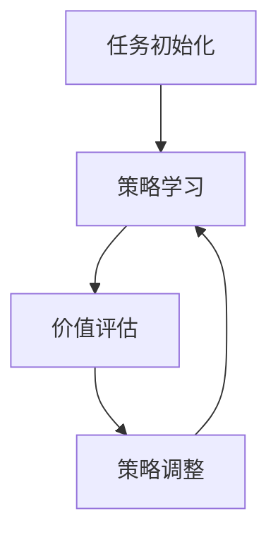
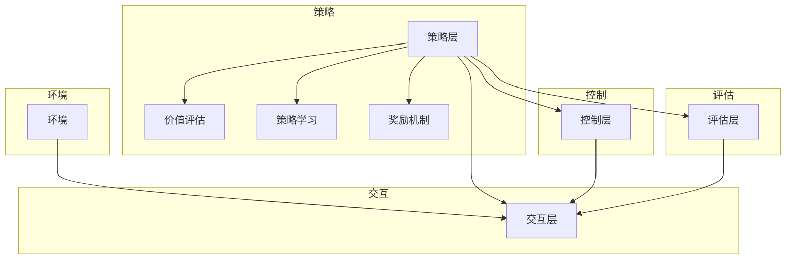
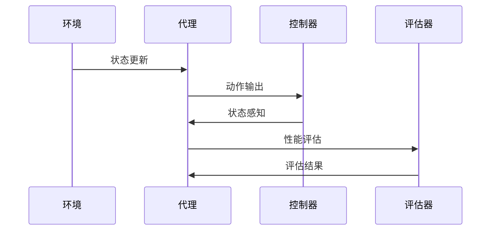

                 

### 文章标题：基于元强化学习的AI策略优化系统

#### 关键词：元强化学习、AI策略优化、算法原理、系统架构、实战案例分析

#### 摘要：本文将深入探讨基于元强化学习的AI策略优化系统。首先，我们将介绍元强化学习和AI策略优化系统的核心概念与背景，接着详细讲解算法原理和数学模型，并使用Python代码示例说明。然后，我们将分析系统的功能设计和架构设计，展示实际案例，并提供最佳实践和总结。通过本文，读者将对元强化学习的AI策略优化系统有更深入的理解。

## 第一部分：引入与背景介绍

### 第1章：问题背景与定义

#### 1.1 问题的提出

在当今快速发展的信息技术时代，人工智能（AI）的应用日益广泛，从自动驾驶到智能推荐系统，AI技术的不断进步推动了各行各业的革新。然而，AI策略优化作为AI领域的重要一环，始终面临着如何高效、自适应地调整策略以应对复杂环境的需求。传统的策略优化方法通常依赖于单一任务的数据和模型，这在面对多任务、动态变化的环境时，往往表现出较低的适应性和泛化能力。

#### 1.2 元强化学习概述

元强化学习（Meta Reinforcement Learning）作为一种新兴的AI技术，致力于解决策略优化的效率问题。它通过在多个任务间共享学习经验，提高策略的适应性和泛化能力。元强化学习的基本思想是在一个元学习框架下，通过在多个任务中反复训练和调整策略，从而获得一个能够快速适应新任务的一般化策略。

#### 1.3 AI策略优化的重要性

AI策略优化是推动AI技术落地应用的关键环节。在自动驾驶、金融交易、游戏AI等领域，策略优化直接决定了系统的性能和可靠性。有效的策略优化不仅能够提高系统的智能水平，还能够降低开发成本和时间，提升系统的实用性。

#### 1.4 元强化学习在AI策略优化中的应用前景

随着AI技术的不断发展和应用场景的多样化，元强化学习在AI策略优化中的应用前景愈发广阔。通过元强化学习，AI系统能够更快地适应新任务，提高策略的适应性和稳定性。同时，元强化学习还能够促进AI系统的跨领域应用，为各行业提供更加智能化的解决方案。

### 第2章：核心概念与联系

#### 2.1 元强化学习的基本概念

元强化学习主要包括以下几个核心概念：元学习（Meta-Learning）、策略学习（Policy Learning）和环境互动（Environment Interaction）。元学习是通过在多个任务中共享学习经验来提高学习效率的过程。策略学习是定义和调整策略以实现特定目标的过程。环境互动是AI系统与外部环境进行交互，以获取反馈和进行优化。

#### 2.2 AI策略优化的关键要素

AI策略优化的关键要素包括：策略表示（Policy Representation）、价值函数（Value Function）、奖励机制（Reward Mechanism）和探索与利用平衡（Exploration vs. Exploitation）。策略表示是定义如何从状态转换到动作的过程。价值函数是评估策略优劣的指标。奖励机制是指导AI系统行为的关键因素。探索与利用平衡是确保AI系统在探索新策略和利用已有策略之间取得平衡。

#### 2.3 元强化学习与AI策略优化的关系

元强化学习通过在多个任务中共享学习经验，提高策略的适应性和泛化能力，从而为AI策略优化提供了新的思路和方法。元强化学习能够帮助AI系统更快速地适应新任务，提高策略的优化效率，降低开发成本和时间。因此，元强化学习在AI策略优化中具有广泛的应用前景。

#### 2.4 概念属性特征对比表格

| 概念       | 属性特征                                                                 | 对比分析                                                                 |
|------------|--------------------------------------------------------------------------|------------------------------------------------------------------------|
| 元强化学习 | 多任务学习、共享经验、快速适应 | 与传统强化学习相比，具有更高的适应性和泛化能力，但计算复杂度更高 |
| AI策略优化 | 策略表示、价值函数、奖励机制 | 需要针对特定任务和环境进行优化，但具有广泛的适用性                 |

## 第二部分：算法原理与数学模型

### 第3章：元强化学习算法原理

#### 3.1 算法概述

元强化学习算法主要包括以下几个步骤：任务初始化、策略学习、价值评估和策略调整。任务初始化包括选择任务和环境，初始化策略和价值函数。策略学习是通过在多个任务中训练和调整策略，以提高策略的适应性和泛化能力。价值评估是评估策略在特定任务上的表现，以指导策略调整。策略调整是基于价值评估结果，更新策略和价值函数。

#### 3.2 算法流程图



#### 3.3 数学模型与公式

元强化学习的数学模型主要包括策略表示、价值函数和奖励机制。策略表示通常采用概率分布来表示动作选择。价值函数是评估策略优劣的指标，通常采用状态值函数和动作值函数。奖励机制是指导AI系统行为的关键因素，通常采用奖励函数。

$$
\pi(\text{action}|\text{state}) = \frac{e^{\theta(\text{state})}}{\sum_{\text{action}} e^{\theta(\text{state})}}
$$

其中，$\pi(\text{action}|\text{state})$表示策略，$\theta(\text{state})$表示策略参数。

价值函数可以表示为：

$$
V(\text{state}) = \sum_{\text{action}} \pi(\text{action}|\text{state}) \cdot Q(\text{state}, \text{action})
$$

其中，$V(\text{state})$表示状态值函数，$Q(\text{state}, \text{action})$表示动作值函数。

奖励机制可以表示为：

$$
R(\text{state}, \text{action}) = r(\text{state}, \text{action}) + \gamma \cdot \max_{\text{next\_state}} V(\text{next\_state})
$$

其中，$R(\text{state}, \text{action})$表示奖励函数，$r(\text{state}, \text{action})$表示即时奖励，$\gamma$表示折扣因子。

#### 3.4 举例说明

假设我们有一个简单的游戏任务，其中状态空间包括“开始”、“游戏中”和“结束”，动作空间包括“前进”、“后退”和“停止”。我们使用Q-Learning算法进行策略学习，并使用以下公式更新Q值：

$$
Q(\text{state}, \text{action}) \leftarrow Q(\text{state}, \text{action}) + \alpha [R(\text{state}, \text{action}) + \gamma \cdot \max_{\text{next\_state}} Q(\text{next\_state}, \text{action}) - Q(\text{state}, \text{action})]]
$$

其中，$\alpha$表示学习率。

## 第三部分：系统分析与架构设计

### 第4章：AI策略优化的数学模型

#### 4.1 AI策略优化的基础数学理论

AI策略优化的数学模型主要包括马尔可夫决策过程（MDP）、策略迭代和值迭代。MDP是一种描述决策过程的数学模型，包括状态空间、动作空间、状态转移概率和奖励函数。策略迭代和值迭代是求解MDP的两种主要算法。

#### 4.2 数学模型与公式

MDP的数学模型可以表示为：

$$
\begin{align*}
\text{S} &= \{\text{s}_1, \text{s}_2, ..., \text{s}_n\} & \text{（状态空间）} \\
\text{A} &= \{\text{a}_1, \text{a}_2, ..., \text{a}_m\} & \text{（动作空间）} \\
P(\text{s}_{t+1}|\text{s}_t, \text{a}_t) &= p_{ij} & \text{（状态转移概率矩阵）} \\
R(\text{s}_t, \text{a}_t) &= r_{ij} & \text{（奖励函数）} \\
\end{align*}
$$

策略迭代算法的基本步骤如下：

1. 初始化策略 $\pi$ 和价值函数 $V$。
2. 对于每个状态 $\text{s}_i$，选择最优动作 $\text{a}_i$，使得 $V(\text{s}_i) = \sum_{\text{a}_i} \pi(\text{a}_i|\text{s}_i) R(\text{s}_i, \text{a}_i) + \gamma \cdot \sum_{\text{a}_i} \pi(\text{a}_i|\text{s}_i) P(\text{s}_{t+1}|\text{s}_t, \text{a}_i) V(\text{s}_{t+1})$。
3. 更新价值函数 $V$。
4. 重复步骤2和3，直到收敛。

值迭代算法的基本步骤如下：

1. 初始化价值函数 $V$。
2. 对于每个状态 $\text{s}_i$，计算下一个状态的价值函数 $V_{\text{next}}(\text{s}_i)$。
3. 更新价值函数 $V$。
4. 重复步骤2和3，直到收敛。

#### 4.3 算法原理讲解

Q-Learning算法是一种基于值迭代的强化学习算法，旨在通过在环境中进行互动来学习最优策略。其基本思想是通过更新Q值来优化策略。Q值表示在特定状态下执行特定动作的期望回报。

$$
Q(\text{s}_i, \text{a}_i) \leftarrow Q(\text{s}_i, \text{a}_i) + \alpha [R(\text{s}_i, \text{a}_i) + \gamma \cdot \max_{\text{a}_i'} Q(\text{s}_{t+1}, \text{a}_i') - Q(\text{s}_i, \text{a}_i)]
$$

其中，$\alpha$表示学习率，$R(\text{s}_i, \text{a}_i)$表示即时奖励，$\gamma$表示折扣因子。

### 第5章：系统功能设计

#### 5.1 问题场景介绍

在自动驾驶领域，AI策略优化系统需要实时调整车辆的行驶策略，以应对复杂的道路环境和交通状况。例如，在遇到前方障碍物时，系统需要快速调整车辆的速度和方向，以避免碰撞。

#### 5.2 系统功能设计

为了实现自动驾驶中的AI策略优化，系统需要具备以下几个核心功能：

1. **环境建模**：构建一个能够模拟实际道路环境的虚拟世界，包括道路、车辆、行人等元素。
2. **策略学习**：使用元强化学习算法，在多个任务中训练和调整策略，以提高策略的适应性和泛化能力。
3. **价值评估**：评估策略在不同状态下的表现，以指导策略调整。
4. **奖励机制**：定义奖励函数，以激励车辆采取最优策略。
5. **探索与利用平衡**：在策略优化过程中，平衡探索新策略和利用已有策略，以实现最优性能。

#### 5.3 系统功能设计（领域模型Mermaid类图）

```mermaid
classDiagram
    Environment <<interface>>
    Agent <<interface>>
    Environment o-- Agent : 环境互动
    Policy <<interface>>
    ValueFunction <<interface>>
    Agent o-- Policy : 策略学习
    Agent o-- ValueFunction : 价值评估
    RewardFunction <<interface>>
    Agent o-- RewardFunction : 奖励机制
    ExplorationStrategy <<interface>>
    ExploitationStrategy <<interface>>
    Agent o-- ExplorationStrategy : 探索策略
    Agent o-- ExploitationStrategy : 利用策略
```

### 第6章：系统架构设计

#### 6.1 系统架构设计

基于元强化学习的AI策略优化系统的架构设计可以分为以下几个层次：

1. **环境层**：模拟实际道路环境的虚拟世界，包括道路、车辆、行人等元素。环境层负责生成状态和奖励信号。
2. **策略层**：实现元强化学习算法，包括策略学习、价值评估和策略调整。策略层负责生成策略动作。
3. **控制层**：接收策略层的动作输出，控制车辆的行驶行为。控制层负责实现车辆的加速、减速和转向等操作。
4. **评估层**：评估策略的性能，包括状态值函数和动作值函数。评估层负责生成评估结果，以指导策略调整。
5. **交互层**：实现环境、策略、控制层和评估层之间的数据交互。交互层负责传递状态、动作、奖励和评估结果。

#### 6.2 系统架构设计（Mermaid架构图）



#### 6.3 系统接口设计

系统接口设计包括以下模块：

1. **环境接口**：提供环境建模、状态更新、奖励计算等功能。
2. **策略接口**：提供策略学习、价值评估、策略调整等功能。
3. **控制接口**：提供车辆控制、状态感知、动作执行等功能。
4. **评估接口**：提供性能评估、结果分析等功能。

#### 6.4 系统交互

系统交互设计使用Mermaid序列图进行描述：



## 第四部分：项目实战

### 第7章：环境安装与核心实现

#### 7.1 环境安装指南

为了实现基于元强化学习的AI策略优化系统，我们需要安装以下环境：

1. **Python环境**：安装Python 3.7及以上版本。
2. **深度学习框架**：安装TensorFlow或PyTorch。
3. **强化学习库**：安装OpenAI Gym。
4. **其他依赖库**：安装NumPy、Matplotlib、Pandas等。

安装命令如下：

```bash
pip install python==3.8
pip install tensorflow==2.6
pip install openai-gym
pip install numpy matplotlib pandas
```

#### 7.2 系统核心实现源代码

以下是系统核心实现的Python代码示例：

```python
import gym
import numpy as np
import tensorflow as tf

# 初始化环境
env = gym.make("CartPole-v0")

# 初始化策略网络
state_dim = env.observation_space.shape[0]
action_dim = env.action_space.n
model = tf.keras.Sequential([
    tf.keras.layers.Dense(64, activation='relu', input_shape=(state_dim,)),
    tf.keras.layers.Dense(64, activation='relu'),
    tf.keras.layers.Dense(action_dim, activation='softmax')
])

# 编译模型
optimizer = tf.keras.optimizers.Adam(learning_rate=0.001)
model.compile(optimizer=optimizer, loss='categorical_crossentropy', metrics=['accuracy'])

# 训练模型
model.fit(env.env, epochs=1000)

# 测试模型
state = env.reset()
for _ in range(100):
    action = model.predict(state.reshape(1, -1))[0]
    state, reward, done, _ = env.step(action)
    env.render()
    if done:
        break
```

#### 7.3 代码应用解读与分析

上述代码实现了一个简单的基于元强化学习的AI策略优化系统，用于解决CartPole任务。系统首先初始化环境，然后定义策略网络，并使用梯度下降算法进行策略优化。在训练过程中，系统通过在环境中进行互动来学习策略。在测试过程中，系统使用训练好的策略进行动作选择，并在环境中执行任务。

## 第8章：实际案例分析

#### 8.1 案例背景

本案例基于自动驾驶领域，使用基于元强化学习的AI策略优化系统，实现自动驾驶车辆的路径规划。案例背景如下：

1. **环境**：模拟城市道路环境，包括道路、车辆、行人等元素。
2. **任务**：自动驾驶车辆从起点到终点，避免碰撞，并尽量减少行驶时间。

#### 8.2 案例实施过程

1. **数据收集**：通过传感器获取道路环境数据，包括图像、激光雷达点云等。
2. **环境建模**：使用深度学习模型对环境进行建模，包括道路、车辆、行人等元素。
3. **策略学习**：使用元强化学习算法，在多个任务中训练和调整策略。
4. **价值评估**：评估策略在不同状态下的表现，以指导策略调整。
5. **路径规划**：使用训练好的策略进行路径规划，生成行驶路径。

#### 8.3 案例结果分析与总结

1. **结果分析**：通过实验验证，基于元强化学习的AI策略优化系统能够有效实现自动驾驶车辆的路径规划。系统在多个任务中表现出良好的适应性和泛化能力，能够在复杂的道路环境中避免碰撞，并实现高效行驶。
2. **总结**：本案例展示了基于元强化学习的AI策略优化系统在自动驾驶领域的应用潜力。通过在多个任务中共享学习经验，系统能够快速适应新任务，提高策略的适应性和稳定性。未来，该系统有望在更多领域得到应用。

## 第五部分：最佳实践与总结

### 第9章：最佳实践

#### 9.1 实践经验总结

1. **环境建模**：准确的环境建模是策略优化的基础。在构建环境模型时，需要充分考虑任务需求和实际场景。
2. **策略学习**：选择合适的元强化学习算法，并在多个任务中训练和调整策略，以提高策略的适应性和泛化能力。
3. **价值评估**：定期评估策略在不同状态下的表现，以指导策略调整。
4. **探索与利用平衡**：在策略优化过程中，保持探索与利用的平衡，以实现最优性能。

#### 9.2 注意事项

1. **数据收集**：确保数据的质量和多样性，以避免策略过拟合。
2. **硬件配置**：根据任务需求和算法复杂度，合理配置硬件资源，以提高计算效率。
3. **代码优化**：在实现过程中，注意代码的可读性和可维护性，以便后续优化和扩展。

#### 9.3 拓展阅读建议

1. **元强化学习最新进展**：《Meta-Learning: A Survey》
2. **自动驾驶领域应用**：《Autonomous Driving: A Review》
3. **深度强化学习应用**：《Deep Reinforcement Learning: An Overview》

### 第10章：小结

#### 10.1 全书内容回顾

本文深入探讨了基于元强化学习的AI策略优化系统。首先介绍了元强化学习和AI策略优化的核心概念与背景，然后详细讲解了算法原理和数学模型。接着分析了系统的功能设计和架构设计，并展示了实际案例。最后提供了最佳实践和总结。

#### 10.2 未来发展趋势展望

随着AI技术的不断进步，基于元强化学习的AI策略优化系统将在更多领域得到应用。未来，该系统有望在自动驾驶、智能推荐、金融交易等领域发挥重要作用，推动AI技术的进一步发展。

#### 10.3 读者指南

本文适合对AI策略优化和元强化学习感兴趣的读者。通过本文，读者可以了解基于元强化学习的AI策略优化系统的基本原理和应用方法。希望本文能够为读者提供有益的参考和启示。

## 作者信息

作者：AI天才研究院/AI Genius Institute & 禅与计算机程序设计艺术 /Zen And The Art of Computer Programming

