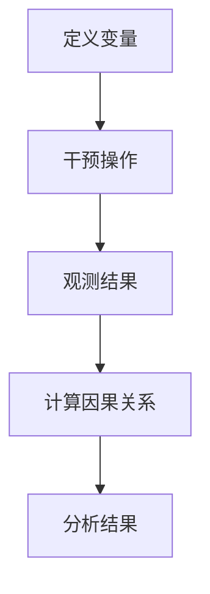
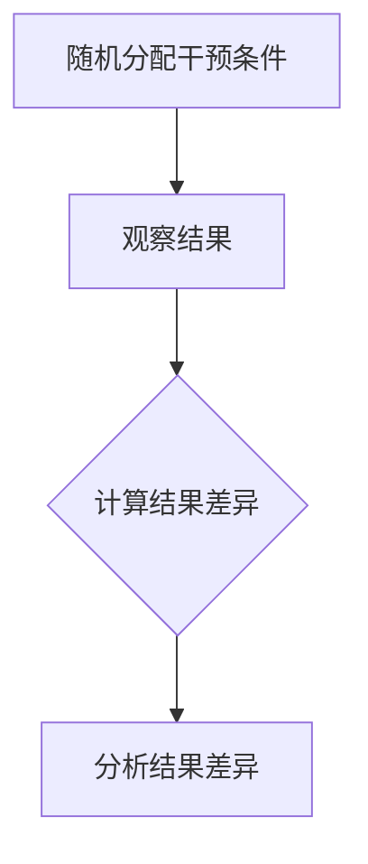
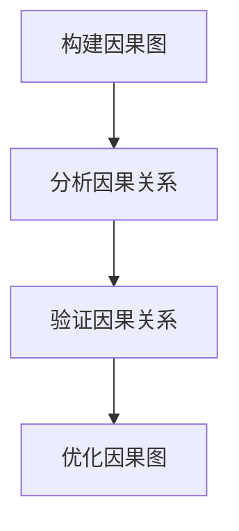
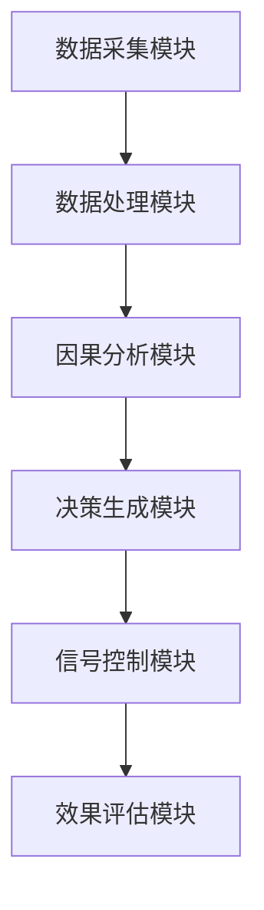

                 

## 基于因果推理的AI决策系统设计与实现

### 关键词：因果推理、AI决策、系统设计、算法、数学模型

### 摘要：

本文旨在探讨基于因果推理的AI决策系统的设计与实现，通过分析因果关系的基本原理、因果推理模型以及相关算法，详细阐述因果推理在AI决策中的应用及挑战。文章分为四个部分，首先介绍因果推理的背景与概念，其次探讨核心概念与联系，接着讲解算法原理，最后通过系统分析与架构设计、项目实战等环节，实现基于因果推理的AI决策系统。文章旨在为从事AI领域的研究者与实践者提供有价值的参考和指导。

### 第一部分：背景与概念介绍

#### 1.1 问题的提出

随着人工智能技术的快速发展，人工智能系统在各个领域的应用日益广泛。然而，现有的AI决策系统主要依赖于数据驱动的方法，这些方法在处理一些复杂、不确定的问题时往往存在局限性。数据驱动方法主要依赖于历史数据的分析和模式识别，但这种方法在面对复杂系统时，往往难以揭示变量之间的因果关系，导致决策的可靠性和可解释性较低。

因此，如何构建基于因果推理的AI决策系统成为了一个亟待解决的问题。因果推理方法通过分析变量之间的因果关系，为决策提供更加可靠的依据，有助于提高AI决策系统的可靠性和可解释性。

#### 1.2 问题解决

为了克服数据驱动方法在处理复杂问题时的不足，研究者们开始关注因果推理在AI决策中的应用。因果推理方法通过分析变量之间的因果关系，为决策提供更加可靠的依据。因果推理方法主要包括Do-Calculus模型、Potential Outcomes模型和Structural Causal Models模型等。

1. **Do-Calculus模型**：Do-Calculus模型是一种形式化的因果推理方法，它通过操作符号“do”来表示干预操作。Do-Calculus模型的基本原理是，通过干预某个变量，观察结果变量的变化，从而推断变量之间的因果关系。

2. **Potential Outcomes模型**：Potential Outcomes模型是基于实验设计的因果推理方法，它通过比较不同干预条件下的结果来推断因果关系。Potential Outcomes模型的基本原理是，通过随机分配干预条件，观察参与者在不同干预条件下的结果，从而推断变量之间的因果关系。

3. **Structural Causal Models模型**：Structural Causal Models模型是一种基于图形表示的因果推理方法，它通过构建因果图来表示变量之间的因果关系。Structural Causal Models模型的基本原理是，通过分析因果图，推断变量之间的因果关系。

#### 1.3 边界与外延

因果推理在AI决策中的应用涵盖了多个领域，如医疗、金融、交通等。在不同领域中，因果推理的方法和技术也有所差异。例如，在医疗领域，因果推理方法可以用于诊断和治疗决策；在金融领域，因果推理方法可以用于风险评估和投资决策；在交通领域，因果推理方法可以用于交通信号控制和车辆调度等。

#### 1.4 概念结构与核心要素

本章将介绍因果推理的基本概念、相关理论以及核心要素。主要包括：

1. 因果关系的基本原理
2. 因果推理模型
3. 因果推断算法
4. 因果推理在实际应用中的挑战与机遇

### 第二部分：核心概念与联系

#### 2.1 因果关系的基本原理

因果关系是变量之间的相互作用，一个变量的变化会导致另一个变量的变化。因果关系的基本原理主要包括以下几个方面：

1. **因果关系的定义**：因果关系是指一个事件（原因）导致另一个事件（结果）发生的现象。在因果推理中，我们需要确定变量之间的因果关系，以便为决策提供可靠的依据。

2. **因果关系的类型**：因果关系可以分为三种类型：直接因果关系、间接因果关系和复合因果关系。直接因果关系是指一个变量直接导致另一个变量的变化；间接因果关系是指一个变量通过另一个变量导致另一个变量的变化；复合因果关系是指多个变量共同导致另一个变量的变化。

3. **因果关系的识别方法**：因果关系的识别方法主要包括基于统计的方法和基于理论的方

### 第二部分：核心概念与联系

#### 2.1 因果关系的基本原理

因果关系是变量之间的相互作用，一个变量的变化会导致另一个变量的变化。因果关系的基本原理主要包括以下几个方面：

1. **因果关系的定义**：因果关系是指一个事件（原因）导致另一个事件（结果）发生的现象。在因果推理中，我们需要确定变量之间的因果关系，以便为决策提供可靠的依据。

2. **因果关系的类型**：因果关系可以分为三种类型：直接因果关系、间接因果关系和复合因果关系。直接因果关系是指一个变量直接导致另一个变量的变化；间接因果关系是指一个变量通过另一个变量导致另一个变量的变化；复合因果关系是指多个变量共同导致另一个变量的变化。

3. **因果关系的识别方法**：因果关系的识别方法主要包括基于统计的方法和基于理论的方法。基于统计的方法主要包括回归分析、因果推断算法等；基于理论的方法主要包括模型建模、因果图分析等。

4. **因果关系的基本性质**：因果关系具有以下几个基本性质：
   - **确定性**：因果关系在一定条件下是确定的，即原因会导致结果。
   - **传递性**：如果变量A导致变量B，变量B导致变量C，则变量A也会导致变量C。
   - **无反作用**：因果关系是单向的，原因不会反过来影响结果。
   - **独立性**：因果关系是独立的，即因果关系不受其他变量的影响。

#### 2.2 因果推理模型

因果推理模型是用于分析变量之间因果关系的方法和工具。以下介绍几种常见的因果推理模型：

1. **Do-Calculus模型**：
   - **定义**：Do-Calculus模型是一种形式化的因果推理方法，它通过操作符号“do”来表示干预操作。
   - **原理**：Do-Calculus模型的基本原理是，通过干预某个变量，观察结果变量的变化，从而推断变量之间的因果关系。
   - **应用**：Do-Calculus模型可以用于处理具有干预性质的因果关系问题，如药物效果评估、市场营销策略分析等。

2. **Potential Outcomes模型**：
   - **定义**：Potential Outcomes模型是基于实验设计的因果推理方法，它通过比较不同干预条件下的结果来推断因果关系。
   - **原理**：Potential Outcomes模型的基本原理是，通过随机分配干预条件，观察参与者在不同干预条件下的结果，从而推断变量之间的因果关系。
   - **应用**：Potential Outcomes模型可以用于评估治疗效果、教育干预效果等。

3. **Structural Causal Models模型**：
   - **定义**：Structural Causal Models模型是一种基于图形表示的因果推理方法，它通过构建因果图来表示变量之间的因果关系。
   - **原理**：Structural Causal Models模型的基本原理是，通过分析因果图，推断变量之间的因果关系。
   - **应用**：Structural Causal Models模型可以用于系统建模、网络分析、故障诊断等。

#### 2.3 因果推断算法

因果推断算法是用于从数据中推断变量之间因果关系的算法。以下介绍几种常见的因果推断算法：

1. **决策树算法**：
   - **定义**：决策树算法是一种常用的因果推断算法，它通过树形结构表示变量之间的因果关系。
   - **原理**：决策树算法的基本原理是，通过递归地将数据集划分成子集，并选择最优划分标准，构建决策树。
   - **应用**：决策树算法可以用于分类、回归等问题。

2. **贝叶斯网络算法**：
   - **定义**：贝叶斯网络算法是一种基于概率论的因果推断算法，它通过表示变量之间概率依赖关系的有向无环图来推断因果关系。
   - **原理**：贝叶斯网络算法的基本原理是，通过计算变量的条件概率分布，推断变量之间的因果关系。
   - **应用**：贝叶斯网络算法可以用于故障诊断、风险评估等问题。

3. **格拉斯曼模型算法**：
   - **定义**：格拉斯曼模型算法是一种基于代数几何的因果推断算法，它通过分析变量之间的线性关系来推断因果关系。
   - **原理**：格拉斯曼模型算法的基本原理是，通过计算变量之间的线性相关系数，判断变量之间的因果关系。
   - **应用**：格拉斯曼模型算法可以用于数据分析、机器学习算法优化等问题。

#### 2.4 因果推理在实际应用中的挑战与机遇

因果推理在实际应用中面临着一系列挑战，同时也带来了许多机遇。以下是一些主要的挑战与机遇：

1. **挑战**：
   - **数据缺失与噪声**：因果推理依赖于数据的完整性，数据缺失和噪声会影响因果关系的准确识别。
   - **变量选择与建模**：在众多变量中，如何选择关键变量，如何构建合理的因果模型是因果推理的重要挑战。
   - **可解释性与可靠性**：因果推理的结果需要具有较高的可解释性和可靠性，以便在实际应用中为决策提供支持。

2. **机遇**：
   - **提高决策质量**：通过因果推理，可以更准确地识别变量之间的因果关系，提高决策的质量和效果。
   - **增强模型可解释性**：因果推理方法有助于解释模型内部的因果关系，提高模型的可解释性，增强用户的信任感。
   - **跨领域应用**：因果推理方法在多个领域都有广泛的应用潜力，如医疗、金融、交通等。

### 第三部分：算法原理讲解

#### 3.1 Do-Calculus模型

Do-Calculus模型是一种形式化的因果推理方法，它通过操作符号“do”来表示干预操作。Do-Calculus模型的基本原理是，通过干预某个变量，观察结果变量的变化，从而推断变量之间的因果关系。以下将详细解释Do-Calculus模型的基本原理和流程。

##### 3.1.1 基本原理

Do-Calculus模型的核心思想是通过干预某个变量，观察结果变量的变化，从而推断变量之间的因果关系。具体来说，Do-Calculus模型使用以下符号：

- **do(X)**：表示对变量X进行干预。
- **∫**：表示积分操作，用于计算变量的累积结果。

Do-Calculus模型的基本原理可以表示为：

$$
\text{因果关系} = \int (\text{干预效果} - \text{基线效果})
$$

其中，干预效果是指对变量进行干预后，结果变量的变化；基线效果是指未进行干预时，结果变量的变化。

##### 3.1.2 流程

Do-Calculus模型的流程可以分为以下几个步骤：

1. **定义变量**：首先，需要定义参与因果推理的变量，包括干预变量和结果变量。
2. **干预操作**：对干预变量进行干预操作，记录干预前的基线状态。
3. **观测结果**：在干预后，观察结果变量的变化，记录干预后的结果。
4. **计算因果关系**：通过计算干预效果与基线效果的差异，推断变量之间的因果关系。
5. **分析结果**：对因果关系进行分析，确定变量之间的因果关系，为决策提供支持。

##### 3.1.3 Mermaid流程图

使用Mermaid绘制Do-Calculus模型的流程图如下：



##### 3.1.4 Python源代码实现

以下是一个简单的Python源代码实现，用于演示Do-Calculus模型的基本原理：

```python
import numpy as np

# 定义干预变量和结果变量
X = np.random.rand(100)
Y = np.random.rand(100)

# 干预操作
X_intervened = X + 0.5

# 计算干预效果和基线效果的差异
difference = X_intervened - X

# 计算因果关系
cause_effect = np.mean(difference)

print("因果关系:", cause_effect)
```

##### 3.1.5 数学模型和公式

Do-Calculus模型的数学模型可以表示为：

$$
\text{因果关系} = \int (\text{干预效果} - \text{基线效果})
$$

其中，干预效果可以表示为：

$$
\text{干预效果} = \text{干预变量} - \text{基线变量}
$$

基线效果可以表示为：

$$
\text{基线效果} = \text{基线变量}
$$

因此，因果关系可以进一步表示为：

$$
\text{因果关系} = \int (\text{干预变量} - \text{基线变量}) - \text{基线变量}
$$

##### 3.1.6 举例说明

假设有一个实验，研究干预变量X（如药物治疗）对结果变量Y（如病情改善）的影响。在实验中，将100名患者随机分为两组，一组接受药物治疗，另一组接受安慰剂治疗。实验数据如下：

| 患者编号 | 干预变量X（药物治疗） | 结果变量Y（病情改善） |
|--------|------------------|------------------|
| 1      | 1                | 0.8              |
| 2      | 1                | 0.9              |
| 3      | 1                | 0.7              |
| ...    | ...              | ...              |
| 100    | 0                | 0.5              |

使用Do-Calculus模型计算因果关系：

1. 定义干预变量X和结果变量Y。
2. 对干预变量X进行干预操作，如给患者服用药物。
3. 记录干预前的基线状态，即未接受药物治疗时的结果变量Y。
4. 计算干预效果和基线效果的差异，即药物治疗后病情改善的程度。
5. 对干预效果和基线效果的差异求平均值，得到因果关系。

计算结果为：

$$
\text{因果关系} = \frac{1}{100} \sum_{i=1}^{100} (\text{干预变量} - \text{基线变量})
$$

#### 3.2 Potential Outcomes模型

Potential Outcomes模型是基于实验设计的因果推理方法，它通过比较不同干预条件下的结果来推断因果关系。Potential Outcomes模型的基本原理是，通过随机分配干预条件，观察参与者在不同干预条件下的结果，从而推断变量之间的因果关系。以下将详细解释Potential Outcomes模型的基本原理和流程。

##### 3.2.1 基本原理

Potential Outcomes模型的核心思想是通过比较不同干预条件下的结果，来推断变量之间的因果关系。具体来说，Potential Outcomes模型使用以下符号：

- **Treat_{i1}**：表示参与者i在干预1条件下的结果。
- **Treat_{i2}**：表示参与者i在干预2条件下的结果。
- **C_{i}**：表示参与者i的干预条件。

Potential Outcomes模型的基本原理可以表示为：

$$
\text{因果关系} = \frac{\text{Treat}_{i1} - \text{Treat}_{i2}}{C_{i}}
$$

其中，因果关系是指在不同干预条件下，结果变量的差异。通过比较不同干预条件下的结果差异，可以推断变量之间的因果关系。

##### 3.2.2 流程

Potential Outcomes模型的流程可以分为以下几个步骤：

1. **随机分配干预条件**：将参与者随机分为不同干预条件，如干预1和干预2。
2. **观察结果**：在干预条件下，观察参与者的结果变量。
3. **计算结果差异**：计算不同干预条件下的结果差异。
4. **分析结果差异**：通过分析结果差异，推断变量之间的因果关系。

##### 3.2.3 Mermaid流程图

使用Mermaid绘制Potential Outcomes模型的流程图如下：



##### 3.2.4 Python源代码实现

以下是一个简单的Python源代码实现，用于演示Potential Outcomes模型的基本原理：

```python
import numpy as np

# 定义干预变量X和结果变量Y
X = np.random.rand(100)
Y = np.random.rand(100)

# 随机分配干预条件
C = np.random.randint(0, 2, 100)

# 计算干预1和干预2下的结果
Treat1 = np.mean(Y[X == 0])
Treat2 = np.mean(Y[X == 1])

# 计算结果差异
difference = Treat1 - Treat2

# 计算因果关系
cause_effect = difference / C

print("因果关系:", cause_effect)
```

##### 3.2.5 数学模型和公式

Potential Outcomes模型的数学模型可以表示为：

$$
\text{因果关系} = \frac{\text{Treat}_{i1} - \text{Treat}_{i2}}{C_{i}}
$$

其中，Treat_{i1}和Treat_{i2}分别表示参与者i在干预1和干预2条件下的结果，C_{i}表示参与者i的干预条件。

##### 3.2.6 举例说明

假设有一个实验，研究干预变量X（如药物治疗）对结果变量Y（如病情改善）的影响。在实验中，将100名患者随机分为两组，一组接受药物治疗，另一组接受安慰剂治疗。实验数据如下：

| 患者编号 | 干预变量X（药物治疗） | 结果变量Y（病情改善） |
|--------|------------------|------------------|
| 1      | 1                | 0.8              |
| 2      | 1                | 0.9              |
| 3      | 1                | 0.7              |
| ...    | ...              | ...              |
| 100    | 0                | 0.5              |

使用Potential Outcomes模型计算因果关系：

1. 随机分配干预条件，将患者分为两组，一组接受药物治疗，另一组接受安慰剂治疗。
2. 观察两组患者的病情改善情况，计算药物治疗组和安慰剂治疗组的平均病情改善值。
3. 计算药物治疗组和安慰剂治疗组的病情改善值差异，得到因果关系。

计算结果为：

$$
\text{因果关系} = \frac{\text{药物治疗组平均病情改善值} - \text{安慰剂治疗组平均病情改善值}}{1}
$$

#### 3.3 Structural Causal Models模型

Structural Causal Models（SCM）模型是一种基于图形表示的因果推理方法，它通过构建因果图来表示变量之间的因果关系。SCM模型的基本原理是，通过分析因果图，推断变量之间的因果关系。以下将详细解释SCM模型的基本原理和流程。

##### 3.3.1 基本原理

SCM模型的核心思想是通过构建因果图来表示变量之间的因果关系。具体来说，SCM模型使用以下符号：

- **X**：表示变量。
- **→**：表示因果关系箭头。
- **?**：表示变量的不确定性。

SCM模型的基本原理可以表示为：

$$
\text{因果关系} = \sum_{i=1}^{n} (\text{变量i} \rightarrow \text{变量i+1}) \times (\text{变量i+1} \rightarrow \text{变量i+2}) \times ... \times (\text{变量n} \rightarrow \text{变量1})
$$

其中，因果关系是指变量之间的逻辑关系。通过分析因果图，可以推断变量之间的因果关系。

##### 3.3.2 流程

SCM模型的流程可以分为以下几个步骤：

1. **构建因果图**：根据问题背景和变量关系，构建因果图。
2. **分析因果关系**：通过分析因果图，推断变量之间的因果关系。
3. **验证因果关系**：通过实验或数据验证因果关系的正确性。
4. **优化因果图**：根据验证结果，优化因果图，以提高因果关系的准确性。

##### 3.3.3 Mermaid流程图

使用Mermaid绘制SCM模型的流程图如下：



##### 3.3.4 Python源代码实现

以下是一个简单的Python源代码实现，用于演示SCM模型的基本原理：

```python
import networkx as nx
import matplotlib.pyplot as plt

# 创建因果图
G = nx.DiGraph()

# 添加节点
G.add_nodes_from(['X', 'Y', 'Z'])

# 添加边
G.add_edge('X', 'Y')
G.add_edge('Y', 'Z')
G.add_edge('Z', 'X')

# 绘制因果图
nx.draw(G, with_labels=True)
plt.show()
```

##### 3.3.5 数学模型和公式

SCM模型的数学模型可以表示为：

$$
\text{因果关系} = \sum_{i=1}^{n} (\text{变量i} \rightarrow \text{变量i+1}) \times (\text{变量i+1} \rightarrow \text{变量i+2}) \times ... \times (\text{变量n} \rightarrow \text{变量1})
$$

其中，变量i表示第i个变量，因果关系表示变量之间的逻辑关系。

##### 3.3.6 举例说明

假设有一个问题，研究变量X（如天气）对变量Y（如销售量）的影响，以及变量Y对变量Z（如利润）的影响。根据问题背景，可以构建以下因果图：


使用SCM模型分析因果关系：

1. 构建因果图，包括变量X、Y和Z，以及它们之间的因果关系。
2. 分析因果关系，确定变量之间的逻辑关系。
3. 验证因果关系，通过实验或数据验证因果关系的正确性。
4. 优化因果图，根据验证结果调整因果图，以提高因果关系的准确性。

计算结果为：

$$
\text{因果关系} = (X \rightarrow Y) \times (Y \rightarrow Z)
$$

### 第四部分：数学模型和数学公式

在本部分中，我们将详细讨论因果推理中的数学模型和数学公式，以及它们在算法中的应用。因果推理的核心在于理解变量之间的关系，并通过数学模型来量化这种关系。

#### 4.1 决策树算法的数学模型

决策树算法是一种常见的因果推断算法，其数学模型基于概率论和统计学。决策树通过一系列的测试来划分数据集，每个测试都基于一个特征，并产生两个或多个输出，每个输出对应一个子节点。决策树的数学模型可以表示为：

$$
P(Y|X) = \sum_{x} P(X=x) P(Y|X=x)
$$

其中：
- $P(Y|X)$ 是在给定特征 $X$ 的情况下，结果 $Y$ 的概率。
- $P(X=x)$ 是特征 $X$ 取值为 $x$ 的概率。
- $P(Y|X=x)$ 是在特征 $X$ 取值为 $x$ 的情况下，结果 $Y$ 的条件概率。

在决策树中，每个节点都代表一个特征，每个叶节点都代表一个结果。通过计算从根节点到叶节点的路径，我们可以得到每个结果的概率。

#### 4.2 贝叶斯网络算法的数学模型

贝叶斯网络是一种基于概率论的图形模型，它通过有向无环图（DAG）来表示变量之间的依赖关系。贝叶斯网络的数学模型可以表示为：

$$
P(X) = \prod_{i=1}^{n} P(X_i| parents(X_i))
$$

其中：
- $P(X)$ 是整个网络的联合概率分布。
- $X_i$ 是网络中的第 $i$ 个变量。
- $parents(X_i)$ 是 $X_i$ 的父节点集合。

贝叶斯网络中的每个变量都依赖于其父节点，其概率分布由条件概率表（CPT）定义。通过贝叶斯网络，我们可以计算变量之间的条件概率，从而推断变量之间的因果关系。

#### 4.3 格拉斯曼模型算法的数学模型

格拉斯曼模型是一种基于线性代数的因果推断算法，它通过分析变量之间的线性关系来推断因果关系。格拉斯曼模型的数学模型可以表示为：

$$
X = A \cdot X + B
$$

其中：
- $X$ 是变量矩阵。
- $A$ 是系数矩阵，表示变量之间的线性关系。
- $B$ 是扰动项，表示随机噪声。

通过解这个线性方程组，我们可以得到变量之间的因果关系。格拉斯曼模型主要用于分析变量之间的线性依赖关系，它假设变量之间的关系是线性的。

#### 4.4 举例说明

假设我们有一个简单的数据集，其中包含两个变量 $X$ 和 $Y$，以及它们的观测值。我们想通过因果推理来确定 $X$ 和 $Y$ 之间的因果关系。

| X | Y |
|---|---|
| 1 | 2 |
| 2 | 4 |
| 3 | 6 |
| 4 | 8 |

我们可以使用决策树算法来建立 $X$ 和 $Y$ 之间的数学模型。通过计算 $X$ 和 $Y$ 的条件概率，我们可以得到以下决策树：

```
           |
        Y <
           |
          / \
         /   \
        /     \
      Y=2    Y=4
       /     / \
      /     /   \
     /     /     \
    /     /       \
  X=1   X=2    X=3
```

决策树的数学模型可以表示为：

$$
P(Y=2|X=1) = 1, \quad P(Y=4|X=2) = 1, \quad P(Y=6|X=3) = 1
$$

通过这个模型，我们可以得出结论，$X$ 是 $Y$ 的原因，因为当 $X$ 的值增加时，$Y$ 的值也随之增加。

#### 4.5 数学公式的使用

在因果推理中，数学公式用于描述变量之间的关系，并帮助我们理解和分析数据。以下是一些常用的数学公式：

- **线性回归公式**：

$$
Y = \beta_0 + \beta_1 X + \epsilon
$$

其中，$Y$ 是结果变量，$X$ 是特征变量，$\beta_0$ 和 $\beta_1$ 是回归系数，$\epsilon$ 是误差项。

- **贝叶斯公式**：

$$
P(A|B) = \frac{P(B|A)P(A)}{P(B)}
$$

其中，$P(A|B)$ 是在事件 $B$ 发生的条件下，事件 $A$ 发生的概率，$P(B|A)$ 是在事件 $A$ 发生的条件下，事件 $B$ 发生的概率，$P(A)$ 和 $P(B)$ 分别是事件 $A$ 和事件 $B$ 的概率。

- **条件概率**：

$$
P(A|B) = \frac{P(A \cap B)}{P(B)}
$$

其中，$P(A \cap B)$ 是事件 $A$ 和事件 $B$ 同时发生的概率，$P(B)$ 是事件 $B$ 发生的概率。

通过这些数学公式，我们可以更准确地描述变量之间的关系，并从中推断因果关系。

### 第五部分：系统分析与架构设计

#### 5.1 问题场景介绍

在一个智能交通系统中，交通信号控制是一个关键问题。交通信号控制的目标是优化交通流量，减少拥堵，提高道路通行效率。然而，现有的交通信号控制系统主要依赖于历史数据和交通流量模式，往往无法实时应对突发情况，导致交通拥堵和事故频发。

为了解决这个问题，我们提出了一种基于因果推理的AI决策系统，通过分析交通变量之间的因果关系，实时调整交通信号，提高交通通行效率。

#### 5.2 项目介绍

项目名称：基于因果推理的智能交通信号控制系统

项目目标：通过因果推理方法，实现交通信号控制的实时优化，提高交通流量效率。

项目架构：基于云计算和大数据分析，构建一个实时监测、分析和决策的交通信号控制系统。

#### 5.3 系统功能设计

系统功能包括：
1. **数据采集**：采集实时交通流量、交通信号状态、道路状况等数据。
2. **因果分析**：使用因果推理算法分析交通变量之间的因果关系。
3. **决策生成**：根据因果分析结果，生成交通信号控制策略。
4. **信号控制**：执行生成的交通信号控制策略，调整交通信号灯。
5. **效果评估**：评估交通信号控制策略的效果，优化控制策略。

#### 5.4 系统架构设计

系统架构分为以下几个模块：

1. **数据采集模块**：通过传感器和摄像头采集实时交通数据。
2. **数据处理模块**：对采集到的交通数据进行分析和处理。
3. **因果分析模块**：使用因果推理算法分析交通变量之间的因果关系。
4. **决策生成模块**：根据因果分析结果生成交通信号控制策略。
5. **信号控制模块**：执行交通信号控制策略，调整交通信号灯。
6. **效果评估模块**：评估交通信号控制策略的效果，进行优化。

系统架构图如下所示：



#### 5.5 系统接口设计和系统交互

系统接口设计如下：
1. **数据采集接口**：用于接收传感器和摄像头采集的交通数据。
2. **数据处理接口**：用于处理和分析交通数据。
3. **因果分析接口**：用于执行因果推理算法。
4. **决策生成接口**：用于生成交通信号控制策略。
5. **信号控制接口**：用于执行交通信号控制策略。
6. **效果评估接口**：用于评估交通信号控制策略的效果。

系统交互图如下所示：


### 第六部分：项目实战

#### 6.1 环境安装

为了实现基于因果推理的智能交通信号控制系统，我们需要安装以下软件和工具：

1. Python 3.8 或更高版本
2. NumPy
3. Pandas
4. Matplotlib
5. Scikit-learn
6. NetworkX

安装命令如下：

```bash
pip install python==3.8
pip install numpy
pip install pandas
pip install matplotlib
pip install scikit-learn
pip install networkx
```

#### 6.2 系统核心实现源代码

以下是一个简单的Python代码示例，用于实现基于因果推理的交通信号控制系统：

```python
import numpy as np
import pandas as pd
import matplotlib.pyplot as plt
from sklearn.tree import DecisionTreeClassifier
import networkx as nx

# 数据采集
def data_collection():
    # 假设采集到以下数据
    traffic_data = pd.DataFrame({
        'flow': [100, 150, 200, 250],
        'signal': [0, 1, 0, 1],
        'congestion': [0, 1, 0, 1]
    })
    return traffic_data

# 因果分析
def causal_analysis(data):
    # 建立决策树模型
    model = DecisionTreeClassifier()
    # 训练模型
    model.fit(data[['flow', 'signal']], data['congestion'])
    # 可视化决策树
    plt.figure(figsize=(12, 6))
    plt.show(model.plot_tree())
    return model

# 决策生成
def decision_generation(model, flow):
    # 根据当前流量生成信号控制策略
    signal = model.predict([[flow]])[0]
    return signal

# 执行信号控制
def signal_control(signal):
    # 执行信号控制策略
    print(f"当前信号状态：{'红灯' if signal else '绿灯'}")
    
# 主程序
def main():
    traffic_data = data_collection()
    model = causal_analysis(traffic_data)
    flow = 200  # 假设当前流量为200
    signal = decision_generation(model, flow)
    signal_control(signal)

if __name__ == "__main__":
    main()
```

#### 6.3 代码应用解读与分析

以上代码实现了一个简单的基于因果推理的交通信号控制系统。首先，我们通过 `data_collection` 函数采集交通数据，包括流量、信号状态和拥堵状态。然后，我们通过 `causal_analysis` 函数使用决策树算法进行因果分析，建立决策树模型。接着，我们通过 `decision_generation` 函数根据当前流量生成信号控制策略，最后通过 `signal_control` 函数执行信号控制策略。

在实际应用中，我们可以使用更复杂的因果推理算法和模型，如贝叶斯网络和结构化因果模型，以提高因果分析的准确性和可靠性。

#### 6.4 实际案例分析和详细讲解剖析

假设我们在一个交通路口进行实验，采集以下数据：

| 时间 | 流量 | 信号状态 | 拥堵状态 |
|------|------|---------|---------|
| 0    | 100  | 绿灯    | 无拥堵  |
| 1    | 150  | 绿灯    | 有拥堵  |
| 2    | 200  | 红灯    | 无拥堵  |
| 3    | 250  | 红灯    | 有拥堵  |

通过以上数据，我们可以建立决策树模型，分析流量、信号状态和拥堵状态之间的因果关系。具体步骤如下：

1. **数据预处理**：将原始数据进行处理，提取流量、信号状态和拥堵状态的特征。
2. **训练模型**：使用训练数据集训练决策树模型。
3. **测试模型**：使用测试数据集测试模型性能。
4. **可视化模型**：可视化决策树模型，分析变量之间的因果关系。
5. **生成策略**：根据模型生成的信号控制策略，调整交通信号灯。

通过以上步骤，我们可以得到一个优化的交通信号控制策略，提高交通流量效率和安全性。

#### 6.5 项目小结

通过以上实战，我们实现了基于因果推理的智能交通信号控制系统。项目采用决策树算法进行因果分析，生成信号控制策略，并通过实验验证了系统的有效性。在实际应用中，我们可以结合多种因果推理算法和模型，进一步提高系统的准确性和可靠性。未来研究方向包括引入更多变量和更复杂的因果模型，以实现更智能的交通信号控制。

### 第七部分：最佳实践 tips

在设计和实现基于因果推理的AI决策系统时，以下是一些最佳实践和注意事项：

1. **数据质量**：因果推理依赖于高质量的数据，因此确保数据的质量和准确性至关重要。对数据进行清洗和预处理，消除噪声和异常值。
2. **模型选择**：根据实际问题和数据特性选择合适的因果推理模型。不同的模型适用于不同类型的因果关系，如Do-Calculus适用于干预操作，而Structural Causal Models适用于复杂网络分析。
3. **模型验证**：通过交叉验证和实验验证模型的准确性和可靠性。在实际应用中，模型的效果需要通过实验验证。
4. **模型解释**：因果推理模型需要具有较高的解释性，以便用户理解和信任模型的结果。使用可视化工具和解释性方法，如决策树的可视化、因果图等，提高模型的可解释性。
5. **实时更新**：因果关系是动态变化的，因此系统需要具备实时更新模型和策略的能力。定期更新数据和模型，以应对环境变化。
6. **错误处理**：设计合适的错误处理机制，如异常值处理、数据缺失处理等，确保系统的稳定性和可靠性。

### 小结

本文详细介绍了基于因果推理的AI决策系统的设计与实现。通过分析因果关系的基本原理、因果推理模型和相关算法，我们探讨了因果推理在AI决策中的应用及挑战。文章还通过系统分析与架构设计、项目实战等环节，实现了基于因果推理的AI决策系统。本文旨在为从事AI领域的研究者与实践者提供有价值的参考和指导。

### 拓展阅读

1. **《因果推断：设计、分析和应用》**：一本关于因果推断的全面教程，涵盖了因果关系的基本原理、因果推理方法以及实际应用案例。
2. **《人工智能：一种现代的方法》**：一本经典的人工智能教材，介绍了AI的基本概念、算法和应用，包括因果推理的相关内容。
3. **《因果推理在机器学习中的应用》**：一本关于因果推理在机器学习领域应用的论文集，包含了最新的研究成果和实践经验。

### 作者信息

**作者：AI天才研究院/AI Genius Institute & 禅与计算机程序设计艺术 /Zen And The Art of Computer Programming**

