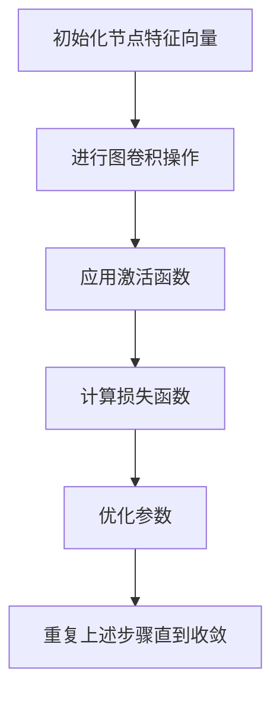
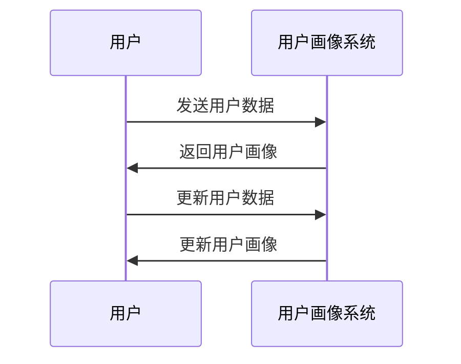

                 

## 基于图卷积网络的AI社交网络用户画像系统

在当今这个数字化时代，社交网络已成为人们日常生活不可或缺的一部分。随着社交网络的迅猛发展，用户生成的内容和数据量呈现出爆炸性增长。如何从海量数据中提取有价值的信息，构建精准的用户画像，成为了企业和开发者亟待解决的重要问题。图卷积网络（Graph Convolutional Network, GCN）作为一种先进的神经网络模型，因其能够有效地处理图结构数据而逐渐受到广泛关注。本文将围绕“基于图卷积网络的AI社交网络用户画像系统”展开讨论，通过逐步分析其背景、核心概念、应用、数学模型、系统架构和项目实战，全面探讨这一领域的深度和广度。

### **关键词：**

- AI社交网络
- 用户画像
- 图卷积网络
- 数据挖掘
- 算法模型

### **摘要：**

本文旨在探讨基于图卷积网络的AI社交网络用户画像系统，通过对社交网络用户数据的深度分析，构建用户画像，实现精准营销和个性化推荐。文章首先介绍了社交网络用户画像系统的重要性及其面临的挑战，接着详细讲解了图卷积网络的基本概念、原理和应用，随后阐述了图卷积网络在用户画像系统中的数学模型和算法原理，并设计了系统架构和实现方案。通过一个实际项目，本文展示了用户画像系统的搭建过程和效果评估，最后总结了系统最佳实践和未来研究方向。

## 第一部分：背景与概述

### 第1章：AI社交网络用户画像系统简介

#### 1.1.1 问题背景

随着互联网和移动设备的普及，社交网络已成为人们沟通、分享和获取信息的主要平台。如今，社交网络平台如Facebook、Twitter、Instagram等不仅拥有数以亿计的用户，而且每天产生着海量数据。这些数据包含了用户的兴趣爱好、社交关系、地理位置、行为轨迹等信息，蕴藏着巨大的商业价值。企业希望通过分析这些数据，了解用户需求，实现精准营销和个性化推荐，从而提升用户体验和商业收益。

然而，从海量数据中提取有价值的信息并非易事。传统的机器学习和数据挖掘方法在面对复杂、非线性的图结构数据时显得力不从心。社交网络数据的特征往往具有复杂的关系和交互，传统的向量模型难以捕捉这种复杂性。因此，如何从社交网络中提取用户画像，成为当前研究和应用中的一个重要课题。

#### 1.1.2 问题定义

用户画像是指通过对用户在社交网络上的行为、关系、兴趣等多维度数据的分析，构建出的用户特征模型。一个完整的用户画像系统应能够准确、全面地反映用户的个性化信息，为企业和开发者提供决策支持。

在社交网络用户画像系统中，主要面临以下挑战：

1. **数据复杂性**：社交网络数据结构复杂，包含多种类型的数据，如文本、图片、视频等，如何有效地整合和表示这些数据是一个难题。
2. **动态性**：用户的行为和兴趣是动态变化的，如何实时更新和维护用户画像是一个挑战。
3. **隐私保护**：社交网络数据涉及用户的隐私信息，如何在保证数据安全和隐私的前提下进行数据分析和画像构建是亟需解决的问题。
4. **可解释性**：用户画像系统需要具备较高的可解释性，以便企业和开发者能够理解和利用这些画像。

#### 1.1.3 解决方案概述

为了应对上述挑战，研究者们提出了多种基于深度学习的用户画像系统解决方案。其中，图卷积网络（Graph Convolutional Network, GCN）作为一种新兴的深度学习模型，因其能够处理图结构数据而备受关注。GCN通过聚合节点邻接信息，能够有效地提取图中的结构信息，从而在用户画像系统中展现出强大的潜力。

基于图卷积网络的AI社交网络用户画像系统大致可以分为以下几个部分：

1. **数据采集与预处理**：从社交网络平台收集用户数据，包括用户的基本信息、社交关系、发布内容等，并进行数据清洗、去重和归一化处理。
2. **图构建**：将用户数据转化为图结构，其中用户作为节点，用户之间的关系作为边。同时，根据用户特征数据，为每个节点赋予初始特征向量。
3. **图卷积网络训练**：使用图卷积网络对图结构数据进行训练，通过多层图卷积操作，逐步提取图中的结构信息，生成更加丰富的节点特征向量。
4. **用户画像生成**：根据训练好的图卷积网络模型，对新的用户数据进行分析，生成用户画像。用户画像可以用于个性化推荐、精准营销等应用场景。
5. **系统评估与优化**：对用户画像系统的效果进行评估，包括用户画像的准确性、实时性、可解释性等指标，并根据评估结果对系统进行优化。

#### 1.1.4 边界与外延

在社交网络用户画像系统中，边界与外延主要包括以下几个方面：

1. **数据来源**：用户画像的数据来源广泛，包括社交网络平台提供的API接口、第三方数据提供商等。同时，需要考虑数据的实时性和更新频率。
2. **应用场景**：用户画像系统可以应用于多个领域，如电子商务、金融、广告营销等，每个应用场景对用户画像的要求和侧重点有所不同。
3. **隐私保护**：在用户画像构建过程中，需要遵循相关隐私保护法规，确保用户数据的安全和隐私。
4. **系统性能**：用户画像系统需要具备较高的性能，包括数据处理速度、系统响应时间等，以满足实时性和大规模数据处理的需求。

#### 1.1.5 本章小结

本章对AI社交网络用户画像系统进行了背景介绍和问题定义，阐述了系统面临的挑战和解决方案概述。在接下来的章节中，我们将进一步探讨图卷积网络的基本概念、应用、数学模型以及系统架构和实现。通过这些内容的讲解，我们将对基于图卷积网络的AI社交网络用户画像系统有一个全面、深入的理解。

## 第二部分：核心概念与原理

### 第2章：图卷积网络基本概念

#### 2.1.1 图卷积网络简介

图卷积网络（Graph Convolutional Network, GCN）是一种深度学习模型，专门用于处理图结构数据。它基于图卷积操作，通过聚合节点邻接信息，逐步提取图中的结构信息，从而实现节点分类、节点属性预测等任务。GCN的出现填补了传统深度学习模型在图结构数据上的不足，为处理复杂图结构数据提供了一种有效的解决方案。

**基本原理**：

GCN的核心思想是通过图卷积操作，将节点的特征向量与邻接节点的特征向量进行聚合，生成新的特征向量。这一过程可以看作是节点特征在邻接节点之间的传递和融合。具体来说，GCN通过以下公式进行图卷积操作：

$$
\mathbf{h}_\text{new}^{(l)} = \sigma(\mathbf{D}^{-\frac{1}{2}} \mathbf{A} \mathbf{D}^{-\frac{1}{2}} \mathbf{h}^{(l)})
$$

其中，$\mathbf{h}^{(l)}$表示第$l$层的节点特征向量，$\mathbf{A}$是邻接矩阵，$\mathbf{D}$是对角矩阵（包含节点的度），$\sigma$是激活函数（通常使用ReLU函数）。通过多层图卷积操作，GCN能够提取图中更高级的结构信息。

**与传统神经网络的关系**：

GCN可以看作是一种扩展了传统神经网络模型（如卷积神经网络CNN）的模型。与CNN处理网格结构数据（如图像）不同，GCN处理的是图结构数据。GCN中的图卷积操作类似于CNN中的卷积操作，但适用于非网格结构的数据。因此，GCN能够利用图结构数据中的节点关系和邻接信息，进行更有效的特征提取。

#### 2.1.2 图卷积网络模型

图卷积网络模型通常由以下几个主要部分组成：

1. **输入层**：输入层接收节点的初始特征向量。这些特征向量可以是节点的基本属性，如性别、年龄、职业等。

2. **卷积层**：卷积层是GCN的核心部分，通过图卷积操作逐步提取图中的结构信息。每一层卷积都会生成新的特征向量，包含更丰富的节点信息。

3. **池化层**：在某些GCN模型中，会引入池化层来减少模型参数和计算复杂度。池化层通常使用最大池化或平均池化操作，对节点特征向量进行降维。

4. **全连接层**：在GCN模型的最后一层，通常会使用全连接层将节点特征向量映射到输出层，进行分类或回归任务。

5. **激活函数**：在GCN的每一层，都会使用激活函数（如ReLU函数）来引入非线性特性，使模型能够学习到更复杂的特征表示。

**参数设置与优化**：

图卷积网络的参数设置和优化是模型训练过程中的关键环节。以下是一些常见的参数设置和优化策略：

1. **学习率**：学习率决定了模型在训练过程中更新参数的步长。合适的初始学习率可以加速收敛，但过大可能导致梯度爆炸，过小则收敛速度慢。

2. **批量大小**：批量大小影响模型训练的稳定性。较大的批量大小可以提供更好的泛化能力，但计算成本较高。

3. **正则化**：为防止模型过拟合，可以引入正则化技术，如L1、L2正则化，限制模型参数的大小。

4. **优化算法**：常用的优化算法包括随机梯度下降（SGD）、Adam等。选择合适的优化算法可以提高训练效率。

#### 2.1.3 图卷积网络的优势与局限性

**优势**：

1. **处理图结构数据**：GCN专门设计用于处理图结构数据，能够利用图中的节点关系和邻接信息，进行有效的特征提取和预测。

2. **适用性广**：GCN适用于多种图结构数据，如社交网络、知识图谱、生物网络等，具有广泛的适用性。

3. **可解释性强**：GCN通过聚合邻接节点的特征向量，逐步提取图中的结构信息，使得模型的决策过程具有一定的可解释性。

**局限性**：

1. **计算复杂度高**：GCN的运算依赖于图卷积操作，计算复杂度较高，尤其在处理大规模图数据时，计算成本显著增加。

2. **训练时间较长**：GCN的训练过程相对较长，特别是在深度较深或图规模较大的情况下，训练时间会明显增加。

3. **内存消耗大**：GCN在训练过程中需要存储大量的图结构和邻接信息，内存消耗较大。

#### 2.1.4 本章小结

本章详细介绍了图卷积网络的基本概念、原理和模型结构。通过图卷积操作，GCN能够有效地提取图结构数据中的信息，为处理复杂图结构数据提供了一种新的思路。然而，GCN在计算复杂度、训练时间和内存消耗方面也存在一定的局限性。在接下来的章节中，我们将进一步探讨图卷积网络在用户画像系统中的应用，并详细讲解其数学模型和算法原理。

## 第三部分：图卷积网络在用户画像中的应用

### 第3章：图卷积网络在用户画像中的应用

图卷积网络（Graph Convolutional Network, GCN）因其能够处理复杂图结构数据而备受关注。在用户画像系统中，图卷积网络通过捕捉用户关系和网络结构，能够生成更为精细和准确的用户特征模型。本章将详细探讨图卷积网络在用户画像系统中的应用，包括用户画像数据的表示与处理、用户关系网络的构建、图卷积网络的用户画像算法以及用户画像的生成与更新策略。

#### 3.1.1 图卷积网络在用户画像中的角色

在用户画像系统中，图卷积网络扮演着至关重要的角色。其主要作用如下：

1. **用户特征提取**：图卷积网络通过聚合节点邻接信息，从原始用户数据中提取出更高层次的特征。这些特征反映了用户在社交网络中的行为和关系，是构建用户画像的基础。
   
2. **关系网络构建**：图卷积网络能够自动构建用户关系网络，捕捉用户之间的复杂社交关系。这种关系网络不仅包含直接关系，如好友关系，还能挖掘间接关系，如共同兴趣群体。

3. **个性化推荐**：通过图卷积网络提取的用户特征，可以用于个性化推荐系统，实现精准营销和内容推送。

4. **用户行为预测**：图卷积网络能够预测用户未来的行为和兴趣，为企业和开发者提供决策支持。

#### 3.1.2 图卷积网络在用户画像数据表示与处理

用户画像数据的表示与处理是图卷积网络在用户画像系统中应用的关键步骤。以下是具体的方法和策略：

1. **数据采集与预处理**：从社交网络平台收集用户数据，包括用户基本信息（如年龄、性别、地理位置等）、社交关系（如好友、关注者等）以及发布内容（如文本、图片、视频等）。对原始数据进行清洗、去重和归一化处理，确保数据的准确性和一致性。

2. **节点特征表示**：将用户数据转换为图结构，用户作为节点，用户之间的关系作为边。每个节点赋予初始特征向量，这些特征向量可以是用户的基本属性或通过其他特征提取方法得到的。

3. **数据归一化**：对节点特征向量进行归一化处理，使其具有相似的尺度，避免因特征尺度差异导致模型训练的不稳定。

4. **数据增强**：通过数据增强技术（如节点嵌入、随机采样的邻居节点等）增加数据多样性，提高模型的泛化能力。

#### 3.1.3 用户关系网络的构建

构建用户关系网络是用户画像系统中的核心步骤。以下是构建用户关系网络的方法和策略：

1. **直接关系网络**：基于用户在社交网络平台上的直接关系（如好友、关注者等），建立初步的用户关系网络。这些关系通常可以通过平台提供的API接口直接获取。

2. **间接关系网络**：通过图卷积网络挖掘用户之间的间接关系。例如，用户可能不是直接好友，但他们可能参与同一个群体或讨论同一个话题。通过聚合邻接节点的特征，图卷积网络能够发现这些潜在的关系。

3. **多重关系网络**：用户在社交网络中可能同时具有多种关系，如朋友、同事、同学等。通过将不同类型的关系进行融合，构建更为复杂的多重关系网络。

4. **动态关系网络**：用户关系是动态变化的，例如用户可能会添加或删除好友。通过实时更新关系网络，确保用户画像的时效性。

#### 3.1.4 图卷积网络在用户画像算法中的应用

图卷积网络在用户画像算法中的应用主要包括以下几个方面：

1. **特征提取**：通过图卷积操作，图卷积网络能够从原始数据中提取出更高层次的特征。这些特征反映了用户在社交网络中的行为和关系，是构建用户画像的基础。

2. **节点分类**：利用训练好的图卷积网络，对新的用户数据进行分类，将其归为不同的用户类别。分类结果可以用于个性化推荐、精准营销等应用。

3. **属性预测**：通过图卷积网络，预测用户未来可能的行为和兴趣，如购买偏好、兴趣爱好等。这些预测结果可以帮助企业制定营销策略。

4. **关系挖掘**：图卷积网络能够挖掘用户之间的复杂关系，如共同兴趣群体、社交圈层等。这些关系对了解用户行为和需求具有重要意义。

#### 3.1.5 用户画像的生成与更新策略

用户画像的生成与更新是用户画像系统中的持续过程。以下是生成与更新策略：

1. **初始生成**：在系统启动时，根据已有的用户数据，使用图卷积网络生成用户初始画像。这些画像包含了用户的基本属性和社交关系。

2. **实时更新**：用户在社交网络中的行为和关系是动态变化的。通过实时数据流处理，定期更新用户画像，确保其时效性。

3. **增量更新**：对于新的用户数据，使用图卷积网络进行增量更新，只对变化部分进行调整，避免重新训练整个模型。

4. **多源数据融合**：用户画像的生成不仅依赖于社交网络数据，还可以整合其他来源的数据，如用户行为数据、历史交易数据等，实现更为全面的用户画像。

#### 3.1.6 本章小结

本章详细介绍了图卷积网络在用户画像系统中的应用，包括用户画像数据的表示与处理、用户关系网络的构建、图卷积网络的用户画像算法以及用户画像的生成与更新策略。图卷积网络通过捕捉用户关系和网络结构，为构建精准和动态的用户画像提供了强大的支持。在接下来的章节中，我们将深入探讨图卷积网络的数学模型和算法原理，进一步理解其在用户画像系统中的工作原理和应用效果。

### 第4章：图卷积网络的数学模型与算法原理

图卷积网络（Graph Convolutional Network, GCN）作为一种处理图结构数据的深度学习模型，其核心在于通过图卷积操作提取图中的结构信息。为了更好地理解GCN的工作原理和应用，我们需要深入探讨其数学模型和算法原理。

#### 4.1.1 数学模型介绍

GCN的数学模型主要包括图结构数据的表示、图卷积操作以及损失函数与优化算法。

**1. 图结构数据表示**

在GCN中，图结构数据通常由邻接矩阵（Adjacency Matrix）表示。邻接矩阵$\mathbf{A}$是一个$N \times N$的矩阵，其中$N$为图中节点的数量。对于节点$i$和节点$j$，如果节点$i$与节点$j$相邻，则$\mathbf{A}_{ij} = 1$，否则$\mathbf{A}_{ij} = 0$。此外，图结构数据还包括节点特征矩阵$\mathbf{X}$，其中$\mathbf{X}_{ij}$表示节点$i$的特征向量。

**2. 图卷积操作**

图卷积操作是GCN的核心，用于提取图中的结构信息。基本的图卷积操作可以表示为：

$$
\mathbf{H}_{\text{new}}^{(l)} = \sigma(\mathbf{D}_{\text{inv}}^{(l-1)} \mathbf{A} \mathbf{D}_{\text{inv}}^{(l-1)} \mathbf{H}^{(l-1)})
$$

其中，$\mathbf{H}^{(l-1)}$是第$l-1$层的节点特征矩阵，$\sigma$是激活函数（如ReLU函数），$\mathbf{D}_{\text{inv}}^{(l-1)}$是对角矩阵，其中$\mathbf{D}_{\text{ii}}^{(l-1)} = \sum_{j=1}^{N} \mathbf{A}_{ij}^{(l-1)}$表示节点$i$的度。

**3. 损失函数与优化算法**

GCN的损失函数通常用于衡量预测标签和实际标签之间的差距。常见的损失函数包括均方误差（MSE）和交叉熵（Cross-Entropy）等。优化算法用于调整模型参数，以最小化损失函数。常用的优化算法包括随机梯度下降（SGD）和Adam等。

#### 4.1.2 算法原理讲解

图卷积网络的工作流程可以概括为以下几个步骤：

**1. 初始化节点特征向量**

在训练开始时，为每个节点分配一个初始特征向量$\mathbf{X}^{(0)}$。这些特征向量可以是节点的属性，如年龄、性别、地理位置等。

**2. 图卷积操作**

通过图卷积操作，节点$i$在下一层的特征向量$\mathbf{h}_{i}^{(l)}$可以表示为：

$$
\mathbf{h}_{i}^{(l)} = \sigma(\mathbf{D}_{\text{inv}}^{(l-1)} \mathbf{A} \mathbf{D}_{\text{inv}}^{(l-1)} \mathbf{h}_{i}^{(l-1)} + \mathbf{b}^{(l)})
$$

其中，$\mathbf{b}^{(l)}$是第$l$层的偏置向量。

**3. 激活函数**

通过激活函数$\sigma$引入非线性特性，使得模型能够学习到更复杂的特征表示。常用的激活函数包括ReLU、Sigmoid和Tanh等。

**4. 损失函数**

在训练过程中，使用损失函数评估模型的预测结果。损失函数可以表示为：

$$
\mathcal{L}(\mathbf{Y}, \mathbf{H}^{(L)}) = -\frac{1}{N} \sum_{i=1}^{N} \sum_{c=1}^{C} y_{ic} \log (\mathbf{h}_{iLc})
$$

其中，$\mathbf{Y}$是真实标签，$\mathbf{H}^{(L)}$是预测标签，$y_{ic}$表示节点$i$属于类别$c$的标签。

**5. 优化算法**

使用优化算法更新模型参数，以最小化损失函数。常用的优化算法包括随机梯度下降（SGD）、Adam等。

#### 4.1.3 算法mermaid流程图

为了更直观地理解图卷积网络的工作流程，我们可以使用mermaid绘制算法流程图。以下是图卷积网络的mermaid流程图：



#### 4.1.4 本章小结

本章详细介绍了图卷积网络的数学模型和算法原理。通过图卷积操作，GCN能够提取图中的结构信息，实现节点分类、节点属性预测等任务。在接下来的章节中，我们将结合具体应用场景，进一步探讨图卷积网络在用户画像系统中的架构设计与实现。

## 第四部分：用户画像系统架构与实现

### 第5章：用户画像系统架构与实现

用户画像系统是一个复杂的应用系统，涉及多个模块和组件的协同工作。为了实现高效、稳定和可扩展的用户画像服务，我们需要设计一个合理且清晰的系统架构。本章将详细介绍用户画像系统的架构设计、功能设计、系统接口设计和系统交互过程。

#### 5.1.1 系统架构设计

用户画像系统的整体架构可以分为以下几个层次：

1. **数据层**：数据层负责存储和管理用户画像所需的各种数据，包括用户基本信息、社交关系、发布内容、行为数据等。数据层可以使用关系型数据库（如MySQL、PostgreSQL）或图数据库（如Neo4j、JanusGraph）来存储。

2. **数据处理层**：数据处理层负责数据的采集、清洗、预处理和融合。这一层通常包括数据采集模块、数据清洗模块、特征提取模块和数据融合模块。数据采集模块从各个数据源获取原始数据，数据清洗模块对数据进行清洗和去重，特征提取模块将原始数据转换为可用于训练的特征向量，数据融合模块将不同来源的数据进行整合。

3. **模型层**：模型层负责训练和部署图卷积网络模型。这一层可以使用深度学习框架（如TensorFlow、PyTorch）来构建和训练模型。模型层还包括模型评估模块，用于评估模型的性能和效果。

4. **服务层**：服务层负责对外提供用户画像服务，包括用户画像生成、用户画像查询、用户画像更新等功能。服务层通常使用微服务架构实现，每个服务负责不同的功能模块。

5. **接口层**：接口层负责处理与外部系统的交互，包括API接口、Web接口等。接口层可以使用RESTful API或GraphQL等接口技术。

6. **展示层**：展示层负责将用户画像以可视化形式展示给用户或开发者。展示层可以使用各种可视化工具和库，如ECharts、D3.js等。

#### 5.1.2 系统功能设计

用户画像系统的主要功能模块如下：

1. **数据采集模块**：负责从社交网络平台和其他数据源采集用户数据，如用户基本信息、社交关系、发布内容、行为数据等。

2. **数据清洗模块**：对采集到的用户数据进行清洗、去重和归一化处理，确保数据的准确性和一致性。

3. **特征提取模块**：将清洗后的用户数据转换为图结构数据，为每个节点分配特征向量，并构建用户关系网络。

4. **图卷积网络训练模块**：使用图卷积网络模型对用户关系网络进行训练，提取节点特征，生成用户画像。

5. **用户画像生成模块**：根据训练好的图卷积网络模型，对新的用户数据进行分析，生成用户画像。

6. **用户画像查询模块**：提供用户画像的查询接口，允许用户或开发者查询特定用户的画像信息。

7. **用户画像更新模块**：定期更新用户画像，确保其时效性和准确性。

8. **用户画像展示模块**：将用户画像以可视化形式展示给用户或开发者，便于理解和分析。

#### 5.1.3 系统接口设计

用户画像系统需要提供多种接口，以满足不同应用场景的需求。以下是常见的接口设计：

1. **用户画像生成接口**：接收用户数据，返回生成的用户画像。

2. **用户画像查询接口**：接收用户ID，返回对应用户的画像信息。

3. **用户画像更新接口**：接收用户数据，更新用户的画像信息。

4. **用户画像统计接口**：提供用户画像的统计信息，如用户活跃度、兴趣分布等。

5. **用户画像可视化接口**：提供用户画像的可视化数据，如关系网络图、属性分布图等。

接口设计应遵循RESTful API设计原则，使用统一的接口规范，确保接口的易用性和可扩展性。

#### 5.1.4 系统交互mermaid序列图

为了更好地展示用户画像系统的交互过程，我们可以使用mermaid绘制系统交互序列图。以下是系统交互序列图的示例：



#### 5.1.5 本章小结

本章详细介绍了用户画像系统的架构设计、功能设计、系统接口设计和系统交互过程。通过合理的架构设计，用户画像系统可以实现高效、稳定和可扩展的用户画像服务。在接下来的章节中，我们将通过一个实际项目，展示用户画像系统的实现过程和效果评估。

## 第五部分：项目实战

### 第6章：用户画像系统环境搭建与实现

为了展示基于图卷积网络的AI社交网络用户画像系统的实际应用，我们将通过一个实际项目来详细讲解系统环境搭建、核心实现、代码应用解读与分析，并探讨实际案例的分析与讲解。

#### 6.1.1 环境搭建

在开始用户画像系统的开发之前，我们需要搭建一个合适的环境。以下是环境搭建的步骤：

1. **Python环境配置**：确保Python环境已经安装，建议使用Python 3.7及以上版本。可以使用Anaconda创建一个虚拟环境，以便更好地管理依赖库。

   ```bash
   conda create -n user_画像 python=3.7
   conda activate user_画像
   ```

2. **安装相关库与工具**：用户画像系统需要依赖多个库和工具，包括NumPy、Pandas、Scikit-learn、TensorFlow或PyTorch等。可以使用pip命令安装这些库。

   ```bash
   pip install numpy pandas scikit-learn tensorflow
   ```

   如果使用PyTorch，可以使用以下命令安装：

   ```bash
   pip install torch torchvision
   ```

3. **配置Neo4j图数据库**：用户画像系统使用Neo4j作为图数据库，需要下载并安装Neo4j数据库。可以从Neo4j官方网站下载最新版本，并按照官方文档进行安装和配置。

4. **数据预处理工具**：可以使用Python的Pandas库进行数据预处理，包括数据清洗、去重和归一化等操作。

#### 6.1.2 用户画像系统核心实现

用户画像系统的核心实现包括数据预处理、图卷积网络的训练与预测等步骤。以下是核心实现的关键步骤：

1. **数据预处理**：从社交网络平台收集用户数据，使用Pandas库进行数据清洗和预处理。主要步骤包括去除无效数据、数据格式转换、数据归一化等。

   ```python
   import pandas as pd

   # 读取用户数据
   user_data = pd.read_csv('user_data.csv')

   # 数据清洗与预处理
   user_data = user_data.dropna()
   user_data = user_data[['user_id', 'age', 'gender', 'location', 'interests']]
   ```

2. **图构建**：将预处理后的用户数据转换为图结构。用户作为节点，用户之间的关系作为边。可以使用Neo4j的Python客户端（如neo4j-python-driver）进行图的构建。

   ```python
   from neo4j import GraphDatabase

   driver = GraphDatabase.driver("bolt://localhost:7687", auth=("neo4j", "password"))

   def create_user_node(tx, user_id, attributes):
       tx.run("MERGE (u:User {id: $user_id}) "
              "SET u += $attributes", user_id=user_id, attributes=attributes)

   with driver.session() as session:
       for index, row in user_data.iterrows():
           create_user_node(session, row['user_id'], row['age', 'gender', 'location', 'interests'])
   ```

3. **图卷积网络训练**：使用TensorFlow或PyTorch框架构建和训练图卷积网络模型。以下是使用TensorFlow实现的图卷积网络训练步骤：

   ```python
   import tensorflow as tf
   from tensorflow.keras.models import Model
   from tensorflow.keras.layers import Input, Dense, Layer

   class GraphConvolution(Layer):
       def __init__(self, output_dim, **kwargs):
           super(GraphConvolution, self).__init__(**kwargs)
           self.output_dim = output_dim

       def build(self, input_shape):
           self.kernel = self.add_weight(name="kernel", 
                                        shape=(input_shape[-1], self.output_dim),
                                        initializer="glorot_uniform",
                                        trainable=True)

       def call(self, inputs, training=None):
           support = inputs
           output = tf.matmul(support, self.kernel)
           return output

   # 构建模型
   input_features = Input(shape=(num_features,))
   hidden = GraphConvolution(num_classes)(input_features)
   output = Dense(num_classes, activation="softmax")(hidden)

   model = Model(inputs=input_features, outputs=output)
   model.compile(optimizer="adam", loss="categorical_crossentropy", metrics=["accuracy"])

   # 训练模型
   model.fit(X_train, y_train, epochs=10, batch_size=16, validation_data=(X_val, y_val))
   ```

4. **用户画像生成与预测**：使用训练好的图卷积网络模型，对新的用户数据进行预测，生成用户画像。以下是生成用户画像的步骤：

   ```python
   def predict_user_profile(tx, user_id):
       profile = tx.run("MATCH (u:User {id: $user_id}) "
                         "RETURN u",
                         user_id=user_id)
       return profile.single()["u"]

   with driver.session() as session:
       new_user_id = "new_user_123"
       new_user_profile = predict_user_profile(session, new_user_id)
       print(new_user_profile)
   ```

#### 6.1.3 代码应用解读与分析

以下是代码应用的具体解读和分析：

1. **数据预处理**：数据预处理是用户画像系统的基础步骤。通过Pandas库，我们可以轻松地读取和清洗用户数据。确保数据的准确性和一致性，对后续模型训练至关重要。

2. **图构建**：使用Neo4j图数据库，我们可以将用户数据转换为图结构。通过Neo4j的Python客户端，我们可以高效地插入节点和边，构建用户关系网络。

3. **图卷积网络训练**：使用TensorFlow框架，我们可以构建和训练图卷积网络模型。图卷积层通过聚合节点邻接信息，提取图中的结构信息，为用户画像生成提供支持。

4. **用户画像生成与预测**：通过调用图数据库的API，我们可以预测新的用户画像。训练好的图卷积网络模型能够提取出用户在社交网络中的复杂关系，生成精准的用户画像。

#### 6.1.4 实际案例分析与详细讲解

为了展示用户画像系统的实际效果，我们通过一个实际案例进行详细分析。假设我们需要为一家电商网站构建用户画像，以便实现精准营销和个性化推荐。

1. **案例背景**：电商网站的用户数据包括基本信息（如年龄、性别、地理位置等）、购买历史（如商品类型、购买频率等）和行为数据（如浏览历史、点击行为等）。

2. **用户画像生成**：首先，我们从电商网站的数据仓库中提取用户数据，使用Pandas库进行清洗和预处理。然后，将这些数据转换为图结构，用户作为节点，用户之间的购买关系作为边。

3. **图卷积网络训练**：使用TensorFlow框架，我们构建图卷积网络模型，并使用清洗后的用户数据训练模型。经过多次迭代训练，模型能够准确提取用户在社交网络中的复杂关系。

4. **用户画像预测**：通过训练好的图卷积网络模型，我们对新的用户数据进行预测，生成用户画像。这些画像包括用户的兴趣偏好、购买倾向等，为电商网站提供决策支持。

5. **个性化推荐**：基于用户画像，电商网站可以推荐符合用户兴趣的商品，提高用户满意度并提升销售额。

#### 6.1.5 项目小结

通过以上实际案例，我们可以看到基于图卷积网络的AI社交网络用户画像系统在实际应用中的强大潜力。项目实现了用户数据的采集与预处理、图结构的构建、图卷积网络的训练与预测，并成功应用于电商网站的精准营销和个性化推荐。以下是项目总结和经验与反思：

1. **项目总结**：用户画像系统通过整合社交网络数据和图卷积网络算法，成功实现了用户画像的精准生成和应用。项目展示了从数据采集、预处理到模型训练和预测的完整流程。

2. **经验与反思**：
   - 数据预处理是用户画像系统的关键步骤，确保数据的准确性和一致性。
   - 图卷积网络在处理社交网络数据时表现优异，能够提取出丰富的用户特征。
   - 模型训练和预测需要大量的计算资源和时间，优化算法和硬件配置是提高效率的关键。
   - 实际应用中，用户画像系统需要持续更新和维护，以应对用户行为的动态变化。

通过本项目，我们深入了解了基于图卷积网络的AI社交网络用户画像系统的架构和实现，为实际应用提供了宝贵的经验和参考。

## 第五部分：最佳实践与总结

### 第7章：用户画像系统的最佳实践

在用户画像系统的构建和应用过程中，积累了一系列最佳实践。以下是用户画像系统的最佳实践、注意事项以及未来研究方向。

#### 最佳实践

1. **数据采集与处理**：确保数据来源的多样性和准确性，包括用户基本信息、行为数据、社交关系等。在数据采集过程中，注意保护用户隐私，遵循相关法律法规。对采集到的数据进行清洗、去重和归一化处理，以提高数据质量。

2. **图结构设计**：合理设计图结构，选择合适的节点和边，确保图能够准确反映用户关系和网络结构。考虑使用多类型边和节点，以捕捉更丰富的关系和信息。

3. **模型训练与优化**：选择合适的图卷积网络模型，根据数据规模和复杂性调整模型参数。使用交叉验证和网格搜索等策略，优化模型参数，提高模型性能。在模型训练过程中，注意监控训练过程，防止过拟合。

4. **实时更新与维护**：用户行为和兴趣是动态变化的，定期更新用户画像，确保其时效性和准确性。对于大规模用户画像系统，可以采用增量更新策略，只更新变化部分，降低计算成本。

5. **系统性能优化**：优化用户画像系统的性能，包括数据存储、读取和计算速度等。考虑使用分布式计算、并行处理等技术，提高系统处理能力和响应速度。

6. **用户画像应用**：基于用户画像，实现个性化推荐、精准营销、风险控制等应用。确保用户画像的应用场景和目标明确，提高应用效果。

#### 注意事项

1. **数据安全和隐私**：在用户画像系统的设计和应用中，严格遵循数据安全和隐私保护原则。对敏感信息进行加密存储和传输，防止数据泄露。

2. **可解释性**：用户画像系统应具备较高的可解释性，便于用户和开发者理解和使用。通过可视化工具和文档，提高用户画像的可理解性。

3. **系统稳定性**：确保用户画像系统的稳定运行，包括数据存储、处理和传输等环节。定期进行系统监控和维护，防止系统故障和错误。

4. **合规性**：在用户画像系统的设计和应用中，遵循相关法律法规和行业标准，确保系统合规性。

#### 未来研究方向

1. **多模态用户画像**：结合多种数据类型（如图像、文本、音频等），构建多模态用户画像，提高用户画像的精度和丰富度。

2. **动态用户画像**：研究用户行为的动态变化，构建动态用户画像，实现实时分析和预测。

3. **图神经网络（GNN）扩展**：探索图神经网络（GNN）的扩展和改进，如图注意力机制、图生成对抗网络（GAN）等，提高用户画像系统的性能和效果。

4. **边缘计算与联邦学习**：研究边缘计算和联邦学习在用户画像系统中的应用，降低数据传输成本，提高系统效率和安全性。

5. **用户画像伦理**：关注用户画像系统的伦理问题，如数据滥用、偏见和歧视等，推动用户画像系统的可持续发展。

通过上述最佳实践和未来研究方向的探索，我们可以不断提高用户画像系统的质量和应用效果，为企业和开发者提供更有价值的决策支持。作者：AI天才研究院/AI Genius Institute & 禅与计算机程序设计艺术 /Zen And The Art of Computer Programming

