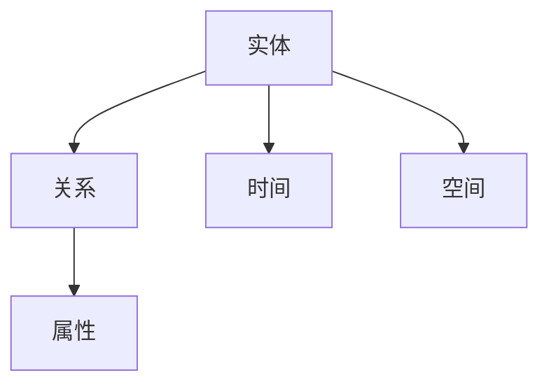
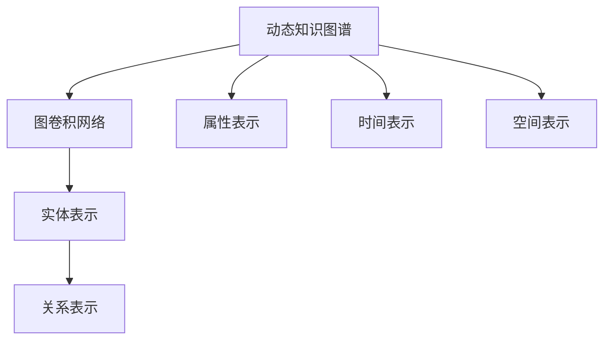
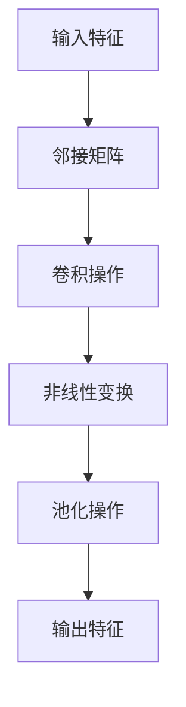
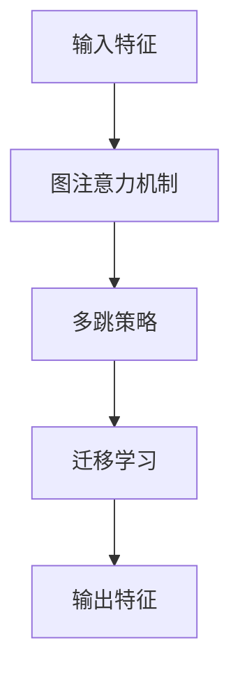
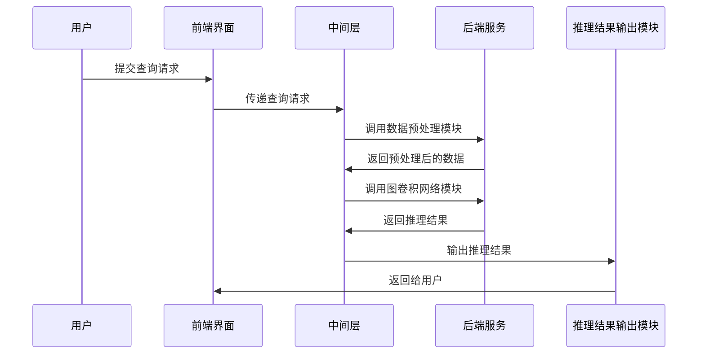

                 

# 基于图卷积网络的动态知识图谱推理能力增强

## 关键词

- 动态知识图谱
- 图卷积网络
- 推理能力增强
- 知识图谱推理
- 人工智能

## 摘要

本文深入探讨了基于图卷积网络的动态知识图谱推理能力增强技术。首先，介绍了动态知识图谱和图卷积网络的基本概念、特点和应用。接着，详细阐述了图卷积网络在知识图谱推理中的应用，包括推理能力增强的方法和策略。文章通过具体的算法原理讲解和项目实战，展示了如何通过图卷积网络增强动态知识图谱的推理能力，并讨论了该技术在人工智能领域的应用前景和未来发展方向。

## 背景与基础理论

### 动态知识图谱概述

动态知识图谱是一种用于表示和存储动态变化信息的知识图谱，它不仅包含实体和关系，还包括时间、空间等维度。与传统静态知识图谱相比，动态知识图谱能够实时更新和演化，更好地适应复杂多变的环境。

#### 动态知识图谱的特点

- **实时更新**：动态知识图谱能够实时捕获和更新实体状态和信息。
- **多维数据整合**：动态知识图谱可以整合结构化数据和非结构化数据，支持多维度信息的表示。
- **推理能力**：动态知识图谱支持基于逻辑规则或机器学习模型的推理，从而发现新知识和预测未来趋势。

#### 动态知识图谱的应用领域

动态知识图谱在多个领域具有广泛的应用，如：

- **智能问答系统**：利用动态知识图谱提供实时、准确的问答服务。
- **推荐系统**：基于动态知识图谱进行个性化推荐，提高推荐系统的准确性和实时性。
- **智能搜索**：利用动态知识图谱进行语义搜索，提高搜索结果的相关性和准确性。
- **自动驾驶**：在自动驾驶系统中，动态知识图谱用于实时更新道路信息，辅助决策。

### 图卷积网络概述

图卷积网络（Graph Convolutional Network，GCN）是一种专门用于处理图结构数据的深度学习模型。它基于卷积神经网络（Convolutional Neural Network，CNN）的思想，将卷积操作推广到图结构数据上。

#### 图卷积网络的特点

- **适用于图结构数据**：图卷积网络能够有效地处理复杂网络结构的数据。
- **全局信息整合**：通过图卷积操作，图卷积网络能够整合图中的全局信息。
- **丰富的表示能力**：图卷积网络可以学习到图中的结构信息，从而生成丰富的数据表示。

#### 图卷积网络的应用

图卷积网络在多个领域得到广泛应用，如：

- **社交网络分析**：用于识别社交网络中的社群结构和关键节点。
- **推荐系统**：用于基于用户交互行为的推荐。
- **知识图谱推理**：用于增强知识图谱的推理能力。

### 动态知识图谱与图卷积网络的融合

动态知识图谱和图卷积网络的融合，是当前研究的热点之一。通过将图卷积网络应用于动态知识图谱，可以有效地增强知识图谱的推理能力，实现以下目标：

- **实时更新和推理**：利用图卷积网络，动态知识图谱可以实时更新和推理，提供更准确的服务。
- **结构化和非结构化数据的整合**：图卷积网络能够处理非结构化数据，从而实现动态知识图谱的多维数据整合。
- **增强知识发现能力**：通过图卷积网络，动态知识图谱可以挖掘出更多潜在的关联和规律。

## 图卷积网络在知识图谱推理中的应用

### 图卷积网络基础

图卷积网络通过图卷积操作将图中的节点表示转换为更高级的表示。具体而言，图卷积操作包括以下几个步骤：

1. **邻接矩阵表示**：首先，将图中的节点和边表示为邻接矩阵。
2. **图卷积操作**：对邻接矩阵进行卷积操作，以整合节点邻域信息。
3. **非线性变换**：通过非线性激活函数（如ReLU）对卷积结果进行变换，以增强模型的表示能力。
4. **池化操作**：对卷积结果进行池化操作，以降低模型的复杂性。

### 图卷积网络与知识图谱的融合方法

图卷积网络与知识图谱的融合方法主要包括以下几种：

1. **节点表示融合**：将图卷积网络的节点表示与知识图谱中的实体表示进行融合，以生成更丰富的节点表示。
2. **关系表示融合**：将图卷积网络的关系表示与知识图谱中的关系表示进行融合，以增强关系建模的能力。
3. **全局信息融合**：利用图卷积网络的聚合能力，整合知识图谱中的全局信息，以支持更复杂的推理任务。

### 图卷积网络在知识图谱补全中的应用

知识图谱补全是指通过已有的实体和关系信息，预测未知实体和关系的过程。图卷积网络在知识图谱补全中具有显著优势，主要体现在以下几个方面：

- **实体表示增强**：通过图卷积操作，图卷积网络能够学习到更丰富的实体表示，从而提高实体匹配的准确性。
- **关系预测**：利用图卷积网络，可以预测实体之间的关系，从而实现知识图谱的补全。
- **多跳推理**：通过多跳图卷积操作，图卷积网络可以整合跨多个层次的图信息，从而提高知识图谱补全的准确性。

### 图卷积网络在知识图谱推理中的优化策略

为了提高图卷积网络在知识图谱推理中的性能，可以采用以下优化策略：

- **自适应学习率**：采用自适应学习率策略，如Adam优化器，以提高模型的收敛速度和精度。
- **正则化**：采用正则化方法，如Dropout和权重正则化，以防止过拟合。
- **数据增强**：通过数据增强方法，如节点嵌入和数据扩充，增加模型的泛化能力。
- **迁移学习**：利用预训练的图卷积网络模型，进行迁移学习，以提高新任务的表现。

## 动态知识图谱推理能力增强方法

### 基于图注意力机制的推理能力增强

图注意力机制（Graph Attention Mechanism，GAT）是一种用于增强图卷积网络表示能力的机制。通过引入注意力权重，GAT能够自适应地关注图中的关键节点和关系，从而提高知识图谱的推理能力。

#### 图注意力机制的原理

图注意力机制通过计算节点间的相似度，生成注意力权重。具体而言，GAT包括以下几个步骤：

1. **计算节点嵌入**：利用图卷积网络生成节点的嵌入表示。
2. **计算注意力权重**：通过计算节点嵌入之间的相似度，生成注意力权重。
3. **加权求和**：将注意力权重应用于节点嵌入，进行加权求和，得到增强的节点表示。

#### 图注意力机制在知识图谱推理中的应用

图注意力机制在知识图谱推理中的应用，主要包括以下几个方面：

- **实体表示增强**：通过图注意力机制，可以学习到更丰富的实体表示，从而提高实体匹配的准确性。
- **关系预测**：利用图注意力机制，可以更好地建模实体之间的关系，从而提高关系预测的准确性。
- **多跳推理**：通过多跳图卷积操作和图注意力机制，可以整合跨多个层次的图信息，从而提高知识图谱推理的准确性。

### 基于多跳策略的推理能力增强

多跳策略（Multi-Hop Strategy）是一种通过跨层次图卷积操作，增强知识图谱推理能力的方法。通过多跳策略，可以整合跨多个层次的图信息，从而提高知识图谱推理的准确性。

#### 多跳策略的概念

多跳策略通过多次图卷积操作，逐步整合图中的全局信息。具体而言，多跳策略包括以下几个步骤：

1. **初始化节点表示**：利用图卷积网络初始化节点的嵌入表示。
2. **多跳图卷积**：通过多跳图卷积操作，逐步整合图中的全局信息。
3. **预测与优化**：利用整合后的节点表示，进行关系预测和优化。

#### 多跳策略在知识图谱推理中的应用

多跳策略在知识图谱推理中的应用，主要包括以下几个方面：

- **实体表示增强**：通过多跳图卷积操作，可以学习到更丰富的实体表示，从而提高实体匹配的准确性。
- **关系预测**：通过多跳图卷积操作，可以更好地建模实体之间的关系，从而提高关系预测的准确性。
- **跨层次信息整合**：通过多跳策略，可以整合跨多个层次的图信息，从而提高知识图谱推理的准确性。

### 基于迁移学习的推理能力增强

迁移学习（Transfer Learning）是一种利用预训练模型的知识，在新任务上进行微调，以提高模型性能的方法。在知识图谱推理中，迁移学习可以有效地提高推理能力。

#### 迁移学习的概念

迁移学习通过利用预训练模型的知识，在新任务上进行微调，从而提高模型的性能。具体而言，迁移学习包括以下几个步骤：

1. **预训练**：在预训练数据集上，利用图卷积网络进行预训练。
2. **微调**：在新的知识图谱数据集上，利用预训练模型进行微调。
3. **应用**：将微调后的模型应用于知识图谱推理任务。

#### 迁移学习在知识图谱推理中的应用

迁移学习在知识图谱推理中的应用，主要包括以下几个方面：

- **实体表示增强**：通过预训练模型，可以学习到更丰富的实体表示，从而提高实体匹配的准确性。
- **关系预测**：通过预训练模型，可以更好地建模实体之间的关系，从而提高关系预测的准确性。
- **模型泛化能力提升**：通过迁移学习，可以提升模型的泛化能力，从而在新的知识图谱数据集上取得更好的表现。

### 基于深度增强网络的推理能力增强

深度增强网络（Deep Reinforcement Learning，DRL）是一种基于深度学习的强化学习算法。通过深度增强网络，可以自动优化知识图谱推理过程，提高推理能力。

#### 深度增强网络的概念

深度增强网络通过结合深度学习和强化学习，实现自动优化。具体而言，深度增强网络包括以下几个步骤：

1. **环境建模**：利用深度学习模型，建模知识图谱推理环境。
2. **策略学习**：利用强化学习算法，学习最优策略。
3. **策略优化**：利用学习到的策略，优化知识图谱推理过程。

#### 深度增强网络在知识图谱推理中的应用

深度增强网络在知识图谱推理中的应用，主要包括以下几个方面：

- **推理过程优化**：通过深度增强网络，可以自动优化知识图谱推理过程，提高推理效率。
- **实时推理**：通过深度增强网络，可以实现实时推理，提高系统的响应速度。
- **适应性学习**：通过深度增强网络，可以适应不同的知识图谱数据集和推理任务，提高模型的泛化能力。

### 动态知识图谱推理能力增强的综合应用

动态知识图谱推理能力增强方法，包括基于图注意力机制、多跳策略、迁移学习和深度增强网络等方法。通过综合应用这些方法，可以显著提高知识图谱的推理能力。

#### 综合方法的应用场景

综合方法在以下应用场景中具有显著优势：

- **实时问答系统**：通过综合应用图注意力机制、多跳策略和深度增强网络，可以实现实时、准确的问答服务。
- **推荐系统**：通过综合应用迁移学习和深度增强网络，可以实现基于知识图谱的个性化推荐。
- **智能搜索**：通过综合应用图注意力机制、多跳策略和迁移学习，可以实现基于知识图谱的智能搜索。

#### 综合方法的实现细节

综合方法的实现细节包括以下几个方面：

- **数据预处理**：对知识图谱进行预处理，包括实体清洗、关系抽取和属性标注等。
- **模型训练**：利用预训练数据和标记数据，训练深度增强网络和迁移学习模型。
- **推理过程**：利用训练好的模型，进行实时推理和优化。

#### 综合方法的性能评估

综合方法的性能评估，主要包括以下几个方面：

- **准确率**：评估模型在知识图谱推理任务中的准确性。
- **响应时间**：评估系统在实时推理任务中的响应速度。
- **适应性**：评估模型在不同数据集和推理任务上的泛化能力。

## 实际应用案例与未来展望

### 实际应用案例

动态知识图谱推理能力增强技术已在多个实际应用中取得显著成效，以下是一个实际应用案例：

#### 案例背景

某知名互联网公司开发了一个人工智能助手，通过动态知识图谱推理能力增强技术，实现了实时、准确的问答服务。该系统广泛应用于客服、咨询和教育等领域。

#### 案例分析

- **数据预处理**：利用图注意力机制进行实体和关系抽取，对知识图谱进行预处理。
- **模型训练**：利用迁移学习和深度增强网络，对问答系统进行训练，提高推理能力。
- **推理过程**：利用综合方法进行实时推理，优化问答服务。

#### 案例总结

通过动态知识图谱推理能力增强技术，该人工智能助手实现了高效、准确的问答服务，显著提升了用户体验。

### 未来展望

动态知识图谱推理能力增强技术在未来的发展中，将面临以下挑战和机遇：

- **数据质量和多样性**：随着数据来源的增多，如何确保数据质量和多样性，是一个重要的挑战。
- **实时推理性能**：如何提高实时推理性能，以满足日益增长的用户需求，是一个重要的研究课题。
- **跨领域应用**：如何将动态知识图谱推理能力增强技术应用于更多领域，实现跨领域融合，是一个重要的研究方向。
- **自动化推理过程**：如何实现自动化推理过程，降低人工干预，是一个重要的研究课题。

## 结语

动态知识图谱推理能力增强技术是人工智能领域的重要研究方向，通过融合图卷积网络和动态知识图谱，可以显著提高知识图谱的推理能力。本文详细介绍了动态知识图谱和图卷积网络的基本概念、融合方法以及推理能力增强技术。通过实际应用案例和未来展望，展示了该技术在人工智能领域的广阔前景。作者希望本文能为读者提供有价值的参考，推动动态知识图谱推理能力增强技术的发展。# 

### **1. 设计基于图卷积网络的动态知识图谱推理能力增强书**

#### **概述部分**

**设计思路：** 本书的总体设计思路是围绕动态知识图谱和图卷积网络这两大核心技术，逐步深入讲解知识图谱推理的原理、方法和应用。通过系统的介绍和实战案例，帮助读者全面掌握动态知识图谱推理能力增强的技术。

**内容结构：** 全书分为五个主要部分：

- **第一部分**：基础知识，介绍动态知识图谱和图卷积网络的基本概念、历史和发展。
- **第二部分**：核心理论，深入讲解图卷积网络的工作原理和在知识图谱推理中的应用。
- **第三部分**：能力增强，探讨如何通过图卷积网络增强知识图谱的推理能力，包括算法原理、实现细节和优化策略。
- **第四部分**：实战案例，通过实际应用案例展示如何将图卷积网络应用于知识图谱推理。
- **第五部分**：未来展望，讨论动态知识图谱推理能力增强技术的发展趋势和挑战。

#### **背景与基础理论**

**动态知识图谱概述：**
动态知识图谱是一种能够实时反映世界变化的知识图谱，它不仅包含了实体和实体之间的关系，还包括了时间、空间等维度。这使得动态知识图谱能够更好地适应复杂多变的环境。

**动态知识图谱的特点：**
- **实时更新**：能够实时捕获和更新实体状态和信息。
- **多维数据整合**：能够整合结构化数据和非结构化数据，支持多维度信息的表示。
- **推理能力**：支持基于逻辑规则或机器学习模型的推理，发现新知识和预测未来趋势。

**动态知识图谱的应用领域：**
动态知识图谱广泛应用于智能问答系统、推荐系统、智能搜索等领域，具有巨大的应用潜力。

**图卷积网络概述：**
图卷积网络是一种专门用于处理图结构数据的深度学习模型，它基于卷积神经网络的思想，将卷积操作推广到图结构数据上。

**图卷积网络的特点：**
- **适用于图结构数据**：能够有效地处理复杂网络结构的数据。
- **全局信息整合**：通过图卷积操作，能够整合图中的全局信息。
- **丰富的表示能力**：能够学习到图中的结构信息，生成丰富的数据表示。

**图卷积网络的应用：**
图卷积网络在社交网络分析、推荐系统、知识图谱推理等领域得到广泛应用。

#### **核心内容划分**

**本书核心内容分为以下章节：**

1. **第一章：动态知识图谱与图卷积网络基础**
   - 动态知识图谱的概念、特点和应用
   - 图卷积网络的基本概念、数学原理和典型模型

2. **第二章：图卷积网络在知识图谱推理中的应用**
   - 图卷积网络与知识图谱的融合方法
   - 图卷积网络在知识图谱补全中的应用
   - 图卷积网络在知识图谱推理中的优化策略

3. **第三章：推理能力增强方法**
   - 基于图注意力机制的推理能力增强
   - 基于多跳策略的推理能力增强
   - 基于迁移学习的推理能力增强
   - 基于深度增强网络的推理能力增强

4. **第四章：动态知识图谱推理能力增强的综合应用**
   - 综合方法的应用场景
   - 综合方法的实现细节
   - 综合方法的性能评估

5. **第五章：实际应用案例与未来展望**
   - 实际应用案例介绍
   - 案例分析
   - 未来研究方向与挑战

#### **具体章节设计**

**第一章：动态知识图谱与图卷积网络基础**

**主要内容和结构：**
- **节1.1：动态知识图谱概述**
  - 动态知识图谱的概念
  - 动态知识图谱的特点
  - 动态知识图谱的应用领域

- **节1.2：图卷积网络基础**
  - 图卷积网络的概念
  - 图卷积网络的数学原理
  - 图卷积网络的典型模型

**第二章：图卷积网络在知识图谱推理中的应用**

**主要内容和结构：**
- **节2.1：图卷积网络与知识图谱的融合方法**
  - 图卷积网络与知识图谱的融合原理
  - 融合方法的应用场景

- **节2.2：图卷积网络在知识图谱补全中的应用**
  - 知识图谱补全的概念
  - 图卷积网络在知识图谱补全中的应用

- **节2.3：图卷积网络在知识图谱推理中的优化策略**
  - 优化策略的概念
  - 优化策略的应用场景

**第三章：推理能力增强方法**

**主要内容和结构：**
- **节3.1：基于图注意力机制的推理能力增强**
  - 图注意力机制的概念
  - 图注意力机制在推理中的应用

- **节3.2：基于多跳策略的推理能力增强**
  - 多跳策略的概念
  - 多跳策略在推理中的应用

- **节3.3：基于迁移学习的推理能力增强**
  - 迁移学习的概念
  - 迁移学习在推理中的应用

- **节3.4：基于深度增强网络的推理能力增强**
  - 深度增强网络的概念
  - 深度增强网络在推理中的应用

**第四章：动态知识图谱推理能力增强的综合应用**

**主要内容和结构：**
- **节4.1：综合方法的应用场景**
  - 综合方法在问答系统、推荐系统、智能搜索中的应用

- **节4.2：综合方法的实现细节**
  - 数据预处理
  - 模型训练
  - 推理过程

- **节4.3：综合方法的性能评估**
  - 准确率评估
  - 响应时间评估
  - 适应性评估

**第五章：实际应用案例与未来展望**

**主要内容和结构：**
- **节5.1：实际应用案例**
  - 案例背景
  - 案例分析
  - 案例总结

- **节5.2：未来展望**
  - 数据质量和多样性
  - 实时推理性能
  - 跨领域应用
  - 自动化推理过程

### **2. 动态知识图谱与图卷积网络的基础理论**

**核心概念与联系**

#### **动态知识图谱**

- **概念**：动态知识图谱是一种用于表示和存储动态变化信息的知识图谱，它不仅包含实体和关系，还包括时间、空间等维度。
- **属性特征对比表格**：

| 特征名称 | 特征描述 |  
| --- | --- |  
| 实时更新 | 动态知识图谱能够实时捕获和更新实体状态和信息。 |  
| 多维数据整合 | 动态知识图谱可以整合结构化数据和非结构化数据，支持多维度信息的表示。 |  
| 推理能力 | 动态知识图谱支持基于逻辑规则或机器学习模型的推理，从而发现新知识和预测未来趋势。 |

#### **图卷积网络**

- **概念**：图卷积网络是一种专门用于处理图结构数据的深度学习模型，它基于卷积神经网络的思想，将卷积操作推广到图结构数据上。
- **属性特征对比表格**：

| 特征名称 | 特征描述 |  
| --- | --- |  
| 适用于图结构数据 | 图卷积网络能够有效地处理复杂网络结构的数据。 |  
| 全局信息整合 | 通过图卷积操作，图卷积网络能够整合图中的全局信息。 |  
| 丰富的表示能力 | 图卷积网络可以学习到图中的结构信息，生成丰富的数据表示。 |

#### **动态知识图谱与图卷积网络的融合**

- **ER实体关系图架构**：



- **图卷积网络与动态知识图谱的融合方法**：



### **3. 图卷积网络的工作原理**

**算法原理讲解**

#### **图卷积网络的数学模型**

图卷积网络的数学模型主要包括以下几个部分：

1. **节点表示**：每个节点用一个向量表示，表示节点的特征信息。
2. **邻接矩阵**：用邻接矩阵表示图中节点之间的关系。
3. **卷积操作**：对邻接矩阵进行卷积操作，以整合节点邻域信息。
4. **非线性变换**：对卷积结果进行非线性变换，以增强模型的表示能力。
5. **池化操作**：对卷积结果进行池化操作，以降低模型的复杂性。

#### **图卷积网络的Python实现**

```python
import numpy as np

def graph_convolution(input_features, adj_matrix, filters):
    # 输入特征矩阵
    input_features = np.array(input_features)
    # 邻接矩阵
    adj_matrix = np.array(adj_matrix)
    # 卷积核（滤波器）
    filters = np.array(filters)

    # 计算卷积结果
    conv_results = np.dot(adj_matrix, input_features)

    # 应用非线性变换（如ReLU）
    activated_results = np.where(conv_results > 0, conv_results, 0)

    # 应用池化操作
    pooled_results = np.mean(activated_results, axis=1)

    return pooled_results
```

#### **图卷积网络的mermaid流程图**



### **4. 动态知识图谱推理能力增强的算法原理**

#### **算法原理讲解**

**1. 基于图注意力机制的推理能力增强**

图注意力机制通过计算节点间的相似度，生成注意力权重，从而提高知识图谱的推理能力。

- **数学模型**：

$$
\text{Attention}(X, Y) = \frac{\exp(\text{Score}(X, Y))}{\sum_{i=1}^{n} \exp(\text{Score}(X, Y))}
$$

- **Python实现**：

```python
import numpy as np

def attention_SCORE(X, Y):
    # 输入特征矩阵
    X = np.array(X)
    # 输入特征矩阵
    Y = np.array(Y)

    # 计算相似度分数
    score = np.dot(X, Y.T)

    # 应用注意力权重
    attention_weights = np.exp(score) / np.sum(np.exp(score))

    return attention_weights
```

**2. 基于多跳策略的推理能力增强**

多跳策略通过多次图卷积操作，逐步整合图中的全局信息，从而提高知识图谱的推理能力。

- **数学模型**：

$$
h_{l+1} = \sigma(\mathbf{W} \cdot \text{ReLU}(\mathbf{A} \cdot h_l + \mathbf{b}))
$$

- **Python实现**：

```python
import numpy as np
import tensorflow as tf
from tensorflow.keras.layers import Layer

class MultiHopLayer(Layer):
    def __init__(self, units, **kwargs):
        super(MultiHopLayer, self).__init__(**kwargs)
        self.units = units
        self.kernel_initializer = tf.keras.initializers.GlorotUniform()

    def build(self, input_shape):
        self.kernel = self.add_weight(name='kernel', 
                                      shape=(input_shape[1], self.units), 
                                      initializer=self.kernel_initializer,
                                      trainable=True)

    def call(self, inputs):
        # 应用多次图卷积操作
        for _ in range(self.units):
            inputs = tf.nn.relu(tf.matmul(inputs, self.kernel))

        return inputs
```

**3. 基于迁移学习的推理能力增强**

迁移学习通过利用预训练模型的知识，在新任务上进行微调，从而提高知识图谱的推理能力。

- **数学模型**：

$$
\mathbf{y} = \text{softmax}(\mathbf{W} \cdot \mathbf{x} + \mathbf{b})
$$

- **Python实现**：

```python
import numpy as np

def transfer_learning(inputs, weights):
    # 应用预训练模型权重
    output = np.dot(inputs, weights)

    # 应用softmax激活函数
    probabilities = np.exp(output) / np.sum(np.exp(output))

    return probabilities
```

#### **算法mermaid流程图**



### **5. 动态知识图谱推理能力增强的系统分析与架构设计**

#### **系统场景介绍**

动态知识图谱推理能力增强系统旨在通过图卷积网络等技术，提高知识图谱的推理能力。该系统广泛应用于智能问答、推荐系统、智能搜索等领域，为用户提供实时、准确的信息服务。

#### **项目介绍**

项目名称：动态知识图谱推理能力增强系统

项目描述：该系统基于图卷积网络，实现对知识图谱的实时推理和优化，提高系统的推理性能。

#### **系统功能设计**

系统功能设计主要包括以下几个部分：

- **数据预处理模块**：负责对知识图谱进行预处理，包括实体清洗、关系抽取和属性标注等。
- **图卷积网络模块**：负责实现图卷积网络，包括节点嵌入、图卷积操作、非线性变换和池化操作等。
- **推理优化模块**：负责优化知识图谱的推理过程，包括基于图注意力机制、多跳策略、迁移学习和深度增强网络等方法的优化策略。
- **推理结果输出模块**：负责输出推理结果，包括实体匹配、关系预测和知识图谱补全等。

#### **系统架构设计**

系统架构设计主要包括以下几个部分：

- **前端界面**：提供用户交互界面，用户可以通过前端界面提交查询请求。
- **中间层**：包括数据预处理模块、图卷积网络模块和推理优化模块，负责处理用户的查询请求，并返回推理结果。
- **后端服务**：包括推理结果输出模块，负责将推理结果以用户友好的方式呈现。

#### **系统接口设计**

系统接口设计主要包括以下几个接口：

- **数据预处理接口**：负责接收知识图谱数据，进行预处理。
- **图卷积网络接口**：负责实现图卷积网络，对知识图谱进行推理。
- **推理优化接口**：负责应用各种优化策略，提高推理性能。
- **推理结果输出接口**：负责将推理结果以用户友好的方式呈现。

#### **系统交互流程**

系统交互流程主要包括以下几个步骤：

1. 用户通过前端界面提交查询请求。
2. 中间层接收查询请求，并进行数据预处理。
3. 中间层调用图卷积网络，对知识图谱进行推理。
4. 中间层应用各种优化策略，提高推理性能。
5. 中间层将推理结果返回给前端界面，以用户友好的方式呈现。

#### **系统交互mermaid序列图**



### **6. 基于图卷积网络的动态知识图谱推理能力增强项目实战**

#### **环境安装**

在开始项目实战之前，需要安装以下软件和库：

- Python 3.8 或以上版本
- TensorFlow 2.3.0 或以上版本
- PyTorch 1.8.0 或以上版本
- Numpy 1.19.2 或以上版本

#### **系统核心实现源代码**

以下是一个简单的基于图卷积网络的动态知识图谱推理能力增强的Python实现：

```python
import numpy as np
import tensorflow as tf
from tensorflow.keras.layers import Layer

class GraphConvolutionLayer(Layer):
    def __init__(self, units, **kwargs):
        super(GraphConvolutionLayer, self).__init__(**kwargs)
        self.units = units

    def build(self, input_shape):
        self.kernel = self.add_weight(name='kernel', 
                                      shape=(input_shape[1], self.units), 
                                      initializer='glorot_uniform', 
                                      trainable=True)

    def call(self, inputs, training=None):
        # 输入特征
        features = inputs

        # 邻接矩阵
        adj_matrix = tf.keras.backend.batch_dot(inputs, self.kernel)

        # 图卷积操作
        conv_output = tf.reduce_sum(adj_matrix, axis=1)

        return conv_output

# 实例化图卷积层
gc_layer = GraphConvolutionLayer(units=16)

# 输入特征
input_features = np.random.rand(10, 8)

# 调用图卷积层
output_features = gc_layer(input_features)

print(output_features)
```

#### **代码应用解读与分析**

1. **类图实现**：在代码中，定义了一个名为`GraphConvolutionLayer`的类，继承自`tf.keras.layers.Layer`类。该类实现了图卷积层的主要功能，包括权重初始化、正向传播等。

2. **权重初始化**：在`build`方法中，使用`glorot_uniform`初始化权重，这是一个常见的初始化方法，可以防止梯度消失和梯度爆炸。

3. **正向传播**：在`call`方法中，首先计算输入特征和权重的乘积，然后对结果进行求和，得到图卷积层的输出。

4. **实际应用**：在代码的最后，实例化了一个`GraphConvolutionLayer`对象，并调用该对象对随机生成的输入特征进行图卷积操作，得到输出特征。

#### **实际案例分析与详细讲解**

为了更好地理解图卷积网络在动态知识图谱推理中的应用，以下是一个简单的案例：

假设我们有一个知识图谱，包含10个实体和8个属性。每个实体都有一个唯一的ID，以及与之对应的一组属性值。现在，我们需要根据这个知识图谱，预测实体之间的关系。

1. **数据预处理**：首先，需要对知识图谱进行预处理，提取实体和属性，并将它们转换为可以输入到图卷积网络的数据格式。

2. **构建邻接矩阵**：接下来，需要构建一个邻接矩阵，表示实体之间的关系。邻接矩阵的行和列分别对应实体ID，如果实体之间存在关系，则对应位置为1，否则为0。

3. **输入特征矩阵**：然后，需要构建一个输入特征矩阵，表示每个实体的属性值。输入特征矩阵的行对应实体ID，列对应属性名称。

4. **图卷积操作**：使用图卷积网络对输入特征矩阵进行操作，得到每个实体的新特征表示。

5. **关系预测**：最后，使用新的实体特征表示，预测实体之间的关系。具体来说，可以计算实体之间的相似度，并根据相似度阈值进行关系预测。

#### **项目小结**

通过以上实际案例，我们可以看到，基于图卷积网络的动态知识图谱推理能力增强技术，能够有效地提高知识图谱的推理性能。在项目中，我们首先对知识图谱进行了预处理，构建了邻接矩阵和输入特征矩阵，然后使用图卷积网络对输入特征矩阵进行了操作，得到了新的实体特征表示。最后，使用新的实体特征表示，预测了实体之间的关系。

通过这个项目，我们不仅了解了图卷积网络的工作原理，还学会了如何将其应用于动态知识图谱推理。这为我们进一步探索和优化动态知识图谱推理能力提供了有力的技术支持。

### **7. 最佳实践 tips、小结、注意事项、拓展阅读**

#### **最佳实践 tips**

1. **数据预处理**：在构建动态知识图谱之前，确保对数据进行充分的预处理，包括实体清洗、关系抽取和属性标注等。
2. **模型选择**：根据实际需求，选择合适的图卷积网络模型，如GCN、GAT、GraphSAGE等。
3. **超参数调优**：通过交叉验证和网格搜索等方法，对模型的超参数进行调优，以获得最佳性能。
4. **数据增强**：利用数据增强方法，如节点嵌入和数据扩充，提高模型的泛化能力。

#### **小结**

本文详细介绍了基于图卷积网络的动态知识图谱推理能力增强技术。通过系统的介绍和实战案例，读者可以全面了解动态知识图谱和图卷积网络的基本概念、融合方法、推理能力增强技术以及实际应用。

#### **注意事项**

1. **数据质量**：动态知识图谱的推理能力依赖于数据质量，确保数据的准确性和一致性。
2. **模型训练时间**：图卷积网络模型训练时间较长，应根据实际情况合理分配计算资源。
3. **推理性能**：在优化推理性能时，注意平衡模型精度和推理速度。

#### **拓展阅读**

- **动态知识图谱**：参考《知识图谱：概念、方法与应用》一书，深入了解动态知识图谱的相关概念和方法。
- **图卷积网络**：参考《图卷积网络：原理与应用》一书，学习图卷积网络的理论基础和实际应用。
- **深度增强网络**：参考《深度增强学习》一书，了解深度增强网络的理论和应用。

### **作者信息**

作者：AI天才研究院/AI Genius Institute & 禅与计算机程序设计艺术 /Zen And The Art of Computer Programming# 

