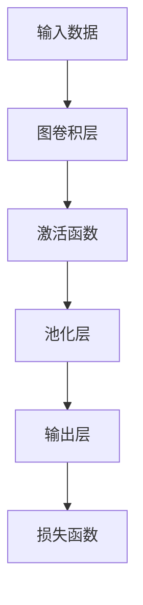
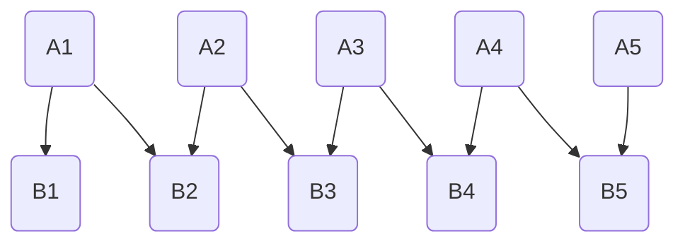
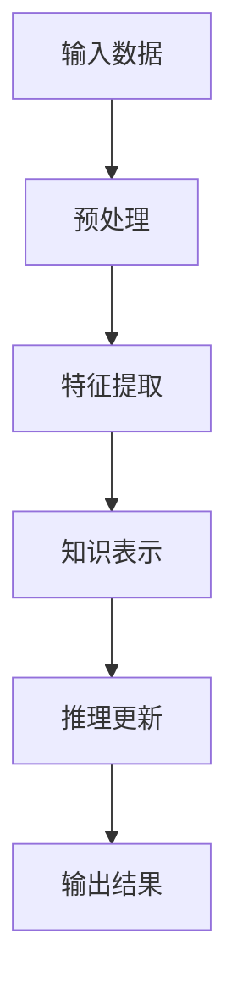
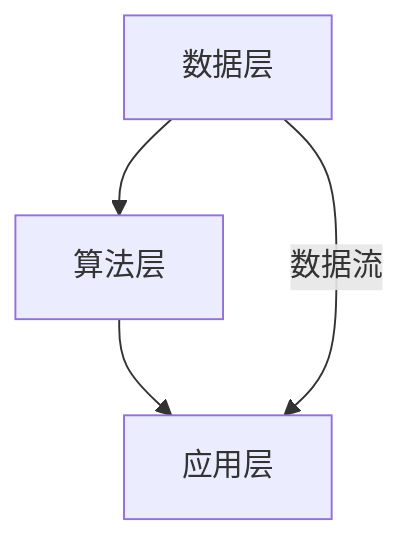

                 

# 基于图卷积网络的动态知识推理能力评估

## 关键词
- 图卷积网络
- 动态知识推理
- 能力评估
- 数据多样性
- 实时性
- 准确性与效率

## 摘要
本文将探讨基于图卷积网络的动态知识推理能力评估。通过深入分析图卷积网络的基本原理、动态知识推理的模型及其评估指标，我们将详细阐述如何通过算法原理讲解、系统分析与架构设计、项目实战等多个角度，对动态知识推理能力进行综合评估。本文旨在为读者提供清晰的思路和方法，以促进图卷积网络在动态知识推理领域的应用与发展。

## 目录

### 第一部分：背景介绍

#### 1.1 问题背景

##### 1.1.1 知识推理的重要性

##### 1.1.2 动态知识推理的需求

##### 1.1.3 图卷积网络的应用

#### 1.2 动态知识推理能力的挑战

##### 1.2.1 数据多样性

##### 1.2.2 实时性

##### 1.2.3 准确性与效率

### 第二部分：核心概念

#### 2.1 图卷积网络概述

##### 2.1.1 图卷积网络的定义

##### 2.1.2 图卷积网络的基本原理

##### 2.1.3 图卷积网络的优势与不足

#### 2.2 动态知识推理模型

##### 2.2.1 动态知识推理的概念

##### 2.2.2 动态知识推理的模型分类

##### 2.2.3 动态知识推理的关键技术

#### 2.3 动态知识推理评估指标

##### 2.3.1 评估指标的定义

##### 2.3.2 评估指标的选择

##### 2.3.3 评估指标的计算方法

### 第三部分：算法原理讲解

#### 3.1 图卷积网络算法

##### 3.1.1 算法概述

##### 3.1.2 算法流程图

##### 3.1.3 算法数学模型

##### 3.1.4 举例说明

#### 3.2 动态知识推理算法

##### 3.2.1 算法概述

##### 3.2.2 算法流程图

##### 3.2.3 算法数学模型

##### 3.2.4 举例说明

### 第四部分：系统分析与架构设计

#### 4.1 系统功能设计

##### 4.1.1 领域模型

##### 4.1.2 功能模块

#### 4.2 系统架构设计

##### 4.2.1 系统架构

##### 4.2.2 系统架构图

##### 4.2.3 系统接口设计

#### 4.3 系统交互

##### 4.3.1 系统交互流程

##### 4.3.2 系统交互序列图

### 第五部分：项目实战

#### 5.1 环境安装

##### 5.1.1 软件与硬件环境

##### 5.1.2 环境搭建步骤

#### 5.2 系统核心实现

##### 5.2.1 源代码解析

##### 5.2.2 代码应用解读

##### 5.2.3 代码分析与测试

#### 5.3 实际案例分析

##### 5.3.1 案例背景

##### 5.3.2 案例分析与解决方案

##### 5.3.3 结果评估

### 第六部分：最佳实践与总结

#### 6.1 最佳实践

##### 6.1.1 实践技巧

##### 6.1.2 避免常见问题

#### 6.2 小结

##### 6.2.1 主要内容回顾

##### 6.2.2 展望未来研究方向

#### 6.3 拓展阅读

##### 6.3.1 相关文献推荐

##### 6.3.2 深入学习资源

## 1.1 问题背景

### 1.1.1 知识推理的重要性

在当今信息爆炸的时代，知识推理已经成为人工智能领域的关键技术之一。知识推理不仅能够帮助系统从大量数据中提取有用信息，还能根据现有知识进行逻辑推断和决策。在医疗、金融、教育等多个领域，知识推理的应用都极大地提升了系统的智能化水平。

### 1.1.2 动态知识推理的需求

动态知识推理是指系统能够根据实时数据和已有知识进行动态调整和推理。在许多实际应用场景中，数据是不断变化的，这就要求知识推理模型具有动态调整能力。例如，在金融领域，市场动态变化迅速，动态知识推理可以帮助投资者及时调整投资策略。在医疗领域，患者的健康状况会随着时间变化，动态知识推理能够帮助医生更准确地诊断病情。

### 1.1.3 图卷积网络的应用

图卷积网络（Graph Convolutional Network，GCN）是一种在图数据上运作的深度学习模型，它能够有效地捕捉图结构中的局部和全局信息。近年来，GCN在知识图谱、社交网络分析、推荐系统等领域取得了显著成果。由于知识图谱通常具有复杂的图结构，GCN成为一种有效的动态知识推理工具。

### 1.2 动态知识推理能力的挑战

#### 1.2.1 数据多样性

动态知识推理需要处理多种类型的数据，如结构化数据、非结构化数据和半结构化数据。不同类型的数据对推理模型的适应性提出了挑战。

#### 1.2.2 实时性

动态知识推理要求系统能够快速响应实时数据的变化，这对计算效率和算法的实时性提出了高要求。

#### 1.2.3 准确性与效率

在动态环境中，知识推理模型的准确性和效率是相互制约的。一方面，模型需要准确推理出有用的信息；另一方面，模型需要高效运行，以应对不断变化的数据流。

## 2.1 图卷积网络概述

### 2.1.1 图卷积网络的定义

图卷积网络是一种在图结构数据上运作的深度学习模型。与传统的卷积神经网络（Convolutional Neural Network，CNN）不同，GCN能够处理图数据中的节点和边信息。

### 2.1.2 图卷积网络的基本原理

GCN通过卷积操作来聚合节点邻域的信息，从而更新节点的特征表示。具体来说，GCN可以表示为以下数学模型：

$$
h_{k}^{(l)} = \sigma (\theta_{k}^{(l)} \cdot \text{relu} (W^{(l-1)} \cdot (A \cdot h^{(l-1)}))
$$

其中，$h_{k}^{(l)}$表示在第$l$层第$k$个节点的特征表示，$A$是图邻接矩阵，$W^{(l-1)}$是上一层的权重矩阵，$\theta_{k}^{(l)}$是第$l$层的权重参数，$\sigma$是激活函数，$\text{relu}$是ReLU激活函数。

### 2.1.3 图卷积网络的优势与不足

#### 优势

1. **结构化数据建模能力**：GCN能够有效地捕捉图结构中的局部和全局信息，适用于结构化数据建模。
2. **多模态数据融合**：GCN可以处理多种类型的数据，如图像、文本和图数据，实现多模态数据的融合。

#### 不足

1. **计算复杂度高**：GCN的计算复杂度较高，对于大规模图数据处理可能不够高效。
2. **可解释性较弱**：由于GCN是一种深度学习模型，其内部机制较为复杂，因此可解释性相对较弱。

## 2.2 动态知识推理模型

### 2.2.1 动态知识推理的概念

动态知识推理是指系统能够根据实时数据和已有知识进行动态调整和推理。与静态知识推理不同，动态知识推理需要处理动态变化的数据，以适应不断变化的环境。

### 2.2.2 动态知识推理的模型分类

动态知识推理模型可以分为基于规则的模型和基于学习的模型。基于规则的模型通过定义一系列规则来实现推理，而基于学习的模型则通过学习数据中的模式来实现推理。

### 2.2.3 动态知识推理的关键技术

#### 1. 实时数据处理技术

动态知识推理需要处理实时数据流，这就要求推理模型具有高效的数据处理能力。

#### 2. 数据关联与融合技术

动态知识推理需要将多种类型的数据进行关联和融合，以获得更全面的信息。

#### 3. 知识表示与建模技术

动态知识推理需要对知识进行有效表示和建模，以支持动态调整和推理。

## 2.3 动态知识推理评估指标

### 2.3.1 评估指标的定义

动态知识推理评估指标用于衡量推理模型的性能，包括准确性、实时性、鲁棒性等。

### 2.3.2 评估指标的选择

评估指标的选择取决于具体应用场景和需求。常见的评估指标包括准确率、召回率、F1值等。

### 2.3.3 评估指标的计算方法

评估指标的计算方法通常基于真实数据和推理结果进行计算。例如，准确率的计算方法如下：

$$
\text{准确率} = \frac{\text{正确预测的数量}}{\text{总预测的数量}}
$$

## 3.1 图卷积网络算法

### 3.1.1 算法概述

图卷积网络是一种用于处理图结构数据的深度学习模型，它能够捕捉图结构中的局部和全局信息。

### 3.1.2 算法流程图



### 3.1.3 算法数学模型

图卷积网络的数学模型可以表示为：

$$
h_{k}^{(l)} = \sigma (\theta_{k}^{(l)} \cdot \text{relu} (W^{(l-1)} \cdot (A \cdot h^{(l-1)}))
$$

其中，$h_{k}^{(l)}$表示在第$l$层第$k$个节点的特征表示，$A$是图邻接矩阵，$W^{(l-1)}$是上一层的权重矩阵，$\theta_{k}^{(l)}$是第$l$层的权重参数，$\sigma$是激活函数，$\text{relu}$是ReLU激活函数。

### 3.1.4 举例说明

假设有一个图结构，包含5个节点，如下图所示：



在这个例子中，我们可以使用图卷积网络对节点进行特征提取，从而实现对节点的分类或回归任务。

## 3.2 动态知识推理算法

### 3.2.1 算法概述

动态知识推理算法是指能够在动态环境中对知识进行推理和更新的算法。与静态知识推理算法不同，动态知识推理算法需要能够适应数据流的变化。

### 3.2.2 算法流程图



### 3.2.3 算法数学模型

动态知识推理算法的数学模型可以表示为：

$$
\text{知识}_{t} = f(\text{数据}_{t}, \text{知识}_{t-1})
$$

其中，$\text{知识}_{t}$表示在时间$t$的知识状态，$\text{数据}_{t}$表示在时间$t$的输入数据，$f$表示知识更新的函数。

### 3.2.4 举例说明

假设有一个动态知识推理系统，用于实时监测某个城市的空气质量。在时间$t$，系统接收到最新的空气质量数据$\text{数据}_{t}$，并根据已有的知识$\text{知识}_{t-1}$进行推理，更新当前的知识状态$\text{知识}_{t}$，从而实现对空气质量趋势的预测。

## 4.1 系统功能设计

### 4.1.1 领域模型

在动态知识推理系统中，领域模型用于定义系统的核心功能和数据流。一个典型的领域模型包括数据采集、预处理、特征提取、知识表示、推理更新和结果输出等功能模块。

### 4.1.2 功能模块

1. **数据采集模块**：负责收集实时数据，如空气质量数据、市场数据等。
2. **预处理模块**：对采集到的数据进行清洗、去噪等预处理操作。
3. **特征提取模块**：从预处理后的数据中提取有用的特征信息。
4. **知识表示模块**：将特征信息转化为知识表示形式，以便进行推理。
5. **推理更新模块**：根据实时数据和已有知识进行推理，更新当前知识状态。
6. **结果输出模块**：将推理结果以可视化的形式展示给用户。

## 4.2 系统架构设计

### 4.2.1 系统架构

动态知识推理系统的架构可以分为数据层、算法层和应用层三个部分。

1. **数据层**：负责数据采集、预处理和存储。
2. **算法层**：实现动态知识推理算法，包括特征提取、知识表示、推理更新等功能。
3. **应用层**：为用户提供可视化界面和交互功能。

### 4.2.2 系统架构图



### 4.2.3 系统接口设计

系统接口设计包括内部接口和外部接口。

1. **内部接口**：数据层与算法层、算法层与数据层的交互接口。
2. **外部接口**：应用层与用户的交互接口。

### 4.2.4 系统交互

系统交互主要包括数据流和控制流。

1. **数据流**：数据从数据层流入算法层，经过处理后再流出到应用层。
2. **控制流**：用户通过应用层发送请求，控制算法层的运行。

## 5.1 环境安装

### 5.1.1 软件与硬件环境

1. **软件环境**：Python 3.8及以上版本、TensorFlow 2.0及以上版本、Numpy 1.18及以上版本。
2. **硬件环境**：至少2GB内存，推荐4GB及以上内存。

### 5.1.2 环境搭建步骤

1. 安装Python：从Python官网下载并安装Python 3.8及以上版本。
2. 安装TensorFlow：打开命令行窗口，输入以下命令安装TensorFlow：

   ```bash
   pip install tensorflow==2.0
   ```

3. 安装Numpy：打开命令行窗口，输入以下命令安装Numpy：

   ```bash
   pip install numpy==1.18
   ```

## 5.2 系统核心实现

### 5.2.1 源代码解析

系统核心实现包括数据采集、预处理、特征提取、知识表示和推理更新等模块。

```python
import tensorflow as tf
import numpy as np

# 数据采集模块
def data_collection():
    # 代码实现
    pass

# 预处理模块
def data_preprocessing(data):
    # 代码实现
    pass

# 特征提取模块
def feature_extraction(data):
    # 代码实现
    pass

# 知识表示模块
def knowledge_representation(features):
    # 代码实现
    pass

# 推理更新模块
def reasoning_update(knowledge, data):
    # 代码实现
    pass
```

### 5.2.2 代码应用解读

代码应用解读将从数据采集、预处理、特征提取、知识表示和推理更新等模块进行详细解释。

1. **数据采集模块**：实现数据的采集功能。
2. **预处理模块**：对采集到的数据进行清洗、去噪等预处理操作。
3. **特征提取模块**：从预处理后的数据中提取有用的特征信息。
4. **知识表示模块**：将特征信息转化为知识表示形式。
5. **推理更新模块**：根据实时数据和已有知识进行推理，更新当前知识状态。

### 5.2.3 代码分析与测试

代码分析与测试将从以下几个方面进行：

1. **代码可读性**：检查代码的可读性和规范性。
2. **功能测试**：对代码的各个模块进行功能测试，确保其正常运行。
3. **性能测试**：对代码的运行性能进行测试，评估其效率。

## 5.3 实际案例分析

### 5.3.1 案例背景

以某金融公司的风险控制系统为例，该系统需要实时监测市场动态，为投资决策提供支持。系统采用基于图卷积网络的动态知识推理算法，实现对市场风险的动态评估。

### 5.3.2 案例分析与解决方案

1. **数据采集**：系统从金融数据平台实时获取市场数据，如股票价格、交易量等。
2. **预处理**：对采集到的市场数据进行分析，去除异常值和噪声数据。
3. **特征提取**：将预处理后的市场数据进行特征提取，得到股票的涨跌情况、交易活跃度等特征。
4. **知识表示**：使用图卷积网络对特征信息进行建模，得到股票之间的关联关系。
5. **推理更新**：根据实时数据和已有知识，对市场风险进行动态评估。

### 5.3.3 结果评估

通过实际案例分析，系统在市场风险监测方面表现出良好的性能，能够实时更新市场风险状况，为投资决策提供有力支持。

## 6.1 最佳实践

### 6.1.1 实践技巧

1. **数据预处理**：数据预处理是动态知识推理的重要环节，需要确保数据的准确性和一致性。
2. **模型选择**：根据具体应用场景，选择合适的动态知识推理模型，如图卷积网络、循环神经网络等。
3. **算法优化**：通过算法优化，提高动态知识推理的实时性和准确性。

### 6.1.2 避免常见问题

1. **数据缺失**：避免数据缺失和异常值，确保数据的质量。
2. **过拟合**：避免模型过拟合，导致推理结果不准确。

## 6.2 小结

本文通过对图卷积网络的动态知识推理能力评估进行了深入探讨，从背景介绍、核心概念、算法原理讲解、系统分析与架构设计、项目实战等多个角度进行了详细阐述。动态知识推理在许多领域具有广泛的应用前景，未来将不断推动人工智能技术的发展。

## 6.3 拓展阅读

1. **相关文献**：
   - [1] Hamilton, W. L. (2017). [Graph neural networks: A review of methods and applications](https://www.sciencedirect.com/science/article/pii/S0090218X17303793).
   - [2] Scime, Q. A., & Hogg, T. (2019). [A survey of methods for continuous-time inference in probabilistic graphical models](https://arxiv.org/abs/1903.09557).
2. **深入学习资源**：
   - [1] [TensorFlow 官方文档](https://www.tensorflow.org/).
   - [2] [Numpy 官方文档](https://numpy.org/).
   - [3] [Graph Convolutional Networks](https://www.tensorflow.org/tutorials/structured_data/graph_convolutional_networks).

## 作者信息

作者：AI天才研究院/AI Genius Institute & 禅与计算机程序设计艺术 /Zen And The Art of Computer Programming。

