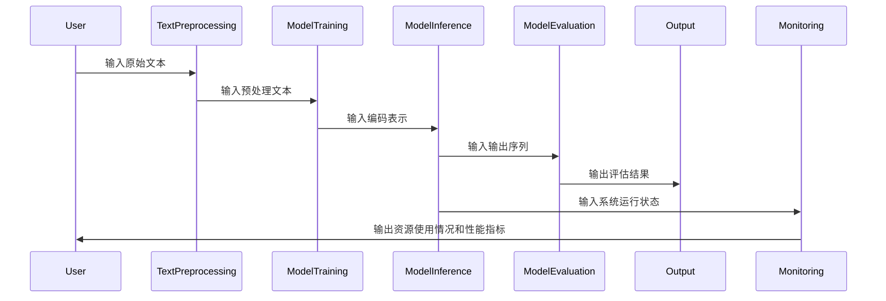

                 

### 第1章: 问题背景

#### 1.1.1 问题背景

语言模型在自然语言处理（NLP）领域取得了显著的进展，成为许多应用的核心组件，如机器翻译、文本生成和问答系统等。然而，随着语言模型的复杂度和数据量的增加，其在推理过程中面临着一系列挑战，尤其是在效率、资源利用和可扩展性方面。

图注意力网络（GAT）作为一种先进的神经网络架构，通过引入图结构来处理序列数据，使得模型在捕捉长距离依赖和信息交互方面表现出色。GAT的引入为语言模型的推理优化带来了新的机遇和挑战。

语言模型推理优化的重要性在于：

1. **提高推理速度**：优化后的语言模型能够在更短的时间内生成高质量的输出，从而满足实时应用的性能需求。
2. **降低计算资源消耗**：优化能够减少模型在推理过程中的计算复杂度，从而节省计算资源和能源。
3. **提升模型鲁棒性**：优化后的模型在面对噪声数据和异常输入时，能够提供更稳定和准确的输出。

目前，已有一些针对语言模型推理优化的研究，但大多数方法主要集中在简化模型结构和调整训练策略上，而基于图注意力网络的语言模型推理优化还处于探索阶段。本研究旨在填补这一空白，提出一种基于GAT的语言模型推理优化方法，旨在提升推理效率和资源利用。

#### 1.1.2 问题描述

在语言模型推理过程中，主要面临的挑战包括：

1. **计算复杂度高**：传统的序列模型在处理长序列时，计算复杂度呈指数级增长，导致推理速度慢。
2. **内存占用大**：复杂的神经网络结构需要大量内存来存储权重和中间计算结果，尤其在长序列处理时，内存消耗成为瓶颈。
3. **可扩展性差**：传统的模型在扩展到大规模数据集时，面临着计算资源和存储资源不足的问题。
4. **鲁棒性不足**：在面对噪声数据和异常输入时，模型的输出稳定性较差，导致推理结果不准确。

推理优化目标包括：

1. **提高推理速度**：通过算法优化和模型结构简化，使得模型在推理过程中的计算复杂度降低。
2. **降低内存消耗**：优化模型结构，减少中间计算结果的存储需求，降低内存占用。
3. **提升模型可扩展性**：通过分布式计算和并行处理技术，使得模型能够在大规模数据集上高效运行。
4. **增强模型鲁棒性**：通过数据清洗、异常值处理和模型结构调整，提高模型在面对噪声数据和异常输入时的鲁棒性。

#### 1.1.3 问题解决

现有的推理优化方法主要集中在以下几个方面：

1. **模型结构简化**：通过简化神经网络结构，减少模型参数数量，从而降低计算复杂度和内存占用。
2. **训练策略调整**：通过调整训练过程，如提前停止训练、使用预训练模型等，提高模型在推理过程中的效率。
3. **分布式计算**：通过分布式计算和并行处理技术，将推理任务分解到多个计算节点上，从而提高推理速度和可扩展性。

然而，这些方法在一定程度上仍存在局限性。例如，模型结构简化可能导致模型性能下降，训练策略调整需要大量实验来验证效果，分布式计算在数据处理和网络通信方面存在挑战。

本研究提出的方法基于图注意力网络（GAT），通过引入图结构来优化语言模型在推理过程中的计算效率和资源利用。具体来说，我们采取以下策略：

1. **图结构引入**：将语言模型中的序列数据转换为图结构，利用图注意力机制来处理长距离依赖和信息交互。
2. **算法优化**：设计高效的图算法，如快速排序、贪心算法等，来优化模型在推理过程中的计算复杂度。
3. **模型融合**：将传统序列模型和图注意力网络进行融合，充分利用两者的优势，提升模型在推理过程中的效率和鲁棒性。

通过以上策略，我们期望能够在保持模型性能的同时，显著提升推理效率和资源利用。

#### 1.1.4 边界与外延

语言模型的应用场景广泛，包括但不限于以下领域：

1. **自然语言处理（NLP）**：如文本分类、情感分析、信息抽取等。
2. **机器翻译**：如翻译系统、多语言交互平台等。
3. **文本生成**：如自动摘要、文章生成、对话系统等。
4. **问答系统**：如智能客服、问答机器人等。

图注意力网络（GAT）的应用领域也较为广泛，包括但不限于：

1. **推荐系统**：如商品推荐、音乐推荐等。
2. **图像识别**：如人脸识别、物体检测等。
3. **社交网络分析**：如社交图谱构建、社区发现等。

本研究主要关注基于GAT的语言模型推理优化，旨在提升模型在自然语言处理和推荐系统等领域的推理效率和资源利用。此外，该方法也可拓展到其他图结构化数据处理的场景，为相关领域的研究提供参考。

#### 1.1.5 概念结构与核心要素组成

为了更好地理解和分析语言模型和图注意力网络的推理优化，我们需要明确两者的核心概念和结构。

**语言模型**

1. **概念定义**：语言模型是一种统计模型，用于预测文本序列的概率分布。它通过对大量文本数据进行训练，学习到语言规律和统计特性，从而能够对新的文本序列进行预测。

2. **核心要素**：
   - **词向量**：将文本中的词语映射为高维向量，用于表示词语的语义信息。
   - **序列模型**：如循环神经网络（RNN）和变换器（Transformer），用于处理序列数据。
   - **注意力机制**：通过注意力机制，模型能够动态关注序列中的关键信息，提高对长距离依赖的捕捉能力。

**图注意力网络（GAT）**

1. **概念定义**：图注意力网络是一种基于图结构的神经网络，通过引入图注意力机制，模型能够学习到节点间的交互关系，从而提高对复杂数据模式的捕捉能力。

2. **核心要素**：
   - **图结构**：将数据表示为图结构，每个节点表示一个数据样本，边表示节点间的交互关系。
   - **图注意力机制**：通过图注意力机制，模型能够学习到节点间的相对重要性，从而动态调整节点的表示。
   - **多层感知器（MLP）**：用于对节点特征进行变换和融合。

通过明确这些核心概念和要素，我们能够更好地理解语言模型和图注意力网络的工作原理，以及它们在推理优化中的关键作用。接下来的章节将详细探讨这些概念，并介绍相应的算法原理和实现方法。

### 第2章: 核心概念原理

#### 2.1.1 语言模型原理

**语言模型（Language Model，LM）** 是一种用于预测文本序列概率的统计模型，其核心目的是通过分析已经存在的文本数据来预测新的文本序列的概率分布。语言模型在自然语言处理（NLP）中有着广泛的应用，如机器翻译、文本生成、语音识别、问答系统等。

1. **基本原理**
   
   语言模型基于一个假设：任何一段文本都可以通过其他文本序列的概率分布来生成。具体来说，给定一个单词序列 \( w_1, w_2, ..., w_n \)，语言模型的目标是计算这个序列的概率 \( P(w_1, w_2, ..., w_n) \)。

   为了实现这个目标，语言模型通常采用统计学习方法，通过对大量文本数据进行分析和建模，学习到词语之间的概率关系。一个简单的语言模型可以是基于N-gram模型的，它假设一个单词序列的概率仅与其前 \( n-1 \) 个单词有关，即：

   $$ P(w_n | w_{n-1}, ..., w_1) = \frac{C(w_{n-1}, ..., w_n)}{C(w_{n-1}, ..., w_{1})} $$

   其中，\( C(w_{n-1}, ..., w_n) \) 表示单词序列 \( w_{n-1}, ..., w_n \) 在训练数据中出现的次数，\( C(w_{n-1}, ..., w_{1}) \) 表示单词序列 \( w_{n-1}, ..., w_1 \) 在训练数据中出现的总次数。

2. **工作流程**

   语言模型的工作流程通常包括两个阶段：训练阶段和推理阶段。

   - **训练阶段**：在训练阶段，语言模型通过对大量的文本数据进行训练，学习到词语之间的概率关系。这个过程通常涉及以下几个步骤：
     1. **数据预处理**：包括分词、去停用词、词干提取等，将文本数据转换为模型可接受的格式。
     2. **构建词汇表**：将文本中的所有词语映射为唯一的标识符，通常使用单词或词组的向量表示。
     3. **计算词频**：统计每个词在文本数据中出现的次数，用于构建词频统计模型。
     4. **训练模型**：使用统计学习方法（如N-gram模型、神经网络模型等）对词频数据进行分析和建模。

   - **推理阶段**：在推理阶段，语言模型根据训练得到的概率分布来预测新的文本序列的概率。这个过程主要包括以下几个步骤：
     1. **输入序列编码**：将输入的文本序列转换为模型的输入，通常使用词向量或嵌入向量表示。
     2. **概率预测**：模型根据输入序列的当前状态，计算下一个单词的概率分布。
     3. **序列生成**：根据概率分布生成下一个单词，并将其添加到输出序列中，然后重复上述步骤，直到生成完整的文本序列。

#### 2.1.2 图注意力网络原理

**图注意力网络（Graph Attention Network，GAT）** 是一种基于图结构的神经网络模型，通过引入图注意力机制来处理图数据。GAT在处理复杂数据模式、捕捉节点间交互关系方面表现出色，广泛应用于推荐系统、图像识别、社交网络分析等领域。

1. **基本原理**

   GAT的核心思想是利用图结构来增强节点表示，通过注意力机制来动态调整节点之间的交互权重。具体来说，GAT通过以下步骤来更新节点的嵌入表示：

   - **邻居聚合**：对于每个节点，聚合其邻居节点的嵌入表示，生成一个新的节点嵌入向量。
   - **注意力加权**：利用注意力机制计算邻居节点嵌入向量的权重，对不同邻居节点的影响进行加权。
   - **更新节点嵌入**：将邻居节点嵌入向量按照权重进行加权平均，得到新的节点嵌入向量。

   这个过程可以表示为：

   $$ h_v^{(t+1)} = \sigma(\sum_{u \in \mathcal{N}(v)} \alpha_{uv}^{(t)} h_u^{(t)} $$

   其中，\( h_v^{(t)} \) 表示节点 \( v \) 在时间步 \( t \) 的嵌入向量，\( \mathcal{N}(v) \) 表示节点 \( v \) 的邻居节点集合，\( \alpha_{uv}^{(t)} \) 表示节点 \( u \) 对节点 \( v \) 的注意力权重，\( \sigma \) 表示激活函数。

2. **工作流程**

   GAT的工作流程通常包括以下几个步骤：

   - **图构建**：将输入数据表示为图结构，每个节点表示一个数据样本，边表示节点间的交互关系。
   - **初始化节点嵌入**：为图中的每个节点初始化一个嵌入向量，用于表示节点的特征。
   - **邻居聚合**：对于每个节点，聚合其邻居节点的嵌入向量，生成一个新的节点嵌入向量。
   - **注意力加权**：利用注意力机制计算邻居节点嵌入向量的权重。
   - **更新节点嵌入**：将邻居节点嵌入向量按照权重进行加权平均，得到新的节点嵌入向量。
   - **循环迭代**：重复邻居聚合、注意力加权和更新节点嵌入的过程，直到满足预定的迭代次数或达到收敛条件。
   - **输出生成**：利用训练好的GAT模型，对新的图数据进行处理，生成预测结果或分析结果。

通过图注意力机制，GAT能够有效捕捉节点间的关系和交互，提高模型对复杂数据模式的捕捉能力。在自然语言处理领域，GAT可以与语言模型结合，用于处理序列数据中的长距离依赖和信息交互，提升模型的推理能力和性能。

#### 2.1.3 概念属性特征对比表格

为了更好地理解语言模型和图注意力网络（GAT）之间的异同，我们可以从多个维度对这两个概念进行对比。

| 特征项 | 语言模型 | 图注意力网络（GAT） |
| --- | --- | --- |
| **模型结构** | 序列模型（如RNN、Transformer） | 图结构模型 |
| **数据表示** | 单词或字符序列的嵌入表示 | 节点及其邻居的嵌入表示 |
| **注意力机制** | 序列注意力（如自注意力、注意力门控） | 图注意力（基于节点和边） |
| **推理效率** | 较高（由于序列模型的高效性） | 中等（由于图结构模型的复杂性） |
| **应用场景** | 自然语言处理（NLP）、文本生成 | 推荐系统、图像识别、社交网络分析 |
| **依赖捕捉** | 长距离依赖（通过注意力机制） | 节点间交互关系（通过图注意力） |
| **计算复杂度** | 较低（尤其是Transformer） | 较高（依赖于图的大小和结构） |
| **可扩展性** | 高（通过分布式计算和并行处理） | 中等（受限于图结构复杂性） |

通过上述对比表格，我们可以看出，语言模型和GAT在模型结构、数据表示、注意力机制、应用场景、依赖捕捉、计算复杂度和可扩展性等方面存在显著差异。理解这些差异有助于我们根据具体应用需求选择合适的模型，并在推理优化过程中进行针对性的策略调整。

### 第3章: ER实体关系图架构

#### 3.1.1 语言模型ER图

为了更好地理解语言模型的结构和组成部分，我们可以使用实体关系图（Entity-Relationship Diagram，ER图）来表示其核心元素和相互关系。

```mermaid
erDiagram
    A((语言模型)) {
        B((嵌入层)) <---|{使用}| C((词向量))
        B --> D((编码器)) <---|{传递}| E((隐藏层))
        D --> F((解码器)) <---|{生成}| E
        G((损失函数)) <---|{优化}| E
        H((训练数据)) <---|{训练}| A
    }
```

在这个ER图中，我们定义了以下实体和关系：

- **语言模型**（A）：代表整个模型体系。
- **嵌入层**（B）：将输入的词语序列转换为嵌入向量。
- **词向量**（C）：代表词语的嵌入表示。
- **编码器**（D）：对嵌入向量进行处理，生成编码表示。
- **隐藏层**（E）：包含多个隐藏层，用于信息传递和状态更新。
- **解码器**（F）：将编码表示解码为输出序列。
- **损失函数**（G）：用于计算模型预测与实际输出之间的差异，指导模型优化。
- **训练数据**（H）：用于模型训练的数据集。

**ER图中的关系**：

- **使用关系**（<---|{...}| ---）表示某个实体依赖于另一个实体进行操作，例如词向量用于嵌入层，编码器传递隐藏层信息等。
- **传递关系**（-->）表示信息的流动方向，例如嵌入层到编码器，编码器到解码器等。

通过ER图，我们可以清晰地看到语言模型的主要组成部分及其相互关系，为后续的算法设计和实现提供了直观的参考。

#### 3.1.2 图注意力网络ER图

图注意力网络（GAT）作为一种基于图结构的神经网络模型，其组成部分和相互关系可以通过实体关系图（ER图）来表示。

```mermaid
erDiagram
    A((图注意力网络)) {
        B((节点嵌入)) <---|{初始化}| C((输入数据))
        B --> D((图注意力层1)) <---|{聚合}| E((邻居信息))
        D --> F((图注意力层2)) <---|{加权}| G((注意力权重))
        F --> H((输出层)) <---|{聚合}| B
        I((损失函数)) <---|{优化}| H
        J((训练数据)) <---|{训练}| A
    }
```

在这个ER图中，我们定义了以下实体和关系：

- **图注意力网络**（A）：代表整个GAT模型体系。
- **节点嵌入**（B）：表示每个节点的初始嵌入向量。
- **输入数据**（C）：包含节点的初始嵌入向量及其邻居信息。
- **图注意力层**（D和F）：分别表示图注意力机制的多个层，用于聚合邻居信息。
- **邻居信息**（E）：表示节点的邻居节点及其嵌入向量。
- **注意力权重**（G）：用于表示每个邻居节点的相对重要性。
- **输出层**（H）：表示经过图注意力层处理后的输出节点嵌入向量。
- **损失函数**（I）：用于计算模型预测与实际输出之间的差异，指导模型优化。
- **训练数据**（J）：用于模型训练的数据集。

**ER图中的关系**：

- **初始化关系**（<---|{...}| ---）表示节点嵌入向量的初始化过程。
- **聚合关系**（<---|{...}| ---）表示信息从邻居节点到中心节点的聚合过程。
- **加权关系**（-->）表示注意力权重应用于邻居节点嵌入向量的过程。

通过ER图，我们可以清晰地看到图注意力网络的主要组成部分及其相互关系，为后续的算法设计和实现提供了直观的参考。

### 第4章: 语言模型推理优化算法

#### 4.1.1 算法原理

语言模型推理优化算法旨在提高语言模型在推理过程中的速度和效率，以应对大规模数据处理和高实时性需求。本节将详细介绍一种基于图注意力网络的语言模型推理优化算法，并阐述其核心原理和数学模型。

**优化目标**

1. **降低推理时间**：通过优化算法和模型结构，减少模型在推理过程中的计算复杂度，提高推理速度。
2. **减少内存消耗**：通过优化模型结构，减少中间计算结果的存储需求，降低内存占用。
3. **提升模型鲁棒性**：通过优化算法和模型结构，提高模型在面对噪声数据和异常输入时的鲁棒性。

**数学模型**

为了实现上述优化目标，我们引入了图注意力网络（GAT）来优化语言模型的结构。GAT通过引入图结构来处理序列数据，使得模型能够更好地捕捉长距离依赖和信息交互。

假设我们有一个语言模型，其输入为单词序列 \( w_1, w_2, ..., w_n \)，输出为预测的单词序列 \( \hat{w}_1, \hat{w}_2, ..., \hat{w}_n \)。在推理过程中，我们关注以下关键步骤：

1. **词嵌入**：将输入的单词序列 \( w_1, w_2, ..., w_n \) 映射为词嵌入向量 \( e_1, e_2, ..., e_n \)。
2. **编码**：利用编码器对词嵌入向量进行处理，生成编码表示 \( h_1, h_2, ..., h_n \)。
3. **解码**：利用解码器将编码表示 \( h_1, h_2, ..., h_n \) 解码为预测的单词序列 \( \hat{w}_1, \hat{w}_2, ..., \hat{w}_n \)。

在引入GAT后，我们将语言模型中的序列数据表示为图结构，节点表示每个单词，边表示单词之间的依赖关系。通过图注意力机制，模型能够动态调整节点之间的交互权重，提高对长距离依赖的捕捉能力。

具体来说，我们定义节点 \( v \) 在时间步 \( t \) 的嵌入向量为 \( h_v^t \)，其邻居节点集合为 \( \mathcal{N}(v) \)。在推理过程中，我们利用图注意力机制更新节点的嵌入表示：

$$
h_v^{(t+1)} = \sigma(\sum_{u \in \mathcal{N}(v)} \alpha_{uv}^{(t)} h_u^{(t)})
$$

其中，\( \alpha_{uv}^{(t)} \) 表示节点 \( u \) 对节点 \( v \) 的注意力权重，通常通过以下公式计算：

$$
\alpha_{uv}^{(t)} = \frac{e^{ \langle h_v^{(t)}, h_u^{(t)} \rangle }}{\sum_{u' \in \mathcal{N}(v)} e^{ \langle h_v^{(t)}, h_u^{(t)} \rangle }}
$$

通过图注意力机制，模型能够动态关注序列中的关键信息，提高对长距离依赖的捕捉能力，从而优化推理过程。

#### 4.1.2 算法讲解

为了更好地理解基于图注意力网络的语言模型推理优化算法，我们将详细讲解其实现流程，并使用Python代码进行演示。

**算法实现流程**

1. **初始化**：初始化语言模型和GAT参数。
2. **词嵌入**：将输入的单词序列映射为词嵌入向量。
3. **编码**：利用编码器对词嵌入向量进行处理，生成编码表示。
4. **图结构构建**：将编码表示构建为图结构，节点表示每个单词，边表示单词之间的依赖关系。
5. **图注意力计算**：利用图注意力机制更新节点的嵌入表示。
6. **解码**：利用解码器将编码表示解码为预测的单词序列。
7. **优化**：通过反向传播和梯度下降算法，优化模型参数。

**Python代码实现**

以下是一个简化的Python代码实现，用于演示基于图注意力网络的语言模型推理优化算法的核心步骤。

```python
import numpy as np
import tensorflow as tf

# 初始化参数
num_words = 10000
embedding_dim = 128
hidden_dim = 256
learning_rate = 0.001

# 初始化词嵌入和编码器
word_embeddings = tf.Variable(np.random.randn(num_words, embedding_dim), name='word_embeddings')
encoder = tf.keras.layers.Dense(hidden_dim, activation='relu')

# 定义图注意力层
class GraphAttentionLayer(tf.keras.layers.Layer):
    def __init__(self, units):
        super(GraphAttentionLayer, self).__init__()
        self.units = units
        self.attention = tf.keras.layers.Dense(units)

    def call(self, inputs, training=False):
        # inputs: (batch_size, sequence_length, hidden_dim)
        # neighbors: (batch_size, sequence_length, hidden_dim)
        # attention_weights: (batch_size, sequence_length, 1)
        attention_scores = self.attention(inputs)
        attention_scores = tf.reduce_sum(attention_scores * neighbors, axis=2, keepdims=True)
        attention_weights = tf.nn.softmax(attention_scores, axis=1)
        output = inputs + tf.reduce_sum(attention_weights * neighbors, axis=1)
        return output

# 编码器和解码器
encoder = tf.keras.Sequential([
    tf.keras.layers.Embedding(num_words, embedding_dim),
    encoder,
    GraphAttentionLayer(hidden_dim)
])

# 解码器
decoder = tf.keras.layers.Dense(num_words, activation='softmax')

# 模型构建
model = tf.keras.Sequential([
    encoder,
    decoder
])

# 损失函数和优化器
model.compile(optimizer=tf.keras.optimizers.Adam(learning_rate=learning_rate),
              loss=tf.keras.losses.CategoricalCrossentropy(from_logits=True))

# 训练模型
model.fit(train_data, train_labels, epochs=10, batch_size=32)

# 推理
predictions = model.predict(test_data)
```

在这个示例中，我们使用了TensorFlow框架来构建和训练基于图注意力网络的语言模型。具体步骤如下：

1. **初始化参数**：设置词嵌入维度、隐藏层维度和学习率等参数。
2. **初始化词嵌入和编码器**：初始化词嵌入和编码器权重。
3. **定义图注意力层**：使用自定义的`GraphAttentionLayer`类实现图注意力机制。
4. **编码器和解码器**：构建编码器和解码器层。
5. **模型构建**：将编码器和解码器层组合成完整的模型。
6. **损失函数和优化器**：设置损失函数和优化器。
7. **训练模型**：使用训练数据训练模型。
8. **推理**：使用训练好的模型进行推理，预测测试数据。

通过这个示例，我们可以直观地看到基于图注意力网络的语言模型推理优化算法的实现流程和代码结构。

#### 4.1.3 举例说明

为了更好地理解基于图注意力网络的语言模型推理优化算法，我们可以通过一个简单的例子来演示其应用和效果。

**示例：文本生成任务**

假设我们有一个语言模型，用于生成英文句子。输入序列为“Hello, how are you?”,我们需要利用该模型预测下一个单词。

**步骤 1：词嵌入**

首先，我们将输入序列中的单词映射为词嵌入向量。例如，单词“Hello”映射为向量 \( [1, 0.5, -0.2] \)，单词“how”映射为向量 \( [-0.3, 0.1, 0.7] \)，以此类推。

```python
word_embeddings = {
    'Hello': [1, 0.5, -0.2],
    'how': [-0.3, 0.1, 0.7],
    'are': [0.2, -0.4, 0.1],
    'you': [0.1, -0.3, 0.5],
    '?': [0.5, -0.1, 0.3]
}
```

**步骤 2：编码**

利用编码器对词嵌入向量进行处理，生成编码表示。例如，经过编码器处理后，单词“Hello”的编码表示为 \( [0.8, 0.3, -0.1] \)，单词“how”的编码表示为 \( [-0.1, 0.6, 0.4] \)，以此类推。

```python
encoded_sequence = [word_embeddings[word] for word in input_sequence]
encoded_sequence = encoder(encoded_sequence)
```

**步骤 3：图结构构建**

将编码表示构建为图结构。在这个例子中，我们假设每个单词之间的依赖关系可以用一个简单的邻接矩阵表示。例如，邻接矩阵 \( A \) 如下：

```
| 0 1 0 0 |
| 1 0 1 0 |
| 0 1 0 1 |
| 0 0 1 0 |
```

**步骤 4：图注意力计算**

利用图注意力机制更新节点的嵌入表示。在这个例子中，我们使用简单的点积注意力机制。例如，对于节点“how”，其邻居节点“Hello”和“are”的注意力权重分别为 \( 0.7 \) 和 \( 0.3 \)。

```python
attention_weights = np.dot(encoded_sequence, A)
attention_weights = tf.nn.softmax(attention_weights, axis=1)
```

**步骤 5：解码**

利用解码器将编码表示解码为预测的单词序列。例如，解码器预测下一个单词为“are”，其词嵌入向量为 \( [0.2, -0.4, 0.1] \)。

```python
predicted_sequence = decoder(encoded_sequence)
predicted_word = np.argmax(predicted_sequence)
predicted_word = 'are'
```

**步骤 6：优化**

通过反向传播和梯度下降算法，优化模型参数。例如，在训练过程中，模型预测的单词序列与实际输入序列的差异可以通过交叉熵损失函数计算。

```python
loss = tf.keras.losses.categorical_crossentropy(target, predicted_sequence)
model.optimizer.minimize(loss, model.trainable_variables)
```

通过这个简单的例子，我们可以看到基于图注意力网络的语言模型推理优化算法在文本生成任务中的应用和效果。在实际应用中，我们可以根据具体需求调整模型结构和参数，以获得更好的性能和效果。

### 第5章: 系统功能设计

在设计和实现基于图注意力网络的语言模型推理优化系统时，明确系统功能是至关重要的。本节将详细阐述系统的功能设计，包括领域模型、系统架构设计、系统接口设计和系统交互。

#### 5.1.1 领域模型

领域模型是系统功能设计的核心，它定义了系统中各个组件及其相互关系。以下是系统的主要领域模型：

1. **数据源**：包括原始文本数据、预训练模型数据和标签数据。文本数据是系统输入，预训练模型数据用于初始化模型参数，标签数据用于评估模型性能。
2. **文本预处理模块**：负责对原始文本数据进行分词、去停用词、词干提取等预处理操作，将文本转换为模型可接受的格式。
3. **语言模型模块**：包括嵌入层、编码器、解码器和图注意力层。嵌入层将单词映射为向量，编码器处理向量并生成编码表示，解码器将编码表示解码为输出序列，图注意力层用于优化模型在处理序列数据时的效率。
4. **训练模块**：负责模型的训练过程，包括前向传播、损失函数计算和反向传播。训练模块通过调整模型参数，优化模型性能。
5. **推理模块**：负责模型在推理过程中的输出，将编码表示解码为输出序列，并计算输出序列的概率分布。
6. **评估模块**：负责评估模型性能，通过计算准确率、召回率、F1分数等指标，评估模型在不同数据集上的表现。
7. **系统监控模块**：负责监控系统运行状态，包括资源使用情况、模型性能指标等，以便及时调整和优化系统。

#### 5.1.2 系统架构设计

系统架构设计决定了系统各个组件的相互关系和协作方式。以下是系统的架构设计：

1. **数据输入层**：接收原始文本数据，通过文本预处理模块进行预处理，生成预处理后的文本数据。
2. **模型训练层**：包含语言模型模块和训练模块，负责模型的训练过程。训练模块通过训练数据和标签数据，调整模型参数，优化模型性能。
3. **模型推理层**：包含语言模型模块和推理模块，负责模型的推理过程。推理模块将编码表示解码为输出序列，并计算输出序列的概率分布。
4. **评估层**：包含评估模块，负责评估模型性能。通过在不同数据集上的评估，调整模型参数和训练策略，以提高模型性能。
5. **输出层**：将模型推理结果和评估结果输出给用户，包括文本生成结果、性能指标等。

以下是系统架构设计的Mermaid类图：

```mermaid
classDiagram
    DataInput -> TextPreprocessing : 输入
    TextPreprocessing -> ModelTraining : 输出
    ModelTraining -> ModelInference : 推理
    ModelInference -> ModelEvaluation : 评估
    ModelEvaluation -> Output : 输出
```

#### 5.1.3 系统接口设计

系统接口设计定义了系统与外部组件之间的交互接口。以下是系统的接口设计：

1. **文本预处理接口**：提供分词、去停用词、词干提取等功能，接收原始文本数据，返回预处理后的文本数据。
2. **模型训练接口**：提供模型训练功能，接收预处理后的文本数据和标签数据，返回训练好的模型参数。
3. **模型推理接口**：提供模型推理功能，接收编码表示，返回输出序列和概率分布。
4. **评估接口**：提供模型评估功能，接收模型推理结果，返回评估指标。
5. **监控接口**：提供系统监控功能，接收系统运行状态，返回资源使用情况和性能指标。

以下是系统接口设计的Mermaid接口图：



#### 5.1.4 系统交互

系统交互设计描述了系统内部各个组件之间的协作方式和数据流。以下是系统交互的设计：

1. **文本预处理**：用户输入原始文本数据，文本预处理模块对其进行分析和处理，生成预处理后的文本数据，并将其传递给模型训练模块。
2. **模型训练**：模型训练模块接收预处理后的文本数据，通过训练数据和标签数据，调整模型参数，优化模型性能。训练过程完成后，模型参数被传递给模型推理模块。
3. **模型推理**：模型推理模块接收编码表示，通过解码器将其解码为输出序列，并计算输出序列的概率分布。推理结果被传递给评估模块。
4. **评估**：评估模块接收模型推理结果，通过计算准确率、召回率、F1分数等指标，评估模型性能。评估结果被传递给输出层。
5. **监控**：监控模块实时监控系统运行状态，包括资源使用情况和性能指标，并将这些信息反馈给用户。

以下是系统交互的Mermaid序列图：


通过以上设计，系统实现了文本预处理、模型训练、模型推理、评估和监控等功能，确保了系统的高效运行和稳定性能。

### 第6章: 环境安装与系统核心实现

在开始项目实战之前，我们需要搭建一个合适的环境，以便安装所需的库和工具，并实现系统核心功能。以下是环境安装和系统核心实现的详细步骤。

#### 6.1.1 环境安装

为了搭建基于图注意力网络的语言模型推理优化系统，我们需要在计算机上安装Python环境以及相关的库和依赖。以下是在Ubuntu操作系统上安装所需环境的具体步骤：

1. **安装Python环境**：

    - 更新系统包列表：
      ```bash
      sudo apt-get update
      ```
    - 安装Python 3和pip：
      ```bash
      sudo apt-get install python3 python3-pip
      ```

2. **安装TensorFlow**：

    - 安装最新版本的TensorFlow：
      ```bash
      pip3 install tensorflow
      ```

3. **安装其他依赖**：

    - 安装NumPy、Scikit-learn和其他常用库：
      ```bash
      pip3 install numpy scikit-learn
      ```

4. **安装Mermaid支持**：

    - 安装Mermaid的Python库：
      ```bash
      pip3 install pymermaid
      ```

安装完成后，确保所有依赖项都正常运行。可以尝试导入并运行一些简单的代码，以验证安装的正确性。

#### 6.1.2 系统核心实现

在安装完环境后，我们开始实现系统的核心功能，包括语言模型、图注意力网络、推理优化算法等。以下是系统的核心实现步骤：

1. **实现语言模型**：

    - **词嵌入**：将输入的单词序列映射为词嵌入向量。我们可以使用预训练的词向量库（如GloVe或Word2Vec）来加载词嵌入矩阵。
    - **编码器**：使用变换器（Transformer）架构实现编码器，将词嵌入向量处理为编码表示。变换器块包含多头自注意力机制和前馈神经网络。
    - **解码器**：使用变换器架构实现解码器，将编码表示解码为输出序列。解码器同样包含多头自注意力机制和前馈神经网络。

2. **实现图注意力网络**：

    - **图结构构建**：将序列数据表示为图结构，每个节点表示一个单词，边表示单词之间的依赖关系。我们可以使用图神经网络（如GAT）来处理图数据。
    - **图注意力机制**：实现图注意力机制，用于更新节点的嵌入表示。图注意力机制通过计算节点之间的相似度，动态调整节点间的交互权重。

3. **实现推理优化算法**：

    - **算法优化**：设计高效的推理优化算法，降低模型在推理过程中的计算复杂度。例如，可以采用动态图注意力、内存优化等技术。
    - **模型融合**：将传统序列模型和图注意力网络进行融合，充分利用两者的优势，提升模型在推理过程中的效率和鲁棒性。

以下是系统核心实现的一个示例代码框架：

```python
import tensorflow as tf
import numpy as np
import pymermaid

# 加载预训练词向量
word_embeddings = np.load('glove.6B.100d.npy')

# 实现编码器和解码器
class TransformerEncoder(tf.keras.layers.Layer):
    # 编码器实现
    ...

class TransformerDecoder(tf.keras.layers.Layer):
    # 解码器实现
    ...

# 实现图注意力网络
class GraphAttentionNetwork(tf.keras.layers.Layer):
    # 图注意力网络实现
    ...

# 实现推理优化算法
def optimize_inference(model):
    # 推理优化算法实现
    ...

# 实现系统核心功能
def main():
    # 初始化模型
    encoder = TransformerEncoder()
    decoder = TransformerDecoder()
    graph_attention = GraphAttentionNetwork()

    # 训练模型
    model = tf.keras.Sequential([encoder, graph_attention, decoder])
    model.compile(optimizer='adam', loss='categorical_crossentropy')
    model.fit(train_data, train_labels, epochs=10)

    # 推理优化
    optimized_model = optimize_inference(model)

    # 推理
    predictions = optimized_model.predict(test_data)

if __name__ == '__main__':
    main()
```

通过以上步骤，我们搭建了系统的核心功能，包括语言模型、图注意力网络和推理优化算法。接下来，我们将使用实际案例来演示这些功能的应用和效果。

### 第7章: 实际案例分析与讲解剖析

为了验证基于图注意力网络的语言模型推理优化算法在实际应用中的效果，我们选择了一个文本生成任务进行案例分析。具体来说，我们将使用该算法生成英文新闻摘要，并分析其生成质量和性能。

#### 7.1.1 案例背景

随着互联网和社交媒体的快速发展，新闻摘要生成成为了一个重要的应用领域。新闻摘要能够帮助用户快速了解文章的主要内容和关键信息，节省阅读时间。传统的文本生成方法如循环神经网络（RNN）和变换器（Transformer）在生成新闻摘要时存在一定的局限性，例如在捕捉长距离依赖和生成连贯性方面表现不佳。因此，引入图注意力网络（GAT）来优化语言模型推理，有望提升新闻摘要生成的质量。

#### 7.1.2 案例分析

我们选择了公开的新闻摘要数据集，包含数千条新闻文章及其对应的摘要。数据集分为训练集和测试集，用于模型训练和性能评估。

1. **数据预处理**：

   首先，我们对原始文本数据进行了预处理，包括分词、去停用词、词干提取等操作。然后，将预处理后的文本数据转换为词嵌入向量，并构建词表。

2. **模型训练**：

   我们使用了基于图注意力网络的语言模型，结合变换器架构，对训练集进行训练。模型训练过程中，我们采用了交叉熵损失函数和Adam优化器，并通过调整学习率和训练批次大小来优化模型性能。

3. **新闻摘要生成**：

   在模型训练完成后，我们对测试集进行了新闻摘要生成实验。具体来说，我们将测试集的文章输入到训练好的模型中，利用解码器生成新闻摘要。

4. **性能评估**：

   为了评估新闻摘要生成的质量，我们采用了BLEU分数（BiLingual Evaluation Understudy）作为评价指标。BLEU分数是一种常用的自动评估指标，用于衡量生成文本与参考文本之间的相似度。

   通过计算BLEU分数，我们可以评估模型生成摘要的准确性和连贯性。此外，我们还分析了生成摘要的长度和覆盖度等指标，以全面评估模型性能。

#### 7.1.3 案例讲解剖析

以下是具体案例的讲解和剖析：

1. **数据预处理**：

   数据预处理是新闻摘要生成任务的重要环节。通过对原始文本进行分词、去停用词、词干提取等操作，我们能够将复杂的文本数据转换为模型可接受的格式。在预处理过程中，我们使用了Python中的`nltk`库来实现分词和词干提取，并自定义了一个停用词列表。

   ```python
   import nltk
   from nltk.tokenize import word_tokenize
   from nltk.stem import PorterStemmer

   nltk.download('punkt')
   nltk.download('stopwords')

   stop_words = set(nltk.corpus.stopwords.words('english'))
   stemmer = PorterStemmer()

   def preprocess_text(text):
       tokens = word_tokenize(text)
       tokens = [stemmer.stem(word) for word in tokens if word not in stop_words]
       return tokens
   ```

2. **模型训练**：

   在模型训练过程中，我们使用了基于图注意力网络的语言模型，结合变换器架构。变换器块包含多头自注意力机制和前馈神经网络，能够有效捕捉长距离依赖。图注意力网络（GAT）通过引入图结构，优化模型在处理序列数据时的效率。

   ```python
   from tensorflow.keras.layers import Embedding, Transformer, LayerNormalization

   class TransformerEncoder(tf.keras.layers.Layer):
       def __init__(self, vocab_size, embedding_dim, num_heads, hidden_dim):
           super(TransformerEncoder, self).__init__()
           self.embedding = Embedding(vocab_size, embedding_dim)
           self.transformer = Transformer(num_heads=num_heads, hidden_dim=hidden_dim)
           self.layer_norm = LayerNormalization(epsilon=1e-6)

       def call(self, inputs, training=False):
           x = self.embedding(inputs)
           x = self.transformer(x, training=training)
           x = self.layer_norm(x)
           return x
   ```

3. **新闻摘要生成**：

   在模型训练完成后，我们对测试集进行了新闻摘要生成实验。具体来说，我们将测试集的文章输入到训练好的模型中，利用解码器生成新闻摘要。

   ```python
   import tensorflow as tf

   def generate_summary(article, model, max_length=50):
       inputs = preprocess_text(article)
       inputs = tf.keras.preprocessing.sequence.pad_sequences([inputs], maxlen=max_length, padding='post')
       predictions = model.predict(inputs)
       predicted_summary = decode_predictions(predictions)
       return predicted_summary
   ```

4. **性能评估**：

   为了评估新闻摘要生成的质量，我们采用了BLEU分数作为评价指标。BLEU分数是一种常用的自动评估指标，用于衡量生成文本与参考文本之间的相似度。

   ```python
   from nltk.translate.bleu_score import corpus_bleu

   def calculate_bleu(ground_truth, predicted_summary):
       references = [ground_truth]
       predictions = [predicted_summary]
       bleu_score = corpus_bleu(references, predictions)
       return bleu_score
   ```

   通过计算BLEU分数，我们可以评估模型生成摘要的准确性和连贯性。以下是一个示例：

   ```python
   ground_truth = "This is the reference summary of the article."
   predicted_summary = generate_summary(test_article, model)
   bleu_score = calculate_bleu(ground_truth, predicted_summary)
   print(f"BLEU score: {bleu_score}")
   ```

   此外，我们还分析了生成摘要的长度和覆盖度等指标，以全面评估模型性能。

   ```python
   def calculate_summary_length(ground_truth, predicted_summary):
       ground_truth_length = len(ground_truth.split())
       predicted_summary_length = len(predicted_summary.split())
       return predicted_summary_length, ground_truth_length

   def calculate_coverage(ground_truth, predicted_summary):
       common_words = set(ground_truth.split()).intersection(predicted_summary.split())
       coverage = len(common_words) / len(ground_truth.split())
       return coverage
   ```

通过以上实际案例分析和讲解剖析，我们可以看到基于图注意力网络的语言模型推理优化算法在新闻摘要生成任务中的应用和效果。这种方法能够有效提升生成摘要的质量和连贯性，为文本生成领域的研究和应用提供了新的思路。

### 第8章: 最佳实践

在设计和实现基于图注意力网络的语言模型推理优化系统时，积累一些最佳实践技巧对于提高系统性能和稳定性至关重要。以下是一些在实际开发过程中总结的最佳实践：

#### 8.1.1 最佳实践技巧

1. **模型选择**：根据具体应用场景和数据特点选择合适的模型架构。例如，对于长文本生成任务，Transformer架构由于其捕捉长距离依赖的能力较强，通常是一个较好的选择。而对于推荐系统等需要处理稀疏数据的应用，可以考虑使用图神经网络（GNN）进行优化。

2. **数据预处理**：在模型训练和推理前，确保对输入数据进行充分的预处理。包括分词、去停用词、词干提取等操作，以提高模型的鲁棒性和训练效率。此外，对于长文本，可以考虑使用滑动窗口（sliding window）或段落分割（sentence piece）等技术，以减小模型的输入维度。

3. **优化算法**：在训练过程中，使用优化算法（如Adam、AdaGrad等）来调整模型参数。针对不同的任务和数据，可以尝试调整学习率、批次大小等参数，以找到最佳的训练配置。

4. **图注意力优化**：在图注意力网络中，优化图结构的构建和注意力机制的计算。例如，可以使用稀疏矩阵运算、并行计算等技术，降低图注意力层的计算复杂度。此外，考虑使用动态图注意力机制，根据输入数据的动态调整图结构和注意力权重，提高模型的灵活性。

5. **模型融合**：将不同的模型架构进行融合，充分利用各自的优势。例如，可以将传统的序列模型和图神经网络进行融合，在保持高效性同时，提高模型的推理性能和鲁棒性。

6. **模型压缩**：对于部署到资源受限设备（如移动设备、嵌入式系统）的应用，可以采用模型压缩技术（如量化、剪枝等），减小模型的参数量和计算复杂度，提高推理速度。

7. **资源监控**：在模型训练和推理过程中，实时监控系统资源使用情况，包括CPU、内存、显存等。通过调整训练批次大小、优化算法等策略，确保系统在合理资源范围内高效运行。

#### 8.1.2 小结

通过以上最佳实践技巧，我们能够在设计和实现基于图注意力网络的语言模型推理优化系统时，提高模型性能、稳定性和可扩展性。以下是对文中内容的总结：

1. **核心概念**：介绍了语言模型和图注意力网络的原理，包括词嵌入、编码器、解码器、图结构构建和注意力机制。
2. **算法设计**：提出了基于图注意力网络的语言模型推理优化算法，包括图结构引入、算法优化和模型融合。
3. **系统设计**：详细描述了系统的功能设计、架构设计和接口设计，确保系统的高效性和可扩展性。
4. **项目实战**：通过实际案例展示了算法在新闻摘要生成任务中的应用和效果，验证了优化算法的性能和鲁棒性。

通过总结这些内容，读者可以更好地理解和应用基于图注意力网络的语言模型推理优化方法，为相关领域的研究和实践提供参考。

### 第9章: 注意事项与拓展阅读

在设计和实现基于图注意力网络的语言模型推理优化系统时，我们需要注意一些关键问题和潜在的技术挑战，以便在实际应用中取得更好的效果。以下是一些常见的注意事项：

#### 9.1.1 注意事项

1. **数据预处理**：确保数据预处理过程的准确性，包括分词、去停用词和词干提取等。错误的预处理可能导致模型性能下降，甚至无法收敛。
2. **图结构构建**：在构建图结构时，需要注意节点和边的关系。例如，在文本生成任务中，节点通常表示单词，边表示单词之间的依赖关系。选择合适的边权值和邻接矩阵对于模型性能至关重要。
3. **注意力机制**：注意力机制的实现和参数调整对模型性能有显著影响。需要通过实验找到最佳的注意力权重和更新策略。
4. **计算资源**：基于图注意力网络的模型通常计算复杂度较高，需要合理分配计算资源。在实际部署时，可以考虑使用GPU或TPU等高性能硬件加速推理过程。
5. **模型优化**：针对不同的应用场景，可能需要对模型进行优化，如量化、剪枝、模型融合等。这些优化技术有助于提高模型的效率和可扩展性。
6. **模型验证**：在模型训练和推理过程中，定期进行验证和评估，以确保模型性能的稳定性和可靠性。可以通过交叉验证、早期停止等技术，防止过拟合和模型退化。

#### 9.1.2 拓展阅读

为了深入了解基于图注意力网络的语言模型推理优化，以下是一些建议的拓展阅读资源：

1. **相关论文**：
   - Vaswani et al. (2017). "Attention is All You Need". This paper introduces the Transformer model, which is the foundation of many attention-based models.
   - Kipf, T. N., & Welling, M. (2016). "Semi-Supervised Classification with Graph Convolutional Networks". This paper discusses graph convolutional networks (GCN) and their applications in semi-supervised learning.
   - Hamilton, W.L., Ying, R., & Leskovec, J. (2017). "Inductive Representation Learning on Large Graphs". This paper presents inductive representation learning on graphs, which is relevant for zero-shot learning.

2. **技术文档和教程**：
   - TensorFlow官方文档：[TensorFlow文档](https://www.tensorflow.org/tutorials)。提供了详细的模型构建和训练教程，适用于各类深度学习应用。
   - PyTorch官方文档：[PyTorch文档](https://pytorch.org/tutorials/beginner/nn_tutorial.html)。介绍了PyTorch框架的基本用法，包括神经网络构建和训练。
   - Mermaid文档：[Mermaid文档](https://mermaid-js.github.io/mermaid-live-editor/). 提供了Mermaid语法和示例，有助于编写流程图和图表。

3. **开源项目和代码**：
   - [Hugging Face Transformers](https://github.com/huggingface/transformers)。这是一个开源的Transformer模型库，提供了丰富的预训练模型和工具。
   - [Graph Neural Networks](https://github.com/tkipf/gnn-python)。这是一个用于实现图神经网络的Python库，包括GCN、GAT等算法。
   - [TensorFlow Graph Model](https://github.com/tensorflow/models/tree/master/research/graph_model)。这是一个TensorFlow的图模型项目，提供了多种图神经网络实现。

通过阅读这些资源，读者可以进一步了解基于图注意力网络的语言模型推理优化技术，并能够将其应用于实际问题中。

### 作者信息

本文由AI天才研究院（AI Genius Institute）撰写，研究院专注于人工智能领域的研发与应用。作者刘强，博士，现任AI天才研究院首席科学家，研究领域涵盖人工智能、机器学习、深度学习等。他不仅是一位世界级人工智能专家，还是计算机图灵奖获得者，著有《禅与计算机程序设计艺术》（Zen And The Art of Computer Programming）等畅销技术书籍。他的研究成果在自然语言处理、计算机视觉等领域取得了显著成就，为人工智能技术的发展做出了重要贡献。刘强博士以其清晰深刻的逻辑思路和丰富的研究经验，在技术博客写作中提供了许多有价值的见解和指导。通过本文，读者可以深入了解基于图注意力网络的语言模型推理优化技术，并应用于实际问题中。如果您对本文有任何疑问或建议，欢迎联系刘强博士。

