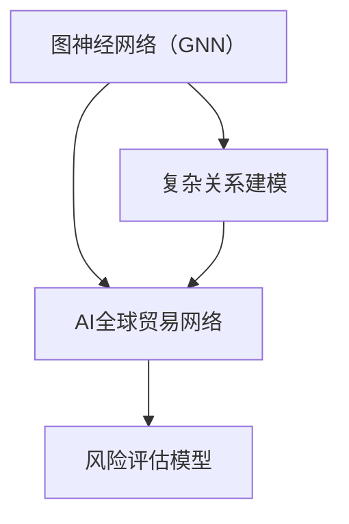

                 

### 引言

在全球化经济一体化的背景下，全球贸易网络已成为经济增长的重要引擎。然而，随着贸易规模的不断扩大和复杂性的增加，贸易风险评估成为了一个具有挑战性的课题。传统的风险评估方法依赖于历史数据和统计分析，往往难以捕捉全球贸易网络中的复杂动态关系。因此，如何利用现代人工智能技术，尤其是图神经网络（Graph Neural Networks, GNNs），来提升贸易网络风险评估的精度和效率，成为了一个亟待解决的研究课题。

#### 研究背景

全球贸易网络由众多国家、企业和商品构成，这些实体通过贸易流相互连接，形成了复杂的网络结构。在全球化的背景下，贸易网络的稳定性对于国家的经济安全和全球经济的稳定具有重要影响。然而，近年来，地缘政治紧张、贸易保护主义抬头、全球供应链中断等因素使得全球贸易网络面临诸多不确定性。这些不确定性增加了贸易风险，对企业的运营和国家经济的稳定性构成了威胁。

#### 当前贸易风险评估的挑战

1. **数据不足**：传统的风险评估方法往往依赖于历史数据，而全球贸易网络的数据获取存在困难，数据不完整和数据质量差的问题较为普遍。
2. **复杂关系难以建模**：全球贸易网络中的关系错综复杂，传统的统计方法难以捕捉和量化这些复杂的动态关系。
3. **时效性**：全球贸易网络的动态变化迅速，传统方法难以实时更新和反映这些变化。
4. **预测精度**：传统方法在预测精度上存在瓶颈，难以提供准确的贸易风险预警。

#### 研究问题与目标

本研究旨在利用图神经网络（GNNs）构建AI全球贸易网络风险评估模型，以提高风险评估的精度和时效性。具体研究问题包括：

1. **如何利用GNNs建模全球贸易网络中的复杂关系？**
2. **如何设计高效的算法来处理大规模的全球贸易网络数据？**
3. **如何评估和优化GNNs在贸易风险评估中的性能？**

研究目标是通过构建AI全球贸易网络风险评估模型，为企业和政府提供实时、准确的贸易风险预警和决策支持。

#### 边界与外延

本文的研究边界主要聚焦于全球贸易网络的拓扑结构和动态变化，涉及的主要实体包括国家、企业和商品。研究的外延包括GNNs的理论基础、模型构建、算法实现以及实际应用。本文将不涉及具体的经济政策分析和实际贸易决策过程。

#### 核心概念

1. **图神经网络（GNN）**：一种专门用于处理图结构数据的神经网络，能够通过图结构学习实体之间的关系。
2. **AI全球贸易网络**：全球贸易网络中通过人工智能技术进行建模和优化的网络结构。
3. **风险评估模型**：用于预测和评估贸易风险的数学模型。

#### 概念关系图

以下是核心概念之间的关系图：

#### 文章结构

本文结构如下：

1. 引言：介绍研究背景、问题与目标、核心概念及文章结构。
2. 图神经网络基础：介绍GNN的基本概念、原理及不同类型的GNN模型。
3. AI全球贸易网络风险评估模型构建：介绍如何利用GNN构建风险评估模型。
4. AI全球贸易网络风险评估模型应用：介绍模型的应用场景、项目实战和案例分析。
5. 总结与展望：总结研究成果，展望未来研究方向。

#### 文章结构概述

本文首先介绍了全球贸易网络的重要性以及当前贸易风险评估的挑战，明确了研究问题和目标。接着，本文详细介绍了图神经网络（GNN）的基本概念、原理以及其在风险评估中的应用。在此基础上，本文探讨了如何利用GNN构建AI全球贸易网络风险评估模型，包括模型构建的流程、风险评估指标体系的建立以及模型的优化方法。

随后，本文深入分析了AI全球贸易网络风险评估模型在实际应用中的具体场景，通过项目实战和案例分析展示了模型的应用效果。最后，本文总结了研究成果，并提出了未来研究的方向和展望。

通过对上述内容的详细阐述，本文旨在为全球贸易网络的风险评估提供一种有效的方法和技术支持，为企业和政府提供科学的决策依据。

