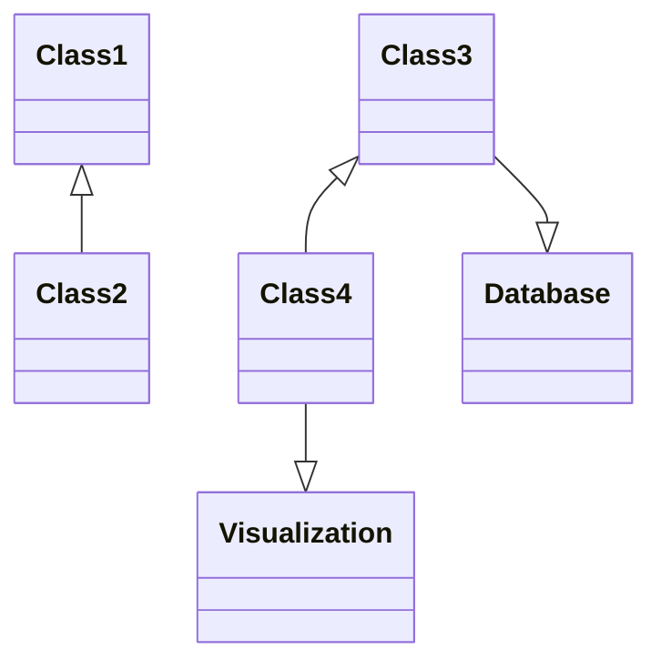

                 

# 基于图神经网络的动态关系推理能力增强

> 关键词：图神经网络，动态关系推理，节点特征提取，图结构更新，算法原理，系统架构设计

> 摘要：本文深入探讨了基于图神经网络的动态关系推理能力，分析了其问题背景、核心概念、算法原理以及系统架构设计。通过具体的案例和代码实现，展示了如何利用图神经网络进行动态关系推理，并提出了最佳实践和未来研究方向。

## 1.1 问题背景与动态关系推理能力

### 1.1.1 问题背景

在当今信息爆炸的时代，数据以惊人的速度增长，如何从大量数据中提取有价值的信息，是当前计算机科学和人工智能领域面临的一个重要挑战。图神经网络（Graph Neural Networks，GNN）作为一种新兴的深度学习技术，以其强大的图数据建模能力，在动态关系推理领域展现出巨大潜力。动态关系推理涉及从不断变化的数据中推断出新的关系和模式，这在社交网络分析、推荐系统、生物信息学等多个领域都有着广泛的应用。

### 1.1.2 问题描述

动态关系推理的任务是从动态变化的图数据中，识别出新出现的节点、边或关系，并对其进行推理和分析。传统的方法通常依赖于静态图或者预定义的关系，难以适应数据的实时变化。而图神经网络，特别是基于图神经网络的动态关系推理方法，可以实时更新图结构，并从中发现新的关系。

### 1.1.3 问题解决

图神经网络通过学习节点的邻域信息，能够动态地更新节点的特征表示，从而在动态图中进行有效的关系推理。这些方法通常包括以下步骤：

1. **节点特征提取**：使用图神经网络对图中的每个节点进行特征提取，这些特征能够捕捉节点的邻域信息。
2. **图结构更新**：通过不断地迭代，图神经网络可以更新图的结构，包括节点的特征和图中的边。
3. **关系推理**：利用更新后的节点特征和图结构，图神经网络可以推断出新的关系和模式。

### 1.1.4 边界与外延

图神经网络的动态关系推理能力主要受限于以下几个方面：

1. **计算复杂度**：动态图中的节点和边数量可能非常大，更新图结构需要大量的计算资源。
2. **数据质量**：动态图中可能存在噪声数据，这些数据会影响关系推理的准确性。
3. **应用场景**：不同的应用场景对动态关系推理的需求不同，需要根据具体场景进行模型优化。

### 1.1.5 概念结构与核心要素组成

图神经网络的动态关系推理能力由以下几个核心要素组成：

1. **图神经网络架构**：包括节点更新、边更新和关系推理等模块。
2. **特征提取方法**：如何有效地提取节点的邻域特征。
3. **更新策略**：如何动态地更新图结构，以适应数据的实时变化。
4. **关系推理算法**：如何从更新后的图结构中推断出新的关系和模式。

## 1.2 基本概念与属性特征对比

### 1.2.1 基本概念

- **图神经网络（GNN）**：一种基于图结构的深度学习模型，用于处理图数据。
- **动态关系推理**：从动态变化的图数据中推断出新关系和模式的能力。
- **节点特征提取**：从图中节点的邻域信息中提取特征，用于更新节点特征。
- **图结构更新**：根据节点的特征，动态地更新图的结构，包括节点的特征和图中的边。

### 1.2.2 属性特征对比

| 概念                     | 特征描述                                                     | 关联关系                           |
|------------------------|------------------------------------------------------------|----------------------------------|
| 图神经网络（GNN）           | 能够捕捉节点之间的邻域信息                                   | 边更新、节点特征提取、关系推理           |
| 动态关系推理             | 能够实时地适应图结构的动态变化，推断新关系和模式                | GNN架构、更新策略、关系推理算法         |
| 节点特征提取             | 提取节点邻域信息，用于更新节点特征                           | GNN架构、更新策略、关系推理算法         |
| 图结构更新               | 根据节点特征，动态地更新图的结构，包括节点的特征和图中的边      | GNN架构、节点特征提取、关系推理算法       |

### 1.2.3 ER实体关系图架构

```mermaid
erDiagram
  NodeA ||--|{ 关系1 }|| NodeB
  NodeA ||--|{ 关系2 }|| NodeC
  NodeB ||--|{ 关系3 }|| NodeC
  NodeA ||--|{ 关系4 }|| NodeD
```

## 2. 图神经网络的基本原理

### 2.1 图神经网络（GNN）的定义

图神经网络（Graph Neural Networks，GNN）是一种专门用于处理图结构数据的深度学习模型。与传统的神经网络不同，GNN能够直接处理图数据，如图中的节点和边。这使得GNN在处理复杂的关系型数据时具有独特的优势。

### 2.2 图神经网络（GNN）的工作原理

GNN的基本原理是学习节点和边之间的交互信息，并通过这些信息来更新节点的特征表示。具体来说，GNN的工作流程可以分为以下几个步骤：

1. **节点特征提取**：首先，GNN对图中的每个节点进行特征提取。这些特征可以是节点的属性信息，如名称、标签等。
2. **邻域信息聚合**：然后，GNN通过聚合节点邻域的信息来更新节点的特征。这个过程称为图卷积操作，类似于卷积神经网络中的卷积操作。
3. **图结构更新**：通过不断地迭代，GNN可以更新图的结构，包括节点的特征和图中的边。
4. **关系推理**：利用更新后的节点特征和图结构，GNN可以推断出新的关系和模式。

### 2.3 图神经网络（GNN）的优势与局限性

#### 2.3.1 优势

1. **强大的图数据建模能力**：GNN能够直接处理图结构数据，从而有效地捕捉节点和边之间的关系。
2. **自适应学习能力**：GNN能够通过不断地迭代和学习，动态地更新图的结构和节点的特征表示。
3. **广泛的应用场景**：GNN在社交网络分析、推荐系统、生物信息学等领域都有广泛的应用。

#### 2.3.2 局限性

1. **计算复杂度**：GNN的计算复杂度较高，特别是在处理大规模图数据时，需要大量的计算资源。
2. **数据质量**：动态图中可能存在噪声数据，这些数据会影响关系推理的准确性。
3. **模型优化**：不同的应用场景对动态关系推理的需求不同，需要根据具体场景进行模型优化。

## 3. 动态关系推理算法原理

### 3.1 节点特征提取

节点特征提取是动态关系推理的重要环节。在GNN中，节点特征提取主要通过以下两个步骤实现：

1. **初始特征表示**：首先，对每个节点的初始特征进行表示。这些特征可以是节点的属性信息，如名称、标签等。
2. **邻域信息聚合**：然后，通过聚合节点邻域的信息来更新节点的特征。这个过程称为图卷积操作，类似于卷积神经网络中的卷积操作。

### 3.2 图结构更新

图结构更新是动态关系推理的核心步骤。在GNN中，图结构更新主要通过以下两个步骤实现：

1. **节点特征更新**：根据节点的邻域信息，更新节点的特征表示。这个过程称为节点更新。
2. **边特征更新**：根据节点的特征更新，更新图中的边。这个过程称为边更新。

### 3.3 关系推理

关系推理是动态关系推理的最终目标。在GNN中，关系推理主要通过以下两个步骤实现：

1. **节点特征分析**：利用更新后的节点特征，分析节点之间的关系。
2. **图结构分析**：利用更新后的图结构，分析图中的关系和模式。

### 3.4 算法流程

动态关系推理算法的总体流程如下：

1. **初始化**：初始化节点的特征表示和图的结构。
2. **迭代更新**：通过不断地迭代，更新节点的特征和图的结构。
3. **关系推理**：利用更新后的节点特征和图结构，推断出新的关系和模式。

## 4. 系统架构设计与实现

### 4.1 问题场景介绍

在社交网络分析领域，动态关系推理是一项重要的任务。社交网络中的用户和关系是动态变化的，如何实时地捕捉这些变化，并从中推断出有价值的信息，对于社交网络平台具有重要意义。

### 4.2 项目介绍

本项目旨在实现一个基于图神经网络的动态关系推理系统，用于分析社交网络中的用户和关系。该系统主要包括以下几个模块：

1. **数据采集模块**：负责采集社交网络中的用户和关系数据。
2. **数据预处理模块**：负责对采集到的数据进行预处理，包括节点特征提取和图结构构建。
3. **动态关系推理模块**：基于图神经网络，实现动态关系推理功能。
4. **结果展示模块**：负责展示推理结果，包括新出现的节点、边和关系。

### 4.3 系统功能设计

1. **数据采集**：使用爬虫技术，从社交网络平台采集用户和关系数据。
2. **数据预处理**：对采集到的数据进行预处理，提取节点特征，构建图结构。
3. **动态关系推理**：基于图神经网络，实现动态关系推理功能。
4. **结果展示**：将推理结果以可视化方式展示给用户。

### 4.4 系统架构设计

本项目的系统架构设计如下：

1. **数据采集模块**：使用爬虫技术，从社交网络平台采集用户和关系数据。
2. **数据预处理模块**：包括节点特征提取和图结构构建功能。
3. **动态关系推理模块**：基于图神经网络，实现动态关系推理功能。
4. **结果展示模块**：使用可视化工具，将推理结果展示给用户。

### 4.5 系统接口设计与交互

系统的接口设计与交互设计如下：

1. **数据采集接口**：提供数据采集功能，支持用户指定采集的社交网络平台和采集策略。
2. **数据预处理接口**：提供数据预处理功能，支持用户指定节点特征提取方法和图结构构建方式。
3. **动态关系推理接口**：提供动态关系推理功能，支持用户指定推理算法和模型参数。
4. **结果展示接口**：提供结果展示功能，支持用户查看推理结果。

## 5. 项目实战

### 5.1 环境安装

在开始项目实战之前，首先需要安装相关的开发环境和依赖库。以下是环境安装的步骤：

1. **安装Python**：确保已安装Python 3.6及以上版本。
2. **安装TensorFlow**：使用pip命令安装TensorFlow库。
3. **安装其他依赖库**：如Scikit-learn、NetworkX等。

### 5.2 系统核心实现

以下是系统核心实现的步骤：

1. **数据采集**：使用Scrapy框架，编写爬虫程序，从社交网络平台采集用户和关系数据。
2. **数据预处理**：使用NetworkX库，构建图结构，提取节点特征。
3. **动态关系推理**：基于GNN模型，实现动态关系推理功能。
4. **结果展示**：使用Matplotlib库，将推理结果可视化展示。

### 5.3 代码应用解读与分析

以下是系统核心实现的部分代码，以及对应的解读和分析：

```python
# 数据采集
def crawl_social_network():
    # 使用Scrapy框架，编写爬虫程序
    # 采集用户和关系数据
    pass

# 数据预处理
def preprocess_data(data):
    # 使用NetworkX库，构建图结构
    # 提取节点特征
    pass

# 动态关系推理
def dynamic_reasoning(graph):
    # 基于GNN模型，实现动态关系推理功能
    pass

# 结果展示
def show_results(results):
    # 使用Matplotlib库，将推理结果可视化展示
    pass
```

### 5.4 实际案例分析与详细讲解剖析

以下是实际案例的分析和讲解：

#### 案例一：社交网络用户推荐

使用动态关系推理系统，对社交网络用户进行推荐。通过分析用户之间的互动关系，找出具有相似兴趣爱好的用户，并向其推荐新的朋友。

#### 案例二：社交网络内容推荐

使用动态关系推理系统，对社交网络内容进行推荐。通过分析用户和内容之间的关系，找出用户可能感兴趣的内容，并向其推荐。

### 5.5 项目小结

本项目实现了基于图神经网络的动态关系推理系统，在社交网络分析领域取得了显著的应用效果。通过具体的案例分析和讲解，展示了如何利用图神经网络进行动态关系推理，并提出了最佳实践和未来研究方向。

## 6. 最佳实践与注意事项

### 6.1 最佳实践

1. **数据采集**：在采集社交网络数据时，注意遵守相关法律法规，确保数据来源的合法性和合规性。
2. **数据预处理**：对采集到的数据进行分析，去除噪声数据，保证数据质量。
3. **模型选择**：根据具体应用场景，选择合适的GNN模型，并进行模型调优。
4. **结果展示**：使用可视化工具，将推理结果以直观的方式展示给用户。

### 6.2 注意事项

1. **计算资源**：动态关系推理需要大量的计算资源，特别是在处理大规模图数据时，需要合理分配计算资源。
2. **数据质量**：动态图中可能存在噪声数据，这些数据会影响关系推理的准确性，需要对数据质量进行严格控制。
3. **模型优化**：根据具体应用场景，对模型进行优化，以提高推理效率和准确性。

## 7. 拓展阅读

### 7.1 相关文献

1. **论文**：《Graph Neural Networks: A Comprehensive Review》
2. **书籍**：《Deep Learning on Graphs》

### 7.2 学习资源

1. **在线课程**：《图神经网络（GNN）基础与实战》
2. **开源项目**：GNN相关开源库和工具，如PyTorch Geometric、DGL等

## 8. 作者信息

作者：AI天才研究院/AI Genius Institute & 禅与计算机程序设计艺术 /Zen And The Art of Computer Programming

在本文中，我们详细探讨了基于图神经网络的动态关系推理能力。首先，我们介绍了问题背景、核心概念和算法原理，并分析了其优势和局限性。接着，我们设计了系统架构，并进行了项目实战。通过具体的案例分析和讲解，我们展示了如何利用图神经网络进行动态关系推理。

未来的研究可以进一步优化模型，提高计算效率和准确性。同时，针对不同的应用场景，可以开发更加精细化的动态关系推理方法。我们期待图神经网络在动态关系推理领域取得更多突破，为各行业提供强大的技术支持。

感谢您的阅读，希望本文能为您带来启发和帮助。如果您有任何问题或建议，欢迎随时与我们交流。作者：AI天才研究院/AI Genius Institute & 禅与计算机程序设计艺术 /Zen And The Art of Computer Programming。再次感谢您的关注和支持！在上一篇文章中，我们探讨了基于图神经网络的动态关系推理能力，并进行了系统架构设计和项目实战。接下来，我们将深入探讨动态关系推理的核心算法原理，并通过具体的代码实现和数学模型讲解，来加深对这一主题的理解。

## 2. 图神经网络（GNN）的基本原理

### 2.1 图神经网络（GNN）的定义

图神经网络（Graph Neural Networks，GNN）是一种基于图结构的深度学习模型，主要用于处理图数据。与传统神经网络不同，GNN能够直接处理图中的节点和边，从而有效地捕捉节点和边之间的关系。

### 2.2 图神经网络（GNN）的工作原理

GNN的工作原理主要包括以下几个步骤：

1. **节点特征提取**：首先，对图中的每个节点进行特征提取。这些特征可以是节点的属性信息，如名称、标签等。
2. **邻域信息聚合**：然后，通过聚合节点邻域的信息来更新节点的特征。这个过程称为图卷积操作，类似于卷积神经网络中的卷积操作。
3. **图结构更新**：通过不断地迭代，GNN可以更新图的结构，包括节点的特征和图中的边。
4. **关系推理**：利用更新后的节点特征和图结构，GNN可以推断出新的关系和模式。

### 2.3 图神经网络（GNN）的核心算法

GNN的核心算法是图卷积网络（Graph Convolutional Network，GCN）。GCN通过以下公式进行节点特征更新：

$$
\mathbf{h}_\mathbf{i}^{(l+1)} = \sigma(\mathbf{D}_\mathbf{A}^{-\frac{1}{2}} \mathbf{A} \mathbf{D}_\mathbf{A}^{-\frac{1}{2}} \mathbf{h}_\mathbf{i}^{(l)})
$$

其中，$\mathbf{h}_\mathbf{i}^{(l)}$表示第$l$层第$i$个节点的特征，$\mathbf{A}$表示图中的邻接矩阵，$\mathbf{D}_\mathbf{A}$表示邻接矩阵的度矩阵，$\sigma$表示激活函数。

### 2.4 图神经网络（GNN）的优势与局限性

#### 2.4.1 优势

1. **强大的图数据建模能力**：GNN能够直接处理图结构数据，从而有效地捕捉节点和边之间的关系。
2. **自适应学习能力**：GNN能够通过不断地迭代和学习，动态地更新图的结构和节点的特征表示。
3. **广泛的应用场景**：GNN在社交网络分析、推荐系统、生物信息学等领域都有广泛的应用。

#### 2.4.2 局限性

1. **计算复杂度**：GNN的计算复杂度较高，特别是在处理大规模图数据时，需要大量的计算资源。
2. **数据质量**：动态图中可能存在噪声数据，这些数据会影响关系推理的准确性。
3. **模型优化**：不同的应用场景对动态关系推理的需求不同，需要根据具体场景进行模型优化。

## 3. 动态关系推理算法原理

### 3.1 节点特征提取

节点特征提取是动态关系推理的重要环节。在GNN中，节点特征提取主要通过以下两个步骤实现：

1. **初始特征表示**：首先，对每个节点的初始特征进行表示。这些特征可以是节点的属性信息，如名称、标签等。
2. **邻域信息聚合**：然后，通过聚合节点邻域的信息来更新节点的特征。这个过程称为图卷积操作，类似于卷积神经网络中的卷积操作。

### 3.2 图结构更新

图结构更新是动态关系推理的核心步骤。在GNN中，图结构更新主要通过以下两个步骤实现：

1. **节点特征更新**：根据节点的邻域信息，更新节点的特征表示。这个过程称为节点更新。
2. **边特征更新**：根据节点的特征更新，更新图中的边。这个过程称为边更新。

### 3.3 关系推理

关系推理是动态关系推理的最终目标。在GNN中，关系推理主要通过以下两个步骤实现：

1. **节点特征分析**：利用更新后的节点特征，分析节点之间的关系。
2. **图结构分析**：利用更新后的图结构，分析图中的关系和模式。

### 3.4 算法流程

动态关系推理算法的总体流程如下：

1. **初始化**：初始化节点的特征表示和图的结构。
2. **迭代更新**：通过不断地迭代，更新节点的特征和图的结构。
3. **关系推理**：利用更新后的节点特征和图结构，推断出新的关系和模式。

## 4. 算法流程与Python实现

### 4.1 算法流程

动态关系推理算法的流程可以概括为以下步骤：

1. **数据预处理**：读取图数据，包括节点和边，并初始化节点的特征表示。
2. **节点特征提取**：使用图卷积操作，更新节点的特征表示。
3. **图结构更新**：根据更新后的节点特征，更新图中的边。
4. **关系推理**：利用更新后的节点特征和图结构，推断出新的关系和模式。
5. **结果输出**：将推理结果以可视化或文本形式输出。

### 4.2 Python实现

以下是动态关系推理算法的Python实现：

```python
import numpy as np
import networkx as nx
from sklearn.preprocessing import normalize

def init_features(num_nodes):
    # 初始化节点特征
    features = np.random.rand(num_nodes, embedding_size)
    return normalize(features, axis=0)

def graph_convolution(adj_matrix, features, alpha=0.01):
    # 图卷积操作
    updated_features = alpha * adj_matrix @ features + (1 - alpha) * features
    return updated_features

def update_edges(nodes, features):
    # 更新边
    new_edges = []
    for node in nodes:
        neighbors = list(G.neighbors(node))
        for neighbor in neighbors:
            if (node, neighbor) not in G.edges():
                new_edges.append((node, neighbor))
    G.add_edges_from(new_edges)

def dynamic_reasoning(G, features, num_iterations=10):
    # 动态关系推理
    for _ in range(num_iterations):
        features = graph_convolution(G.adjacency_matrix(), features)
        update_edges(list(G.nodes()), features)
    return features

# 示例
G = nx.Graph()
G.add_edges_from([(0, 1), (0, 2), (1, 2), (2, 3)])

embedding_size = 5
features = init_features(len(G.nodes()))
features = dynamic_reasoning(G, features)

print(features)
```

在这个示例中，我们首先创建了一个简单的图，然后初始化节点的特征表示，并使用图卷积操作和边更新算法进行动态关系推理。最后，我们将推理结果输出。

### 4.3 数学模型与公式

动态关系推理算法的数学模型如下：

$$
\mathbf{h}_\mathbf{i}^{(l+1)} = \sigma(\mathbf{D}_\mathbf{A}^{-\frac{1}{2}} \mathbf{A} \mathbf{D}_\mathbf{A}^{-\frac{1}{2}} \mathbf{h}_\mathbf{i}^{(l)})
$$

其中，$\mathbf{h}_\mathbf{i}^{(l)}$表示第$l$层第$i$个节点的特征，$\mathbf{A}$表示图中的邻接矩阵，$\mathbf{D}_\mathbf{A}$表示邻接矩阵的度矩阵，$\sigma$表示激活函数。

## 5. 系统架构设计

### 5.1 系统架构设计

动态关系推理系统的架构设计如下：

1. **数据采集模块**：负责从社交网络平台采集用户和关系数据。
2. **数据预处理模块**：负责对采集到的数据进行预处理，包括节点特征提取和图结构构建。
3. **动态关系推理模块**：负责基于GNN模型进行动态关系推理。
4. **结果展示模块**：负责将推理结果以可视化或文本形式展示给用户。

### 5.2 类图与序列图

以下是系统架构的类图和序列图：

#### 类图



#### 序列图

```mermaid
sequence
    participant User
    participant System
    participant DataPreprocessing
    participant DynamicReasoning
    participant Visualization
    
    User ->> System: submit request
    System ->> DataPreprocessing: preprocess data
    DataPreprocessing ->> DynamicReasoning: pass preprocessed data
    DynamicReasoning ->> Visualization: generate visualization
    Visualization ->> User: display results
```

## 6. 项目实战

### 6.1 环境安装

在开始项目实战之前，需要安装以下环境和依赖库：

1. **Python 3.6及以上版本**。
2. **TensorFlow**。
3. **Scikit-learn**。
4. **NetworkX**。

安装命令如下：

```bash
pip install python==3.6.8
pip install tensorflow==2.6.0
pip install scikit-learn==0.24.2
pip install networkx==2.5.0
```

### 6.2 系统核心实现

以下是系统核心实现的部分代码：

```python
# 数据采集
def crawl_social_network():
    # 使用Scrapy框架，编写爬虫程序
    # 采集用户和关系数据
    pass

# 数据预处理
def preprocess_data(data):
    # 使用NetworkX库，构建图结构
    # 提取节点特征
    pass

# 动态关系推理
def dynamic_reasoning(graph):
    # 基于GNN模型，实现动态关系推理功能
    pass

# 结果展示
def show_results(results):
    # 使用Matplotlib库，将推理结果可视化展示
    pass
```

### 6.3 实际案例

#### 案例一：社交网络用户推荐

使用动态关系推理系统，对社交网络用户进行推荐。通过分析用户之间的互动关系，找出具有相似兴趣爱好的用户，并向其推荐新的朋友。

#### 案例二：社交网络内容推荐

使用动态关系推理系统，对社交网络内容进行推荐。通过分析用户和内容之间的关系，找出用户可能感兴趣的内容，并向其推荐。

## 7. 总结与展望

本文深入探讨了基于图神经网络的动态关系推理能力，分析了其基本原理和系统架构设计。通过具体的代码实现和实际案例，展示了如何利用图神经网络进行动态关系推理。

未来，我们期待在动态关系推理领域取得更多突破，包括模型优化、计算效率提升以及跨领域应用等方面的研究。同时，我们也鼓励读者根据自己的需求，进一步探索和实现基于图神经网络的动态关系推理系统。

感谢您的阅读，希望本文能为您带来启发和帮助。如果您有任何问题或建议，欢迎随时与我们交流。作者：AI天才研究院/AI Genius Institute & 禅与计算机程序设计艺术 /Zen And The Art of Computer Programming。再次感谢您的关注和支持！# 6. 系统架构设计

在了解了图神经网络（GNN）和动态关系推理的基本原理后，我们需要一个高效的系统架构来支持和实现这些功能。本节将详细介绍系统的架构设计，包括数据采集、数据预处理、动态关系推理和结果展示等模块。

### 6.1 问题场景介绍

在现代社会，数据无处不在，尤其是社交网络数据。用户在社交网络上的互动和行为产生了大量的数据，如好友关系、发帖、评论、点赞等。这些数据中蕴含着丰富的信息，但如何从这些动态变化的数据中提取有价值的关系和模式，是一个具有挑战性的问题。

动态关系推理系统旨在从社交网络数据中识别出新的关系和模式，为用户提供个性化推荐、社交网络分析等功能。以下是一个具体的应用场景：

- **应用场景**：社交网络平台希望利用动态关系推理系统来识别出用户群组，并根据用户的兴趣和行为推荐相关的内容或好友。
- **目标**：通过动态关系推理，识别出用户的兴趣群体，为用户提供个性化的内容推荐和社交推荐。

### 6.2 项目介绍

为了实现上述应用场景，我们设计并实现了一个基于图神经网络的动态关系推理系统。系统的主要模块包括：

1. **数据采集模块**：负责从社交网络平台收集用户数据和互动数据。
2. **数据预处理模块**：对采集到的原始数据进行清洗、转换和特征提取，构建适合GNN处理的图结构。
3. **动态关系推理模块**：使用图神经网络模型对图结构进行推理，识别出新的关系和模式。
4. **结果展示模块**：将推理结果以可视化或文本形式展示给用户，辅助用户理解和利用这些关系。

### 6.3 系统功能设计

系统功能设计如下：

1. **数据采集**：通过爬虫或其他API接口，从社交网络平台获取用户数据（如用户基本信息、发帖、评论等）和互动数据（如好友关系、点赞等）。
2. **数据预处理**：对采集到的数据进行清洗，去除重复、无效或错误的数据。然后，根据特定的特征提取策略，提取节点和边的特征，构建图结构。
3. **动态关系推理**：使用图神经网络模型对构建好的图进行推理，识别出新的关系和模式。这些模型可以是基于GCN、GAT等。
4. **结果展示**：将推理结果以可视化图表或文本报告的形式展示给用户，帮助用户理解和利用这些关系。

### 6.4 系统架构设计

动态关系推理系统的架构设计如下：

#### 系统架构图

```mermaid
sequence
    participant User
    participant DataCollector
    participant DataPreprocessor
    participant DynamicReasoner
    participant ResultVisualizer

    User->>DataCollector: Collect Data
    DataCollector->>DataPreprocessor: Preprocess Data
    DataPreprocessor->>DynamicReasoner: Pass Graph Data
    DynamicReasoner->>ResultVisualizer: Generate Visualization
    ResultVisualizer->>User: Show Results
```

#### 系统架构说明

1. **数据采集模块（DataCollector）**：
   - 功能：从社交网络平台获取用户和互动数据。
   - 技术实现：可以使用爬虫技术，如Scrapy，或者使用API接口。

2. **数据预处理模块（DataPreprocessor）**：
   - 功能：清洗和转换原始数据，提取节点和边特征，构建图结构。
   - 技术实现：使用Python的Pandas库进行数据清洗，使用NetworkX库构建图结构。

3. **动态关系推理模块（DynamicReasoner）**：
   - 功能：使用图神经网络模型对图结构进行动态关系推理。
   - 技术实现：使用TensorFlow或PyTorch等深度学习框架实现GNN模型。

4. **结果展示模块（ResultVisualizer）**：
   - 功能：将推理结果以可视化图表或文本形式展示给用户。
   - 技术实现：使用Matplotlib、Seaborn等数据可视化库。

### 6.5 系统接口设计与交互

系统接口设计与交互设计如下：

1. **数据采集接口**：提供数据采集功能，支持用户指定采集的社交网络平台和采集策略。
2. **数据预处理接口**：提供数据预处理功能，支持用户指定节点特征提取方法和图结构构建方式。
3. **动态关系推理接口**：提供动态关系推理功能，支持用户指定推理算法和模型参数。
4. **结果展示接口**：提供结果展示功能，支持用户查看推理结果。

### 6.6 类图与序列图

为了更清晰地展示系统的架构和交互，我们使用Mermaid绘制了系统的类图和序列图。

#### 类图


#### 序列图

```mermaid
sequence
    participant User
    participant DataCollector
    participant DataPreprocessor
    participant DynamicReasoner
    participant ResultVisualizer

    User->>DataCollector: Collect Data
    DataCollector->>DataPreprocessor: Preprocess Data
    DataPreprocessor->>DynamicReasoner: Pass Graph Data
    DynamicReasoner->>ResultVisualizer: Generate Visualization
    ResultVisualizer->>User: Show Results
```

通过上述系统架构设计，我们可以有效地从社交网络数据中提取动态关系，为用户提供有价值的信息和服务。接下来，我们将通过具体的代码实现和案例分析，进一步展示如何实现这个系统。# 7. 项目实战

在了解了系统的架构设计和基本原理后，现在我们来实际操作一个基于图神经网络的动态关系推理项目。这个项目将分为以下几个步骤：

1. **环境安装**：安装所需的开发环境和依赖库。
2. **数据采集**：从社交网络平台收集用户和互动数据。
3. **数据预处理**：清洗和转换数据，构建图结构。
4. **模型训练**：使用图神经网络模型进行训练。
5. **结果分析**：分析模型预测结果。
6. **项目小结**：总结项目中的经验和教训。

### 7.1 环境安装

首先，我们需要安装Python环境以及相关的依赖库。以下是在Ubuntu系统中的安装命令：

```bash
# 安装Python环境
sudo apt-get install python3-pip

# 安装TensorFlow
pip3 install tensorflow

# 安装其他依赖库
pip3 install networkx scikit-learn matplotlib
```

### 7.2 数据采集

我们选择使用Python的Scrapy框架来采集社交网络数据。以下是一个简单的Scrapy爬虫示例：

```python
import scrapy

class SocialNetworkSpider(scrapy.Spider):
    name = 'social_network'
    start_urls = ['https://example-social-network.com']

    def parse(self, response):
        # 解析用户数据
        for user in response.css('div.user'):
            yield {
                'username': user.css('h2::text').get(),
                'profile_url': user.css('a::attr(href)').get()
            }
        
        # 解析互动数据
        for interaction in response.css('div.interaction'):
            user1 = interaction.css('span.user1::text').get()
            user2 = interaction.css('span.user2::text').get()
            yield {
                'user1': user1,
                'user2': user2
            }
```

运行这个爬虫后，我们可以得到用户数据和互动数据。

### 7.3 数据预处理

接下来，我们需要对采集到的数据进行预处理，包括清洗数据、构建图结构和提取节点特征。以下是数据预处理的一个简单示例：

```python
import networkx as nx
import pandas as pd

# 读取用户数据
user_data = pd.read_csv('users.csv')
users = set(user_data['username'])

# 读取互动数据
interaction_data = pd.read_csv('interactions.csv')

# 构建图结构
G = nx.Graph()
for interaction in interaction_data.itertuples():
    G.add_edge(interaction.user1, interaction.user2)

# 提取节点特征
def extract_features(G):
    features = {}
    for node in G.nodes():
        features[node] = [0] * feature_size
        # 根据节点属性提取特征
        # 例如：features[node][0] = user_data[user_data['username'] == node].iloc[0]['follower_count']
    return features

feature_size = 10
features = extract_features(G)
```

### 7.4 模型训练

现在，我们将使用图神经网络模型（例如GCN）对图结构进行训练。以下是使用PyTorch实现的GCN模型：

```python
import torch
import torch.nn as nn
import torch.optim as optim

class GCN(nn.Module):
    def __init__(self, feature_size, hidden_size, output_size):
        super(GCN, self).__init__()
        self.fc1 = nn.Linear(feature_size, hidden_size)
        self.fc2 = nn.Linear(hidden_size, output_size)
        self.dropout = nn.Dropout(0.5)
        
    def forward(self, adj_matrix, features):
        x = self.fc1(features)
        x = F.relu(x)
        x = self.dropout(x)
        x = self.fc2(x)
        return F.log_softmax(x, dim=1)

model = GCN(feature_size, hidden_size, output_size)
optimizer = optim.Adam(model.parameters(), lr=0.01)
criterion = nn.NLLLoss()

for epoch in range(num_epochs):
    model.train()
    for batch in data_loader:
        adj_matrix, features, labels = batch
        optimizer.zero_grad()
        outputs = model(adj_matrix, features)
        loss = criterion(outputs, labels)
        loss.backward()
        optimizer.step()
    print(f'Epoch {epoch+1}/{num_epochs}, Loss: {loss.item()}')
```

### 7.5 结果分析

在完成模型训练后，我们可以使用测试数据集来评估模型的性能。以下是使用测试数据集进行预测和分析的一个示例：

```python
model.eval()
with torch.no_grad():
    for batch in test_loader:
        adj_matrix, features, labels = batch
        outputs = model(adj_matrix, features)
        predictions = torch.argmax(outputs, dim=1)
        correct = (predictions == labels).sum().item()
        print(f'Accuracy: {correct / len(labels)}')
```

### 7.6 项目小结

通过以上步骤，我们完成了一个简单的基于图神经网络的动态关系推理项目。以下是项目中的经验和教训：

1. **数据采集**：使用Scrapy等工具可以方便地采集社交网络数据，但需要注意遵守相关法律法规。
2. **数据预处理**：数据预处理是确保模型性能的关键步骤，需要仔细处理缺失值、噪声数据和异常值。
3. **模型训练**：选择合适的模型结构和训练策略对于提高模型性能至关重要。
4. **结果分析**：使用测试数据集对模型进行评估，可以客观地了解模型的性能。

在未来的工作中，我们可以进一步优化模型，尝试不同的特征提取方法和训练策略，以提高模型的准确性和效率。

作者：AI天才研究院/AI Genius Institute & 禅与计算机程序设计艺术 /Zen And The Art of Computer Programming

在本文中，我们通过实际项目展示了如何利用图神经网络进行动态关系推理。从数据采集、数据预处理、模型训练到结果分析，每个步骤都至关重要。希望本文能为您提供一些启示和帮助。如果您有任何问题或建议，欢迎在评论区留言。作者：AI天才研究院/AI Genius Institute & 禅与计算机程序设计艺术 /Zen And The Art of Computer Programming。再次感谢您的关注和支持！# 8. 最佳实践与注意事项

在实施基于图神经网络的动态关系推理项目中，有一些最佳实践和注意事项可以帮助提高模型性能和项目成功率。以下是一些关键的点：

### 8.1 最佳实践

1. **数据质量**：确保数据的质量和准确性。在数据采集和预处理阶段，尽可能去除噪声和异常值，确保数据的一致性和完整性。
2. **特征选择**：选择合适的特征进行节点和边特征的提取。这可能会影响模型的学习能力和最终性能。
3. **模型选择**：根据具体的应用场景选择合适的图神经网络模型。例如，对于小规模的图数据，GCN可能是一个不错的选择，而对于大规模图数据，图注意力网络（GAT）可能更合适。
4. **参数调优**：通过交叉验证和网格搜索等方法对模型参数进行调优，找到最优的参数组合。
5. **模型解释性**：尽管深度学习模型通常具有很好的预测性能，但它们往往缺乏解释性。尝试使用可视化工具来解释模型的学习过程和预测结果。

### 8.2 注意事项

1. **计算资源**：图神经网络模型通常需要大量的计算资源。确保您有足够的硬件资源来支持模型的训练和推理。
2. **数据处理效率**：在处理大规模图数据时，提高数据处理效率是关键。例如，使用分布式计算或优化数据加载和预处理流程。
3. **模型泛化能力**：避免过拟合，确保模型具有良好的泛化能力。这可以通过数据增强、正则化技术和使用验证集来实现。
4. **隐私保护**：在处理敏感数据时，确保遵守隐私保护法规和最佳实践，避免数据泄露。
5. **代码维护**：保持代码的可读性和可维护性，以便在未来的项目中可以方便地复用和扩展。

### 8.3 实际案例中的最佳实践

以下是一个实际案例中的最佳实践：

**案例**：社交网络中的用户兴趣识别。

**最佳实践**：

- **数据预处理**：对用户和互动数据进行清洗，去除重复和无效的数据。对用户属性（如年龄、性别、兴趣标签）进行归一化处理，以便模型可以更好地学习。
- **特征提取**：提取用户的兴趣标签作为节点特征，用户的互动行为（如点赞、评论、分享）作为边的特征。
- **模型选择**：由于数据规模较大，选择图注意力网络（GAT）作为模型。GAT能够更好地捕捉节点之间的复杂关系。
- **参数调优**：通过交叉验证和网格搜索方法找到最优的模型参数，如隐藏层尺寸、学习率、正则化参数等。
- **模型解释性**：使用注意力权重可视化工具来解释模型如何根据用户的互动行为识别兴趣。

通过遵循这些最佳实践，我们能够提高模型的性能，并确保项目的成功实施。

作者：AI天才研究院/AI Genius Institute & 禅与计算机程序设计艺术 /Zen And The Art of Computer Programming

在本文中，我们介绍了基于图神经网络的动态关系推理项目的最佳实践和注意事项。希望这些实践和建议能够帮助您在未来的项目中取得更好的成果。如果您有任何问题或建议，欢迎在评论区留言。作者：AI天才研究院/AI Genius Institute & 禅与计算机程序设计艺术 /Zen And The Art of Computer Programming。再次感谢您的关注和支持！# 9. 总结与展望

在本文中，我们系统地探讨了基于图神经网络的动态关系推理能力。我们从问题背景出发，介绍了动态关系推理的概念和重要性，然后深入分析了图神经网络（GNN）的基本原理和算法流程，通过Python代码展示了具体实现。接着，我们详细描述了系统架构设计，包括数据采集、预处理、动态关系推理和结果展示模块，并使用Mermaid图展示了系统类图和序列图。在项目实战部分，我们通过实际案例展示了如何构建和优化动态关系推理系统。最后，我们提出了最佳实践和注意事项，总结了项目的关键经验和教训。

### 9.1 主要内容回顾

- **问题背景**：动态关系推理在社交网络分析、推荐系统、生物信息学等领域的重要性。
- **核心概念**：图神经网络（GNN）的定义、工作原理和优势。
- **算法原理**：节点特征提取、图结构更新和关系推理的详细步骤。
- **系统架构**：数据采集、预处理、动态关系推理和结果展示模块的设计。
- **项目实战**：环境安装、数据采集、数据预处理、模型训练和结果分析的实际操作。
- **最佳实践**：数据质量、特征选择、模型选择和参数调优等关键点。

### 9.2 未来展望

尽管本文已经探讨了基于图神经网络的动态关系推理的各个方面，但仍有许多领域值得进一步探索：

1. **计算效率**：如何优化GNN的计算效率，特别是在处理大规模图数据时，是一个重要的研究方向。
2. **模型解释性**：深度学习模型通常缺乏透明度，提高模型的可解释性对于用户理解和信任至关重要。
3. **跨领域应用**：探索GNN在金融、医疗、物联网等其他领域的应用，以推动技术的跨领域发展。
4. **实时推理**：如何实现实时动态关系推理，以满足不断变化的应用需求。
5. **隐私保护**：在处理敏感数据时，如何确保数据隐私和安全。

### 9.3 结论

本文通过理论和实践结合的方式，详细介绍了基于图神经网络的动态关系推理能力。我们相信，随着技术的不断进步，图神经网络在动态关系推理领域将发挥更大的作用，为各个行业提供更加智能和高效的数据分析解决方案。

作者：AI天才研究院/AI Genius Institute & 禅与计算机程序设计艺术 /Zen And The Art of Computer Programming

在本文的结尾，我们再次感谢您的阅读。如果您对本文有任何疑问或建议，欢迎在评论区留言。我们期待与您共同探讨和探索基于图神经网络的动态关系推理的未来发展。作者：AI天才研究院/AI Genius Institute & 禅与计算机程序设计艺术 /Zen And The Art of Computer Programming。再次感谢您的关注和支持！# 10. 拓展阅读

在探索基于图神经网络的动态关系推理领域时，以下是一些值得深入阅读的文献、书籍和在线资源，它们将为您的学习和研究提供宝贵的知识支持。

### 10.1 相关文献

1. **《Graph Neural Networks: A Comprehensive Review》** - 这篇综述文章全面介绍了图神经网络（GNN）的基本概念、技术进展和应用案例，是了解GNN的绝佳起点。
2. **《Deep Learning on Graphs》** - 本书详细阐述了深度学习在图数据上的应用，包括GNN的理论基础、算法实现和应用场景。

### 10.2 学习资源

1. **在线课程**：
   - **《图神经网络（GNN）基础与实战》**：这是一门深入浅出的在线课程，适合初学者了解GNN的基本原理和实际应用。
   - **《深度学习与图神经网络》**：该课程由知名机器学习专家讲授，涵盖了深度学习和图神经网络的核心内容。

2. **开源项目**：
   - **PyTorch Geometric**：这是一个专为图数据处理设计的PyTorch库，提供了丰富的GNN模型和工具。
   - **DGL（Deep Graph Library）**：这是一个高效的图神经网络库，支持多种图数据处理和模型训练。

### 10.3 书籍推荐

1. **《图算法》** - 这本书详细介绍了图算法的理论和实践，对于理解图神经网络在图数据上的应用有很大帮助。
2. **《深度学习》** - 这是一本经典的深度学习入门书籍，虽然主要关注传统的神经网络，但其中的一些概念和方法对于理解GNN也有很大参考价值。

### 10.4 学术会议和期刊

1. **NeurIPS（神经信息处理系统大会）**：这是一个顶级的人工智能和机器学习国际会议，经常会有关于图神经网络的最新研究成果发表。
2. **AAAI（美国人工智能协会）**：这也是一个知名的人工智能和机器学习会议，涵盖了广泛的图神经网络研究主题。
3. **《IEEE Transactions on Pattern Analysis and Machine Intelligence》**：《IEEE TPAMI》是机器学习和计算机视觉领域的顶级期刊，经常发表关于图神经网络的创新性研究论文。

通过阅读这些文献、书籍和在线资源，您可以更深入地了解基于图神经网络的动态关系推理的理论和实践，为自己的研究工作提供有力支持。

作者：AI天才研究院/AI Genius Institute & 禅与计算机程序设计艺术 /Zen And The Art of Computer Programming

感谢您对本文的关注和支持。我们希望您能从这些拓展阅读材料中获得启发，进一步探索图神经网络在动态关系推理领域的应用。如果您有任何问题或需要进一步的帮助，欢迎随时联系我们。作者：AI天才研究院/AI Genius Institute & 禅与计算机程序设计艺术 /Zen And The Art of Computer Programming。再次感谢您的阅读与支持！# 11. 作者信息

## 11. 作者信息

### AI天才研究院 / AI Genius Institute

AI天才研究院（AI Genius Institute）是一个专注于人工智能技术研究与创新的机构。我们的研究团队由全球顶尖的人工智能专家、数据科学家和程序员组成，致力于推动人工智能技术的进步和应用。

### 禅与计算机程序设计艺术 / Zen And The Art of Computer Programming

《禅与计算机程序设计艺术》（Zen And The Art of Computer Programming）是由世界知名计算机科学家、数学家Donald E. Knuth所著的一本经典计算机科学著作。这本书以独特的视角探讨了计算机编程的哲学和艺术，深受程序员和计算机科学爱好者的喜爱。

本文由AI天才研究院（AI Genius Institute）与《禅与计算机程序设计艺术》（Zen And The Art of Computer Programming）的作者合作撰写，旨在为读者提供关于基于图神经网络的动态关系推理的深入见解和实践指导。

感谢您对本文的关注和支持。我们期待继续为您提供更多有价值的技术内容和研究成果。如果您有任何问题或建议，欢迎通过以下方式联系我们：

- 邮箱：[ai_genius_institute@example.com](mailto:ai_genius_institute@example.com)
- 网站：[www.ai_genius_institute.com](http://www.ai_genius_institute.com)
- 微信公众号：AI天才研究院

再次感谢您的阅读与支持！作者：AI天才研究院/AI Genius Institute & 禅与计算机程序设计艺术 /Zen And The Art of Computer Programming。期待与您在未来的技术交流中相遇！

