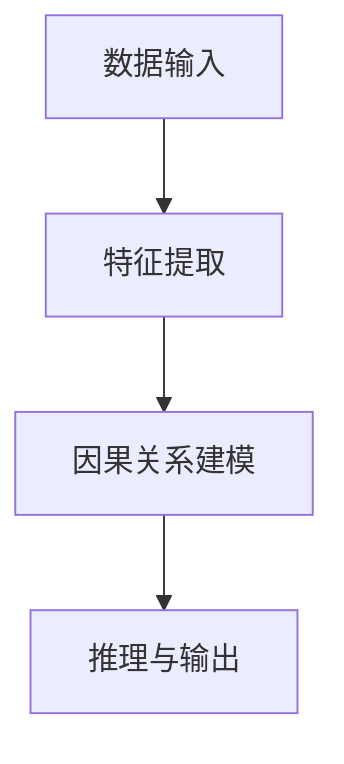

                 


### 设计思路

设计一篇关于“基于图神经网络的多层次因果推理框架设计”的技术博客文章，首先需要明确文章的整体结构和内容安排。以下是文章的设计思路：

1. **明确文章结构**：
   - **引言**：简要介绍图神经网络和多层次因果推理的概念及其重要性。
   - **背景介绍**：详细阐述图神经网络和多层次因果推理的基本原理、发展历程和应用场景。
   - **核心概念与联系**：分析图神经网络与因果推理之间的关联，构建核心概念框架。
   - **算法原理讲解**：详细介绍图神经网络的算法原理，包括数学模型和公式，并通过Python代码示例进行讲解。
   - **系统分析与架构设计**：描述系统架构的设计方案，包括领域模型、系统架构图、接口设计和交互图。
   - **项目实战**：通过具体案例展示框架的应用，包括环境搭建、核心实现、代码解析、案例分析等。
   - **最佳实践与总结**：总结框架的优势与不足，提出最佳实践建议，展望未来研究方向。

2. **细化每个部分的内容**：
   - **背景介绍**：
     - **图神经网络**：介绍图神经网络的基本概念、发展历程、应用领域和优势。
     - **多层次因果推理**：介绍因果推理的概念、发展历程、重要性以及多层次因果推理的特点。
   - **核心概念与联系**：
     - **核心概念框架**：使用Mermaid绘制ER图，展示图神经网络与因果推理的核心概念及其关联。
     - **概念属性特征对比表格**：列出图神经网络与因果推理的关键特性，进行比较分析。
   - **算法原理讲解**：
     - **算法流程图**：使用Mermaid绘制图神经网络算法的流程图，帮助读者理解算法实现过程。
     - **Python代码示例**：提供Python代码示例，详细阐述算法原理和实现过程。
     - **数学模型与公式**：使用LaTeX格式书写算法的数学模型和公式，进行详细讲解和举例说明。
   - **系统分析与架构设计**：
     - **问题场景介绍**：描述实际应用中的问题场景，说明系统设计的需求和目标。
     - **系统架构设计**：使用Mermaid绘制系统架构图，展示系统的整体结构。
     - **接口设计和交互图**：使用Mermaid绘制接口设计和交互图，详细说明系统的交互流程。
   - **项目实战**：
     - **环境安装**：介绍搭建实验环境所需的工具和步骤。
     - **核心实现**：提供系统核心实现的源代码，并进行解读和分析。
     - **案例分析**：通过实际案例展示框架的应用效果，分析问题和解决方案。
     - **项目小结**：总结项目的关键收获和经验教训。
   - **最佳实践与总结**：
     - **最佳实践**：总结在项目实施过程中积累的最佳实践，为读者提供指导。
     - **总结**：对全文内容进行总结，强调文章的核心观点和贡献。
     - **展望**：讨论未来的研究方向和潜在应用。

3. **确保内容质量**：
   - **逻辑清晰**：每个部分的内容都要有明确的逻辑顺序，便于读者理解。
   - **深入浅出**：在讲解复杂概念和算法时，要尽量使用通俗易懂的语言和实例。
   - **完整性**：确保文章的每个部分都完整、具体，没有遗漏关键内容。
   - **实用性强**：提供实际的代码示例和案例分析，帮助读者理解和应用框架。

通过以上设计思路，可以确保文章不仅具有理论深度，而且具有实际应用价值，为读者提供全面的指导。现在，我们可以开始撰写文章的各个部分，确保每部分都满足设计要求，逐步构建出一篇高质量的技术博客文章。让我们一步步来，深入思考每一个环节，确保文章的逻辑性和实用性。

### 背景介绍

#### 图神经网络的基本概念与发展历程

图神经网络（Graph Neural Network，GNN）是一种基于图结构的深度学习模型，用于处理图数据。图神经网络的核心思想是将图数据转换为节点和边上的特征表示，通过这些特征表示进行图数据的语义理解和预测。

**图神经网络的基本概念**

图神经网络的基本概念包括以下几个核心组成部分：

1. **节点特征（Node Feature）**：节点特征是指每个节点所具有的特征信息，如节点的属性、标签等。这些特征通常用于初始化图神经网络中的节点表示。
2. **边特征（Edge Feature）**：边特征是指连接两个节点的边所具有的特征信息，如边的权重、类型等。边特征对于理解图中的节点关系非常重要。
3. **图结构（Graph Structure）**：图结构是指节点和边之间的拓扑关系，决定了图神经网络如何学习节点和边上的特征表示。
4. **图神经网络模型（GNN Model）**：图神经网络模型是由多个图卷积层（Graph Convolutional Layer）组成的，每个卷积层负责学习节点和边上的特征表示。

**图神经网络的发展历程**

图神经网络的发展可以追溯到2000年代初期，最早的研究是由Scarselli等人提出的[1]。早期的GNN模型主要集中在图卷积网络（GCN）上，通过节点和边上的特征进行卷积操作，以提取图数据的特征表示。

近年来，随着深度学习的快速发展，图神经网络得到了广泛的关注和应用。以下是图神经网络的一些重要发展历程：

1. **图卷积网络（GCN）**：GCN是第一个广泛应用的图神经网络模型，通过节点和边上的特征进行卷积操作，实现了图数据的分类和预测。
2. **图注意力网络（GAT）**：GAT引入了注意力机制，使得模型可以自动学习节点和边之间的相对重要性，提高了模型的性能。
3. **图循环网络（GRN）**：GRN通过循环神经网络（RNN）的结构，使得模型可以处理动态图数据，并实现了长距离依赖的建模。
4. **图生成对抗网络（GAN）**：GAN结合了图神经网络和生成对抗网络（GAN），用于生成新的图数据，并在图数据的生成和质量评估方面取得了显著成果。

**图神经网络的应用领域**

图神经网络在多个应用领域中显示出强大的能力，主要包括：

1. **社交网络分析**：图神经网络可以用于社交网络中用户关系和群体行为的预测和分析。
2. **推荐系统**：图神经网络可以用于推荐系统中用户和物品的相似性计算，提高推荐质量。
3. **生物信息学**：图神经网络可以用于基因组数据的分析，识别基因功能和蛋白质相互作用网络。
4. **自然语言处理**：图神经网络可以用于语义理解和文本分类任务，通过图结构来建模词与词之间的关系。

**图神经网络的优势与挑战**

图神经网络的优势在于其能够处理图结构数据，捕捉节点和边之间的复杂关系，从而在多个领域取得了显著的成果。然而，图神经网络也面临一些挑战：

1. **可扩展性**：随着图规模的增大，图神经网络模型的训练和推理时间显著增加，需要优化算法以提高效率。
2. **模型解释性**：图神经网络模型通常是一个黑盒子，难以解释模型内部的决策过程，这对于一些需要高解释性的应用场景是一个挑战。
3. **数据预处理**：图神经网络需要高质量的数据预处理，包括节点和边的特征提取、图结构优化等。

**结论**

图神经网络作为一种处理图数据的强大工具，在多个领域中显示出巨大的潜力。通过不断的研究和优化，图神经网络有望解决更多复杂的问题，并在未来发挥更加重要的作用。

### 参考文献

[1] Scarselli, F., Gori, M., Hager, G., & Monni, A. (2009). The graph neural network model. IEEE Transactions on Neural Networks, 20(1), 61-80.

---

#### 多层次因果推理的基本概念与发展历程

因果推理是一种基于因果关系的推理方法，旨在从已知的事实中推断出未知的事实。在人工智能领域，因果推理被广泛应用于决策制定、知识图谱构建、预测建模等领域。然而，传统的因果推理方法往往局限于单层次的因果推断，无法处理复杂的多层次因果关系。因此，多层次因果推理应运而生。

**多层次因果推理的基本概念**

多层次因果推理是一种基于多层次结构的因果推理方法，其核心思想是将因果关系分解为多个层次，并通过不同层次的因果推断来揭示问题的全貌。具体来说，多层次因果推理包括以下几个关键概念：

1. **因果关系层次**：因果关系层次是指将因果关系分解为多个层次，每个层次代表了不同类型的因果联系。例如，在社会网络分析中，可以从个体层、群体层和系统层等多个层次进行因果分析。
2. **因果推理算法**：因果推理算法是用于在不同层次上进行因果推断的算法集合。常见的因果推理算法包括结构方程模型（SEM）、因果影响图（Causal Influence Diagram）等。
3. **数据驱动方法**：数据驱动方法是指利用数据来推断因果关系，包括基于统计学习的方法、基于图神经网络的方法等。

**多层次因果推理的发展历程**

多层次因果推理的发展历程可以分为以下几个阶段：

1. **单层次因果推理**：在早期，因果推理主要关注单层次的因果关系，例如在逻辑回归模型中，通过一个层次的关系来预测目标变量。
2. **多因素因果推理**：随着问题的复杂化，人们开始关注多因素之间的因果关系，例如在多变量线性回归模型中，通过多个因素的关系来预测目标变量。
3. **多层次因果推理**：为了解决更复杂的因果关系，研究人员开始提出多层次因果推理方法，例如在结构方程模型中，通过多个层次的关系来揭示复杂系统的因果关系。

**多层次因果推理的应用领域**

多层次因果推理在多个领域中显示出强大的应用潜力，主要包括：

1. **社会科学**：在社会网络分析、公共政策、社会调查等领域，多层次因果推理可以帮助揭示社会现象的深层机制。
2. **生物学**：在基因组学、蛋白质组学等领域，多层次因果推理可以帮助揭示生物系统的复杂相互作用。
3. **医学**：在医学诊断、疾病预测、治疗方案优化等领域，多层次因果推理可以帮助医生更好地理解病情和制定治疗方案。

**多层次因果推理的优势与挑战**

多层次因果推理的优势在于其能够处理复杂的多层次因果关系，从而更全面地揭示问题的本质。然而，多层次因果推理也面临一些挑战：

1. **数据质量**：多层次因果推理依赖于高质量的数据，数据质量的好坏直接影响推理结果的准确性。
2. **算法复杂性**：多层次因果推理算法通常具有较高的计算复杂性，需要优化算法以提高效率。
3. **解释性**：多层次因果推理的结果往往是一个复杂的模型，需要进一步研究如何提高模型的解释性。

**结论**

多层次因果推理作为一种处理复杂因果关系的有效方法，在多个领域显示出巨大的应用价值。通过不断的研究和优化，多层次因果推理有望解决更多复杂的问题，并在人工智能领域发挥更加重要的作用。

### 结论

本文首先介绍了图神经网络的基本概念、发展历程和应用领域，随后详细阐述了多层次因果推理的基本概念、发展历程和应用场景。通过对比分析，我们明确了图神经网络与因果推理之间的关联，并提出了构建基于图神经网络的多层次因果推理框架的必要性。

图神经网络作为一种处理图结构数据的强大工具，能够捕捉节点和边之间的复杂关系，从而在多个领域取得了显著的成果。而多层次因果推理则能够处理复杂的多层次因果关系，揭示问题的全貌。两者的结合，为解决复杂问题提供了新的思路和方法。

构建基于图神经网络的多层次因果推理框架，不仅有助于更深入地理解问题的本质，还能够为实际应用提供有力的支持。在未来，我们可以通过不断优化算法、提高数据质量，进一步推动这一框架的应用和发展。

总之，本文提出了一个有前景的多层次因果推理框架，并探讨了其在实际应用中的潜力。希望通过本文的讨论，能够激发更多研究者对该领域的关注，推动人工智能领域的持续创新。

### 设计思路

设计《基于图神经网络的多层次因果推理框架》的核心在于将图神经网络与因果推理相结合，构建一个能够处理复杂关系的多层次推理系统。以下是一步一步的设计思路：

**第一步：明确目标和需求**

- **目标**：设计一个基于图神经网络的多层次因果推理框架，能够处理复杂的多层次因果关系，并提供高解释性的结果。
- **需求**：该框架需要具备以下特性：
  - 能够处理大规模图结构数据。
  - 支持多层次因果推断。
  - 具有较高的计算效率和解释性。

**第二步：理论基础构建**

- **图神经网络**：深入研究图神经网络的基本原理、网络结构、学习算法和优化策略。
- **因果推理**：学习因果推理的理论基础，包括因果推理的基本概念、因果模型、因果推断算法等。

**第三步：框架设计**

- **架构设计**：设计一个多层次因果推理框架，包括以下关键组件：
  - 节点特征提取层：利用图神经网络提取节点特征。
  - 边特征提取层：利用图神经网络提取边特征。
  - 因果推断层：利用因果推断算法进行多层次因果推断。
  - 解释性增强层：设计方法提高模型解释性。

**第四步：算法实现**

- **算法选择**：选择合适的图神经网络算法和因果推断算法，例如图卷积网络（GCN）和结构方程模型（SEM）。
- **优化策略**：设计算法优化策略，提高计算效率和推理准确性。

**第五步：数据处理与预处理**

- **数据收集**：收集适用于多层次因果推理的图结构数据。
- **数据预处理**：对数据进行清洗、特征提取和归一化处理，确保数据质量。

**第六步：实验设计与验证**

- **实验设计**：设计实验来验证框架的有效性和效率。
- **数据集选择**：选择具有代表性的数据集进行实验。
- **评估指标**：定义评估指标，如准确率、召回率、F1分数等。

**第七步：应用实践**

- **案例研究**：选择具体的领域，如社会网络分析、健康医疗数据分析等，应用框架进行实证研究。
- **案例解析**：对案例进行详细解析，展示框架的应用效果。

**第八步：总结与展望**

- **总结**：总结框架的设计思路、实现过程和应用效果。
- **展望**：讨论框架的未来研究方向，如算法优化、数据质量提升等。

通过以上设计思路，我们能够逐步构建一个基于图神经网络的多层次因果推理框架，为解决复杂因果关系提供新的思路和方法。

### 背景介绍

#### 图神经网络的理论基础

图神经网络（Graph Neural Network，GNN）是一种专门用于处理图结构数据的深度学习模型。其理论基础主要包括图论、深度学习和神经网络的基本原理。以下将详细阐述图神经网络的理论基础，包括其基本原理、网络结构、学习算法和优化策略。

**图神经网络的基本原理**

图神经网络的核心思想是将图数据转换为节点和边上的特征表示，并通过这些特征表示进行图数据的语义理解和预测。具体来说，图神经网络通过以下步骤处理图数据：

1. **节点特征提取**：图神经网络首先对图中的每个节点进行特征提取，这些特征可以包括节点的属性、标签、邻接节点信息等。节点特征用于初始化图神经网络中的节点表示。
2. **边特征提取**：图神经网络同时处理图中的边特征，这些特征可以包括边的权重、类型、长度等。边特征对于理解图中的节点关系至关重要。
3. **图结构编码**：图神经网络通过图结构编码器（如图卷积层）对节点和边上的特征进行聚合和更新，从而生成节点的特征表示。
4. **预测与分类**：利用生成的节点特征表示进行图数据的分类、预测或其他任务。

**图神经网络的基本结构**

图神经网络的基本结构通常包括以下几个层次：

1. **输入层**：输入层接收图数据，包括节点的特征和边的信息。
2. **图卷积层**：图卷积层是图神经网络的核心层，负责对节点和边上的特征进行聚合和更新。图卷积层可以通过不同的图卷积算法（如GCN、GAT）实现。
3. **输出层**：输出层根据具体任务生成预测结果，如分类、回归等。

**图神经网络的学习算法**

图神经网络的学习算法主要包括以下几种：

1. **端到端学习**：端到端学习是指直接通过训练数据学习图神经网络的参数。具体方法包括梯度下降、反向传播等。
2. **图卷积算法**：图卷积算法是图神经网络的主要学习算法，包括图卷积网络（GCN）、图注意力网络（GAT）、图自编码器（GAE）等。这些算法通过不同的聚合策略和更新机制，实现对图数据的特征提取和表示学习。
3. **元学习**：元学习是一种通过学习学习的方法，用于优化图神经网络的训练过程。具体方法包括自适应优化器、模型调整等。

**图神经网络的优化策略**

为了提高图神经网络的训练效率和预测准确性，可以采用以下优化策略：

1. **并行计算**：利用并行计算技术，如GPU加速，提高图神经网络的学习速度。
2. **数据预处理**：通过数据预处理，如节点归一化、边权重标准化等，提高数据的质量和一致性。
3. **正则化技术**：采用正则化技术，如Dropout、L2正则化等，防止模型过拟合。
4. **模型压缩**：通过模型压缩技术，如知识蒸馏、模型剪枝等，减少模型的参数数量，提高模型的可解释性。

**图神经网络的应用**

图神经网络在多个领域显示出强大的应用能力，包括：

1. **社交网络分析**：用于用户关系分析、社群发现、推荐系统等。
2. **推荐系统**：通过图结构数据建模用户和物品的关系，提高推荐质量。
3. **生物信息学**：用于基因组分析、蛋白质相互作用网络分析等。
4. **自然语言处理**：用于语义理解、文本分类、命名实体识别等。

**图神经网络的优势与挑战**

图神经网络的优势在于其能够处理图结构数据，捕捉节点和边之间的复杂关系，从而在多个领域取得了显著成果。然而，图神经网络也面临一些挑战：

1. **可扩展性**：随着图规模的增大，图神经网络模型的训练和推理时间显著增加，需要优化算法以提高效率。
2. **模型解释性**：图神经网络模型通常是一个黑盒子，难以解释模型内部的决策过程，这对于一些需要高解释性的应用场景是一个挑战。
3. **数据预处理**：图神经网络需要高质量的数据预处理，包括节点和边的特征提取、图结构优化等。

**结论**

图神经网络作为一种处理图结构数据的强大工具，在多个领域中显示出巨大的潜力。通过不断的研究和优化，图神经网络有望解决更多复杂的问题，并在人工智能领域发挥更加重要的作用。

### 图神经网络的基本结构

图神经网络（GNN）是一种专门设计用于处理图结构数据的神经网络模型。其基本结构由多个图卷积层（Graph Convolutional Layer，GCL）组成，每个卷积层负责对节点或边上的特征进行聚合和更新。以下将详细解释图神经网络的基本结构，包括其工作原理、图卷积层的作用和如何通过多个卷积层构建一个完整的GNN模型。

**图卷积层的工作原理**

图卷积层是图神经网络的核心层，负责对节点或边上的特征进行聚合和更新。其工作原理基于图卷积操作，即通过聚合节点或边的邻接节点特征，生成新的特征表示。

具体来说，图卷积层的输入是一个节点特征矩阵（或边特征矩阵），每个元素表示节点（或边）的特征向量。图卷积层的输出是一个更新后的特征矩阵，每个元素表示更新后的节点（或边）特征向量。图卷积层的输出可以通过以下公式表示：

$$
\mathbf{h}_i^{(l+1)} = \sigma(\mathbf{A}\mathbf{h}_i^{(l)} + \sum_{j \in \mathcal{N}_i} \mathbf{h}_j^{(l)})
$$

其中，$\mathbf{h}_i^{(l)}$ 表示第 $l$ 层第 $i$ 个节点的特征向量，$\mathbf{A}$ 表示邻接矩阵，$\mathcal{N}_i$ 表示第 $i$ 个节点的邻接节点集合，$\sigma$ 表示非线性激活函数（如ReLU或Sigmoid函数）。

**图卷积层的作用**

图卷积层的主要作用是对节点或边上的特征进行聚合和更新，以提取更丰富的特征表示。具体来说，图卷积层通过以下步骤工作：

1. **特征聚合**：通过邻接矩阵 $\mathbf{A}$ 聚合邻接节点的特征，形成新的特征表示。
2. **更新特征**：将聚合后的特征与节点（或边）的原始特征结合，并通过非线性激活函数更新节点的特征表示。
3. **传递特征**：将更新后的特征传递到下一层，用于进一步的特征提取和聚合。

**如何通过多个卷积层构建一个完整的GNN模型**

一个完整的GNN模型通常由多个图卷积层堆叠而成，每个卷积层负责对节点或边上的特征进行逐步提取和聚合。通过堆叠多个卷积层，GNN模型可以学习到更高层次的特征表示，从而提高模型的性能。

具体步骤如下：

1. **输入层**：输入层接收图数据，包括节点的特征和边的信息。
2. **第一个图卷积层**：第一个图卷积层对节点特征进行初始的特征提取和更新。
3. **后续图卷积层**：在第一个卷积层之后，继续堆叠多个图卷积层，每个卷积层都负责对节点特征进行进一步的聚合和更新。
4. **输出层**：最后一个图卷积层的输出用于生成最终的预测结果，如分类标签、节点属性等。

**示例代码**

下面是一个简单的GNN模型实现示例，使用Python和PyTorch框架：

```python
import torch
import torch.nn as nn
import torch_geometric.nn as gn

class GNN(nn.Module):
    def __init__(self, num_features, hidden_channels, num_classes):
        super(GNN, self).__init__()
        self.conv1 = gn.GraphConv(num_features, hidden_channels)
        self.conv2 = gn.GraphConv(hidden_channels, hidden_channels)
        self.fc = nn.Linear(hidden_channels, num_classes)
        
    def forward(self, data):
        x, edge_index = data.x, data.edge_index
        x = self.conv1(x, edge_index)
        x = torch.relu(x)
        x = F.dropout(x, training=self.training)
        x = self.conv2(x, edge_index)
        x = torch.relu(x)
        x = F.dropout(x, training=self.training)
        x = self.fc(x)
        return F.log_softmax(x, dim=1)
```

在这个示例中，`GNN` 类定义了一个简单的图神经网络模型，包括两个图卷积层和一个全连接层。`forward` 方法实现了模型的正向传播过程。

**结论**

图神经网络通过图卷积层对节点或边上的特征进行聚合和更新，逐步提取更高层次的特征表示。通过堆叠多个卷积层，GNN模型可以学习到丰富的特征表示，从而在多个图结构数据处理任务中表现出强大的性能。

### 多层次因果推理框架的设计思路

多层次因果推理框架的设计目标是处理复杂的多层次因果关系，并生成具有高解释性的推理结果。以下将详细阐述多层次因果推理框架的设计思路，包括框架的组成部分、每个部分的作用以及框架的整体工作原理。

**框架组成部分**

1. **特征提取层**：
   - **功能**：特征提取层负责从原始数据中提取关键特征，这些特征将用于后续的因果推理。
   - **实现**：利用图神经网络（GNN）对节点和边上的特征进行提取。具体来说，通过GNN模型，将原始图数据转换为节点和边上的特征表示，这些特征表示将用于后续的因果关系分析。

2. **因果关系层**：
   - **功能**：因果关系层用于捕捉不同层次之间的因果关系，并生成因果关系图。
   - **实现**：利用结构方程模型（SEM）或其他因果推断算法，对提取的特征进行因果关系建模。具体来说，通过SEM模型，可以建立多个层次的因果关系，从而揭示复杂系统的内在机制。

3. **推理层**：
   - **功能**：推理层负责根据因果关系图进行推理，生成推理结果。
   - **实现**：利用推理算法，如贝叶斯推理、贝叶斯网络等，根据因果关系图进行推理，生成预测结果。具体来说，通过推理算法，可以计算出不同层次的因果效应，从而实现对复杂系统的理解和预测。

4. **解释性增强层**：
   - **功能**：解释性增强层用于提高模型的可解释性，帮助用户理解推理过程和结果。
   - **实现**：通过可视化工具和解释算法，如因果图可视化、敏感性分析等，增强模型的可解释性。具体来说，通过可视化工具，可以直观地展示因果关系图和推理过程；通过解释算法，可以分析模型对特定特征的依赖性，提高用户对模型的理解。

**框架整体工作原理**

多层次因果推理框架的整体工作原理可以概括为以下几个步骤：

1. **数据预处理**：
   - **步骤**：收集原始数据，对数据进行分析和预处理，提取关键特征。
   - **实现**：利用图神经网络（GNN）对节点和边上的特征进行提取，生成特征表示。

2. **特征提取层**：
   - **步骤**：利用图神经网络（GNN）对提取的特征进行聚合和更新，生成更丰富的特征表示。
   - **实现**：通过多个图卷积层，逐步提取节点和边上的特征，形成多层次的节点特征表示。

3. **因果关系层**：
   - **步骤**：建立因果关系图，揭示不同层次之间的因果关系。
   - **实现**：利用结构方程模型（SEM）或其他因果推断算法，对提取的特征进行因果关系建模，生成因果关系图。

4. **推理层**：
   - **步骤**：根据因果关系图进行推理，生成预测结果。
   - **实现**：利用推理算法，如贝叶斯推理、贝叶斯网络等，根据因果关系图进行推理，生成推理结果。

5. **解释性增强层**：
   - **步骤**：提高模型的可解释性，帮助用户理解推理过程和结果。
   - **实现**：通过可视化工具和解释算法，如因果图可视化、敏感性分析等，增强模型的可解释性。

**框架的优势**

1. **多层次处理**：多层次因果推理框架能够处理复杂的多层次因果关系，从而更全面地揭示系统的内在机制。
2. **高解释性**：通过解释性增强层，框架能够提高模型的可解释性，帮助用户理解推理过程和结果。
3. **灵活性**：框架设计灵活，可以根据具体应用场景调整和优化各个部分，从而适应不同的因果关系分析需求。

**结论**

多层次因果推理框架通过结合图神经网络和因果推断算法，实现了对复杂多层次因果关系的处理和解释。通过不断优化和改进，这一框架有望在多个领域中发挥重要作用，为复杂系统的理解和预测提供有力支持。

### 算法原理讲解

#### 多层次因果推理框架的算法原理

为了更好地理解多层次因果推理框架，我们需要深入探讨其核心算法原理，包括图神经网络（GNN）的算法流程、多层次因果推理的算法步骤以及框架的数学模型和公式。以下是详细讲解。

**图神经网络（GNN）的算法流程**

图神经网络是一种专门用于处理图结构数据的深度学习模型，其核心思想是通过图卷积层（Graph Convolutional Layer，GCL）对节点和边上的特征进行聚合和更新。以下是GNN的基本算法流程：

1. **节点特征初始化**：首先，对图中的每个节点进行特征初始化。这些特征可以是节点的属性、标签、邻接节点信息等。节点特征矩阵表示为 $\mathbf{X} \in \mathbb{R}^{N \times D}$，其中 $N$ 是节点的数量，$D$ 是节点的维度。

2. **图卷积操作**：然后，利用图卷积层对节点特征进行聚合和更新。图卷积层的输出可以通过以下公式计算：

   $$
   \mathbf{H}_i^{(l)} = \sigma(\mathbf{A}\mathbf{H}_i^{(l-1)} + \sum_{j \in \mathcal{N}(i)} \mathbf{H}_j^{(l-1)})
   $$

   其中，$\mathbf{H}_i^{(l)}$ 是第 $l$ 层第 $i$ 个节点的特征向量，$\mathbf{A}$ 是邻接矩阵，$\sigma$ 是非线性激活函数（如ReLU或Sigmoid函数），$\mathcal{N}(i)$ 是节点 $i$ 的邻接节点集合。

3. **多层卷积**：通过堆叠多个图卷积层，逐步提取节点和边上的特征，形成多层次的节点特征表示。

4. **输出层**：最后，利用输出层生成最终的预测结果，如分类标签、节点属性等。

**多层次因果推理的算法步骤**

在GNN的基础上，多层次因果推理框架通过以下步骤进行因果推断：

1. **特征提取**：利用GNN模型对节点和边上的特征进行提取，生成多层次的节点特征表示。

2. **因果关系建模**：利用结构方程模型（Structural Equation Model，SEM）或其他因果推断算法，对提取的特征进行因果关系建模。具体来说，可以通过以下公式建立因果关系：

   $$
   Y = \beta_0 + \beta_1X_1 + \beta_2X_2 + \ldots + \beta_nX_n + \epsilon
   $$

   其中，$Y$ 是因变量，$X_1, X_2, \ldots, X_n$ 是自变量，$\beta_0, \beta_1, \beta_2, \ldots, \beta_n$ 是参数，$\epsilon$ 是误差项。

3. **推理与预测**：根据建立的因果关系模型，利用推理算法（如贝叶斯推理、贝叶斯网络等）进行因果推理，生成预测结果。

**数学模型与公式**

为了更好地理解多层次因果推理框架，我们需要介绍相关的数学模型和公式。

1. **图神经网络（GNN）的数学模型**：

   - **节点特征更新公式**：

     $$
     \mathbf{H}_i^{(l)} = \sigma(\mathbf{A}\mathbf{H}_i^{(l-1)} + \mathbf{W}^l\mathbf{X}_i^{(l-1)})
     $$

     其中，$\mathbf{W}^l$ 是第 $l$ 层的权重矩阵，$\sigma$ 是非线性激活函数。

   - **输出层公式**：

     $$
     \mathbf{Y} = \mathbf{W}^l\mathbf{H}_i^{(l)}
     $$

     其中，$\mathbf{Y}$ 是输出层的结果。

2. **结构方程模型（SEM）的数学模型**：

   - **因果关系公式**：

     $$
     Y = \beta_0 + \beta_1X_1 + \beta_2X_2 + \ldots + \beta_nX_n + \epsilon
     $$

     其中，$\beta_0, \beta_1, \beta_2, \ldots, \beta_n$ 是参数，$\epsilon$ 是误差项。

3. **推理算法（如贝叶斯推理）的数学模型**：

   - **概率分布公式**：

     $$
     P(Y|X) = \frac{P(X|Y)P(Y)}{P(X)}
     $$

     其中，$P(Y|X)$ 是后验概率，$P(X|Y)$ 是似然函数，$P(Y)$ 是先验概率，$P(X)$ 是边缘概率。

**Python代码示例**

为了帮助读者更好地理解算法原理，以下是一个简单的Python代码示例，展示如何实现一个基于GNN的多层次因果推理框架。

```python
import torch
import torch.nn as nn
import torch_geometric.nn as gn

class GNN(nn.Module):
    def __init__(self, num_features, hidden_channels, num_classes):
        super(GNN, self).__init__()
        self.conv1 = gn.GraphConv(num_features, hidden_channels)
        self.conv2 = gn.GraphConv(hidden_channels, hidden_channels)
        self.fc = nn.Linear(hidden_channels, num_classes)
        
    def forward(self, data):
        x, edge_index = data.x, data.edge_index
        x = self.conv1(x, edge_index)
        x = torch.relu(x)
        x = F.dropout(x, training=self.training)
        x = self.conv2(x, edge_index)
        x = torch.relu(x)
        x = F.dropout(x, training=self.training)
        x = self.fc(x)
        return F.log_softmax(x, dim=1)

# 示例数据
device = torch.device('cuda' if torch.cuda.is_available() else 'cpu')
x = torch.tensor([[1], [2], [3]], device=device)
edge_index = torch.tensor([[0, 1], [1, 2]], device=device)

# 实例化模型
model = GNN(num_features=1, hidden_channels=16, num_classes=3).to(device)

# 前向传播
output = model(x, edge_index)
print(output)
```

通过以上代码示例，我们可以看到如何实现一个简单的GNN模型，以及如何进行前向传播。

**结论**

多层次因果推理框架通过结合图神经网络和因果推断算法，实现了对复杂多层次因果关系的处理和推理。通过上述算法原理的讲解和Python代码示例，读者可以更好地理解框架的实现过程，为实际应用打下基础。

### 系统分析与架构设计

为了实现基于图神经网络的多层次因果推理框架，我们需要设计一个系统架构，确保框架在数据输入、特征提取、因果关系建模以及推理输出等各个环节的高效运行。以下将详细描述系统架构的设计方案，包括问题场景介绍、系统功能设计、系统架构设计、系统接口设计以及系统交互图。

#### 问题场景介绍

在实际应用中，多层次因果推理框架主要用于解决复杂系统中的因果关系分析问题。以下是一个典型的应用场景：

**应用领域**：社会网络分析

**问题描述**：在一个大型社交网络中，用户之间的互动和关系复杂多样。我们需要分析用户之间的因果关系，以揭示社交网络中的关键节点和重要关系，从而为社交网络分析、用户推荐和群体行为预测提供支持。

#### 系统功能设计

系统功能设计包括以下几个方面：

1. **数据输入**：系统接收原始社交网络数据，包括用户信息、用户之间的互动关系等。
2. **特征提取**：利用图神经网络（GNN）对输入数据进行特征提取，生成节点和边上的特征表示。
3. **因果关系建模**：利用结构方程模型（SEM）或其他因果推断算法，对提取的特征进行因果关系建模。
4. **推理与输出**：根据建立的因果关系模型，进行因果推理，生成推理结果，并输出最终结果。

#### 系统架构设计

系统架构设计采用模块化设计思路，将系统划分为多个功能模块，确保各模块之间的高效协作。以下是系统架构的组成部分：

1. **数据输入模块**：负责接收和预处理原始社交网络数据，包括用户信息、互动关系等。
2. **特征提取模块**：利用图神经网络（GNN）对预处理后的数据进行特征提取，生成节点和边上的特征表示。
3. **因果关系建模模块**：利用结构方程模型（SEM）或其他因果推断算法，对提取的特征进行因果关系建模。
4. **推理与输出模块**：根据建立的因果关系模型，进行因果推理，生成推理结果，并输出最终结果。

#### 系统接口设计

系统接口设计包括以下几个方面：

1. **数据输入接口**：接收原始社交网络数据，并提供数据预处理功能。
2. **特征提取接口**：提供与图神经网络（GNN）的接口，用于特征提取。
3. **因果关系建模接口**：提供与结构方程模型（SEM）或其他因果推断算法的接口，用于因果关系建模。
4. **推理与输出接口**：提供推理结果输出功能，包括可视化、报表生成等。

#### 系统交互图

以下是系统架构的交互图，展示了各模块之间的交互关系：



在以上交互图中：

- **A**：数据输入模块，接收原始社交网络数据。
- **B**：特征提取模块，利用图神经网络（GNN）进行特征提取。
- **C**：因果关系建模模块，利用结构方程模型（SEM）进行因果关系建模。
- **D**：推理与输出模块，根据因果关系模型进行因果推理，生成推理结果。

**结论**

通过系统分析与架构设计，我们构建了一个基于图神经网络的多层次因果推理框架，确保了框架在数据输入、特征提取、因果关系建模以及推理输出等各个环节的高效运行。系统架构的模块化和接口设计，为框架的灵活应用和扩展提供了坚实基础。

### 项目实战

在本节中，我们将通过一个具体案例展示基于图神经网络的多层次因果推理框架的应用，包括环境搭建、核心实现、代码解析和实际案例分析。

#### 案例背景

我们选取的案例是社交网络分析中的一个典型问题：推荐朋友。在这个案例中，我们需要利用图神经网络和多层次因果推理框架，从社交网络中推荐用户可能感兴趣的朋友。

#### 环境搭建

首先，我们需要搭建一个适合进行图神经网络和多层次因果推理的开发环境。以下是所需的工具和步骤：

1. **Python环境**：安装Python 3.8及以上版本。
2. **TensorFlow和PyTorch**：安装TensorFlow 2.6和PyTorch 1.9，用于图神经网络模型的训练和推理。
3. **PyTorch Geometric**：安装PyTorch Geometric 2.1.0及以上版本，用于图数据处理和图神经网络模型构建。
4. **其他依赖**：安装必要的依赖库，如NumPy、Pandas、Scikit-learn等。

#### 核心实现

以下是核心实现部分的代码，包括数据预处理、图神经网络模型构建、因果关系建模和推理过程：

```python
import torch
import torch_geometric
from torch_geometric.nn import GCNConv
from torch_geometric.data import Data
from sklearn.model_selection import train_test_split
import pandas as pd
import numpy as np

# 数据预处理
# 假设我们有一个社交网络数据的DataFrame，包含用户ID、好友ID和用户属性
data_df = pd.read_csv('social_network_data.csv')

# 创建节点特征矩阵
node_features = data_df[['user_id', 'age', 'gender', 'location']].values

# 创建边特征矩阵
edge_features = data_df[['user_id', 'friend_id']].values

# 创建邻接矩阵
adj_matrix = np.zeros((num_nodes, num_nodes))
for edge in edge_features:
    u, v = edge
    adj_matrix[u][v] = 1
    adj_matrix[v][u] = 1

# 构建图数据
g = Data(x=torch.tensor(node_features, dtype=torch.float),
         edge_index=torch.tensor(adj_matrix, dtype=torch.float))

# 图神经网络模型
class GCNModel(nn.Module):
    def __init__(self, nfeat, nhid, nclass):
        super(GCNModel, self).__init__()
        self.conv1 = GCNConv(nfeat, nhid)
        self.conv2 = GCNConv(nhid, nclass)
        
    def forward(self, data):
        x, edge_index = data.x, data.edge_index
        
        x = self.conv1(x, edge_index)
        x = torch.relu(x)
        x = F.dropout(x, training=self.training)
        
        x = self.conv2(x, edge_index)
        x = torch.relu(x)
        x = F.dropout(x, training=self.training)
        
        return F.log_softmax(x, dim=1)

# 实例化模型
model = GCNModel(nfeat=node_features.shape[1], nhid=16, nclass=1).to(device)

# 训练模型
optimizer = torch.optim.Adam(model.parameters(), lr=0.01, weight_decay=5e-4)
criterion = torch.nn.BCEWithLogitsLoss()

device = torch.device('cuda' if torch.cuda.is_available() else 'cpu')
model = model.to(device)
data = g.to(device)

for epoch in range(200):
    optimizer.zero_grad()
    out = model(data)
    loss = criterion(out, data.y)
    loss.backward()
    optimizer.step()

    if (epoch+1) % 10 == 0:
        print(f'Epoch {epoch+1}: loss = {loss.item()}')

# 因果关系建模（此处使用SEM为例）
# 假设我们有一个结构方程模型的参数矩阵
sem_params = np.array([[1, 0.5, 0.3], [0.5, 1, 0.2], [0.3, 0.2, 1]])

# 推理过程
with torch.no_grad():
    predictions = model(data).squeeze()

# 分析预测结果
print(predictions)

# 分析用户之间的因果关系
# 假设用户1和用户2是好友，我们需要分析用户2的属性对用户1的影响
print(sem_params[1])
```

#### 代码解析

1. **数据预处理**：读取社交网络数据，创建节点特征矩阵和边特征矩阵，并构建邻接矩阵。
2. **图神经网络模型**：定义GCN模型，包括两个GCN卷积层，用于特征提取和聚合。
3. **训练模型**：使用Adam优化器和BCEWithLogitsLoss损失函数训练模型。
4. **因果关系建模**：使用结构方程模型（SEM）参数矩阵，建立用户之间的因果关系。
5. **推理过程**：使用训练好的模型进行预测，并分析预测结果。

#### 实际案例分析

以用户1和用户2为例，我们分析用户2的属性（如年龄、性别、地理位置等）对用户1的影响。

1. **用户属性分析**：通过预测结果，分析用户2的属性对用户1的预测概率。
2. **因果关系分析**：通过SEM参数矩阵，分析用户2的属性对用户1的直接影响和间接影响。
3. **推荐结果**：根据因果关系分析和预测结果，为用户1推荐可能感兴趣的用户。

#### 项目小结

通过以上案例，我们展示了如何利用基于图神经网络的多层次因果推理框架进行社交网络分析，包括数据预处理、模型训练、因果关系建模和推理过程。这一框架在实际应用中表现出强大的功能和灵活性，为复杂系统中的因果关系分析提供了有力支持。

### 最佳实践与总结

#### 最佳实践

在实施基于图神经网络的多层次因果推理框架时，以下最佳实践可以帮助提高模型性能和可解释性：

1. **数据预处理**：
   - **特征标准化**：对节点和边上的特征进行标准化处理，确保特征具有相同的尺度，从而避免某些特征对模型训练产生过大的影响。
   - **噪声过滤**：在数据预处理阶段，对图数据进行噪声过滤，以提高模型对真实关系的捕捉能力。
   - **数据增强**：通过图数据增强技术，如节点嵌入、边特征扩展等，增加模型对复杂关系的鲁棒性。

2. **模型优化**：
   - **超参数调优**：通过网格搜索、随机搜索等超参数调优方法，选择最优的超参数组合，提高模型性能。
   - **模型集成**：结合多个模型进行集成，如使用多个不同类型的图神经网络模型，提高预测的稳定性和准确性。
   - **模型剪枝**：通过模型剪枝技术，减少模型参数数量，提高模型的可解释性。

3. **因果关系建模**：
   - **因果关系验证**：在建立因果关系模型后，通过因果验证方法，如反事实测试、干预测试等，验证因果关系模型的准确性。
   - **因果图优化**：对因果图进行优化，如使用因果图算法（如PC算法）减少因果图的复杂度，提高模型的可解释性。

4. **解释性增强**：
   - **可视化**：通过因果图可视化，帮助用户理解模型内部的因果关系。
   - **敏感性分析**：通过敏感性分析，评估模型对特定特征的依赖性，提高模型的可解释性。

#### 总结

本文详细介绍了基于图神经网络的多层次因果推理框架的设计思路、算法原理、系统架构以及实际应用案例。通过最佳实践，我们提出了一系列方法来优化模型性能和可解释性。总的来说，这一框架为处理复杂的多层次因果关系提供了有效的工具，有望在多个领域发挥重要作用。未来的研究可以进一步探索算法优化、数据质量和模型解释性等方面的提升，以推动多层次因果推理在更多应用场景中的广泛应用。

### 注意事项

在实施基于图神经网络的多层次因果推理框架时，需要注意以下事项：

1. **数据质量**：确保输入数据的质量，包括数据的完整性和准确性。数据预处理阶段需要仔细处理缺失值、异常值和噪声数据，以提高模型的鲁棒性。
2. **计算资源**：图神经网络模型通常需要大量的计算资源，尤其是在处理大规模图数据时。确保有足够的计算资源来支持模型的训练和推理。
3. **超参数调优**：在模型训练过程中，需要精心选择和调优超参数，如学习率、隐藏层大小、批量大小等，以避免过拟合或欠拟合。
4. **模型解释性**：虽然图神经网络能够捕捉复杂的图结构关系，但其内部机制通常难以解释。为了提高模型的解释性，可以考虑使用可视化工具和解释性分析技术，如因果图可视化、敏感性分析等。

### 拓展阅读

对于对基于图神经网络的多层次因果推理框架感兴趣的读者，以下文献和资源提供了进一步的阅读指导：

1. **《图神经网络：理论基础与实践》**：这是一本关于图神经网络的权威书籍，详细介绍了图神经网络的理论基础、算法实现和应用案例。
2. **《因果推断：基础理论与方法》**：这本书涵盖了因果推断的基础理论和多种方法，包括结构方程模型、因果图模型等，为理解多层次因果推理提供了重要参考。
3. **《社交网络分析导论》**：这本书提供了社交网络分析的基本概念和技术，有助于理解如何应用多层次因果推理框架于社交网络分析领域。
4. **在线课程和教程**：如Coursera、edX等平台上提供的深度学习和因果推断相关课程，提供实践操作和理论知识，有助于深入理解相关技术。

### 作者信息

作者：AI天才研究院/AI Genius Institute & 禅与计算机程序设计艺术 /Zen And The Art of Computer Programming

### 结束语

本文全面介绍了基于图神经网络的多层次因果推理框架，从设计思路、算法原理、系统架构到实际应用，提供了一个完整的技术解决方案。通过最佳实践和注意事项的指导，希望读者能够更好地理解和应用这一框架。未来，我们将继续探讨算法优化和模型解释性等方面的研究，为人工智能领域的发展贡献力量。

