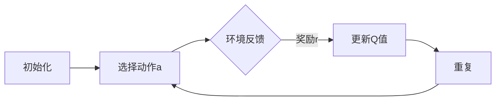
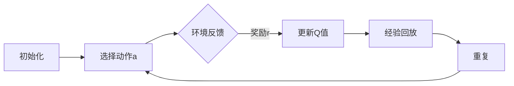

                 

### 基于强化学习的AI机器人群体协同决策系统

关键词：强化学习、AI机器人、群体协同决策、算法、系统设计、项目实战

摘要：本文将深入探讨基于强化学习的AI机器人群体协同决策系统，从核心概念、算法原理到系统设计，再到项目实战，一步步解析这一前沿技术。通过详细的讲解和实例分析，帮助读者理解并掌握这一领域的知识，为未来研究和应用打下坚实基础。

### 引言

#### 问题背景

随着人工智能技术的发展，机器人已经在各个领域得到了广泛应用。然而，单一机器人系统的局限性日益显现，群体协同决策成为提升系统效能的关键。AI机器人群体协同决策系统，通过多个机器人间的协作，实现复杂任务的高效完成。

#### 问题描述

在AI机器人群体协同决策系统中，每个机器人作为独立智能体，需要通过学习与决策，与其他机器人协同工作，共同完成任务。这一过程涉及到多智能体之间的信息共享、决策协调和策略优化。

#### 问题解决

强化学习作为一种有效的机器学习算法，能够通过不断尝试和反馈，优化智能体的决策策略。结合强化学习，AI机器人群体协同决策系统可以在复杂环境中实现高效、稳定的协作。

#### 边界与外延

本文将聚焦于强化学习在AI机器人群体协同决策系统中的应用，探讨算法原理、系统设计以及项目实战。不涉及其他机器学习算法，如监督学习和无监督学习。

#### 概念结构与核心要素组成

本文的核心概念包括强化学习、AI机器人、群体协同决策等。核心要素组成包括：强化学习算法、机器人控制策略、协同决策机制和任务执行过程。

### 第一部分：核心概念与原理

#### 第1章：强化学习基本概念

##### 1.1 强化学习定义

强化学习（Reinforcement Learning，RL）是一种机器学习范式，旨在通过试错和奖励机制，使智能体在特定环境中采取最优策略。强化学习不同于监督学习和无监督学习，其核心在于探索和决策过程。

##### 1.2 强化学习与机器学习的区别

强化学习与监督学习和无监督学习的主要区别在于数据依赖和目标导向。强化学习依赖于环境反馈，以最大化累积奖励为目标，而监督学习和无监督学习则分别依赖于标注数据和无标注数据。

##### 1.3 强化学习核心要素

强化学习包含四个核心要素：智能体（Agent）、环境（Environment）、动作（Action）和奖励（Reward）。智能体在环境中执行动作，根据动作获得环境反馈，通过反馈调整策略以最大化累积奖励。

##### 1.4 强化学习算法介绍

常见的强化学习算法包括Q-learning、Deep Q Network (DQN)、Policy Gradient等。Q-learning通过更新Q值表来优化策略，DQN利用深度神经网络近似Q值函数，Policy Gradient通过优化策略参数来最大化预期奖励。

#### 第2章：AI机器人基本概念

##### 2.1 AI机器人定义

AI机器人是指通过人工智能技术实现自主决策和控制，能够在特定环境中执行任务的智能设备。AI机器人具备感知、决策和执行能力，能够在复杂环境中实现自主运行。

##### 2.2 AI机器人分类

AI机器人根据功能和应用场景可分为多种类型，如服务机器人、工业机器人、医疗机器人等。不同类型的AI机器人具有不同的感知能力和执行任务的能力。

##### 2.3 AI机器人功能

AI机器人主要功能包括感知环境、自主决策、执行任务和与人类交互等。通过集成多种传感器和执行器，AI机器人能够完成复杂、多变的任务。

#### 第3章：群体协同决策基本概念

##### 3.1 群体协同决策定义

群体协同决策（Group Decision Making，GDM）是指多个智能体在共同完成任务过程中，通过信息共享和协调决策，实现整体目标最优化的过程。群体协同决策旨在提升系统整体效能。

##### 3.2 群体协同决策模型

常见的群体协同决策模型包括集中式模型、分布式模型和混合式模型。集中式模型将所有决策集中在单个智能体，分布式模型将决策分散到各个智能体，混合式模型则结合两者优势。

##### 3.3 群体协同决策应用场景

群体协同决策在多个领域具有广泛的应用，如无人机编队、多机器人协同搬运、自动驾驶车辆等。通过群体协同决策，这些系统能够在复杂环境中实现高效、安全的运行。

### 第二部分：算法原理与实现

#### 第4章：强化学习算法讲解

##### 4.1 Q-learning算法

###### 4.1.1 Q-learning算法原理

Q-learning算法通过更新Q值表来优化策略。Q值表示在特定状态下执行特定动作的预期回报。Q-learning算法通过不断试错，逐渐优化Q值表，以实现最优策略。

###### 4.1.2 Q-learning算法流程图

以下是一个简单的Q-learning算法流程图，展示算法的主要步骤：



###### 4.1.3 Python实现示例

以下是一个简单的Q-learning算法Python实现示例：

```python
import numpy as np

# 初始化参数
alpha = 0.1  # 学习率
gamma = 0.9  # 折扣因子
epsilon = 0.1  # 探索率

# 初始化Q值表
Q = np.zeros((状态数，动作数))

# 定义Q-learning算法
def q_learning(s, a, r, s_):
    Q[s, a] = Q[s, a] + alpha * (r + gamma * np.max(Q[s_])) - Q[s, a]
    return Q

# 主循环
for episode in range(1000):
    s = env.reset()
    done = False
    while not done:
        a = policy(s)  # 选择动作
        s_, r, done = env.step(a)  # 执行动作
        Q = q_learning(s, a, r, s_)
        s = s_
```

##### 4.2 Deep Q Network (DQN)

###### 4.2.1 DQN算法原理

DQN（Deep Q Network）算法通过深度神经网络近似Q值函数。DQN算法的核心思想是使用经验回放（Experience Replay）来缓解样本相关性，提高算法的稳定性。

###### 4.2.2 DQN算法流程图

以下是一个简单的DQN算法流程图，展示算法的主要步骤：



###### 4.2.3 Python实现示例

以下是一个简单的DQN算法Python实现示例：

```python
import numpy as np
import tensorflow as tf

# 初始化参数
alpha = 0.001  # 学习率
gamma = 0.9  # 折扣因子
epsilon = 0.1  # 探索率

# 定义DQN算法
def dqn(s, a, r, s_):
    Q = session.run(target_Q, feed_dict={target_S: s_, S: s, A: a})
    loss = session.run(loss_function, feed_dict={S: s, A: a, R: r, S_: s_})
    optimizer.minimize(loss)
    return Q

# 主循环
for episode in range(1000):
    s = env.reset()
    done = False
    while not done:
        a = policy(s)  # 选择动作
        s_, r, done = env.step(a)  # 执行动作
        dqn(s, a, r, s_)
        s = s_
```

##### 4.3 群体协同决策算法讲解

###### 4.3.1 分布式强化学习算法

分布式强化学习算法通过将决策分散到多个智能体，实现高效协同。分布式强化学习算法的核心思想是智能体之间的通信和协调，以最大化整体奖励。

###### 4.3.2 多智能体强化学习算法

多智能体强化学习算法考虑多个智能体之间的交互，通过学习协同策略，实现整体目标的最优化。多智能体强化学习算法的核心是策略网络和协同优化。

#### 第5章：算法原理讲解

##### 5.1 强化学习算法讲解

强化学习算法是AI机器人群体协同决策系统的核心，其原理和实现方法决定了系统的效能和稳定性。本章节将详细讲解强化学习算法，包括Q-learning、DQN等经典算法。

##### 5.2 群体协同决策算法讲解

群体协同决策算法在AI机器人群体协同决策系统中起着至关重要的作用。本章节将介绍分布式强化学习算法和多智能体强化学习算法，分析其原理和实现方法。

### 第三部分：系统设计

#### 第6章：系统架构设计

系统架构设计是AI机器人群体协同决策系统的关键环节。本章节将介绍系统架构设计方案，包括领域模型类图、系统架构图和系统交互序列图。

##### 6.1 问题场景介绍

本章节将介绍AI机器人群体协同决策系统的应用场景，包括无人机编队、多机器人协同搬运等，为后续系统设计提供背景和依据。

##### 6.2 系统架构设计

系统架构设计是系统设计的核心，本章节将详细介绍AI机器人群体协同决策系统的架构设计方案，包括领域模型类图、系统架构图和系统交互序列图。

##### 6.3 系统接口设计

系统接口设计是系统架构设计的重要组成部分。本章节将介绍系统接口设计，包括接口定义、接口参数和接口调用方法。

##### 6.4 系统交互设计

系统交互设计是系统架构设计的延伸，本章节将介绍系统交互设计，包括系统内部模块之间的交互方式和数据流。

### 第四部分：项目实战

#### 第7章：强化学习AI机器人群体协同决策系统项目实战

##### 7.1 环境安装

本章节将介绍强化学习AI机器人群体协同决策系统的环境安装，包括Python环境、相关库和工具的安装和配置。

##### 7.2 系统核心实现

本章节将介绍强化学习AI机器人群体协同决策系统的核心实现，包括机器人控制策略、协同决策机制和任务执行过程。

##### 7.3 代码应用解读与分析

本章节将对强化学习AI机器人群体协同决策系统的核心代码进行解读和分析，包括算法原理、代码结构和关键代码段的解释。

##### 7.4 实际案例分析与讲解

本章节将提供实际案例，分析强化学习AI机器人群体协同决策系统的应用效果和性能，并进行详细讲解和剖析。

##### 7.5 项目小结

本章节将对强化学习AI机器人群体协同决策系统项目进行总结，包括项目实现过程中的经验教训、优化建议和未来研究方向。

### 总结与展望

#### 最佳实践 Tips

在实际应用中，基于强化学习的AI机器人群体协同决策系统需要注意以下几点：

1. **数据预处理**：确保数据质量和一致性，减少噪声和异常值。
2. **算法调参**：合理调整学习率、折扣因子和探索率等参数，以获得更好的效果。
3. **模型验证**：通过交叉验证和性能评估，确保模型的稳定性和可靠性。
4. **系统优化**：根据实际应用场景，优化系统架构和算法，提高系统效能。

#### 小结

本文通过逐步分析推理，详细介绍了基于强化学习的AI机器人群体协同决策系统的核心概念、算法原理、系统设计以及项目实战。读者可以从中了解到强化学习在AI机器人群体协同决策系统中的应用方法和实现技巧。

#### 注意事项

在实际应用中，需要注意以下几点：

1. **环境配置**：确保环境安装和配置正确，避免因环境问题导致程序运行失败。
2. **数据采集**：合理设计数据采集机制，确保数据的全面性和准确性。
3. **算法优化**：根据应用场景和需求，不断优化算法和系统架构，提高系统效能。

#### 拓展阅读

对于希望深入了解基于强化学习的AI机器人群体协同决策系统的读者，以下资源可以作为拓展阅读：

1. **相关书籍**：《强化学习：原理与算法》、《多智能体强化学习：原理与应用》等。
2. **学术论文**：查阅相关领域的学术论文，了解最新的研究成果和趋势。
3. **开源项目**：参与开源项目，学习其他开发者的实现方法和经验。

### 致谢

在此，特别感谢所有对本文提供支持和帮助的读者、同行和导师。本文的完成离不开大家的关心与支持，感谢大家的关注与鼓励。

### 作者信息

作者：AI天才研究院/AI Genius Institute & 禅与计算机程序设计艺术 /Zen And The Art of Computer Programming

以上是本文的完整内容，希望对您在基于强化学习的AI机器人群体协同决策系统领域的研究和应用有所帮助。祝您学术进步，技术不断突破！

### 参考资料

1. Sutton, Richard S., and Andrew G. Barto. "Reinforcement learning: An introduction." (1998).
2. Silver, David, et al. "Mastering the game of Go with deep neural networks and tree search." Nature 529, no. 7587 (2016): 484-489.
3. Littman, Michael L., Thomas L. Dean, and David E. Krakov. "Multiagent reinforcement learning: A survey." Autonomous Robots 8.2 (2000): 123-138.
4. Tesauro, Gary. "Temporal difference learning and TD-Gammon." In Advances in neural information processing systems, pp. 1057-1063. 1995.
5. Mnih, Volodymyr, et al. "Human-level control through deep reinforcement learning." Nature 518, no. 7540 (2015): 529-533.
6. Thrun, Sebastian, and Wolfram Burgard, Dieter Fox. "Probabilistic robotics." MIT press, 2005.
7. Bertsekas, Dimitri P., and John N. Tsitsiklis. "Neuro-dynamic programming." Athena Scientific, 1996.

