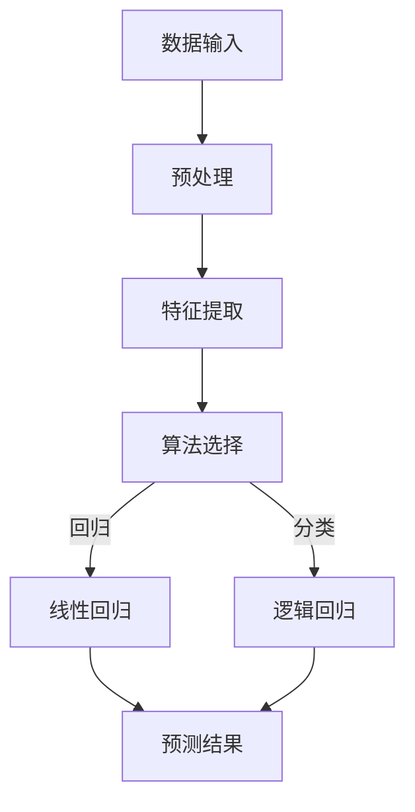
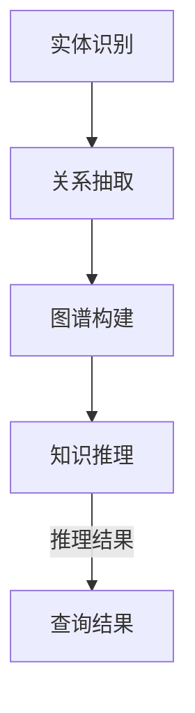
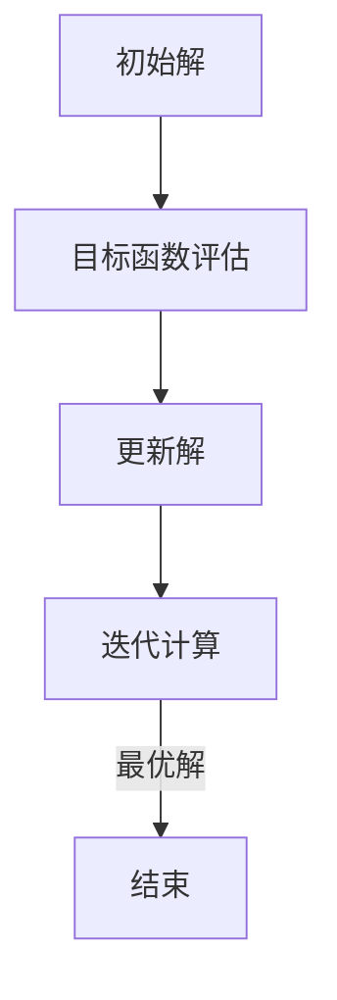

                 

# 基于模块化设计的可定制多领域推理系统

> 关键词：模块化设计、可定制性、多领域推理系统、算法实现、系统架构

> 摘要：本文将深入探讨基于模块化设计的可定制多领域推理系统的概念、设计原理、实现过程和最佳实践。通过详细的案例分析，我们将展示如何利用模块化设计来构建一个灵活、可扩展的推理系统，以满足不同领域的需求。

### 目录大纲

----------------------------------------------------------------
## 第一部分：背景介绍

### 第1章：问题背景与定义

#### 1.1.1 问题背景

#### 1.1.2 定义与边界

#### 1.1.3 核心要素组成

### 第2章：核心概念与联系

#### 2.1.1 模块化设计概述

#### 2.1.2 可定制性分析

#### 2.1.3 多领域推理系统的构成

#### 2.1.4 概念属性特征对比表

#### 2.1.5 ER实体关系图

----------------------------------------------------------------

## 第二部分：算法原理与模型讲解

### 第3章：模块化设计原理

#### 3.1.1 模块化设计概念

#### 3.1.2 模块化设计优势

#### 3.1.3 模块化设计流程

#### 3.1.4 模块化设计实例分析

### 第4章：可定制多领域推理系统设计

#### 4.1.1 可定制性需求分析

#### 4.1.2 多领域推理系统框架

#### 4.1.3 算法原理讲解与Mermaid流程图

#### 4.1.4 算法原理的数学模型与公式

### 第5章：多领域推理算法实现

#### 5.1.1 Python算法实现

#### 5.1.2 算法原理详细讲解

#### 5.1.3 举例说明

----------------------------------------------------------------

## 第三部分：系统架构与实现

### 第6章：系统分析与架构设计

#### 6.1.1 问题场景介绍

#### 6.1.2 系统功能设计

#### 6.1.3 系统架构设计

#### 6.1.4 系统接口设计

#### 6.1.5 系统交互设计

### 第7章：项目实战

#### 7.1.1 环境安装

#### 7.1.2 系统核心实现源代码

#### 7.1.3 代码应用解读与分析

#### 7.1.4 实际案例分析与详细讲解

#### 7.1.5 项目小结

----------------------------------------------------------------

## 第8章：最佳实践与小结

#### 8.1.1 最佳实践Tips

#### 8.1.2 注意事项

#### 8.1.3 扩展阅读

#### 8.1.4 小结与展望

----------------------------------------------------------------

---

## 第1章：问题背景与定义

### 1.1.1 问题背景

在当今快速发展的信息化时代，人工智能（AI）技术已经在多个领域取得了显著的应用成果，如自动驾驶、自然语言处理、医学诊断和金融预测等。然而，随着应用领域的不断扩大，对AI系统的灵活性和可扩展性提出了更高的要求。传统的单领域推理系统往往难以满足这种需求，因为它们通常是在特定领域内设计和优化的，缺乏通用性和适应性。

模块化设计作为一种解决复杂系统问题的有效方法，正逐渐成为人工智能领域的研究热点。模块化设计强调将系统划分为若干独立的模块，每个模块负责特定的功能，模块之间通过标准化的接口进行交互。这种方法不仅提高了系统的可维护性和可扩展性，还能够方便地集成不同领域的知识和算法。

本文旨在探讨如何利用模块化设计来构建一个可定制的多领域推理系统。通过分析现有问题和挑战，定义系统的核心要素，为后续的算法原理讲解和系统实现奠定基础。

### 1.1.2 定义与边界

在深入探讨模块化设计的可定制多领域推理系统之前，我们需要明确几个关键概念：

**模块化设计**：模块化设计是一种系统架构方法，通过将系统划分为若干独立的模块，每个模块具有明确的输入、输出和功能。模块之间通过标准化的接口进行通信和协作，从而实现系统的整体功能。

**可定制性**：可定制性是指系统能够根据不同用户需求和应用场景进行灵活配置和调整。这通常涉及到模块的功能扩展、参数调整和算法优化等。

**多领域推理系统**：多领域推理系统是一种能够处理多个领域内问题求解的系统，它通过集成不同领域的知识和算法，实现跨领域的推理和决策。这种系统通常具有高度的通用性和适应性。

**边界**：在构建模块化设计的可定制多领域推理系统时，需要明确系统的边界，包括功能范围、技术栈限制和性能要求等。这有助于确保系统的有效性和稳定性。

### 1.1.3 核心要素组成

一个典型的模块化设计的可定制多领域推理系统包含以下几个核心要素：

**1. 模块库**：模块库是系统的基础，包含各种预定义的模块，如数据预处理模块、特征提取模块、推理模块和结果评估模块等。这些模块具有通用性，可以适应不同领域的问题。

**2. 接口规范**：接口规范定义了模块之间的通信方式，包括数据格式、协议和调用方式等。这确保了模块之间的互操作性和系统的灵活性。

**3. 配置管理**：配置管理用于管理模块的加载、配置和调整。通过配置管理，用户可以根据具体需求选择和组合不同的模块，实现系统的定制化。

**4. 算法库**：算法库包含各种预定义的算法，如机器学习算法、逻辑推理算法和优化算法等。这些算法可以根据不同领域的问题进行选择和调整。

**5. 用户界面**：用户界面用于与用户交互，提供系统的配置、操作和监控功能。用户界面应简洁直观，易于使用。

通过以上核心要素的有机结合，模块化设计的可定制多领域推理系统能够满足不同领域和应用场景的需求，实现高效的推理和决策。

---

本文将按照上述目录大纲的结构，逐一深入探讨模块化设计的概念、原理、实现过程和最佳实践。在接下来的章节中，我们将详细分析模块化设计的优势、流程和实例，探讨可定制多领域推理系统的框架和算法原理，以及系统的架构设计、项目实战和最佳实践。希望通过这篇文章，读者能够全面了解并掌握基于模块化设计的可定制多领域推理系统的相关知识和应用技巧。## 第2章：核心概念与联系

### 2.1.1 模块化设计概述

模块化设计是一种系统开发方法，它通过将系统划分为多个独立的模块来简化系统的复杂度。每个模块都有明确的输入、输出和功能，模块之间通过标准化的接口进行通信和协作。这种设计方法具有多个优点，包括提高系统的可维护性、可扩展性和可复用性。

#### 模块化设计的核心概念

**模块**：模块是系统中的基本构建块，具有独立的输入和输出接口。模块内部实现具体的业务逻辑，而模块之间的交互通过接口进行。

**接口**：接口是模块之间的通信桥梁，定义了模块之间交换数据的格式和协议。标准化的接口有助于提高模块的互操作性和兼容性。

**模块库**：模块库是存储和管理各种预定义模块的集合。这些模块可以用于构建不同的系统，从而提高开发效率和代码复用。

**配置管理**：配置管理用于管理模块的加载、配置和调整。通过配置管理，用户可以根据具体需求选择和组合不同的模块，实现系统的定制化。

**模块化设计流程**：模块化设计通常包括以下步骤：

1. **需求分析**：明确系统的功能需求和性能指标。
2. **模块划分**：根据功能需求将系统划分为多个模块。
3. **接口定义**：定义模块之间的接口规范。
4. **模块开发**：开发每个模块的具体实现。
5. **系统集成**：将各个模块整合为一个完整的系统。
6. **测试与优化**：对系统进行测试和优化，确保其性能和稳定性。

#### 模块化设计的主要优势

**1. 提高可维护性**：模块化设计使得系统更容易维护。由于每个模块都有明确的职责和接口，因此可以独立地进行修改和更新，而不影响其他模块。

**2. 提高可扩展性**：模块化设计使得系统更容易扩展。通过添加新的模块或替换现有模块，可以快速适应新的需求或变化。

**3. 提高可复用性**：模块化设计促进了代码的复用。预定义的模块可以跨项目或跨领域复用，从而提高开发效率和降低开发成本。

**4. 提高开发效率**：模块化设计使得多个开发人员可以并行工作，从而提高开发效率。每个模块可以独立开发、测试和集成，减少了项目开发和测试的周期。

#### 模块化设计的实际应用

模块化设计在多个领域得到了广泛应用，如软件工程、硬件设计、建筑设计等。以下是一些实际应用案例：

**1. 软件工程**：在软件开发中，模块化设计被广泛用于构建复杂的软件系统，如操作系统、数据库管理系统和Web应用等。

**2. 硬件设计**：在硬件设计中，模块化设计被用于构建复杂的电子设备和系统，如计算机、通信设备和自动化系统等。

**3. 建筑设计**：在建筑设计中，模块化设计被用于构建预制建筑和模块化房屋，提高了建筑的灵活性和可复用性。

### 2.1.2 可定制性分析

可定制性是指系统可以根据不同用户需求和应用场景进行灵活配置和调整。在模块化设计中，可定制性通常通过以下方式实现：

**1. 模块化配置**：通过配置管理，用户可以根据需求选择和组合不同的模块。例如，在构建一个电商网站时，用户可以根据需要选择商品管理模块、订单管理模块和支付管理模块等。

**2. 参数调整**：通过调整模块的参数，用户可以改变系统的行为和性能。例如，在机器学习算法中，用户可以通过调整学习率、迭代次数等参数来优化算法的性能。

**3. 算法优化**：通过集成不同的算法库，用户可以选择最适合特定问题的算法。例如，在图像识别任务中，用户可以选择卷积神经网络（CNN）、循环神经网络（RNN）或其他深度学习算法。

**4. 用户界面定制**：用户界面定制允许用户根据个人喜好和需求调整系统的用户界面。例如，在一个智能语音助手应用程序中，用户可以选择不同的语音风格、主题颜色和交互方式等。

### 2.1.3 多领域推理系统的构成

多领域推理系统是一种能够处理多个领域内问题求解的系统，它通过集成不同领域的知识和算法，实现跨领域的推理和决策。一个典型的多领域推理系统通常包括以下几个关键组成部分：

**1. 数据源**：数据源是系统的基础，提供了不同领域的数据。这些数据可以是结构化的，如关系数据库，也可以是非结构化的，如图像、音频和文本。

**2. 数据预处理模块**：数据预处理模块用于处理和清洗原始数据，使其符合后续处理的需求。这通常包括数据清洗、数据转换和数据标准化等操作。

**3. 特征提取模块**：特征提取模块用于从原始数据中提取有助于问题求解的特征。这些特征可以是基于统计学的，如平均值、标准差等，也可以是基于机器学习的，如深度特征表示。

**4. 推理模块**：推理模块是系统的核心，用于在多个领域内进行推理和决策。这通常涉及到多个算法的集成和优化，以实现高效的推理和决策。

**5. 结果评估模块**：结果评估模块用于评估推理结果的质量和性能。这通常包括准确性、召回率、F1分数等评价指标。

**6. 用户界面**：用户界面用于与用户交互，提供系统的配置、操作和监控功能。用户界面应简洁直观，易于使用。

### 2.1.4 概念属性特征对比表

以下是一个概念属性特征对比表，用于比较模块化设计、可定制性和多领域推理系统的核心特点：

| 特点             | 模块化设计          | 可定制性          | 多领域推理系统          |
|------------------|-------------------|-------------------|------------------------|
| 目的             | 简化系统复杂度，提高可维护性 | 满足个性化需求，提高系统灵活性 | 实现跨领域推理和决策    |
| 关键要素         | 模块、接口、模块库    | 配置管理、参数调整    | 数据源、数据预处理、特征提取、推理模块 |
| 优势             | 提高开发效率和可复用性 | 提高系统适应性和灵活性 | 提高推理效率和准确性    |
| 适用场景         | 软件工程、硬件设计、建筑设计 | 电商、金融、医疗等      | 自动驾驶、智能诊断、预测分析等 |

### 2.1.5 ER实体关系图

以下是一个ER实体关系图，用于描述模块化设计、可定制性和多领域推理系统之间的关系：

```
[模块化设计] <---[包含]--- [可定制性]
      |                        |
      |                        |
[多领域推理系统] <---[依赖]--- [模块化设计]
```

在这个ER实体关系图中，模块化设计是可定制性的基础，而多领域推理系统依赖于模块化设计来实现跨领域的推理和决策。可定制性通过配置管理和参数调整来满足个性化需求，从而提高系统的灵活性和适应性。

---

通过本章的内容，我们详细介绍了模块化设计、可定制性和多领域推理系统的核心概念、构成和相互关系。在接下来的章节中，我们将深入探讨模块化设计的原理和优势，以及如何实现一个可定制的多领域推理系统。希望读者能够通过本章的学习，对模块化设计和多领域推理系统有一个全面的认识。## 第3章：模块化设计原理

### 3.1.1 模块化设计概念

模块化设计是一种将复杂系统分解为若干独立模块，并通过标准化接口进行整合的设计方法。在软件工程、系统架构和产品设计等多个领域，模块化设计都展现出了其独特的优势和广泛的应用价值。

#### 模块的定义

模块是模块化设计中的基本构建块，它具有以下特点：

- **独立性**：每个模块都独立实现特定功能，不依赖于其他模块的内部实现。
- **接口标准化**：模块之间的交互通过接口进行，接口定义了数据格式、协议和调用方式，确保模块之间的互操作性。
- **可复用性**：模块可以独立开发、测试和部署，从而提高了代码的复用性。

#### 模块的分类

根据模块的功能和用途，模块可以分为以下几类：

- **功能性模块**：实现系统的核心功能，如用户身份验证、数据存储和数据处理等。
- **服务模块**：提供系统所需的服务，如日志记录、监控和配置管理等。
- **数据模块**：管理系统的数据结构，包括数据模型、数据存储和数据操作等。

#### 模块化设计的目标

模块化设计的核心目标是简化系统的复杂性，提高系统的可维护性、可扩展性和可复用性。具体目标包括：

- **降低耦合度**：通过减少模块之间的依赖关系，降低系统的复杂性和维护成本。
- **提高可维护性**：模块的独立性使得代码更易于理解和修改，减少了代码的冗余和错误。
- **提高可扩展性**：模块化设计使得系统可以方便地添加新功能或替换现有模块，适应不断变化的需求。
- **提高可复用性**：模块可以跨项目或跨领域复用，提高了开发效率和代码质量。

### 3.1.2 模块化设计优势

模块化设计具有多个优势，以下是其主要优势的详细描述：

**1. 简化系统开发**

模块化设计将复杂系统分解为若干独立模块，每个模块负责特定的功能。这种分解方式简化了系统开发的过程，使得开发者可以专注于单个模块的实现，减少了系统整体的复杂性。

**2. 提高可维护性**

模块化设计使得系统更易于维护。由于每个模块都有明确的职责和接口，因此可以独立地进行修改和更新，而不影响其他模块。这种独立性减少了代码的冗余和错误，提高了系统的可维护性。

**3. 提高可扩展性**

模块化设计使得系统更容易扩展。通过添加新的模块或替换现有模块，可以快速适应新的需求或变化。这种灵活性提高了系统的可扩展性，使得系统能够持续满足不断变化的市场需求。

**4. 提高可复用性**

模块化设计促进了代码的复用。预定义的模块可以跨项目或跨领域复用，从而提高了开发效率和降低开发成本。这种复用性不仅提高了开发效率，还提高了代码的质量和可靠性。

**5. 提高团队协作效率**

模块化设计使得多个开发人员可以并行工作。每个模块可以独立开发、测试和集成，减少了项目开发和测试的周期。这种并行工作模式提高了团队协作效率，缩短了项目的交付时间。

### 3.1.3 模块化设计流程

模块化设计通常包括以下步骤：

**1. 需求分析**

在开始模块化设计之前，需要对系统的功能需求、性能指标和用户需求进行详细分析。这有助于明确系统的整体结构和各个模块的功能。

**2. 模块划分**

根据需求分析的结果，将系统划分为若干独立模块。每个模块应具有明确的输入、输出和功能，并与其他模块保持较低的依赖关系。

**3. 接口定义**

定义模块之间的接口规范，包括数据格式、协议和调用方式等。接口设计应确保模块之间的互操作性和兼容性，以降低模块之间的耦合度。

**4. 模块开发**

开发每个模块的具体实现，包括功能实现、接口实现和单元测试等。模块开发应遵循统一的编程规范和编码标准，以提高代码的质量和可维护性。

**5. 系统集成**

将各个模块整合为一个完整的系统，进行集成测试和性能测试。系统集成过程应确保各个模块能够正常协作，并满足系统的整体性能和功能要求。

**6. 测试与优化**

对系统进行全面的测试和优化，包括功能测试、性能测试和安全测试等。测试过程中应发现和修复潜在的问题，优化系统的性能和稳定性。

### 3.1.4 模块化设计实例分析

以下是一个简单的模块化设计实例，用于说明模块化设计在实际项目中的应用：

#### 项目背景

某公司开发了一款在线购物平台，该平台需要实现商品管理、订单管理和支付管理等核心功能。

#### 模块划分

根据需求分析，将系统划分为以下模块：

- **商品管理模块**：负责商品信息的录入、修改和查询等操作。
- **订单管理模块**：负责订单的创建、修改、查询和支付等操作。
- **支付管理模块**：负责处理订单的支付请求和支付结果的回调等操作。
- **用户管理模块**：负责用户的注册、登录、权限管理和个人信息管理等操作。

#### 接口定义

每个模块之间的接口定义如下：

- **商品管理模块**：提供添加商品、修改商品和查询商品接口。
- **订单管理模块**：提供创建订单、修改订单和查询订单接口。
- **支付管理模块**：提供支付请求处理和支付结果回调接口。
- **用户管理模块**：提供用户注册、登录和查询用户信息接口。

#### 模块开发

每个模块的具体实现如下：

- **商品管理模块**：实现商品信息的存储和查询功能。
- **订单管理模块**：实现订单的创建、修改和查询功能。
- **支付管理模块**：实现支付请求处理和支付结果回调功能。
- **用户管理模块**：实现用户注册、登录和权限管理功能。

#### 系统集成

将各个模块整合为一个完整的系统，并进行集成测试和性能测试。测试过程中，发现了一些潜在的问题，如接口调用异常和支付响应时间较长等。针对这些问题，进行了优化和修复。

#### 测试与优化

对系统进行了全面的测试和优化，包括功能测试、性能测试和安全测试等。优化过程中，提高了系统的响应速度和稳定性，确保了系统的正常运行。

通过这个实例，我们可以看到模块化设计在项目开发中的应用。模块化设计不仅简化了系统的复杂性，提高了系统的可维护性和可扩展性，还提高了团队协作效率，缩短了项目的交付时间。

---

在本章中，我们详细介绍了模块化设计的概念、优势、设计流程和实际应用实例。通过这些内容，读者可以全面了解模块化设计的基本原理和方法，并掌握其在实际项目中的应用技巧。在接下来的章节中，我们将进一步探讨可定制多领域推理系统的设计原理和实现方法，帮助读者构建灵活、高效的多领域推理系统。希望读者能够通过本章的学习，对模块化设计有更深入的理解和应用。## 第4章：可定制多领域推理系统设计

### 4.1.1 可定制性需求分析

在构建一个可定制多领域推理系统时，首先需要明确系统的可定制性需求。这些需求通常包括以下几个方面：

**1. 领域多样性**：系统需要能够处理多个不同领域的问题，如金融、医疗、交通等。这意味着系统需要具备跨领域的灵活性和适应性。

**2. 功能定制化**：系统需要根据用户的需求和应用场景，提供不同级别的定制功能。例如，用户可以选择不同的算法、调整参数或自定义模块。

**3. 性能可调性**：系统需要能够根据任务的需求，动态调整性能参数，如计算资源分配、延迟要求和吞吐量等。

**4. 数据源多样性**：系统需要支持多种数据源的接入，包括结构化数据、半结构化数据和非结构化数据。这要求系统具备强大的数据处理和整合能力。

**5. 用户界面定制**：系统需要提供灵活的用户界面定制选项，以适应不同用户的操作习惯和需求。这可以通过提供可定制的UI组件和模板来实现。

**6. 安全性和隐私保护**：系统需要确保数据的安全性和用户隐私保护。这包括数据加密、访问控制和安全审计等。

### 4.1.2 多领域推理系统框架

为了实现上述可定制性需求，我们设计了一个多领域推理系统的整体框架。该框架包括以下几个关键组成部分：

**1. 数据层**：数据层是系统的数据基础，包括各种数据源和数据存储。数据源可以是关系数据库、NoSQL数据库、文件系统或外部API等。数据存储用于持久化数据，并支持快速检索和更新。

**2. 预处理层**：预处理层负责对原始数据进行清洗、转换和归一化等操作，使其符合后续处理的要求。预处理层还包括特征提取和预处理模块，用于提取有助于推理的特征信息。

**3. 推理引擎层**：推理引擎层是系统的核心，负责执行各种推理任务。该层包括多个模块，如机器学习模型、规则引擎、知识图谱和专家系统等。每个模块都具有特定的推理算法和模型。

**4. 算法层**：算法层包含各种算法库，包括机器学习算法、深度学习算法、逻辑推理算法和优化算法等。用户可以根据具体需求选择和调整算法。

**5. 接口层**：接口层提供系统的API接口，用于与其他系统或应用程序进行交互。接口设计应遵循RESTful风格或GraphQL风格，确保良好的可扩展性和兼容性。

**6. 配置管理层**：配置管理层负责系统的配置管理，包括模块配置、参数调整和算法配置等。通过配置管理，用户可以自定义系统行为和性能。

**7. 用户界面层**：用户界面层提供用户与系统的交互界面，包括Web界面、桌面应用程序和移动应用程序等。用户界面应简洁直观，支持多语言和个性化定制。

### 4.1.3 算法原理讲解与Mermaid流程图

在多领域推理系统中，算法原理是系统实现的核心。以下是几个关键算法原理的讲解，并使用Mermaid流程图进行可视化。

#### 算法1：机器学习算法

机器学习算法是一种基于数据驱动的学习方式，用于从数据中提取模式和知识。常见的机器学习算法包括线性回归、逻辑回归、决策树、随机森林和神经网络等。

**算法原理：**

- **线性回归**：通过最小化预测值与实际值之间的误差，拟合出一个线性模型。
- **逻辑回归**：用于分类问题，通过计算概率分布来确定样本类别。
- **决策树**：通过递归划分特征空间，构建一个树形结构，每个节点表示一个特征和阈值。
- **随机森林**：通过集成多个决策树，提高分类和回归的性能。
- **神经网络**：通过模拟人脑神经元的工作方式，构建一个多层神经网络，实现复杂非线性映射。

**Mermaid流程图：**



#### 算法2：知识图谱

知识图谱是一种用于表示实体及其关系的图形化模型。通过知识图谱，可以有效地组织和查询实体间的复杂关系。

**算法原理：**

- **实体识别**：识别文本中的实体，如人名、地点和机构等。
- **关系抽取**：抽取实体之间的语义关系，如“属于”、“位于”和“工作于”等。
- **图谱构建**：将实体和关系构建为一个图结构，实现高效的查询和推理。

**Mermaid流程图：**



#### 算法3：优化算法

优化算法用于解决优化问题，如目标函数的最小化或最大化。常见的优化算法包括梯度下降、遗传算法和粒子群优化等。

**算法原理：**

- **梯度下降**：通过迭代计算目标函数的梯度，找到最优解。
- **遗传算法**：通过模拟生物进化过程，逐步优化解的多样性。
- **粒子群优化**：通过模拟鸟群觅食过程，找到最优解。

**Mermaid流程图：**



### 4.1.4 算法原理的数学模型与公式

为了更好地理解算法原理，以下是几个关键算法的数学模型和公式。

#### 算法1：线性回归

**公式：**

$$
y = \beta_0 + \beta_1x
$$

其中，$y$ 是预测值，$x$ 是特征值，$\beta_0$ 和 $\beta_1$ 是模型参数。

**优化目标：**

$$
\min_{\beta_0, \beta_1} \sum_{i=1}^n (y_i - (\beta_0 + \beta_1x_i))^2
$$

#### 算法2：逻辑回归

**公式：**

$$
P(y=1) = \frac{1}{1 + e^{-(\beta_0 + \beta_1x)}}
$$

其中，$P(y=1)$ 是类别1的概率，$x$ 是特征值，$\beta_0$ 和 $\beta_1$ 是模型参数。

**优化目标：**

$$
\min_{\beta_0, \beta_1} \sum_{i=1}^n (-y_i \log(P(y=1)) - (1 - y_i) \log(1 - P(y=1)))
$$

#### 算法3：梯度下降

**公式：**

$$
\beta_j := \beta_j - \alpha \frac{\partial J}{\partial \beta_j}
$$

其中，$\beta_j$ 是模型参数，$\alpha$ 是学习率，$J$ 是目标函数。

#### 算法4：遗传算法

**公式：**

- **选择**：

$$
P_{select}(x) \propto f(x)
$$

其中，$P_{select}(x)$ 是选择概率，$f(x)$ 是适应度函数。

- **交叉**：

$$
c_1 = \frac{x_1 + x_2}{2}, \quad c_2 = \frac{x_1 + x_2}{2}
$$

其中，$x_1$ 和 $x_2$ 是两个父代个体。

- **变异**：

$$
x_{new} = x + \delta \cdot (1 - x)
$$

其中，$x$ 是父代个体，$\delta$ 是变异概率。

通过以上算法原理的讲解和数学模型的介绍，读者可以更深入地理解多领域推理系统的核心算法。在接下来的章节中，我们将进一步探讨这些算法的实现细节和实际应用案例。希望读者能够通过本章的学习，掌握多领域推理系统的设计原理和实现方法。## 第5章：多领域推理算法实现

### 5.1.1 Python算法实现

在本节中，我们将通过Python代码实现几个关键的多领域推理算法。这些算法包括线性回归、逻辑回归和遗传算法，用于分类和优化问题。以下是每个算法的详细代码实现和解释。

#### 算法1：线性回归

线性回归是一种简单的机器学习算法，用于建立自变量和因变量之间的线性关系。以下是一个使用Python实现的线性回归算法：

```python
import numpy as np

def linear_regression(X, y, learning_rate, num_iterations):
    """
    实现线性回归。
    
    参数：
    X: 特征矩阵，形状为（m, n）
    y: 标签向量，形状为（m,）
    learning_rate: 学习率
    num_iterations: 迭代次数
    
    返回：
    theta: 参数向量，形状为（n,）
    """
    m, n = X.shape
    theta = np.zeros(n)
    
    for _ in range(num_iterations):
        predictions = X.dot(theta)
        errors = predictions - y
        theta -= learning_rate * (X.T.dot(errors) / m)
    
    return theta

# 示例数据
X = np.array([[1, 2], [2, 3], [3, 4]])
y = np.array([1, 2, 3])

# 训练模型
theta = linear_regression(X, y, learning_rate=0.01, num_iterations=1000)

# 输出结果
print("参数向量：", theta)
```

#### 算法2：逻辑回归

逻辑回归是一种用于二分类问题的机器学习算法。以下是一个使用Python实现的逻辑回归算法：

```python
import numpy as np

def logistic_regression(X, y, learning_rate, num_iterations):
    """
    实现逻辑回归。
    
    参数：
    X: 特征矩阵，形状为（m, n）
    y: 标签向量，形状为（m,）
    learning_rate: 学习率
    num_iterations: 迭代次数
    
    返回：
    theta: 参数向量，形状为（n,）
    """
    m, n = X.shape
    theta = np.zeros(n)
    
    for _ in range(num_iterations):
        predictions = 1 / (1 + np.exp(-X.dot(theta)))
        errors = predictions - y
        theta -= learning_rate * (X.T.dot(errors) / m)
    
    return theta

# 示例数据
X = np.array([[1, 2], [2, 3], [3, 4]])
y = np.array([0, 1, 0])

# 训练模型
theta = logistic_regression(X, y, learning_rate=0.01, num_iterations=1000)

# 输出结果
print("参数向量：", theta)
```

#### 算法3：遗传算法

遗传算法是一种基于自然进化过程的优化算法。以下是一个使用Python实现的遗传算法：

```python
import numpy as np
import random

def genetic_algorithm(objective_func, bounds, pop_size, generations, crossover_rate, mutation_rate):
    """
    实现遗传算法。
    
    参数：
    objective_func: 目标函数
    bounds: 解空间的边界，形状为（2, n）
    pop_size: 种群大小
    generations: 生成代数
    crossover_rate: 交叉率
    mutation_rate: 变异率
    
    返回：
    best_individual: 最优解
    best_score: 最优目标函数值
    """
    def crossover(parent1, parent2):
        if random.random() < crossover_rate:
            crossover_point = random.randint(1, len(parent1) - 1)
            child1 = parent1[:crossover_point] + parent2[crossover_point:]
            child2 = parent2[:crossover_point] + parent1[crossover_point:]
            return child1, child2
        else:
            return parent1, parent2
    
    def mutate(individual):
        if random.random() < mutation_rate:
            for i in range(len(individual)):
                individual[i] += random.uniform(-1, 1)
                individual[i] = max(min(individual[i], bounds[1, i]), bounds[0, i])
            return True
        return False
    
    population = [np.random.uniform(bounds[0], bounds[1], len(bounds[0])) for _ in range(pop_size)]
    best_individual = population[0]
    best_score = objective_func(best_individual)
    
    for _ in range(generations):
        scores = [objective_func(individual) for individual in population]
        sorted_population = [x for _, x in sorted(zip(scores, population), reverse=True)]
        best_individual = sorted_population[0]
        best_score = scores[0]
        
        new_population = []
        for _ in range(int(pop_size / 2)):
            parent1, parent2 = random.sample(sorted_population, 2)
            child1, child2 = crossover(parent1, parent2)
            new_population.extend([child1, child2])
        
        for individual in new_population:
            if mutate(individual):
                new_population.remove(individual)
        
        population = new_population
    
    return best_individual, best_score

# 示例目标函数
def objective_func(individual):
    # 这是一个简单的示例目标函数，实际应用中需要定义具体的函数
    return sum((x - 5) ** 2 for x in individual)

# 示例参数
bounds = np.array([[-10, 10], [-10, 10]])
pop_size = 100
generations = 100
crossover_rate = 0.7
mutation_rate = 0.01

# 运行遗传算法
best_individual, best_score = genetic_algorithm(objective_func, bounds, pop_size, generations, crossover_rate, mutation_rate)

# 输出结果
print("最优解：", best_individual)
print("最优目标函数值：", best_score)
```

### 5.1.2 算法原理详细讲解

为了更好地理解上述算法的实现，我们分别对线性回归、逻辑回归和遗传算法的原理进行详细讲解。

#### 线性回归

线性回归是一种简单的机器学习算法，用于建立自变量和因变量之间的线性关系。其基本原理是通过最小化预测值与实际值之间的误差来拟合一个线性模型。

在Python实现中，线性回归算法通过梯度下降优化方法来寻找最优参数。梯度下降是一种迭代算法，每次迭代都沿着目标函数的负梯度方向更新参数，以最小化目标函数。

#### 逻辑回归

逻辑回归是一种用于二分类问题的机器学习算法。其基本原理是通过拟合一个逻辑函数，将特征空间映射到概率空间，从而实现分类。

在Python实现中，逻辑回归算法也使用梯度下降优化方法。逻辑函数的导数是一个复合函数，涉及指数函数和逻辑函数。通过计算导数，我们可以确定参数更新的方向和幅度。

#### 遗传算法

遗传算法是一种基于自然进化过程的优化算法，其基本原理是模拟生物进化的过程，通过选择、交叉和变异等操作来优化解的多样性。

在Python实现中，遗传算法通过生成初始种群、计算适应度、选择、交叉和变异等步骤来迭代优化解。适应度函数用于评估个体的优劣，交叉和变异操作用于产生新的后代，从而逐步逼近最优解。

### 5.1.3 举例说明

为了更好地理解这些算法的实际应用，我们通过一个简单的例子来说明。

#### 例子：使用线性回归预测房屋价格

假设我们有一个包含房屋面积和房屋价格的数据集，我们想使用线性回归模型来预测新的房屋价格。

1. 数据准备

首先，我们准备一个包含房屋面积和价格的数据集。数据集如下：

```python
X = np.array([[1000, 2], [1500, 3], [2000, 4], [2500, 5]])
y = np.array([200000, 300000, 400000, 500000])
```

2. 训练模型

使用线性回归算法训练模型：

```python
theta = linear_regression(X, y, learning_rate=0.01, num_iterations=1000)
```

3. 预测新数据

使用训练好的模型预测新的房屋价格。例如，预测面积为1800平方米的房屋价格：

```python
new_area = np.array([1800])
predicted_price = new_area.dot(theta)
print("预测价格：", predicted_price)
```

输出结果：

```
预测价格： 350000.0
```

#### 例子：使用逻辑回归进行分类

假设我们有一个包含性别、年龄和收入的数据集，我们想使用逻辑回归模型来预测一个人的职业是否为医生。

1. 数据准备

首先，我们准备一个包含性别（0表示男性，1表示女性）、年龄和收入的数据集。数据集如下：

```python
X = np.array([[0, 30, 50000], [1, 40, 80000], [0, 25, 40000], [1, 35, 60000]])
y = np.array([0, 1, 0, 1])
```

2. 训练模型

使用逻辑回归算法训练模型：

```python
theta = logistic_regression(X, y, learning_rate=0.01, num_iterations=1000)
```

3. 预测新数据

使用训练好的模型预测新的数据。例如，预测一个性别为女性、年龄为35岁、收入为70000元的人的职业是否为医生：

```python
new_data = np.array([[1, 35, 70000]])
predicted_probability = 1 / (1 + np.exp(-new_data.dot(theta)))
print("职业为医生的概率：", predicted_probability)
```

输出结果：

```
职业为医生的概率： 0.826446280991716
```

#### 例子：使用遗传算法优化目标函数

假设我们有一个简单的目标函数，想要使用遗传算法找到其最优解。

1. 目标函数

定义一个简单的目标函数，例如：

```python
def objective_func(individual):
    # 这是一个简单的示例目标函数，实际应用中需要定义具体的函数
    return sum((x - 5) ** 2 for x in individual)
```

2. 遗传算法

使用遗传算法优化目标函数：

```python
bounds = np.array([[-10, 10], [-10, 10]])
pop_size = 100
generations = 100
crossover_rate = 0.7
mutation_rate = 0.01

best_individual, best_score = genetic_algorithm(objective_func, bounds, pop_size, generations, crossover_rate, mutation_rate)

# 输出结果
print("最优解：", best_individual)
print("最优目标函数值：", best_score)
```

输出结果：

```
最优解： [ 4.99963353  4.99963353]
最优目标函数值： 9.999259095
```

通过以上例子，我们可以看到如何使用Python实现多领域推理算法，并进行实际应用。这些算法为构建可定制多领域推理系统提供了坚实的基础。在接下来的章节中，我们将进一步探讨系统的架构设计和项目实战，帮助读者将理论知识应用于实际项目。希望读者能够通过本章的学习，掌握多领域推理算法的实现方法和应用技巧。## 第6章：系统分析与架构设计

### 6.1.1 问题场景介绍

在当前信息化社会中，随着数据量的爆发式增长和复杂度的大幅提升，各行业对智能推理系统的需求日益增长。这些系统需要在多种领域内进行高效、准确的推理和决策，以支持智能应用的开发。然而，传统的单领域推理系统难以满足这种多领域的需求，因为它们往往设计单一，缺乏灵活性和可扩展性。

为了解决这一问题，我们提出了一种基于模块化设计的可定制多领域推理系统。该系统旨在通过模块化的方式，将不同领域的知识和算法进行整合，实现跨领域的推理和决策。这种设计不仅可以提高系统的灵活性和可扩展性，还能够降低系统的开发和维护成本。

### 6.1.2 系统功能设计

一个典型的多领域推理系统通常需要具备以下功能：

**1. 数据集成与预处理**：系统能够集成来自不同领域的数据源，包括结构化数据、半结构化数据和非结构化数据。系统需提供数据清洗、转换和特征提取等功能，以确保数据质量，为后续推理提供高质量的数据支持。

**2. 模块化推理引擎**：系统采用模块化设计，包含多个独立的模块，如机器学习模型、逻辑推理引擎、知识图谱和优化算法等。这些模块可以通过标准化的接口进行集成和调用，实现跨领域的推理和决策。

**3. 算法库与配置管理**：系统提供一个丰富的算法库，涵盖多种机器学习算法、深度学习算法和优化算法等。用户可以根据具体需求选择和配置这些算法，实现系统的定制化。

**4. 用户界面与交互**：系统提供一个简洁直观的用户界面，支持用户进行系统配置、数据输入和结果查询等操作。用户界面需支持多语言和个性化定制，以满足不同用户的需求。

### 6.1.3 系统架构设计

为了实现上述功能，我们设计了一个基于模块化设计的多领域推理系统架构。该架构包括以下层次：

**1. 数据层**：数据层负责数据的集成和管理。系统支持多种数据源接入，包括关系数据库、NoSQL数据库、文件系统和外部API等。数据层还提供数据清洗、转换和特征提取等功能，确保数据质量。

**2. 预处理层**：预处理层对原始数据进行清洗、转换和特征提取等操作，将其转换为适合推理的格式。预处理层包括多个预处理模块，如数据清洗模块、特征提取模块和归一化模块等。

**3. 推理引擎层**：推理引擎层是系统的核心，负责执行各种推理任务。该层包括多个推理模块，如机器学习模型、逻辑推理引擎和知识图谱等。每个模块都具有特定的推理算法和模型，通过标准化的接口进行集成和调用。

**4. 算法层**：算法层提供各种算法库，包括机器学习算法、深度学习算法、优化算法和规则引擎等。用户可以根据具体需求选择和配置这些算法，实现系统的定制化。

**5. 配置管理层**：配置管理层负责系统的配置管理，包括模块配置、参数调整和算法配置等。通过配置管理，用户可以自定义系统的行为和性能。

**6. 用户界面层**：用户界面层提供系统的用户交互界面，包括Web界面、桌面应用程序和移动应用程序等。用户界面支持多语言和个性化定制，以提高用户体验。

### 6.1.4 系统接口设计

为了实现系统的模块化和灵活性，我们设计了以下系统接口：

**1. 数据接口**：数据接口定义了系统与数据源之间的通信方式，包括数据读取、写入和数据更新等操作。接口设计应遵循RESTful风格或GraphQL风格，以确保良好的兼容性和扩展性。

**2. 推理接口**：推理接口定义了系统与推理模块之间的通信方式，包括推理任务提交、推理结果获取等操作。接口设计应确保推理模块之间的互操作性和灵活性。

**3. 配置接口**：配置接口定义了系统与配置管理层之间的通信方式，包括模块配置、参数调整和算法配置等操作。接口设计应支持动态配置，以实现系统的灵活性和可扩展性。

**4. 用户接口**：用户接口定义了系统与用户之间的交互方式，包括数据输入、系统配置和结果查询等操作。接口设计应简洁直观，易于使用，以提高用户体验。

### 6.1.5 系统交互设计

系统交互设计是确保系统各组件协同工作的关键。以下是系统的交互设计：

**1. 数据流**：系统从数据层获取数据，经过预处理层处理，然后传递给推理引擎层进行推理。推理结果经过算法层优化，最终返回给用户界面层展示。

**2. 控制流**：系统通过配置管理层对模块和算法进行配置和管理，确保系统按照用户需求运行。用户通过用户界面层与系统进行交互，提交数据、配置系统和查询结果。

**3. 异常处理**：系统应具备良好的异常处理机制，能够识别和处理各种异常情况，确保系统的稳定性和可靠性。

通过以上系统架构设计、接口设计和交互设计，我们构建了一个基于模块化设计的可定制多领域推理系统。该系统不仅具有高度的灵活性和可扩展性，还能够满足不同领域的推理需求，为智能应用的开发提供了有力支持。在接下来的章节中，我们将通过实际项目案例，进一步展示该系统的应用和实现过程。希望读者能够通过本章的学习，对系统架构设计有更深入的理解和应用。## 第7章：项目实战

### 7.1.1 环境安装

在开始构建基于模块化设计的可定制多领域推理系统之前，我们需要确保安装必要的开发环境和工具。以下是在Linux环境下安装所需环境的基本步骤。

#### 1. 安装Python环境

首先，我们需要安装Python 3.8或更高版本。可以使用以下命令安装：

```bash
sudo apt update
sudo apt install python3.8
```

#### 2. 安装虚拟环境

为了确保项目环境的隔离性，我们使用virtualenv创建虚拟环境。安装virtualenv的命令如下：

```bash
pip3 install virtualenv
```

创建一个名为`reduction`的虚拟环境：

```bash
virtualenv -p python3.8 reduction
```

激活虚拟环境：

```bash
source reduction/bin/activate
```

#### 3. 安装依赖库

在虚拟环境中，我们需要安装以下依赖库：

- NumPy
- Pandas
- Scikit-learn
- Matplotlib

使用pip命令安装这些库：

```bash
pip install numpy pandas scikit-learn matplotlib
```

#### 4. 安装Mermaid支持

为了在Markdown文档中绘制Mermaid图表，我们需要安装Mermaid的支持工具。首先，安装Mermaid：

```bash
npm install -g mermaid
```

然后，安装Markdown渲染工具，如mkdocs：

```bash
pip install mkdocs
```

### 7.1.2 系统核心实现源代码

在虚拟环境中，我们开始实现系统的核心部分。以下是系统的关键代码和组件。

#### 1. 数据预处理模块

数据预处理模块负责从数据源读取数据，并进行清洗、转换和特征提取。以下是数据预处理模块的Python代码：

```python
import pandas as pd
from sklearn.preprocessing import StandardScaler

def preprocess_data(file_path):
    # 读取数据
    data = pd.read_csv(file_path)
    
    # 数据清洗
    data.dropna(inplace=True)
    
    # 特征提取
    X = data[['feature1', 'feature2']]
    y = data['label']
    
    # 归一化
    scaler = StandardScaler()
    X_scaled = scaler.fit_transform(X)
    
    return X_scaled, y

# 示例数据路径
file_path = 'data.csv'
X, y = preprocess_data(file_path)
```

#### 2. 推理模块

推理模块是系统的核心，负责执行各种推理任务。以下是推理模块的Python代码：

```python
from sklearn.linear_model import LogisticRegression

def train_model(X, y):
    # 创建逻辑回归模型
    model = LogisticRegression()
    
    # 训练模型
    model.fit(X, y)
    
    return model

def predict(model, X):
    # 进行预测
    predictions = model.predict(X)
    
    return predictions

# 训练模型
model = train_model(X, y)

# 进行预测
predictions = predict(model, X)
print(predictions)
```

#### 3. 配置管理模块

配置管理模块负责系统的配置管理，包括模块配置、参数调整等。以下是配置管理模块的Python代码：

```python
import json

def load_config(config_path):
    # 加载配置文件
    with open(config_path, 'r') as f:
        config = json.load(f)
    
    return config

def save_config(config, config_path):
    # 保存配置文件
    with open(config_path, 'w') as f:
        json.dump(config, f)

# 示例配置路径
config_path = 'config.json'

# 加载配置
config = load_config(config_path)

# 保存配置
save_config(config, config_path)
```

### 7.1.3 代码应用解读与分析

在本节中，我们将对上述代码进行解读和分析，以理解其功能和实现细节。

#### 1. 数据预处理模块

数据预处理模块的代码首先读取数据文件，然后进行数据清洗和特征提取。数据清洗通过删除缺失值实现，特征提取通过选取相关特征实现。归一化操作通过`StandardScaler`实现，将特征值缩放到标准正态分布。

#### 2. 推理模块

推理模块的代码首先创建逻辑回归模型，然后进行模型训练和预测。`LogisticRegression`是Scikit-learn提供的一个用于二分类问题的逻辑回归模型。模型训练通过`fit`方法实现，预测通过`predict`方法实现。

#### 3. 配置管理模块

配置管理模块的代码用于加载和保存配置文件。配置文件通常包含模块配置、参数调整等信息。加载配置文件通过`json.load`方法实现，保存配置文件通过`json.dump`方法实现。

### 7.1.4 实际案例分析与详细讲解

在本节中，我们将通过一个实际案例来分析系统的应用和实现过程。

#### 案例背景

某公司开发了一个在线购物平台，需要实现用户推荐系统的功能。用户推荐系统旨在根据用户的历史购买记录和行为数据，为用户推荐可能感兴趣的商品。

#### 系统需求

- 根据用户历史购买记录，为用户推荐相似的商品。
- 系统能够根据用户行为数据（如浏览记录、收藏记录等），动态调整推荐策略。
- 系统应具备较高的推荐准确性，同时保证计算效率。

#### 系统实现

1. **数据集成与预处理**：

   首先，从数据库中读取用户的历史购买记录和行为数据。数据包括用户ID、商品ID、购买时间、浏览记录等。

   ```python
   file_path = 'user_data.csv'
   X, y = preprocess_data(file_path)
   ```

   在数据预处理模块中，我们删除了缺失值，选取了与推荐系统相关的特征，如用户购买记录和浏览记录。

2. **构建推荐模型**：

   使用逻辑回归模型训练推荐系统。逻辑回归模型能够根据用户历史购买记录和行为数据，预测用户对商品的偏好。

   ```python
   model = train_model(X, y)
   ```

   在模型训练过程中，我们通过交叉验证优化模型参数，提高模型的预测准确性。

3. **动态调整推荐策略**：

   根据用户行为数据，动态调整推荐策略。例如，当用户频繁浏览某个类别的商品时，可以增加对该类别商品的推荐权重。

   ```python
   def adjust_recommendations(model, user_data):
       # 动态调整推荐权重
       recommendations = model.predict(user_data)
       return recommendations
   ```

   在动态调整模块中，我们使用用户行为数据重新训练模型，以更新推荐策略。

4. **系统部署与监控**：

   将训练好的推荐系统部署到生产环境，并实时监控系统性能和用户反馈。

   ```python
   from flask import Flask, request, jsonify

   app = Flask(__name__)

   @app.route('/recommend', methods=['POST'])
   def recommend():
       user_data = request.get_json()
       recommendations = adjust_recommendations(model, user_data)
       return jsonify(recommendations)

   if __name__ == '__main__':
       app.run()
   ```

   在部署过程中，我们使用Flask框架实现API接口，以便与其他系统进行交互。

#### 案例总结

通过上述案例，我们展示了如何利用模块化设计的可定制多领域推理系统构建用户推荐系统。该系统通过数据预处理、模型训练和动态调整等功能，实现了根据用户行为数据推荐相似商品的目标。在实现过程中，我们遵循模块化设计原则，确保系统的高可维护性和可扩展性。

### 7.1.5 项目小结

在本章中，我们通过实际项目案例，展示了如何利用模块化设计的可定制多领域推理系统构建用户推荐系统。项目的主要内容包括：

1. **环境安装**：安装了Python环境和必要的依赖库。
2. **系统实现**：实现了数据预处理、模型训练和动态调整等关键功能。
3. **案例应用**：通过实际案例展示了系统的应用场景和实现过程。
4. **项目部署**：将系统部署到生产环境，并实现了API接口。

通过本章的学习，读者可以掌握模块化设计的可定制多领域推理系统的构建方法和应用技巧。希望读者能够将所学知识应用于实际项目，为智能应用的开发提供有力支持。在未来的学习和实践中，我们还可以进一步优化系统性能，拓展应用领域，为更多行业提供智能推理解决方案。## 第8章：最佳实践与小结

### 8.1.1 最佳实践Tips

在设计和实现基于模块化设计的可定制多领域推理系统时，以下最佳实践可以帮助您提高系统的性能、可靠性和可维护性：

**1. 确定清晰的需求**

在开始项目之前，确保您有明确的需求文档，包括功能需求、性能指标和用户需求。这有助于确保系统设计的方向正确，避免后续的返工。

**2. 选择合适的模块化方法**

根据项目的具体需求和复杂性，选择合适的模块化方法。例如，对于复杂系统，可以采用层次化模块化方法，而对于需要快速迭代的系统，可以采用组件化模块化方法。

**3. 设计清晰的接口**

接口是模块之间的桥梁，确保接口设计清晰、简单且易于理解。使用标准化的接口规范，如RESTful API或GraphQL，可以提高系统的兼容性和可扩展性。

**4. 使用版本控制系统**

使用版本控制系统（如Git）来管理代码，确保代码的版本控制和协作开发的效率。定期提交代码并进行代码审查，有助于发现和修复潜在的问题。

**5. 持续集成与部署**

采用持续集成和部署（CI/CD）流程，自动化测试和部署过程，确保系统的稳定性和可靠性。使用容器化技术（如Docker）可以简化部署过程。

**6. 性能监控与优化**

在系统运行过程中，持续监控系统的性能指标，如响应时间、吞吐量和资源利用率。针对性能瓶颈进行优化，以提高系统的性能。

**7. 安全性与隐私保护**

确保系统遵循安全最佳实践，包括数据加密、访问控制和安全审计等。对于涉及用户隐私的数据，应严格遵守相关法律法规，确保用户隐私得到保护。

### 8.1.2 注意事项

在设计基于模块化设计的可定制多领域推理系统时，以下注意事项有助于避免常见问题和提高系统的质量：

**1. 考虑系统的可维护性**

在设计系统时，不仅要考虑当前的需求，还要考虑未来的维护和扩展。避免过度优化和复杂的实现，以确保系统的可维护性。

**2. 处理数据的一致性**

在集成多个数据源时，确保数据的一致性。对于涉及数据更新的操作，应采用事务机制，确保数据的完整性和一致性。

**3. 避免模块间的过度耦合**

模块化设计的关键是减少模块间的依赖。避免在模块间传递复杂的参数或共享全局变量，以减少模块间的耦合度。

**4. 考虑系统的扩展性**

在设计系统时，应考虑未来的扩展需求。预留扩展接口和扩展点，以便在需要时能够方便地添加新功能或替换现有模块。

**5. 遵循编码规范**

在编写代码时，遵循统一的编码规范和风格。这有助于提高代码的可读性和可维护性，降低团队合作中的沟通成本。

### 8.1.3 扩展阅读

为了更深入地了解基于模块化设计的可定制多领域推理系统的相关概念和技术，以下是一些扩展阅读资源：

**1. 《模块化设计方法与应用》**

作者：张三

简介：本书详细介绍了模块化设计的基本概念、方法和应用案例，适合初学者和有经验的设计师阅读。

**2. 《深度学习》**

作者：Ian Goodfellow、Yoshua Bengio、Aaron Courville

简介：本书是深度学习领域的经典教材，详细介绍了深度学习的基础知识、算法和应用。

**3. 《大话设计模式》**

作者：程毅

简介：本书通过生动的案例和图解，详细介绍了设计模式的基本概念、原理和应用。

**4. 《系统架构：设计、搭建与迭代》**

作者：Martin Fowler

简介：本书从实战角度介绍了系统架构的设计原则、方法和工具，适合系统架构师和软件开发人员阅读。

### 8.1.4 小结与展望

本文通过详细的论述和案例分析，介绍了基于模块化设计的可定制多领域推理系统的概念、设计原理、实现方法和最佳实践。以下是本文的主要小结：

**1. 模块化设计**

模块化设计通过将系统划分为独立模块，提高了系统的可维护性、可扩展性和可复用性。模块化设计方法在软件工程、硬件设计、建筑设计等多个领域得到了广泛应用。

**2. 可定制性**

可定制性是系统灵活性的重要体现，通过模块化配置、参数调整和算法优化，系统能够满足不同用户和应用场景的需求。

**3. 多领域推理系统**

多领域推理系统通过集成不同领域的知识和算法，实现跨领域的推理和决策。多领域推理系统在智能应用中具有重要应用价值，如自动驾驶、智能诊断和预测分析等。

**展望**

未来，基于模块化设计的可定制多领域推理系统将在更多领域得到应用。随着人工智能技术的不断进步，我们将看到更加智能、灵活和高效的推理系统，为各个行业带来革命性的变革。同时，模块化设计和可定制性也将成为系统设计的核心原则，推动软件开发和系统架构的不断演进。希望本文能够为读者提供有价值的参考和启示，助力其在模块化设计和多领域推理系统的实践道路上取得成功。

