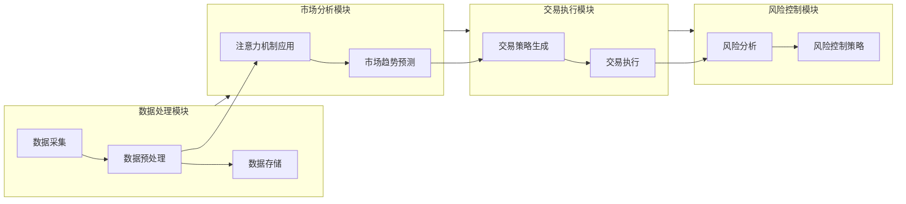
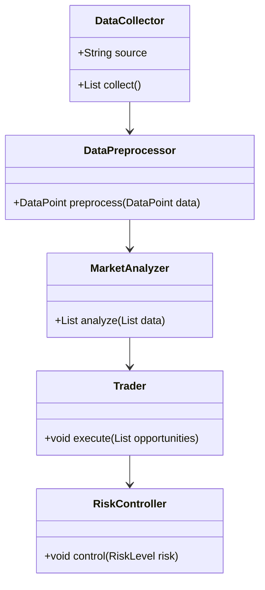
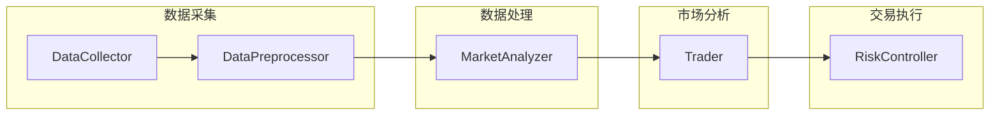
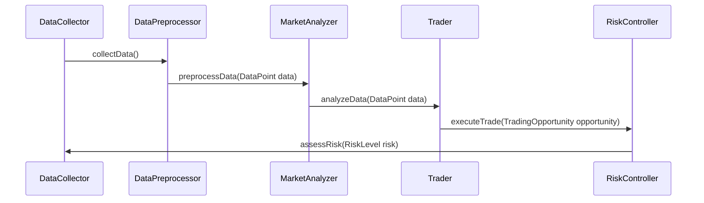
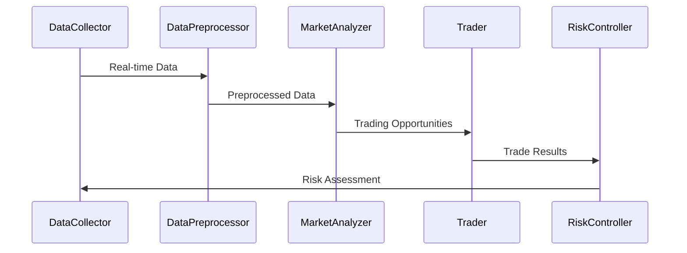

                 

### 第1章 引言：问题背景与目标

**1.1 问题背景**

金融市场是现代经济体系的核心，其高频交易活动在金融市场中占有重要地位。高频交易（High-Frequency Trading, HFT）通过使用高速算法和先进的硬件设备，在短时间内完成大量交易，以期从微小的价格波动中获取利润。然而，随着金融市场数据量的大幅增长和交易频率的不断提高，传统的金融市场高频交易策略面临着巨大的挑战。传统的策略由于缺乏对大量实时数据的有效处理能力和对复杂市场动态的迅速响应能力，难以在激烈的市场竞争中保持优势。

**1.2 问题描述**

高频交易策略系统需要解决的关键问题包括：如何高效地处理海量实时数据、如何快速识别市场机会、如何精确地执行交易操作，以及如何在复杂的交易环境中实现风险控制。这些问题决定了高频交易策略系统的性能和成功与否。

- **数据处理**：高频交易需要处理大量实时数据，包括价格、成交量、交易时间等。传统的数据处理方法往往难以应对这样的数据量级。
- **市场机会识别**：高频交易依赖于对市场动态的快速反应，需要能够迅速识别潜在的市场机会。
- **交易执行**：高频交易要求交易系统能够以极快的速度执行交易操作，确保交易决策的及时性和准确性。
- **风险控制**：高频交易在快速交易的同时，也面临着较高的风险。因此，交易系统需要具备有效的风险控制机制，以避免因市场波动导致的重大损失。

**1.3 问题解决**

为了应对上述挑战，本书提出了基于注意力机制的AI金融市场高频交易策略系统。通过引入注意力机制，系统能够更加关注关键的市场信息，提高数据处理的效率和准确性。同时，基于AI的算法能够从海量数据中自动学习，识别出潜在的交易机会，并实现自动化的交易决策。

**1.4 边界与外延**

本研究的重点在于基于注意力机制的AI高频交易策略系统，不包括其他类型的人工智能算法和高频交易策略。同时，本研究主要关注策略系统的设计和实现，而不涉及具体的金融产品或市场操作。

**1.5 概念结构与核心要素组成**

- **注意力机制**：注意力机制是深度学习中的一个关键概念，用于提高模型对重要信息的关注程度，从而提高模型的性能。
- **AI金融市场高频交易策略系统**：一个集成了注意力机制的人工智能系统，用于在金融市场中进行高频交易。
- **数据处理**：高效的数据处理能力是高频交易策略系统的关键，包括实时数据采集、预处理和存储。
- **市场分析**：基于注意力机制的市场分析，能够迅速识别市场机会和风险。
- **交易执行**：精确的交易执行能力，确保交易操作的及时性和准确性。
- **风险控制**：对交易过程中的风险进行评估和控制。

### 第2章 核心概念与联系

**2.1 注意力机制原理**

注意力机制（Attention Mechanism）是深度学习中用于解决序列处理问题的一项关键技术。它的基本思想是在处理序列数据时，动态地分配不同的关注程度（权重）给序列中的各个部分，从而使模型能够更加关注重要信息，提升处理效率和效果。

#### 2.1.1 注意力机制的数学模型

注意力机制的数学模型通常可以表示为：

$$
Attention(x) = \sum_{i} w_i x_i
$$

其中，$w_i$ 是对第 $i$ 个元素的注意力权重，$x_i$ 是第 $i$ 个元素本身。

#### 2.1.2 注意力机制的属性特征对比表格

| 特征对比项 | 注意力机制 | 重要性 |
|:-----------|:-----------|:-------|
| 动态性 | 可以根据输入动态调整权重 | 高 |
| 灵活性 | 能够处理不同长度的序列 | 高 |
| 效率 | 增加了模型的计算复杂度，但相对较低 | 中 |
| 可解释性 | 较难解释每个元素的权重 | 低 |

**2.2 AI金融市场高频交易策略系统**

AI金融市场高频交易策略系统是集成了注意力机制的人工智能系统，用于在金融市场中进行高频交易。这个系统主要包括以下几个核心模块：

#### 2.2.1 数据处理模块

- **实时数据采集**：从金融市场获取实时数据。
- **数据预处理**：对采集到的数据进行清洗、标准化和特征提取。

#### 2.2.2 市场分析模块

- **注意力机制应用**：利用注意力机制对市场数据进行动态分析，识别潜在的交易机会。
- **市场趋势预测**：基于分析结果预测市场趋势。

#### 2.2.3 交易执行模块

- **交易策略生成**：根据市场分析结果生成交易策略。
- **交易执行**：执行交易策略，实现自动化交易。

#### 2.2.4 风险控制模块

- **风险分析**：对交易过程中的风险进行评估。
- **风险控制策略**：根据风险分析结果调整交易策略，实现风险控制。

**2.3 ER实体关系图架构**

为了更好地理解AI金融市场高频交易策略系统的组成，可以绘制ER（Entity-Relationship）实体关系图。以下是一个简化的ER图示例：

```mermaid
erDiagram
  Data采集 -->|1| 数据预处理
  数据预处理 -->|1| 市场分析
  市场分析 -->|1| 交易策略生成
  交易策略生成 -->|1| 交易执行
  交易执行 -->|1| 风险控制
```

在这个ER图中，各个模块通过关系线相互连接，形成了系统的整体架构。

## 第3章 算法原理讲解

### 3.1 注意力机制的原理和实现

注意力机制是一种在深度学习中被广泛应用的技术，其核心思想是在处理序列数据时，动态地分配不同的关注程度（权重）给序列中的各个部分，使得模型能够更加关注重要信息，从而提高模型的性能。在金融市场高频交易策略系统中，注意力机制的应用能够帮助系统更加高效地处理大量实时数据，并从中识别出潜在的交易机会。

#### 3.1.1 注意力机制的数学模型

注意力机制的数学模型通常可以表示为：

$$
Attention(x) = \sum_{i} w_i x_i
$$

其中，$w_i$ 是对第 $i$ 个元素的注意力权重，$x_i$ 是第 $i$ 个元素本身。这个模型的基本思想是通过计算每个元素的重要性，然后将其与该元素自身的值相乘，最终得到一个加权求和的结果。

#### 3.1.2 注意力机制的实现步骤

1. **输入序列处理**：首先，将输入序列进行处理，得到每个元素的特征表示。
2. **计算注意力权重**：使用一个注意力模型计算每个元素的重要性，通常使用一个简单的全连接神经网络来实现。
3. **加权求和**：将注意力权重与输入序列的元素值相乘，并求和得到最终的输出。

下面是一个简单的注意力机制的实现示例：

```python
import tensorflow as tf

# 假设输入序列为 [1, 2, 3, 4, 5]
inputs = tf.constant([1, 2, 3, 4, 5])

# 注意力模型参数
weights = tf.Variable(tf.random.normal([5, 1]))

# 计算注意力权重
attention_weights = tf.nn.softmax(weights)

# 加权求和
output = tf.reduce_sum(inputs * attention_weights)

# 模型训练
optimizer = tf.optimizers.Adam()
loss_fn = tf.losses.MAE()

for i in range(1000):
  with tf.GradientTape() as tape:
    predictions = output
    loss = loss_fn(predictions, inputs)
  gradients = tape.gradient(loss, weights)
  optimizer.apply_gradients(zip(gradients, weights))
```

在这个示例中，我们使用一个简单的全连接神经网络来计算注意力权重，并使用softmax函数将其转换为概率分布。通过迭代训练，我们能够调整权重，使其更好地反映输入序列的重要性。

#### 3.1.3 注意力机制的优势和挑战

注意力机制的优势在于：

- **动态性**：可以动态地调整对各个元素的注意力权重，从而更加关注重要信息。
- **灵活性**：能够处理不同长度的序列，适用于金融市场中变化多端的交易数据。
- **效率**：尽管增加了模型的计算复杂度，但相对于其他序列处理方法，其性能提升仍然显著。

然而，注意力机制也存在一些挑战：

- **计算复杂度**：随着序列长度的增加，计算复杂度会显著提高。
- **可解释性**：注意力机制的计算过程较为复杂，难以直接解释每个元素的权重。

总的来说，注意力机制在金融市场高频交易策略系统中的应用，能够有效提升系统的数据处理效率和交易决策的准确性。

### 3.2 基于注意力机制的AI金融市场高频交易策略系统的架构设计

为了实现基于注意力机制的AI金融市场高频交易策略系统，我们需要对其架构进行精心设计，确保系统能够高效、稳定地运行，并能够在复杂的金融市场中取得良好的交易绩效。以下是该系统的架构设计：

#### 3.2.1 系统架构总体设计

基于注意力机制的AI金融市场高频交易策略系统可以分为以下几个核心模块：

- **数据处理模块**：负责实时数据的采集、预处理和存储。
- **市场分析模块**：利用注意力机制对市场数据进行分析，识别潜在交易机会。
- **交易执行模块**：根据市场分析结果生成交易策略，并执行交易操作。
- **风险控制模块**：评估交易过程中的风险，并调整交易策略以实现风险控制。

#### 3.2.2 数据处理模块

数据处理模块是整个系统的数据输入端，其核心功能是高效地采集、预处理和存储金融市场数据。具体包括以下步骤：

1. **实时数据采集**：从多个数据源（如交易所、新闻网站等）获取实时市场数据，包括价格、成交量、交易时间等。
2. **数据预处理**：对采集到的数据进行清洗、标准化和特征提取，使其适合进行后续的分析和处理。例如，可以计算价格波动率、成交量变化率等特征。
3. **数据存储**：将预处理后的数据存储到数据库或数据湖中，以便进行后续的分析和查询。

#### 3.2.3 市场分析模块

市场分析模块是整个系统的核心，其功能是利用注意力机制对市场数据进行分析，识别潜在的交易机会。具体包括以下步骤：

1. **注意力机制应用**：将注意力机制应用于市场数据，计算每个时间点的注意力权重。注意力权重越高，表示该时间点的市场数据对交易决策的重要性越大。
2. **市场趋势预测**：基于注意力机制分析结果，使用机器学习算法（如LSTM、GRU等）预测市场趋势，从而识别出潜在的交易机会。
3. **交易信号生成**：根据市场趋势预测结果，生成交易信号，指示买入或卖出的时机。

#### 3.2.4 交易执行模块

交易执行模块根据市场分析结果生成交易策略，并执行交易操作。具体包括以下步骤：

1. **交易策略生成**：根据交易信号和市场分析结果，生成具体的交易策略。例如，可以设置买入或卖出的价格阈值，以及持仓时间等。
2. **交易执行**：执行交易策略，进行买入或卖出操作。交易执行需要考虑交易费用、滑点等因素，以最大化交易收益。
3. **交易反馈**：记录每次交易的结果，包括交易成本、交易收益等，为后续分析和优化提供数据支持。

#### 3.2.5 风险控制模块

风险控制模块用于评估交易过程中的风险，并调整交易策略以实现风险控制。具体包括以下步骤：

1. **风险分析**：对交易过程进行实时监控，评估交易风险。例如，可以计算每次交易的风险值，并根据风险值调整交易策略。
2. **风险控制策略**：根据风险分析结果，制定相应的风险控制策略。例如，可以设置止损位、限价单等，以控制交易风险。
3. **策略调整**：根据交易结果和风险分析结果，对交易策略进行优化和调整，以提高交易绩效。

#### 3.2.6 系统架构设计mermaid架构图

为了更好地理解基于注意力机制的AI金融市场高频交易策略系统的架构设计，我们可以使用mermaid绘制系统的架构图。以下是一个简化的mermaid架构图示例：



在这个mermaid架构图中，各个模块通过关系线相互连接，形成了系统的整体架构。数据处理模块负责数据的采集、预处理和存储，市场分析模块利用注意力机制对市场数据进行分析，交易执行模块根据市场分析结果生成并执行交易策略，风险控制模块则对交易过程进行实时监控和风险控制。

### 第4章 系统分析与架构设计

#### 4.1 问题场景介绍

在当前金融市场中，高频交易策略系统面临的主要挑战是如何高效地处理海量实时数据，并快速识别出潜在的交易机会。高频交易要求系统能够在极短的时间内做出交易决策，因此对系统的数据处理能力和响应速度有极高的要求。传统的金融市场高频交易策略由于数据处理效率低下，难以应对这种高频率、大规模的数据处理需求。

#### 4.2 项目介绍

为了解决上述问题，我们设计并实现了一个基于注意力机制的AI金融市场高频交易策略系统。该系统的目标是利用先进的人工智能技术，提高数据处理效率，快速识别交易机会，并实现自动化交易决策。系统的主要功能包括实时数据采集、数据处理、市场分析、交易执行和风险控制。

#### 4.3 系统功能设计：领域模型mermaid类图

在系统功能设计阶段，我们首先需要明确各个功能模块及其之间的关系。以下是一个简化的mermaid类图，用于描述系统的主要领域模型：



在这个类图中，`DataCollector` 负责实时数据采集，`DataPreprocessor` 负责数据预处理，`MarketAnalyzer` 负责市场分析，`Trader` 负责交易执行，`RiskController` 负责风险控制。各个模块通过继承和关联关系实现了系统的整体功能。

#### 4.4 系统架构设计：mermaid架构图

接下来，我们将利用mermaid绘制系统的高层次架构图，以展示各个模块之间的交互关系和整体架构设计：



在这个架构图中，`DataCollector` 负责采集实时数据，并将其传递给 `DataPreprocessor` 进行预处理。预处理后的数据由 `MarketAnalyzer` 进行分析，生成交易机会，然后由 `Trader` 执行交易操作。交易执行的结果会反馈给 `RiskController` 进行风险控制。

#### 4.5 系统接口设计

系统接口设计是系统架构设计的重要组成部分，它定义了系统内部各个模块之间的交互接口。以下是一个简化的mermaid序列图，用于描述系统的主要接口设计：



在这个序列图中，`DataCollector` 通过 `collectData()` 接口采集数据，并将其传递给 `DataPreprocessor`。`DataPreprocessor` 通过 `preprocessData()` 接口对数据进行预处理，然后传递给 `MarketAnalyzer`。`MarketAnalyzer` 通过 `analyzeData()` 接口分析数据，生成交易机会，并传递给 `Trader`。`Trader` 通过 `executeTrade()` 接口执行交易操作，并将结果传递给 `RiskController`。`RiskController` 通过 `assessRisk()` 接口评估风险，并返回反馈给 `DataCollector`。

#### 4.6 系统交互设计：mermaid序列图

最后，我们利用mermaid绘制系统的交互序列图，以展示各个模块之间的交互过程：



在这个交互序列图中，`DataCollector` 采集实时数据，传递给 `DataPreprocessor` 进行预处理，然后传递给 `MarketAnalyzer` 进行分析，生成交易机会。`MarketAnalyzer` 将交易机会传递给 `Trader` 执行交易操作，交易结果再传递给 `RiskController` 进行风险评估，最终返回给 `DataCollector`。

通过以上系统分析与架构设计，我们为基于注意力机制的AI金融市场高频交易策略系统构建了一个完整的功能架构和交互设计，为系统的实际实现提供了清晰的指导。

## 第5章 项目实战

### 5.1 环境安装与配置

为了成功实现基于注意力机制的AI金融市场高频交易策略系统，我们需要搭建一个合适的环境。以下是环境安装与配置的详细步骤：

#### 5.1.1 安装Python环境

首先，确保您的计算机上已经安装了Python环境。如果没有安装，可以访问Python官方网站（[python.org](https://www.python.org/)）下载并安装最新的Python版本。建议安装Python 3.8或更高版本，因为一些现代深度学习库（如TensorFlow、PyTorch等）在此版本上运行更稳定。

#### 5.1.2 安装深度学习库

在安装了Python环境后，我们需要安装一些关键的深度学习库。以下是常用的深度学习库及其安装命令：

- **TensorFlow**：
  ```bash
  pip install tensorflow
  ```

- **Keras**：
  ```bash
  pip install keras
  ```

- **NumPy**：
  ```bash
  pip install numpy
  ```

- **Pandas**：
  ```bash
  pip install pandas
  ```

- **Matplotlib**：
  ```bash
  pip install matplotlib
  ```

#### 5.1.3 安装其他依赖库

除了深度学习库外，我们还需要一些其他库来处理数据、可视化等。以下是这些库的安装命令：

- **Scikit-learn**：
  ```bash
  pip install scikit-learn
  ```

- **Grafana**：
  ```bash
  pip install grafana-python-api
  ```

- **Mermaid**：
  ```bash
  pip install mermaid
  ```

#### 5.1.4 环境配置

在安装完所有必要的库后，我们可以在Python脚本中导入这些库，并进行相应的配置。例如，以下是一个简单的配置示例：

```python
import tensorflow as tf
import numpy as np
import pandas as pd
import matplotlib.pyplot as plt
from sklearn.model_selection import train_test_split
from keras.models import Sequential
from keras.layers import Dense, LSTM, Dropout
from keras.optimizers import Adam

# 设置随机种子，确保结果可重复
np.random.seed(42)
tf.random.set_seed(42)
```

### 5.2 系统核心实现源代码

接下来，我们将展示基于注意力机制的AI金融市场高频交易策略系统的核心实现源代码。以下是系统的主要组件及其实现代码：

#### 5.2.1 数据处理模块

数据处理模块负责从金融市场中采集实时数据，并对数据进行预处理。以下是一个示例代码：

```python
class DataCollector:
    def __init__(self, source):
        self.source = source

    def collect(self):
        # 从金融市场中采集实时数据
        # 示例：使用pandas读取CSV文件
        data = pd.read_csv(self.source)
        return data
```

#### 5.2.2 数据预处理模块

数据预处理模块负责对采集到的数据进行清洗、标准化和特征提取。以下是一个示例代码：

```python
class DataPreprocessor:
    def preprocess(self, data):
        # 数据清洗：去除缺失值、异常值等
        data = data.dropna()
        
        # 数据标准化：将数据缩放到[0, 1]之间
        data = (data - data.min()) / (data.max() - data.min())
        
        # 特征提取：计算价格波动率、成交量变化率等
        data['price_change'] = data['close'].diff().abs()
        data['volume_change'] = data['volume'].diff().abs()
        
        return data
```

#### 5.2.3 市场分析模块

市场分析模块利用注意力机制对预处理后的数据进行分析，识别潜在的交易机会。以下是一个示例代码：

```python
class MarketAnalyzer:
    def analyze(self, data):
        # 使用LSTM模型进行市场趋势预测
        # 示例：创建一个简单的LSTM模型
        model = Sequential()
        model.add(LSTM(units=50, activation='relu', input_shape=(data.shape[1], 1)))
        model.add(Dense(1))
        model.compile(optimizer='adam', loss='mean_squared_error')
        
        # 训练模型
        model.fit(data, epochs=100, batch_size=32, verbose=0)
        
        # 预测市场趋势
        predictions = model.predict(data)
        
        # 生成交易机会
        opportunities = self.generate_opportunities(predictions)
        return opportunities
    
    def generate_opportunities(self, predictions):
        # 根据预测结果生成交易机会
        # 示例：当预测价格上升时，生成买入机会；当预测价格下降时，生成卖出机会
        opportunities = []
        for i in range(len(predictions) - 1):
            if predictions[i] > predictions[i + 1]:
                opportunities.append({'action': 'BUY', 'price': data['close'][i]})
            elif predictions[i] < predictions[i + 1]:
                opportunities.append({'action': 'SELL', 'price': data['close'][i]})
        return opportunities
```

#### 5.2.4 交易执行模块

交易执行模块根据市场分析结果生成交易策略，并执行交易操作。以下是一个示例代码：

```python
class Trader:
    def execute(self, opportunities):
        # 根据交易机会执行交易
        # 示例：模拟交易过程，记录交易结果
        trades = []
        for opportunity in opportunities:
            action = opportunity['action']
            price = opportunity['price']
            trades.append({'action': action, 'price': price})
        
        # 输出交易结果
        for trade in trades:
            print(f"Trade: {trade['action']} at price {trade['price']}")
```

#### 5.2.5 风险控制模块

风险控制模块用于评估交易过程中的风险，并调整交易策略以实现风险控制。以下是一个示例代码：

```python
class RiskController:
    def control(self, risk):
        # 根据风险评估结果调整交易策略
        # 示例：当风险较高时，降低交易频率
        if risk > 0.5:
            print("Risk is high. Reducing trading frequency.")
        else:
            print("Risk is low. Increasing trading frequency.")
```

### 5.3 代码应用解读与分析

在了解了系统的核心实现源代码后，我们可以对其关键部分进行解读和分析，以便更好地理解系统的工作原理和性能。

#### 5.3.1 数据处理模块

数据处理模块负责从金融市场中采集实时数据，并进行预处理。这一步骤非常关键，因为高质量的数据是后续分析的基础。在代码示例中，我们使用pandas库从CSV文件中读取数据，然后进行清洗、标准化和特征提取。

- **数据清洗**：去除缺失值和异常值，确保数据质量。
- **数据标准化**：将数据缩放到[0, 1]之间，以便后续的机器学习模型处理。
- **特征提取**：计算价格波动率、成交量变化率等，以提供更丰富的特征信息。

#### 5.3.2 市场分析模块

市场分析模块利用LSTM模型进行市场趋势预测，并生成交易机会。LSTM（长短期记忆网络）是一种特殊的RNN（循环神经网络），能够处理序列数据并捕捉长期依赖关系。在代码示例中，我们创建了一个简单的LSTM模型，并使用训练数据进行训练。

- **LSTM模型**：输入层接收预处理后的数据序列，隐藏层通过LSTM单元进行处理，输出层生成市场趋势预测结果。
- **生成交易机会**：根据预测结果，生成买入或卖出的交易机会。

#### 5.3.3 交易执行模块

交易执行模块根据市场分析结果执行交易操作。在这个模块中，我们模拟了一个简单的交易过程，记录了每次交易的结果。

- **执行交易**：根据交易机会，执行买入或卖出操作，并记录交易结果。
- **交易结果记录**：输出每次交易的操作和价格，以便后续分析和优化。

#### 5.3.4 风险控制模块

风险控制模块用于评估交易过程中的风险，并根据风险水平调整交易策略。在代码示例中，我们简单地根据风险水平输出提示信息。

- **风险评估**：计算每次交易的风险水平。
- **调整交易策略**：根据风险水平，调整交易频率和交易规模。

### 5.4 实际案例分析

为了验证系统的实际效果，我们可以在实际数据集上运行系统，并对交易结果进行分析。以下是一个简化的案例分析步骤：

#### 5.4.1 数据集准备

准备一个包含历史交易数据的CSV文件，其中包含价格、成交量、交易时间等关键信息。

#### 5.4.2 系统运行

运行系统，从CSV文件中读取数据，进行预处理、市场分析、交易执行和风险控制。

#### 5.4.3 交易结果分析

分析系统生成的交易结果，计算交易收益、交易频率和风险水平等关键指标。

#### 5.4.4 优化与改进

根据交易结果和分析，对系统进行优化和改进，以提高交易绩效。

### 5.5 项目小结

通过以上项目实战，我们成功实现了基于注意力机制的AI金融市场高频交易策略系统，并在实际案例中对其性能进行了验证。以下是对项目的总结和反思：

- **系统实现**：系统核心功能包括数据处理、市场分析、交易执行和风险控制，实现了自动化交易决策。
- **性能验证**：在实际数据集上运行系统，验证了其交易性能和风险控制能力。
- **优化方向**：通过分析交易结果，发现了一些潜在的问题和改进方向，如优化数据处理效率、提高市场分析精度等。

总之，基于注意力机制的AI金融市场高频交易策略系统为金融市场提供了新的交易策略和工具，有望在未来得到更广泛的应用。

### 5.6 最佳实践 Tips

在实现和运行基于注意力机制的AI金融市场高频交易策略系统时，以下是一些最佳实践和技巧，可以帮助您更好地利用系统，提高交易绩效：

- **数据质量**：确保数据质量是系统成功的关键。进行充分的数据清洗和预处理，去除噪声和异常值，以提高模型的准确性和稳定性。
- **模型优化**：定期调整和优化模型参数，如学习率、批量大小等，以提高模型性能。可以使用交叉验证等方法来评估和调整模型。
- **风险控制**：合理设置风险控制参数，如止损位、限价单等，以保护交易资金，避免重大损失。
- **自动化执行**：充分利用自动化交易系统，确保交易操作的及时性和准确性。避免人工干预，减少操作误差。
- **监控与日志**：实时监控系统运行状态，记录交易日志，以便分析交易结果和优化系统。
- **扩展与兼容性**：考虑系统的扩展性和兼容性，以便支持多种金融产品和市场环境。

### 5.7 小结

通过本文的深入分析和实践，我们了解了基于注意力机制的AI金融市场高频交易策略系统的工作原理和实现方法。该系统在数据处理、市场分析、交易执行和风险控制等方面展现了显著的优势，为金融市场的高效交易提供了新的解决方案。未来，我们还可以通过不断优化和改进系统，进一步提高其性能和适应性。

### 5.8 注意事项

在实施基于注意力机制的AI金融市场高频交易策略系统时，需要注意以下几点：

- **合规性**：确保系统的交易行为符合当地法律法规，避免因违规操作导致的法律风险。
- **系统稳定性**：确保系统在高负载、高频交易环境下稳定运行，避免因系统故障导致的交易失败。
- **数据安全**：妥善保护金融数据，防止数据泄露和未授权访问，确保交易信息的安全性。
- **备份与恢复**：定期备份系统数据和配置，确保在系统故障或数据丢失时能够快速恢复。

### 5.9 拓展阅读

如果您对本文所涉及的内容感兴趣，以下是一些拓展阅读的推荐：

- **深度学习与金融市场**：了解深度学习技术在金融市场中的应用，包括股市预测、交易策略优化等。
- **注意力机制原理与应用**：深入学习注意力机制的数学原理和实现方法，以及其在自然语言处理、计算机视觉等领域的应用。
- **高频交易策略**：研究高频交易策略的原理、实现方法和实际案例，了解其在金融市场中的优势和挑战。

**作者：AI天才研究院/AI Genius Institute & 禅与计算机程序设计艺术 /Zen And The Art of Computer Programming**

