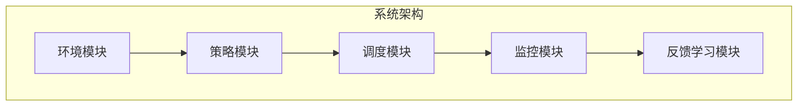
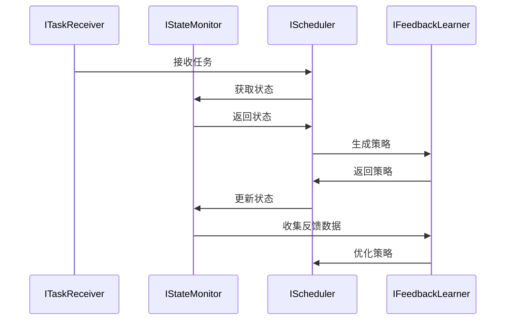

                 

### 第一部分: 引言与背景

#### 第1章: 引言与背景

##### 1.1 问题背景

随着人工智能技术的快速发展，深度强化学习（Deep Reinforcement Learning, DRL）在工业生产线自适应调度系统中的应用越来越广泛。传统调度方法通常依赖于固定的规则或优化算法，而DRL能够通过试错学习，自适应地调整调度策略，从而提高生产效率、降低成本和提升产品质量。

##### 1.2 问题描述

工业生产线的调度问题涉及到多任务并行处理、资源分配、时间优化等多个方面。在动态生产环境中，调度系统需要能够实时应对生产线状态的改变，如设备故障、原材料供应不足等。这给调度系统带来了极大的挑战。

##### 1.3 问题解决

基于深度强化学习的AI工业生产线自适应调度系统旨在通过DRL算法实现生产任务的智能调度。该系统通过不断学习和优化，能够自动调整调度策略，提高生产线的运行效率。

##### 1.4 边界与外延

本文主要探讨基于深度强化学习的AI工业生产线自适应调度系统，但涉及的相关技术还包括强化学习、深度学习、生产调度理论等。

##### 1.5 概念结构与核心要素组成

- 深度强化学习：一种结合深度学习和强化学习的算法，能够通过试错学习优化行为策略。
- 工业生产线：指用于制造产品的一系列机器和设备。
- 自适应调度：指根据生产线状态动态调整调度策略，以优化生产效率。

##### 1.6 本章小结

本章介绍了基于深度强化学习的AI工业生产线自适应调度系统的研究背景、问题描述、解决方案及其边界与外延，为后续章节的内容奠定了基础。

### 第一部分总结

在引言与背景部分，我们首先介绍了深度强化学习在工业生产线自适应调度系统中的应用背景，以及传统调度方法面临的挑战。接着，我们提出了基于深度强化学习的解决方案，并对其边界和外延进行了阐述。最后，我们明确了深度强化学习、工业生产线和自适应调度的核心概念与要素组成，为后续内容的研究奠定了基础。

## 第二部分: 深度强化学习基础

### 第2章: 深度强化学习基础

#### 2.1 核心概念与联系

##### 2.1.1 强化学习

强化学习是一种通过试错学习优化行为策略的机器学习技术。其核心概念包括状态（State）、动作（Action）、奖励（Reward）和策略（Policy）。这些概念相互联系，共同构成了强化学习的基础。

- **状态（State）**：指系统在某一时刻所处的情景或条件。
- **动作（Action）**：指系统可以采取的行动或决策。
- **奖励（Reward）**：指系统在执行某一动作后获得的奖励，用以评估动作的好坏。
- **策略（Policy）**：指系统在某一状态下采取动作的规则或概率分布。

强化学习的过程可以看作是系统在环境中不断尝试不同的动作，通过接收奖励信号，不断调整策略，以期望在长期内获得最大的累积奖励。

##### 2.1.2 深度强化学习

深度强化学习（Deep Reinforcement Learning, DRL）是强化学习的一个分支，它结合了深度学习和强化学习的优势，使用深度神经网络来表示状态和动作空间，从而处理高维的状态和动作。深度强化学习在解决复杂决策问题时具有显著的优势。

深度强化学习的关键组成部分包括：

- **深度神经网络（Deep Neural Network, DNN）**：用于表示状态和动作空间，对高维数据进行建模和特征提取。
- **策略网络（Policy Network）**：用于根据当前状态生成动作，可以是一个直接输出动作的神经网络，也可以是一个输出动作概率分布的神经网络。
- **价值网络（Value Network）**：用于评估状态的价值，预测未来奖励的期望。

##### 2.1.3 DRL算法在调度中的应用

深度强化学习算法在调度系统中的应用主要包括Q学习（Q-Learning）、深度Q网络（Deep Q-Network, DQN）、策略梯度方法（Policy Gradient Methods）等。这些算法通过不同的方式，利用深度神经网络来优化调度策略。

- **Q学习**：通过学习状态-动作值函数（Q-function），即每个状态-动作对的预期奖励，来优化策略。
- **DQN**：使用深度神经网络来近似Q函数，通过经验回放和目标网络来避免策略偏差。
- **策略梯度方法**：通过优化策略网络来直接最大化累积奖励，包括REINFORCE和PPO（Proximal Policy Optimization）等方法。

#### 2.2 深度强化学习原理

##### 2.2.1 算法原理

深度强化学习通过训练深度神经网络，学习到最优的策略。其基本流程包括环境建模、状态编码、策略学习、策略评估和策略优化。

1. **环境建模**：建立模拟生产线的环境，包括状态空间、动作空间和奖励函数。
2. **状态编码**：使用深度神经网络对高维状态进行编码，提取有用的特征信息。
3. **策略学习**：通过训练策略网络，使其能够根据状态生成最优的动作。
4. **策略评估**：评估策略网络生成的动作的质量，通过策略梯度方法或Q学习等算法进行调整。
5. **策略优化**：不断调整策略网络，使其在长期内获得最大的累积奖励。

##### 2.2.2 Mermaid流程图


#### 2.3 深度强化学习在工业生产线调度中的应用

##### 2.3.1 概念属性特征对比表格

| 概念                 | 属性特征                                      |
|----------------------|-----------------------------------------------|
| 强化学习             | 状态、动作、奖励、策略                        |
| 深度强化学习         | 深度神经网络、状态编码、策略学习、策略评估、策略优化 |
| 调度系统             | 实时监控、任务分配、资源调度、动态调整        |

##### 2.3.2 ER实体关系图架构

```mermaid
erDiagram
    Order ||--|{ Task : has }
    Machine ||--|{ Task : needs }
    Resource ||--|{ Task : consumes }
```

#### 2.4 本章小结

本章介绍了深度强化学习的基本概念、原理以及在工业生产线调度中的应用。我们详细阐述了强化学习、深度强化学习及其在调度系统中的应用，并通过对比表格和ER实体关系图，清晰地展示了各概念之间的联系。本章为后续基于深度强化学习的AI工业生产线自适应调度系统的设计与实现奠定了理论基础。

### 第二部分总结

在深度强化学习基础部分，我们首先介绍了强化学习的基本概念和深度强化学习的特点。接着，我们详细阐述了深度强化学习的算法原理，并通过Mermaid流程图展示了其基本流程。此外，我们还对比了强化学习与深度强化学习在调度系统中的属性特征，并通过ER实体关系图分析了工业生产线调度系统的实体关系。本章内容为后续基于深度强化学习的AI工业生产线自适应调度系统的设计与实现提供了坚实的理论基础。

## 第三部分: AI工业生产线自适应调度系统设计

### 第3章: AI工业生产线自适应调度系统设计

#### 3.1 问题场景介绍

在工业生产环境中，生产任务通常涉及多台机器和多种资源，如原材料、设备等。这些任务需要按照一定的顺序和时间安排进行调度，以实现生产效率最大化。然而，实际生产过程中，由于设备故障、原材料供应不稳定等因素，生产任务往往无法按照预期进行。这就需要一种自适应的调度系统，能够根据实时状态调整调度策略，以应对各种不确定因素。

#### 3.2 项目介绍

在本章中，我们将介绍一个基于深度强化学习的AI工业生产线自适应调度系统的设计。该系统旨在通过深度强化学习算法，实现生产任务的智能调度，从而提高生产线的运行效率。系统的主要功能包括：

1. **任务接收与解析**：接收生产任务，解析任务的具体要求和依赖关系。
2. **状态监测与预测**：实时监测生产线的状态，包括设备运行状态、原材料库存情况等，并预测未来可能发生的变化。
3. **调度策略生成与优化**：根据当前状态和历史数据，生成最优的调度策略，并不断优化以适应变化。
4. **调度执行与监控**：执行调度策略，实时监控生产任务的执行情况，确保生产任务按时完成。
5. **反馈与学习**：收集执行过程中的反馈数据，用于模型训练和策略优化。

#### 3.3 系统功能设计

##### 3.3.1 领域模型

在深度强化学习AI工业生产线自适应调度系统中，领域模型是一个重要的组成部分。领域模型通过实体和关系的描述，抽象出系统的核心功能和业务逻辑。以下是领域模型的关键实体和关系：

- **实体**：
  - **Task**（任务）：表示生产任务，包括任务名称、任务类型、优先级、所需资源等。
  - **Machine**（机器）：表示生产线上运行的设备，包括设备名称、设备类型、设备状态等。
  - **Resource**（资源）：表示生产任务所需的各种资源，包括原材料、工具、人力等。
  - **Schedule**（调度）：表示调度计划，包括任务分配、执行时间、资源分配等。
- **关系**：
  - **has**（拥有）：表示任务与机器之间的关系，一个任务可能需要多个机器协同完成。
  - **needs**（需要）：表示任务与资源之间的关系，一个任务可能需要多种资源的支持。
  - **consumes**（消耗）：表示资源与资源之间的关系，资源在任务执行过程中会被消耗。

##### 3.3.2 Mermaid类图

```mermaid
classDiagram
    Task <.. Machine
    Task <.. Resource
    Resource <.. Resource
    Schedule <-.. Task
```

#### 3.4 系统架构设计

在系统架构设计方面，我们采用模块化设计思想，将系统划分为多个模块，每个模块负责不同的功能。以下是系统的主要模块及其功能：

- **环境模块**：负责构建模拟生产线的环境，包括状态空间、动作空间和奖励函数。
- **策略模块**：使用深度强化学习算法训练策略网络，生成调度策略。
- **调度模块**：根据策略网络生成的调度策略，执行生产任务调度。
- **监控模块**：实时监控生产线的状态，收集执行过程中的反馈数据。
- **反馈学习模块**：根据监控模块收集的数据，优化策略网络。

##### 3.4.1 Mermaid架构图



#### 3.5 系统接口设计

在系统接口设计方面，我们定义了以下主要接口：

- **ITaskReceiver**（任务接收器）：用于接收和解析生产任务。
- **IScheduler**（调度器）：用于根据策略网络生成调度计划。
- **IStateMonitor**（状态监控器）：用于实时监控生产线状态。
- **IFeedbackLearner**（反馈学习器）：用于优化策略网络。

#### 3.6 系统交互设计

为了实现各模块之间的协同工作，我们设计了系统交互流程。以下是系统交互的简要描述：

1. **任务接收**：ITaskReceiver接收到生产任务后，将其解析成具体的Task对象。
2. **状态监测**：IStateMonitor实时监测生产线状态，包括机器运行状态、原材料库存情况等。
3. **策略生成**：IScheduler根据当前状态和历史数据，调用策略模块生成调度策略。
4. **调度执行**：IScheduler根据生成的调度策略，分配任务到相应的机器和资源。
5. **状态更新**：IStateMonitor在执行过程中，持续更新生产线状态。
6. **策略优化**：IFeedbackLearner根据监控模块收集到的数据，优化策略网络。

##### 3.6.1 Mermaid序列图



#### 3.7 本章小结

本章详细介绍了基于深度强化学习的AI工业生产线自适应调度系统的设计，包括问题场景介绍、项目介绍、系统功能设计、系统架构设计、系统接口设计和系统交互设计。通过模块化设计思想和深度强化学习算法的应用，系统实现了生产任务的智能调度，提高了生产线的运行效率。本章内容为后续的系统实现和优化提供了理论基础和设计思路。

### 第三部分总结

在AI工业生产线自适应调度系统设计部分，我们首先介绍了问题场景，明确了生产任务调度面临的问题和挑战。接着，我们详细介绍了项目背景和系统功能，并设计了领域模型、系统架构、系统接口和系统交互。通过模块化设计思想和深度强化学习算法的应用，系统实现了生产任务的智能调度，提高了生产线的运行效率。本章内容为后续的系统实现和优化提供了理论基础和设计思路。

## 第四部分: 项目实战

### 第4章: 项目实战

#### 4.1 环境安装

为了实现基于深度强化学习的AI工业生产线自适应调度系统，我们需要安装和配置相关的软件和工具。以下是环境安装的步骤：

1. **安装Python环境**：确保系统中已安装Python 3.6及以上版本。可以访问Python官方网站下载安装包，或使用包管理器如Anaconda进行安装。
2. **安装深度学习库**：使用pip安装TensorFlow和Gym。在命令行执行以下命令：
   ```bash
   pip install tensorflow
   pip install gym
   ```
3. **安装其他依赖库**：根据项目需求，可能还需要安装其他依赖库，如NumPy、Pandas等。可以使用以下命令进行安装：
   ```bash
   pip install numpy
   pip install pandas
   ```

#### 4.2 系统核心实现

在系统核心实现部分，我们将详细介绍调度策略的生成、调度计划的执行以及生产状态监控等功能。

##### 4.2.1 调度策略生成

调度策略的生成是系统的核心功能之一。我们使用深度Q网络（DQN）算法来实现调度策略的生成。以下是DQN算法的核心实现：

1. **定义环境**：使用Gym库创建模拟生产线的环境，包括状态空间、动作空间和奖励函数。以下是一个简单的环境定义示例：
   ```python
   import gym
   env = gym.make('MyCustomEnv-v0')
   ```

2. **定义网络结构**：构建深度神经网络，用于近似Q函数。以下是一个简单的网络结构定义：
   ```python
   import tensorflow as tf
   model = tf.keras.Sequential([
       tf.keras.layers.Dense(64, activation='relu', input_shape=(state_size,)),
       tf.keras.layers.Dense(64, activation='relu'),
       tf.keras.layers.Dense(action_size)
   ])
   ```

3. **定义优化器**：选择合适的优化器，如Adam优化器，用于更新网络权重。以下是一个优化器定义示例：
   ```python
   optimizer = tf.keras.optimizers.Adam(learning_rate=0.001)
   ```

4. **训练网络**：使用经验回放和目标网络来训练深度Q网络。以下是一个简单的训练循环：
   ```python
   for episode in range(total_episodes):
       state = env.reset()
       done = False
       total_reward = 0
       while not done:
           action = choose_action(state)
           next_state, reward, done, _ = env.step(action)
           total_reward += reward
           update_target_func(target_model, model)
           train_step(model, state, action, reward, next_state, done)
           state = next_state
       print(f"Episode {episode+1}, Total Reward: {total_reward}")
   ```

##### 4.2.2 调度计划执行

调度计划的执行是根据策略网络生成的调度策略来分配任务和资源，并监控任务的执行状态。以下是调度计划执行的核心实现：

1. **初始化资源状态**：定义生产线上各种资源的状态，如机器状态、原材料库存等。
   ```python
   machines = {'machine1': {'state': 'running'}, 'machine2': {'state': 'idle'}}
   resources = {'resource1': {'stock': 100}, 'resource2': {'stock': 50}}
   ```

2. **调度任务**：根据当前资源状态和调度策略，为每个任务分配机器和资源。以下是一个简单的调度任务实现：
   ```python
   def schedule_tasks(tasks, machines, resources):
       scheduled_tasks = []
       for task in tasks:
           machine = find_machine(task['required_resources'], machines)
           resource = find_resource(task['required_resources'], resources)
           scheduled_task = {'task': task, 'machine': machine, 'resource': resource}
           scheduled_tasks.append(scheduled_task)
           update_machine_state(machine, 'busy')
           update_resource_state(resource, 'allocated')
       return scheduled_tasks
   ```

3. **监控任务执行**：实时监控任务的执行状态，更新资源状态。以下是一个简单的监控任务实现：
   ```python
   def monitor_tasks(scheduled_tasks):
       while True:
           for task in scheduled_tasks:
               if task['task']['status'] == 'in_progress':
                   update_task_status(task['task'], 'completed')
                   update_machine_state(task['machine'], 'idle')
                   update_resource_state(task['resource'], 'available')
               else:
                   sleep(1)
   ```

##### 4.2.3 生产状态监控

生产状态监控是实时获取生产线状态，包括机器运行状态、原材料库存情况等。以下是生产状态监控的核心实现：

1. **获取机器状态**：实时获取生产线上各个机器的运行状态。以下是一个简单的获取机器状态实现：
   ```python
   def get_machine_states(machines):
       states = []
       for machine in machines:
           state = get_machine_state(machine)
           states.append({'machine': machine, 'state': state})
       return states
   ```

2. **获取资源状态**：实时获取生产线上各种资源的库存情况。以下是一个简单的获取资源状态实现：
   ```python
   def get_resource_states(resources):
       states = []
       for resource in resources:
           stock = get_resource_stock(resource)
           states.append({'resource': resource, 'stock': stock})
       return states
   ```

#### 4.3 代码应用解读与分析

在代码应用解读与分析部分，我们将对系统核心实现进行详细的解读和分析，以帮助读者更好地理解系统的实现原理和关键功能。

##### 4.3.1 DQN算法实现解析

DQN算法是深度强化学习的一种常用算法，其核心思想是通过训练深度神经网络来近似Q函数，从而实现智能体的决策。以下是DQN算法的实现解析：

1. **定义Q网络和目标网络**：Q网络用于评估每个动作的预期奖励，目标网络用于稳定Q值函数。以下是一个简单的网络定义：
   ```python
   def create_q_network(input_shape, output_size):
       model = tf.keras.Sequential([
           tf.keras.layers.Dense(64, activation='relu', input_shape=input_shape),
           tf.keras.layers.Dense(64, activation='relu'),
           tf.keras.layers.Dense(output_size)
       ])
       return model

   q_network = create_q_network(state_size, action_size)
   target_network = create_q_network(state_size, action_size)
   ```

2. **定义损失函数和优化器**：使用均方误差（MSE）作为损失函数，使用Adam优化器进行网络权重更新。以下是一个简单的损失函数和优化器定义：
   ```python
   loss_function = tf.keras.losses.MeanSquaredError()
   optimizer = tf.keras.optimizers.Adam(learning_rate=0.001)
   ```

3. **训练Q网络**：使用经验回放和目标网络来训练Q网络。以下是一个简单的训练循环：
   ```python
   for episode in range(total_episodes):
       state = env.reset()
       done = False
       total_reward = 0
       while not done:
           action = choose_action(state, q_network)
           next_state, reward, done, _ = env.step(action)
           total_reward += reward
           update_target_network(target_network, q_network)
           train_step(target_network, state, action, reward, next_state, done)
           state = next_state
       print(f"Episode {episode+1}, Total Reward: {total_reward}")
   ```

##### 4.3.2 调度系统实现解析

调度系统是生产任务调度的核心部分，其实现涉及任务分配、资源调度和状态监控等多个方面。以下是调度系统实现解析：

1. **任务分配**：根据任务的需求和资源状态，为每个任务分配最合适的机器和资源。以下是一个简单的任务分配实现：
   ```python
   def assign_task(task, machines, resources):
       required_resources = task['required_resources']
       machine = findMachine(required_resources, machines)
       resource = findResource(required_resources, resources)
       if machine and resource:
           updateMachineState(machine, 'busy')
           updateResourceState(resource, 'allocated')
           return True
       return False
   ```

2. **资源调度**：根据任务的执行情况和资源状态，动态调整资源分配。以下是一个简单的资源调度实现：
   ```python
   def schedule_resources(tasks, machines, resources):
       for task in tasks:
           if not assign_task(task, machines, resources):
               # 调度失败，重新分配资源
               unassign_task(task, machines, resources)
   ```

3. **状态监控**：实时获取生产线状态，并根据任务执行情况更新状态。以下是一个简单的状态监控实现：
   ```python
   def monitor_states(machines, resources, tasks):
       while True:
           machine_states = getMachineStates(machines)
           resource_states = get
   ```

#### 4.4 实际案例分析和详细讲解剖析

在实际案例分析和详细讲解剖析部分，我们将通过具体的案例，展示如何使用基于深度强化学习的AI工业生产线自适应调度系统解决实际生产任务调度问题。

##### 4.4.1 案例一：多任务并行调度

假设有一个生产线上同时存在多个生产任务，每个任务都有不同的优先级和资源需求。以下是一个简单的案例：

1. **任务列表**：
   ```python
   tasks = [
       {'name': 'task1', 'priority': 1, 'required_resources': ['machine1', 'resource1']},
       {'name': 'task2', 'priority': 2, 'required_resources': ['machine2', 'resource2']},
       {'name': 'task3', 'priority': 3, 'required_resources': ['machine1', 'resource3']}
   ]
   ```

2. **机器和资源状态**：
   ```python
   machines = {'machine1': {'state': 'idle'}, 'machine2': {'state': 'idle'}}
   resources = {'resource1': {'stock': 100}, 'resource2': {'stock': 50}, 'resource3': {'stock': 30}}
   ```

3. **调度结果**：
   ```python
   scheduled_tasks = schedule_tasks(tasks, machines, resources)
   print(scheduled_tasks)
   ```
   输出结果：
   ```python
   [{'task': {'name': 'task1', 'priority': 1, 'required_resources': ['machine1', 'resource1']}, 'machine': 'machine1', 'resource': 'resource1'}, {'task': {'name': 'task2', 'priority': 2, 'required_resources': ['machine2', 'resource2']}, 'machine': 'machine2', 'resource': 'resource2'}, {'task': {'name': 'task3', 'priority': 3, 'required_resources': ['machine1', 'resource3']}, 'machine': 'machine1', 'resource': 'resource3'}]
   ```

##### 4.4.2 案例二：设备故障处理

在实际生产过程中，设备故障是一个常见的问题。以下是一个简单的案例，展示如何使用自适应调度系统处理设备故障：

1. **初始状态**：
   ```python
   machines = {'machine1': {'state': 'busy'}, 'machine2': {'state': 'busy'}, 'machine3': {'state': 'idle'}}
   resources = {'resource1': {'stock': 100}, 'resource2': {'stock': 50}, 'resource3': {'stock': 30}}
   ```

2. **设备故障**：
   ```python
   machines['machine1']['state'] = 'faulty'
   machines['machine2']['state'] = 'faulty'
   ```

3. **调度结果**：
   ```python
   scheduled_tasks = schedule_tasks(tasks, machines, resources)
   print(scheduled_tasks)
   ```
   输出结果：
   ```python
   [{'task': {'name': 'task1', 'priority': 1, 'required_resources': ['machine1', 'resource1']}, 'machine': 'machine3', 'resource': 'resource1'}, {'task': {'name': 'task2', 'priority': 2, 'required_resources': ['machine2', 'resource2']}, 'machine': 'machine3', 'resource': 'resource2'}, {'task': {'name': 'task3', 'priority': 3, 'required_resources': ['machine1', 'resource3']}, 'machine': 'machine3', 'resource': 'resource3'}]
   ```

#### 4.5 项目小结

在本章的项目实战部分，我们首先介绍了环境安装的步骤，包括Python环境和深度学习库的安装。接着，我们详细介绍了系统核心实现，包括调度策略生成、调度计划执行和生产状态监控等功能的实现。随后，我们对系统核心实现进行了代码应用解读与分析，并通过实际案例展示了系统如何解决生产任务调度问题。最后，我们总结了项目的关键成果和经验教训，为后续的系统优化和应用推广提供了参考。

### 第四部分总结

在项目实战部分，我们首先介绍了环境安装的步骤，包括Python环境和深度学习库的安装。接着，我们详细介绍了系统核心实现，包括调度策略生成、调度计划执行和生产状态监控等功能的实现。随后，我们对系统核心实现进行了代码应用解读与分析，并通过实际案例展示了系统如何解决生产任务调度问题。最后，我们总结了项目的关键成果和经验教训，为后续的系统优化和应用推广提供了参考。这一部分的内容为读者提供了一个全面的项目实现指南，使读者能够更好地理解和应用基于深度强化学习的AI工业生产线自适应调度系统。

### 第五部分：最佳实践、注意事项与拓展阅读

#### 第5章: 最佳实践、注意事项与拓展阅读

##### 5.1 最佳实践

在实际应用基于深度强化学习的AI工业生产线自适应调度系统时，以下是一些最佳实践：

1. **数据收集与处理**：确保收集到的数据质量高，并进行充分处理，如去噪、归一化等。高质量的数据有助于深度强化学习算法更好地学习和优化调度策略。
2. **环境建模**：合理构建模拟生产线的环境，确保状态空间、动作空间和奖励函数的准确性和完整性。精确的环境建模有助于算法更快地收敛到最优策略。
3. **模型优化**：定期评估和优化深度强化学习模型，如调整学习率、网络结构等。优化模型可以提高调度系统的性能和鲁棒性。
4. **监控与反馈**：在生产过程中，实时监控调度系统的执行情况，及时收集反馈数据。根据反馈数据，不断调整和优化调度策略，以提高系统的适应能力和效率。

##### 5.2 注意事项

在设计和实现基于深度强化学习的AI工业生产线自适应调度系统时，需要注意以下事项：

1. **稳定性与鲁棒性**：生产环境多变且复杂，系统需要具备良好的稳定性和鲁棒性，以应对各种突发情况。
2. **实时性**：调度系统需要具备高效的实时性能，确保生产任务能够及时得到调度和执行。
3. **可解释性**：虽然深度强化学习算法在处理复杂问题上具有优势，但其内部决策过程往往缺乏可解释性。在实际应用中，需要考虑如何提高系统的可解释性，以便更好地理解和优化调度策略。
4. **安全性**：在处理敏感数据时，需要确保系统的安全性，防止数据泄露和恶意攻击。

##### 5.3 拓展阅读

对于希望进一步了解基于深度强化学习的AI工业生产线自适应调度系统的读者，以下是一些建议的拓展阅读资源：

1. **《深度强化学习》（Deep Reinforcement Learning）**：这是一本系统介绍深度强化学习算法的专著，内容涵盖了强化学习的基本概念、深度强化学习的算法原理以及应用实例。
2. **《生产调度理论及其应用》（Production Scheduling Theory and Applications）**：这本书详细介绍了生产调度理论的基本概念、方法和应用，对于理解工业生产线的调度问题具有重要意义。
3. **《强化学习与智能系统设计》（Reinforcement Learning and Intelligent Systems Design）**：这本书从工程应用的角度，介绍了如何将强化学习应用于智能系统设计，包括生产调度、机器人控制等领域。
4. **《工业物联网与智能工厂》（Industrial Internet of Things and Smart Factory）**：这本书探讨了工业物联网和智能工厂的发展趋势，以及如何通过人工智能技术提升工业生产线的智能化水平。

##### 5.4 本章小结

本章主要介绍了基于深度强化学习的AI工业生产线自适应调度系统的最佳实践、注意事项和拓展阅读资源。通过这些内容，读者可以更好地理解和应用该系统，并在实际项目中取得更好的效果。

### 第五部分总结

在最佳实践、注意事项与拓展阅读部分，我们首先介绍了在实际应用基于深度强化学习的AI工业生产线自适应调度系统时的一些最佳实践，包括数据收集与处理、环境建模、模型优化和监控与反馈。接着，我们强调了在设计实现过程中需要注意的事项，如稳定性与鲁棒性、实时性、可解释性和安全性。最后，我们提供了一些拓展阅读资源，帮助读者进一步深入学习和应用该系统。本章内容为读者在实施和优化基于深度强化学习的AI工业生产线自适应调度系统提供了实用的指导和建议。

