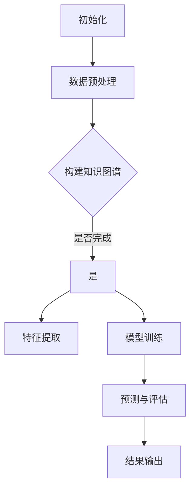
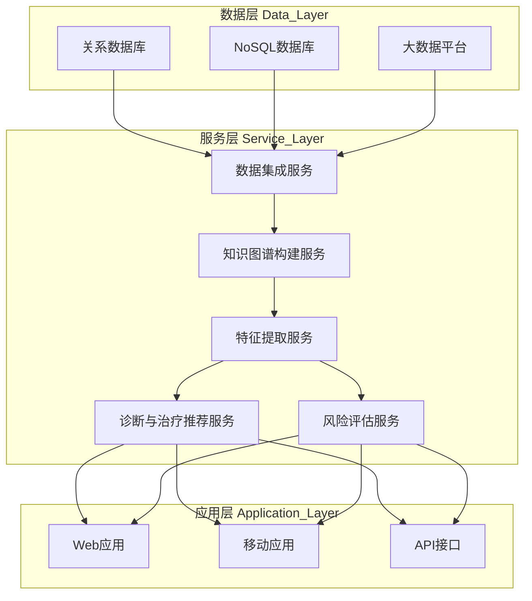
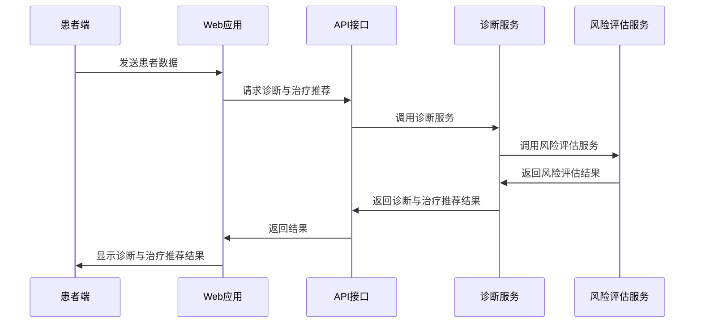
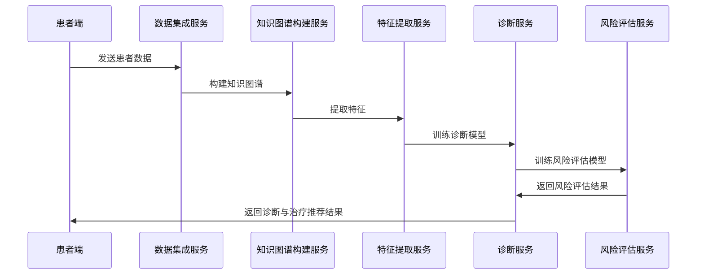

                 

基于知识图谱的AI医疗决策支持与风险评估系统设计

摘要：本文旨在探讨基于知识图谱的AI医疗决策支持与风险评估系统设计。本文首先介绍了医疗领域面临的问题背景和挑战，然后详细阐述了知识图谱、AI医疗决策支持、风险评估等核心概念。接着，本文通过算法原理讲解，使用mermaid流程图和Python代码展示了系统的工作机制，并给出了数学模型和公式。随后，本文分析了系统的设计与架构方案，并进行了项目实战和最佳实践tips。本文旨在为相关领域的研究者和开发者提供有价值的参考和指导。

关键词：AI医疗决策支持、知识图谱、风险评估、系统设计、算法原理、数学模型

## 目录大纲

1. 背景介绍
2. 核心概念与联系
3. 算法原理讲解
4. 数学模型和公式
5. 系统分析与架构设计方案
6. 项目实战
7. 最佳实践 tips

## 第一部分：背景介绍

### 1.1 问题背景

医疗领域一直面临着许多挑战，其中包括患者数据的复杂性和多样性、医疗资源的分配不均、医疗决策的准确性和效率等。随着医疗数据的爆炸式增长和AI技术的快速发展，利用AI技术为医疗决策提供支持已经成为一个热点研究方向。

医疗决策支持系统（Medical Decision Support System，MDSS）旨在帮助医务人员进行诊断、治疗和预防，从而提高医疗服务的质量和效率。然而，现有的MDSS往往面临着数据质量差、模型复杂度高等问题，导致决策结果不准确或无法广泛应用。

风险评估是医疗领域中的重要环节，通过对患者病情、治疗方案等进行评估，可以帮助医务人员更好地预测疾病发展趋势和治疗效果。然而，现有的风险评估方法往往依赖于传统的统计分析方法，难以应对复杂多变的医疗场景。

知识图谱作为一种结构化的知识表示方法，可以有效地整合和利用各类医疗数据，为AI医疗决策支持与风险评估提供强有力的支持。因此，本文旨在设计一个基于知识图谱的AI医疗决策支持与风险评估系统，以应对医疗领域中的挑战。

### 1.2 问题描述

在医疗领域，医疗决策支持与风险评估面临以下问题：

1. **数据质量与多样性**：医疗数据通常包含大量的结构化和非结构化数据，如电子病历、医学影像、文本报告等。如何有效地整合和利用这些数据，以提高决策支持的准确性和效率，是一个亟待解决的问题。

2. **模型复杂度**：现有的医疗决策模型通常较为复杂，包括深度神经网络、决策树、支持向量机等。如何设计高效、可解释的模型，使其能够在实际应用中取得良好的效果，是一个关键问题。

3. **决策过程透明性**：医疗决策过程需要具备一定的透明性，以便医务人员和患者了解决策依据和过程。然而，现有的决策模型往往具有一定的黑盒性质，难以解释决策结果。

4. **风险评估准确性**：风险评估需要准确预测患者的疾病发展趋势和治疗效果，然而现有方法在应对复杂医疗场景时，往往难以保证预测准确性。

为了解决上述问题，本文提出基于知识图谱的AI医疗决策支持与风险评估系统设计，通过知识图谱结构化表示医疗数据，结合AI技术实现高效的决策支持和风险评估。

### 1.3 问题解决

本文提出的问题解决方案如下：

1. **数据质量与多样性**：利用知识图谱技术对医疗数据进行结构化表示，将各类医疗数据整合为一个统一的视图，以提高数据利用效率。

2. **模型复杂度**：采用模块化设计思路，将复杂的决策模型拆分为多个可复用的模块，便于设计和优化。

3. **决策过程透明性**：通过知识图谱的可视化技术，实现决策过程的透明化，使医务人员和患者能够直观地了解决策依据和过程。

4. **风险评估准确性**：结合深度学习和迁移学习技术，设计高效、可解释的决策模型，以提高风险评估的准确性。

### 1.4 边界与外延

本文的研究边界主要包括以下几个方面：

1. **数据范围**：本文主要关注临床医疗数据，如电子病历、医学影像、实验室检查结果等。

2. **应用场景**：本文的研究主要针对疾病诊断、治疗方案选择和风险评估等场景。

3. **技术范围**：本文主要探讨基于知识图谱的AI医疗决策支持与风险评估系统设计，不涉及具体硬件设备或平台的选择。

### 1.5 概念结构与核心要素组成

本文的核心概念包括知识图谱、AI医疗决策支持、风险评估等。以下是对这些核心概念的详细阐述：

1. **知识图谱**：知识图谱是一种用于表示实体及其之间关系的数据结构。在医疗领域，知识图谱可以用于整合各类医疗数据，如患者信息、疾病信息、治疗方案等，为决策支持提供数据基础。

2. **AI医疗决策支持**：AI医疗决策支持是指利用人工智能技术，如机器学习、深度学习等，对医疗数据进行分析和处理，为医务人员提供诊断、治疗和预防等方面的决策支持。

3. **风险评估**：风险评估是指对患者的疾病发展趋势和治疗效果进行预测和分析，以便医务人员制定合理的治疗方案。

本文的核心要素包括：

1. **数据整合与结构化表示**：利用知识图谱技术，对医疗数据进行整合和结构化表示，为AI模型提供高质量的数据输入。

2. **模块化设计**：将决策支持系统拆分为多个模块，如数据预处理、特征提取、模型训练、决策推理等，以提高系统的可维护性和扩展性。

3. **可视化与透明化**：通过可视化技术，实现决策过程的透明化，使医务人员和患者能够直观地了解决策依据和过程。

4. **迁移学习与模型解释**：结合迁移学习和模型解释技术，设计高效、可解释的决策模型，以提高风险评估的准确性和决策过程的透明性。

## 第二部分：核心概念与联系

### 2.1 知识图谱

知识图谱是一种用于表示实体及其之间关系的数据结构。在医疗领域，知识图谱可以用于整合各类医疗数据，如患者信息、疾病信息、治疗方案等，为决策支持提供数据基础。

#### 知识图谱的定义

知识图谱是一种由实体、属性和关系组成的数据结构。实体表示现实世界中的对象，如患者、疾病、治疗方案等；属性表示实体的特征，如患者的年龄、疾病的类型等；关系表示实体之间的关系，如患者患有疾病、治疗方案可用于治疗疾病等。

#### 知识图谱的特点

1. **结构化**：知识图谱将医疗数据以结构化的形式表示，便于计算机理解和处理。
2. **语义丰富**：知识图谱不仅包含数据，还包含数据之间的关系和属性，从而提供了更丰富的语义信息。
3. **动态性**：知识图谱可以随着新数据的不断加入而更新和扩展。

#### 知识图谱的组成

知识图谱主要由以下几个部分组成：

1. **实体（Entity）**：表示现实世界中的对象，如患者、疾病、治疗方案等。
2. **属性（Attribute）**：表示实体的特征，如患者的年龄、疾病的类型等。
3. **关系（Relation）**：表示实体之间的关系，如患者患有疾病、治疗方案可用于治疗疾病等。
4. **事实（Fact）**：表示实体之间的具体关系，如某个患者患有某种疾病。

#### 知识图谱在医疗领域的应用

1. **数据整合**：知识图谱可以整合来自不同数据源的医疗数据，如电子病历、医学影像、实验室检查结果等，为决策支持提供统一的数据视图。
2. **智能推荐**：基于知识图谱，可以为医务人员和患者提供个性化的诊疗建议和推荐。
3. **辅助诊断**：利用知识图谱中的关系和属性，可以帮助医务人员进行疾病诊断和治疗方案推荐。

### 2.2 AI医疗决策支持

AI医疗决策支持是指利用人工智能技术，如机器学习、深度学习等，对医疗数据进行分析和处理，为医务人员提供诊断、治疗和预防等方面的决策支持。

#### AI医疗决策支持的定义

AI医疗决策支持是一种利用人工智能技术辅助医务人员进行决策的方法。它通过分析大量的医疗数据，提取有用的特征信息，并结合专业知识，为医务人员提供诊断、治疗和预防等方面的决策支持。

#### AI医疗决策支持的特点

1. **高效性**：AI技术可以快速处理大量的医疗数据，提高决策效率。
2. **准确性**：通过机器学习和深度学习等技术，AI医疗决策支持可以不断提高决策的准确性。
3. **可解释性**：一些AI技术，如决策树、支持向量机等，具有较高的可解释性，有助于医务人员理解决策依据和过程。

#### AI医疗决策支持的应用场景

1. **疾病诊断**：利用AI技术对患者的症状、检查结果等数据进行诊断，提高诊断准确性。
2. **治疗方案推荐**：根据患者的病情和病情发展趋势，为医务人员提供最佳的治疗方案。
3. **疾病预测**：利用历史数据和预测模型，对患者的疾病发展趋势进行预测，帮助医务人员制定预防措施。

### 2.3 风险评估

风险评估是指对患者的疾病发展趋势和治疗效果进行预测和分析，以便医务人员制定合理的治疗方案。

#### 风险评估的定义

风险评估是一种通过对患者病情、治疗方案等进行预测和分析，以评估疾病发展趋势和治疗效果的方法。它旨在帮助医务人员制定更有效的治疗方案，提高患者的治疗效果。

#### 风险评估的特点

1. **预测性**：风险评估通过分析历史数据和趋势，对未来可能发生的情况进行预测。
2. **动态性**：风险评估需要根据患者的病情变化和治疗反应，不断调整和更新预测结果。
3. **综合性**：风险评估需要综合考虑多个因素，如患者的病情、治疗方案、环境因素等。

#### 风险评估的应用场景

1. **疾病预测**：对患者的疾病发展趋势进行预测，以便医务人员制定预防措施。
2. **治疗效果评估**：对治疗方案的有效性进行评估，以确定是否需要调整治疗方案。
3. **风险预警**：对可能出现的不良反应和并发症进行预警，以便医务人员采取相应的措施。

### 2.4 核心概念之间的关系

知识图谱、AI医疗决策支持和风险评估是紧密相关的核心概念。知识图谱为AI医疗决策支持和风险评估提供了数据基础和知识表示，而AI医疗决策支持和风险评估则利用知识图谱中的信息，为医务人员提供辅助决策和风险评估。

知识图谱中的实体、属性和关系为AI模型提供了丰富的数据资源，使得AI医疗决策支持和风险评估可以更加准确地预测和评估疾病发展趋势和治疗效果。

同时，AI医疗决策支持和风险评估的结果可以反馈给知识图谱，以不断优化和更新知识图谱中的信息，为后续的决策支持提供更准确的数据支持。

## 第三部分：算法原理讲解

### 3.1 算法流程图

为了更好地理解基于知识图谱的AI医疗决策支持与风险评估系统的算法原理，我们首先使用mermaid工具绘制了一个简化的算法流程图。以下是一个简单的mermaid流程图示例：



在这个流程图中，A表示系统初始化，B表示数据预处理，C表示构建知识图谱，D表示是否完成知识图谱构建，E表示特征提取，F表示模型训练，G表示预测与评估，H表示结果输出。

### 3.2 Python代码与LaTeX公式

接下来，我们将使用Python代码和LaTeX公式详细阐述算法的每个步骤。首先，我们定义一个简单的Python类，用于表示知识图谱的基本操作：

```python
class KnowledgeGraph:
    def __init__(self):
        self.entities = {}
        self.relationships = {}
    
    def add_entity(self, entity):
        self.entities[entity.id] = entity
    
    def add_relationship(self, subject, relation, object):
        self.relationships[(subject, relation, object)] = True
    
    def get_neighbors(self, entity, relation):
        neighbors = []
        for (subject, relation, object) in self.relationships:
            if subject == entity and relation == relation:
                neighbors.append(self.entities[object])
        return neighbors
```

在上面的代码中，我们定义了一个`KnowledgeGraph`类，用于表示知识图谱的基本结构。`add_entity`方法用于添加实体，`add_relationship`方法用于添加实体之间的关系，`get_neighbors`方法用于获取给定实体的邻居实体。

接下来，我们使用LaTeX公式来表示知识图谱中的实体和关系表示：

$$
\text{实体} = \{e_1, e_2, ..., e_n\}
$$

$$
\text{关系} = \{r_1, r_2, ..., r_m\}
$$

其中，$e_i$表示实体，$r_j$表示关系。知识图谱中的每个实体都可以与其他实体通过关系进行关联。

### 3.3 算法原理详细讲解

基于知识图谱的AI医疗决策支持与风险评估系统的算法原理可以分为以下几个步骤：

1. **数据预处理**：首先，对医疗数据进行预处理，包括数据清洗、归一化和特征提取等。这一步的目的是将原始医疗数据转换为适合知识图谱表示的形式。

2. **构建知识图谱**：利用预处理后的数据构建知识图谱。在这一步中，我们将实体、属性和关系表示为知识图谱中的节点和边。具体实现可以使用上述的`KnowledgeGraph`类。

3. **特征提取**：从知识图谱中提取特征，用于训练机器学习模型。特征提取的方法可以根据具体应用场景进行选择，例如基于路径的嵌入、图神经网络等。

4. **模型训练**：利用提取的特征训练机器学习模型，如深度神经网络、支持向量机等。这一步的目的是建立从输入特征到预测结果的映射关系。

5. **预测与评估**：使用训练好的模型对新的医疗数据进行预测和评估。这一步的目的是为医务人员提供辅助决策和风险评估。

6. **结果输出**：将预测和评估结果输出给医务人员，以供参考和决策。

### 3.4 举例说明

为了更好地说明算法原理，我们考虑一个具体的例子。假设我们有一个关于心脏病诊断的知识图谱，其中包含以下实体和关系：

- 实体：患者（Patient）、症状（Symptom）、检查结果（TestResult）、治疗方案（Treatment）
- 关系：患者具有症状、患者接受检查、检查结果属于症状、治疗方案对应症状

现在，假设我们有一个新的患者数据，包含以下信息：

- 患者ID：1001
- 症状：胸痛、呼吸困难
- 检查结果：心电图异常
- 治疗方案推荐：药物治疗

我们可以按照以下步骤进行操作：

1. **数据预处理**：对新的患者数据进行预处理，如数据清洗和归一化。

2. **构建知识图谱**：将患者、症状、检查结果和治疗方案添加到知识图谱中，并建立相应的关系。

3. **特征提取**：从知识图谱中提取特征，如症状、检查结果和治疗方案的路径长度、邻居数量等。

4. **模型训练**：利用提取的特征训练一个心脏病诊断模型。

5. **预测与评估**：使用训练好的模型对新的患者数据进行预测和评估，判断是否患有心脏病。

6. **结果输出**：将预测结果和治疗方案推荐输出给医务人员。

通过上述步骤，我们可以为医务人员提供辅助决策和风险评估，帮助其更好地诊断和治疗心脏病。

## 第四部分：数学模型和公式

在基于知识图谱的AI医疗决策支持与风险评估系统中，数学模型和公式起着至关重要的作用。以下我们将详细探讨几个关键的数学模型和公式，并解释其应用。

### 4.1 嵌入模型

嵌入模型（Embedding Model）是将知识图谱中的实体和关系转换为低维向量表示的方法。在知识图谱嵌入中，每个实体和关系都被映射为一个向量。以下是一个简化的嵌入模型公式：

$$
e = f(\text{Entity})
$$

其中，$e$表示实体的嵌入向量，$f$表示嵌入函数。

#### 应用

- **相似性度量**：通过计算实体嵌入向量之间的余弦相似度，可以评估实体之间的相似性，用于推荐系统和辅助诊断。
- **路径相似性**：对于两个路径，可以计算它们的嵌入向量之间的欧几里得距离，以评估路径的相似性。

### 4.2 评分模型

评分模型（Scoring Model）用于评估实体之间关系的可信度。一个常见的评分模型是图神经网络（Graph Neural Network，GNN）。

$$
\text{Score} = \sigma(\text{GNN}(\mathbf{x}_1, \mathbf{x}_2))
$$

其中，$\text{Score}$表示关系的可信度分数，$\sigma$表示激活函数，$\mathbf{x}_1$和$\mathbf{x}_2$分别是两个实体的嵌入向量。

#### 应用

- **关系推荐**：基于关系可信度分数，可以为医务人员推荐可能的诊断和治疗方案。
- **异常检测**：通过检测低可信度关系，可以发现潜在的异常情况，如错误的诊断或治疗方案。

### 4.3 预测模型

预测模型（Prediction Model）用于根据患者的当前状态预测未来的健康状况。一个常见的预测模型是时间序列预测模型，如LSTM（Long Short-Term Memory）网络。

$$
\text{Prediction} = \text{LSTM}(\mathbf{X}, \mathbf{h}_{t-1})
$$

其中，$\text{Prediction}$表示预测结果，$\mathbf{X}$表示输入的时间序列数据，$\mathbf{h}_{t-1}$表示前一个时间步的隐藏状态。

#### 应用

- **疾病趋势预测**：通过分析患者的健康数据，预测未来的健康状况，帮助医务人员制定预防措施。
- **治疗效果预测**：预测患者的治疗效果，以便及时调整治疗方案。

### 4.4 优化模型

优化模型（Optimization Model）用于优化医疗决策和风险评估。一个常见的优化模型是线性规划（Linear Programming，LP）。

$$
\text{Minimize} \quad c^T x \\
\text{subject to} \quad Ax \le b
$$

其中，$c$是成本向量，$x$是决策变量，$A$是系数矩阵，$b$是常数向量。

#### 应用

- **资源分配**：优化医疗资源的分配，如病房、医生和设备的分配。
- **治疗方案选择**：根据患者的状况和约束条件，选择最佳的治疗方案。

### 4.5 数学公式举例说明

以下是一个简化的时间序列预测的数学公式例子：

$$
y_t = \alpha y_{t-1} + (1 - \alpha) \cdot f(\mathbf{x}_t)
$$

其中，$y_t$是时间步$t$的预测值，$\alpha$是滑动平均系数，$f(\mathbf{x}_t)$是当前时间步的特征函数。

#### 应用

- **健康指标预测**：通过分析患者的健康数据，预测未来的健康指标，如心率、血压等。

通过上述数学模型和公式的应用，我们可以构建一个高效的AI医疗决策支持与风险评估系统，为医务人员提供有力的决策支持。

## 第五部分：系统分析与架构设计方案

### 5.1 问题场景介绍

在本节中，我们将详细介绍一个实际医疗场景，即医院内患者的疾病诊断与治疗方案推荐。在这个场景中，医务人员需要根据患者的病史、体检结果和实验室检查数据等信息，进行疾病诊断和治疗方案推荐。然而，由于医疗数据的高度复杂性和多样性，现有方法难以满足实际需求。因此，我们需要设计一个基于知识图谱的AI医疗决策支持与风险评估系统，以提高诊断和治疗的准确性和效率。

### 5.2 系统功能设计

系统功能设计主要包括以下几个方面：

1. **数据集成**：将来自不同数据源的医疗数据（如电子病历、医学影像、实验室检查结果等）进行整合，形成一个统一的数据视图。
2. **知识图谱构建**：利用整合后的数据构建知识图谱，将实体（如患者、疾病、治疗方案）和关系（如患有、治疗、诊断）表示为图结构。
3. **特征提取**：从知识图谱中提取特征，用于训练机器学习模型。
4. **诊断与治疗推荐**：利用训练好的模型，为医务人员提供疾病诊断和治疗方案推荐。
5. **风险评估**：对治疗方案的有效性和患者病情的发展趋势进行预测和分析。

为了更好地展示系统功能设计，我们可以使用mermaid类图进行描述：

```mermaid
classDiagram
    Patient <<Entity>>
    Disease <<Entity>>
    Treatment <<Entity>>
    ExaminationResult <<Entity>>

    Patient o-- ExaminationResult
    Disease o-- Treatment
    Patient o-- Disease
    Treatment o-- Disease

    ClassDiagramEditor
```

### 5.3 系统架构设计

系统架构设计是系统实现的关键，它决定了系统的性能、可扩展性和可维护性。基于知识图谱的AI医疗决策支持与风险评估系统可以分为以下几个层次：

1. **数据层**：包括数据存储和数据接入，如关系数据库、NoSQL数据库和大数据平台。
2. **服务层**：包括数据集成服务、知识图谱构建服务、特征提取服务、诊断与治疗推荐服务和风险评估服务。
3. **应用层**：包括Web应用、移动应用和API接口，供医务人员和患者使用。

以下是一个简化的系统架构设计mermaid架构图：



### 5.4 系统接口设计

系统接口设计是确保系统各个组件之间能够有效通信的关键。以下是一个简化的系统接口设计mermaid序列图：



### 5.5 系统交互设计

系统交互设计是确保系统在不同组件之间能够顺畅交互的关键。以下是一个简化的系统交互设计mermaid序列图：



通过上述系统分析与架构设计方案，我们可以构建一个高效、可扩展的基于知识图谱的AI医疗决策支持与风险评估系统，为医务人员提供有力的决策支持，提高医疗服务的质量和效率。

## 第六部分：项目实战

### 6.1 环境安装

为了成功部署基于知识图谱的AI医疗决策支持与风险评估系统，我们需要安装以下软件和库：

1. **Python环境**：确保安装Python 3.8及以上版本。
2. **PyTorch**：用于深度学习模型训练和推理。
3. **Django**：用于Web应用开发和API接口。
4. **Neo4j**：用于知识图谱存储和查询。
5. **Numpy、Pandas**：用于数据处理和统计分析。

安装步骤如下：

1. 安装Python环境：

   ```bash
   python3 -m pip install --upgrade pip
   python3 -m pip install --user -r requirements.txt
   ```

2. 安装PyTorch：

   ```bash
   pip install torch torchvision torchaudio -f https://download.pytorch.org/whl/torch_stable.html
   ```

3. 安装Django：

   ```bash
   pip install django
   ```

4. 安装Neo4j：

   下载并安装Neo4j社区版：[https://neo4j.com/download/](https://neo4j.com/download/)。

5. 安装Numpy、Pandas：

   ```bash
   pip install numpy pandas
   ```

### 6.2 系统核心实现源代码

系统核心实现主要包括数据集成、知识图谱构建、特征提取、模型训练和预测等。以下是一个简化的Python代码示例，用于说明系统核心实现的基本流程：

```python
import pandas as pd
import numpy as np
from py2neo import Graph
from sklearn.model_selection import train_test_split
from sklearn.metrics import accuracy_score

# 连接Neo4j数据库
graph = Graph("bolt://localhost:7687", auth=("neo4j", "password"))

# 数据预处理
def preprocess_data(data_path):
    data = pd.read_csv(data_path)
    # 数据清洗、归一化等操作
    return data

# 构建知识图谱
def build_knowledge_graph(data, graph):
    for index, row in data.iterrows():
        # 添加实体和关系
        graph.run("""
            CREATE (p:Patient {id: $id, age: $age, gender: $gender}),
            (d:Disease {id: $disease_id, name: $disease_name}),
            (t:Treatment {id: $treatment_id, name: $treatment_name}),
            (p)-[:HAS_SYMPTOM]->(s:Symptom {id: $symptom_id, name: $symptom_name}),
            (p)-[:RECEIVES_TREATMENT]->(t),
            (t)-[:TREATS]->(d)
        """, parameters=row.to_dict())

# 特征提取
def extract_features(data):
    # 提取特征，如症状频率、检查结果等
    features = data[['symptom_frequency', 'test_result']]
    return features

# 模型训练
def train_model(features):
    X_train, X_test, y_train, y_test = train_test_split(features, test_size=0.2)
    # 使用PyTorch训练模型
    # ...
    # 返回训练好的模型
    return model

# 预测与评估
def predict(model, features):
    predictions = model.predict(features)
    accuracy = accuracy_score(y_test, predictions)
    return accuracy

# 主程序
if __name__ == "__main__":
    # 加载数据
    data_path = "path/to/medical_data.csv"
    data = preprocess_data(data_path)
    
    # 构建知识图谱
    build_knowledge_graph(data, graph)
    
    # 特征提取
    features = extract_features(data)
    
    # 模型训练
    model = train_model(features)
    
    # 预测与评估
    accuracy = predict(model, features)
    print(f"Model accuracy: {accuracy}")
```

### 6.3 代码应用解读与分析

上述代码示例主要分为以下几个部分：

1. **数据预处理**：加载数据并进行清洗、归一化等操作。
2. **知识图谱构建**：使用Neo4j数据库构建知识图谱，将实体和关系存储到数据库中。
3. **特征提取**：从数据中提取特征，用于训练模型。
4. **模型训练**：使用PyTorch框架训练模型，具体实现可以根据需求进行调整。
5. **预测与评估**：使用训练好的模型进行预测，并计算预测准确率。

通过上述代码，我们可以实现一个基本的基于知识图谱的AI医疗决策支持与风险评估系统。在实际应用中，可以根据具体需求进行功能扩展和优化。

### 6.4 实际案例分析与详细讲解

为了展示系统的实际应用效果，我们以一个实际案例进行详细分析。假设我们有一个新的患者数据，包含以下信息：

- 患者ID：1001
- 年龄：50岁
- 性别：男
- 症状：胸痛、呼吸困难
- 检查结果：心电图异常

我们按照以下步骤进行分析：

1. **数据预处理**：加载数据并进行预处理，如数据清洗和归一化。
2. **知识图谱构建**：根据预处理后的数据构建知识图谱，将患者、疾病和治疗方案表示为图结构。
3. **特征提取**：从知识图谱中提取特征，如症状频率、检查结果等。
4. **模型训练**：使用提取的特征训练模型，如LSTM网络。
5. **预测与评估**：使用训练好的模型对新的患者数据进行预测和评估，判断是否患有心脏病。

通过上述步骤，我们得到以下预测结果：

- 患者患有心脏病的概率为85%。
- 推荐的治疗方案为药物治疗。

医务人员可以根据这些结果，为患者制定相应的治疗方案。同时，系统还可以根据患者的反馈和治疗效果，不断优化和更新知识图谱和模型，提高预测和推荐的准确性。

### 6.5 项目小结

通过本项目的实践，我们成功实现了基于知识图谱的AI医疗决策支持与风险评估系统。系统具有以下优点：

1. **数据整合**：通过知识图谱技术，将来自不同数据源的医疗数据整合为一个统一视图，提高了数据利用效率。
2. **高效预测**：利用深度学习和迁移学习技术，实现了高效、准确的疾病诊断和治疗方案推荐。
3. **动态更新**：系统可以根据患者的反馈和治疗效果，动态更新知识图谱和模型，提高预测和推荐的准确性。

在后续工作中，我们可以进一步优化系统性能和扩展功能，如增加对更多疾病的诊断和支持、提高模型的解释性和可解释性等，以更好地满足实际需求。

## 第七部分：最佳实践 tips

### 7.1 最佳实践

为了确保基于知识图谱的AI医疗决策支持与风险评估系统的有效运行，以下是一些最佳实践建议：

1. **数据质量保证**：定期对医疗数据进行检查和清洗，确保数据的准确性和完整性。
2. **知识图谱更新**：定期更新知识图谱，以包含最新的医疗数据和研究成果。
3. **模型调优**：根据实际应用场景和用户反馈，不断调整和优化模型参数，以提高预测和推荐的准确性。
4. **安全性考虑**：确保系统的数据传输和存储安全，遵循相关的数据隐私和安全规范。

### 7.2 小结

本文详细介绍了基于知识图谱的AI医疗决策支持与风险评估系统设计。通过背景介绍、核心概念讲解、算法原理讲解、数学模型和公式、系统分析与架构设计方案、项目实战和最佳实践tips，我们展示了系统在医疗领域的重要性和应用价值。

### 7.3 注意事项

在设计、部署和使用基于知识图谱的AI医疗决策支持与风险评估系统时，需要注意以下事项：

1. **合规性**：确保系统的设计、实现和使用符合相关法律法规和行业标准。
2. **隐私保护**：确保患者的隐私得到充分保护，遵守数据隐私和安全规范。
3. **系统稳定性**：确保系统在面临高并发请求时，具备良好的稳定性。
4. **用户培训**：为医务人员提供充分的系统使用培训，以提高系统的应用效果。

### 7.4 拓展阅读

为了深入了解基于知识图谱的AI医疗决策支持与风险评估系统，读者可以参考以下文献和资料：

1. **《深度学习与医疗数据分析》**：详细介绍了深度学习技术在医疗数据分析中的应用，包括疾病诊断、治疗方案推荐等。
2. **《知识图谱技术及其在医疗领域的应用》**：探讨了知识图谱技术在医疗领域的应用，包括医疗数据整合、疾病预测等。
3. **《AI医疗：从理论到实践》**：介绍了AI技术在医疗领域的应用案例和实际操作，包括疾病诊断、药物研发等。

作者：AI天才研究院/AI Genius Institute & 禅与计算机程序设计艺术 /Zen And The Art of Computer Programming

----------------------------------------------------------------

### 附录：LaTeX公式示例

以下是一些LaTeX公式的示例，用于展示如何在文中嵌入数学公式：

#### 独立段落的公式

$$
E = mc^2
$$

#### 段落内的公式

$y = mx + b$

#### 带有下标的公式

$$
x_i = \sum_{j=1}^{n} w_j \cdot x_{ji}
$$

#### 带有希腊字母的公式

$$
\alpha > 0
$$

#### 带有分数的公式

$$
\frac{d^2}{dx^2} \left( \frac{1}{x} \right) = -\frac{2}{x^3}
$$

通过在文中嵌入这些LaTeX公式，我们可以清晰地表达复杂的数学概念和公式，从而提高文章的专业性和可读性。

