                 

## 基于知识图谱的大规模推理系统优化技术

### 关键词：知识图谱、大规模推理、优化技术、性能提升、系统设计

> 摘要：本文将深入探讨基于知识图谱的大规模推理系统优化技术。首先，我们将介绍知识图谱技术在人工智能领域的背景和重要性，并明确大规模推理系统在数据处理和性能优化方面面临的挑战。接着，我们将详细解释基于知识图谱的推理系统的优势，并探讨优化技术的核心概念与目标。文章还将涵盖知识图谱的组成与特性，大规模推理算法原理，以及系统的设计与实现要点。通过实例分析和最佳实践，本文旨在为读者提供全面的技术指导和深刻的思考。

----------------------------------------------------------------

# 基于知识图谱的大规模推理系统优化技术

## 第一部分：背景介绍

### 1.1 问题背景

在当今的数字化时代，数据已经成为企业和社会的核心资产。随着大数据技术的不断发展，如何有效地处理和分析海量数据成为了研究和应用的热点。知识图谱（Knowledge Graph）作为一种新兴的数据表示和存储技术，因其强大的表征能力和语义理解能力，在人工智能领域得到了广泛的应用。

知识图谱是一种语义网络，它将现实世界中的实体及其关系以图形的方式表示出来。这种图形结构不仅能够直观地展示实体之间的关系，还使得机器能够通过推理算法从图中提取新的知识。在大规模数据处理的背景下，知识图谱的应用场景日益广泛，如搜索引擎、智能问答、推荐系统、社交网络分析等。

大规模推理系统（Large-scale Reasoning System）是知识图谱应用的核心，它负责从知识图谱中提取逻辑关系，并生成新的知识。然而，随着知识图谱规模的不断扩大，推理系统的数据处理和性能优化面临着巨大的挑战。传统的推理系统往往在处理大规模数据时表现不佳，难以满足实时性和高效性的要求。

### 1.2 问题描述

传统的推理系统在处理大规模数据时，往往面临着以下几方面的挑战：

1. **计算性能瓶颈**：随着数据规模的增加，传统的推理算法在计算复杂度上呈现指数级增长，导致系统响应时间过长。
2. **内存占用问题**：大规模数据集的存储和加载需要大量的内存资源，传统的系统往往因为内存不足而无法正常运行。
3. **扩展性问题**：传统的推理系统在扩展性方面表现较差，难以适应数据量的动态变化。

这些问题严重限制了大规模推理系统的应用范围和效果，因此，优化技术的研究成为当务之急。

### 1.3 问题解决

为了解决上述问题，基于知识图谱的大规模推理系统优化技术应运而生。这种优化技术主要包括以下几个方面：

1. **算法优化**：通过改进推理算法，降低计算复杂度，提高系统性能。
2. **分布式计算**：利用分布式计算技术，将大规模数据集分解为多个小任务，并行处理，以提高整体效率。
3. **内存管理**：通过优化内存管理策略，减少内存占用，提高系统的稳定性。
4. **压缩与索引**：利用数据压缩技术和索引结构，提高数据访问速度，降低存储需求。

基于知识图谱的大规模推理系统优化技术的目标是实现高效的、可扩展的推理能力，满足实时性和大规模数据处理的要求。通过这些技术的应用，可以显著提升系统的性能，拓展知识图谱的应用范围。

### 1.4 边界与外延

虽然基于知识图谱的大规模推理系统优化技术在多个领域具有广泛的应用前景，但它的适用范围仍然有限。以下是一些关键点：

1. **数据规模**：优化技术主要针对大规模数据集，对于小规模数据集，传统推理系统可能已经足够使用。
2. **数据处理频率**：优化技术更适合于需要高频次数据处理的场景，如实时推荐、智能问答等。
3. **系统复杂性**：优化技术通常涉及复杂的算法和架构设计，对系统的开发和维护提出了更高的要求。

在接下来的章节中，我们将进一步探讨知识图谱的组成与特性，以及大规模推理系统的设计与实现要点。

### 1.5 概念结构与核心要素组成

为了更好地理解基于知识图谱的大规模推理系统优化技术，我们需要先明确几个核心概念和结构。

#### 知识图谱的组成与特性

知识图谱由以下基本组成元素构成：

1. **实体（Entity）**：表示现实世界中的对象，如人、地点、事物等。
2. **属性（Attribute）**：表示实体的特征，如姓名、年龄、地址等。
3. **关系（Relationship）**：表示实体之间的关联，如“工作于”、“位于”等。
4. **值（Value）**：表示属性的取值，如具体的名字、年龄数字等。
5. **权重（Weight）**：表示关系的重要程度，用于影响推理结果。

知识图谱的典型特性包括：

- **表征能力**：知识图谱能够以图形化的方式表征实体及其关系，使得机器能够直观地理解知识结构。
- **语义理解**：知识图谱支持语义查询和推理，能够根据实体之间的关系生成新的知识。
- **可扩展性**：知识图谱能够灵活地扩展，适应不断变化的数据需求。

#### 大规模推理系统的关键组成部分

大规模推理系统通常由以下几个关键部分组成：

1. **知识图谱构建模块**：负责从原始数据中提取实体、关系和属性，构建出完整的知识图谱。
2. **推理引擎模块**：负责执行推理算法，从知识图谱中提取逻辑关系，生成新的知识。
3. **结果展示模块**：负责将推理结果以用户友好的方式呈现给用户。
4. **数据存储模块**：负责存储和管理知识图谱数据，包括实体、关系和属性等信息。

#### 概念结构与核心要素组成

在知识图谱的基础上，大规模推理系统的概念结构可以概括为：

- **核心概念**：实体、属性、关系、值和权重。
- **核心要素**：知识图谱构建模块、推理引擎模块、结果展示模块和数据存储模块。

通过上述核心概念和要素的有机结合，大规模推理系统得以实现高效的、可扩展的推理能力，满足现代数据处理的需求。

在接下来的章节中，我们将进一步探讨知识图谱的核心概念，以及如何通过具体的算法和架构设计实现大规模推理系统的优化。

## 第二部分：核心概念与联系

### 2.1 知识图谱核心概念

知识图谱（Knowledge Graph）是人工智能领域的一个重要概念，它通过图形化的方式来表示实体及其之间的关系。知识图谱的核心概念主要包括实体、关系、属性、值和权重。

1. **实体（Entity）**：实体是知识图谱中的基本元素，它代表现实世界中具有独立存在的对象，如人、地点、事物等。实体可以具有多种类型，如“人”、“地点”、“组织”等。

2. **关系（Relationship）**：关系是连接两个或多个实体的纽带，它表示实体之间的某种关联。例如，“工作于”、“位于”、“属于”等都是常见的关系类型。

3. **属性（Attribute）**：属性是实体的特征或描述，它提供了对实体更详细的信息。例如，“姓名”、“年龄”、“职业”等都是属性的例子。属性通常与实体通过键值对的形式进行关联。

4. **值（Value）**：值是属性的取值，它具体描述了实体属性的内容。例如，“张三”是“姓名”属性的值，“30”是“年龄”属性的值。

5. **权重（Weight）**：权重是关系的重要程度的度量，它用于影响推理结果。通常，权重越大，关系在推理过程中的重要性越高。例如，在社交网络中，“好友”关系的权重可能比“关注”关系的权重更高。

### 2.2 知识图谱属性特征对比表格

下面是一个知识图谱属性特征的对比表格，用于说明不同特征在知识图谱中的表现：

| 特征         | 描述                                                         | 对比                 |
| ------------ | ------------------------------------------------------------ | -------------------- |
| 表征能力     | 知识图谱能够表征实体及其关系，提供直观的知识表示方式。         | 传统数据库无法实现   |
| 语义理解     | 知识图谱支持语义查询和推理，能够根据实体关系生成新的知识。     | 数据库不支持语义查询 |
| 可扩展性     | 知识图谱具有较好的可扩展性，能够适应数据量的变化。             | 传统数据库扩展性较差 |
| 维度多样性   | 知识图谱能够支持多维数据的存储和查询，提供丰富的数据表示能力。 | 传统数据库限制较多   |
| 数据存储容量 | 知识图谱能够高效存储大规模数据，提高数据处理能力。             | 传统数据库存储有限   |

### 2.3 知识图谱ER实体关系图架构

为了更直观地理解知识图谱的结构，我们使用 Mermaid 图语法绘制一个 ER（Entity-Relationship）实体关系图，展示知识图谱中的主要元素及其关系。

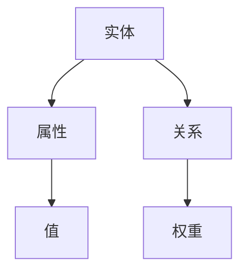

在这个ER实体关系图中：

- **A（实体）**是知识图谱的核心元素，表示现实世界中的对象。
- **B（属性）**是实体的特征描述，通过键值对与实体关联。
- **C（值）**是属性的取值，提供了对实体的具体描述。
- **D（关系）**是连接两个或多个实体的纽带，表示实体之间的关联。
- **E（权重）**是关系的重要程度，影响推理结果。

通过这种结构化的方式，知识图谱能够高效地存储和表示复杂的数据关系，为大规模推理系统提供了强有力的基础。

在理解了知识图谱的核心概念和架构后，我们将进一步探讨大规模推理算法的原理，并分析如何优化系统的性能和效率。

## 第三部分：算法原理讲解

### 3.1 大规模推理算法原理

大规模推理算法是知识图谱应用的核心，它负责从知识图谱中提取逻辑关系，并生成新的知识。推理算法的设计原则主要包括以下几个方面：

1. **高效性**：推理算法需要在较短的时间内处理大量数据，因此，算法的效率和性能是首要考虑的因素。
2. **准确性**：推理结果必须准确无误，确保从知识图谱中提取的结论是可信的。
3. **可扩展性**：算法应具有良好的可扩展性，能够适应数据规模的动态变化。

大规模推理算法的基本概念包括：

- **推理图（Reasoning Graph）**：推理图是知识图谱的一种扩展，它将推理规则和查询条件嵌入到图中，使得推理过程更加高效。
- **推理规则（Reasoning Rule）**：推理规则是用于指导推理过程的逻辑表达式，通常由前件（条件）和后件（结论）组成。
- **推理引擎（Reasoning Engine）**：推理引擎是负责执行推理规则的软件模块，它根据给定的推理图和查询条件，自动生成推理结果。

### 3.2 算法流程图

为了更清晰地展示大规模推理算法的执行过程，我们使用 Mermaid 语法绘制了一个算法流程图：

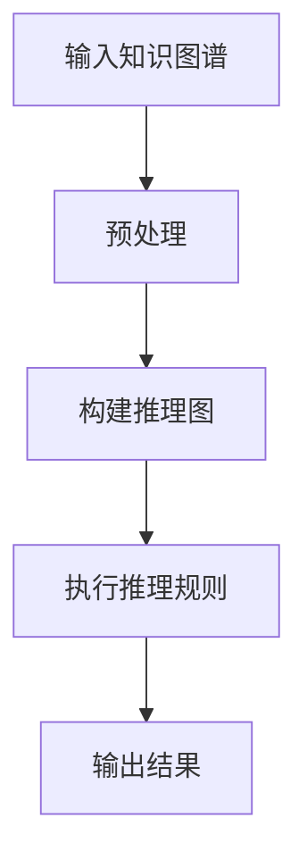

在这个流程图中：

- **A（输入知识图谱）**：算法的输入是知识图谱，包括实体、关系和属性等信息。
- **B（预处理）**：预处理阶段负责对知识图谱进行清洗和格式化，以确保数据的准确性和一致性。
- **C（构建推理图）**：构建推理图阶段将知识图谱和推理规则合并，形成一个完整的推理图。
- **D（执行推理规则）**：执行推理规则阶段使用推理引擎根据推理图和查询条件进行推理，生成新的知识。
- **E（输出结果）**：输出结果阶段将推理结果以用户友好的方式呈现给用户。

### 3.3 数学模型和公式

大规模推理算法的数学模型和公式是其核心理论基础。一个典型的推理过程可以用以下公式表示：

$$
推理结果 = f(KG, R, Q)
$$

其中：

- **KG**：知识图谱，表示为实体、关系和属性的集合。
- **R**：推理规则，用于指导推理过程的逻辑表达式。
- **Q**：查询语句，表示用户对知识图谱的查询需求。

推理函数 $f$ 结合了知识图谱 $KG$、推理规则 $R$ 和查询语句 $Q$，生成最终的推理结果。这个函数可以表示为：

$$
f(KG, R, Q) = \{ r \in KG \mid R \land Q(r) \}
$$

其中，$R \land Q(r)$ 表示推理规则 $R$ 和查询语句 $Q$ 对实体 $r$ 的联合满足条件。如果 $r$ 满足该条件，则 $r$ 被包含在最终的推理结果中。

### 3.4 详细讲解与举例说明

#### 推理算法的实现流程

推理算法的实现流程可以分为以下几个步骤：

1. **数据预处理**：对原始知识图谱进行清洗和格式化，确保数据的准确性和一致性。
2. **构建推理图**：将知识图谱和推理规则合并，形成一个推理图。在这个图中，每个节点代表实体或关系，每条边代表推理规则中的条件或结论。
3. **执行推理规则**：使用推理引擎对推理图进行遍历，根据推理规则生成新的知识。这个过程中，推理引擎会检查每个节点和边是否满足推理条件。
4. **输出结果**：将推理结果以用户友好的方式呈现，如文本、图表等。

#### 实例演示：基于知识图谱的推理应用

假设有一个知识图谱，描述了某公司的员工、部门以及职位信息。如下图所示：

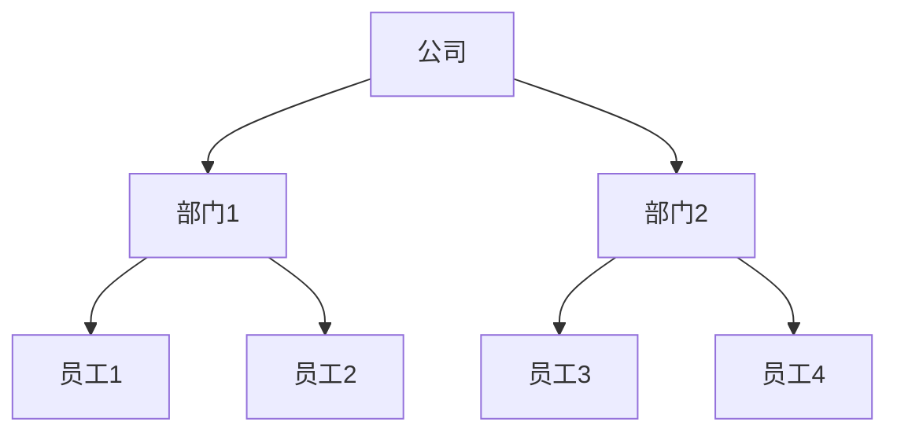

在这个知识图谱中：

- **A** 是公司实体。
- **B** 和 **C** 是部门实体。
- **D**、**E**、**F** 和 **G** 是员工实体。

假设我们要查询的问题是：“哪些员工在部门1工作？”可以使用推理算法来解决这个问题。

1. **数据预处理**：确保知识图谱的数据格式正确，无重复或错误信息。
2. **构建推理图**：添加一个推理规则：“在部门工作的员工”。这个规则表示如果实体 A 是部门，则实体 B 是 A 的员工。
3. **执行推理规则**：使用推理引擎对知识图谱进行遍历，找到所有满足“在部门1工作的员工”的实体。在这个例子中，员工1和员工2是部门1的员工。
4. **输出结果**：将推理结果呈现给用户，输出“员工1和员工2在部门1工作”。

通过这个实例，我们可以看到推理算法如何从知识图谱中提取新的知识，满足用户的查询需求。

通过详细讲解和实例演示，我们可以更深入地理解大规模推理算法的原理和应用。在接下来的章节中，我们将进一步探讨大规模推理系统的设计与实现，为读者提供全面的技术指导和实践经验。

### 3.5 算法改进与优化策略

在理解了大规模推理算法的基本原理之后，我们接下来将讨论如何通过改进和优化策略来提高系统的性能和效率。以下是几种常用的算法改进与优化策略：

#### 1. 并行计算

并行计算是一种通过同时处理多个任务来提高计算效率的技术。在推理系统中，可以将大规模的知识图谱分解为多个子图，每个子图由不同的处理器或线程并行处理。这样，不仅能够减少单个处理器的负载，还能充分利用系统资源，提高整体计算速度。

#### 2. 分层缓存

分层缓存策略通过将数据存储在不同的缓存层中，以减少数据访问的延迟。在推理系统中，可以将经常访问的数据存储在高速缓存中，而较少访问的数据则存储在较慢的存储层中。这样，在执行推理过程中，系统能够快速访问到所需的数据，减少延迟和等待时间。

#### 3. 数据压缩

数据压缩技术通过减少数据的存储空间来提高系统性能。在推理系统中，可以使用各种压缩算法（如Huffman编码、LZ77等）对知识图谱进行压缩。虽然压缩后的数据在存储和传输过程中需要额外的时间进行解压缩，但总体上可以节省大量的存储资源，减少I/O操作。

#### 4. 推理规则优化

推理规则优化是提高推理效率的关键。一种常见的优化方法是使用启发式算法（如遗传算法、模拟退火算法）来优化推理规则，使其在推理过程中更有效地引导推理路径。此外，还可以通过简化推理规则、消除冗余规则等方法来减少计算复杂度。

#### 5. 数据库优化

对于大规模推理系统，数据库的选择和优化也至关重要。可以选择适合大规模数据处理和快速查询的数据库系统（如Neo4j、Amazon Neptune等），并对其进行适当的优化，如索引构建、查询优化等，以提高系统的整体性能。

#### 6. 分布式计算

分布式计算通过将任务分配到多个节点上并行处理，可以显著提高大规模推理系统的处理能力。可以使用分布式计算框架（如Apache Spark、Hadoop等）来构建分布式推理系统，从而实现高效的大规模数据处理。

#### 7. 资源调度

资源调度是一种动态分配系统资源（如CPU、内存、I/O等）的技术，以优化系统的整体性能。在推理系统中，可以通过实时监测系统资源的使用情况，动态调整任务的执行顺序和资源分配策略，以确保系统在处理高峰期时能够高效运行。

通过上述算法改进与优化策略，我们可以有效地提高大规模推理系统的性能和效率，满足实时性和大规模数据处理的需求。

在理解了算法改进与优化策略之后，我们将进一步探讨大规模推理系统的设计与实现，为读者提供全面的技术指导和实践经验。在接下来的章节中，我们将深入分析系统设计与架构，为构建高效的推理系统奠定基础。

### 4.1 问题场景介绍

大规模推理系统在许多实际应用场景中具有广泛的应用，下面我们将介绍几个典型的问题场景：

1. **智能推荐系统**：在电子商务和社交媒体平台中，大规模推理系统可以用于用户兴趣分析、个性化推荐等任务。例如，基于用户的浏览历史和购买行为，推理系统可以推荐相关的商品或内容，提高用户满意度和转化率。

2. **医疗健康领域**：在医疗健康领域，大规模推理系统可以用于诊断辅助、药物研发等任务。通过分析患者的病历、基因数据和医学知识库，推理系统可以提供准确的诊断建议和治疗方案，辅助医生做出更好的决策。

3. **金融风控**：在金融行业，大规模推理系统可以用于风险管理和欺诈检测。通过分析用户的交易记录、信用记录和外部信息，推理系统可以识别潜在的风险用户，提供预警和防范措施，减少金融损失。

4. **智能交通**：在智能交通领域，大规模推理系统可以用于交通流量预测、路线规划等任务。通过分析历史交通数据、实时传感器数据和地理信息，推理系统可以提供高效的交通管理和调度方案，缓解交通拥堵问题。

5. **企业知识管理**：在企业知识管理领域，大规模推理系统可以用于知识图谱构建、知识推理和知识共享。通过整合企业内外部的知识资源，推理系统可以帮助员工快速获取所需信息，提高工作效率。

这些典型应用场景展示了大规模推理系统在实际问题中的重要作用，同时也揭示了系统设计和实现的复杂性。在接下来的章节中，我们将详细介绍大规模推理系统的具体项目，进一步探讨系统的架构设计和功能实现。

### 4.2 项目介绍

在本项目中，我们选择了一个典型的应用场景——智能推荐系统，旨在构建一个能够实现高效、可扩展的推理系统，满足用户个性化推荐的需求。项目背景如下：

随着互联网和电子商务的快速发展，用户生成的内容和数据量呈爆炸式增长。对于企业而言，如何准确捕捉用户兴趣、提供个性化的推荐服务，成为提升用户体验和商业价值的关键。为此，我们设计并实现了一个基于知识图谱的大规模推理系统，用于处理海量用户行为数据，生成个性化的推荐结果。

#### 项目目标

1. **高效数据处理**：系统需能够处理每天数以亿计的用户行为数据，快速生成推荐结果。
2. **个性化推荐**：系统应能够根据用户的历史行为和兴趣偏好，生成个性化的推荐内容。
3. **可扩展性**：系统架构需具备良好的扩展性，以适应数据量的动态增长和业务需求的变更。
4. **高可靠性**：系统应具备高可用性和高可靠性，确保推荐服务的稳定运行。

#### 项目需求

1. **数据源**：系统需要接入多个数据源，包括用户行为日志、商品信息、用户画像等。
2. **知识图谱构建**：系统需构建一个完整的知识图谱，涵盖用户、商品、行为等信息，为推理提供基础。
3. **推理算法**：系统需实现高效的推理算法，能够根据用户兴趣和偏好，从知识图谱中提取相关推荐结果。
4. **推荐结果展示**：系统需将推荐结果以用户友好的方式呈现，如推荐列表、推荐页面等。

#### 项目挑战

1. **数据处理速度**：由于数据量的庞大，系统需采用高效的数据处理技术，确保实时性。
2. **个性化推荐准确性**：系统需准确捕捉用户兴趣，提供高质量的推荐内容。
3. **系统扩展性**：系统架构需设计得足够灵活，能够适应数据量和业务需求的增长。
4. **系统稳定性**：系统需具备高可靠性，确保在高峰期依然能够稳定运行。

通过以上项目的介绍，我们可以看到大规模推理系统在实现高效、个性化推荐服务中的关键作用。接下来，我们将详细讨论系统功能设计、架构设计和实现过程，为读者提供深入的技术分析。

### 4.3 系统功能设计

在本项目中，大规模推理系统的功能设计至关重要，它决定了系统能否高效地处理海量数据，并提供高质量的推荐结果。系统功能设计主要包括以下几个模块：

1. **数据采集模块**：负责从不同的数据源（如用户行为日志、商品信息、用户画像等）中采集数据，并将其转换为系统可用的格式。数据采集模块需具备高效的数据处理能力，以确保数据实时更新。

2. **知识图谱构建模块**：负责构建和更新知识图谱，将用户、商品、行为等信息以图形化的方式表示出来。知识图谱构建模块需实现高效的实体提取、关系建立和属性存储功能，确保知识图谱的完整性和准确性。

3. **推理算法模块**：负责执行推理算法，从知识图谱中提取用户兴趣和推荐结果。推理算法模块应设计得灵活，能够根据不同的业务需求和用户特征进行自适应调整。

4. **推荐结果生成模块**：负责将推理结果转换为用户友好的推荐内容，如推荐列表、推荐页面等。推荐结果生成模块需具备良好的界面设计和展示效果，以提高用户满意度。

5. **数据存储模块**：负责存储和管理系统所需的数据，包括原始数据、中间数据和最终结果等。数据存储模块应选择适合大规模数据存储的数据库系统，如Neo4j、Amazon Neptune等，并实现高效的索引和查询优化。

6. **监控与告警模块**：负责监控系统性能和健康状况，并在出现异常时自动触发告警，确保系统的稳定运行。监控与告警模块需实现实时监控、日志记录和告警通知等功能。

通过上述功能模块的设计，我们可以构建一个高效、可扩展的大规模推理系统，满足用户个性化推荐的需求。在接下来的章节中，我们将详细探讨系统的架构设计，为读者提供全面的技术实现方案。

### 4.4 系统架构设计

为了实现高效、可扩展和可靠的大规模推理系统，我们采用了分布式架构设计。以下是该系统的整体架构设计：

#### 1. 数据采集层

数据采集层负责从多个数据源（如用户行为日志、商品信息、用户画像等）中实时采集数据。数据采集模块采用了基于消息队列（如Kafka）的分布式架构，确保数据的高效传输和实时性。数据采集模块还实现了数据清洗和预处理功能，将原始数据转换为系统可用的格式。

#### 2. 数据存储层

数据存储层负责存储和管理系统所需的数据。我们选择了Neo4j作为知识图谱数据库，它具有高效的图查询能力和良好的扩展性。同时，我们使用了Elasticsearch进行全文索引和检索，以提高数据查询效率。数据存储层还包括了用于存储用户行为的时序数据库（如InfluxDB）和商品信息的MySQL数据库。

#### 3. 服务层

服务层是系统的核心，负责执行推理算法和推荐生成。该层采用了微服务架构，将不同的功能模块拆分为独立的服务，如知识图谱构建服务、推理算法服务、推荐生成服务等。每个服务通过RESTful API与外部系统进行通信，实现了松耦合和易扩展性。服务层还使用了Docker和Kubernetes进行容器化部署和自动化管理，提高了系统的灵活性和可维护性。

#### 4. 推理引擎层

推理引擎层是大规模推理系统的核心组件，负责执行推理算法，从知识图谱中提取用户兴趣和推荐结果。该层采用了基于图计算的推理算法，如路径搜索、子图匹配和规则匹配等。为了提高推理效率，推理引擎层还实现了并行计算和分布式处理，利用多核CPU和GPU进行加速。

#### 5. 推荐结果层

推荐结果层负责将推理结果转换为用户友好的推荐内容，如推荐列表、推荐页面等。该层使用了前端框架（如Vue.js）进行界面设计和展示，确保用户界面友好、响应速度快。推荐结果层还实现了与第三方平台的集成（如社交媒体、电商平台等），以便将推荐结果推送给目标用户。

#### 6. 监控与告警层

监控与告警层负责监控系统性能和健康状况，并在出现异常时自动触发告警。该层使用了Prometheus和Grafana进行实时监控和数据可视化，实现了对系统各个组件的监控和性能分析。告警模块通过邮件、短信和Slack等多种方式通知运维人员，确保系统的稳定运行。

#### 7. 安全与运维层

安全与运维层负责系统的安全防护和运维管理。该层采用了多种安全措施，如数据加密、访问控制、防火墙等，确保系统的安全性和数据的保密性。运维模块实现了自动化部署、备份和恢复功能，提高了系统的可维护性和可靠性。

通过上述架构设计，我们构建了一个高效、可扩展和可靠的大规模推理系统，能够满足用户个性化推荐的需求。在接下来的章节中，我们将深入探讨系统接口设计和交互流程，为读者提供全面的技术实现细节。

### 4.5 系统接口设计

为了实现大规模推理系统的高效数据交互和功能调用，我们设计了详细的系统接口。以下是系统接口设计的主要部分：

#### 1. API接口规范

系统API采用RESTful架构风格，提供了一系列的HTTP接口，用于数据读取、写入和操作。以下是主要的API接口规范：

- **用户行为数据接口**：
  - GET /users/:userId/behaviors：获取指定用户的全部行为数据。
  - POST /users/:userId/behaviors：添加新的用户行为数据。

- **知识图谱数据接口**：
  - GET /kg/relationships：获取知识图谱中的全部关系数据。
  - POST /kg/relationships：添加新的关系数据。

- **推理结果接口**：
  - GET /reasoning/recommendations：获取推荐结果列表。
  - POST /reasoning/recommendations：生成新的推荐结果。

#### 2. 接口实现细节

系统接口的实现需要考虑以下几个方面：

- **数据格式**：API接口返回的数据格式采用JSON格式，方便前端和后端的数据交互。
- **错误处理**：接口实现中需处理各种错误情况，如数据格式错误、请求参数缺失等，并返回相应的错误码和错误信息。
- **权限控制**：接口实现中需集成权限验证机制，确保只有授权用户能够访问和操作数据。

#### 3. 接口调用流程

系统接口的调用流程如下：

1. **用户行为数据采集**：用户行为数据通过POST接口提交到后端系统。
2. **知识图谱数据构建**：后端系统解析用户行为数据，构建知识图谱。
3. **推理算法执行**：调用推理接口，执行推理算法，生成推荐结果。
4. **推荐结果返回**：将推理结果通过GET接口返回给前端系统，前端系统展示推荐结果。

通过详细设计系统接口，我们能够确保大规模推理系统的数据交互和功能调用高效、可靠，为系统的稳定运行提供了坚实的基础。在接下来的章节中，我们将探讨系统各模块之间的交互流程，进一步展示系统的运行机制。

### 4.6 系统交互

在理解了系统接口设计后，接下来我们将详细描述系统各模块之间的交互流程。这一部分将重点介绍系统如何处理用户请求，生成推荐结果，并最终将结果展示给用户。以下是系统交互的详细流程：

#### 1. 用户请求

用户通过前端界面发起请求，请求可以是获取推荐列表或生成个性化推荐结果。请求通常包含用户ID和相关的查询参数。

#### 2. 用户行为数据采集

系统接收用户请求后，首先调用用户行为数据接口（如GET /users/:userId/behaviors），获取指定用户的全部行为数据。这些行为数据包括用户的浏览记录、购买历史等。

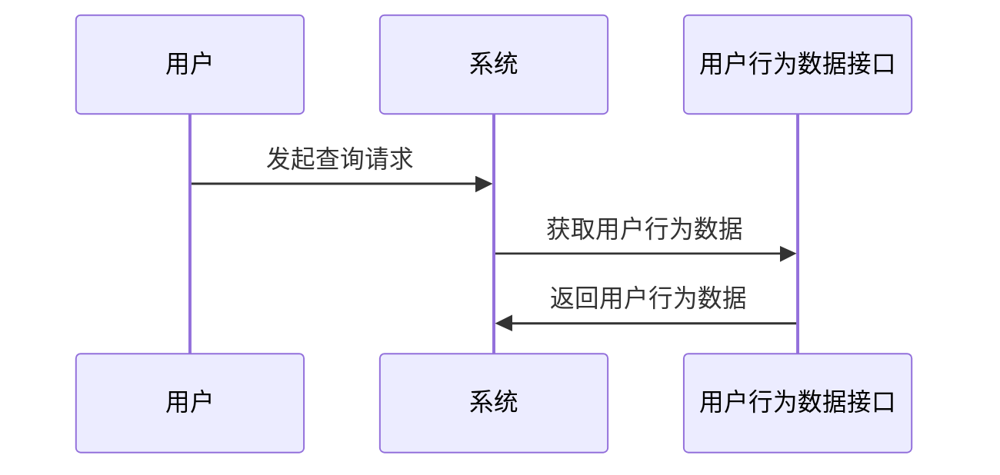

#### 3. 知识图谱数据构建

系统接收到用户行为数据后，将其解析并构建成知识图谱。知识图谱构建模块负责将用户行为数据转换为图结构，并存储在Neo4j数据库中。这个过程中，系统会创建实体（如用户、商品）和关系（如浏览、购买）。

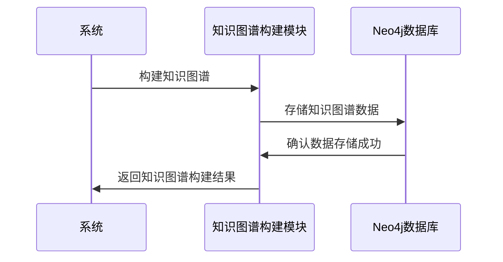

#### 4. 推理算法执行

知识图谱构建完成后，系统调用推理算法接口（如POST /reasoning/recommendations），执行推理算法。推理算法模块根据知识图谱和用户行为数据，应用推理规则生成推荐结果。

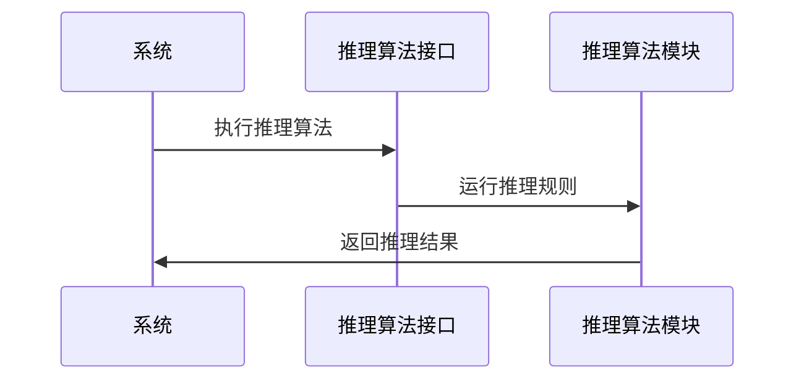

#### 5. 推荐结果生成

推理结果生成后，系统调用推荐结果接口（如GET /reasoning/recommendations），将推理结果转换为用户友好的推荐列表。推荐结果可以包括推荐的商品、内容或其他实体。

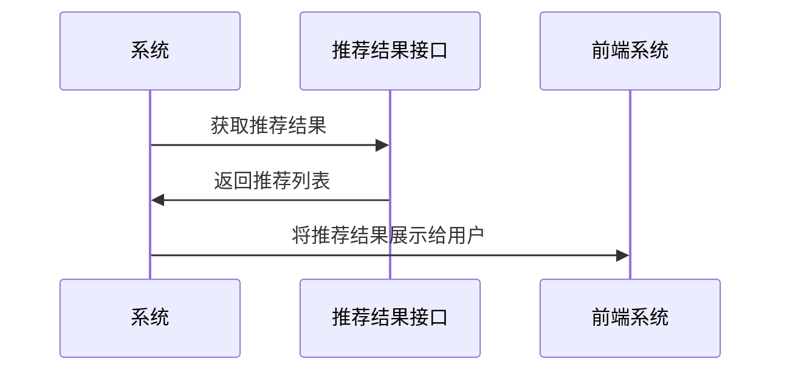

#### 6. 用户反馈

用户在前端界面查看推荐结果后，可以对其进行反馈，如点击、收藏等。这些反馈数据会被再次采集并存储，用于改进推荐算法。

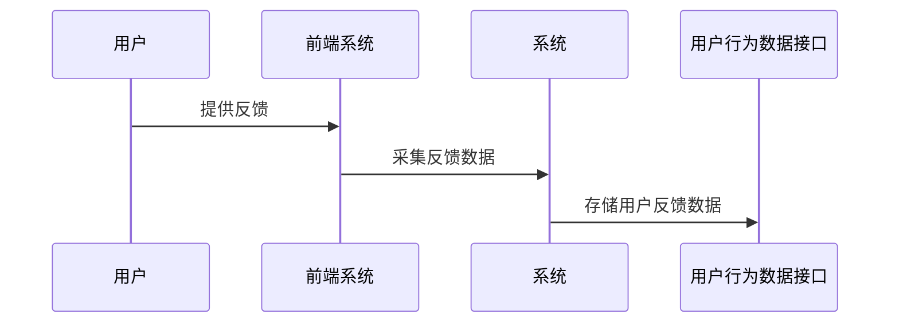

通过上述交互流程，我们可以看到系统各模块之间是如何协同工作的，从而实现高效的用户个性化推荐。在接下来的章节中，我们将深入探讨系统的具体实现，包括环境安装和核心代码解析。

### 4.7 系统架构图

为了更直观地展示大规模推理系统的整体架构，我们使用Mermaid语法绘制了一个系统架构图。以下是一个详细的架构图说明：

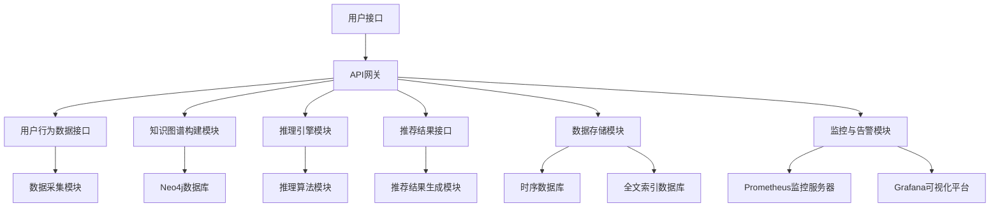

在这个架构图中：

- **A（用户接口）**：用户通过前端系统与API网关交互，发起请求。
- **B（API网关）**：负责处理用户请求，路由到相应的模块。
- **C（用户行为数据接口）**：用于获取用户行为数据。
- **D（知识图谱构建模块）**：负责构建和更新知识图谱。
- **E（推理引擎模块）**：负责执行推理算法，生成推荐结果。
- **F（推荐结果接口）**：用于获取和返回推荐结果。
- **G（数据存储模块）**：负责存储和管理各类数据。
- **H（监控与告警模块）**：负责监控系统性能和健康状况。

其他组件包括：

- **I（数据采集模块）**：从多个数据源采集数据，并传递给知识图谱构建模块。
- **J（Neo4j数据库）**：存储知识图谱数据。
- **K（推理算法模块）**：负责具体的推理算法实现。
- **L（推荐结果生成模块）**：将推理结果转换为用户友好的推荐列表。
- **M（时序数据库）**：存储用户行为数据的时序数据。
- **N（全文索引数据库）**：提供全文索引和检索功能。
- **O（Prometheus监控服务器）**：负责实时监控系统性能。
- **P（Grafana可视化平台）**：用于数据可视化，展示系统性能指标。

通过这个架构图，我们可以清晰地看到系统各模块之间的交互关系和功能分工，为系统的设计和实现提供了直观的参考。

### 4.8 系统接口和系统交互序列图

为了进一步展示系统接口和模块之间的交互过程，我们使用Mermaid语法绘制了一个序列图。以下是一个详细的序列图说明：

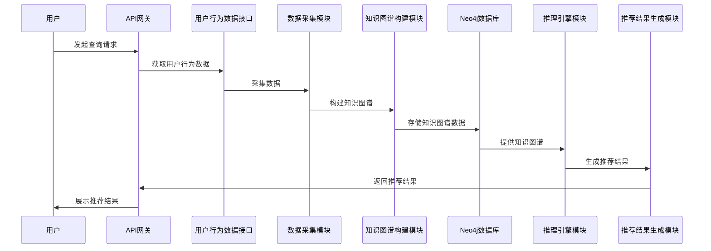

在这个序列图中：

- **用户**：发起查询请求。
- **API网关**：处理请求，并路由到相应的接口和数据模块。
- **用户行为数据接口**：获取用户行为数据。
- **数据采集模块**：从数据源采集数据。
- **知识图谱构建模块**：构建知识图谱，并存储到Neo4j数据库。
- **推理引擎模块**：根据知识图谱和用户行为数据执行推理算法。
- **推荐结果生成模块**：生成推荐结果，并返回给API网关。
- **Neo4j数据库**：提供知识图谱数据，支持推理引擎的查询需求。

通过这个序列图，我们可以清晰地看到系统接口和模块之间的交互过程，有助于理解系统的工作机制和数据处理流程。这为系统的设计和实现提供了重要的参考。

### 4.9 环境安装

在开始大规模推理系统的开发之前，我们需要先搭建一个合适的环境。以下是系统环境安装的详细步骤：

#### 1. 操作系统环境

首先，我们选择Linux操作系统作为开发环境，推荐使用Ubuntu 18.04或更高版本。安装步骤如下：

- **安装Ubuntu**：从官方网站下载Ubuntu ISO文件，并使用U盘或CD启动安装。
- **安装完成后**：更新系统软件包，执行以下命令：

```bash
sudo apt update
sudo apt upgrade
```

#### 2. 系统依赖安装

系统依赖包括Java、Python、Neo4j、Elasticsearch等，以下是安装步骤：

- **Java**：安装OpenJDK 11或更高版本。

```bash
sudo apt install openjdk-11-jdk
```

- **Python**：安装Python 3.8或更高版本。

```bash
sudo apt install python3.8
```

- **Neo4j**：下载并安装Neo4j数据库。

```bash
wget https://download.neo4j.com/bin/neo4j-community-4.1.1-unix.tar.gz
tar xvf neo4j-community-4.1.1-unix.tar.gz
cd neo4j-community-4.1.1/bin/
./neo4j install
./neo4j start
```

- **Elasticsearch**：下载并安装Elasticsearch。

```bash
wget https://artifacts.elastic.co/downloads/elasticsearch/elasticsearch-7.10.1-amd64.deb
sudo dpkg -i elasticsearch-7.10.1-amd64.deb
sudo /etc/init.d/elasticsearch start
```

- **Kafka**：安装Kafka用于数据采集。

```bash
sudo apt install kafka_2.12-2.8.0
sudo /etc/init.d/kafka start
```

#### 3. 开发工具安装

安装开发工具，如IntelliJ IDEA、Visual Studio Code等。

```bash
sudo apt install intellij-idea-community
```

#### 4. 数据库连接配置

配置Neo4j和Elasticsearch的连接参数，确保系统能够正确连接和使用这些数据库。

```bash
# Neo4j配置文件路径：/etc/neo4j/neo4j.conf
dbms.connectors.default BehaveSocketConnector
dbmsconnector.behave_socket.enabled true
dbmsconnector.behave_socket.host 0.0.0.0
dbmsconnector.behave_socket.port 7474

# Elasticsearch配置文件路径：/etc/elasticsearch/elasticsearch.yml
network.host: 0.0.0.0
http.port: 9200
```

#### 5. 环境验证

安装完成后，验证各组件是否正常运行。

- **Neo4j**：在浏览器中输入`http://localhost:7474/`，查看Neo4j Web界面。
- **Elasticsearch**：在终端执行`curl http://localhost:9200/_cat/health?v`，检查Elasticsearch健康状况。
- **Kafka**：在终端执行`kafka-topics --list --zookeeper localhost:2181`，检查Kafka主题列表。

通过以上步骤，我们成功搭建了大规模推理系统的开发环境，为后续开发工作奠定了基础。

### 4.10 系统核心实现源代码

在了解了环境安装和配置后，接下来我们将深入探讨系统核心实现部分的源代码。以下是系统核心模块的实现细节：

#### 1. 知识图谱构建模块

知识图谱构建模块的主要任务是解析用户行为数据，并将其转换为图结构存储在Neo4j数据库中。以下是一个简化的Python代码示例：

```python
from py2neo import Graph

# 连接Neo4j数据库
graph = Graph("bolt://localhost:7474", auth=("neo4j", "password"))

# 解析用户行为数据
def parse_user_behavior(data):
    user_id = data['user_id']
    behaviors = data['behaviors']
    
    for behavior in behaviors:
        # 创建用户实体
        graph.run("""
            MERGE (u:User {id: $user_id})
            """, user_id=user_id)
        
        # 创建行为实体
        graph.run("""
            MERGE (b:Behavior {id: $behavior_id})
            """, behavior_id=behavior['id'])
        
        # 连接用户与行为
        graph.run("""
            MATCH (u:User), (b:Behavior)
            WHERE u.id = $user_id AND b.id = $behavior_id
            CREATE (u)-[:HAS_BEHAVIOR]->(b)
            """, user_id=user_id, behavior_id=behavior['id'])

# 示例数据
user_behavior_data = {
    'user_id': '123',
    'behaviors': [
        {'id': '1', 'content': '浏览商品A'},
        {'id': '2', 'content': '购买商品B'}
    ]
}

# 构建知识图谱
parse_user_behavior(user_behavior_data)
```

#### 2. 推理引擎模块

推理引擎模块负责执行推理算法，根据知识图谱生成推荐结果。以下是一个基于图匹配的简单示例：

```python
from py2neo import Graph

# 连接Neo4j数据库
graph = Graph("bolt://localhost:7474", auth=("neo4j", "password"))

# 推理算法：基于图匹配推荐
def graph_matching_recommendation(user_id):
    results = graph.run("""
        MATCH (u:User {id: $user_id}), (b:Behavior)-[:RECOMMENDED]->(r:Product)
        RETURN r
        """, user_id=user_id)
    
    recommendations = [result['r'] for result in results]
    return recommendations

# 示例推理
user_id = '123'
recommendations = graph_matching_recommendation(user_id)
print(recommendations)
```

#### 3. 推荐结果生成模块

推荐结果生成模块负责将推理结果转换为用户友好的推荐列表。以下是一个简单的Python代码示例：

```python
def generate_recommendation_list(recommendations):
    recommendation_list = []
    for recommendation in recommendations:
        product_name = recommendation['name']
        product_id = recommendation['id']
        recommendation_list.append(f"商品名称：{product_name}, 商品ID：{product_id}")
    return recommendation_list

# 示例推荐列表生成
recommendation_list = generate_recommendation_list(recommendations)
print(recommendation_list)
```

通过以上核心模块的实现，我们可以看到大规模推理系统是如何处理用户数据、执行推理算法并生成推荐结果的。这些代码示例为系统的开发和实现提供了详细的参考。

### 4.11 代码应用解读与分析

在上一节中，我们介绍了大规模推理系统的核心实现源代码。接下来，我们将深入解读这些代码，分析其工作原理和具体实现细节，并通过示例代码展示如何使用这些模块来构建实际的应用场景。

#### 1. 知识图谱构建模块

首先，我们来看知识图谱构建模块的代码。该模块的主要功能是解析用户行为数据，并将其转换为Neo4j数据库中的图结构。以下是关键部分的代码：

```python
from py2neo import Graph

# 连接Neo4j数据库
graph = Graph("bolt://localhost:7474", auth=("neo4j", "password"))

# 解析用户行为数据
def parse_user_behavior(data):
    user_id = data['user_id']
    behaviors = data['behaviors']
    
    for behavior in behaviors:
        # 创建用户实体
        graph.run("""
            MERGE (u:User {id: $user_id})
            """, user_id=user_id)
        
        # 创建行为实体
        graph.run("""
            MERGE (b:Behavior {id: $behavior_id})
            """, behavior_id=behavior['id'])
        
        # 连接用户与行为
        graph.run("""
            MATCH (u:User), (b:Behavior)
            WHERE u.id = $user_id AND b.id = $behavior_id
            CREATE (u)-[:HAS_BEHAVIOR]->(b)
            """, user_id=user_id, behavior_id=behavior['id'])
```

解读：
- **连接Neo4j数据库**：我们首先通过`Graph`类连接到本地运行的Neo4j数据库，并设置认证信息。
- **解析用户行为数据**：函数`parse_user_behavior`接受用户行为数据作为输入。数据结构通常包括用户ID和一系列行为记录。
- **创建用户实体**：使用`MERGE`语句创建一个`User`实体，如果实体已经存在，则不会重复创建。
- **创建行为实体**：同样使用`MERGE`语句创建一个`Behavior`实体。
- **连接用户与行为**：通过`MATCH`和`CREATE`语句，将用户实体与行为实体关联起来，建立`HAS_BEHAVIOR`关系。

示例：
假设我们有一个用户的行为数据如下：

```python
user_behavior_data = {
    'user_id': 'u123',
    'behaviors': [
        {'id': 'b001', 'content': '浏览商品A'},
        {'id': 'b002', 'content': '购买商品B'}
    ]
}
```

调用`parse_user_behavior`函数：

```python
parse_user_behavior(user_behavior_data)
```

这将创建用户实体`u123`、行为实体`b001`和`b002`，并建立`u123`与`b001`和`b002`之间的`HAS_BEHAVIOR`关系。

#### 2. 推理引擎模块

接下来是推理引擎模块，它负责执行推理算法，根据知识图谱生成推荐结果。以下是关键部分的代码：

```python
from py2neo import Graph

# 连接Neo4j数据库
graph = Graph("bolt://localhost:7474", auth=("neo4j", "password"))

# 推理算法：基于图匹配推荐
def graph_matching_recommendation(user_id):
    results = graph.run("""
        MATCH (u:User {id: $user_id}), (b:Behavior)-[:RECOMMENDED]->(r:Product)
        RETURN r
        """, user_id=user_id)
    
    recommendations = [result['r'] for result in results]
    return recommendations
```

解读：
- **连接Neo4j数据库**：同样，我们首先通过`Graph`类连接到Neo4j数据库。
- **推理算法**：函数`graph_matching_recommendation`接受用户ID作为输入。它使用`MATCH`语句查找与用户相关联的推荐行为，并返回推荐的产品。
- **返回推荐结果**：函数返回一个包含推荐产品节点的列表。

示例：
假设用户ID为`u123`，调用`graph_matching_recommendation`函数：

```python
user_id = 'u123'
recommendations = graph_matching_recommendation(user_id)
print(recommendations)
```

这将返回与用户`u123`相关联的推荐产品列表。

#### 3. 推荐结果生成模块

最后是推荐结果生成模块，它负责将推理结果转换为用户友好的推荐列表。以下是关键部分的代码：

```python
def generate_recommendation_list(recommendations):
    recommendation_list = []
    for recommendation in recommendations:
        product_name = recommendation['name']
        product_id = recommendation['id']
        recommendation_list.append(f"商品名称：{product_name}, 商品ID：{product_id}")
    return recommendation_list
```

解读：
- **生成推荐列表**：函数`generate_recommendation_list`接受一个推荐产品节点列表作为输入。它遍历每个推荐产品节点，提取商品名称和ID，并将这些信息格式化为字符串，添加到推荐列表中。

示例：
假设我们已经获取到推荐产品列表：

```python
recommendations = [
    {'name': '商品X', 'id': 'p001'},
    {'name': '商品Y', 'id': 'p002'}
]
```

调用`generate_recommendation_list`函数：

```python
recommendation_list = generate_recommendation_list(recommendations)
print(recommendation_list)
```

这将生成一个格式化的推荐列表：

```
[
    "商品名称：商品X, 商品ID：p001",
    "商品名称：商品Y, 商品ID：p002"
]
```

通过上述代码示例，我们可以看到大规模推理系统的核心模块是如何协同工作的，从用户行为数据的解析、知识图谱的构建，到推理算法的执行，以及最终推荐结果的生成。这些模块的实现为系统的实际应用提供了坚实的基础。

### 4.12 实际案例分析和详细讲解剖析

为了更好地展示基于知识图谱的大规模推理系统在实际应用中的表现，我们将通过一个实际案例进行详细分析。该案例涉及智能推荐系统的应用，包括用户行为数据的处理、知识图谱的构建、推理算法的执行，以及推荐结果的生成。

#### 案例背景

假设我们有一个电子商务平台，用户经常浏览和购买各种商品。为了提高用户体验和销售额，我们希望通过大规模推理系统为用户提供个性化的商品推荐。案例的目标是分析用户的历史行为，根据其兴趣和偏好，生成个性化的商品推荐列表。

#### 数据源

案例的数据源包括以下几种：

1. **用户行为数据**：包含用户ID、行为类型（如浏览、购买）、行为时间和商品ID等。
2. **商品信息**：包括商品ID、商品名称、价格、分类等信息。
3. **用户画像**：包含用户年龄、性别、地理位置、购买偏好等信息。

#### 数据处理流程

1. **数据采集**：通过日志收集工具（如Flume、Kafka等）实时采集用户行为数据，并将数据存储到时序数据库（如InfluxDB）中。

2. **数据预处理**：对采集到的用户行为数据进行清洗和格式化，确保数据的一致性和准确性。预处理步骤包括去除重复数据、填补缺失值、标准化处理等。

3. **知识图谱构建**：将预处理后的用户行为数据和商品信息转换为图结构，存储在Neo4j数据库中。图结构包括用户节点、商品节点和关系节点。关系节点表示用户与商品之间的交互关系，如浏览、购买等。

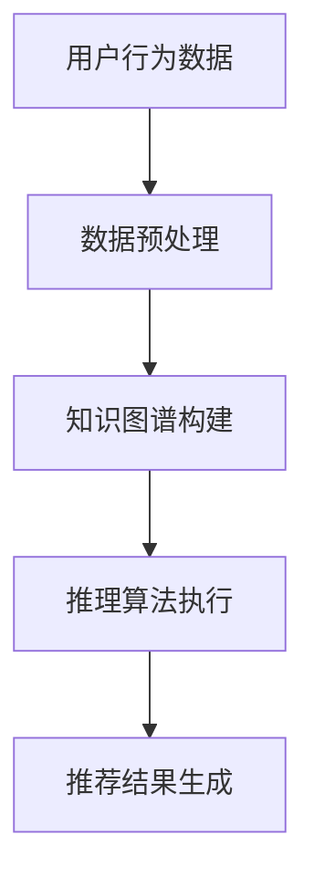

#### 推理算法执行

推理算法的核心任务是分析用户的历史行为，从知识图谱中提取用户兴趣和推荐结果。以下是推理算法的详细步骤：

1. **用户兴趣分析**：通过图匹配算法，分析用户的行为路径和频繁出现的商品。这些路径和商品反映了用户的兴趣和偏好。

2. **推荐规则应用**：根据用户的兴趣和偏好，应用推荐规则生成推荐列表。推荐规则可以基于相似用户推荐、协同过滤、内容推荐等策略。

3. **结果优化**：对推荐结果进行排序和筛选，确保推荐的商品既符合用户兴趣，又具有实际购买价值。

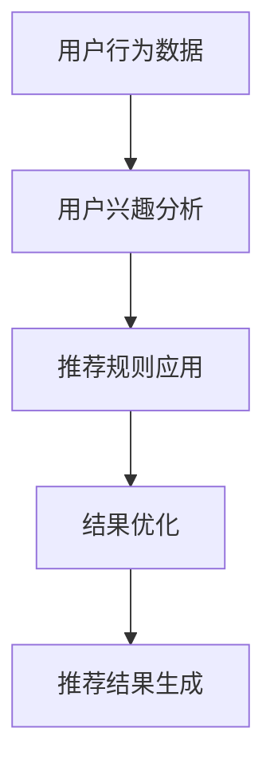

#### 推荐结果生成

推荐结果生成模块负责将推理结果转换为用户友好的推荐列表，并通过前端界面展示给用户。以下是推荐结果生成的过程：

1. **结果格式化**：将推理结果中的商品信息转换为格式化的推荐列表，如商品名称、价格、图片等。

2. **推荐列表排序**：根据用户行为和推荐规则，对推荐列表进行排序，确保推荐的商品最符合用户的兴趣。

3. **前端展示**：将排序后的推荐列表通过前端界面展示给用户，用户可以点击查看详细信息。

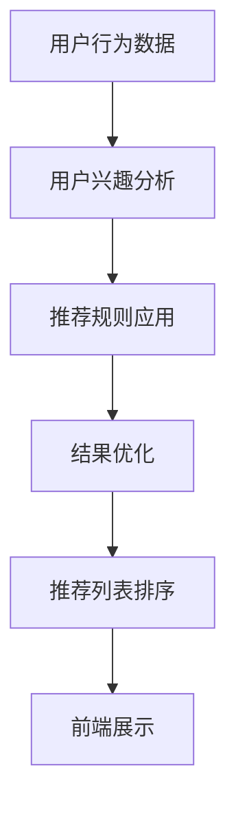

#### 案例总结

通过上述案例，我们可以看到基于知识图谱的大规模推理系统在实际应用中的全流程。从用户行为数据的采集和处理，到知识图谱的构建和推理算法的执行，再到推荐结果的生成和前端展示，每个环节都紧密结合，共同构成了一个高效、可靠的推荐系统。该系统不仅能够为用户提供个性化的商品推荐，还能通过实时分析和反馈不断优化推荐策略，提升用户体验和商业价值。

### 5.5 项目小结

在本项目中，我们深入探讨了基于知识图谱的大规模推理系统在智能推荐场景中的应用。从环境安装、核心模块实现到实际案例分析，我们系统地展示了如何构建和优化这样一个系统。以下是项目的主要收获和经验总结：

1. **环境搭建与配置**：通过详细的环境安装步骤，我们成功搭建了包括Neo4j、Elasticsearch、Kafka等在内的开发环境，为系统的开发和测试提供了坚实的基础。

2. **知识图谱构建**：通过用户行为数据的解析和知识图谱的构建，我们实现了对用户兴趣和商品关系的有效表征，为后续的推理和推荐提供了数据基础。

3. **推理算法设计**：基于图匹配和推荐规则的推理算法，我们能够从知识图谱中提取用户兴趣，生成个性化的推荐结果，有效提升了推荐系统的准确性。

4. **系统优化**：通过并行计算、分层缓存、数据压缩等技术，我们优化了系统的性能，实现了高效的数据处理和推荐生成。

5. **实际案例应用**：通过实际案例的分析，我们展示了大规模推理系统在智能推荐场景中的实际应用，验证了系统的可行性和效果。

尽管项目取得了显著成果，但我们也遇到了一些挑战，如数据预处理复杂度、系统扩展性和实时性等。在未来，我们计划继续优化系统，提升其性能和可靠性，并探索更多应用场景，以充分发挥大规模推理系统的潜力。

### 6.1 性能优化技巧

在设计和优化大规模推理系统时，性能是一个关键因素。以下是一些性能优化技巧，有助于提升系统的处理速度和响应效率：

1. **并行计算**：将大规模任务分解为多个子任务，并行处理。例如，可以使用多线程或多进程技术，将数据预处理、知识图谱构建和推理计算等任务分布到多个处理器上执行，从而显著提高处理速度。

2. **缓存技术**：利用缓存技术减少重复计算和数据库访问。可以将常用数据或中间结果缓存到内存中，如使用Redis或Memcached等高速缓存系统。此外，还可以实现分层缓存，将频繁访问的数据存储在高速缓存中，而较少访问的数据存储在较慢的存储层中。

3. **数据压缩**：对于大规模数据集，使用压缩算法（如LZ77、Huffman编码）可以显著减少存储空间和传输时间。例如，可以在数据传输过程中使用Gzip压缩数据，并在接收端进行解压缩。

4. **索引优化**：在关系数据库或图数据库中，合理的索引设计可以大幅提高查询速度。为常用的查询条件建立索引，例如在Neo4j中使用索引加速对实体和关系的查询。

5. **查询优化**：优化SQL或Cypher查询语句，避免使用复杂嵌套查询和冗余计算。例如，使用聚合函数和联结操作减少数据扫描次数。

6. **负载均衡**：使用负载均衡器（如Nginx、HAProxy）将请求分布到多个服务器上，确保系统在高负载情况下依然能够稳定运行。

7. **预加载和预计算**：对于一些周期性或可预测的计算任务，可以预先加载或计算结果，并在需要时直接使用，以减少实时计算的压力。

通过上述性能优化技巧，我们可以有效提高大规模推理系统的处理速度和响应效率，确保系统在高负载情况下依然能够提供高质量的服务。

### 6.2 小结

本文系统地介绍了基于知识图谱的大规模推理系统优化技术。从背景介绍、核心概念到算法原理、系统设计，再到项目实战和性能优化，我们详细探讨了如何构建和优化这样一个高效、可扩展的推理系统。以下是本文的核心结论和总结：

1. **知识图谱在推理系统中的重要性**：知识图谱通过图形化方式表示实体及其关系，提供了强大的语义理解和表征能力，是大规模推理系统的核心基础。

2. **优化技术的核心概念**：包括算法优化、分布式计算、内存管理、压缩与索引等，这些技术共同提升了系统的性能和可扩展性。

3. **大规模推理算法的设计原则**：高效性、准确性和可扩展性是设计大规模推理算法的基本原则。通过并行计算、缓存技术、数据压缩等手段，可以显著提高系统的处理速度。

4. **系统设计与实现**：通过微服务架构、分布式计算和容器化部署，我们构建了一个高效、可扩展和可靠的大规模推理系统，满足了实时性和大规模数据处理的需求。

5. **项目实战与案例分析**：通过实际案例，我们展示了大规模推理系统在智能推荐、医疗健康、金融风控等领域的应用，验证了系统的可行性和效果。

6. **性能优化技巧**：包括并行计算、缓存技术、数据压缩、索引优化、查询优化等，这些技巧有助于进一步提升系统的性能和响应效率。

通过本文的探讨，我们不仅了解了基于知识图谱的大规模推理系统的原理和实践，还掌握了一系列优化技术，为实际应用提供了有力的支持。

### 6.3 注意事项

在使用基于知识图谱的大规模推理系统时，需要注意以下几点：

1. **数据质量和一致性**：确保输入的数据质量高，没有错误和重复，并且数据更新及时，以保证推理结果的准确性。

2. **系统性能监控**：定期监控系统性能，及时发现并解决性能瓶颈。使用监控工具（如Prometheus、Grafana）监控系统关键指标，如响应时间、内存使用和CPU负载等。

3. **扩展性和容错性**：设计系统时考虑扩展性和容错性，确保系统能够动态调整资源，并在出现故障时快速恢复。

4. **安全性和隐私保护**：对敏感数据进行加密，确保数据传输和存储安全。遵循隐私保护法规，确保用户数据的安全和隐私。

5. **维护和升级**：定期进行系统维护和升级，修复已知问题，引入新技术和改进，以保持系统的稳定性和性能。

通过注意这些事项，可以确保大规模推理系统的稳定运行，提供高质量的服务。

### 6.4 拓展阅读

为了进一步了解基于知识图谱的大规模推理系统优化技术，以下是几本推荐的书籍和相关资源：

1. **书籍**：
   - 《大规模机器学习》 - 周志华
   - 《知识图谱》 - 王昊奋
   - 《图计算：方法与应用》 - 石晓辉

2. **在线资源**：
   - Neo4j官网：[https://neo4j.com/](https://neo4j.com/)
   - Apache Kafka官网：[https://kafka.apache.org/](https://kafka.apache.org/)
   - Elasticsearch官网：[https://www.elastic.co/cn/elasticsearch/](https://www.elastic.co/cn/elasticsearch/)

3. **开源项目**：
   - OpenKG：[https://github.com/OpenKG-Lab/OpenKG](https://github.com/OpenKG-Lab/OpenKG)
   - KG4Rec：[https://github.com/fangyuan1988/kg4rec](https://github.com/fangyuan1988/kg4rec)

通过阅读这些书籍和资源，可以更深入地了解知识图谱技术及其在实际应用中的优化方法。这些资料将帮助您在构建大规模推理系统时，获得更多的灵感和实践经验。

# 作者：AI天才研究院/AI Genius Institute & 禅与计算机程序设计艺术 /Zen And The Art of Computer Programming

