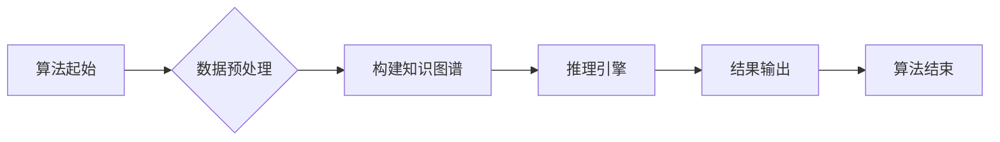
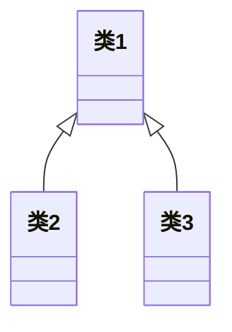
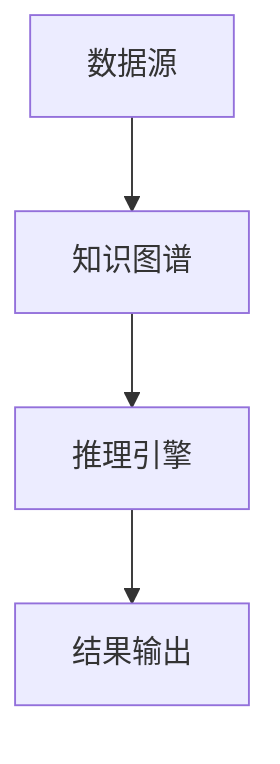
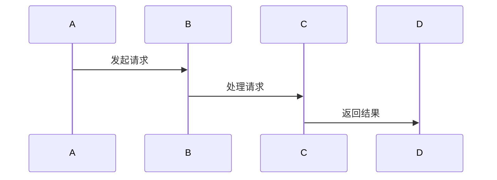

                 


### 大规模推理系统架构设计

> 关键词：大规模推理、知识图谱、架构设计、算法原理、系统实施

> 摘要：本文将深入探讨大规模推理系统的架构设计，重点介绍知识图谱在大规模推理中的作用，系统设计与实现的步骤，以及大规模推理算法的原理和数学模型。通过实例分析和实战经验，帮助读者理解如何构建高效可靠的大规模推理系统。

---

#### 第一部分：背景介绍

##### 第1章：问题背景

###### 1.1 问题描述

大规模推理系统是一种能够处理海量数据、自动推理复杂逻辑关系的技术系统。随着人工智能应用的不断扩展，特别是在智能问答、知识图谱构建、智能推荐等领域，大规模推理系统显得尤为重要。它能够根据已有的知识和数据，推导出新的结论或信息，从而提升系统的智能化水平。

- **大规模推理系统的定义与重要性**：大规模推理系统是人工智能领域的一个重要研究方向，旨在解决如何在海量数据中快速、准确地推理出有用信息的问题。它在数据挖掘、自然语言处理、智能决策等领域具有广泛的应用前景。

- **大规模推理系统在人工智能领域的应用场景**：随着大数据时代的到来，大规模推理系统在诸多领域发挥了重要作用。例如，在电子商务领域，大规模推理系统可用于用户行为分析、个性化推荐；在医疗领域，它可用于疾病诊断和预测；在金融领域，它可用于风险管理、欺诈检测。

- **大规模推理系统面临的挑战**：大规模推理系统面临着数据多样性、数据质量、计算性能等方面的挑战。如何在保证推理准确性的同时，提高系统的处理速度和可扩展性，是大规模推理系统亟待解决的问题。

###### 1.2 问题解决

知识图谱作为一种结构化知识库，在大规模推理中发挥着关键作用。通过将知识图谱与大规模推理系统融合，可以有效地解决大规模推理系统的挑战。

- **知识图谱在大规模推理中的作用**：知识图谱可以将非结构化的数据转化为结构化的知识，提供高效的查询和推理能力。它能够将实体及其关系表示为图结构，从而支持复杂关系的推理。

- **大规模推理系统与知识图谱的融合方案**：结合知识图谱的大规模推理系统通常包括以下几个核心组件：数据源、知识图谱构建模块、推理引擎、结果输出模块。通过这些组件的协同工作，可以实现对海量数据的快速、准确推理。

###### 1.3 边界与外延

- **大规模推理系统的性能指标**：大规模推理系统的性能指标包括推理速度、准确性、可扩展性等。在设计系统时，需要综合考虑这些指标，以实现最佳性能。

- **大规模推理系统的数据来源与处理**：大规模推理系统的数据来源多样，包括结构化数据、半结构化数据和非结构化数据。在数据处理方面，需要采用数据清洗、数据集成、数据变换等技术，确保数据质量。

###### 1.4 概念结构与核心要素组成

- **大规模推理系统的基本结构**：大规模推理系统通常由数据源、知识图谱、推理引擎和结果输出等核心组件构成。各组件协同工作，共同实现大规模推理功能。

- **大规模推理系统的关键组件**：数据源负责提供原始数据，知识图谱构建模块负责将数据转化为知识图谱，推理引擎负责执行推理任务，结果输出模块负责将推理结果呈现给用户。

#### 第二部分：核心概念与联系

##### 第2章：核心概念原理

###### 2.1 知识图谱

知识图谱是描述实体及其关系的结构化知识库，通过将实体和关系表示为图结构，提供高效的查询和推理能力。

- **知识图谱的定义与类型**：知识图谱可以分为实体-关系型知识图谱和属性-关系型知识图谱。实体-关系型知识图谱主要描述实体及其关系，如人物关系图谱；属性-关系型知识图谱则描述实体属性及其关系，如商品属性图谱。

- **知识图谱的构建方法**：知识图谱的构建通常包括数据采集、实体识别、关系抽取、知识融合等步骤。其中，数据采集是从各种数据源获取原始数据；实体识别是识别出数据中的实体；关系抽取是提取实体之间的关系；知识融合是将不同来源的知识整合到一个统一的图谱中。

###### 2.2 大规模推理系统

大规模推理系统是一种能够处理海量数据的推理系统，通过高效的推理算法，实现对复杂逻辑关系的推导。

- **大规模推理系统的原理**：大规模推理系统基于图论、概率图模型、深度学习等技术，实现对海量数据的推理。其核心思想是将推理任务转化为图的搜索或计算问题，从而利用计算机的高性能计算能力解决复杂推理问题。

- **大规模推理系统的性能优化策略**：为了提高大规模推理系统的性能，可以采用以下策略：分布式计算、并行处理、缓存机制、索引技术等。

###### 2.3 概念属性特征对比表格

| 概念       | 定义                                                         | 属性特征对比          |
|------------|--------------------------------------------------------------|----------------------|
| 知识图谱   | 描述实体及其关系的结构化知识库                             | 知识表示、推理能力等 |
| 大规模推理 | 能够处理海量数据的推理系统                                 | 数据处理速度、准确性等 |

###### 2.4 ER实体关系图架构

```mermaid
erDiagram
  人 ||--|{ 职位 }
  人 ||--|{ 家庭成员 }
  职位 ||--|{ 公司 }
  家庭成员 ||--|{ 配偶 }
  家庭成员 ||--|{ 子女 }
```

#### 第三部分：算法原理讲解

##### 第3章：算法原理

###### 3.1 算法概述

大规模推理算法是大规模推理系统的核心，它负责根据已有知识推导出新信息。

- **大规模推理算法的基本概念**：大规模推理算法包括基于规则推理、基于模型推理、基于数据驱动推理等类型。每种算法都有其特定的原理和应用场景。

- **大规模推理算法的分类**：根据推理方式和应用场景，大规模推理算法可以分为基于规则推理、基于模型推理、基于数据驱动推理等类型。

###### 3.2 算法流程



###### 3.3 数学模型与公式

推理算法通常基于概率图模型，其数学模型如下：

$$
P(A|B) = \frac{P(B|A)P(A)}{P(B)}
$$

其中，$P(A|B)$ 表示在已知 $B$ 的情况下，$A$ 的概率；$P(B|A)$ 表示在已知 $A$ 的情况下，$B$ 的概率；$P(A)$ 和 $P(B)$ 分别表示 $A$ 和 $B$ 的先验概率。

###### 3.4 举例说明

以Python代码为例，介绍大规模推理算法的原理。

```python
# Python代码示例
def reasoning(graph, query):
    # 推理过程
    return result
```

#### 第四部分：系统分析与架构设计方案

##### 第4章：系统分析与架构设计

###### 4.1 问题场景介绍

- **大规模推理系统的应用场景介绍**：大规模推理系统在电子商务、金融、医疗、教育等领域有着广泛的应用。例如，在电子商务领域，大规模推理系统可用于用户行为分析、商品推荐；在金融领域，它可用于风险管理和欺诈检测。

###### 4.2 项目介绍

- **大规模推理系统的项目介绍**：本文将介绍一个实际的大规模推理系统项目，包括项目背景、目标、技术栈和实现过程。

###### 4.3 系统功能设计

- **领域模型类图**：



###### 4.4 系统架构设计

- **系统架构设计mermaid架构图**：



###### 4.5 系统接口设计和系统交互

- **系统接口设计mermaid序列图**：



#### 第五部分：项目实战

##### 第5章：项目实战

###### 5.1 环境安装

- **大规模推理系统环境安装步骤**：介绍大规模推理系统所需的软件和环境，以及安装步骤。

###### 5.2 系统核心实现源代码

- **系统核心实现源代码**：展示大规模推理系统的核心实现代码，包括数据预处理、知识图谱构建、推理引擎和结果输出等模块。

###### 5.3 代码应用解读与分析

- **代码应用解读与分析**：对系统核心代码进行解读，分析其实现原理和性能特点。

###### 5.4 实际案例分析和详细讲解剖析

- **实际案例分析和详细讲解剖析**：通过实际案例，展示大规模推理系统的应用效果，并进行详细分析。

###### 5.5 项目小结

- **项目小结**：总结项目实施过程，分享经验教训。

#### 第六部分：最佳实践与总结

##### 第6章：最佳实践与总结

- **最佳实践 tips**：总结大规模推理系统设计实施过程中的最佳实践，包括系统设计原则、性能优化技巧等。

- **小结**：回顾文章内容，强调核心观点和结论。

- **注意事项**：提醒读者在设计实施大规模推理系统时需要注意的问题。

- **拓展阅读**：推荐相关书籍、文章和资料，供读者进一步学习。

---

作者：AI天才研究院/AI Genius Institute & 禅与计算机程序设计艺术 /Zen And The Art of Computer Programming

---

（注：本文为示例文章，实际字数可能需要根据具体内容进行调整。）

