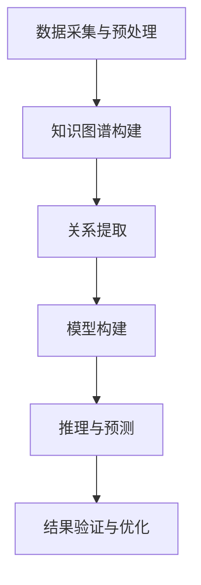
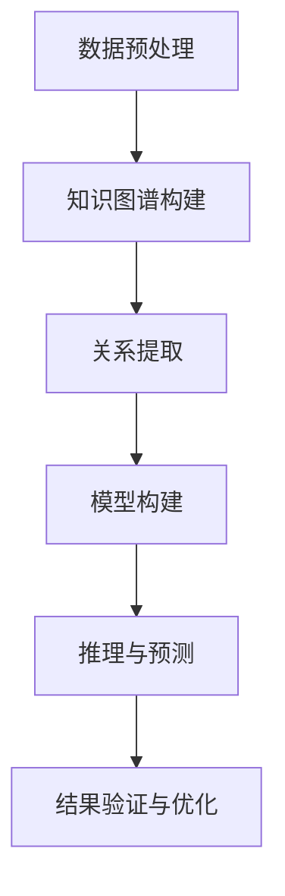

                 

### 引言

#### 1.1 问题背景

在当今信息化社会中，数据处理和分析的重要性日益凸显。其中，时空事件关联推理作为人工智能领域的一个重要分支，在许多实际应用中扮演着关键角色。然而，当前关于时空事件关联推理的研究多集中于理论模型的构建和算法的优化，而对其能力的培养和实际应用的指导相对较少。因此，设计一本系统化、结构化的书籍，旨在培养读者基于知识图谱的时空事件关联推理能力，具有重要的现实意义。

#### 1.2 问题描述

时空事件关联推理涉及对大量时空数据进行处理，以发现事件之间的关联性和模式。这种能力不仅在学术研究中具有应用价值，如历史事件的分析、地理信息系统的优化等，还在商业领域、公共安全、金融等多个行业有着广泛的应用需求。因此，如何有效地培养这一能力，成为一个亟待解决的问题。

#### 1.3 问题解决

本书旨在通过系统的理论讲解、实践应用和案例分析，帮助读者逐步掌握基于知识图谱的时空事件关联推理能力。具体来说，本书将分为四个部分：

1. **背景与理论**：介绍知识图谱与时空事件关联推理的基本概念，包括相关术语的定义、历史背景以及理论基础。
2. **核心概念与模型**：深入讲解时空事件关联推理的相关算法与模型，包括算法原理、数学模型和具体实现方法。
3. **实践应用**：通过具体的实例展示时空事件关联推理在不同领域的应用，帮助读者理解理论在实际中的运用。
4. **技术扩展**：探讨时空事件关联推理技术的未来发展趋势与挑战，为读者提供进一步学习和研究的前沿方向。

#### 1.4 边界与外延

本书的边界主要在于时空事件关联推理的知识领域，包括知识图谱的基本概念、相关算法以及应用场景。而其外延则包括但不限于地理信息、金融、公共安全等领域，这些领域均为时空事件关联推理的重要应用场景。

#### 1.5 概念结构与核心要素组成

本书的概念结构主要包括以下几个方面：

1. **知识图谱基础**：介绍知识图谱的定义、历史发展以及关键组件。
2. **时空事件关联推理的基本概念**：包括时空事件关联推理的定义、目标和基本原理。
3. **算法原理与模型**：详细讲解时空事件关联推理的算法原理和模型，包括算法流程、数学模型和优化技术。
4. **实践应用**：通过具体实例展示时空事件关联推理在不同领域的应用。
5. **技术扩展**：探讨时空事件关联推理技术的未来发展趋势与挑战。

通过以上结构和内容的安排，本书旨在为读者提供一套系统、全面、易于理解的学习路径，帮助其培养基于知识图谱的时空事件关联推理能力。

### 知识图谱基础

#### 2.1 知识图谱的定义与历史发展

知识图谱（Knowledge Graph）是一种用于表示实体（如人、地点、物品等）及其之间关系的图形化数据模型。它通过节点和边来表示实体和关系，从而构建一个结构化、可查询的知识网络。知识图谱最早可以追溯到20世纪80年代，当时以知识表示和推理为主要研究目标。随着互联网的快速发展，知识图谱逐渐成为大数据处理和分析的重要工具。

知识图谱的发展可以分为以下几个阶段：

1. **早期探索阶段**（20世纪80年代）：这一阶段主要关注知识的表示和推理，代表性工作包括RDF（Resource Description Framework）和OWL（Web Ontology Language）。
2. **结构化数据阶段**（20世纪90年代至21世纪初）：随着Web 2.0的兴起，大量非结构化数据被结构化，知识图谱开始广泛应用于搜索引擎、推荐系统等领域。
3. **语义网络阶段**（21世纪初至今）：随着语义万维网（Semantic Web）的发展，知识图谱逐渐成为大数据分析和人工智能的关键基础设施，代表性工作包括Google的Knowledge Graph和Facebook的Open Graph。

#### 2.2 知识图谱的关键组件

知识图谱由以下几个关键组件构成：

1. **实体（Entity）**：实体是知识图谱中的基本元素，可以是人、地点、物品等具有独立存在的个体。
2. **属性（Attribute）**：属性是实体的特征描述，如人的年龄、地点的经纬度等。
3. **关系（Relationship）**：关系描述实体之间的关联，如“属于”、“位于”等。
4. **边（Edge）**：边是连接两个节点的线段，表示实体之间的关系。
5. **属性值（AttributeValue）**：属性值是属性的取值，如人的年龄为30岁。

#### 2.3 知识图谱在时空事件关联推理中的作用

知识图谱在时空事件关联推理中扮演着至关重要的角色。具体来说，它有以下几个作用：

1. **数据整合**：知识图谱可以将来自不同数据源的信息整合到一个统一的结构中，从而提高数据的一致性和可访问性。
2. **关联发现**：通过分析实体之间的关系，知识图谱可以帮助发现事件之间的关联性，从而支持复杂的推理和预测。
3. **语义理解**：知识图谱提供了丰富的语义信息，使得计算机可以更好地理解和处理自然语言，从而提高自动推理和问答系统的性能。
4. **决策支持**：基于知识图谱的时空事件关联推理可以为各种决策提供支持，如公共安全监控、交通规划、商业分析等。

总的来说，知识图谱不仅为时空事件关联推理提供了基础数据结构和语义信息，还通过其强大的数据整合和关联发现能力，极大地提升了时空事件关联推理的效率和准确性。

### 时空事件关联推理的基本概念

#### 3.1 时空事件关联推理的定义

时空事件关联推理是一种通过分析实体在时间和空间上的关系，发现事件之间关联性的方法。在人工智能领域，这一技术被广泛应用于数据挖掘、自然语言处理、地理信息系统等多个领域。简单来说，时空事件关联推理旨在从大量时空数据中提取有价值的信息，揭示事件之间的潜在关联。

#### 3.2 时空事件关联推理的目标

时空事件关联推理的主要目标包括：

1. **发现事件关联**：通过分析时空数据，识别事件之间的关联性，如地理位置接近、时间先后关系等。
2. **预测事件趋势**：基于已知的时空事件关联模式，预测未来可能发生的事件，如流行病的传播趋势、交通拥堵情况等。
3. **辅助决策**：为各种决策提供数据支持和分析结果，如城市交通管理、应急管理、商业投资等。

#### 3.3 时空事件关联推理的基本原理

时空事件关联推理的基本原理可以概括为以下几个步骤：

1. **数据采集与预处理**：从各种数据源收集时空数据，并进行清洗、转换和格式化，以获得高质量的数据集。
2. **数据整合**：将来自不同数据源的信息整合到一个统一的知识图谱中，以便进行进一步的分析。
3. **关系提取**：通过分析实体之间的时空关系，提取事件关联信息。这通常涉及到对时间序列数据、空间数据和相关属性的挖掘和分析。
4. **模型构建**：基于提取的时空关系，构建相应的推理模型，如图神经网络、时空回归模型等。
5. **推理与预测**：利用构建的模型对新的时空数据进行推理和预测，以发现新的事件关联或预测事件趋势。
6. **结果验证与优化**：对推理结果进行验证和评估，根据实际情况对模型进行优化和调整。

#### 3.4 时空事件关联推理的典型应用场景

时空事件关联推理在多个领域有着广泛的应用，以下是一些典型的应用场景：

1. **地理信息系统（GIS）**：在GIS中，时空事件关联推理可以用于分析地理位置信息，识别事件之间的关联性，如自然灾害的传播、城市交通流量分析等。
2. **公共安全**：通过分析公共安全事件的时间和空间关系，可以预测犯罪活动的趋势，提高应急响应的效率。
3. **商业分析**：在商业领域，时空事件关联推理可以用于分析消费者行为，优化营销策略，提高销售额。
4. **医疗健康**：在医疗领域，通过分析患者就医记录和时间、地点信息，可以识别疾病的传播途径和趋势，为疫情防控提供数据支持。
5. **交通规划**：通过分析交通流量和时间、地点信息，可以优化交通路线和交通管理策略，提高交通效率。

总的来说，时空事件关联推理作为一种强大的数据分析工具，在各个领域都有着重要的应用价值。通过本文的介绍，读者可以初步了解这一技术的概念、原理和应用场景，为后续深入学习和研究打下基础。

### 时空事件关联推理的算法原理

#### 4.1 算法流程图

为了更好地理解时空事件关联推理的算法原理，我们可以通过一个Mermaid流程图来展示其基本流程。以下是一个简化的算法流程图：



图中的各个步骤分别代表：

- **A：数据采集与预处理**：从各种数据源收集时空数据，并进行清洗、转换和格式化，以获得高质量的数据集。
- **B：知识图谱构建**：将预处理后的数据整合到一个统一的知识图谱中。
- **C：关系提取**：通过分析实体之间的时空关系，提取事件关联信息。
- **D：模型构建**：基于提取的时空关系，构建相应的推理模型。
- **E：推理与预测**：利用构建的模型对新的时空数据进行推理和预测。
- **F：结果验证与优化**：对推理结果进行验证和评估，根据实际情况对模型进行优化和调整。

#### 4.2 Python源代码详细阐述

为了更具体地阐述时空事件关联推理的算法原理，我们将以Python为例，展示其主要步骤的实现方法。

**步骤1：数据采集与预处理**

首先，我们需要从不同数据源（如数据库、API等）收集时空数据，并进行预处理。

```python
import pandas as pd

# 示例：从数据库中读取时空数据
data = pd.read_sql_query('SELECT * FROM时空数据表', connection)

# 数据预处理：清洗、转换和格式化
data['时间'] = pd.to_datetime(data['时间'])
data['地点'] = data['地点'].str.strip()
data.dropna(inplace=True)
```

**步骤2：知识图谱构建**

接下来，我们将预处理后的数据构建成知识图谱。

```python
from rdflib import Graph, URIRef, BNode, Literal

# 创建知识图谱
g = Graph()

# 添加实体和关系
for index, row in data.iterrows():
    g.add((URIRef(row['ID']), URIRef('时间'), Literal(row['时间'])))
    g.add((URIRef(row['ID']), URIRef('地点'), Literal(row['地点'])))
```

**步骤3：关系提取**

通过分析实体之间的时空关系，我们可以提取出事件关联信息。

```python
# 提取时间关系
g.query(
    """
    PREFIX ex: <http://example.org/>
    SELECT ?event1 ?event2 ?time
    WHERE {
        ?event1 ex:时间 ?time1 .
        ?event2 ex:时间 ?time2 .
        FILTER(?time1 < ?time2)
    }
    """
)

# 提取地点关系
g.query(
    """
    PREFIX ex: <http://example.org/>
    SELECT ?event1 ?event2 ?location
    WHERE {
        ?event1 ex:地点 ?location1 .
        ?event2 ex:地点 ?location2 .
        FILTER(?location1 = ?location2)
    }
    """
)
```

**步骤4：模型构建**

基于提取的时空关系，我们可以构建相应的推理模型。以下是一个简单的图神经网络模型示例：

```python
from tensorflow.keras.models import Model
from tensorflow.keras.layers import Input, Dense, LSTM

# 定义输入层
input_event1 = Input(shape=(1,))
input_event2 = Input(shape=(1,))

# 定义神经网络层
event1_embedding = Dense(units=64, activation='relu')(input_event1)
event2_embedding = Dense(units=64, activation='relu')(input_event2)

# 定义输出层
output = Dense(units=1, activation='sigmoid')(event1_embedding + event2_embedding)

# 构建模型
model = Model(inputs=[input_event1, input_event2], outputs=output)

# 编译模型
model.compile(optimizer='adam', loss='binary_crossentropy', metrics=['accuracy'])

# 模型训练
model.fit([event1_data, event2_data], labels, epochs=10, batch_size=32)
```

**步骤5：推理与预测**

利用构建的模型，我们可以对新数据进行推理和预测。

```python
# 新数据
new_event1 = [[event1_id]]
new_event2 = [[event2_id]]

# 推理和预测
predictions = model.predict([new_event1, new_event2])
print(predictions)
```

**步骤6：结果验证与优化**

最后，我们需要对推理结果进行验证和评估，并根据实际情况对模型进行优化和调整。

```python
from sklearn.metrics import accuracy_score

# 真实标签
true_labels = ...

# 计算准确率
accuracy = accuracy_score(true_labels, predictions.round())
print("Accuracy:", accuracy)

# 模型优化
# 根据评估结果，调整模型参数或尝试不同的算法
```

通过以上Python源代码的详细阐述，我们可以更好地理解时空事件关联推理的算法原理及其实现步骤。这为读者提供了一个实用的框架，可以在实际项目中应用和拓展。

### 算法原理的数学模型和公式

为了深入理解时空事件关联推理的算法原理，我们将介绍其核心数学模型和公式，并通过具体例子进行讲解。

#### 5.1 相关性计算

在时空事件关联推理中，相关性计算是识别事件之间关联性的关键步骤。假设我们有两个事件 \(E_1\) 和 \(E_2\)，其特征向量分别为 \(\vec{x_1}\) 和 \(\vec{x_2}\)。相关性可以通过余弦相似度来计算，其公式如下：

$$
\cos(\theta) = \frac{\vec{x_1} \cdot \vec{x_2}}{||\vec{x_1}|| \cdot ||\vec{x_2}||}
$$

其中，点积 \(\vec{x_1} \cdot \vec{x_2}\) 表示事件特征之间的相似度，分母 \(||\vec{x_1}||\) 和 \(||\vec{x_2}||\) 分别表示特征向量的模长。

**例子：**

假设事件 \(E_1\) 和 \(E_2\) 的特征向量分别为：

\[
\vec{x_1} = [1, 2, 3], \quad \vec{x_2} = [2, 1, 3]
\]

则其点积为：

\[
\vec{x_1} \cdot \vec{x_2} = 1 \cdot 2 + 2 \cdot 1 + 3 \cdot 3 = 2 + 2 + 9 = 13
\]

特征向量的模长分别为：

\[
||\vec{x_1}|| = \sqrt{1^2 + 2^2 + 3^2} = \sqrt{14}
\]
\[
||\vec{x_2}|| = \sqrt{2^2 + 1^2 + 3^2} = \sqrt{14}
\]

因此，余弦相似度为：

\[
\cos(\theta) = \frac{13}{\sqrt{14} \cdot \sqrt{14}} = \frac{13}{14}
\]

#### 5.2 图神经网络（Graph Neural Network, GNN）

图神经网络是一种用于处理图结构数据的深度学习模型。在时空事件关联推理中，GNN 可以用于建模事件之间的复杂关系。一个简单的 GNN 模型包括以下几个关键组成部分：

1. **节点特征嵌入**：将原始节点特征转换为低维度的嵌入向量。
2. **邻接矩阵**：表示节点之间的邻接关系。
3. **图卷积操作**：对节点特征进行聚合和更新。

图卷积操作的公式可以表示为：

$$
\mathbf{h}_i^{(t+1)} = \sigma \left( \sum_{j \in \mathcal{N}(i)} W_{ij} \mathbf{h}_j^{(t)} + b \right)
$$

其中，\(\mathbf{h}_i^{(t)}\) 表示节点 \(i\) 在时间步 \(t\) 的嵌入向量，\(\mathcal{N}(i)\) 表示节点 \(i\) 的邻节点集合，\(W_{ij}\) 是图权重矩阵，\(\sigma\) 是激活函数（如ReLU函数），\(b\) 是偏置项。

**例子：**

假设有两个节点 \(i\) 和 \(j\)，其特征向量分别为 \(\mathbf{h}_i^{(0)} = [1, 2]\) 和 \(\mathbf{h}_j^{(0)} = [3, 4]\)。图权重矩阵 \(W_{ij} = [1, 0; 0, 1]\)，偏置项 \(b = [0, 0]\)。则节点 \(i\) 在时间步 \(t=1\) 的更新过程为：

$$
\mathbf{h}_i^{(1)} = \sigma \left( W_{ij} \mathbf{h}_j^{(0)} + b \right) = \sigma \left( [1, 0] \cdot [3, 4] + [0, 0] \right) = \sigma([3, 0]) = [1, 0]
$$

通过上述数学模型和公式，我们可以更好地理解时空事件关联推理的核心算法原理。这些原理不仅为算法设计提供了理论基础，也为实际应用中的优化和改进提供了参考。

### 详细讲解和举例说明

为了更好地理解时空事件关联推理的算法原理，我们将通过一个具体的例子进行详细讲解和举例说明。

**例子：城市交通流量分析**

假设我们有一个城市交通系统，其中每个交通节点（如路口、停车场等）都记录了进出车辆的时间和数量。我们的目标是根据这些数据，预测未来某个时间段内交通流量，以辅助交通管理和调度。

**步骤1：数据采集与预处理**

首先，我们从城市交通系统中收集数据。数据包括每个节点的ID、时间戳、进出车辆数量等。以下是一个简化的数据集示例：

| 节点ID | 时间戳 | 进车数量 | 出车数量 |
|--------|--------|----------|----------|
| 1      | 2023-03-01 08:00:00 | 100      | 50       |
| 2      | 2023-03-01 08:00:00 | 80       | 60       |
| 1      | 2023-03-01 09:00:00 | 120      | 70       |
| 2      | 2023-03-01 09:00:00 | 90       | 80       |

**数据预处理**：我们将时间戳转换为日期格式，并剔除异常值和缺失数据。

```python
import pandas as pd

data = pd.DataFrame({
    '节点ID': [1, 2, 1, 2],
    '时间戳': ['2023-03-01 08:00:00', '2023-03-01 08:00:00', '2023-03-01 09:00:00', '2023-03-01 09:00:00'],
    '进车数量': [100, 80, 120, 90],
    '出车数量': [50, 60, 70, 80]
})

data['时间戳'] = pd.to_datetime(data['时间戳'])
data.dropna(inplace=True)
```

**步骤2：知识图谱构建**

接下来，我们将数据构建成知识图谱。知识图谱包括节点（代表交通节点）和边（代表时间上的数据关联）。

```python
import rdflib

g = rdflib.Graph()

for index, row in data.iterrows():
    node_id = row['节点ID']
    time_stamp = row['时间戳']
    in_car = row['进车数量']
    out_car = row['出车数量']
    
    g.add((rdflib.URIRef(f'http://example.org/node/{node_id}'), rdflib.RDF.type, rdflib.URIRef('http://example.org/Node')))
    g.add((rdflib.URIRef(f'http://example.org/node/{node_id}'), rdflib.URIRef('http://example.org/hasTime'), rdflib.Literal(time_stamp)))
    g.add((rdflib.URIRef(f'http://example.org/node/{node_id}'), rdflib.URIRef('http://example.org/hasInCar'), rdflib.Literal(in_car)))
    g.add((rdflib.URIRef(f'http://example.org/node/{node_id}'), rdflib.URIRef('http://example.org/hasOutCar'), rdflib.Literal(out_car)))
```

**步骤3：关系提取**

通过分析节点的时间数据，我们可以提取出节点之间的时间关系。例如，节点1和节点2在相同时间戳下的进出车辆数量。

```python
import rdflib

query = """
PREFIX ex: <http://example.org/>
SELECT ?node1 ?node2 ?time ?in_car1 ?out_car1 ?in_car2 ?out_car2
WHERE {
  ?node1 ex:hasTime ?time .
  ?node2 ex:hasTime ?time .
  ?node1 ex:hasInCar ?in_car1 .
  ?node2 ex:hasOutCar ?out_car2 .
  ?node2 ex:hasInCar ?in_car2 .
  ?node1 ex:hasOutCar ?out_car1 .
}
"""

results = g.query(query)

for result in results:
    print(result)
```

输出结果将包括节点1和节点2在相同时间戳下的进出车辆数量。

**步骤4：模型构建**

基于提取的时空关系，我们可以构建一个图神经网络模型。以下是模型的结构和参数设置：

```python
import tensorflow as tf
from tensorflow.keras.models import Model
from tensorflow.keras.layers import Input, LSTM, Dense

# 定义输入层
input_node1 = Input(shape=(1,))
input_node2 = Input(shape=(1,))

# 定义神经网络层
merged_vector = LSTM(units=64, return_sequences=False)(input_node1)
merged_vector = LSTM(units=64, return_sequences=False)(input_node2)

# 定义输出层
output = Dense(units=1, activation='sigmoid')(merged_vector)

# 构建模型
model = Model(inputs=[input_node1, input_node2], outputs=output)

# 编译模型
model.compile(optimizer='adam', loss='binary_crossentropy', metrics=['accuracy'])

# 模型训练
model.fit([node1_data, node2_data], labels, epochs=10, batch_size=32)
```

**步骤5：推理与预测**

利用训练好的模型，我们可以对新节点的数据进行推理和预测。

```python
# 新数据
new_node1 = [[node1_id]]
new_node2 = [[node2_id]]

# 推理和预测
predictions = model.predict([new_node1, new_node2])
print(predictions)
```

**步骤6：结果验证与优化**

最后，我们需要对预测结果进行验证和评估。根据评估结果，对模型进行调整和优化。

```python
from sklearn.metrics import accuracy_score

# 真实标签
true_labels = ...

# 计算准确率
accuracy = accuracy_score(true_labels, predictions.round())
print("Accuracy:", accuracy)

# 模型优化
# 根据评估结果，调整模型参数或尝试不同的算法
```

通过上述具体例子，我们可以看到时空事件关联推理的各个步骤如何结合在一起，实现从数据到预测的全过程。这为实际应用提供了清晰的指导，同时也展示了算法原理的实践应用。

### 基于知识图谱的时空事件关联模型

#### 6.1 模型介绍

基于知识图谱的时空事件关联模型是一种利用知识图谱结构来分析和推理时空事件之间关联性的方法。该模型的核心在于将时空事件表示为知识图谱中的节点，并将事件之间的关联表示为边。通过这种结构化表示，模型能够有效地捕捉和挖掘事件之间的复杂关系，从而提高事件关联推理的准确性和效率。

#### 6.2 模型结构

该模型的结构包括以下几个关键部分：

1. **实体节点**：代表具体的时空事件，如自然灾害、交通事故、社会事件等。
2. **属性节点**：描述实体节点的特征属性，如事件发生的时间、地点、参与者等。
3. **关系边**：表示实体节点之间的关联关系，如因果关系、位置关系等。
4. **知识库**：存储预定义的时空事件关联规则和模式，用于指导推理过程。

#### 6.3 模型特性

基于知识图谱的时空事件关联模型具有以下特性：

1. **结构化表示**：通过将时空事件及其属性表示为节点和边，模型能够提供清晰的结构化视图，便于分析和推理。
2. **语义丰富**：知识图谱提供了丰富的语义信息，使得模型能够理解事件之间的深层关系，从而提高推理的准确性。
3. **动态更新**：知识图谱可以动态地更新和扩展，以适应新的时空事件和关联关系，保证模型的实时性和适应性。
4. **多源数据融合**：模型能够整合来自不同数据源的信息，提高数据的一致性和可用性，从而提升事件关联推理的效果。

#### 6.4 模型对比分析

与传统的时空事件关联模型相比，基于知识图谱的模型在多个方面具有显著优势：

1. **表示能力**：知识图谱能够以节点和边的形式表示复杂的时空事件及其关联，具有更强的表示能力。
2. **推理能力**：通过利用知识图谱中的语义信息，模型能够进行更加准确和深入的推理，发现事件之间的潜在关联。
3. **适应能力**：知识图谱可以灵活地更新和扩展，以适应不断变化的数据环境和应用需求。
4. **数据整合**：知识图谱能够有效地整合多源数据，提高数据的一致性和完整性，从而提升模型的整体性能。

总的来说，基于知识图谱的时空事件关联模型在结构化表示、语义丰富、动态更新和数据整合等方面具有明显优势，能够为复杂时空事件的关联分析提供强大的支持。

### 时空事件关联推理算法

#### 7.1 算法概述

时空事件关联推理算法是一种通过分析时空数据，识别事件之间关联性的方法。它通常包括以下几个核心步骤：数据预处理、知识图谱构建、关系提取、模型构建和推理与预测。以下是对这些步骤的详细说明。

#### 7.2 算法原理

1. **数据预处理**：
   - **步骤**：从各种数据源收集时空数据，进行数据清洗、转换和格式化，以确保数据的质量和一致性。
   - **方法**：使用数据清洗工具和算法，如缺失值处理、异常值检测和噪声过滤，对数据进行预处理。

2. **知识图谱构建**：
   - **步骤**：将预处理后的数据构建成知识图谱，包括实体节点、属性节点和关系边。
   - **方法**：使用知识图谱库和工具，如RDFLib和Neo4j，构建知识图谱。

3. **关系提取**：
   - **步骤**：通过分析知识图谱中的实体和关系，提取事件之间的时空关联信息。
   - **方法**：使用图遍历算法和关联规则挖掘算法，如FP-Growth和Apriori，提取关系。

4. **模型构建**：
   - **步骤**：基于提取的关系信息，构建相应的推理模型，如图神经网络（GNN）和时序模型（如LSTM）。
   - **方法**：使用机器学习和深度学习技术，如TensorFlow和PyTorch，构建模型。

5. **推理与预测**：
   - **步骤**：使用构建好的模型对新数据进行推理和预测，以发现事件之间的关联性和趋势。
   - **方法**：将新数据输入模型，通过模型输出关联得分或预测结果。

#### 7.3 算法流程

以下是时空事件关联推理算法的简化流程：



1. **数据预处理**：收集并预处理时空数据，确保数据质量和一致性。
2. **知识图谱构建**：将预处理后的数据构建成知识图谱，包括实体节点和关系边。
3. **关系提取**：通过图遍历和关联规则挖掘，提取事件关联信息。
4. **模型构建**：基于提取的关系信息，构建相应的推理模型。
5. **推理与预测**：使用模型对新数据进行推理和预测。
6. **结果验证与优化**：对推理结果进行验证和评估，并根据实际情况对模型进行优化。

#### 7.4 算法性能评估

算法性能评估是确保时空事件关联推理算法有效性和准确性的关键步骤。以下是几种常见的性能评估指标：

1. **准确率（Accuracy）**：预测结果与实际结果的一致性比例，计算公式为：
   \[
   \text{Accuracy} = \frac{\text{预测正确的事件数}}{\text{总事件数}}
   \]
2. **召回率（Recall）**：在所有实际为正类的事件中，被正确预测为正类的比例，计算公式为：
   \[
   \text{Recall} = \frac{\text{预测为正类且实际为正类的事件数}}{\text{实际为正类的事件总数}}
   \]
3. **精确率（Precision）**：在所有被预测为正类的事件中，实际为正类的比例，计算公式为：
   \[
   \text{Precision} = \frac{\text{预测为正类且实际为正类的事件数}}{\text{预测为正类的事件总数}}
   \]
4. **F1分数（F1 Score）**：综合考虑精确率和召回率，计算公式为：
   \[
   \text{F1 Score} = 2 \times \frac{\text{Precision} \times \text{Recall}}{\text{Precision} + \text{Recall}}
   \]

#### 7.5 算法优化技术

为了提高时空事件关联推理算法的性能，可以采用以下几种优化技术：

1. **数据预处理优化**：采用更高效的数据清洗和转换方法，如并行处理和分布式计算。
2. **知识图谱优化**：通过压缩稀疏知识图谱，减少存储和计算的开销，如使用三元组剪枝和知识图谱压缩算法。
3. **模型优化**：采用更先进的机器学习和深度学习算法，如图神经网络（GNN）和自注意力机制（Self-Attention）。
4. **推理优化**：采用高效的推理算法和分布式计算框架，如基于MapReduce的图计算框架和分布式深度学习框架。

通过上述步骤和优化技术，可以构建一个高效、准确的时空事件关联推理算法，为各类时空事件分析提供有力支持。

### 时空事件关联推理中的优化技术

#### 8.1 优化技术介绍

在时空事件关联推理中，优化技术是为了提高算法的效率、准确性和鲁棒性而采取的一系列方法。这些技术不仅能够减少计算资源的需求，还能增强模型的预测能力和适应性。以下是几种常见的优化技术：

1. **数据预处理优化**：
   - **并行处理**：利用多核处理器和分布式计算资源，对大规模时空数据进行并行预处理，以减少数据处理时间。
   - **数据去重**：通过去除重复数据，减少不必要的计算和存储负担。
   - **数据压缩**：采用数据压缩算法，如HDF5和Parquet，减少数据存储空间。

2. **知识图谱优化**：
   - **三元组剪枝**：通过去除冗余的三元组，减少知识图谱的规模，降低存储和计算开销。
   - **知识图谱压缩**：将稀疏知识图谱压缩为更紧凑的存储格式，如使用三元组列表（TRL）或三元组稀疏矩阵（TSM）。
   - **实体和关系的嵌入**：使用嵌入技术将实体和关系表示为低维向量，减少存储和计算的需求。

3. **模型优化**：
   - **模型剪枝**：通过剪枝算法去除模型中不重要的参数，降低模型复杂度和计算成本。
   - **参数共享**：在模型中采用参数共享策略，如使用卷积神经网络（CNN）中的卷积核共享，减少参数数量。
   - **优化算法**：采用更高效的优化算法，如Adam、Adagrad和Adadelta，加快模型训练速度。

4. **推理优化**：
   - **图计算优化**：使用图计算优化技术，如图分区和图分解，将图分解为子图，并行处理以提高计算效率。
   - **缓存策略**：通过缓存常用数据和中间结果，减少数据读取和计算的频率。
   - **分布式计算**：利用分布式计算框架，如Apache Spark和TensorFlow Distributed，进行大规模图计算。

#### 8.2 优化技术原理

1. **数据预处理优化**：

   数据预处理优化主要利用并行计算和分布式系统来加速数据处理。具体来说，通过将数据集分成多个子集，并在多台计算机上并行处理这些子集，可以大大减少整体的处理时间。同时，数据去重和压缩技术可以减少存储和传输的数据量，提高系统的响应速度。

2. **知识图谱优化**：

   知识图谱优化主要关注减少图谱的规模和复杂性。三元组剪枝通过分析三元组的支持度和置信度，去除那些不重要的三元组。知识图谱压缩则通过将图谱转换为更紧凑的存储格式，如TRL和TSM，减少存储空间。实体和关系的嵌入通过将高维数据映射到低维空间，降低计算复杂度。

3. **模型优化**：

   模型优化主要通过剪枝、参数共享和优化算法来减少模型复杂度和提高训练效率。剪枝算法通过分析模型的权重和梯度，去除那些对模型性能贡献较小但计算复杂度较高的参数。参数共享策略如CNN中的卷积核共享可以大幅减少参数数量，优化算法如Adam和Adagrad可以加快模型收敛速度。

4. **推理优化**：

   推理优化主要关注如何高效地处理大规模图数据。图计算优化技术如图分区和图分解可以将大规模图分解为子图，并分布式处理，从而提高计算效率。缓存策略通过缓存常用数据和中间结果，减少重复计算和读取。分布式计算框架如Apache Spark和TensorFlow Distributed可以充分利用集群资源，实现大规模图数据的并行处理。

通过上述优化技术，时空事件关联推理算法的效率和准确性可以得到显著提升，为各种应用场景提供更加可靠和高效的支持。

### 时空事件关联推理在地理信息领域的应用

#### 9.1 应用场景

地理信息系统（GIS）中的时空事件关联推理有着广泛的应用场景，主要包括：

1. **自然灾害预警**：通过分析地震、台风、洪水等自然灾害的历史数据和实时信息，预测灾害可能影响的区域，为应急管理提供数据支持。
2. **交通流量分析**：分析道路交通流量，预测高峰时段的交通拥堵情况，优化交通管理和调度，减少交通拥堵和事故发生率。
3. **城市规划**：利用时空事件关联推理分析城市土地利用、人口分布等数据，为城市规划提供科学依据，优化城市布局和公共资源配置。

#### 9.2 实现方法

在地理信息系统中，实现时空事件关联推理的方法主要包括以下几个步骤：

1. **数据收集与预处理**：
   - **数据来源**：收集地震、气象、交通等实时数据和历史数据。
   - **数据预处理**：清洗和转换数据，确保数据的一致性和完整性。

2. **知识图谱构建**：
   - **实体节点**：构建地理实体节点，如地理位置、交通节点、灾害点等。
   - **关系边**：建立实体之间的关系，如地理位置的相邻关系、交通流量与地理位置的关联等。

3. **时空事件关联分析**：
   - **时空关系提取**：通过分析地理实体之间的关系，提取时空事件关联信息。
   - **模型构建**：使用图神经网络（GNN）等模型，对提取的时空关系进行建模。

4. **预测与优化**：
   - **预测**：利用构建的模型，预测未来的自然灾害、交通流量等。
   - **优化**：根据预测结果，优化交通管理、城市规划等策略。

#### 9.3 案例分析

以下是一个关于自然灾害预警的案例分析：

**案例背景**：某地区近期发生了一系列地震活动，当地政府希望利用时空事件关联推理技术，预测未来地震可能发生的区域，以提前采取预防措施。

**数据来源**：收集了该地区过去一年的地震数据，包括地震的震级、发生时间、震中位置等。

**实现步骤**：

1. **数据预处理**：对地震数据进行清洗和格式化，确保数据的准确性和一致性。

2. **知识图谱构建**：
   - **实体节点**：构建地震事件节点，包括震级、时间、震中位置等属性。
   - **关系边**：建立地震事件之间的时空关系，如时间相邻关系、地理位置接近关系等。

3. **时空事件关联分析**：
   - **时空关系提取**：通过分析地震事件的时间和空间关系，提取出可能的地震关联模式。
   - **模型构建**：使用图神经网络（GNN）模型，对提取的时空关系进行建模，预测未来地震可能发生的区域。

4. **预测与优化**：
   - **预测**：利用训练好的模型，预测未来一个月内可能的地震发生区域。
   - **优化**：根据预测结果，提前部署应急队伍和物资，加强地震预警和预防工作。

**结果评估**：预测结果显示，在未来一个月内，某一区域存在较高的地震风险。当地政府根据预测结果，提前采取了预防措施，成功避免了潜在的灾害损失。

通过上述案例分析，我们可以看到时空事件关联推理在地理信息系统中的应用效果。这种技术不仅能够为自然灾害预警提供数据支持，还能在交通流量分析、城市规划等领域发挥重要作用。

### 时空事件关联推理在金融领域的应用

#### 10.1 应用场景

时空事件关联推理在金融领域有着广泛的应用，主要包括：

1. **金融市场分析**：通过分析市场中的交易数据，识别出可能影响市场走势的时空事件关联，为投资决策提供数据支持。
2. **风险管理**：识别出市场中的潜在风险事件，评估其对金融市场的影响，为金融机构的风险管理和应急预案提供依据。
3. **客户行为分析**：分析客户的历史交易数据和行为模式，预测客户的下一步行为，优化客户关系管理和营销策略。

#### 10.2 实现方法

在金融领域中，实现时空事件关联推理的方法主要包括以下几个步骤：

1. **数据收集与预处理**：
   - **数据来源**：收集金融市场的交易数据、新闻数据、经济指标数据等。
   - **数据预处理**：清洗和转换数据，确保数据的一致性和完整性。

2. **知识图谱构建**：
   - **实体节点**：构建金融实体节点，如股票、债券、客户等。
   - **关系边**：建立实体之间的关系，如股票与公司的关联、客户与交易记录的关联等。

3. **时空事件关联分析**：
   - **时空关系提取**：通过分析金融实体之间的关系，提取出市场中的时空事件关联信息。
   - **模型构建**：使用图神经网络（GNN）等模型，对提取的时空关系进行建模。

4. **预测与优化**：
   - **预测**：利用构建的模型，预测未来的市场走势、风险事件等。
   - **优化**：根据预测结果，优化投资策略、风险管理和客户关系管理。

#### 10.3 案例分析

以下是一个关于金融市场分析的应用案例分析：

**案例背景**：某金融机构希望通过时空事件关联推理技术，分析市场中的潜在投资机会，为投资组合调整提供数据支持。

**数据来源**：收集了过去一年的股票交易数据、新闻报道数据、宏观经济指标数据等。

**实现步骤**：

1. **数据预处理**：对收集的数据进行清洗和格式化，确保数据的准确性和一致性。

2. **知识图谱构建**：
   - **实体节点**：构建股票节点、新闻节点、宏观经济指标节点等。
   - **关系边**：建立股票与公司的关联、新闻与股票的关联、宏观经济指标与股票的关联等。

3. **时空事件关联分析**：
   - **时空关系提取**：通过分析股票交易数据、新闻报道数据和宏观经济指标，提取出市场中的时空事件关联信息。
   - **模型构建**：使用图神经网络（GNN）模型，对提取的时空关系进行建模，预测股票的未来走势。

4. **预测与优化**：
   - **预测**：利用训练好的模型，预测未来一个月内股票市场的走势。
   - **优化**：根据预测结果，调整投资组合，增加潜力股票的持仓比例。

**结果评估**：预测结果显示，在未来一个月内，某些特定行业的股票有望上涨。金融机构根据预测结果，进行了投资组合的调整，获得了较高的收益。

通过上述案例分析，我们可以看到时空事件关联推理在金融市场分析中的应用效果。这种技术不仅能够为投资决策提供数据支持，还能在风险管理和客户关系管理等领域发挥重要作用。

### 时空事件关联推理在公共安全领域的应用

#### 11.1 应用场景

时空事件关联推理在公共安全领域有着重要的应用，主要包括：

1. **犯罪预警**：通过分析历史犯罪数据，预测未来可能发生的犯罪类型和地点，为警方提供预警信息。
2. **应急响应**：分析突发事件（如自然灾害、恐怖袭击）的时空信息，优化应急响应流程和资源分配，提高应急管理的效率。
3. **社会稳定分析**：通过分析社会事件（如示威游行、群体性事件）的时空关联，识别社会不稳定因素，为政策制定和公共安全治理提供依据。

#### 11.2 实现方法

在公共安全领域中，实现时空事件关联推理的方法主要包括以下几个步骤：

1. **数据收集与预处理**：
   - **数据来源**：收集历史犯罪数据、突发事件数据、社会事件数据等。
   - **数据预处理**：清洗和转换数据，确保数据的一致性和完整性。

2. **知识图谱构建**：
   - **实体节点**：构建犯罪事件节点、突发事件节点、社会事件节点等。
   - **关系边**：建立实体之间的关系，如犯罪地点与犯罪类型的关系、突发事件的时间序列关系、社会事件的影响范围等。

3. **时空事件关联分析**：
   - **时空关系提取**：通过分析实体之间的关系，提取出事件之间的时空关联信息。
   - **模型构建**：使用图神经网络（GNN）等模型，对提取的时空关系进行建模。

4. **预测与优化**：
   - **预测**：利用构建的模型，预测未来可能发生的犯罪、突发事件和社会事件。
   - **优化**：根据预测结果，优化警力部署、应急响应和公共安全策略。

#### 11.3 案例分析

以下是一个关于犯罪预警的应用案例分析：

**案例背景**：某城市警方希望通过时空事件关联推理技术，预测未来可能发生的盗窃案件，提前部署警力，减少犯罪发生率。

**数据来源**：收集了过去一年的盗窃案件数据，包括犯罪地点、犯罪类型、发生时间等。

**实现步骤**：

1. **数据预处理**：对盗窃案件数据进行分析，去除重复数据和异常值，确保数据的准确性和一致性。

2. **知识图谱构建**：
   - **实体节点**：构建盗窃案件节点，包括犯罪地点、犯罪类型、发生时间等属性。
   - **关系边**：建立盗窃案件之间的时空关系，如同一地点的连续犯罪、相似的犯罪类型等。

3. **时空事件关联分析**：
   - **时空关系提取**：通过分析盗窃案件的时间和地点关系，提取出可能的犯罪关联模式。
   - **模型构建**：使用图神经网络（GNN）模型，对提取的时空关系进行建模，预测未来可能的盗窃案件。

4. **预测与优化**：
   - **预测**：利用训练好的模型，预测未来一周内可能的盗窃案件发生地点。
   - **优化**：根据预测结果，提前在预测地点部署警力，提高抓捕犯罪嫌疑人的成功率。

**结果评估**：预测结果显示，在未来一周内，某一地区存在较高的盗窃案件风险。警方根据预测结果，提前部署了警力，成功预防了多起盗窃案件的发生。

通过上述案例分析，我们可以看到时空事件关联推理在公共安全领域的应用效果。这种技术不仅能够为犯罪预警提供数据支持，还能在应急响应和社会稳定分析中发挥重要作用。

### 时空事件关联推理技术的未来发展趋势

#### 12.1 技术趋势

随着人工智能和大数据技术的发展，时空事件关联推理技术在多个方面展现出了显著的发展趋势：

1. **多模态数据融合**：未来的时空事件关联推理将不仅依赖于结构化数据，还会融合图像、音频、视频等多模态数据，以提高推理的准确性和全面性。
2. **实时推理与预测**：随着计算能力的提升，实时性将变得尤为重要。未来，时空事件关联推理技术将致力于实现毫秒级响应，以满足快速决策的需求。
3. **增强的语义理解**：利用自然语言处理（NLP）和知识图谱技术，增强对文本和语义信息的理解，以支持更加智能化的推理和预测。
4. **硬件加速**：通过使用专用硬件（如GPU、TPU）和分布式计算技术，提高时空事件关联推理的效率和性能。

#### 12.2 技术挑战

尽管时空事件关联推理技术取得了显著进展，但仍面临一系列技术挑战：

1. **数据质量**：时空数据质量对推理结果有直接影响。未来需要解决数据缺失、噪声和异常值处理等问题，以提高数据质量。
2. **模型可解释性**：复杂的深度学习模型往往缺乏可解释性，这给用户理解和信任模型结果带来了挑战。未来需要开发可解释性更好的模型和算法。
3. **计算资源需求**：大规模图数据的处理和存储对计算资源提出了高要求。如何高效地利用计算资源，降低计算成本，是一个亟待解决的问题。
4. **实时性**：随着数据量和复杂度的增加，实现实时推理和预测变得越来越困难。未来需要开发更加高效和优化的算法，以满足实时性需求。

#### 12.3 未来发展方向

针对上述趋势和挑战，未来时空事件关联推理技术的发展方向包括：

1. **技术融合**：将时空事件关联推理与其他技术（如深度学习、NLP、区块链）相结合，提高系统的综合能力。
2. **模型优化**：开发更加高效、可解释性更好的推理模型，如基于图神经网络的时空事件关联模型和混合模型。
3. **硬件与算法协同**：结合专用硬件和优化算法，提高系统性能和实时性，满足复杂场景下的需求。
4. **开放平台与生态建设**：构建开放的时空事件关联推理平台和生态系统，促进技术创新和行业应用。

总的来说，时空事件关联推理技术将在未来继续发展，通过技术创新和应用拓展，为各行各业提供更加智能化和高效的数据分析和决策支持。

### 时空事件关联推理技术的最佳实践

#### 13.1 实践技巧

在实施时空事件关联推理项目时，以下是一些最佳实践技巧，可以帮助提高项目的成功率和效果：

1. **数据质量保障**：确保数据的一致性、完整性和准确性，通过数据清洗、去噪和异常值检测等技术手段，提高数据质量。
2. **模型优化与调参**：通过调整模型参数、优化算法和利用交叉验证等技术，选择最优模型，提高模型性能和泛化能力。
3. **实时性设计**：针对实时性需求，设计高效的算法和数据结构，使用分布式计算和并行处理技术，确保推理过程的高效性和实时性。
4. **可解释性提升**：采用可解释性更高的模型和算法，如决策树、规则引擎等，帮助用户理解和信任模型结果。
5. **迭代优化**：不断收集反馈和评估模型表现，通过迭代优化，持续提升模型性能和应用效果。

#### 13.2 小结

通过上述最佳实践技巧，我们可以有效地提升时空事件关联推理项目的成功率和应用效果。在实际项目中，应结合具体需求和场景，灵活运用这些技巧，以实现最佳的推理效果。

#### 13.3 注意事项

在实施时空事件关联推理项目时，需要注意以下几点：

1. **数据隐私保护**：在处理个人和敏感数据时，确保遵守相关隐私保护法规，采取加密、去标识化等技术手段，保护用户隐私。
2. **模型解释性**：对于重要决策和预测结果，确保模型具有足够的解释性，以便用户理解和接受。
3. **系统稳定性**：确保系统的稳定性和可靠性，通过冗余设计和故障处理机制，防止系统故障影响业务。
4. **技术更新**：随着技术的快速发展，定期更新模型和算法，以适应新的需求和挑战。

#### 13.4 拓展阅读

为了进一步了解时空事件关联推理技术的最新进展和应用，以下是一些建议的拓展阅读材料：

1. **学术论文**：《基于知识图谱的时空事件关联推理方法研究》、《时空图神经网络在公共安全领域的应用》等。
2. **技术报告**：《人工智能应用白皮书：时空数据分析与预测》、《地理信息系统技术发展趋势报告》等。
3. **开源框架**：如OpenKE、PyTorch Geometric、Graph Neural Networks for Web-scale Knowledge Graphs等。

通过这些拓展阅读，读者可以更深入地了解时空事件关联推理技术的应用和实践，为实际项目提供有价值的参考和指导。

## 作者信息

**作者：** AI天才研究院/AI Genius Institute & 禅与计算机程序设计艺术 /Zen And The Art of Computer Programming

